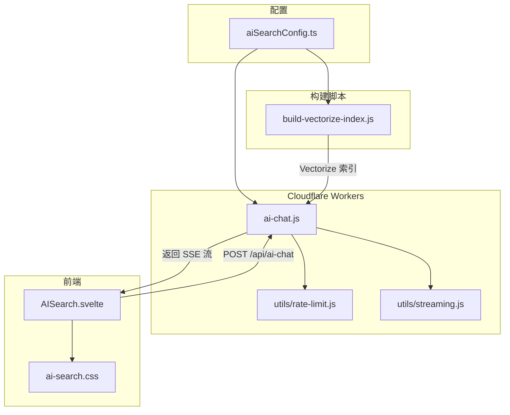
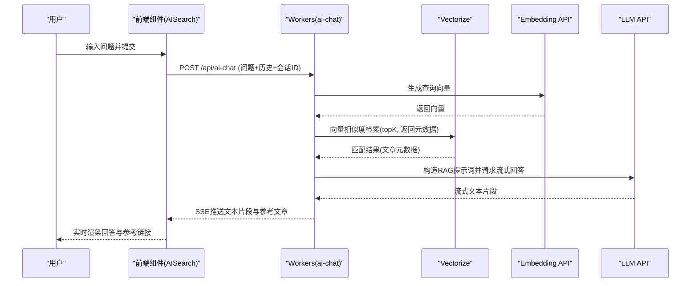
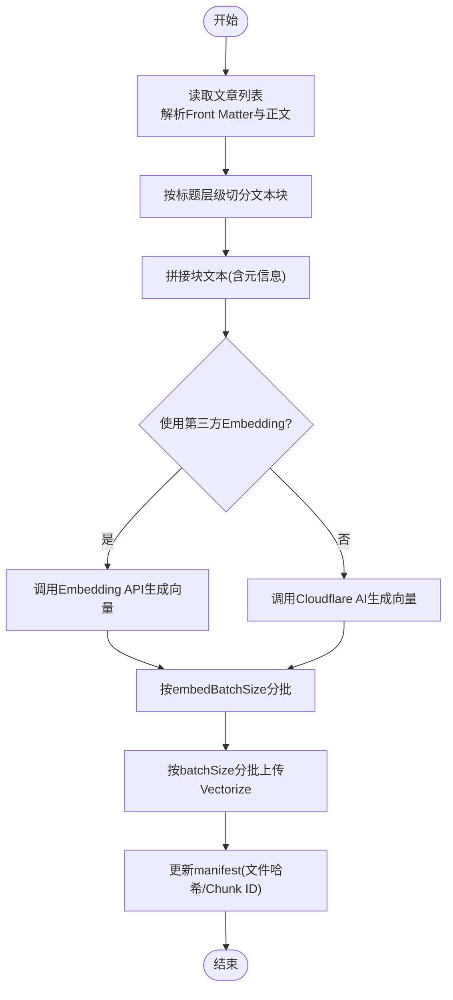
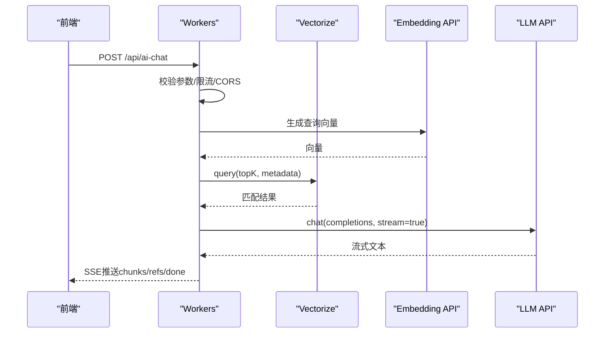
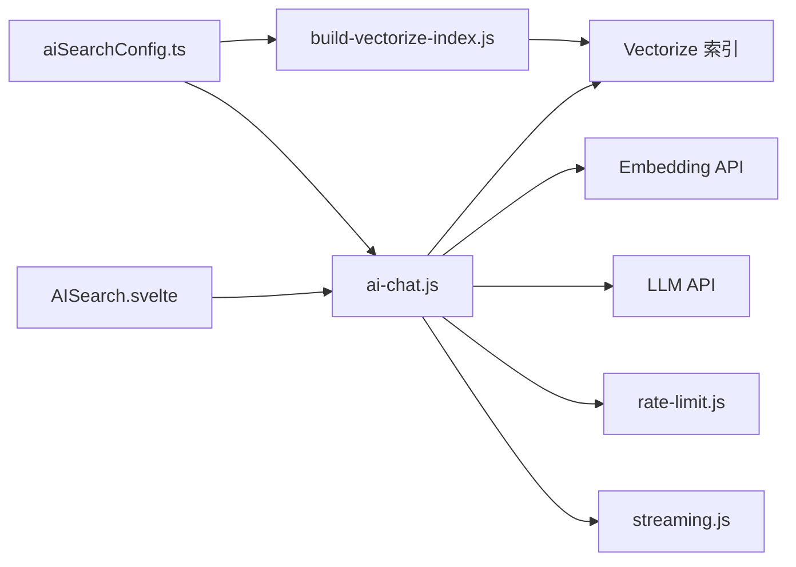

# AI智能搜索

<cite>
**本文引用的文件**
- [src/config/aiSearchConfig.ts](file://src/config/aiSearchConfig.ts)
- [scripts/build-vectorize-index.js](file://scripts/build-vectorize-index.js)
- [src/workers/ai-chat.js](file://src/workers/ai-chat.js)
- [src/components/controls/AISearch.svelte](file://src/components/controls/AISearch.svelte)
- [src/workers/utils/rate-limit.js](file://src/workers/utils/rate-limit.js)
- [src/workers/utils/streaming.js](file://src/workers/utils/streaming.js)
- [src/styles/components/ai-search.css](file://src/styles/components/ai-search.css)
</cite>

## 目录
1. [简介](#简介)
2. [项目结构](#项目结构)
3. [核心组件](#核心组件)
4. [架构总览](#架构总览)
5. [详细组件分析](#详细组件分析)
6. [依赖关系分析](#依赖关系分析)
7. [性能考虑](#性能考虑)
8. [故障排查指南](#故障排查指南)
9. [结论](#结论)
10. [附录](#附录)

## 简介
本文件面向Firefly-Mod博客系统的AI智能搜索功能，围绕基于Cloudflare Vectorize的向量检索与RAG（检索增强生成）实现进行系统化技术说明。内容涵盖：
- 向量搜索架构与RAG流程
- AI搜索配置参数与参数含义
- 向量索引构建流程（内容提取、文本切分、向量化、索引上传）
- Cloudflare Workers侧AI聊天机器人实现（请求处理、上下文管理、响应生成、流式传输）
- 性能优化策略（缓存、查询优化、响应时间控制）
- 调试方法、错误处理与监控指标
- 第三方LLM与Embedding服务集成、API密钥管理与成本控制

## 项目结构
AI搜索相关模块分布于配置、构建脚本、Worker、前端组件与样式文件中，形成“配置驱动 + 构建索引 + 云端推理”的闭环。

图表来源
- [src/config/aiSearchConfig.ts:1-30](file://src/config/aiSearchConfig.ts#L1-L30)
- [scripts/build-vectorize-index.js:1-388](file://scripts/build-vectorize-index.js#L1-L388)
- [src/workers/ai-chat.js:1-397](file://src/workers/ai-chat.js#L1-L397)
- [src/components/controls/AISearch.svelte:1-594](file://src/components/controls/AISearch.svelte#L1-L594)
- [src/workers/utils/rate-limit.js:1-46](file://src/workers/utils/rate-limit.js#L1-L46)
- [src/workers/utils/streaming.js:1-33](file://src/workers/utils/streaming.js#L1-L33)

章节来源
- [src/config/aiSearchConfig.ts:1-30](file://src/config/aiSearchConfig.ts#L1-L30)
- [scripts/build-vectorize-index.js:1-388](file://scripts/build-vectorize-index.js#L1-L388)
- [src/workers/ai-chat.js:1-397](file://src/workers/ai-chat.js#L1-L397)
- [src/components/controls/AISearch.svelte:1-594](file://src/components/controls/AISearch.svelte#L1-L594)
- [src/workers/utils/rate-limit.js:1-46](file://src/workers/utils/rate-limit.js#L1-L46)
- [src/workers/utils/streaming.js:1-33](file://src/workers/utils/streaming.js#L1-L33)

## 核心组件
- 配置中心：统一管理API地址、模型名、Embedding模型、向量维度、批大小、索引名等参数，供前端、构建脚本与Worker共享。
- 构建脚本：读取文章内容，按标题层级切分，生成Embedding，批量上传至Vectorize索引。
- Workers AI聊天：接收前端请求，执行向量检索、构造RAG提示词、调用第三方或Cloudflare AI模型，以SSE流式返回结果。
- 前端组件：提供聊天UI、会话管理、输入限制、流式渲染与参考文章展示。
- 工具模块：限流与流式读取，保障并发与稳定性。

章节来源
- [src/config/aiSearchConfig.ts:8-29](file://src/config/aiSearchConfig.ts#L8-L29)
- [scripts/build-vectorize-index.js:192-222](file://scripts/build-vectorize-index.js#L192-L222)
- [src/workers/ai-chat.js:73-121](file://src/workers/ai-chat.js#L73-L121)
- [src/components/controls/AISearch.svelte:233-348](file://src/components/controls/AISearch.svelte#L233-L348)

## 架构总览
整体采用“离线构建索引 + 在线RAG推理”的架构。构建阶段将博客内容切分为可检索的文本块并生成向量，存储于Vectorize；在线阶段，用户提问经Workers处理，先检索相似内容，再结合系统提示词与历史对话生成回答并通过SSE流式返回。

图表来源
- [src/components/controls/AISearch.svelte:270-324](file://src/components/controls/AISearch.svelte#L270-L324)
- [src/workers/ai-chat.js:254-389](file://src/workers/ai-chat.js#L254-L389)
- [src/workers/ai-chat.js:73-121](file://src/workers/ai-chat.js#L73-L121)

## 详细组件分析

### 配置中心（aiSearchConfig）
- 关键参数
  - apiUrl：第三方AI服务的基础URL
  - modelName：对话模型名（用于RAG提示词中的模型标识）
  - embeddingModel：Embedding模型名（用于向量生成）
  - vectorizeDim：向量维度（需与Vectorize索引一致）
  - batchSize：向量上传批大小
  - embedBatchSize：Embedding请求批大小
  - indexName：Vectorize索引名称
- 作用：统一前后端与构建脚本的配置，确保各环节参数一致。

章节来源
- [src/config/aiSearchConfig.ts:8-29](file://src/config/aiSearchConfig.ts#L8-L29)

### 向量索引构建流程（build-vectorize-index.js）
- 内容提取与切分
  - 读取Markdown文章，解析Front Matter与正文
  - 按标题层级（h1-h4）切分为多个文本块，每个块包含文章元信息与片段正文
- 向量化
  - 支持两种路径：
    - 第三方Embedding API：通过配置的apiUrl与embeddingModel生成向量
    - Cloudflare Workers AI：使用内置模型生成向量
  - 输出固定维度向量数组
- 索引上传与增量更新
  - 创建/删除/清空索引（可强制重建）
  - 增量更新：基于manifest记录的文件哈希与chunk ID，仅对新增/变更文章执行删除旧chunk并插入新chunk
  - 批量上传：按batchSize分批插入，避免单次请求过大
- 元数据存储
  - 存储文章标题、路径、发布时间、分类、标签、章节标题、摘要等，便于检索后展示与去重

图表来源
- [scripts/build-vectorize-index.js:100-188](file://scripts/build-vectorize-index.js#L100-L188)
- [scripts/build-vectorize-index.js:192-222](file://scripts/build-vectorize-index.js#L192-L222)
- [scripts/build-vectorize-index.js:226-273](file://scripts/build-vectorize-index.js#L226-L273)
- [scripts/build-vectorize-index.js:324-385](file://scripts/build-vectorize-index.js#L324-L385)

章节来源
- [scripts/build-vectorize-index.js:100-188](file://scripts/build-vectorize-index.js#L100-L188)
- [scripts/build-vectorize-index.js:192-222](file://scripts/build-vectorize-index.js#L192-L222)
- [scripts/build-vectorize-index.js:226-273](file://scripts/build-vectorize-index.js#L226-L273)
- [scripts/build-vectorize-index.js:324-385](file://scripts/build-vectorize-index.js#L324-L385)

### Cloudflare Workers AI聊天机器人（ai-chat.js）
- 请求处理
  - CORS校验与Origin白名单
  - 限流检查（AI专用阈值）
  - 参数校验（问题必填、长度限制）
- 上下文管理
  - 生成查询向量并调用Vectorize相似度检索，过滤低分匹配
  - 去重相同文章，收集参考文章元数据
  - 构造RAG系统提示词，包含角色设定、检索规则与上下文
  - 限制历史消息数量与长度，避免溢出
- 响应生成与流式传输
  - 第三方模型：SSE格式解析，逐片推送
  - Cloudflare AI：直接透传流
  - 成功后推送“done”标记，异常推送“error”事件
- 错误处理
  - 统一捕获并返回JSON错误体
  - 对429/配额不足进行友好提示

图表来源
- [src/workers/ai-chat.js:199-396](file://src/workers/ai-chat.js#L199-L396)
- [src/workers/ai-chat.js:254-389](file://src/workers/ai-chat.js#L254-L389)

章节来源
- [src/workers/ai-chat.js:199-396](file://src/workers/ai-chat.js#L199-L396)
- [src/workers/ai-chat.js:254-389](file://src/workers/ai-chat.js#L254-L389)

### 前端AI聊天组件（AISearch.svelte）
- 交互与状态
  - 会话管理：本地存储会话列表与消息，支持新建、切换、删除
  - 输入限制：最大字符数限制，支持拖拽调整输入框高度
  - 流式渲染：SSE事件解析，增量追加文本，首屏加载动画
  - 参考文章：展示检索到的相关文章链接与发布日期
- 错误处理
  - 对429/配额不足进行用户友好提示
  - 其他错误显示简要提示并记录日志

章节来源
- [src/components/controls/AISearch.svelte:19-168](file://src/components/controls/AISearch.svelte#L19-L168)
- [src/components/controls/AISearch.svelte:233-348](file://src/components/controls/AISearch.svelte#L233-L348)
- [src/styles/components/ai-search.css:1-1040](file://src/styles/components/ai-search.css#L1-L1040)

### 工具模块
- 限流（rate-limit.js）
  - 基于KV的滑动窗口限流，AI专用阈值与窗口
- 流式读取（streaming.js）
  - 解析第三方SSE响应，逐片产出文本
  - 透传Cloudflare AI流

章节来源
- [src/workers/utils/rate-limit.js:1-46](file://src/workers/utils/rate-limit.js#L1-L46)
- [src/workers/utils/streaming.js:1-33](file://src/workers/utils/streaming.js#L1-L33)

## 依赖关系分析
- 配置依赖：构建脚本与Workers均依赖aiSearchConfig中的非敏感参数
- 运行时依赖：Workers依赖Vectorize、Embedding API与LLM API；前端依赖Workers提供的SSE接口
- 并发与稳定性：通过限流与流式传输降低峰值压力

图表来源
- [src/config/aiSearchConfig.ts:1-30](file://src/config/aiSearchConfig.ts#L1-L30)
- [scripts/build-vectorize-index.js:1-388](file://scripts/build-vectorize-index.js#L1-L388)
- [src/workers/ai-chat.js:1-397](file://src/workers/ai-chat.js#L1-L397)
- [src/components/controls/AISearch.svelte:1-594](file://src/components/controls/AISearch.svelte#L1-L594)
- [src/workers/utils/rate-limit.js:1-46](file://src/workers/utils/rate-limit.js#L1-L46)
- [src/workers/utils/streaming.js:1-33](file://src/workers/utils/streaming.js#L1-L33)

章节来源
- [src/config/aiSearchConfig.ts:1-30](file://src/config/aiSearchConfig.ts#L1-L30)
- [scripts/build-vectorize-index.js:1-388](file://scripts/build-vectorize-index.js#L1-L388)
- [src/workers/ai-chat.js:1-397](file://src/workers/ai-chat.js#L1-L397)
- [src/components/controls/AISearch.svelte:1-594](file://src/components/controls/AISearch.svelte#L1-L594)
- [src/workers/utils/rate-limit.js:1-46](file://src/workers/utils/rate-limit.js#L1-L46)
- [src/workers/utils/streaming.js:1-33](file://src/workers/utils/streaming.js#L1-L33)

## 性能考虑
- 向量维度与索引
  - 确保aiSearchConfig中的vectorizeDim与Vectorize索引维度一致，避免运行时报错
  - 使用余弦距离（metric: cosine）提升检索效果
- 批处理与并发
  - 构建阶段：embedBatchSize与batchSize分别控制Embedding请求与上传批大小，平衡吞吐与稳定性
  - 在线阶段：限流（AI_RATE_LIMIT_MAX/AI_RATE_LIMIT_WINDOW）防止突发流量压垮上游服务
- 流式传输
  - Workers侧使用TransformStream与SSE，前端逐片渲染，降低首屏等待时间
- 缓存与去重
  - 增量更新基于manifest与chunk ID去重，避免重复上传
  - 前端会话本地持久化，减少重复请求
- 查询优化
  - topK与分数阈值（如score < 0.2过滤）控制召回规模与质量
  - 历史消息截断（slice(-6)）与长度限制（每条<=2000字符）避免上下文膨胀

章节来源
- [src/config/aiSearchConfig.ts:18-29](file://src/config/aiSearchConfig.ts#L18-L29)
- [scripts/build-vectorize-index.js:226-273](file://scripts/build-vectorize-index.js#L226-L273)
- [src/workers/utils/rate-limit.js:1-7](file://src/workers/utils/rate-limit.js#L1-L7)
- [src/workers/ai-chat.js:254-311](file://src/workers/ai-chat.js#L254-L311)

## 故障排查指南
- 环境变量缺失
  - 构建脚本：CLOUDFLARE_API_TOKEN、CLOUDFLARE_ACCOUNT_ID为必需；第三方Embedding需AI_API_KEY
  - Workers：AI_API_KEY、ALLOWED_ORIGINS/PUBLIC_SITE_URL（用于CORS）
- 常见错误与定位
  - 429/配额不足：前端检测到相关错误码时提示“收藏的token被用光”，可在配置中切换更稳定的模型或服务
  - CORS错误：检查ALLOWED_ORIGINS与PUBLIC_SITE_URL，确保Origin在白名单内
  - Vectorize错误：确认索引存在且维度一致；查看删除/插入接口返回的错误文本
  - 流式解析异常：检查第三方SSE格式是否符合预期，必要时切换为Cloudflare AI模型
- 日志与监控
  - Workers内部统一捕获并记录错误；前端对关键错误进行用户提示
  - 建议在Cloudflare仪表盘查看请求量、错误率与响应时间趋势

章节来源
- [scripts/build-vectorize-index.js:74-77](file://scripts/build-vectorize-index.js#L74-L77)
- [src/workers/ai-chat.js:200-203](file://src/workers/ai-chat.js#L200-L203)
- [src/components/controls/AISearch.svelte:331-337](file://src/components/controls/AISearch.svelte#L331-L337)

## 结论
该AI智能搜索系统以配置为中心，结合Cloudflare Vectorize与Workers实现“离线构建索引 + 在线RAG推理”的高效方案。通过合理的批处理、流式传输与限流策略，在保证用户体验的同时兼顾成本与稳定性。建议持续关注索引维度一致性、检索阈值与模型切换策略，以进一步提升检索质量与响应速度。

## 附录

### AI搜索配置参数说明
- apiUrl：第三方AI服务基础URL（用于Embedding与Chat Completions）
- modelName：对话模型名（用于提示词中的模型标识）
- embeddingModel：Embedding模型名（用于向量生成）
- vectorizeDim：向量维度（需与Vectorize索引一致）
- batchSize：向量上传批大小
- embedBatchSize：Embedding请求批大小
- indexName：Vectorize索引名称

章节来源
- [src/config/aiSearchConfig.ts:8-29](file://src/config/aiSearchConfig.ts#L8-L29)

### 集成第三方LLM与Embedding服务
- Embedding服务
  - 通过AI_API_KEY与embeddingModel启用第三方Embedding API；注意dimensions与encoding_format
- Chat服务
  - 通过AI_API_KEY与modelName启用第三方Chat Completions；开启stream=true以支持SSE
- Cloudflare Workers AI
  - 未配置第三方API时，默认使用内置模型；可切换不同模型以适配成本与性能

章节来源
- [src/workers/ai-chat.js:54-62](file://src/workers/ai-chat.js#L54-L62)
- [src/workers/ai-chat.js:73-121](file://src/workers/ai-chat.js#L73-L121)
- [scripts/build-vectorize-index.js:67-68](file://scripts/build-vectorize-index.js#L67-L68)
- [scripts/build-vectorize-index.js:192-222](file://scripts/build-vectorize-index.js#L192-L222)

### API密钥管理与成本控制
- 密钥注入
  - 构建脚本：从.env读取AI_API_KEY与Cloudflare凭据
  - Workers：从环境变量读取AI_API_KEY、ALLOWED_ORIGINS、PUBLIC_SITE_URL
- 成本控制建议
  - 控制请求批大小与topK，减少无效召回
  - 切换更经济的模型或服务提供商
  - 启用限流，避免突发流量导致的高额费用

章节来源
- [scripts/build-vectorize-index.js:40-58](file://scripts/build-vectorize-index.js#L40-L58)
- [src/workers/ai-chat.js:216-231](file://src/workers/ai-chat.js#L216-L231)