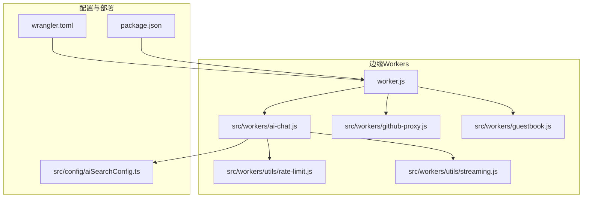
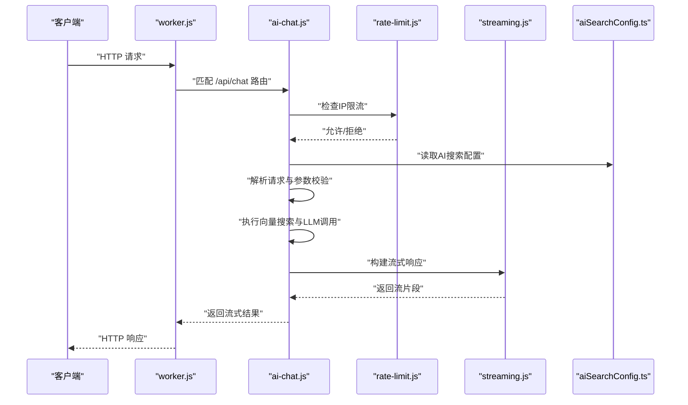
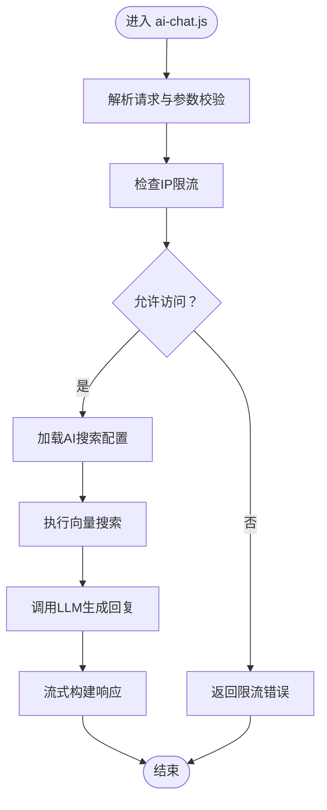
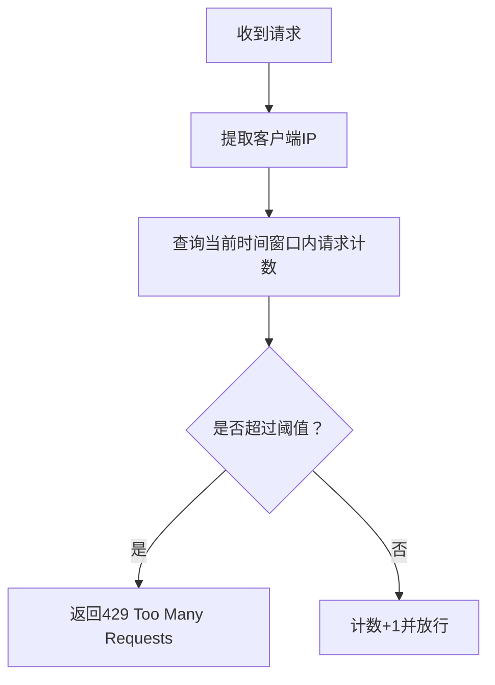
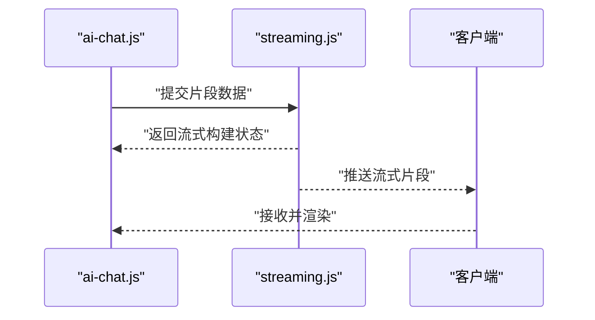
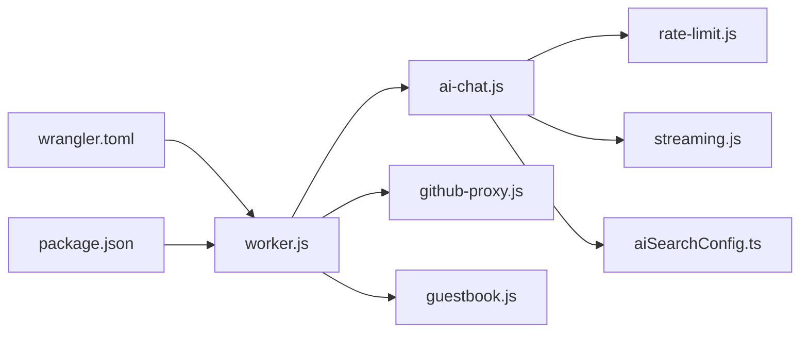

# Cloudflare Workers服务

<cite>
**本文引用的文件**
- [wrangler.toml](file://wrangler.toml)
- [worker.js](file://worker.js)
- [ai-chat.js](file://src/workers/ai-chat.js)
- [rate-limit.js](file://src/workers/utils/rate-limit.js)
- [streaming.js](file://src/workers/utils/streaming.js)
- [github-proxy.js](file://src/workers/github-proxy.js)
- [guestbook.js](file://src/workers/guestbook.js)
- [aiSearchConfig.ts](file://src/config/aiSearchConfig.ts)
- [package.json](file://package.json)
- [README.md](file://README.md)
</cite>

## 目录
1. [简介](#简介)
2. [项目结构](#项目结构)
3. [核心组件](#核心组件)
4. [架构总览](#架构总览)
5. [详细组件分析](#详细组件分析)
6. [依赖关系分析](#依赖关系分析)
7. [性能考量](#性能考量)
8. [故障排查指南](#故障排查指南)
9. [结论](#结论)
10. [附录](#附录)

## 简介
本文件面向Firefly-Mod的Cloudflare Workers AI服务，系统性梳理Workers的架构设计、部署配置、AI聊天机器人实现、限流机制、调试监控、部署流程与成本优化策略。文档以仓库中的实际代码为依据，避免臆测，确保可操作性与准确性。

## 项目结构
该项目采用Astro静态站点生成与Workers边缘计算相结合的架构。Workers位于src/workers目录，包含AI聊天、GitHub代理与留言簿等边缘服务；主入口worker.js负责路由与请求分发；wrangler.toml定义部署与环境变量；AI搜索配置位于src/config/aiSearchConfig.ts。

**图表来源**
- [worker.js](file://worker.js)
- [ai-chat.js](file://src/workers/ai-chat.js)
- [github-proxy.js](file://src/workers/github-proxy.js)
- [guestbook.js](file://src/workers/guestbook.js)
- [rate-limit.js](file://src/workers/utils/rate-limit.js)
- [streaming.js](file://src/workers/utils/streaming.js)
- [aiSearchConfig.ts](file://src/config/aiSearchConfig.ts)
- [wrangler.toml](file://wrangler.toml)
- [package.json](file://package.json)

**章节来源**
- [worker.js](file://worker.js)
- [wrangler.toml](file://wrangler.toml)
- [aiSearchConfig.ts](file://src/config/aiSearchConfig.ts)
- [package.json](file://package.json)

## 核心组件
- 边缘入口与路由：worker.js集中处理请求，按路径分发到不同Workers模块（如AI聊天、GitHub代理、留言簿）。
- AI聊天服务：ai-chat.js负责请求解析、参数校验、向量搜索调用、响应构建与错误处理，并集成限流与流式输出。
- 限流工具：rate-limit.js提供基于IP的速率限制能力，防止滥用。
- 流式输出：streaming.js封装流式响应构建，提升用户体验。
- GitHub代理：github-proxy.js作为反向代理，处理跨域与鉴权转发。
- 留言簿：guestbook.js提供留言簿相关的边缘处理逻辑。
- 配置中心：aiSearchConfig.ts集中管理AI搜索相关参数与索引配置。

**章节来源**
- [worker.js](file://worker.js)
- [ai-chat.js](file://src/workers/ai-chat.js)
- [rate-limit.js](file://src/workers/utils/rate-limit.js)
- [streaming.js](file://src/workers/utils/streaming.js)
- [github-proxy.js](file://src/workers/github-proxy.js)
- [guestbook.js](file://src/workers/guestbook.js)
- [aiSearchConfig.ts](file://src/config/aiSearchConfig.ts)

## 架构总览
Workers整体采用“单入口多模块”的边缘计算架构。worker.js作为统一入口，根据请求路径将流量导向对应功能模块；AI聊天模块内部再整合限流与流式输出；配置通过aiSearchConfig.ts集中管理，部署通过wrangler.toml完成。

**图表来源**
- [worker.js](file://worker.js)
- [ai-chat.js](file://src/workers/ai-chat.js)
- [rate-limit.js](file://src/workers/utils/rate-limit.js)
- [streaming.js](file://src/workers/utils/streaming.js)
- [aiSearchConfig.ts](file://src/config/aiSearchConfig.ts)

## 详细组件分析

### AI聊天机器人实现
- 请求解析与参数验证：对入站请求进行结构化解析与必要字段校验，确保后续流程稳定。
- 向量搜索调用：读取aiSearchConfig.ts中的索引与参数，调用Vectorize或外部检索接口，获取上下文。
- LLM调用与响应构建：将上下文与用户问题组合，调用模型接口，结合streaming.js构建流式响应。
- 错误处理：捕获网络异常、超时、格式错误等，返回标准化错误信息并记录日志。
- 安全策略：结合rate-limit.js限制同一IP的请求频率，降低滥用风险。

**图表来源**
- [ai-chat.js](file://src/workers/ai-chat.js)
- [rate-limit.js](file://src/workers/utils/rate-limit.js)
- [streaming.js](file://src/workers/utils/streaming.js)
- [aiSearchConfig.ts](file://src/config/aiSearchConfig.ts)

**章节来源**
- [ai-chat.js](file://src/workers/ai-chat.js)
- [rate-limit.js](file://src/workers/utils/rate-limit.js)
- [streaming.js](file://src/workers/utils/streaming.js)
- [aiSearchConfig.ts](file://src/config/aiSearchConfig.ts)

### 限流机制
- IP维度限流：基于请求来源IP统计单位时间内的请求数，超过阈值则拒绝后续请求。
- 配置灵活：阈值与时间窗口可通过配置调整，兼顾性能与安全。
- 与AI聊天集成：在请求进入AI聊天处理前执行限流判断，避免热点场景被刷爆。

**图表来源**
- [rate-limit.js](file://src/workers/utils/rate-limit.js)
- [ai-chat.js](file://src/workers/ai-chat.js)

**章节来源**
- [rate-limit.js](file://src/workers/utils/rate-limit.js)
- [ai-chat.js](file://src/workers/ai-chat.js)

### 流式输出与响应构建
- 流式响应：通过streaming.js将LLM生成内容分片输出，降低首字节延迟，改善交互体验。
- 结构化输出：保证每一片段符合预期格式，便于前端实时渲染。
- 与AI聊天集成：在AI聊天处理完成后，交由流式工具构建响应体。

**图表来源**
- [ai-chat.js](file://src/workers/ai-chat.js)
- [streaming.js](file://src/workers/utils/streaming.js)

**章节来源**
- [streaming.js](file://src/workers/utils/streaming.js)
- [ai-chat.js](file://src/workers/ai-chat.js)

### GitHub代理与留言簿
- GitHub代理：github-proxy.js负责将特定请求转发至GitHub API，处理鉴权与跨域，减少前端直接暴露凭据的风险。
- 留言簿：guestbook.js提供留言簿相关的边缘处理逻辑，可能涉及缓存、鉴权与数据持久化协调。

**章节来源**
- [github-proxy.js](file://src/workers/github-proxy.js)
- [guestbook.js](file://src/workers/guestbook.js)

## 依赖关系分析
- 入口依赖：worker.js依赖各子Workers模块，形成清晰的职责边界。
- 工具依赖：AI聊天模块依赖限流与流式工具，体现高内聚低耦合的设计。
- 配置依赖：AI聊天模块依赖aiSearchConfig.ts，确保配置集中管理与热更新友好。
- 部署依赖：wrangler.toml定义Workers生命周期、环境变量与触发器；package.json声明运行时与脚本。

**图表来源**
- [worker.js](file://worker.js)
- [ai-chat.js](file://src/workers/ai-chat.js)
- [github-proxy.js](file://src/workers/github-proxy.js)
- [guestbook.js](file://src/workers/guestbook.js)
- [rate-limit.js](file://src/workers/utils/rate-limit.js)
- [streaming.js](file://src/workers/utils/streaming.js)
- [aiSearchConfig.ts](file://src/config/aiSearchConfig.ts)
- [wrangler.toml](file://wrangler.toml)
- [package.json](file://package.json)

**章节来源**
- [worker.js](file://worker.js)
- [wrangler.toml](file://wrangler.toml)
- [package.json](file://package.json)

## 性能考量
- 边缘就近：Workers在Cloudflare全球节点执行，显著降低时延。
- 流式响应：通过streaming.js实现渐进式输出，缩短感知等待时间。
- 限流保护：rate-limit.js在热点场景下保护后端资源，避免雪崩。
- 缓存策略：结合Cloudflare缓存与应用层缓存，减少重复计算与网络往返。
- 并发与资源：合理设置Worker并发上限与内存配额，避免峰值抖动。

## 故障排查指南
- 日志记录：在关键路径添加结构化日志，包含请求ID、用户IP、耗时与错误码，便于定位问题。
- 错误追踪：对网络异常、超时与格式错误进行分类记录，区分上游与应用侧问题。
- 监控指标：关注请求量、错误率、P95/P99延迟与并发队列长度，及时发现异常波动。
- 调试技巧：使用Wrangler本地预览与调试模式，模拟真实环境；对AI聊天模块增加开关以便快速降级。
- 常见问题：限流导致的429、向量索引不可用、LLM接口超时、跨域失败等，分别对应限流配置、索引健康检查、超时重试与代理配置。

## 结论
该Workers架构以worker.js为核心入口，围绕AI聊天、代理与留言簿等模块构建，辅以限流与流式输出工具，形成高可用、低时延的边缘服务能力。通过集中配置与标准化部署，具备良好的可维护性与扩展性。建议持续完善监控告警与灰度发布流程，进一步提升稳定性与可观测性。

## 附录

### 部署流程
- 本地开发：使用Wrangler提供的本地预览与调试命令，验证路由与模块行为。
- 测试环境：在测试环境中配置独立的Vectorize索引与LLM密钥，隔离风险。
- 生产部署：通过wrangler.toml完成Workers部署，设置环境变量与触发器；使用版本标签管理发布。
- 版本管理：以Git标签或分支管理部署版本，配合回滚策略与灰度发布。

**章节来源**
- [wrangler.toml](file://wrangler.toml)
- [worker.js](file://worker.js)
- [package.json](file://package.json)

### 环境变量与安全策略
- 环境变量：在wrangler.toml中定义敏感配置（如API密钥、索引ID），避免硬编码。
- 安全策略：启用IP白名单、请求签名与速率限制；对LLM接口使用HTTPS与超时控制；最小权限原则管理密钥轮换。

**章节来源**
- [wrangler.toml](file://wrangler.toml)
- [ai-chat.js](file://src/workers/ai-chat.js)

### 成本优化与最佳实践
- 降低冷启动：保持Worker体积适中，避免不必要的依赖；利用预热与常驻实例策略。
- 控制带宽：对静态资源使用CDN缓存，对动态响应启用压缩与流式输出。
- 合理限流：根据业务峰值设定阈值，避免过度限制影响体验。
- 监控与告警：建立关键指标监控，设置阈值告警，快速响应异常。
- 配置即代码：将部署配置与代码一并版本化，确保可追溯与可复现。