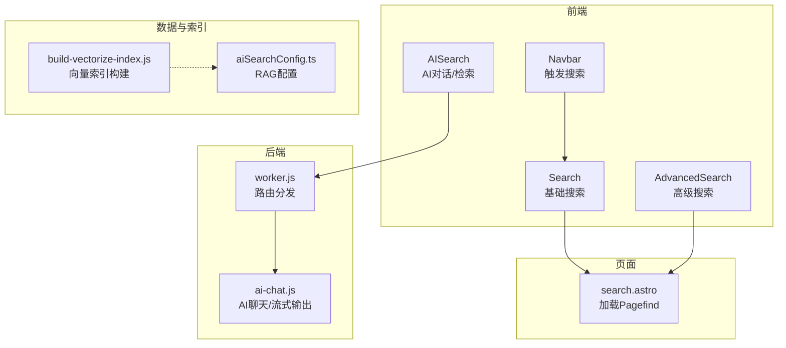
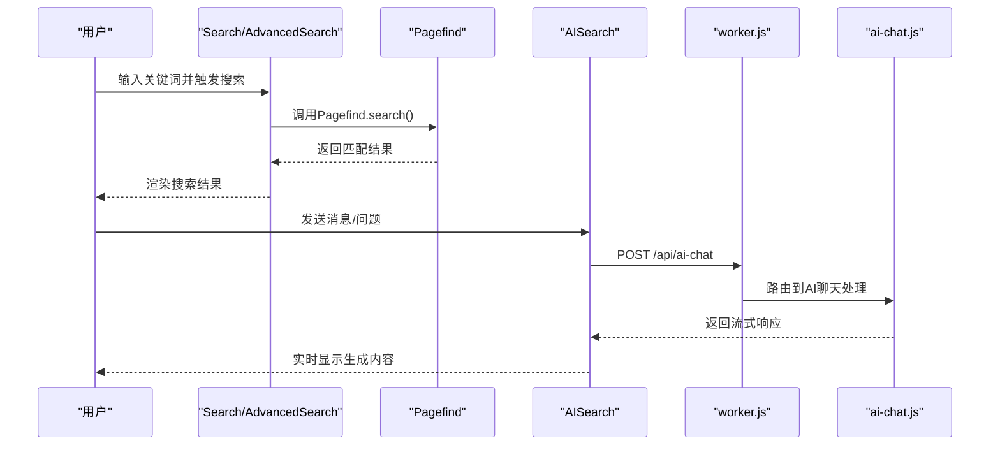
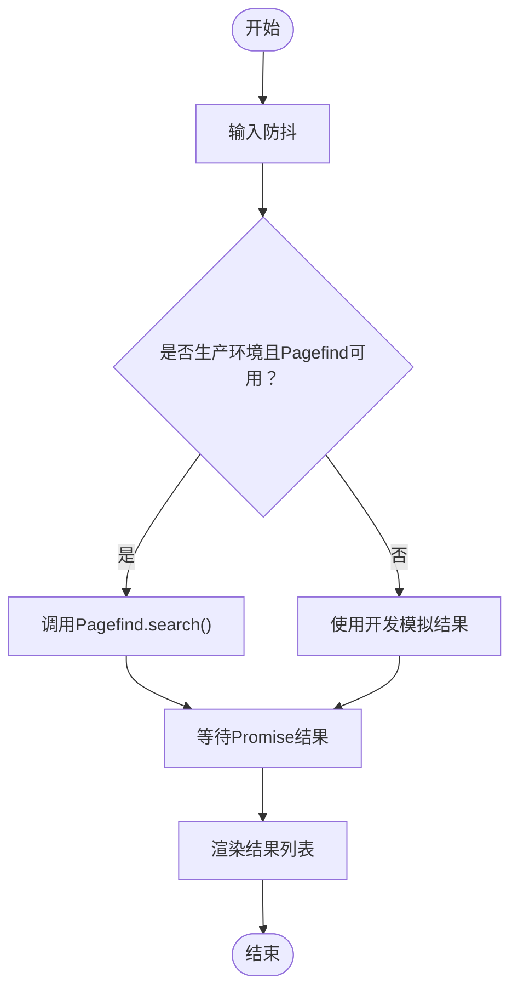
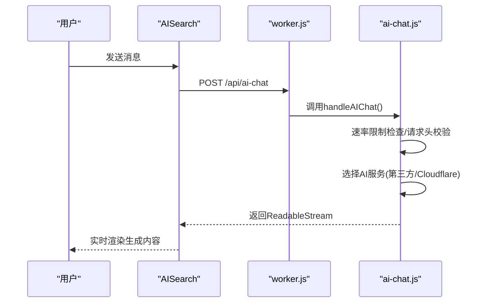
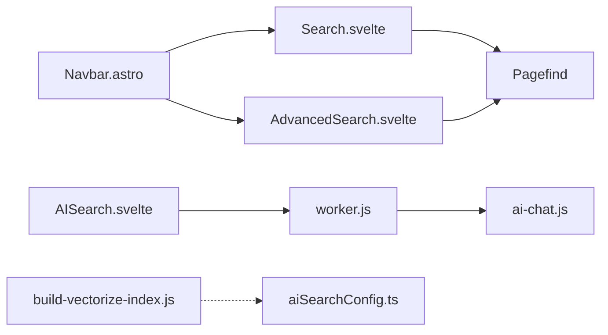

# RAG检索增强生成

<cite>
**本文引用的文件**
- [src/components/controls/AISearch.svelte](file://src/components/controls/AISearch.svelte)
- [src/worker.js](file://src/worker.js)
- [src/workers/ai-chat.js](file://src/workers/ai-chat.js)
- [src/components/controls/Search.svelte](file://src/components/controls/Search.svelte)
- [src/components/pages/AdvancedSearch.svelte](file://src/components/pages/AdvancedSearch.svelte)
- [src/pages/search.astro](file://src/pages/search.astro)
- [src/components/layout/Navbar.astro](file://src/components/layout/Navbar.astro)
- [scripts/build-vectorize-index.js](file://scripts/build-vectorize-index.js)
- [src/config/aiSearchConfig.ts](file://src/config/aiSearchConfig.ts)
</cite>

## 目录
1. [简介](#简介)
2. [项目结构](#项目结构)
3. [核心组件](#核心组件)
4. [架构总览](#架构总览)
5. [详细组件分析](#详细组件分析)
6. [依赖关系分析](#依赖关系分析)
7. [性能考虑](#性能考虑)
8. [故障排查指南](#故障排查指南)
9. [结论](#结论)
10. [附录](#附录)

## 简介
本文件面向Firefly-Mod博客项目的RAG（检索增强生成）系统，聚焦“查询理解—相关文档检索—上下文构建—生成式回答”的完整流程。当前仓库中并未直接实现“向量检索+相似度搜索”的RAG管道，而是采用Pagefind全文检索与Cloudflare Workers上的AI聊天接口组合的方式。本文将据此梳理现有实现，并给出RAG系统的设计建议、上下文管理机制、配置项说明、性能优化策略以及常见问题处理方案。

## 项目结构
围绕RAG的关键路径包括：
- 前端交互层：搜索输入与结果展示（Search、AdvancedSearch、Navbar）
- 页面入口：搜索页面加载与Pagefind初始化（search.astro）
- AI聊天后端：Workers路由与AI聊天逻辑（worker.js、ai-chat.js）
- 向量索引构建：脚本用于生成向量索引（build-vectorize-index.js）
- RAG配置：RAG相关参数配置（aiSearchConfig.ts）

图表来源
- [src/components/layout/Navbar.astro:270-276](file://src/components/layout/Navbar.astro#L270-L276)
- [src/components/controls/Search.svelte:1-144](file://src/components/controls/Search.svelte#L1-L144)
- [src/components/pages/AdvancedSearch.svelte:45-137](file://src/components/pages/AdvancedSearch.svelte#L45-L137)
- [src/pages/search.astro:1-42](file://src/pages/search.astro#L1-L42)
- [src/worker.js:1-26](file://src/worker.js#L1-L26)
- [src/workers/ai-chat.js:95-220](file://src/workers/ai-chat.js#L95-L220)
- [scripts/build-vectorize-index.js](file://scripts/build-vectorize-index.js)
- [src/config/aiSearchConfig.ts](file://src/config/aiSearchConfig.ts)

章节来源
- [src/components/layout/Navbar.astro:270-276](file://src/components/layout/Navbar.astro#L270-L276)
- [src/components/controls/Search.svelte:1-144](file://src/components/controls/Search.svelte#L1-L144)
- [src/components/pages/AdvancedSearch.svelte:45-137](file://src/components/pages/AdvancedSearch.svelte#L45-L137)
- [src/pages/search.astro:1-42](file://src/pages/search.astro#L1-L42)
- [src/worker.js:1-26](file://src/worker.js#L1-L26)
- [src/workers/ai-chat.js:95-220](file://src/workers/ai-chat.js#L95-L220)
- [scripts/build-vectorize-index.js](file://scripts/build-vectorize-index.js)
- [src/config/aiSearchConfig.ts](file://src/config/aiSearchConfig.ts)

## 核心组件
- 搜索前端组件：负责用户输入、防抖、调用Pagefind进行全文检索，并渲染结果。
- 搜索页面：按需动态加载Pagefind脚本，初始化并触发搜索。
- AI聊天组件：提供对话式交互，支持流式输出与会话管理。
- Workers路由与AI聊天：统一处理AI聊天请求，支持第三方API与Cloudflare AI。
- 向量索引构建脚本：用于生成向量索引（为未来RAG向量检索做准备）。
- RAG配置：集中管理RAG相关参数（如检索窗口、生成参数等）。

章节来源
- [src/components/controls/Search.svelte:1-144](file://src/components/controls/Search.svelte#L1-L144)
- [src/components/pages/AdvancedSearch.svelte:45-137](file://src/components/pages/AdvancedSearch.svelte#L45-L137)
- [src/pages/search.astro:1-42](file://src/pages/search.astro#L1-L42)
- [src/components/controls/AISearch.svelte:318-492](file://src/components/controls/AISearch.svelte#L318-L492)
- [src/worker.js:1-26](file://src/worker.js#L1-L26)
- [src/workers/ai-chat.js:95-220](file://src/workers/ai-chat.js#L95-L220)
- [scripts/build-vectorize-index.js](file://scripts/build-vectorize-index.js)
- [src/config/aiSearchConfig.ts](file://src/config/aiSearchConfig.ts)

## 架构总览
当前实现采用“全文检索 + AI聊天”组合模式：
- 用户通过搜索组件输入关键词，Pagefind返回匹配结果。
- 用户也可通过AI对话组件发起问题，由Workers转发至AI服务，支持流式输出。
- 若需引入RAG，可在现有基础上叠加“向量检索+上下文构建+提示工程”的模块。

图表来源
- [src/components/controls/Search.svelte:91-108](file://src/components/controls/Search.svelte#L91-L108)
- [src/components/pages/AdvancedSearch.svelte:50-71](file://src/components/pages/AdvancedSearch.svelte#L50-L71)
- [src/pages/search.astro:18-41](file://src/pages/search.astro#L18-L41)
- [src/components/controls/AISearch.svelte:318-492](file://src/components/controls/AISearch.svelte#L318-L492)
- [src/worker.js:13-15](file://src/worker.js#L13-L15)
- [src/workers/ai-chat.js:95-220](file://src/workers/ai-chat.js#L95-L220)

## 详细组件分析

### 搜索组件与页面（全文检索）
- Search.svelte：实现输入防抖、调用Pagefind、处理错误与结果渲染。
- AdvancedSearch.svelte：页面级搜索组件，支持从URL读取初始关键词、自动触发搜索。
- search.astro：生产环境按需加载Pagefind脚本并初始化，开发环境使用模拟结果。
- Navbar.astro：导航栏触发搜索面板，间接驱动搜索流程。

图表来源
- [src/components/controls/Search.svelte:91-108](file://src/components/controls/Search.svelte#L91-L108)
- [src/components/pages/AdvancedSearch.svelte:50-71](file://src/components/pages/AdvancedSearch.svelte#L50-L71)
- [src/pages/search.astro:18-41](file://src/pages/search.astro#L18-L41)

章节来源
- [src/components/controls/Search.svelte:1-144](file://src/components/controls/Search.svelte#L1-L144)
- [src/components/pages/AdvancedSearch.svelte:45-137](file://src/components/pages/AdvancedSearch.svelte#L45-L137)
- [src/pages/search.astro:1-42](file://src/pages/search.astro#L1-L42)
- [src/components/layout/Navbar.astro:270-276](file://src/components/layout/Navbar.astro#L270-L276)

### AI聊天组件与Workers（生成式回答）
- AISearch.svelte：维护消息历史、流式接收AI响应、异常处理与会话持久化。
- worker.js：统一路由分发，将/api/ai-chat转发至ai-chat.js。
- ai-chat.js：根据配置选择第三方API或Cloudflare AI，构造流式响应。

图表来源
- [src/components/controls/AISearch.svelte:318-492](file://src/components/controls/AISearch.svelte#L318-L492)
- [src/worker.js:1-26](file://src/worker.js#L1-L26)
- [src/workers/ai-chat.js:95-220](file://src/workers/ai-chat.js#L95-L220)

章节来源
- [src/components/controls/AISearch.svelte:318-492](file://src/components/controls/AISearch.svelte#L318-L492)
- [src/worker.js:1-26](file://src/worker.js#L1-L26)
- [src/workers/ai-chat.js:95-220](file://src/workers/ai-chat.js#L95-L220)

### 向量索引构建与RAG配置
- build-vectorize-index.js：向量索引构建脚本（为后续RAG向量检索做准备）。
- aiSearchConfig.ts：集中管理RAG相关配置（如检索窗口、生成参数、安全过滤等）。

章节来源
- [scripts/build-vectorize-index.js](file://scripts/build-vectorize-index.js)
- [src/config/aiSearchConfig.ts](file://src/config/aiSearchConfig.ts)

## 依赖关系分析
- 搜索链路：Navbar -> Search/AdvancedSearch -> search.astro -> Pagefind。
- AI链路：AISearch -> worker.js -> ai-chat.js。
- 数据与索引：build-vectorize-index.js 与 aiSearchConfig.ts 提供RAG基础设施。

图表来源
- [src/components/layout/Navbar.astro:270-276](file://src/components/layout/Navbar.astro#L270-L276)
- [src/components/controls/Search.svelte:1-144](file://src/components/controls/Search.svelte#L1-L144)
- [src/components/pages/AdvancedSearch.svelte:45-137](file://src/components/pages/AdvancedSearch.svelte#L45-L137)
- [src/pages/search.astro:1-42](file://src/pages/search.astro#L1-L42)
- [src/components/controls/AISearch.svelte:318-492](file://src/components/controls/AISearch.svelte#L318-L492)
- [src/worker.js:1-26](file://src/worker.js#L1-L26)
- [src/workers/ai-chat.js:95-220](file://src/workers/ai-chat.js#L95-L220)
- [scripts/build-vectorize-index.js](file://scripts/build-vectorize-index.js)
- [src/config/aiSearchConfig.ts](file://src/config/aiSearchConfig.ts)

章节来源
- [src/components/layout/Navbar.astro:270-276](file://src/components/layout/Navbar.astro#L270-L276)
- [src/components/controls/Search.svelte:1-144](file://src/components/controls/Search.svelte#L1-L144)
- [src/components/pages/AdvancedSearch.svelte:45-137](file://src/components/pages/AdvancedSearch.svelte#L45-L137)
- [src/pages/search.astro:1-42](file://src/pages/search.astro#L1-L42)
- [src/components/controls/AISearch.svelte:318-492](file://src/components/controls/AISearch.svelte#L318-L492)
- [src/worker.js:1-26](file://src/worker.js#L1-L26)
- [src/workers/ai-chat.js:95-220](file://src/workers/ai-chat.js#L95-L220)
- [scripts/build-vectorize-index.js](file://scripts/build-vectorize-index.js)
- [src/config/aiSearchConfig.ts](file://src/config/aiSearchConfig.ts)

## 性能考虑
- 搜索性能
  - 输入防抖：减少高频请求，降低Pagefind负载。
  - 条件加载：生产环境按需加载Pagefind脚本，避免开发环境开销。
  - 结果截断：通过Pagefind的excerptLength等参数控制摘要长度，平衡信息密度与渲染性能。
- 生成性能
  - 流式输出：ai-chat.js返回ReadableStream，前端逐步渲染，降低首帧延迟。
  - 速率限制：worker.js中对AI聊天进行限流，防止突发流量压垮上游服务。
- 上下文管理
  - 历史对话维护：AISearch.svelte维护消息数组，支持会话持久化。
  - 截断与计数：结合aiSearchConfig.ts中的上下文窗口参数，对历史消息进行裁剪与令牌计数控制。
- 缓存与并行
  - 建议：对Pagefind结果与AI响应进行短期缓存；对多轮检索可并行预取候选集，再进行重排序。

## 故障排查指南
- 搜索无结果或报错
  - 确认Pagefind脚本加载状态与事件监听是否正确触发。
  - 检查search.astro与AdvancedSearch.svelte中的初始化逻辑与错误捕获。
- AI聊天异常
  - 检查worker.js路由是否命中/api/ai-chat。
  - 核对ai-chat.js中的请求头校验、速率限制与第三方API配置。
  - 关注AISearch.svelte中的流式解析与异常分支（如429/配额不足）。
- 上下文过长
  - 在aiSearchConfig.ts中调整上下文窗口大小与截断策略。
  - 对历史消息进行摘要或关键信息提取，减少冗余。
- 生成质量不达标
  - 优化提示词模板与角色设定（PERSONA），确保指令清晰、边界明确。
  - 引入外部检索模块后，对检索到的片段进行重排序与去重。

章节来源
- [src/pages/search.astro:18-41](file://src/pages/search.astro#L18-L41)
- [src/components/pages/AdvancedSearch.svelte:50-71](file://src/components/pages/AdvancedSearch.svelte#L50-L71)
- [src/worker.js:13-15](file://src/worker.js#L13-L15)
- [src/workers/ai-chat.js:95-220](file://src/workers/ai-chat.js#L95-L220)
- [src/components/controls/AISearch.svelte:318-492](file://src/components/controls/AISearch.svelte#L318-L492)
- [src/config/aiSearchConfig.ts](file://src/config/aiSearchConfig.ts)

## 结论
当前仓库实现了“全文检索 + AI聊天”的组合能力，具备良好的可扩展性。若要升级为完整的RAG系统，建议：
- 引入向量检索：基于build-vectorize-index.js生成的索引，实现相似度搜索与重排序。
- 强化上下文管理：在aiSearchConfig.ts中定义检索窗口、截断策略与令牌计数阈值。
- 优化提示工程：完善角色设定与提示词模板，提升生成稳定性与准确性。
- 性能与可靠性：结合流式输出、缓存与并行策略，保障响应时间与用户体验。

## 附录
- RAG系统配置要点（示例维度）
  - 检索参数：top_k、相似度阈值、重排序策略
  - 上下文管理：最大上下文长度、历史保留策略、摘要抽取
  - 生成参数：温度、最大生成长度、停止符、流式开关
  - 安全过滤：敏感词过滤、内容合规检查
  - 输出格式：Markdown/HTML/纯文本切换
- 建议的RAG管道步骤
  - 查询理解：清洗、实体识别、意图分类
  - 相关文档检索：向量检索、BM25混合检索
  - 上下文构建：去重、排序、截断、拼接
  - 生成式回答：提示注入、流式生成、后处理
- 常见问题处理
  - 检索失败：回退到全文检索或扩大候选集
  - 上下文过长：压缩历史、启用摘要、动态窗口
  - 生成质量不达标：调整提示词、增加示例、引入外部校验