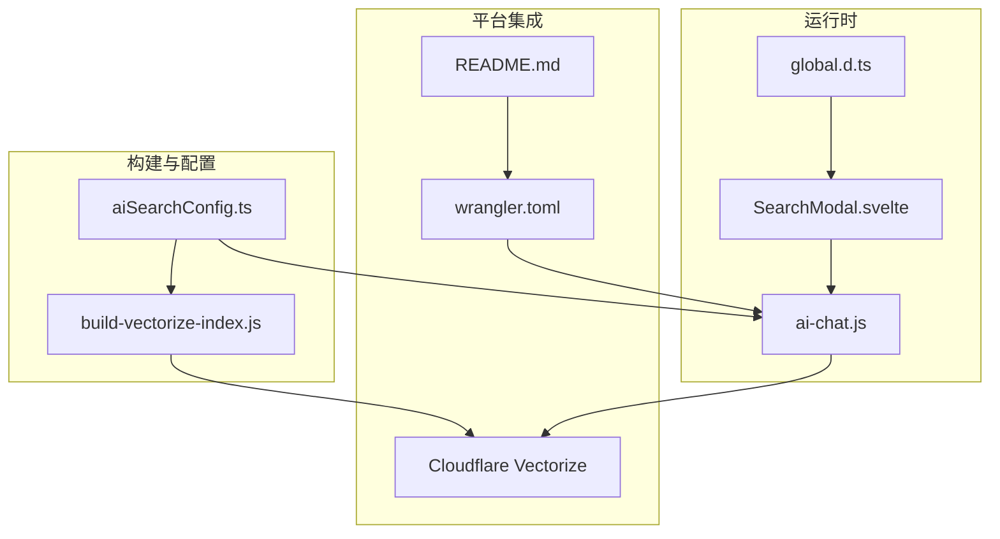
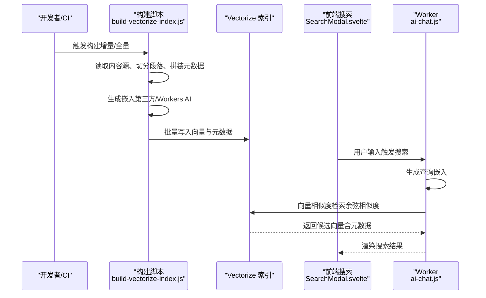
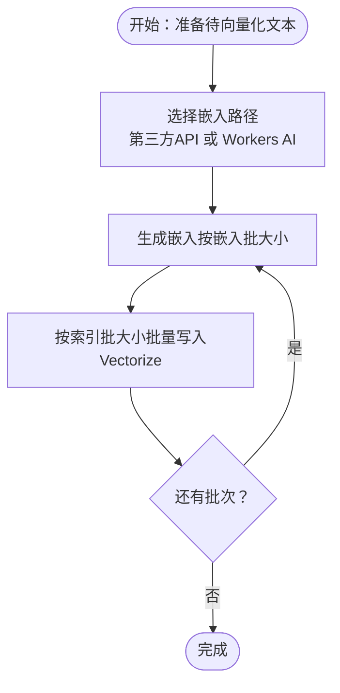
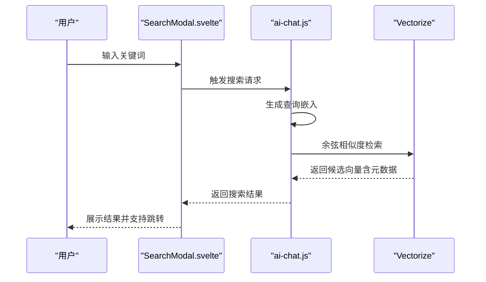
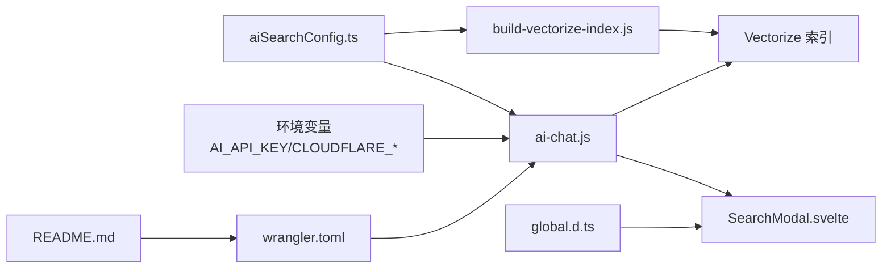

# 向量搜索架构

<cite>
**本文档引用的文件**
- [build-vectorize-index.js](file://scripts/build-vectorize-index.js)
- [aiSearchConfig.ts](file://src/config/aiSearchConfig.ts)
- [ai-chat.js](file://src/workers/ai-chat.js)
- [SearchModal.svelte](file://src/components/controls/SearchModal.svelte)
- [README.md](file://README.md)
- [wrangler.toml](file://wrangler.toml)
- [global.d.ts](file://src/global.d.ts)
</cite>

## 目录
1. [简介](#简介)
2. [项目结构](#项目结构)
3. [核心组件](#核心组件)
4. [架构总览](#架构总览)
5. [详细组件分析](#详细组件分析)
6. [依赖关系分析](#依赖关系分析)
7. [性能考量](#性能考量)
8. [故障排查指南](#故障排查指南)
9. [结论](#结论)
10. [附录](#附录)

## 简介
本文件面向Firefly-Mod项目的向量搜索架构，聚焦于基于Cloudflare Vectorize的向量数据库设计与实现。内容涵盖向量嵌入模型选择与配置、向量维度设置、相似度计算方法（余弦相似度）、向量索引构建流程（内容提取、文本预处理、分词与句子分割、向量化、批量插入）、存储优化策略（索引类型、分区与查询优化）、配置参数说明（topK、相似度阈值、过滤条件），以及性能基准测试与调优建议。

## 项目结构
围绕向量搜索的关键文件分布如下：
- 构建脚本：scripts/build-vectorize-index.js，负责从内容源切分、生成嵌入、上传至Vectorize索引
- 配置中心：src/config/aiSearchConfig.ts，统一存放API地址、模型名、向量维度、批大小、索引名等
- Worker：src/workers/ai-chat.js，封装嵌入生成、第三方API适配、请求路由与限流
- 前端搜索：src/components/controls/SearchModal.svelte，提供搜索交互与结果展示
- 文档与部署：README.md、wrangler.toml，提供部署与索引创建指引
- 类型定义：src/global.d.ts，定义搜索结果结构

图表来源
- [build-vectorize-index.js:1-284](file://scripts/build-vectorize-index.js#L1-L284)
- [aiSearchConfig.ts:1-29](file://src/config/aiSearchConfig.ts#L1-L29)
- [ai-chat.js:1-100](file://src/workers/ai-chat.js#L1-L100)
- [SearchModal.svelte:200-306](file://src/components/controls/SearchModal.svelte#L200-L306)
- [README.md:138-181](file://README.md#L138-L181)
- [wrangler.toml](file://wrangler.toml)
- [global.d.ts:90-119](file://src/global.d.ts#L90-L119)

章节来源
- [build-vectorize-index.js:1-284](file://scripts/build-vectorize-index.js#L1-L284)
- [aiSearchConfig.ts:1-29](file://src/config/aiSearchConfig.ts#L1-L29)
- [ai-chat.js:1-100](file://src/workers/ai-chat.js#L1-L100)
- [SearchModal.svelte:200-306](file://src/components/controls/SearchModal.svelte#L200-L306)
- [README.md:138-181](file://README.md#L138-L181)
- [wrangler.toml](file://wrangler.toml)
- [global.d.ts:90-119](file://src/global.d.ts#L90-L119)

## 核心组件
- 配置中心（aiSearchConfig.ts）
  - 定义第三方API地址、对话模型名、嵌入模型名、向量维度、构建批大小、嵌入批大小、索引名称
  - 作用：前端、构建脚本、Worker共享同一份配置，确保一致性
- 构建脚本（build-vectorize-index.js）
  - 读取内容源（Markdown等），按标题切分段落，拼装元数据，生成嵌入，批量上传至Vectorize
  - 支持增量更新与全量重建（通过manifest与--force参数）
- Worker（ai-chat.js）
  - 识别是否使用第三方嵌入API，构造嵌入请求，调用Vectorize进行相似度检索，返回结果
  - 封装限流、跨域、速率限制等运行时逻辑
- 前端搜索（SearchModal.svelte）
  - 提供键盘快捷键、输入防抖、结果列表渲染、点击跳转等交互
- 类型定义（global.d.ts）
  - 定义搜索结果字段，便于前端消费与高亮

章节来源
- [aiSearchConfig.ts:1-29](file://src/config/aiSearchConfig.ts#L1-L29)
- [build-vectorize-index.js:1-284](file://scripts/build-vectorize-index.js#L1-L284)
- [ai-chat.js:1-100](file://src/workers/ai-chat.js#L1-L100)
- [SearchModal.svelte:200-306](file://src/components/controls/SearchModal.svelte#L200-L306)
- [global.d.ts:90-119](file://src/global.d.ts#L90-L119)

## 架构总览
整体架构分为“构建期”和“运行期”两大阶段：
- 构建期：本地或CI执行构建脚本，将内容切分为向量片段，生成嵌入，写入Vectorize索引
- 运行期：前端触发搜索，Worker接收请求，生成查询向量，调用Vectorize检索，返回匹配结果

图表来源
- [build-vectorize-index.js:1-284](file://scripts/build-vectorize-index.js#L1-L284)
- [ai-chat.js:73-96](file://src/workers/ai-chat.js#L73-L96)
- [SearchModal.svelte:200-306](file://src/components/controls/SearchModal.svelte#L200-L306)

## 详细组件分析

### 向量嵌入与索引配置
- 嵌入模型与维度
  - 嵌入模型：由配置中心指定，构建脚本与Worker均读取该配置
  - 维度：与Vectorize索引维度一致，确保向量兼容性
- 相似度计算
  - Vectorize索引创建时采用余弦相似度度量，适合语义检索场景
- 索引名称与命名规范
  - 与配置中心的indexName保持一致，便于部署与运维

章节来源
- [aiSearchConfig.ts:8-29](file://src/config/aiSearchConfig.ts#L8-L29)
- [build-vectorize-index.js:262-273](file://scripts/build-vectorize-index.js#L262-L273)
- [README.md:171-174](file://README.md#L171-L174)

### 内容提取与文本预处理
- 内容源
  - 构建脚本读取内容源（例如Markdown），解析元数据（标题、分类、标签、发布时间等）
- 分段策略
  - 按标题层级切分内容，形成“文章/章节”粒度的片段，提升检索精度
- 元数据拼装
  - 将文章标题、路径、分类、标签、发布时间、章节标题、摘要等拼装为向量文本与元数据
- 唯一ID生成
  - 基于文章slug与章节路径生成短ID，保证向量记录唯一性

章节来源
- [build-vectorize-index.js:160-188](file://scripts/build-vectorize-index.js#L160-L188)
- [build-vectorize-index.js:177-186](file://scripts/build-vectorize-index.js#L177-L186)

### 向量化与批量插入
- 嵌入生成
  - 支持两种路径：第三方API（按配置中心的apiUrl与embeddingModel）或Cloudflare Workers AI
  - 维度与encoding格式在请求中显式声明，确保与索引一致
- 批处理
  - 构建脚本按嵌入批大小分批生成嵌入，再按索引批大小批量写入Vectorize
- 错误处理
  - 对HTTP错误进行状态码检查与错误消息透传，便于定位问题

图表来源
- [build-vectorize-index.js:190-216](file://scripts/build-vectorize-index.js#L190-L216)
- [build-vectorize-index.js:277-284](file://scripts/build-vectorize-index.js#L277-L284)

章节来源
- [build-vectorize-index.js:190-216](file://scripts/build-vectorize-index.js#L190-L216)
- [build-vectorize-index.js:277-284](file://scripts/build-vectorize-index.js#L277-L284)

### 查询与检索（运行期）
- 查询入口
  - 前端搜索框输入触发Worker处理，生成查询向量
- 检索策略
  - Worker调用Vectorize进行向量相似度检索，默认使用余弦相似度
  - 结果包含向量元数据（如文章标题、路径、分类、标签、章节、摘要等）
- 结果渲染
  - 前端根据类型定义渲染标题、摘要、高亮与跳转链接

图表来源
- [SearchModal.svelte:200-306](file://src/components/controls/SearchModal.svelte#L200-L306)
- [ai-chat.js:73-96](file://src/workers/ai-chat.js#L73-L96)
- [global.d.ts:90-119](file://src/global.d.ts#L90-L119)

章节来源
- [SearchModal.svelte:200-306](file://src/components/controls/SearchModal.svelte#L200-L306)
- [ai-chat.js:73-96](file://src/workers/ai-chat.js#L73-L96)
- [global.d.ts:90-119](file://src/global.d.ts#L90-L119)

### 存储优化策略
- 索引类型与度量
  - 采用余弦相似度作为度量方式，适合高维稀疏向量的语义检索
- 维度一致性
  - 嵌入维度与Vectorize索引维度必须一致，否则会报错或检索异常
- 批大小调优
  - 构建脚本的嵌入批大小与索引批大小可独立配置，平衡吞吐与内存占用
- 元数据设计
  - 元数据包含文章标题、路径、分类、标签、发布时间、章节、摘要等，便于前端筛选与高亮

章节来源
- [build-vectorize-index.js:262-273](file://scripts/build-vectorize-index.js#L262-L273)
- [aiSearchConfig.ts:18-29](file://src/config/aiSearchConfig.ts#L18-L29)
- [build-vectorize-index.js:177-186](file://scripts/build-vectorize-index.js#L177-L186)

### 配置参数说明
- 基础配置
  - 第三方API地址、对话模型名、嵌入模型名、向量维度、构建批大小、嵌入批大小、索引名称
- 运行时参数
  - topK：检索返回的候选数量（可在Worker侧控制）
  - 相似度阈值：可结合业务需求在Worker侧对相似度进行过滤
  - 过滤条件：可基于元数据（分类、标签、时间范围等）在Vectorize检索时进行过滤

章节来源
- [aiSearchConfig.ts:8-29](file://src/config/aiSearchConfig.ts#L8-L29)
- [ai-chat.js:44-51](file://src/workers/ai-chat.js#L44-L51)

## 依赖关系分析
- 构建脚本依赖配置中心提供的模型与维度信息
- Worker同时依赖配置中心与环境变量（如第三方API密钥）
- 前端搜索依赖Worker返回的标准化结果类型
- 部署层面依赖wrangler.toml与README中的索引创建步骤

图表来源
- [aiSearchConfig.ts:1-29](file://src/config/aiSearchConfig.ts#L1-L29)
- [build-vectorize-index.js:1-97](file://scripts/build-vectorize-index.js#L1-L97)
- [ai-chat.js:1-51](file://src/workers/ai-chat.js#L1-L51)
- [SearchModal.svelte:200-306](file://src/components/controls/SearchModal.svelte#L200-L306)
- [global.d.ts:90-119](file://src/global.d.ts#L90-L119)
- [README.md:138-181](file://README.md#L138-L181)
- [wrangler.toml](file://wrangler.toml)

章节来源
- [aiSearchConfig.ts:1-29](file://src/config/aiSearchConfig.ts#L1-L29)
- [build-vectorize-index.js:1-97](file://scripts/build-vectorize-index.js#L1-L97)
- [ai-chat.js:1-51](file://src/workers/ai-chat.js#L1-L51)
- [SearchModal.svelte:200-306](file://src/components/controls/SearchModal.svelte#L200-L306)
- [global.d.ts:90-119](file://src/global.d.ts#L90-L119)
- [README.md:138-181](file://README.md#L138-L181)
- [wrangler.toml](file://wrangler.toml)

## 性能考量
- 向量维度与相似度
  - 选择合适维度（如1024）平衡检索质量与存储/带宽成本
  - 余弦相似度对方向敏感，适合语义检索
- 批处理与并发
  - 构建期：合理设置嵌入批大小与索引批大小，避免单次请求过大导致超时
  - 运行期：对高频查询进行缓存与限流，避免Vectorize压力峰值
- 元数据过滤
  - 在检索前通过元数据过滤缩小候选集，减少向量计算开销
- 索引维护
  - 增量更新优先，仅对变更内容重新向量化与写入，降低全量重建频率

## 故障排查指南
- 环境变量缺失
  - 缺少Cloudflare API凭据会导致索引创建/删除失败；缺少第三方API密钥会影响嵌入生成
- 索引维度不一致
  - 嵌入维度与Vectorize索引维度不一致会导致写入失败或检索异常
- 索引不存在
  - 删除/重建索引后，若未重新创建，检索会返回404
- 第三方API错误
  - 嵌入接口返回非2xx状态码时，应检查API地址、模型名与密钥

章节来源
- [build-vectorize-index.js:70-78](file://scripts/build-vectorize-index.js#L70-L78)
- [build-vectorize-index.js:242-251](file://scripts/build-vectorize-index.js#L242-L251)
- [ai-chat.js:73-96](file://src/workers/ai-chat.js#L73-L96)

## 结论
Firefly-Mod的向量搜索架构以Cloudflare Vectorize为核心，通过统一配置中心协调构建脚本与运行时Worker，实现了从内容切分、嵌入生成到索引写入与检索查询的完整链路。采用余弦相似度与合理的批处理策略，在保证检索质量的同时兼顾了性能与可维护性。后续可通过维度调优、过滤策略与缓存机制进一步优化体验。

## 附录
- 部署与索引创建
  - 参考README中的部署清单与索引创建步骤，确保环境变量与索引配置一致
- 配置同步
  - 配置中心与wrangler.toml需保持一致，避免运行时行为不一致

章节来源
- [README.md:138-181](file://README.md#L138-L181)
- [wrangler.toml](file://wrangler.toml)