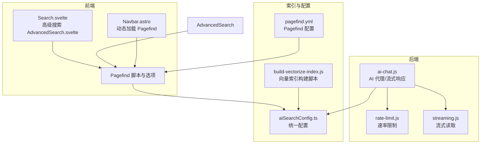
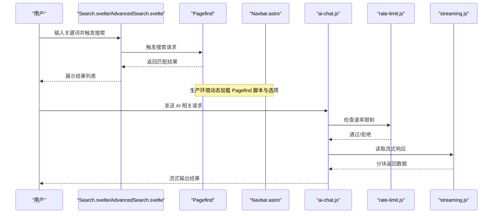
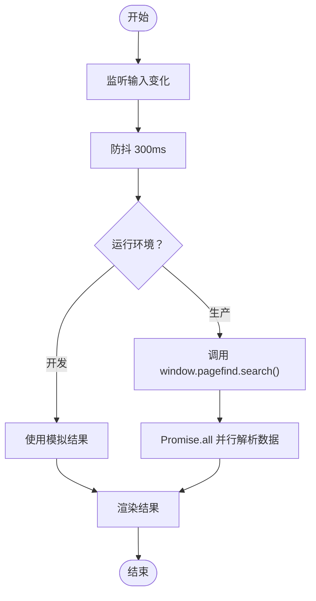
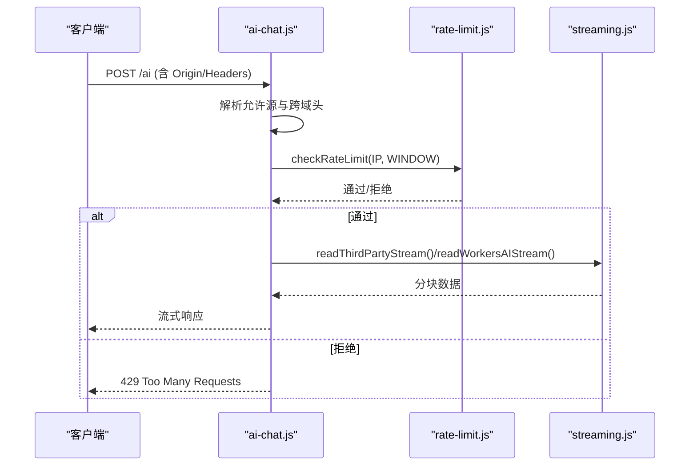
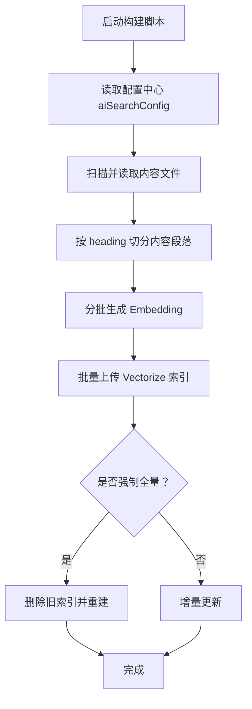

# 搜索性能优化

<cite>
**本文引用的文件**
- [aiSearchConfig.ts](file://src/config/aiSearchConfig.ts)
- [build-vectorize-index.js](file://scripts/build-vectorize-index.js)
- [ai-chat.js](file://src/workers/ai-chat.js)
- [rate-limit.js](file://src/workers/utils/rate-limit.js)
- [streaming.js](file://src/workers/utils/streaming.js)
- [Search.svelte](file://src/components/controls/Search.svelte)
- [AdvancedSearch.svelte](file://src/components/pages/AdvancedSearch.svelte)
- [Navbar.astro](file://src/components/layout/Navbar.astro)
- [search.astro](file://src/pages/search.astro)
- [cache-utils.ts](file://src/utils/cache-utils.ts)
- [content-utils.ts](file://src/utils/content-utils.ts)
- [pagefind.yml](file://pagefind.yml)
</cite>

## 目录
1. [简介](#简介)
2. [项目结构](#项目结构)
3. [核心组件](#核心组件)
4. [架构总览](#架构总览)
5. [详细组件分析](#详细组件分析)
6. [依赖关系分析](#依赖关系分析)
7. [性能考量](#性能考量)
8. [故障排查指南](#故障排查指南)
9. [结论](#结论)
10. [附录](#附录)

## 简介
本文件聚焦于 Firefly-Mod 的 AI 搜索性能优化，系统梳理向量检索与全文检索的实现现状、可优化方向与落地策略。当前项目采用 Pagefind 实现全文检索，并通过 Cloudflare Workers 提供 AI 能力；同时存在基于 Vectorize 的向量索引构建脚本。本文将从索引优化、查询优化、缓存机制、响应时间优化、监控指标、瓶颈定位与容量规划等维度给出可操作的技术方案。

## 项目结构
- 配置层：集中于统一配置模块，统一前后端与构建脚本的参数来源。
- 搜索前端：提供搜索输入、防抖触发、结果展示与面板控制。
- 搜索后端：Cloudflare Workers 提供 AI 与流式响应能力，配合速率限制与跨域控制。
- 索引构建：独立脚本负责内容切片、向量化与上传至 Vectorize。
- 缓存与相关工具：通用缓存工具与内容相关性评分工具。



**图表来源**
- [Search.svelte](file://src/components/controls/Search.svelte)
- [AdvancedSearch.svelte](file://src/components/pages/AdvancedSearch.svelte)
- [Navbar.astro](file://src/components/layout/Navbar.astro)
- [ai-chat.js](file://src/workers/ai-chat.js)
- [rate-limit.js](file://src/workers/utils/rate-limit.js)
- [streaming.js](file://src/workers/utils/streaming.js)
- [aiSearchConfig.ts](file://src/config/aiSearchConfig.ts)
- [build-vectorize-index.js](file://scripts/build-vectorize-index.js)
- [pagefind.yml](file://pagefind.yml)

**章节来源**
- [aiSearchConfig.ts:1-29](file://src/config/aiSearchConfig.ts#L1-L29)
- [build-vectorize-index.js:1-33](file://scripts/build-vectorize-index.js#L1-L33)
- [ai-chat.js:1-50](file://src/workers/ai-chat.js#L1-L50)
- [Search.svelte:1-144](file://src/components/controls/Search.svelte#L1-L144)
- [AdvancedSearch.svelte:45-137](file://src/components/pages/AdvancedSearch.svelte#L45-L137)
- [Navbar.astro:261-305](file://src/components/layout/Navbar.astro#L261-L305)
- [search.astro:1-42](file://src/pages/search.astro#L1-L42)
- [pagefind.yml](file://pagefind.yml)

## 核心组件
- 统一配置中心：集中管理 API 地址、模型名、向量维度、批大小与索引名，确保前后端与构建脚本一致性。
- 搜索前端组件：提供输入防抖、异步搜索、结果渲染与面板控制，生产环境通过动态加载 Pagefind。
- Workers 后端：封装 AI 代理、跨域与速率限制，支持流式读取第三方或 Workers AI 的响应。
- 索引构建脚本：按 heading 切段、批量生成 Embedding 并上传 Vectorize，支持增量更新。
- 缓存与相关工具：提供通用缓存工具与内容相关性评分，便于后续扩展缓存策略。

**章节来源**
- [aiSearchConfig.ts:8-29](file://src/config/aiSearchConfig.ts#L8-L29)
- [Search.svelte:10-109](file://src/components/controls/Search.svelte#L10-L109)
- [AdvancedSearch.svelte:50-71](file://src/components/pages/AdvancedSearch.svelte#L50-L71)
- [ai-chat.js:17-50](file://src/workers/ai-chat.js#L17-L50)
- [build-vectorize-index.js:1-33](file://scripts/build-vectorize-index.js#L1-L33)
- [cache-utils.ts](file://src/utils/cache-utils.ts)
- [content-utils.ts:187-219](file://src/utils/content-utils.ts#L187-L219)

## 架构总览
整体架构由“前端搜索界面 + Pagefind 全文检索 + Cloudflare Workers AI 代理”构成。向量检索通过独立构建脚本接入 Vectorize，当前前端未直接调用 Vectorize，但配置与批处理参数已就绪，便于后续集成。



**图表来源**
- [Search.svelte:91-109](file://src/components/controls/Search.svelte#L91-L109)
- [AdvancedSearch.svelte:50-71](file://src/components/pages/AdvancedSearch.svelte#L50-L71)
- [Navbar.astro:278-305](file://src/components/layout/Navbar.astro#L278-L305)
- [ai-chat.js:17-50](file://src/workers/ai-chat.js#L17-L50)
- [rate-limit.js](file://src/workers/utils/rate-limit.js)
- [streaming.js](file://src/workers/utils/streaming.js)

## 详细组件分析

### 组件A：搜索前端（防抖与结果展示）
- 防抖逻辑：输入变更后延时触发搜索，降低频繁请求。
- 结果获取：生产环境通过 Pagefind 异步获取结果并并行解析数据。
- 开发模式：提供模拟结果以保证开发体验。
- 初始化策略：根据页面加载状态决定是否等待 Pagefind 就绪。



**图表来源**
- [Search.svelte:91-109](file://src/components/controls/Search.svelte#L91-L109)
- [AdvancedSearch.svelte:50-71](file://src/components/pages/AdvancedSearch.svelte#L50-L71)

**章节来源**
- [Search.svelte:10-109](file://src/components/controls/Search.svelte#L10-L109)
- [AdvancedSearch.svelte:45-137](file://src/components/pages/AdvancedSearch.svelte#L45-L137)

### 组件B：Workers AI 代理与流式响应
- 跨域与头部：根据 Origin 动态设置允许源与校验。
- 速率限制：基于 IP 与窗口的限流策略，防止滥用。
- 流式读取：支持第三方与 Workers AI 的流式响应，提升交互体验。
- 配置注入：从统一配置中心读取模型与维度信息。



**图表来源**
- [ai-chat.js:25-50](file://src/workers/ai-chat.js#L25-L50)
- [rate-limit.js](file://src/workers/utils/rate-limit.js)
- [streaming.js](file://src/workers/utils/streaming.js)

**章节来源**
- [ai-chat.js:1-50](file://src/workers/ai-chat.js#L1-L50)

### 组件C：向量索引构建与配置
- 构建流程：读取内容 → 按 heading 切段 → 生成 Embedding → 批量上传 Vectorize。
- 增量更新：支持通过参数强制全量重建。
- 配置来源：统一从配置中心读取，避免多处硬编码。
- 环境变量：需要 Cloudflare API 凭据与可选的第三方 API Key。



**图表来源**
- [build-vectorize-index.js:1-33](file://scripts/build-vectorize-index.js#L1-L33)
- [aiSearchConfig.ts:8-29](file://src/config/aiSearchConfig.ts#L8-L29)

**章节来源**
- [build-vectorize-index.js:1-33](file://scripts/build-vectorize-index.js#L1-L33)
- [aiSearchConfig.ts:8-29](file://src/config/aiSearchConfig.ts#L8-L29)

### 组件D：缓存与相关性工具
- 通用缓存工具：提供可复用的缓存封装，便于扩展向量缓存与查询结果缓存。
- 内容相关性评分：基于标签相似度、标题相似度与时效性进行综合打分，可用于结果重排与缓存命中策略。

**章节来源**
- [cache-utils.ts](file://src/utils/cache-utils.ts)
- [content-utils.ts:187-219](file://src/utils/content-utils.ts#L187-L219)

## 依赖关系分析
- 前端依赖 Pagefind：通过动态加载与事件分发确保在生产环境可用。
- 后端依赖统一配置：Workers 与构建脚本共享配置，减少不一致风险。
- 速率限制与流式读取：保障高并发场景下的稳定性与用户体验。

```mermaid
graph LR
PF["Pagefind"] <- --> UI["Search.svelte/AdvancedSearch.svelte"]
CFG["aiSearchConfig.ts"] --> PF
CFG --> WR["ai-chat.js"]
RL["rate-limit.js"] --> WR
ST["streaming.js"] --> WR
BI["build-vectorize-index.js"] --> CFG
```

**图表来源**
- [aiSearchConfig.ts:8-29](file://src/config/aiSearchConfig.ts#L8-L29)
- [ai-chat.js:1-50](file://src/workers/ai-chat.js#L1-L50)
- [rate-limit.js](file://src/workers/utils/rate-limit.js)
- [streaming.js](file://src/workers/utils/streaming.js)
- [build-vectorize-index.js:1-33](file://scripts/build-vectorize-index.js#L1-L33)

**章节来源**
- [aiSearchConfig.ts:8-29](file://src/config/aiSearchConfig.ts#L8-L29)
- [ai-chat.js:1-50](file://src/workers/ai-chat.js#L1-L50)
- [rate-limit.js](file://src/workers/utils/rate-limit.js)
- [streaming.js](file://src/workers/utils/streaming.js)
- [build-vectorize-index.js:1-33](file://scripts/build-vectorize-index.js#L1-L33)

## 性能考量

### 向量搜索性能优化策略
- 索引优化
  - 维度与索引名一致性：确保向量维度与 Vectorize 索引一致，避免运行时失败。
  - 批大小调优：结合内存与网络带宽调整向量上传批大小，平衡吞吐与稳定性。
  - 增量更新：优先增量构建，减少全量重建频率。
- 查询优化
  - 查询前预过滤：对关键词进行清洗与必要字段筛选，减少无效向量查询。
  - 结果重排：结合标签相似度与时效性评分，提升相关性排序质量。
- 缓存机制
  - 向量缓存：对高频查询的向量表示进行缓存，降低重复计算。
  - 查询结果缓存：对热门关键词与组合查询结果进行短期缓存。
  - 会话状态缓存：记录用户近期行为与偏好，用于个性化与结果重排。
  - 热数据管理：识别热点内容与查询模式，将高热度数据驻留边缘节点。

### 搜索响应时间优化
- 并行查询：对多个来源（全文与向量）并行发起请求，缩短首屏时间。
- 结果预取：对可能的下一页或相关结果进行预取，提升翻页体验。
- 流式响应：对 AI 生成类结果采用流式输出，降低感知延迟。
- 分页加载：结合虚拟列表与懒加载，减少一次性渲染压力。

### 性能监控指标与采集
- 查询延迟：统计从用户输入到首包到达的时间分布（P50/P90/P95）。
- 吞吐量：每秒请求数（QPS），区分全文与向量两类查询。
- 错误率：HTTP 5xx、超时与限流占比。
- 资源使用：CPU、内存、网络带宽与 Vectorize 查询耗时。
- 采集方式：在 Workers 中埋点上报，在前端通过性能 API 与自定义埋点收集。

### 瓶颈识别与解决
- 索引重建：当数据量增长导致查询变慢，评估重建策略与批大小。
- 查询重写：优化关键词匹配规则与过滤条件，减少无效扫描。
- 网络优化：利用边缘节点就近访问，减少跨区域延迟。
- 存储调优：针对 Vectorize 的写入与查询路径进行参数调优。

### 性能测试与基准
- 基准测试：使用合成数据集与真实内容集，覆盖不同规模与查询模式。
- 工具建议：Pagefind 自带的构建与加载性能分析；向量查询可使用压测工具模拟并发。
- 容量规划：基于 QPS 与延迟目标，推导 Workers 实例数与 Vectorize 索引规格。

## 故障排查指南
- Pagefind 未加载
  - 现象：搜索无结果或报错。
  - 排查：确认生产环境动态加载脚本与 HEAD 请求成功；检查事件分发是否正确。
- 跨域与限流
  - 现象：AI 请求被拒绝或返回跨域错误。
  - 排查：核对允许源集合与 Origin；检查速率限制阈值与窗口设置。
- 向量索引异常
  - 现象：构建失败或查询报错。
  - 排查：核对向量维度与索引维度一致；检查 API 凭据与网络连通性。

**章节来源**
- [Navbar.astro:278-305](file://src/components/layout/Navbar.astro#L278-L305)
- [ai-chat.js:25-50](file://src/workers/ai-chat.js#L25-L50)
- [rate-limit.js](file://src/workers/utils/rate-limit.js)

## 结论
当前项目以 Pagefind 为核心实现全文检索，具备良好的前端性能基础；向量检索通过独立构建脚本接入 Vectorize，配置与批处理参数已就绪。建议在现有基础上逐步引入并行查询、流式响应、缓存与监控体系，结合容量规划与压测验证，持续优化搜索体验与系统稳定性。

## 附录
- Pagefind 配置参考：通过站点配置文件启用/调整摘要长度与索引选项。
- 向量索引构建：在 CI/CD 中定期运行构建脚本，确保索引与内容同步。

**章节来源**
- [pagefind.yml](file://pagefind.yml)
- [build-vectorize-index.js:1-33](file://scripts/build-vectorize-index.js#L1-L33)