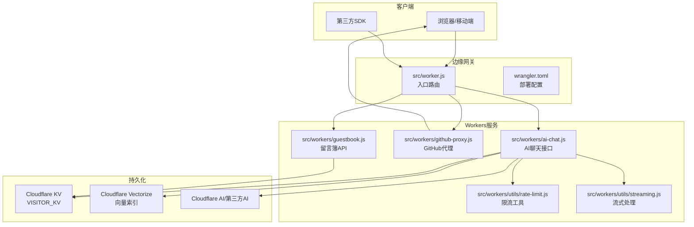
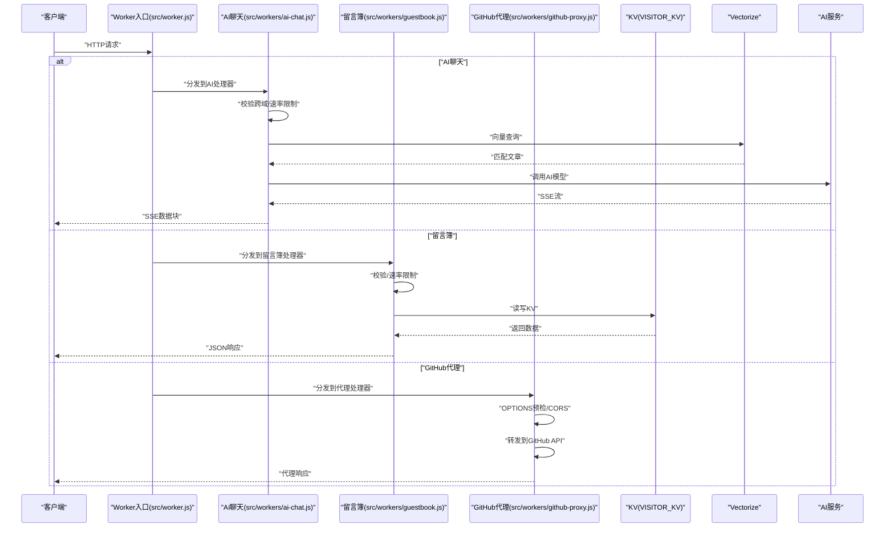
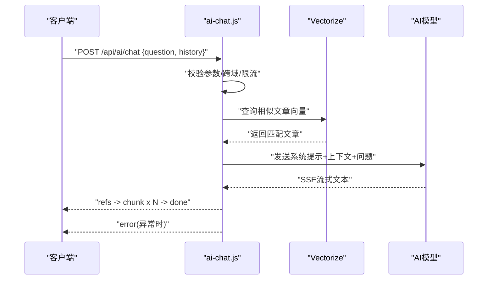
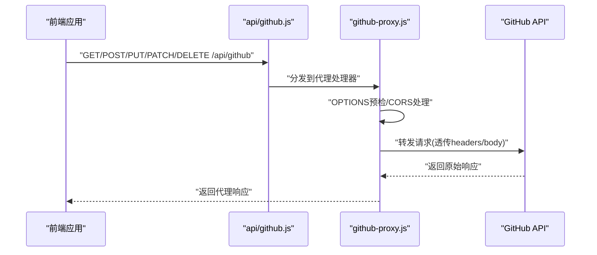
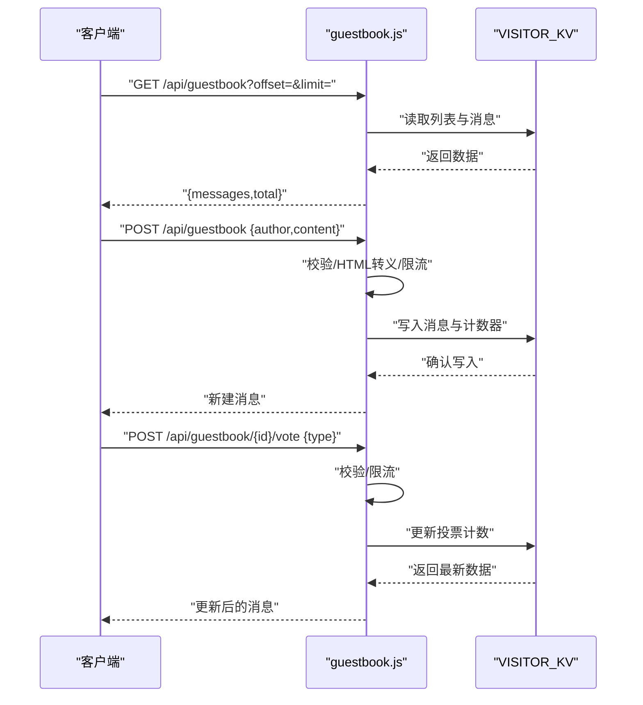
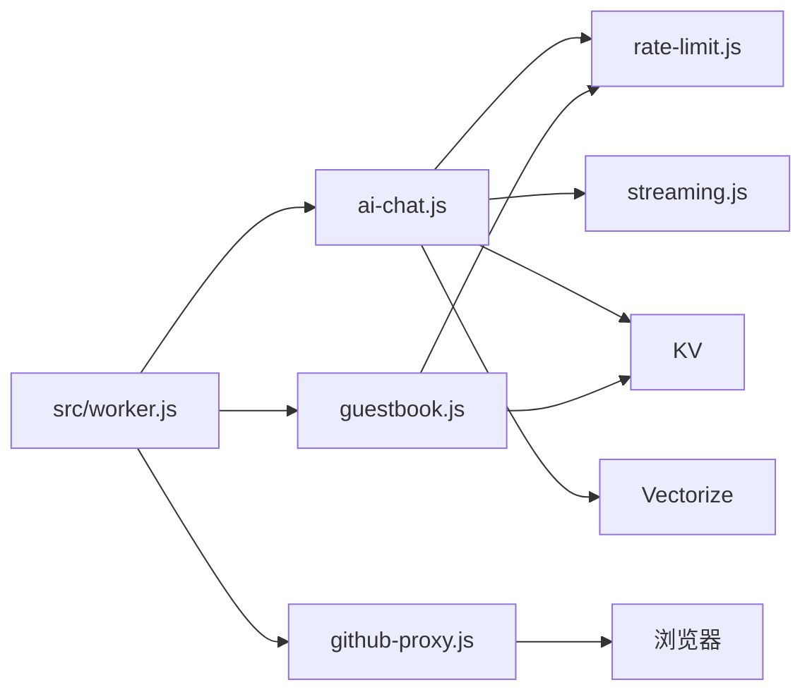

# API参考文档

<cite>
**本文档引用的文件**
- [src/workers/ai-chat.js](file://src/workers/ai-chat.js)
- [src/workers/github-proxy.js](file://src/workers/github-proxy.js)
- [src/workers/guestbook.js](file://src/workers/guestbook.js)
- [src/workers/utils/rate-limit.js](file://src/workers/utils/rate-limit.js)
- [src/workers/utils/streaming.js](file://src/workers/utils/streaming.js)
- [api/github.js](file://api/github.js)
- [src/worker.js](file://src/worker.js)
- [wrangler.toml](file://wrangler.toml)
- [src/pages/api/allPostMeta.json.ts](file://src/pages/api/allPostMeta.json.ts)
- [src/pages/api/holidays.json.ts](file://src/pages/api/holidays.json.ts)
- [src/utils/guestbook-api.ts](file://src/utils/guestbook-api.ts)
</cite>

## 目录
1. [简介](#简介)
2. [项目结构](#项目结构)
3. [核心组件](#核心组件)
4. [架构总览](#架构总览)
5. [详细组件分析](#详细组件分析)
6. [依赖关系分析](#依赖关系分析)
7. [性能考量](#性能考量)
8. [故障排查指南](#故障排查指南)
9. [结论](#结论)
10. [附录](#附录)

## 简介
本文件为 Firefly-Mod 项目的 API 参考文档，覆盖 Cloudflare Workers 提供的后端服务 API，包括：
- AI 聊天接口（SSE 流式响应）
- GitHub 代理接口（CORS 透传）
- 留言簿 API（列表、详情、投票）

同时说明认证机制、权限控制、安全考虑、错误码与响应格式、限流策略、性能指标与监控方法、测试与调试工具，以及第三方集成注意事项。

## 项目结构
项目采用 Astro 前端框架与 Cloudflare Workers 边缘计算服务相结合的架构。API 主要通过独立的 Worker 文件暴露，部分静态 API 通过 Astro 的 pages/api 路由生成。

图表来源
- [src/worker.js](file://src/worker.js)
- [wrangler.toml](file://wrangler.toml)
- [src/workers/ai-chat.js](file://src/workers/ai-chat.js)
- [src/workers/github-proxy.js](file://src/workers/github-proxy.js)
- [src/workers/guestbook.js](file://src/workers/guestbook.js)
- [src/workers/utils/rate-limit.js](file://src/workers/utils/rate-limit.js)
- [src/workers/utils/streaming.js](file://src/workers/utils/streaming.js)

章节来源
- [src/worker.js](file://src/worker.js)
- [wrangler.toml](file://wrangler.toml)

## 核心组件
- AI 聊天接口：基于 SSE 的流式聊天，支持上下文检索增强与角色扮演提示词，具备跨域白名单校验与速率限制。
- GitHub 代理接口：CORS 透传代理，允许前端携带认证头访问 GitHub API，避免浏览器跨域限制。
- 留言簿 API：KV 存储的留言列表、详情、创建与投票，具备输入校验、HTML 转义与速率限制。

章节来源
- [src/workers/ai-chat.js](file://src/workers/ai-chat.js)
- [src/workers/github-proxy.js](file://src/workers/github-proxy.js)
- [src/workers/guestbook.js](file://src/workers/guestbook.js)

## 架构总览
以下序列图展示从客户端到边缘服务再到后端资源的交互流程。

图表来源
- [src/worker.js](file://src/worker.js)
- [src/workers/ai-chat.js](file://src/workers/ai-chat.js)
- [src/workers/guestbook.js](file://src/workers/guestbook.js)
- [src/workers/github-proxy.js](file://src/workers/github-proxy.js)

## 详细组件分析

### AI聊天接口
- 接口类型：HTTP + SSE
- 路由：/api/ai/chat（由 Worker 路由分发至 ai-chat.js）
- 方法：POST（支持 OPTIONS 预检）
- 跨域：基于 Origin 白名单校验，动态设置 Access-Control-Allow-Origin
- 速率限制：默认每 IP 每分钟最多 N 次（见限流配置）
- 请求体字段
  - question: 字符串，必填，最大长度 1000
  - history: 数组，最多 6 条，每条包含 role/content
- 响应
  - Content-Type: text/event-stream
  - 数据帧类型
    - refs: 初始阶段推送检索到的文章列表
    - chunk: AI 生成的增量文本
    - done: 流结束标志
    - error: 错误信息
- 安全
  - 输入长度与格式校验
  - 仅允许指定角色系统提示词与历史消息
  - 第三方/Workers AI 模型切换
- 错误码
  - 400: 缺少 question 或参数非法
  - 403: Origin 不在白名单
  - 405: 方法不允许
  - 429: 速率限制触发
  - 500: 服务器内部错误或 AI 生成失败

图表来源
- [src/workers/ai-chat.js](file://src/workers/ai-chat.js)

章节来源
- [src/workers/ai-chat.js](file://src/workers/ai-chat.js)
- [src/workers/utils/rate-limit.js](file://src/workers/utils/rate-limit.js)

### GitHub代理接口
- 接口类型：HTTP
- 路由：/api/github（由 api/github.js 暴露）
- 方法：GET（path 参数）、POST/PUT/PATCH/DELETE（需 JSON body）
- CORS：通配符允许，支持常见请求头
- 请求体字段（POST/PUT/PATCH/DELETE）
  - path: GitHub API 路径或完整 URL（必填）
  - method: HTTP 方法（可选，默认与请求一致）
  - headers: 透传请求头（如 Authorization）
  - body: 请求体（可选）
- 响应
  - 返回 GitHub API 原始响应（状态码与内容类型透传）
  - 成功：200；失败：502
- 安全
  - 服务端不存储密钥，认证由前端传入 Authorization
  - 对 Host/Content-Length 等头部进行过滤
- 错误码
  - 400: JSON 解析失败或缺少 path
  - 405: 方法不允许
  - 403: Origin 校验失败（AI聊天接口）
  - 502: 代理请求失败

图表来源
- [api/github.js](file://api/github.js)
- [src/workers/github-proxy.js](file://src/workers/github-proxy.js)

章节来源
- [api/github.js](file://api/github.js)
- [src/workers/github-proxy.js](file://src/workers/github-proxy.js)

### 留言簿API
- 接口类型：HTTP
- 路由：/api/guestbook（由 Worker 路由分发至 guestbook.js）
- 方法：GET（列表/详情）、POST（新建）、POST（投票）
- 跨域：允许 GET/POST/OPTIONS，透传 Content-Type
- 速率限制
  - 新建/投票：默认每 IP 每分钟最多 N 次（见限流配置）
  - 投票：独立窗口与上限
- 请求体字段
  - GET /api/guestbook?offset=&limit=
    - offset: 数字，偏移量
    - limit: 数字，1-20
  - POST /api/guestbook
    - author: 2-30 字符
    - content: 5-500 字符
  - POST /api/guestbook/{id}/vote
    - type: agree/disagree/neutral
- 响应
  - 列表：{ messages: [], total: number }
  - 详情：留言对象
  - 新建/投票：返回更新后的留言对象
- 安全
  - HTML 转义防止 XSS
  - 关键字黑名单过滤
  - KV 存储计数器与消息列表
- 错误码
  - 400: 参数缺失/非法
  - 404: 未找到留言
  - 429: 速率限制触发
  - 500: 服务器内部错误

图表来源
- [src/workers/guestbook.js](file://src/workers/guestbook.js)

章节来源
- [src/workers/guestbook.js](file://src/workers/guestbook.js)
- [src/workers/utils/rate-limit.js](file://src/workers/utils/rate-limit.js)

### WebSocket接口
- 当前仓库未发现 WebSocket 服务端实现或客户端连接逻辑。
- 若未来需要实时通信功能，建议在 Worker 中引入 WebSocket 协议并配合 KV 或 Durable Objects 实现状态持久化与广播。

[本节为概念性说明，不直接分析具体文件]

## 依赖关系分析
- Worker 入口负责路由分发，将不同路径映射到对应处理器。
- AI 聊天依赖 Vectorize 向量检索与 AI 服务（Workers AI 或第三方）。
- 留言簿依赖 KV 存储与速率限制工具。
- GitHub 代理依赖 CORS 处理与上游 GitHub API。

图表来源
- [src/worker.js](file://src/worker.js)
- [src/workers/ai-chat.js](file://src/workers/ai-chat.js)
- [src/workers/guestbook.js](file://src/workers/guestbook.js)
- [src/workers/github-proxy.js](file://src/workers/github-proxy.js)
- [src/workers/utils/rate-limit.js](file://src/workers/utils/rate-limit.js)
- [src/workers/utils/streaming.js](file://src/workers/utils/streaming.js)

章节来源
- [src/worker.js](file://src/worker.js)

## 性能考量
- 限流策略
  - AI 聊天：默认每 IP 每分钟 N 次（见限流配置）
  - 留言簿：新建/投票独立限流窗口与上限
  - 限流触发返回 429 并携带 Retry-After
- 流式传输
  - AI 聊天使用 SSE，按块推送增量文本，降低首字延迟
- 存储优化
  - 留言簿列表以 ID 数组形式存储，分页读取
  - 向量检索 topK 控制与阈值过滤，减少无关上下文
- 监控与可观测性
  - 建议在 Worker 层添加自定义指标与日志，结合平台自带的边缘日志与队列事件进行追踪

[本节提供通用指导，不直接分析具体文件]

## 故障排查指南
- 常见错误与定位
  - 403 Origin 不允许：检查 ALLOWED_ORIGINS/PUBLIC_SITE_URL 配置与请求头 Origin
  - 400 参数错误：核对 question/history/author/content 等字段长度与必填
  - 429 速率限制：查看 Retry-After，调整客户端重试策略
  - 500 服务器错误：关注 AI 生成异常与 KV 写入失败
- 调试建议
  - 使用 curl 或浏览器开发者工具观察请求与响应头
  - 在本地启用 Wrangler 开发服务器进行联调
  - 查看 Worker 日志与平台提供的边缘日志
- 安全加固
  - 严格校验与过滤输入，避免注入与 XSS
  - 代理接口仅透传必要请求头，避免敏感信息泄露

章节来源
- [src/workers/ai-chat.js](file://src/workers/ai-chat.js)
- [src/workers/guestbook.js](file://src/workers/guestbook.js)
- [src/workers/github-proxy.js](file://src/workers/github-proxy.js)

## 结论
本项目通过 Cloudflare Workers 提供了高性能、低延迟的边缘 API 服务，涵盖 AI 聊天、GitHub 代理与留言簿三大核心能力。通过严格的输入校验、跨域白名单、速率限制与 SSE 流式传输，确保了安全性与用户体验。建议在生产环境中结合平台监控与日志体系持续优化性能与稳定性。

[本节为总结性内容，不直接分析具体文件]

## 附录

### API定义与示例

- AI聊天接口
  - 方法与路径：POST /api/ai/chat
  - 请求头：Content-Type: application/json
  - 请求体
    - question: 字符串，必填，长度 ≤ 1000
    - history: 数组，最多 6 条，每条含 role/content
  - 响应：text/event-stream，包含 refs/chunk/done/error
  - 示例（curl）
    - curl -N -H "Content-Type: application/json" -d '{"question":"如何部署Workers？","history":[]}' https://your-domain.com/api/ai/chat
  - 示例（JavaScript）
    - 使用 EventSource 或 fetch + ReadableStream 读取 SSE
  - 示例（SDK）
    - 通过 HTTP 客户端发起 POST，解析 SSE 数据帧

- GitHub代理接口
  - 方法与路径：GET /api/github（带查询参数 path）或 POST/PUT/PATCH/DELETE /api/github
  - 请求头：支持 Authorization、User-Agent 等
  - 请求体（POST/PUT/PATCH/DELETE）
    - path: GitHub API 路径或完整 URL
    - method: HTTP 方法
    - headers: 透传头
    - body: 请求体
  - 响应：透传上游响应
  - 示例（curl）
    - curl -H "Authorization: token YOUR_TOKEN" "https://your-domain.com/api/github?path=/users/firefly-mod"
    - curl -X POST -H "Content-Type: application/json" -d '{"path":"/repos/firefly-mod/blog/issues","method":"POST","headers":{"Authorization":"token YOUR_TOKEN"},"body":{"title":"Test"}}' https://your-domain.com/api/github

- 留言簿接口
  - 方法与路径
    - GET /api/guestbook?offset=&limit=
    - GET /api/guestbook/{id}
    - POST /api/guestbook
    - POST /api/guestbook/{id}/vote
  - 请求头：Content-Type: application/json
  - 请求体
    - POST /api/guestbook: { author: "2-30字符", content: "5-500字符" }
    - POST /api/guestbook/{id}/vote: { type: "agree|disagree|neutral" }
  - 响应：JSON 对象或数组
  - 示例（curl）
    - curl -X POST -H "Content-Type: application/json" -d '{"author":"访客","content":"欢迎！"}' https://your-domain.com/api/guestbook
    - curl -X POST -H "Content-Type: application/json" -d '{"type":"agree"}' https://your-domain.com/api/guestbook/msg_001/vote

### 认证机制与权限控制
- AI聊天接口
  - 跨域白名单：通过环境变量 ALLOWED_ORIGINS 与 PUBLIC_SITE_URL 配置
  - 第三方模型：通过 AI_API_KEY 与 apiUrl 配置启用
- GitHub代理接口
  - 无服务端密钥存储，认证由前端传入 Authorization
- 留言簿接口
  - 无登录态，匿名即可评论与投票
  - 通过速率限制与输入校验防止滥用

章节来源
- [src/workers/ai-chat.js](file://src/workers/ai-chat.js)
- [src/workers/github-proxy.js](file://src/workers/github-proxy.js)
- [src/workers/guestbook.js](file://src/workers/guestbook.js)

### 错误码与响应格式
- 通用错误响应格式
  - { error: "错误描述" }
- 状态码
  - 400: 参数错误/格式错误
  - 403: 跨域不允许/鉴权失败
  - 404: 资源不存在
  - 405: 方法不允许
  - 429: 速率限制
  - 500: 服务器内部错误
  - 502: 代理请求失败

章节来源
- [src/workers/ai-chat.js](file://src/workers/ai-chat.js)
- [src/workers/guestbook.js](file://src/workers/guestbook.js)
- [src/workers/github-proxy.js](file://src/workers/github-proxy.js)

### 版本控制与兼容性
- 当前 API 未显式声明版本号，建议在路径中加入版本前缀（如 /api/v1/...）以保障向后兼容
- 配置项变更（如 ALLOWED_ORIGINS、AI_API_KEY）通过环境变量管理，建议在部署脚本中统一迁移

[本节为通用指导，不直接分析具体文件]

### 限流机制与监控
- 限流实现
  - 基于 IP 与令牌桶算法，支持自定义窗口与上限
  - AI 聊天与留言簿投票分别配置独立限流参数
- 监控建议
  - 使用平台提供的边缘日志与队列事件
  - 在 Worker 中埋点统计请求量、错误率与响应时间

章节来源
- [src/workers/utils/rate-limit.js](file://src/workers/utils/rate-limit.js)
- [src/workers/ai-chat.js](file://src/workers/ai-chat.js)
- [src/workers/guestbook.js](file://src/workers/guestbook.js)

### 测试与调试
- 本地开发
  - 使用 Wrangler 在本地启动边缘服务进行联调
- 自动化测试
  - 建议编写单元测试覆盖输入校验、限流与错误分支
- 调试工具
  - curl/wget 直连 /api/* 进行快速验证
  - 浏览器开发者工具查看网络与 SSE 数据流

章节来源
- [wrangler.toml](file://wrangler.toml)

### 第三方集成
- AI服务
  - 支持 Workers AI 与第三方 OpenAI 兼容 API（通过配置切换）
- GitHub API
  - 代理层透传认证头，前端自行管理凭据
- KV/Vectorize
  - 留言簿与 AI 上下文检索依赖 KV 与 Vectorize

章节来源
- [src/workers/ai-chat.js](file://src/workers/ai-chat.js)
- [src/workers/github-proxy.js](file://src/workers/github-proxy.js)
- [src/workers/guestbook.js](file://src/workers/guestbook.js)