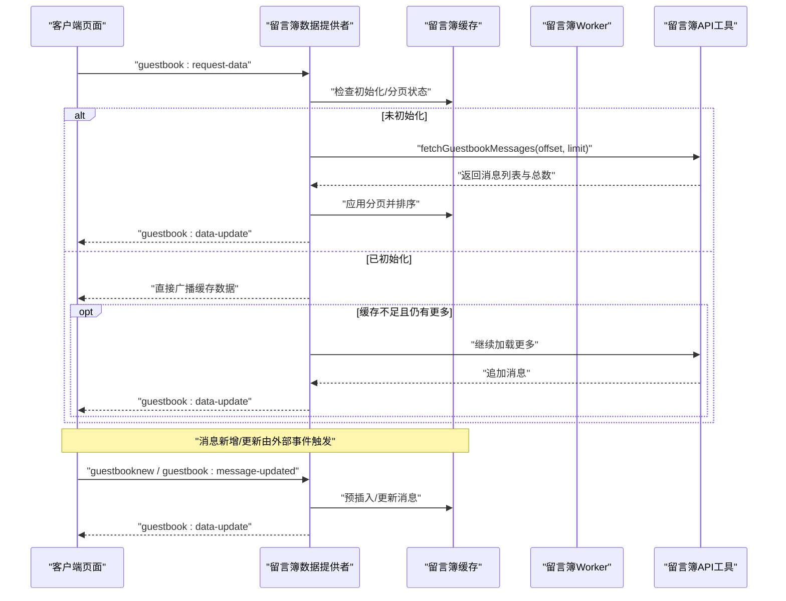
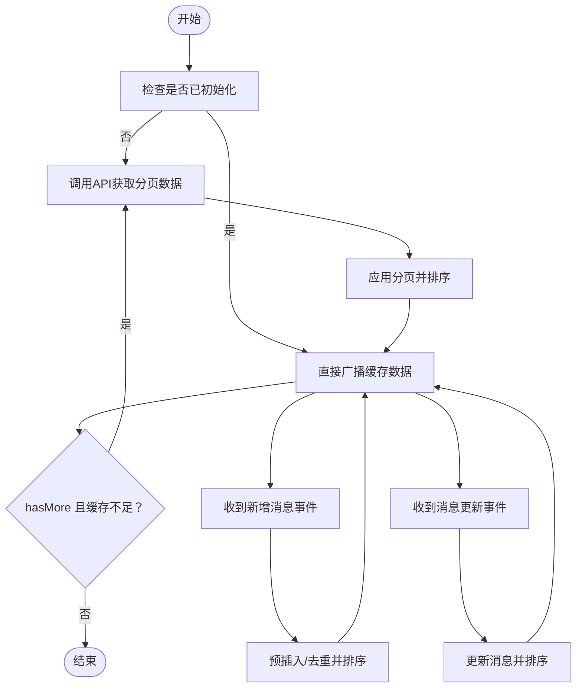
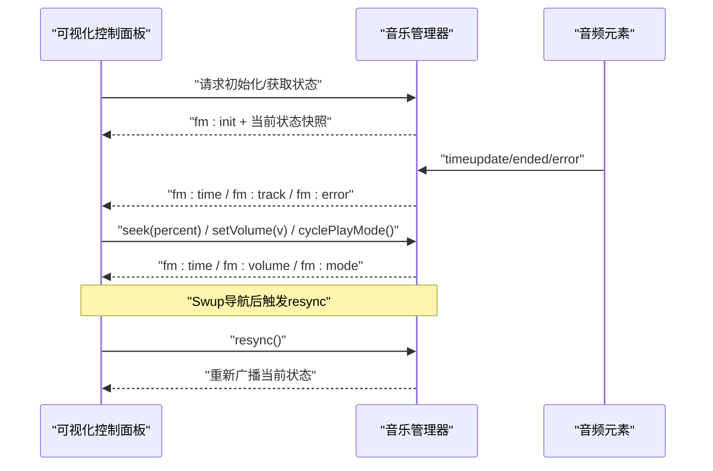
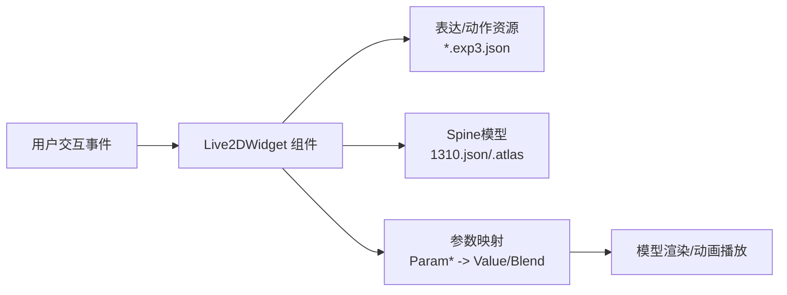
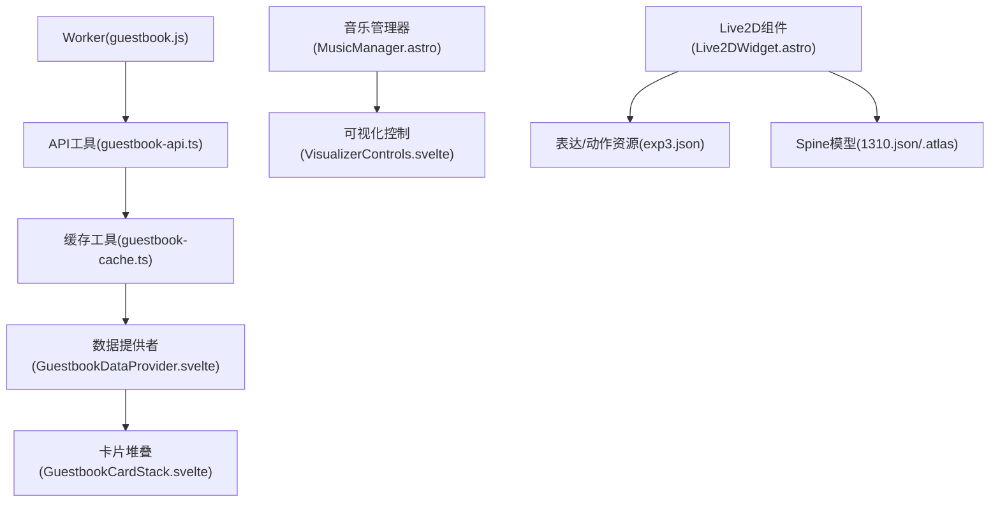

# WebSocket实时通信API

<cite>
**本文引用的文件**
- [src/workers/guestbook.js](file://src/workers/guestbook.js)
- [src/utils/guestbook-api.ts](file://src/utils/guestbook-api.ts)
- [src/utils/guestbook-cache.ts](file://src/utils/guestbook-cache.ts)
- [src/components/features/GuestbookDataProvider.svelte](file://src/components/features/GuestbookDataProvider.svelte)
- [src/components/features/GuestbookCardStack.svelte](file://src/components/features/GuestbookCardStack.svelte)
- [src/components/features/MusicManager.astro](file://src/components/features/MusicManager.astro)
- [src/components/features/music-visualizer/VisualizerControls.svelte](file://src/components/features/music-visualizer/VisualizerControls.svelte)
- [src/components/features/Live2DWidget.astro](file://src/components/features/Live2DWidget.astro)
- [public/pio/models/live2d/小爱弥斯_vts/右键.exp3.json](file://public/pio/models/live2d/小爱弥斯_vts/右键.exp3.json)
- [public/pio/models/live2d/小爱弥斯_vts/表情-黑化.exp3.json](file://public/pio/models/live2d/小爱弥斯_vts/表情-黑化.exp3.json)
- [public/pio/models/live2d/小爱弥斯_vts/其他-剑.exp3.json](file://public/pio/models/live2d/小爱弥斯_vts/其他-剑.exp3.json)
- [public/pio/models/spine/firefly/1310.json](file://public/pio/models/spine/firefly/1310.json)
- [public/pio/models/spine/firefly/1310.atlas](file://public/pio/models/spine/firefly/1310.atlas)
</cite>

## 目录
1. [简介](#简介)
2. [项目结构](#项目结构)
3. [核心组件](#核心组件)
4. [架构总览](#架构总览)
5. [详细组件分析](#详细组件分析)
6. [依赖关系分析](#依赖关系分析)
7. [性能考虑](#性能考虑)
8. [故障排查指南](#故障排查指南)
9. [结论](#结论)
10. [附录](#附录)

## 简介
本文件面向Firefly-Mod项目的实时通信能力，聚焦于当前代码库中已实现的“近实时”数据分发与状态同步机制。尽管仓库未发现直接的WebSocket服务器或客户端连接代码，但项目通过以下方式实现了多场景的实时体验：
- 留言簿：基于浏览器自定义事件（CustomEvent）在组件间进行数据广播与更新，形成“近实时”的留言流体验。
- 音乐播放器：通过自定义事件在播放状态、进度、音量等维度进行跨组件同步，实现播放器状态的“近实时”联动。
- Live2D虚拟助手：通过模型参数配置与交互事件映射，实现动作与表情的即时响应。

本指南将系统性梳理这些组件的数据流、事件类型、消息格式与集成方式，并给出客户端接入建议与调试方法。

## 项目结构
围绕实时通信相关的核心目录与文件如下：
- 实时留言簿
  - Worker：负责后端数据拉取与缓存协调
  - API工具：封装HTTP请求与错误处理
  - 缓存工具：维护消息列表、总数与分页状态
  - 数据提供者：统一广播数据更新事件
  - 卡片堆叠组件：消费并展示消息流
- 实时音乐播放器
  - 音乐管理器：音频播放、状态管理与事件发射
  - 控制面板：订阅播放器事件并驱动UI
- 实时Live2D助手
  - Live2D组件：承载模型与交互
  - 表达与动作资源：JSON参数配置文件

```mermaid
graph TB
subgraph "留言簿实时模块"
GBW["src/workers/guestbook.js"]
GBA["src/utils/guestbook-api.ts"]
GBC["src/utils/guestbook-cache.ts"]
GBD["src/components/features/GuestbookDataProvider.svelte"]
GBCard["src/components/features/GuestbookCardStack.svelte"]
end
subgraph "音乐播放器实时模块"
MM["src/components/features/MusicManager.astro"]
VC["src/components/features/music-visualizer/VisualizerControls.svelte"]
end
subgraph "Live2D助手实时模块"
L2D["src/components/features/Live2DWidget.astro"]
EXP["public/pio/models/live2d/.../*.exp3.json"]
MODEL["public/pio/models/spine/firefly/*"]
end
GBW --> GBA --> GBC --> GBD --> GBCard
MM --> VC
L2D --> EXP
L2D --> MODEL
```

**图表来源**
- [src/workers/guestbook.js](file://src/workers/guestbook.js)
- [src/utils/guestbook-api.ts](file://src/utils/guestbook-api.ts)
- [src/utils/guestbook-cache.ts](file://src/utils/guestbook-cache.ts)
- [src/components/features/GuestbookDataProvider.svelte](file://src/components/features/GuestbookDataProvider.svelte)
- [src/components/features/GuestbookCardStack.svelte](file://src/components/features/GuestbookCardStack.svelte)
- [src/components/features/MusicManager.astro](file://src/components/features/MusicManager.astro)
- [src/components/features/music-visualizer/VisualizerControls.svelte](file://src/components/features/music-visualizer/VisualizerControls.svelte)
- [src/components/features/Live2DWidget.astro](file://src/components/features/Live2DWidget.astro)
- [public/pio/models/live2d/小爱弥斯_vts/右键.exp3.json](file://public/pio/models/live2d/小爱弥斯_vts/右键.exp3.json)
- [public/pio/models/spine/firefly/1310.json](file://public/pio/models/spine/firefly/1310.json)

**章节来源**
- [src/workers/guestbook.js](file://src/workers/guestbook.js)
- [src/utils/guestbook-api.ts](file://src/utils/guestbook-api.ts)
- [src/utils/guestbook-cache.ts](file://src/utils/guestbook-cache.ts)
- [src/components/features/GuestbookDataProvider.svelte](file://src/components/features/GuestbookDataProvider.svelte)
- [src/components/features/GuestbookCardStack.svelte](file://src/components/features/GuestbookCardStack.svelte)
- [src/components/features/MusicManager.astro](file://src/components/features/MusicManager.astro)
- [src/components/features/music-visualizer/VisualizerControls.svelte](file://src/components/features/music-visualizer/VisualizerControls.svelte)
- [src/components/features/Live2DWidget.astro](file://src/components/features/Live2DWidget.astro)

## 核心组件
本节概述三大“近实时”子系统及其职责边界：
- 留言簿实时模块：以CustomEvent为核心，实现消息新增、更新与分页加载的跨组件广播。
- 音乐播放器实时模块：以自定义事件驱动UI与音频状态同步，覆盖播放/暂停、进度、音量、模式切换等。
- Live2D助手实时模块：通过表达与动作资源映射交互事件，实现即时的动作与表情变化。

**章节来源**
- [src/components/features/GuestbookDataProvider.svelte](file://src/components/features/GuestbookDataProvider.svelte)
- [src/components/features/MusicManager.astro](file://src/components/features/MusicManager.astro)
- [src/components/features/Live2DWidget.astro](file://src/components/features/Live2DWidget.astro)

## 架构总览
下图展示了“留言簿”与“音乐播放器”的关键交互路径，体现事件驱动与状态分发的架构特征。

**图表来源**
- [src/components/features/GuestbookDataProvider.svelte](file://src/components/features/GuestbookDataProvider.svelte)
- [src/utils/guestbook-api.ts](file://src/utils/guestbook-api.ts)
- [src/utils/guestbook-cache.ts](file://src/utils/guestbook-cache.ts)

## 详细组件分析

### 留言簿实时模块
- 数据提供者（GuestbookDataProvider）
  - 职责：统一拉取、缓存与广播消息；处理“新增消息”“消息更新”“请求数据”“加载更多”等事件。
  - 广播事件：guestbook:data-update，携带 messages、total、hasMore、isLoading。
  - 全局状态：通过window对象持久化缓存状态，避免页面切换丢失。
- 缓存工具（guestbook-cache）
  - 结构：messages、total、hasMore、isInitialized。
  - 能力：分页合并、去重、按规则排序、插入新消息。
- 卡片堆叠组件（GuestbookCardStack）
  - 职责：监听数据更新事件，增量渲染消息卡片，支持批量分页与滚动加载。
- Worker（src/workers/guestbook.js）
  - 职责：在服务端侧协调数据拉取与缓存，减少重复请求与抖动。

**图表来源**
- [src/components/features/GuestbookDataProvider.svelte](file://src/components/features/GuestbookDataProvider.svelte)
- [src/utils/guestbook-cache.ts](file://src/utils/guestbook-cache.ts)

**章节来源**
- [src/components/features/GuestbookDataProvider.svelte](file://src/components/features/GuestbookDataProvider.svelte)
- [src/utils/guestbook-cache.ts](file://src/utils/guestbook-cache.ts)
- [src/components/features/GuestbookCardStack.svelte](file://src/components/features/GuestbookCardStack.svelte)
- [src/workers/guestbook.js](file://src/workers/guestbook.js)

### 音乐播放器实时模块
- 音乐管理器（MusicManager）
  - 职责：管理播放队列、当前索引、播放状态、音量、循环模式、歌词索引与错误状态。
  - 事件发射：fm:init、fm:track、fm:play-state、fm:time、fm:volume、fm:mode、fm:error。
  - 跨组件同步：在页面导航后自动重同步所有挂载的播放器组件。
- 可视化控制面板（VisualizerControls）
  - 职责：订阅播放器事件，驱动UI状态（播放/暂停、进度、音量、模式、歌词索引）。
  - 交互：拖拽进度条、点击切歌、音量调节、模式切换。

**图表来源**
- [src/components/features/MusicManager.astro](file://src/components/features/MusicManager.astro)
- [src/components/features/music-visualizer/VisualizerControls.svelte](file://src/components/features/music-visualizer/VisualizerControls.svelte)

**章节来源**
- [src/components/features/MusicManager.astro](file://src/components/features/MusicManager.astro)
- [src/components/features/music-visualizer/VisualizerControls.svelte](file://src/components/features/music-visualizer/VisualizerControls.svelte)

### Live2D助手实时模块
- Live2D组件（Live2DWidget）
  - 职责：承载Live2D模型与Spine模型，接收交互事件并驱动动作与表情。
- 表达与动作资源
  - exp3文件：定义表情/动作的参数映射（如眨眼、黑化、剑、猫耳等）。
  - Spine模型：1310.json/atlas定义骨骼动画资源。
- 交互映射
  - 用户点击/触摸事件可映射到特定表达或动作参数，实现即时反馈。

**图表来源**
- [src/components/features/Live2DWidget.astro](file://src/components/features/Live2DWidget.astro)
- [public/pio/models/live2d/小爱弥斯_vts/右键.exp3.json](file://public/pio/models/live2d/小爱弥斯_vts/右键.exp3.json)
- [public/pio/models/live2d/小爱弥斯_vts/表情-黑化.exp3.json](file://public/pio/models/live2d/小爱弥斯_vts/表情-黑化.exp3.json)
- [public/pio/models/live2d/小爱弥斯_vts/其他-剑.exp3.json](file://public/pio/models/live2d/小爱弥斯_vts/其他-剑.exp3.json)
- [public/pio/models/spine/firefly/1310.json](file://public/pio/models/spine/firefly/1310.json)
- [public/pio/models/spine/firefly/1310.atlas](file://public/pio/models/spine/firefly/1310.atlas)

**章节来源**
- [src/components/features/Live2DWidget.astro](file://src/components/features/Live2DWidget.astro)
- [public/pio/models/live2d/小爱弥斯_vts/右键.exp3.json](file://public/pio/models/live2d/小爱弥斯_vts/右键.exp3.json)
- [public/pio/models/live2d/小爱弥斯_vts/表情-黑化.exp3.json](file://public/pio/models/live2d/小爱弥斯_vts/表情-黑化.exp3.json)
- [public/pio/models/live2d/小爱弥斯_vts/其他-剑.exp3.json](file://public/pio/models/live2d/小爱弥斯_vts/其他-剑.exp3.json)
- [public/pio/models/spine/firefly/1310.json](file://public/pio/models/spine/firefly/1310.json)
- [public/pio/models/spine/firefly/1310.atlas](file://public/pio/models/spine/firefly/1310.atlas)

## 依赖关系分析
- 留言簿模块内部依赖链
  - Worker -> API工具 -> 缓存工具 -> 数据提供者 -> 卡片组件
- 音乐模块内部依赖链
  - 音乐管理器 -> 可视化控制面板
- Live2D模块内部依赖链
  - 组件 -> 表达/动作资源 -> 渲染管线

**图表来源**
- [src/workers/guestbook.js](file://src/workers/guestbook.js)
- [src/utils/guestbook-api.ts](file://src/utils/guestbook-api.ts)
- [src/utils/guestbook-cache.ts](file://src/utils/guestbook-cache.ts)
- [src/components/features/GuestbookDataProvider.svelte](file://src/components/features/GuestbookDataProvider.svelte)
- [src/components/features/GuestbookCardStack.svelte](file://src/components/features/GuestbookCardStack.svelte)
- [src/components/features/MusicManager.astro](file://src/components/features/MusicManager.astro)
- [src/components/features/music-visualizer/VisualizerControls.svelte](file://src/components/features/music-visualizer/VisualizerControls.svelte)
- [src/components/features/Live2DWidget.astro](file://src/components/features/Live2DWidget.astro)

**章节来源**
- [src/workers/guestbook.js](file://src/workers/guestbook.js)
- [src/utils/guestbook-api.ts](file://src/utils/guestbook-api.ts)
- [src/utils/guestbook-cache.ts](file://src/utils/guestbook-cache.ts)
- [src/components/features/GuestbookDataProvider.svelte](file://src/components/features/GuestbookDataProvider.svelte)
- [src/components/features/GuestbookCardStack.svelte](file://src/components/features/GuestbookCardStack.svelte)
- [src/components/features/MusicManager.astro](file://src/components/features/MusicManager.astro)
- [src/components/features/music-visualizer/VisualizerControls.svelte](file://src/components/features/music-visualizer/VisualizerControls.svelte)
- [src/components/features/Live2DWidget.astro](file://src/components/features/Live2DWidget.astro)

## 性能考虑
- 留言簿
  - 分批渲染：卡片堆叠组件采用批量渲染策略，降低首屏与滚动压力。
  - 增量更新：通过预插入与去重，减少重复渲染与排序成本。
  - 缓存复用：全局状态持久化，避免重复请求。
- 音乐播放器
  - 事件聚合：通过自定义事件集中处理状态变更，避免频繁DOM操作。
  - 导航后重同步：在页面切换后统一广播最新状态，保证UI一致性。
- Live2D
  - 参数映射：表达与动作资源以参数形式驱动，便于按需切换，减少全量重绘。

[本节为通用性能讨论，不直接分析具体文件]

## 故障排查指南
- 留言簿
  - 症状：消息不显示或加载异常
  - 排查要点：确认数据提供者是否广播了guestbook:data-update；检查缓存状态与hasMore标志；验证API工具返回的总数与消息列表。
- 音乐播放器
  - 症状：播放状态不同步、进度条不动
  - 排查要点：确认音乐管理器是否正确发射fm:time与fm:play-state；检查Swup导航后的resync是否执行；核对音频元素的timeupdate/ended/error事件绑定。
- Live2D
  - 症状：动作/表情不生效
  - 排查要点：确认交互事件是否映射到对应表达/动作资源；检查exp3文件中的参数ID与值范围；验证模型资源加载是否成功。

**章节来源**
- [src/components/features/GuestbookDataProvider.svelte](file://src/components/features/GuestbookDataProvider.svelte)
- [src/components/features/MusicManager.astro](file://src/components/features/MusicManager.astro)
- [src/components/features/Live2DWidget.astro](file://src/components/features/Live2DWidget.astro)

## 结论
当前仓库通过CustomEvent与自定义事件机制，构建了留言簿、音乐播放器与Live2D助手的“近实时”交互体验。虽然未实现传统意义上的WebSocket长连接，但该事件驱动架构具备良好的扩展性与可维护性。若未来需要引入真正的实时通信，可在现有事件体系上叠加WebSocket消息分发，保持前端API的一致性。

[本节为总结性内容，不直接分析具体文件]

## 附录

### 事件类型与消息格式规范
- 留言簿事件
  - guestbook:request-data：请求初始数据或触发加载更多
  - guestbook:data-update：广播消息列表、总数、分页状态与加载状态
  - guestbooknew：新增消息
  - guestbook:message-updated：消息更新
- 音乐播放器事件
  - fm:init：初始化完成，携带当前播放状态快照
  - fm:track：切换曲目
  - fm:play-state：播放/暂停状态变更
  - fm:time：播放进度与时长更新
  - fm:volume：音量与静音状态变更
  - fm:mode：播放模式变更（列表/单曲/随机）
  - fm:error：播放错误
- Live2D交互
  - 通过用户交互事件映射到表达/动作资源参数，实现即时反馈

**章节来源**
- [src/components/features/GuestbookDataProvider.svelte](file://src/components/features/GuestbookDataProvider.svelte)
- [src/components/features/MusicManager.astro](file://src/components/features/MusicManager.astro)
- [src/components/features/Live2DWidget.astro](file://src/components/features/Live2DWidget.astro)

### 客户端集成示例与调试方法
- 留言簿
  - 在组件挂载时监听guestbook:data-update，解析messages与total字段，结合hasMore决定是否继续加载。
  - 新增/更新消息时，向window派发guestbooknew或guestbook:message-updated事件。
- 音乐播放器
  - 在页面加载完成后调用window.__fireflyMusic.init()初始化管理器。
  - 监听fm:time、fm:play-state、fm:volume、fm:mode等事件，驱动UI更新。
  - 导航后调用resync确保所有播放器组件状态一致。
- Live2D
  - 将用户交互事件映射到表达/动作资源参数，确保参数ID与exp3文件一致。
  - 验证模型资源加载成功后再触发渲染。

**章节来源**
- [src/components/features/GuestbookDataProvider.svelte](file://src/components/features/GuestbookDataProvider.svelte)
- [src/components/features/music-visualizer/VisualizerControls.svelte](file://src/components/features/music-visualizer/VisualizerControls.svelte)
- [src/components/features/MusicManager.astro](file://src/components/features/MusicManager.astro)
- [src/components/features/Live2DWidget.astro](file://src/components/features/Live2DWidget.astro)