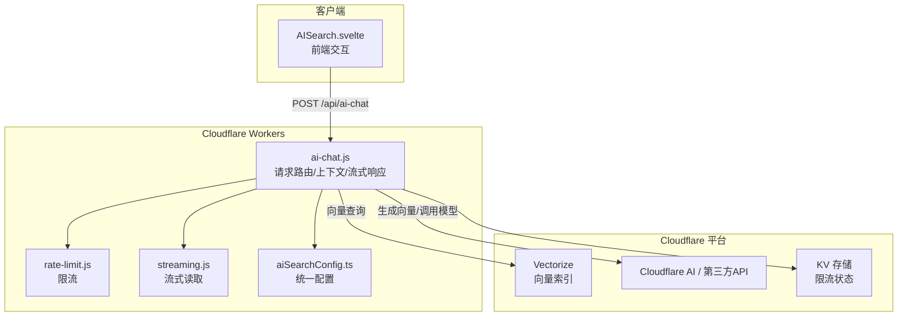
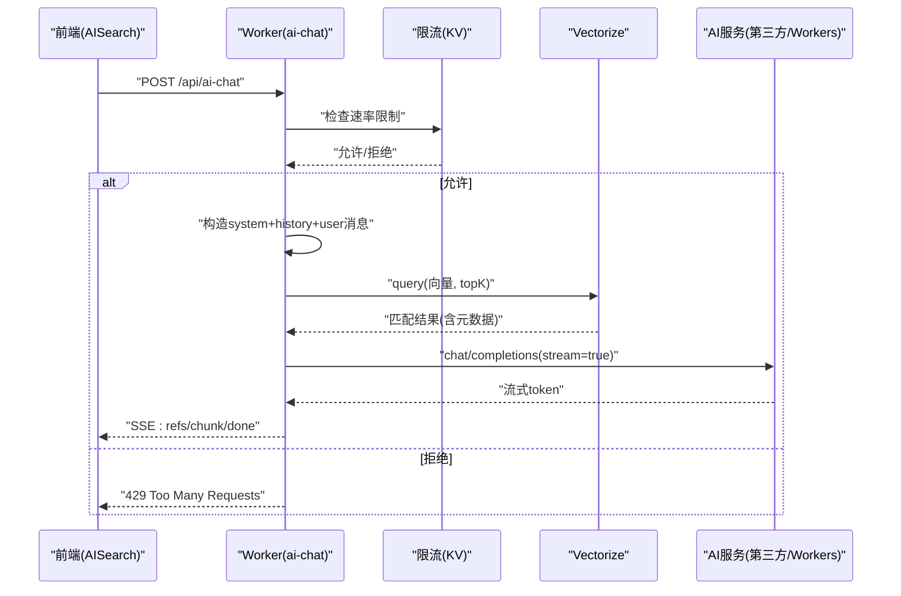
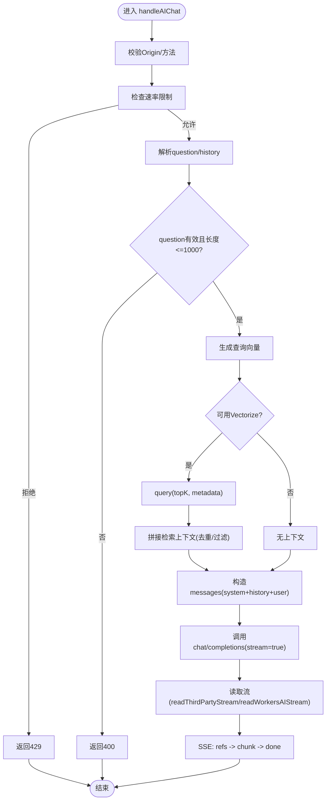
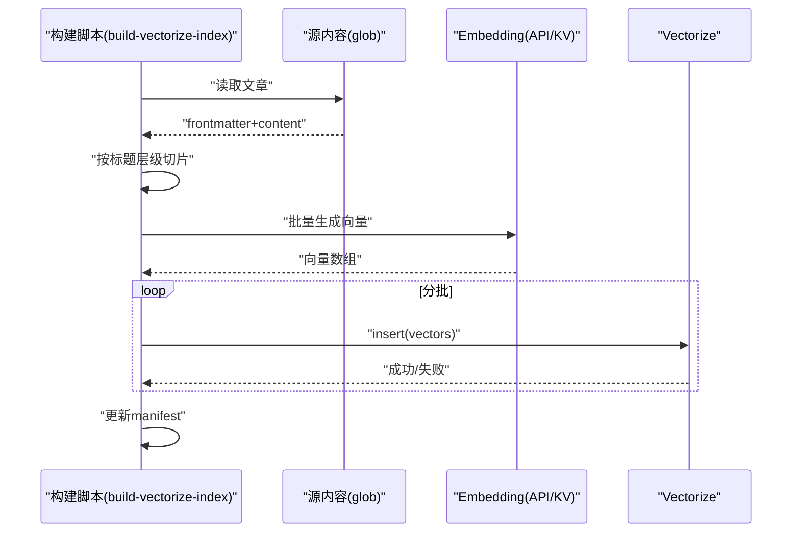
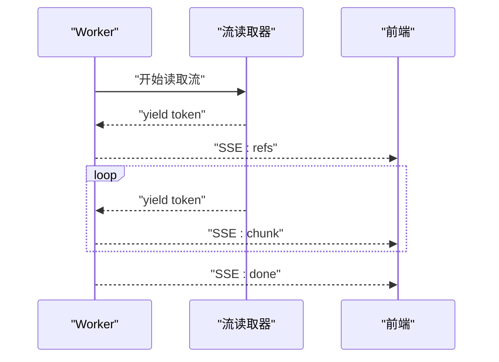
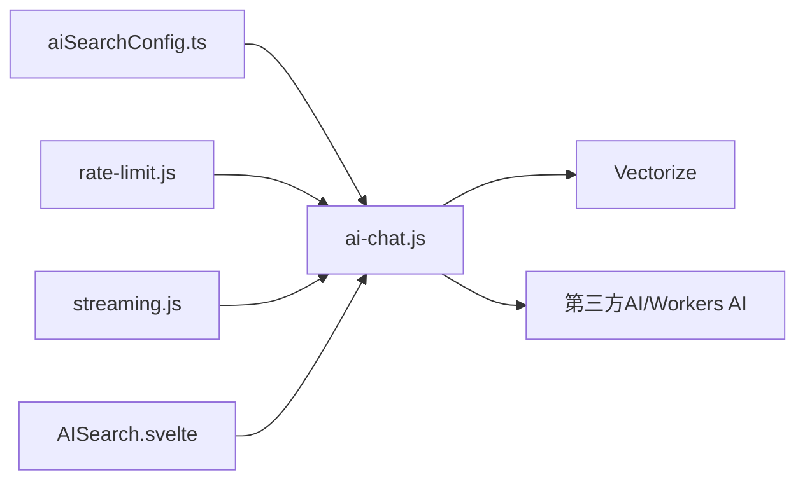

# AI聊天服务

<cite>
**本文引用的文件**
- [src/workers/ai-chat.js](file://src/workers/ai-chat.js)
- [src/config/aiSearchConfig.ts](file://src/config/aiSearchConfig.ts)
- [scripts/build-vectorize-index.js](file://scripts/build-vectorize-index.js)
- [src/workers/utils/streaming.js](file://src/workers/utils/streaming.js)
- [src/workers/utils/rate-limit.js](file://src/workers/utils/rate-limit.js)
- [src/components/controls/AISearch.svelte](file://src/components/controls/AISearch.svelte)
</cite>

## 目录
1. [简介](#简介)
2. [项目结构](#项目结构)
3. [核心组件](#核心组件)
4. [架构总览](#架构总览)
5. [组件详解](#组件详解)
6. [依赖关系分析](#依赖关系分析)
7. [性能考量](#性能考量)
8. [故障排查指南](#故障排查指南)
9. [结论](#结论)
10. [附录](#附录)

## 简介
本文件面向AI聊天服务的技术文档，聚焦于Cloudflare Workers上的AI聊天Worker实现、请求路由与上下文管理、Vectorize向量数据库的集成与检索、流式响应机制、配置项说明以及调试与扩展开发指南。文档旨在帮助开发者快速理解系统设计、定位问题并进行定制化扩展。

## 项目结构
围绕AI聊天服务的关键文件分布如下：
- Worker入口与业务逻辑：src/workers/ai-chat.js
- 配置中心：src/config/aiSearchConfig.ts
- 向量索引构建脚本：scripts/build-vectorize-index.js
- 流式读取工具：src/workers/utils/streaming.js
- 速率限制工具：src/workers/utils/rate-limit.js
- 前端AI搜索面板：src/components/controls/AISearch.svelte

图表来源
- [src/workers/ai-chat.js:199-396](file://src/workers/ai-chat.js#L199-L396)
- [src/workers/utils/streaming.js:1-33](file://src/workers/utils/streaming.js#L1-L33)
- [src/workers/utils/rate-limit.js:1-45](file://src/workers/utils/rate-limit.js#L1-L45)
- [src/config/aiSearchConfig.ts:8-29](file://src/config/aiSearchConfig.ts#L8-L29)

章节来源
- [src/workers/ai-chat.js:1-397](file://src/workers/ai-chat.js#L1-L397)
- [src/config/aiSearchConfig.ts:1-30](file://src/config/aiSearchConfig.ts#L1-L30)
- [scripts/build-vectorize-index.js:1-388](file://scripts/build-vectorize-index.js#L1-L388)
- [src/workers/utils/streaming.js:1-33](file://src/workers/utils/streaming.js#L1-L33)
- [src/workers/utils/rate-limit.js:1-45](file://src/workers/utils/rate-limit.js#L1-L45)
- [src/components/controls/AISearch.svelte](file://src/components/controls/AISearch.svelte)

## 核心组件
- AI聊天Worker（ai-chat.js）：负责跨域校验、速率限制、上下文拼装、向量检索、模型调用与流式返回。
- 配置中心（aiSearchConfig.ts）：集中管理API地址、模型名、向量维度、索引名等。
- 向量索引构建脚本（build-vectorize-index.js）：将文章按标题层级切片、生成向量并批量上传至Vectorize。
- 流式读取工具（streaming.js）：适配第三方与Workers AI两种流式响应格式。
- 速率限制工具（rate-limit.js）：基于KV的滑动窗口限流。
- 前端AI搜索面板（AISearch.svelte）：会话管理、消息历史与UI交互。

章节来源
- [src/workers/ai-chat.js:199-396](file://src/workers/ai-chat.js#L199-L396)
- [src/config/aiSearchConfig.ts:8-29](file://src/config/aiSearchConfig.ts#L8-L29)
- [scripts/build-vectorize-index.js:192-320](file://scripts/build-vectorize-index.js#L192-L320)
- [src/workers/utils/streaming.js:1-33](file://src/workers/utils/streaming.js#L1-L33)
- [src/workers/utils/rate-limit.js:1-45](file://src/workers/utils/rate-limit.js#L1-L45)
- [src/components/controls/AISearch.svelte](file://src/components/controls/AISearch.svelte)

## 架构总览
AI聊天服务采用“前端发起请求 → Worker鉴权与限流 → 生成向量/检索上下文 → 调用模型 → 流式返回”的链路。向量检索由Vectorize完成，嵌入生成可选择Cloudflare AI或第三方API，模型推理同样支持第三方或Workers AI。

图表来源
- [src/workers/ai-chat.js:199-396](file://src/workers/ai-chat.js#L199-L396)
- [src/workers/utils/rate-limit.js:8-45](file://src/workers/utils/rate-limit.js#L8-L45)
- [src/workers/utils/streaming.js:1-33](file://src/workers/utils/streaming.js#L1-L33)

## 组件详解

### AI聊天Worker（请求路由、上下文管理、响应生成）
- 跨域与方法校验：仅允许POST与OPTIONS，Origin白名单由环境变量与站点URL组合决定。
- 速率限制：基于IP与KV的滑动窗口，AI专用阈值与窗口。
- 输入校验：必填question，长度上限；history清洗与截断。
- 上下文拼装：将Vectorize检索到的文章摘要拼接为system提示的一部分，限定去重后的文章数。
- 消息构造：system（含Persona与检索上下文）+ 历史（最多6条，每条截断）+ 用户问题。
- 模型调用：支持第三方API与Workers AI，均开启流式输出。
- 流式返回：SSE格式，先发送refs（引用文章列表），再逐块发送chunk，最后done。
- 错误处理：捕获向量/检索/生成/流式异常，返回JSON错误或SSE error事件。

图表来源
- [src/workers/ai-chat.js:199-396](file://src/workers/ai-chat.js#L199-L396)
- [src/workers/utils/streaming.js:1-33](file://src/workers/utils/streaming.js#L1-L33)
- [src/workers/utils/rate-limit.js:8-45](file://src/workers/utils/rate-limit.js#L8-L45)

章节来源
- [src/workers/ai-chat.js:17-42](file://src/workers/ai-chat.js#L17-L42)
- [src/workers/ai-chat.js:215-250](file://src/workers/ai-chat.js#L215-L250)
- [src/workers/ai-chat.js:251-311](file://src/workers/ai-chat.js#L251-L311)
- [src/workers/ai-chat.js:313-396](file://src/workers/ai-chat.js#L313-L396)

### Vectorize向量数据库集成（构建与查询）
- 构建流程（脚本）：遍历文章 → 按标题层级切片 → 生成向量（第三方或Cloudflare AI）→ 分批插入Vectorize → 维护manifest（用于增量更新）。
- 查询流程（Worker）：对用户问题生成向量 → 调用Vectorize.query(topK, returnMetadata) → 过滤低分匹配 → 去重文章路径 → 拼接上下文与引用列表。

图表来源
- [scripts/build-vectorize-index.js:100-188](file://scripts/build-vectorize-index.js#L100-L188)
- [scripts/build-vectorize-index.js:192-222](file://scripts/build-vectorize-index.js#L192-L222)
- [scripts/build-vectorize-index.js:226-320](file://scripts/build-vectorize-index.js#L226-L320)

章节来源
- [scripts/build-vectorize-index.js:100-188](file://scripts/build-vectorize-index.js#L100-L188)
- [scripts/build-vectorize-index.js:192-222](file://scripts/build-vectorize-index.js#L192-L222)
- [scripts/build-vectorize-index.js:226-320](file://scripts/build-vectorize-index.js#L226-L320)
- [src/workers/ai-chat.js:254-282](file://src/workers/ai-chat.js#L254-L282)

### 流式响应机制（SSE、分块传输、实时渲染）
- SSE格式：refs（首次发送引用文章列表）、chunk（流式token块）、done（结束标记）。
- 两套读取器：readThirdPartyStream适配第三方API的data行；readWorkersAIStream适配Workers AI的原始流。
- 前端接收：监听SSE事件，先渲染引用，再逐步追加token，最后标记完成。

图表来源
- [src/workers/ai-chat.js:324-396](file://src/workers/ai-chat.js#L324-L396)
- [src/workers/utils/streaming.js:1-33](file://src/workers/utils/streaming.js#L1-L33)

章节来源
- [src/workers/ai-chat.js:324-396](file://src/workers/ai-chat.js#L324-L396)
- [src/workers/utils/streaming.js:1-33](file://src/workers/utils/streaming.js#L1-L33)

### 聊天上下文管理（会话状态、历史存储、上下文窗口）
- 会话状态：前端AISearch.svelte负责会话列表与当前会话切换，持久化当前会话消息。
- 历史存储：前端本地缓存与全局状态，Worker侧history清洗与截断。
- 上下文窗口：system+history+user构成最终messages，history最多6条，每条内容截断，避免超限。

章节来源
- [src/components/controls/AISearch.svelte:372-417](file://src/components/controls/AISearch.svelte#L372-L417)
- [src/workers/ai-chat.js:298-311](file://src/workers/ai-chat.js#L298-L311)

### 配置选项（模型参数、温度、最大令牌数）
- 配置中心（aiSearchConfig.ts）：统一管理API地址、模型名、Embedding模型、向量维度、索引名、批大小等。
- Worker侧使用：AI_API_KEY、ALLOWED_ORIGINS、PUBLIC_SITE_URL等环境变量参与运行时决策。
- 注意：当前Worker未显式透传temperature或max_tokens参数，如需启用可在generateAnswer中扩展请求体字段。

章节来源
- [src/config/aiSearchConfig.ts:8-29](file://src/config/aiSearchConfig.ts#L8-L29)
- [src/workers/ai-chat.js:44-62](file://src/workers/ai-chat.js#L44-L62)
- [src/workers/ai-chat.js:100-121](file://src/workers/ai-chat.js#L100-L121)

## 依赖关系分析
- Worker依赖配置中心（aiSearchConfig.ts）与KV限流（rate-limit.js），读取流依赖streaming.js。
- 向量检索依赖Vectorize，嵌入生成可依赖第三方API或Cloudflare AI。
- 前端依赖AISearch.svelte进行会话与消息管理。

图表来源
- [src/workers/ai-chat.js:1-10](file://src/workers/ai-chat.js#L1-L10)
- [src/config/aiSearchConfig.ts:8-29](file://src/config/aiSearchConfig.ts#L8-L29)
- [src/workers/utils/streaming.js:1-33](file://src/workers/utils/streaming.js#L1-L33)
- [src/workers/utils/rate-limit.js:1-45](file://src/workers/utils/rate-limit.js#L1-L45)
- [src/components/controls/AISearch.svelte](file://src/components/controls/AISearch.svelte)

章节来源
- [src/workers/ai-chat.js:1-10](file://src/workers/ai-chat.js#L1-L10)
- [src/config/aiSearchConfig.ts:8-29](file://src/config/aiSearchConfig.ts#L8-L29)
- [src/workers/utils/streaming.js:1-33](file://src/workers/utils/streaming.js#L1-L33)
- [src/workers/utils/rate-limit.js:1-45](file://src/workers/utils/rate-limit.js#L1-L45)
- [src/components/controls/AISearch.svelte](file://src/components/controls/AISearch.svelte)

## 性能考量
- 向量检索topK与过滤分数可影响延迟与准确性，建议结合业务调参。
- 批量上传向量时的批次大小与并发间隔有助于平衡吞吐与平台限速。
- 流式返回降低首token延迟，提升交互体验。
- 限流策略防止突发流量压垮下游服务。

## 故障排查指南
- 跨域/方法错误：检查Origin是否在白名单内，确保仅POST/ OPTIONS。
- 速率限制：查看KV中对应key的计数与过期时间，确认窗口与阈值。
- 向量检索为空：确认Vectorize索引存在、维度一致、分数阈值合理。
- 模型调用失败：检查API密钥、模型名、API地址与网络连通性。
- 流式读取异常：区分第三方与Workers AI的流格式，核对读取器使用情况。
- 日志定位：Worker内部对关键错误进行console输出，便于排障。

章节来源
- [src/workers/ai-chat.js:199-396](file://src/workers/ai-chat.js#L199-L396)
- [src/workers/utils/rate-limit.js:8-45](file://src/workers/utils/rate-limit.js#L8-L45)
- [src/workers/utils/streaming.js:1-33](file://src/workers/utils/streaming.js#L1-L33)

## 结论
该AI聊天服务通过清晰的职责划分与模块化设计，实现了从请求接入、上下文检索、模型推理到流式返回的完整链路。借助Vectorize与可选的第三方AI能力，系统具备良好的扩展性与可维护性。建议后续在配置中心增加temperature/max_tokens等参数，并完善错误事件的SSE通知，以进一步提升可观测性与易用性。

## 附录

### 扩展开发指南
- 自定义提示词与Persona：在Worker中修改system提示词模板，增强角色设定与业务规则。
- 自定义响应格式：前端监听SSE事件，按refs/chunk/done进行差异化渲染。
- 新增模型：在配置中心添加模型名与Embedding模型，Worker侧按第三方或Workers AI分支调用。
- 自定义检索策略：调整Vectorize查询参数（如topK、分数阈值）与上下文拼接逻辑。

章节来源
- [src/workers/ai-chat.js:123-197](file://src/workers/ai-chat.js#L123-L197)
- [src/config/aiSearchConfig.ts:8-29](file://src/config/aiSearchConfig.ts#L8-L29)
- [src/components/controls/AISearch.svelte](file://src/components/controls/AISearch.svelte)