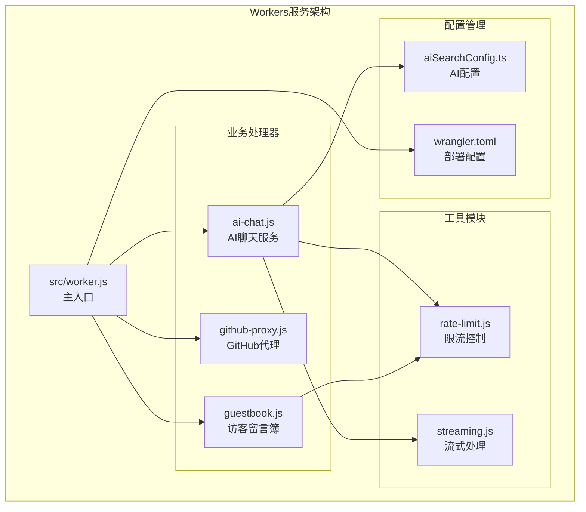
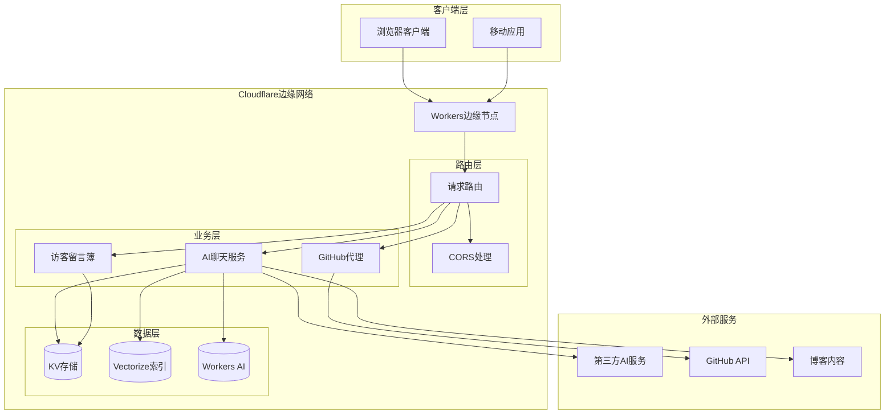
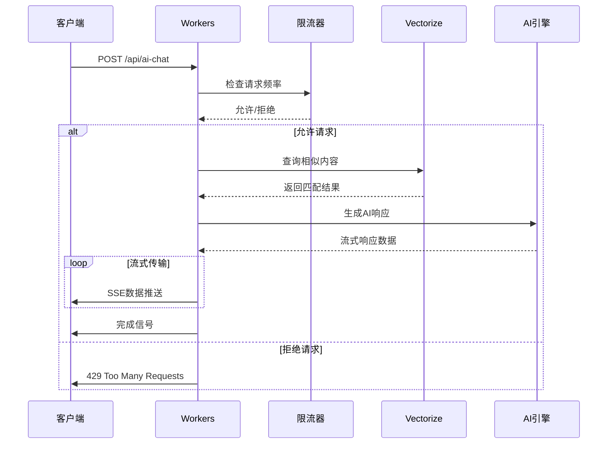
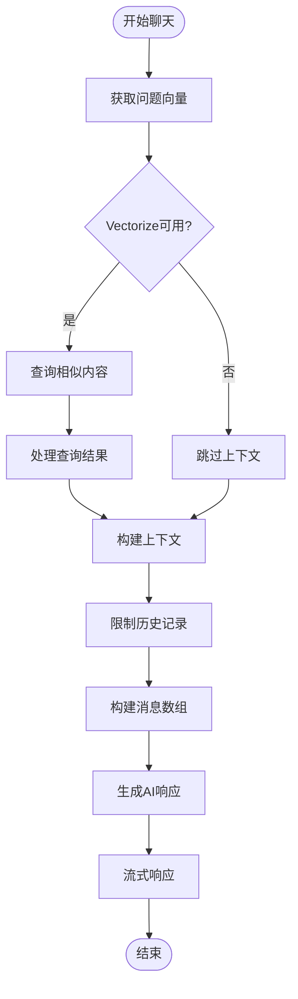
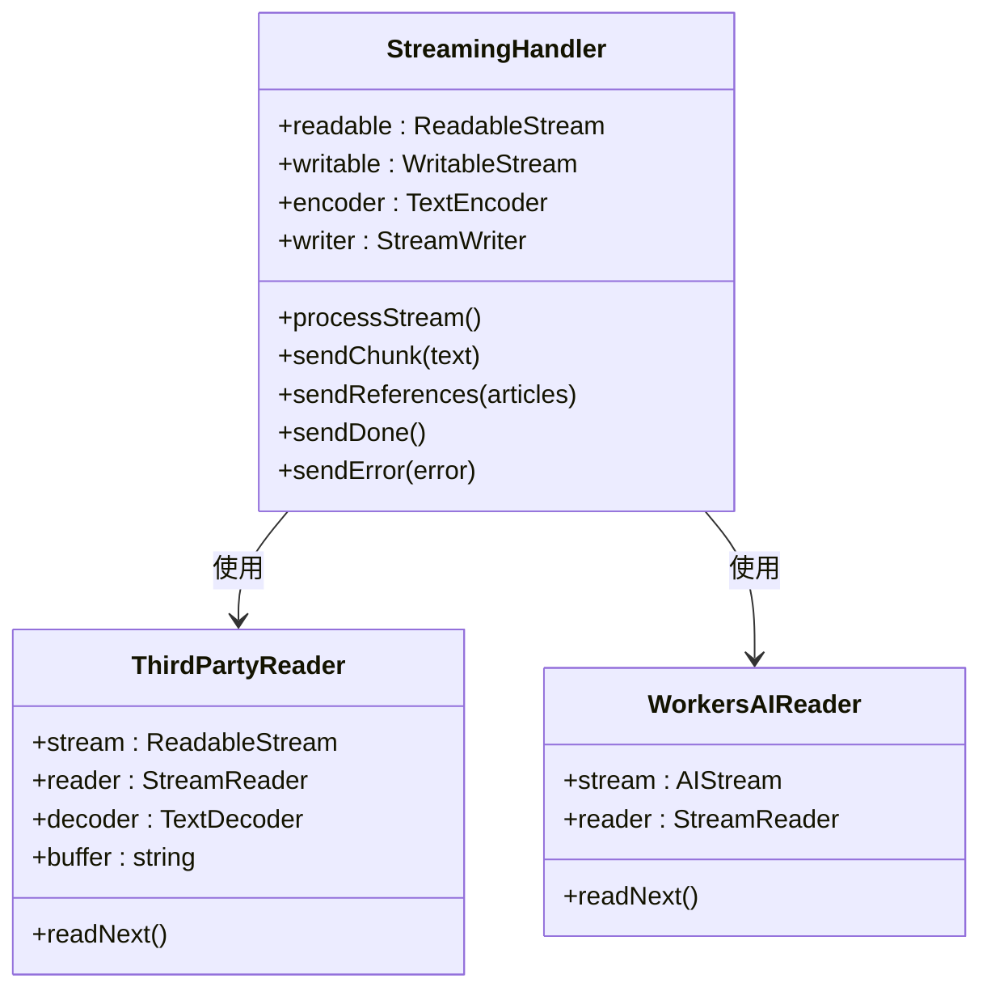
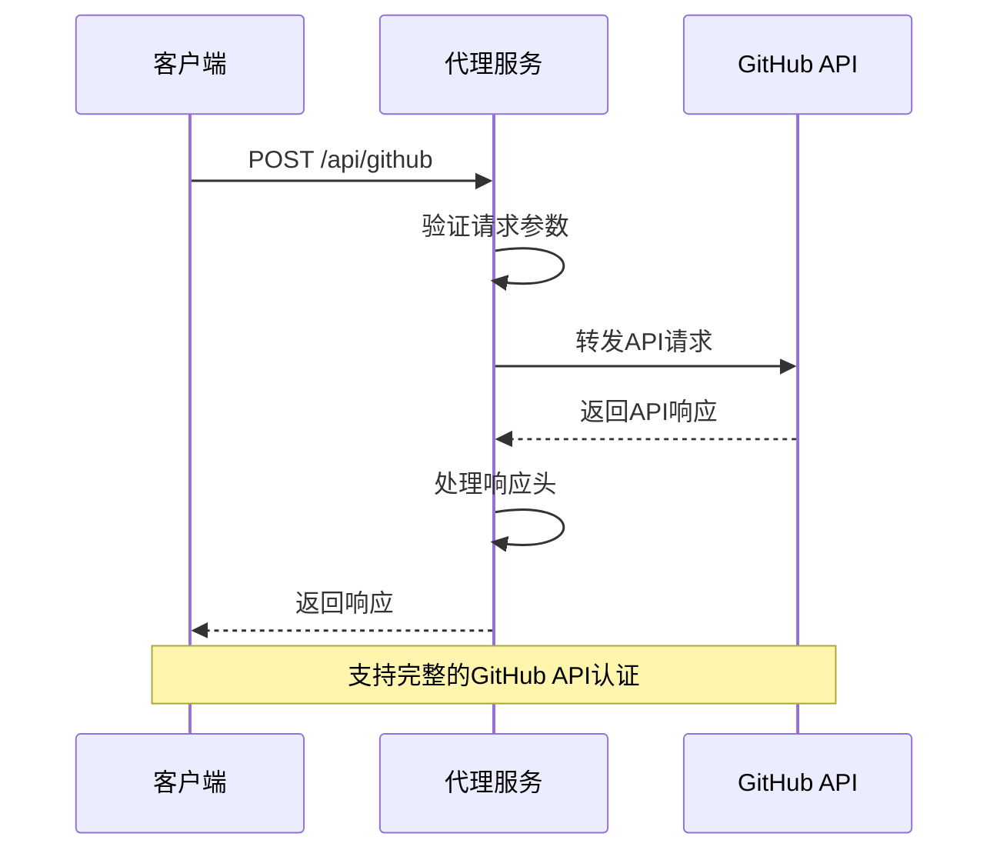
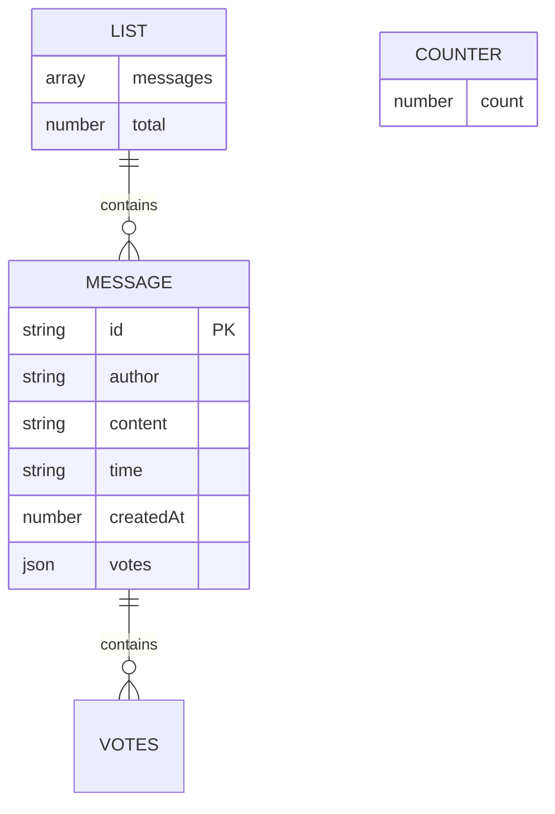
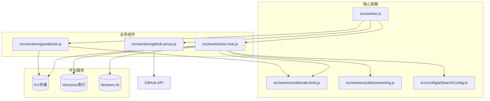

# Cloudflare Workers服务

<cite>
**本文档引用的文件**
- [src/worker.js](file://src/worker.js)
- [src/workers/ai-chat.js](file://src/workers/ai-chat.js)
- [src/workers/github-proxy.js](file://src/workers/github-proxy.js)
- [src/workers/guestbook.js](file://src/workers/guestbook.js)
- [src/workers/utils/rate-limit.js](file://src/workers/utils/rate-limit.js)
- [src/workers/utils/streaming.js](file://src/workers/utils/streaming.js)
- [src/config/aiSearchConfig.ts](file://src/config/aiSearchConfig.ts)
- [wrangler.toml](file://wrangler.toml)
- [package.json](file://package.json)
- [scripts/build-vectorize-index.js](file://scripts/build-vectorize-index.js)
</cite>

## 目录
1. [简介](#简介)
2. [项目结构](#项目结构)
3. [核心组件](#核心组件)
4. [架构概览](#架构概览)
5. [详细组件分析](#详细组件分析)
6. [依赖关系分析](#依赖关系分析)
7. [性能考虑](#性能考虑)
8. [故障排除指南](#故障排除指南)
9. [结论](#结论)
10. [附录](#附录)

## 简介
本项目为Firefly-Mod提供的Cloudflare Workers服务，采用无服务器架构设计，通过Workers实现AI聊天、GitHub代理和访客留言簿三大核心功能。系统充分利用Cloudflare平台的边缘网络优势，提供低延迟、高可用的服务能力。

## 项目结构
项目采用模块化组织方式，核心逻辑集中在src/workers目录下，通过主入口文件统一路由分发：

**图表来源**
- [src/worker.js:1-27](file://src/worker.js#L1-L27)
- [src/workers/ai-chat.js:1-397](file://src/workers/ai-chat.js#L1-L397)
- [src/workers/github-proxy.js:1-122](file://src/workers/github-proxy.js#L1-L122)
- [src/workers/guestbook.js:1-259](file://src/workers/guestbook.js#L1-L259)

**章节来源**
- [src/worker.js:1-27](file://src/worker.js#L1-L27)
- [wrangler.toml:1-36](file://wrangler.toml#L1-L36)

## 核心组件
系统包含三个主要业务组件，每个组件都实现了完整的请求处理、数据验证和错误处理机制：

### AI聊天服务
- 支持第三方AI服务和Cloudflare Workers AI两种模式
- 集成Vectorize向量搜索，提供智能上下文增强
- 实现流式响应，支持实时消息传输
- 包含完整的限流控制和安全防护

### GitHub代理服务
- 提供CORS跨域解决方案
- 支持多种HTTP方法和请求头传递
- 实现认证凭据的安全转发
- 具备错误重试和状态码映射

### 访客留言簿
- 基于KV存储的消息管理系统
- 多层次输入验证和安全过滤
- 支持点赞投票功能
- 实现智能限流防止滥用

**章节来源**
- [src/workers/ai-chat.js:199-396](file://src/workers/ai-chat.js#L199-L396)
- [src/workers/github-proxy.js:38-121](file://src/workers/github-proxy.js#L38-L121)
- [src/workers/guestbook.js:222-258](file://src/workers/guestbook.js#L222-L258)

## 架构概览
系统采用事件驱动的无服务器架构，通过Cloudflare Workers的边缘网络实现全球分布式部署：

**图表来源**
- [src/worker.js:6-25](file://src/worker.js#L6-L25)
- [src/workers/ai-chat.js:44-52](file://src/workers/ai-chat.js#L44-L52)
- [src/workers/github-proxy.js:77-121](file://src/workers/github-proxy.js#L77-L121)
- [src/workers/guestbook.js:90-173](file://src/workers/guestbook.js#L90-L173)

## 详细组件分析

### AI聊天服务实现

AI聊天服务是系统的核心功能，实现了完整的对话式AI交互体验：

#### 请求路由与处理流程

**图表来源**
- [src/workers/ai-chat.js:199-396](file://src/workers/ai-chat.js#L199-L396)
- [src/workers/utils/rate-limit.js:8-45](file://src/workers/utils/rate-limit.js#L8-L45)

#### 上下文管理机制
AI服务实现了智能的上下文增强机制：

**图表来源**
- [src/workers/ai-chat.js:254-311](file://src/workers/ai-chat.js#L254-L311)
- [src/workers/ai-chat.js:338-364](file://src/workers/ai-chat.js#L338-L364)

#### 流式传输机制
系统采用Server-Sent Events实现高效的流式响应：

**图表来源**
- [src/workers/ai-chat.js:324-388](file://src/workers/ai-chat.js#L324-L388)
- [src/workers/utils/streaming.js:1-33](file://src/workers/utils/streaming.js#L1-L33)

**章节来源**
- [src/workers/ai-chat.js:199-396](file://src/workers/ai-chat.js#L199-L396)
- [src/workers/utils/streaming.js:1-33](file://src/workers/utils/streaming.js#L1-L33)

### GitHub代理服务实现

GitHub代理服务解决了浏览器跨域访问GitHub API的问题：

#### API转发与认证处理

**图表来源**
- [src/workers/github-proxy.js:38-121](file://src/workers/github-proxy.js#L38-L121)

#### 错误重试策略
代理服务实现了健壮的错误处理机制：

| 错误类型 | 处理策略 | 重试次数 |
|---------|---------|---------|
| 网络超时 | 直接返回502错误 | 0次 |
| API限流 | 返回标准错误格式 | 0次 |
| 参数无效 | 返回400错误 | 0次 |
| 服务器错误 | 返回500错误 | 0次 |

**章节来源**
- [src/workers/github-proxy.js:38-121](file://src/workers/github-proxy.js#L38-L121)

### 访客留言簿实现

访客留言簿提供了完整的用户交互功能：

#### 数据存储架构

**图表来源**
- [src/workers/guestbook.js:156-163](file://src/workers/guestbook.js#L156-L163)

#### 输入验证与安全防护
系统实现了多层次的安全防护机制：

**输入验证规则**：
- 作者名：2-30字符，必填
- 内容：5-500字符，必填  
- 禁止关键词：包含恶意脚本代码
- HTML转义：防止XSS攻击

**章节来源**
- [src/workers/guestbook.js:56-81](file://src/workers/guestbook.js#L56-L81)
- [src/workers/guestbook.js:118-173](file://src/workers/guestbook.js#L118-L173)

## 依赖关系分析

系统采用松耦合的设计，各组件间依赖关系清晰：

**图表来源**
- [src/worker.js:1-3](file://src/worker.js#L1-L3)
- [src/workers/ai-chat.js:1-10](file://src/workers/ai-chat.js#L1-L10)
- [src/workers/guestbook.js:1-5](file://src/workers/guestbook.js#L1-L5)

**章节来源**
- [src/worker.js:1-27](file://src/worker.js#L1-L27)
- [src/workers/ai-chat.js:1-10](file://src/workers/ai-chat.js#L1-L10)

## 性能考虑

### 并发控制与限流机制
系统实现了多层级的限流控制：

| 组件 | 速率限制 | 时间窗口 | 用途 |
|------|---------|---------|------|
| AI聊天 | 10次/60秒 | 60秒 | 防止AI服务滥用 |
| 留言簿 | 5次/60秒 | 60秒 | 防止刷屏 |
| 留言投票 | 30次/60秒 | 60秒 | 防止刷票 |

### 内存管理
- 流式处理避免大对象内存占用
- 请求体大小限制（1000字符）
- 历史记录截断（最多6条）

### 执行时间优化
- Vectorize查询设置阈值过滤（score > 0.2）
- 批量处理向量嵌入（默认500个批次）
- CDN缓存静态资源

## 故障排除指南

### 常见问题诊断

**AI聊天服务问题**：
- 检查AI_API_KEY配置
- 验证Vectorize索引状态
- 确认请求体格式正确

**GitHub代理问题**：
- 验证Authorization头传递
- 检查目标路径格式
- 确认网络连通性

**留言簿问题**：
- 检查KV存储权限
- 验证输入数据格式
- 查看限流状态

### 调试方法
- 启用Cloudflare Workers日志
- 使用wrangler dev进行本地调试
- 监控Vectorize查询性能

**章节来源**
- [src/workers/ai-chat.js:314-322](file://src/workers/ai-chat.js#L314-L322)
- [src/workers/github-proxy.js:115-120](file://src/workers/github-proxy.js#L115-L120)

## 结论
本Cloudflare Workers服务通过模块化设计和无服务器架构，实现了高性能、可扩展的AI聊天、GitHub代理和留言簿服务。系统充分利用Cloudflare平台的边缘网络优势，提供低延迟的全球服务体验。通过合理的限流控制、流式传输和智能缓存策略，确保了良好的用户体验和资源利用率。

## 附录

### 部署配置说明

**环境变量配置**：
- AI_API_KEY：第三方AI服务密钥
- GH_APP_ID：GitHub App ID
- GH_PRIVATE_KEY：GitHub私钥
- ALLOWED_ORIGINS：允许的域名列表

**绑定配置**：
- VISITOR_KV：KV命名空间绑定
- VECTORIZE：Vectorize索引绑定
- AI：Workers AI绑定

**章节来源**
- [wrangler.toml:8-36](file://wrangler.toml#L8-L36)

### 开发指南

**新增功能步骤**：
1. 在src/workers目录创建新组件
2. 在src/worker.js中注册路由
3. 配置必要的环境变量和绑定
4. 编写单元测试和集成测试
5. 更新部署配置

**最佳实践**：
- 使用流式处理提升响应速度
- 实施适当的限流策略
- 添加详细的错误处理和日志记录
- 优化Vectorize查询性能