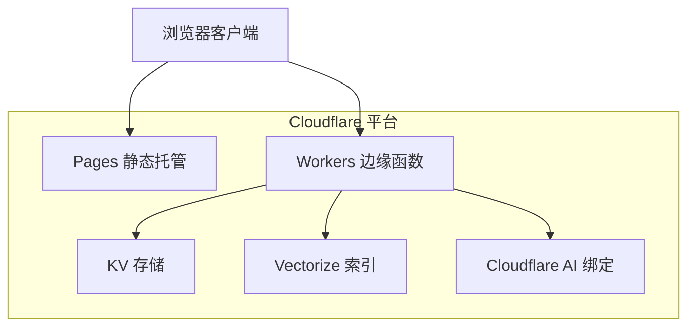
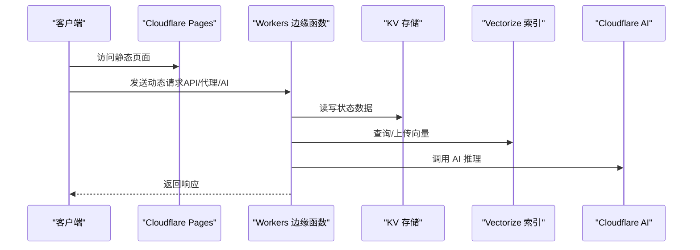
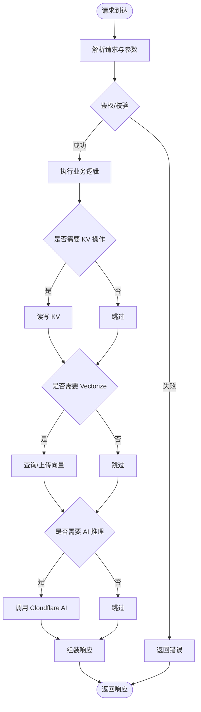
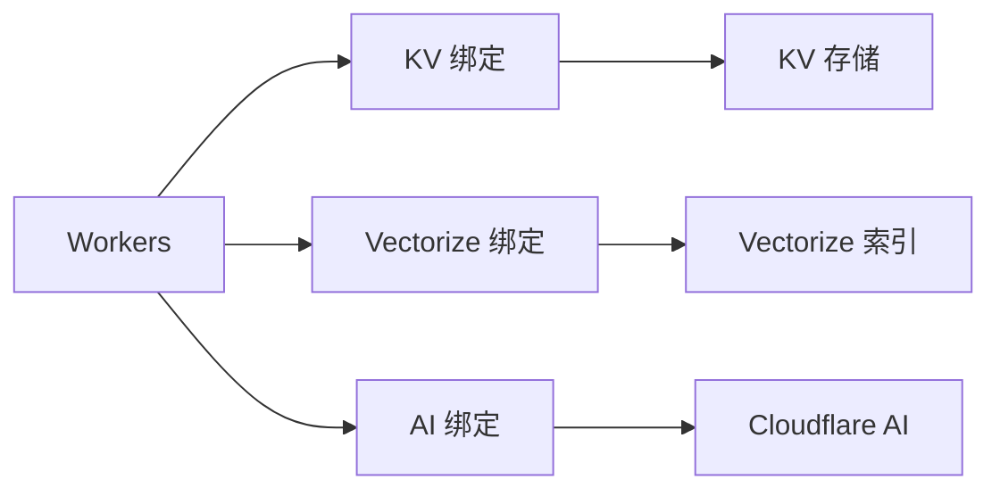
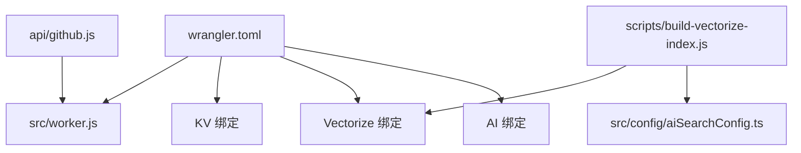

# Workers架构概览

<cite>
**本文档引用的文件**
- [wrangler.toml](file://wrangler.toml)
- [README.md](file://README.md)
- [build-vectorize-index.js](file://scripts/build-vectorize-index.js)
- [github.js](file://api/github.js)
- [worker.js](file://src/worker.js)
</cite>

## 目录
1. [项目简介](#项目简介)
2. [项目结构](#项目结构)
3. [核心组件](#核心组件)
4. [架构总览](#架构总览)
5. [详细组件分析](#详细组件分析)
6. [依赖关系分析](#依赖关系分析)
7. [性能考虑](#性能考虑)
8. [故障排除指南](#故障排除指南)
9. [结论](#结论)

## 项目简介
本项目基于 Cloudflare Workers 提供的无服务器计算能力，结合 Pages 静态托管与 Workers 边缘运行时，实现博客站点的动态逻辑与数据处理。项目通过 Wrangler 配置 Workers，使用 KV 存储状态数据，利用 Vectorize 索引实现 AI 搜索，并通过 Cloudflare AI 绑定调用 AI 能力。同时，项目包含构建脚本以增量更新 Vectorize 索引，确保搜索内容与站点内容保持同步。

## 项目结构
项目采用前端静态站点与 Workers 边缘逻辑分离的架构：
- 静态资源与页面由 Cloudflare Pages 托管
- Workers 作为边缘函数处理动态请求、代理与 AI 相关逻辑
- 配置文件通过 wrangler.toml 定义 Workers 主入口、资产目录、KV/Vectorize/Cloudflare AI 绑定以及环境变量
- 构建脚本负责将博客内容切片并生成向量嵌入，上传至 Vectorize 索引

**图表来源**
- [wrangler.toml:1-35](file://wrangler.toml#L1-L35)

**章节来源**
- [wrangler.toml:1-35](file://wrangler.toml#L1-L35)

## 核心组件
- Workers 主入口与路由
  - 主入口文件定义于 [src/worker.js](file://src/worker.js)，作为 Pages 部署的主文件，承载边缘逻辑。
  - 路由与请求处理在 Workers 中集中管理，支持动态 API、静态资源代理与 AI 功能调用。
- 配置管理
  - 通过 [wrangler.toml:1-35](file://wrangler.toml#L1-L35) 定义：
    - 名称与兼容性日期
    - 主入口路径
    - 静态资产目录映射
    - KV 命名空间绑定
    - Vectorize 索引绑定
    - Cloudflare AI 绑定
    - 环境变量（如节点版本、统计 API 地址、密钥等）
- 数据与索引
  - KV 存储用于持久化状态数据（如访客计数、用户会话等）
  - Vectorize 索引用于 AI 搜索，构建脚本 [scripts/build-vectorize-index.js:1-97](file://scripts/build-vectorize-index.js#L1-L97) 实现内容切片、嵌入生成与增量上传
- 动态 API 示例
  - [api/github.js](file://api/github.js) 展示了在 Workers 中处理外部 API 请求的典型模式（鉴权、转发与响应）

**章节来源**
- [wrangler.toml:1-35](file://wrangler.toml#L1-L35)
- [build-vectorize-index.js:1-97](file://scripts/build-vectorize-index.js#L1-L97)
- [github.js:1-200](file://api/github.js#L1-L200)

## 架构总览
Workers 在 Cloudflare 边缘网络中运行，具备以下特性：
- 无服务器与边缘化：就近处理请求，降低延迟
- 事件驱动：按需执行，适合高并发场景
- 与平台服务深度集成：KV、Vectorize、AI 绑定简化开发
- 配置即代码：通过 wrangler.toml 管理环境、绑定与部署参数

**图表来源**
- [wrangler.toml:1-35](file://wrangler.toml#L1-L35)
- [build-vectorize-index.js:1-97](file://scripts/build-vectorize-index.js#L1-L97)

## 详细组件分析

### Workers 生命周期与事件处理
- 生命周期
  - Pages 部署时加载 [src/worker.js](file://src/worker.js) 作为主入口
  - Workers 在请求到达时被激活，处理完成后可能进入休眠，节省资源
- 事件处理
  - 通过 [api/github.js:1-200](file://api/github.js#L1-L200) 展示了典型的请求处理流程：解析请求、鉴权、调用外部服务、返回响应
  - 支持自定义路由与中间件，便于扩展更多 API

**图表来源**
- [github.js:1-200](file://api/github.js#L1-L200)

**章节来源**
- [github.js:1-200](file://api/github.js#L1-L200)
- [src/worker.js](file://src/worker.js)

### Workers 与平台服务集成
- KV 存储
  - 在 [wrangler.toml:26-28](file://wrangler.toml#L26-L28) 中声明命名空间绑定，可在 Workers 中通过绑定名称访问 KV
- Vectorize 索引
  - 通过 [wrangler.toml:30-32](file://wrangler.toml#L30-L32) 绑定索引，配合 [scripts/build-vectorize-index.js:1-97](file://scripts/build-vectorize-index.js#L1-L97) 实现内容切片与嵌入上传
- Cloudflare AI
  - 通过 [wrangler.toml](file://wrangler.toml#L34) 绑定 AI，可在 Workers 中直接调用 AI 推理能力

**图表来源**
- [wrangler.toml:26-34](file://wrangler.toml#L26-L34)

**章节来源**
- [wrangler.toml:26-34](file://wrangler.toml#L26-L34)
- [build-vectorize-index.js:1-97](file://scripts/build-vectorize-index.js#L1-L97)

### 配置管理（wrangler.toml）
- 基本配置
  - name、compatibility_date、main 指定项目名称、兼容性日期与主入口
- 资产目录
  - [assets] 指定静态资源目录，与 Pages 部署联动
- 绑定配置
  - vars：环境变量（如节点版本、统计 API 地址）
  - kv_namespaces：KV 命名空间绑定
  - vectorize：Vectorize 索引绑定
  - ai：Cloudflare AI 绑定
- 安全与密钥
  - README 中提示敏感信息应通过 Cloudflare Dashboard 的 Variables and Secrets 管理，避免硬编码

**章节来源**
- [wrangler.toml:1-35](file://wrangler.toml#L1-L35)
- [README.md:156-181](file://README.md#L156-L181)

### 性能特点
- 冷启动优化
  - Workers 采用按需激活机制，减少闲置资源占用；建议将热点数据放入 KV 以降低外部依赖
- 内存管理
  - Workers 运行时对内存有限制，应避免长时间持有大对象；合理使用流式处理与分块上传
- 执行时间限制
  - 控制请求处理时间，避免超时；对外部 API 调用设置合理的超时与重试策略
- 缓存与静态资源
  - Pages 默认缓存策略适用于静态资源；Workers 中可结合 KV 缓存热点数据

**章节来源**
- [README.md:156-181](file://README.md#L156-L181)

### 调试与监控
- 日志记录
  - 在 Workers 中使用标准日志接口输出请求与错误信息，便于排查
- 错误追踪
  - 对外部 API 调用进行错误捕获与降级处理，记录状态码与错误消息
- 性能分析
  - 结合 Pages 与 Workers 的性能指标，定位瓶颈（如 KV 查询、Vectorize 上传、AI 推理耗时）

**章节来源**
- [github.js:1-200](file://api/github.js#L1-L200)

### 安全考虑与最佳实践
- 密钥管理
  - 敏感信息通过 Cloudflare Dashboard 的 Variables and Secrets 管理，避免提交到版本库
- 跨域与来源控制
  - 在 API 中校验来源域名，防止跨站请求滥用
- 输入验证与清理
  - 对用户输入进行严格校验与清理，避免注入攻击
- 最小权限原则
  - 仅授予必要的 KV/Vectorize/AI 权限，降低风险面

**章节来源**
- [README.md:156-181](file://README.md#L156-L181)

## 依赖关系分析
- 配置依赖
  - [wrangler.toml:1-35](file://wrangler.toml#L1-L35) 是 Workers 部署与运行的核心配置，定义了主入口、资产目录、绑定与环境变量
- 构建与索引
  - [scripts/build-vectorize-index.js:1-97](file://scripts/build-vectorize-index.js#L1-L97) 依赖配置文件与 Cloudflare API，负责内容切片与向量上传
- 动态逻辑
  - [api/github.js:1-200](file://api/github.js#L1-L200) 展示了在 Workers 中处理外部 API 的典型模式

**图表来源**
- [wrangler.toml:1-35](file://wrangler.toml#L1-L35)
- [build-vectorize-index.js:1-97](file://scripts/build-vectorize-index.js#L1-L97)
- [github.js:1-200](file://api/github.js#L1-L200)

**章节来源**
- [wrangler.toml:1-35](file://wrangler.toml#L1-L35)
- [build-vectorize-index.js:1-97](file://scripts/build-vectorize-index.js#L1-L97)
- [github.js:1-200](file://api/github.js#L1-L200)

## 性能考虑
- 冷启动与并发
  - Workers 适合高并发短任务；对于长耗时任务，建议拆分为多个轻量 Workers 或使用队列
- KV 与 Vectorize
  - 合理设计键名与数据结构，减少 KV 读写次数；Vectorize 查询前进行过滤与分页
- AI 推理
  - 控制批量大小与并发度，避免触发配额限制；对推理结果进行缓存复用

## 故障排除指南
- 部署与配置
  - 确认 [wrangler.toml:1-35](file://wrangler.toml#L1-L35) 中的绑定与环境变量正确；检查 Pages 与 Workers 的关联
- KV 访问
  - 确认命名空间 ID 与绑定名称一致；检查权限与配额
- Vectorize 索引
  - 使用 [scripts/build-vectorize-index.js:1-97](file://scripts/build-vectorize-index.js#L1-L97) 验证索引构建流程；检查嵌入维度与批大小
- API 调用
  - 在 [api/github.js:1-200](file://api/github.js#L1-L200) 中增加详细的错误日志与重试逻辑

**章节来源**
- [wrangler.toml:1-35](file://wrangler.toml#L1-L35)
- [build-vectorize-index.js:1-97](file://scripts/build-vectorize-index.js#L1-L97)
- [github.js:1-200](file://api/github.js#L1-L200)

## 结论
本项目通过 Cloudflare Workers 实现了边缘化的动态逻辑与数据处理，结合 KV、Vectorize 与 Cloudflare AI，提供了完整的无服务器架构方案。通过合理的配置管理、性能优化与安全实践，能够在保证低延迟与高可用的同时，持续扩展 AI 搜索与代理能力。