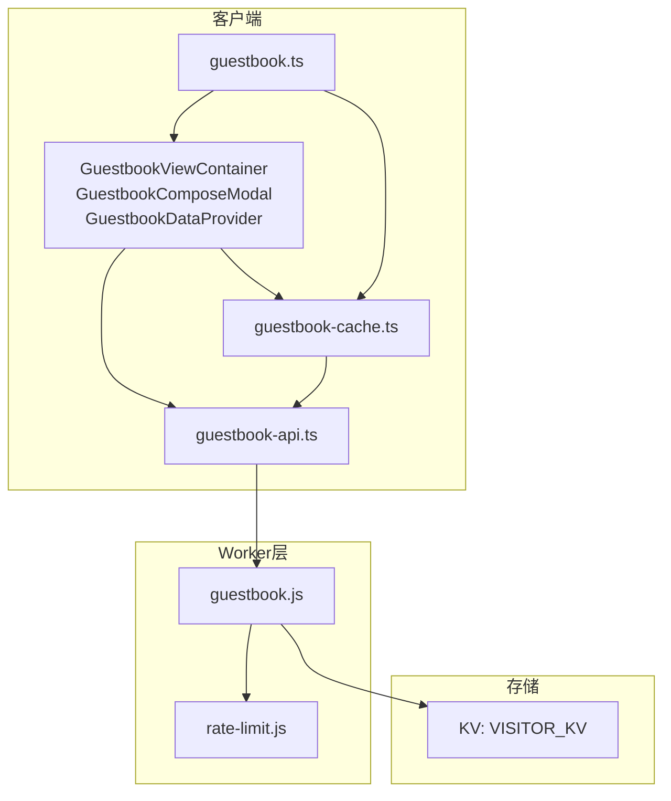
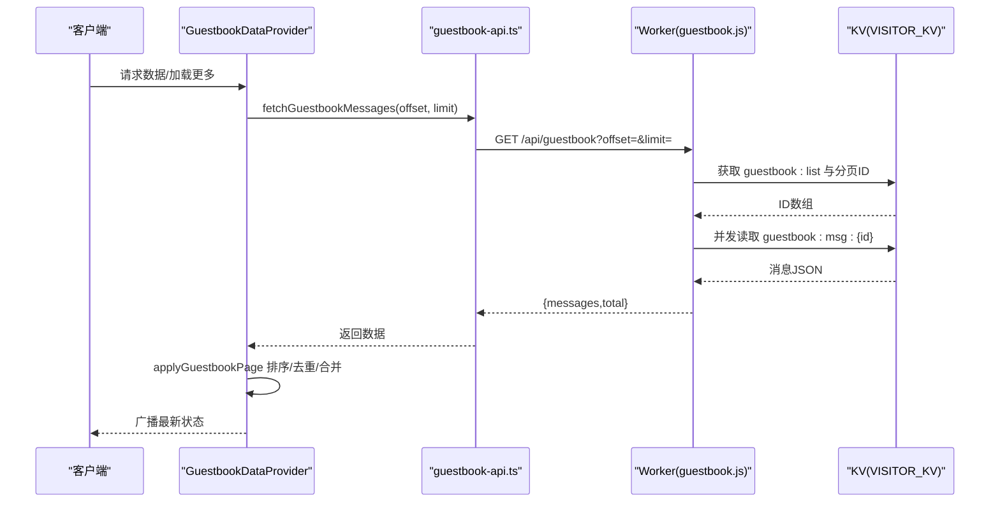
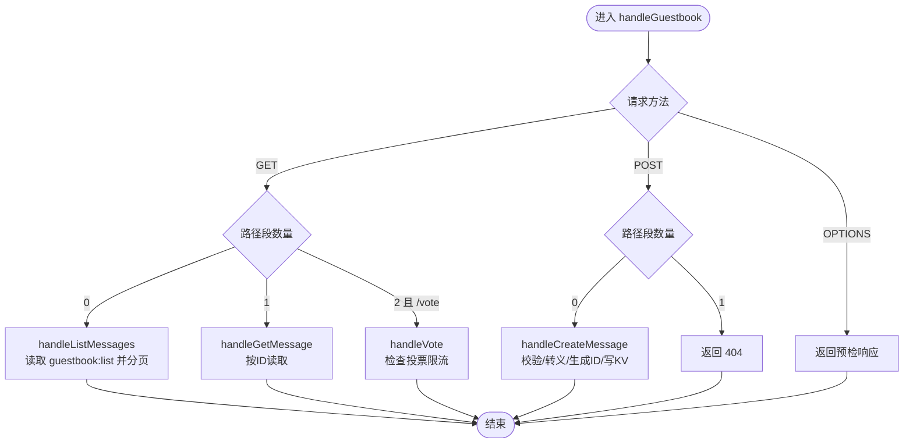
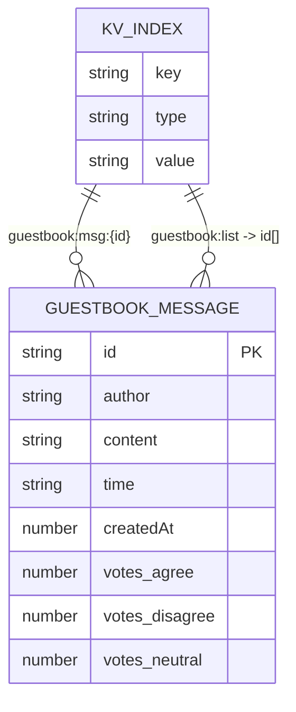
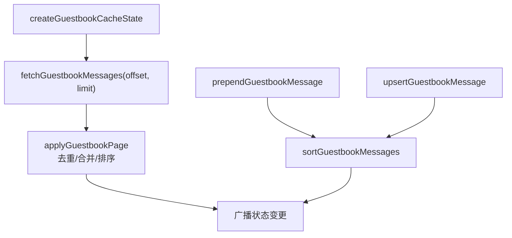
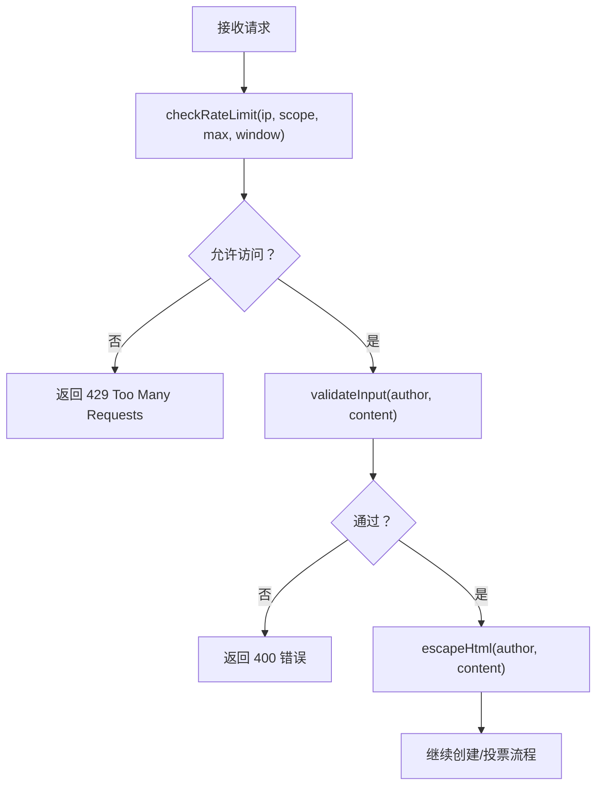
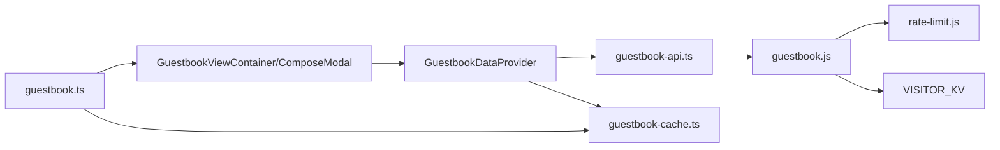

# 访客留言簿服务

<cite>
**本文引用的文件**
- [src/workers/guestbook.js](file://src/workers/guestbook.js)
- [src/utils/guestbook-api.ts](file://src/utils/guestbook-api.ts)
- [src/utils/guestbook-cache.ts](file://src/utils/guestbook-cache.ts)
- [src/tabs/guestbook.ts](file://src/tabs/guestbook.ts)
- [src/types/guestbook.ts](file://src/types/guestbook.ts)
- [src/workers/utils/rate-limit.js](file://src/workers/utils/rate-limit.js)
- [wrangler.toml](file://wrangler.toml)
- [src/components/features/GuestbookViewContainer.svelte](file://src/components/features/GuestbookViewContainer.svelte)
- [src/components/features/GuestbookComposeModal.astro](file://src/components/features/GuestbookComposeModal.astro)
- [src/components/features/GuestbookDataProvider.svelte](file://src/components/features/GuestbookDataProvider.svelte)
- [src/pages/guestbook.astro](file://src/pages/guestbook.astro)
</cite>

## 目录
1. [简介](#简介)
2. [项目结构](#项目结构)
3. [核心组件](#核心组件)
4. [架构总览](#架构总览)
5. [详细组件分析](#详细组件分析)
6. [依赖关系分析](#依赖关系分析)
7. [性能考虑](#性能考虑)
8. [故障排查指南](#故障排查指南)
9. [结论](#结论)
10. [附录](#附录)

## 简介
本文件为“访客留言簿服务”的技术文档，面向前端工程师与全栈开发者，系统性阐述留言簿Worker的实现原理、数据模型设计、CRUD与查询优化、缓存机制、审核与安全策略、分页与排序、配置项以及扩展开发指南。该服务基于Cloudflare Workers与KV存储，采用轻量级KV键值结构与客户端侧缓存策略，提供高并发下的留言发布、投票与分页浏览能力。

## 项目结构
留言簿相关模块分布于以下位置：
- Worker层：处理HTTP请求、速率限制、输入校验、KV读写与投票逻辑
- 客户端工具：API封装、缓存状态管理、UI交互
- 类型定义：消息结构与Mock数据
- 配置：Wrangler KV命名空间绑定与环境变量

图表来源
- [src/components/features/GuestbookViewContainer.svelte](file://src/components/features/GuestbookViewContainer.svelte)
- [src/components/features/GuestbookComposeModal.astro](file://src/components/features/GuestbookComposeModal.astro)
- [src/components/features/GuestbookDataProvider.svelte](file://src/components/features/GuestbookDataProvider.svelte)
- [src/utils/guestbook-api.ts](file://src/utils/guestbook-api.ts)
- [src/utils/guestbook-cache.ts](file://src/utils/guestbook-cache.ts)
- [src/types/guestbook.ts](file://src/types/guestbook.ts)
- [src/workers/guestbook.js](file://src/workers/guestbook.js)
- [src/workers/utils/rate-limit.js](file://src/workers/utils/rate-limit.js)

章节来源
- [src/workers/guestbook.js:1-259](file://src/workers/guestbook.js#L1-L259)
- [src/utils/guestbook-api.ts:1-64](file://src/utils/guestbook-api.ts#L1-L64)
- [src/utils/guestbook-cache.ts:1-90](file://src/utils/guestbook-cache.ts#L1-L90)
- [src/types/guestbook.ts:1-93](file://src/types/guestbook.ts#L1-L93)
- [src/workers/utils/rate-limit.js:1-46](file://src/workers/utils/rate-limit.js#L1-L46)
- [wrangler.toml:1-36](file://wrangler.toml#L1-L36)

## 核心组件
- Worker入口与路由分发：根据路径与方法分派到具体处理函数（列表、详情、创建、投票），并统一返回JSON响应头
- 输入校验与安全：长度约束、HTML转义、关键字黑名单过滤
- 速率限制：基于KV的滑动窗口限流，区分普通提交与投票
- KV数据模型：以guestbook:msg:{id}存储消息体，guestbook:list维护ID数组（倒序）
- 客户端缓存：本地内存状态、去重合并、排序与分页拼接
- API封装：统一的fetch函数，错误映射与状态码处理

章节来源
- [src/workers/guestbook.js:222-259](file://src/workers/guestbook.js#L222-L259)
- [src/workers/guestbook.js:56-81](file://src/workers/guestbook.js#L56-L81)
- [src/workers/utils/rate-limit.js:8-45](file://src/workers/utils/rate-limit.js#L8-L45)
- [src/utils/guestbook-api.ts:10-63](file://src/utils/guestbook-api.ts#L10-L63)
- [src/utils/guestbook-cache.ts:10-90](file://src/utils/guestbook-cache.ts#L10-L90)

## 架构总览
留言簿服务采用“客户端-Worker-KV”的三层架构。客户端通过API封装发起请求；Worker负责业务逻辑与数据持久化；KV提供高可用的键值存储与有限的原子写入能力。

图表来源
- [src/components/features/GuestbookDataProvider.svelte:63-81](file://src/components/features/GuestbookDataProvider.svelte#L63-L81)
- [src/utils/guestbook-api.ts:10-17](file://src/utils/guestbook-api.ts#L10-L17)
- [src/workers/guestbook.js:83-105](file://src/workers/guestbook.js#L83-L105)
- [src/utils/guestbook-cache.ts:38-52](file://src/utils/guestbook-cache.ts#L38-L52)

## 详细组件分析

### Worker：留言簿业务逻辑
- 路由分发：OPTIONS预检、GET/POST按路径段长度与方法匹配
- 列表查询：从guestbook:list读取ID数组，切片后并发读取消息，返回messages与total
- 单条查询：按ID读取消息，不存在则404
- 创建留言：提取IP、检查速率限制、校验输入、HTML转义、生成自增ID、写入消息与更新ID列表
- 投票：检查投票速率限制、校验类型、读取消息并原子性累加对应票数

图表来源
- [src/workers/guestbook.js:222-259](file://src/workers/guestbook.js#L222-L259)
- [src/workers/guestbook.js:83-105](file://src/workers/guestbook.js#L83-L105)
- [src/workers/guestbook.js:107-116](file://src/workers/guestbook.js#L107-L116)
- [src/workers/guestbook.js:118-173](file://src/workers/guestbook.js#L118-L173)
- [src/workers/guestbook.js:175-220](file://src/workers/guestbook.js#L175-L220)

章节来源
- [src/workers/guestbook.js:1-259](file://src/workers/guestbook.js#L1-L259)

### 数据模型与KV设计
- 消息结构：包含唯一ID、作者、内容、人类可读时间、创建时间戳与投票统计
- KV键规范：
  - guestbook:msg:{id}：存储完整消息对象（JSON）
  - guestbook:list：存储ID数组（倒序，即按createdAt降序）
- Mock数据：用于演示与测试，便于前端联调

图表来源
- [src/types/guestbook.ts:1-12](file://src/types/guestbook.ts#L1-L12)
- [src/types/guestbook.ts:14-17](file://src/types/guestbook.ts#L14-L17)

章节来源
- [src/types/guestbook.ts:1-93](file://src/types/guestbook.ts#L1-L93)

### 客户端缓存与排序
- 缓存状态：记录messages、total、hasMore、isInitialized
- 排序规则：按消息ID末尾数字降序，若相同则按createdAt降序
- 合并策略：去重合并新页，保持全局有序；新增/更新时定位替换并重排
- 分页偏移：基于当前messages长度计算offset

图表来源
- [src/utils/guestbook-cache.ts:10-52](file://src/utils/guestbook-cache.ts#L10-L52)
- [src/utils/guestbook-cache.ts:72-90](file://src/utils/guestbook-cache.ts#L72-L90)
- [src/components/features/GuestbookDataProvider.svelte:63-81](file://src/components/features/GuestbookDataProvider.svelte#L63-L81)

章节来源
- [src/utils/guestbook-cache.ts:1-90](file://src/utils/guestbook-cache.ts#L1-L90)
- [src/components/features/GuestbookDataProvider.svelte:1-151](file://src/components/features/GuestbookDataProvider.svelte#L1-L151)

### 审核机制与安全
- 输入校验：必填字段、长度范围、关键字黑名单过滤
- XSS防护：HTML实体转义
- 速率限制：普通提交与投票分别设定窗口与阈值，超限返回429并提示重试
- IP识别：优先从Cloudflare头部读取真实IP

图表来源
- [src/workers/utils/rate-limit.js:8-45](file://src/workers/utils/rate-limit.js#L8-L45)
- [src/workers/guestbook.js:56-81](file://src/workers/guestbook.js#L56-L81)
- [src/workers/guestbook.js:46-54](file://src/workers/guestbook.js#L46-L54)
- [src/workers/guestbook.js:118-173](file://src/workers/guestbook.js#L118-L173)
- [src/workers/guestbook.js:175-220](file://src/workers/guestbook.js#L175-L220)

章节来源
- [src/workers/guestbook.js:13-44](file://src/workers/guestbook.js#L13-L44)
- [src/workers/guestbook.js:46-81](file://src/workers/guestbook.js#L46-L81)
- [src/workers/utils/rate-limit.js:1-46](file://src/workers/utils/rate-limit.js#L1-L46)

### 分页查询与排序
- 分页参数：offset（>=0）、limit（1..20，默认5，最大20）
- 列表索引：guestbook:list为ID数组，按createdAt倒序
- 客户端排序：按ID数字部分降序，其次createdAt降序，确保稳定展示顺序
- 性能要点：服务端仅做切片与并发读取；客户端负责去重与合并，减少重复渲染

章节来源
- [src/workers/guestbook.js:83-105](file://src/workers/guestbook.js#L83-L105)
- [src/utils/guestbook-cache.ts:28-36](file://src/utils/guestbook-cache.ts#L28-L36)
- [src/utils/guestbook-cache.ts:19-21](file://src/utils/guestbook-cache.ts#L19-L21)

### 配置选项与部署
- KV命名空间：VISITOR_KV绑定，用于存储留言与索引
- Worker入口：main指向src/worker.js
- 变量与密钥：示例变量与Secret配置说明
- 速率限制常量：可在rate-limit.js中调整窗口与阈值

章节来源
- [wrangler.toml:26-28](file://wrangler.toml#L26-L28)
- [wrangler.toml:1-36](file://wrangler.toml#L1-L36)
- [src/workers/utils/rate-limit.js:1-6](file://src/workers/utils/rate-limit.js#L1-L6)

### 扩展开发指南
- 新增字段：修改GuestbookMessage接口并在Worker与缓存逻辑中同步处理
- 自定义校验：在validateInput中追加规则，注意大小写与关键词匹配
- 新增路由：在handleGuestbook中扩展路径段判断与处理函数
- 缓存策略：根据业务需求调整排序与去重逻辑，或引入Redis等外部缓存
- 审核流程：可扩展为异步审核队列，结合KV标记状态字段

章节来源
- [src/types/guestbook.ts:1-12](file://src/types/guestbook.ts#L1-L12)
- [src/workers/guestbook.js:56-81](file://src/workers/guestbook.js#L56-L81)
- [src/workers/guestbook.js:222-259](file://src/workers/guestbook.js#L222-L259)
- [src/utils/guestbook-cache.ts:28-36](file://src/utils/guestbook-cache.ts#L28-L36)

## 依赖关系分析
- 客户端依赖：UI组件依赖数据提供者，数据提供者依赖API与缓存工具
- Worker依赖：路由分发依赖校验、转义与限流工具；KV键遵循约定命名
- 配置依赖：KV命名空间绑定与速率限制常量影响运行行为

图表来源
- [src/components/features/GuestbookViewContainer.svelte](file://src/components/features/GuestbookViewContainer.svelte)
- [src/components/features/GuestbookComposeModal.astro](file://src/components/features/GuestbookComposeModal.astro)
- [src/components/features/GuestbookDataProvider.svelte](file://src/components/features/GuestbookDataProvider.svelte)
- [src/utils/guestbook-api.ts](file://src/utils/guestbook-api.ts)
- [src/utils/guestbook-cache.ts](file://src/utils/guestbook-cache.ts)
- [src/workers/guestbook.js](file://src/workers/guestbook.js)
- [src/workers/utils/rate-limit.js](file://src/workers/utils/rate-limit.js)
- [src/types/guestbook.ts](file://src/types/guestbook.ts)

章节来源
- [src/components/features/GuestbookDataProvider.svelte:1-151](file://src/components/features/GuestbookDataProvider.svelte#L1-L151)
- [src/utils/guestbook-api.ts:1-64](file://src/utils/guestbook-api.ts#L1-L64)
- [src/utils/guestbook-cache.ts:1-90](file://src/utils/guestbook-cache.ts#L1-L90)
- [src/workers/guestbook.js:1-259](file://src/workers/guestbook.js#L1-L259)
- [src/workers/utils/rate-limit.js:1-46](file://src/workers/utils/rate-limit.js#L1-L46)
- [src/types/guestbook.ts:1-93](file://src/types/guestbook.ts#L1-L93)

## 性能考虑
- 服务端
  - 列表查询：仅做切片与并发读取，避免全量扫描
  - 投票：原子性累加，减少锁竞争
  - 限流：基于KV的滑动窗口，TTL自动过期，降低热点IP压力
- 客户端
  - 增量分页：按批次加载，减少首屏压力
  - 本地排序：在内存中完成去重与排序，避免重复网络请求
- 存储
  - KV键命名清晰，便于后续扩展索引或二级键
  - 建议：如需复杂查询，可引入Redis缓存与预热策略

## 故障排查指南
- 常见错误
  - 400：输入校验失败（必填、长度、关键字）
  - 429：超出速率限制
  - 404：消息不存在
  - 500：Worker内部异常
- 定位步骤
  - 检查请求头中的真实IP来源（Cloudflare头）
  - 查看限流键是否存在与TTL剩余
  - 核对KV键是否存在与JSON格式正确
  - 在客户端捕获并显示后端返回的错误信息
- 建议
  - 增加重试与退避策略
  - 对高频错误进行埋点统计

章节来源
- [src/workers/guestbook.js:118-173](file://src/workers/guestbook.js#L118-L173)
- [src/workers/guestbook.js:175-220](file://src/workers/guestbook.js#L175-L220)
- [src/workers/utils/rate-limit.js:15-45](file://src/workers/utils/rate-limit.js#L15-L45)
- [src/utils/guestbook-api.ts:36-48](file://src/utils/guestbook-api.ts#L36-L48)

## 结论
该留言簿服务以轻量KV为核心，结合客户端缓存与限流策略，在保证安全性与性能的同时提供了良好的用户体验。通过清晰的键命名、稳定的排序与分页机制，以及可扩展的校验与路由框架，能够满足中小型站点的留言需求。未来可考虑引入Redis缓存与更完善的审核流程，进一步提升可维护性与扩展性。

## 附录
- 页面入口：留言板页面负责渲染与评论区挂载
- 组件职责：容器组件负责生命周期与渲染控制，数据提供者负责统一数据拉取与广播，模态框负责用户输入与错误提示

章节来源
- [src/pages/guestbook.astro:1-93](file://src/pages/guestbook.astro#L1-L93)
- [src/components/features/GuestbookViewContainer.svelte:1-24](file://src/components/features/GuestbookViewContainer.svelte#L1-L24)
- [src/components/features/GuestbookComposeModal.astro:1-277](file://src/components/features/GuestbookComposeModal.astro#L1-L277)
- [src/components/features/GuestbookDataProvider.svelte:1-151](file://src/components/features/GuestbookDataProvider.svelte#L1-L151)