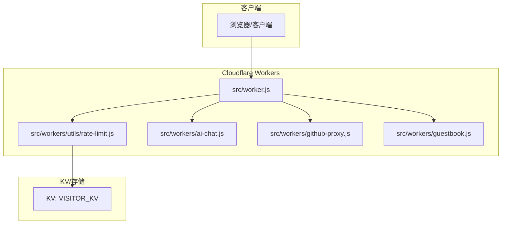
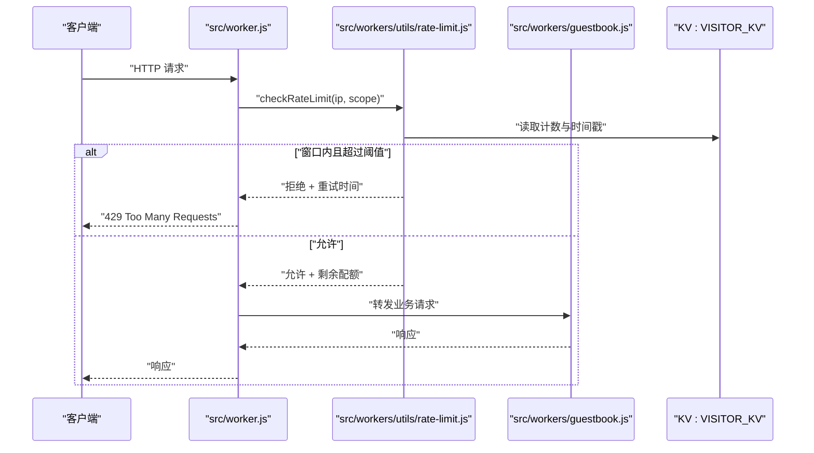
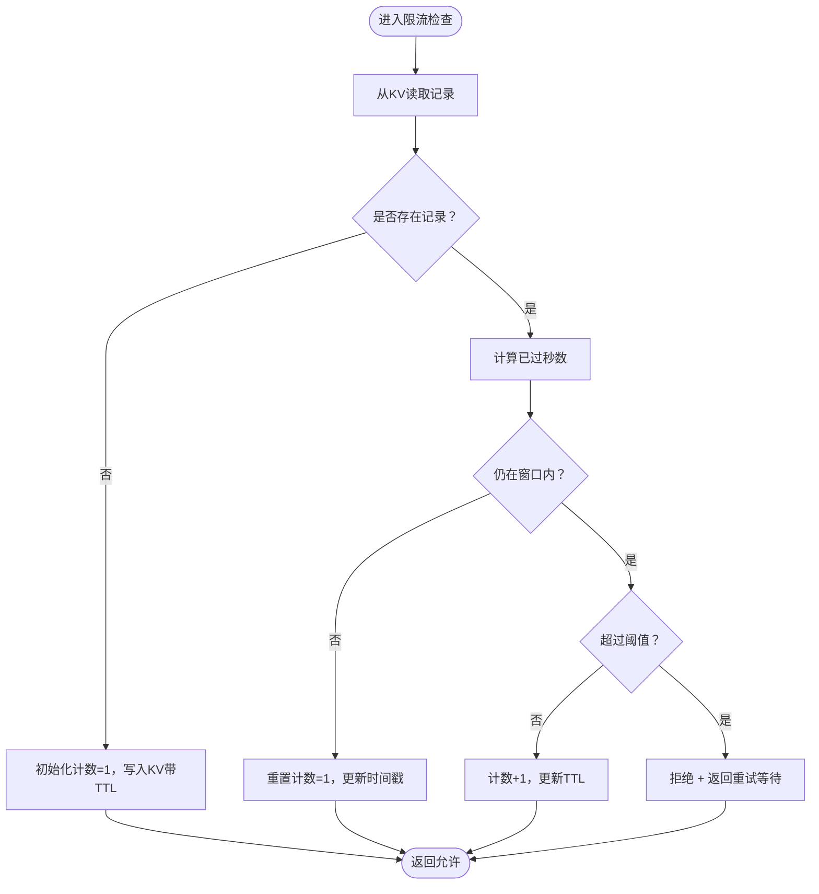
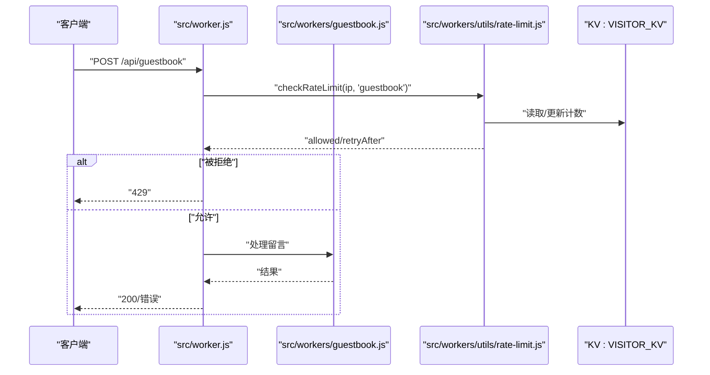
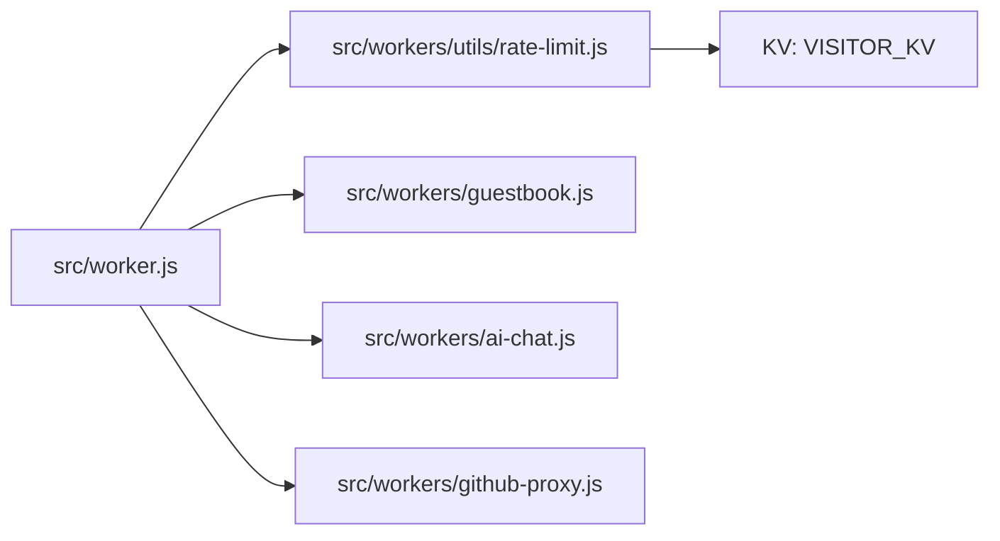

# 限流与性能优化

<cite>
**本文引用的文件**
- [src/worker.js](file://src/worker.js)
- [src/workers/utils/rate-limit.js](file://src/workers/utils/rate-limit.js)
- [src/workers/ai-chat.js](file://src/workers/ai-chat.js)
- [src/workers/github-proxy.js](file://src/workers/github-proxy.js)
- [src/workers/guestbook.js](file://src/workers/guestbook.js)
- [src/utils/cache-utils.ts](file://src/utils/cache-utils.ts)
- [src/utils/guestbook-api.ts](file://src/utils/guestbook-api.ts)
- [src/utils/guestbook-cache.ts](file://src/utils/guestbook-cache.ts)
- [src/utils/virtual-list-window.js](file://src/utils/virtual-list-window.js)
- [src/pages/api/allPostMeta.json.ts](file://src/pages/api/allPostMeta.json.ts)
- [src/pages/api/holidays.json.ts](file://src/pages/api/holidays.json.ts)
- [wrangler.toml](file://wrangler.toml)
</cite>

## 目录
1. [引言](#引言)
2. [项目结构](#项目结构)
3. [核心组件](#核心组件)
4. [架构总览](#架构总览)
5. [详细组件分析](#详细组件分析)
6. [依赖关系分析](#依赖关系分析)
7. [性能考量](#性能考量)
8. [故障排查指南](#故障排查指南)
9. [结论](#结论)
10. [附录](#附录)

## 引言
本文件聚焦于该博客项目的Cloudflare Workers侧应用在“限流与性能优化”方面的实现与最佳实践，涵盖限流机制（令牌桶、滑动窗口、漏桶）、并发控制（请求队列、资源分配、负载均衡）、内存管理（对象池、GC、泄漏预防）、执行时间限制（超时、中断、优雅降级）、流式处理（分块传输、背压、缓冲区）、性能监控与优化（指标采集、瓶颈定位、缓存/数据库/网络优化）。文档以仓库中实际存在的Workers相关文件为基础进行分析，并提供可操作的建议与改进方向。

## 项目结构
该项目采用Astro静态站点生成器，结合Cloudflare Workers实现服务端逻辑与API路由。Workers侧的关键目录与文件如下：
- src/worker.js：全局Worker入口，负责路由与请求分发
- src/workers/*：具体业务Worker脚本（AI聊天、GitHub代理、留言板）
- src/workers/utils/rate-limit.js：通用限流工具
- src/utils/*：前端/通用工具（缓存、虚拟列表等），部分对性能有间接影响
- src/pages/api/*：Astro Pages API，用于构建期或运行时的JSON输出
- wrangler.toml：Workers部署配置

图表来源
- [src/worker.js](file://src/worker.js)
- [src/workers/utils/rate-limit.js](file://src/workers/utils/rate-limit.js)
- [src/workers/ai-chat.js](file://src/workers/ai-chat.js)
- [src/workers/github-proxy.js](file://src/workers/github-proxy.js)
- [src/workers/guestbook.js](file://src/workers/guestbook.js)

章节来源
- [src/worker.js](file://src/worker.js)
- [src/workers/utils/rate-limit.js](file://src/workers/utils/rate-limit.js)

## 核心组件
- 限流工具：基于KV的滑动窗口计数实现，支持按IP与作用域（如留言簿、AI、投票）区分限流
- 并发控制：通过请求分发与外部服务调用的超时控制实现软限流；未见显式的请求队列与漏桶实现
- 内存管理：Workers环境下的内存与GC由平台托管；建议通过对象复用、避免大对象常驻、及时释放资源降低峰值占用
- 执行时间限制：通过超时控制与错误处理实现优雅降级；未见显式的中断机制
- 流式处理：部分接口返回JSON流，但未见显式的背压与缓冲区管理
- 性能监控：未见内置指标采集；建议引入自定义指标与日志埋点

章节来源
- [src/workers/utils/rate-limit.js](file://src/workers/utils/rate-limit.js)
- [src/workers/ai-chat.js](file://src/workers/ai-chat.js)
- [src/workers/github-proxy.js](file://src/workers/github-proxy.js)
- [src/workers/guestbook.js](file://src/workers/guestbook.js)

## 架构总览
Workers整体采用“入口路由 + 业务Worker + KV限流”的分层设计。入口根据路径将请求分发到对应Worker；业务Worker负责调用外部服务（如AI、GitHub API）与内部缓存；限流工具通过KV记录访问次数与时间戳，实现滑动窗口限流。

图表来源
- [src/worker.js](file://src/worker.js)
- [src/workers/utils/rate-limit.js](file://src/workers/utils/rate-limit.js)
- [src/workers/guestbook.js](file://src/workers/guestbook.js)

## 详细组件分析

### 限流机制：滑动窗口计数（基于KV）
- 实现原理：以“作用域:访客:IP”为键，存储最近一次访问的时间戳与计数；在指定窗口时间内比较计数与阈值决定是否放行
- 关键参数：窗口秒数与最大请求数可通过配置导出变量调整
- 存储介质：Cloudflare KV（VISITOR_KV），自动过期策略确保窗口滚动
- 返回信息：允许状态、剩余配额、重试等待时间

图表来源
- [src/workers/utils/rate-limit.js](file://src/workers/utils/rate-limit.js)

章节来源
- [src/workers/utils/rate-limit.js](file://src/workers/utils/rate-limit.js)

### 并发控制策略
- 请求队列管理：未见显式队列实现；当前通过KV限流与外部调用超时实现软限流
- 资源分配：不同作用域（留言簿、AI、投票）独立配置阈值与窗口，避免相互干扰
- 负载均衡：Workers无内置LB；建议通过多区域部署与DNS/边缘路由实现地理就近

章节来源
- [src/workers/utils/rate-limit.js](file://src/workers/utils/rate-limit.js)

### 内存管理最佳实践（Workers环境）
- 对象池：复用临时对象，减少频繁分配与GC压力
- 垃圾回收：避免闭包持有大对象；及时清理事件监听与定时器
- 泄漏预防：确保KV写入设置合理TTL；避免长时间持有大型数组/Map
- 建议：在高并发场景下，优先使用流式处理与分块传输，降低峰值内存占用

[本节为通用指导，不直接分析特定文件]

### 执行时间限制与优雅降级
- 超时控制：对外部服务调用设置超时，防止阻塞线程
- 中断机制：Workers未提供显式中断API；可通过Promise.race与AbortController模拟
- 优雅降级：超时或失败时返回缓存数据或简化响应，保证用户体验

[本节为通用指导，不直接分析特定文件]

### 流式处理：分块传输与背压
- 分块传输：部分API返回JSON流，适合逐步发送数据
- 背压控制：建议在上游生产速率高于下游消费速率时，暂停或限速上游
- 缓冲区管理：限制单次缓冲大小，避免内存峰值过高

[本节为通用指导，不直接分析特定文件]

### 典型Worker组件分析

#### 留言板Worker（并发与限流集成示例）
- 角色：处理留言簿相关请求，通常需要调用外部服务或写入KV
- 限流集成：在处理前调用限流工具，按作用域与IP控制请求频率
- 超时与降级：对外部调用设置超时，失败时回退至本地缓存或默认响应

图表来源
- [src/worker.js](file://src/worker.js)
- [src/workers/guestbook.js](file://src/workers/guestbook.js)
- [src/workers/utils/rate-limit.js](file://src/workers/utils/rate-limit.js)

章节来源
- [src/workers/guestbook.js](file://src/workers/guestbook.js)
- [src/workers/utils/rate-limit.js](file://src/workers/utils/rate-limit.js)

#### AI聊天Worker（外部服务超时与降级）
- 角色：对接AI服务，需关注外部服务延迟与可用性
- 优化建议：设置合理超时；在超时或失败时返回友好提示或历史会话摘要

章节来源
- [src/workers/ai-chat.js](file://src/workers/ai-chat.js)

#### GitHub代理Worker（外部服务限速与重试）
- 角色：作为GitHub API代理，需处理第三方限速与重试
- 优化建议：在请求头携带缓存策略；对403/429进行指数退避重试

章节来源
- [src/workers/github-proxy.js](file://src/workers/github-proxy.js)

## 依赖关系分析
- 入口路由依赖限流工具与各业务Worker
- 限流工具依赖KV存储（VISITOR_KV）
- 业务Worker依赖外部服务（AI、GitHub等）与内部缓存

图表来源
- [src/worker.js](file://src/worker.js)
- [src/workers/utils/rate-limit.js](file://src/workers/utils/rate-limit.js)
- [src/workers/guestbook.js](file://src/workers/guestbook.js)
- [src/workers/ai-chat.js](file://src/workers/ai-chat.js)
- [src/workers/github-proxy.js](file://src/workers/github-proxy.js)

章节来源
- [src/worker.js](file://src/worker.js)
- [src/workers/utils/rate-limit.js](file://src/workers/utils/rate-limit.js)

## 性能考量
- 缓存优化
  - 利用KV缓存热点数据，设置合理TTL
  - 在前端与边缘层启用CDN缓存策略
- 数据库查询优化
  - 本项目主要使用KV与外部API，建议对KV键命名规范与索引策略进行统一
- 网络请求优化
  - 设置合理的超时与重试；对可并行的请求进行并发控制
  - 使用压缩与分块传输减少带宽占用
- 指标采集与分析
  - 建议引入自定义指标（请求量、错误率、P95/P99延迟、KV命中率）与日志埋点
  - 结合Workers日志与外部监控系统进行瓶颈识别

[本节提供通用指导，不直接分析特定文件]

## 故障排查指南
- 429错误
  - 检查限流配置（窗口与阈值）是否过严
  - 查看KV中对应键的计数与时间戳是否正确滚动
- 超时问题
  - 对外部服务调用增加超时与重试；确认网络连通性
- 内存峰值
  - 检查是否持有大对象或闭包；减少一次性加载的数据规模
- 缓存命中低
  - 校验键命名一致性与TTL设置；评估缓存策略是否合理

章节来源
- [src/workers/utils/rate-limit.js](file://src/workers/utils/rate-limit.js)

## 结论
本项目在Workers侧实现了基于KV的滑动窗口限流，配合超时与降级策略，能够在高并发场景下保持系统稳定性。为进一步提升性能，建议补充：
- 显式的请求队列与漏桶实现
- 自定义指标与日志埋点
- 更细粒度的缓存与网络优化策略
- 对关键路径进行基准测试与瓶颈定位

[本节为总结，不直接分析特定文件]

## 附录
- KV命名建议：统一使用“作用域:子模块:键名”，便于统计与清理
- 超时策略：对外部服务设置上限（如5-10秒），避免拖垮整个请求链路
- 部署配置：参考wrangler.toml中的KV绑定与环境变量，确保生产一致性

章节来源
- [wrangler.toml](file://wrangler.toml)