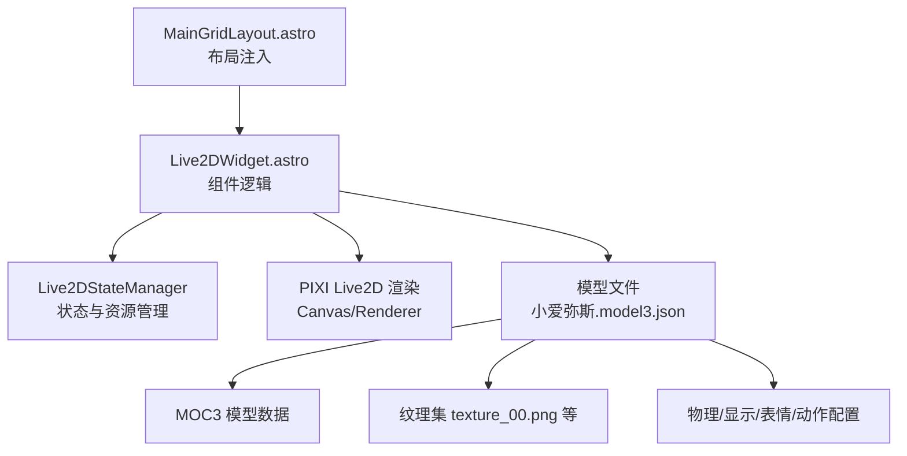
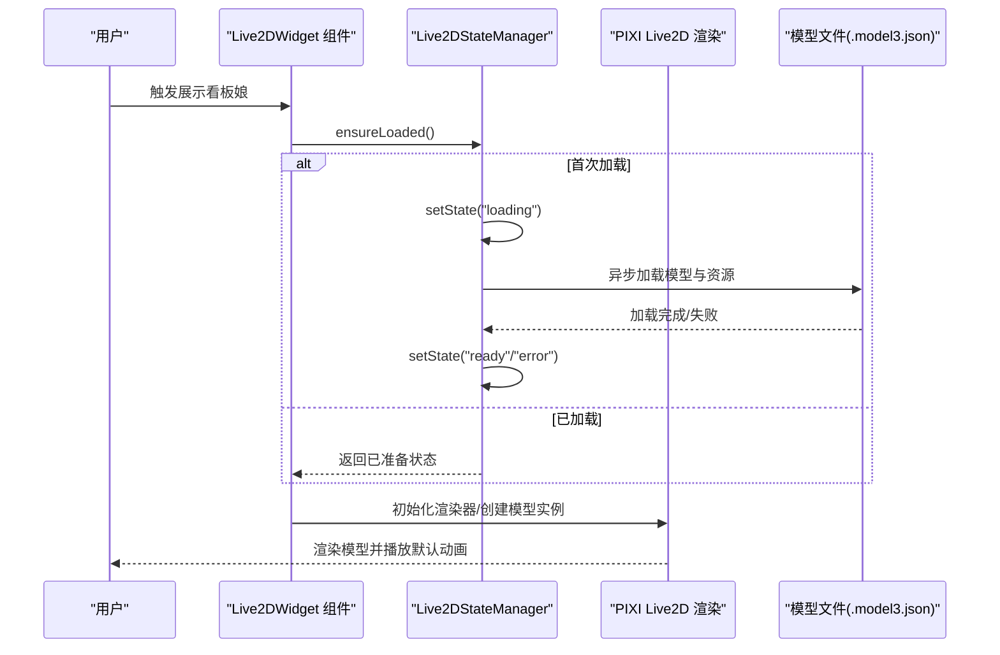
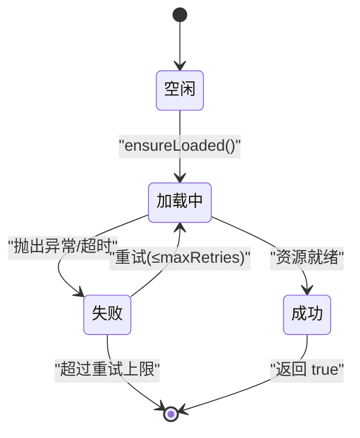
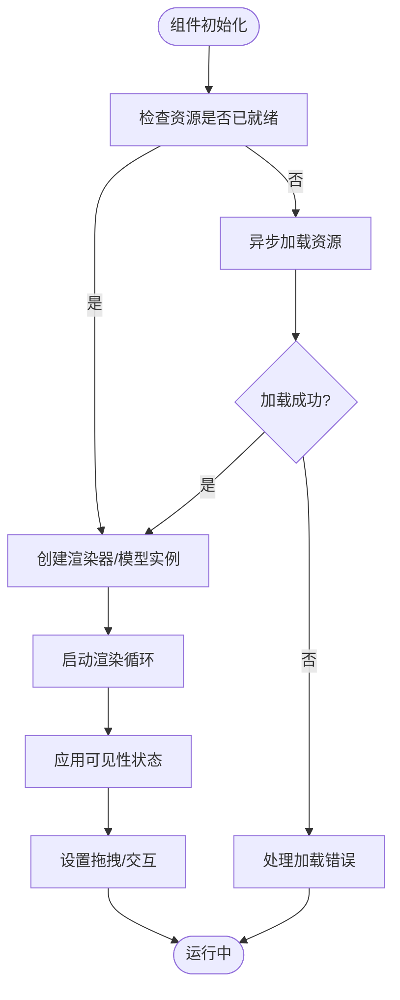
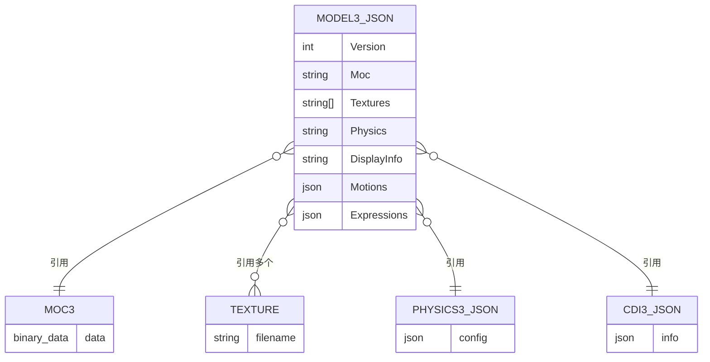
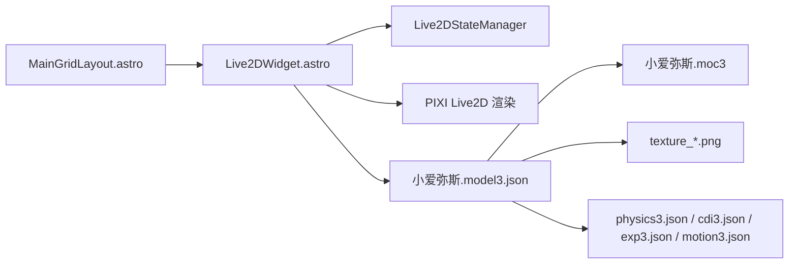

# 3D模型集成架构

<cite>
**本文档引用的文件**
- [Live2DWidget.astro](file://src/components/features/Live2DWidget.astro)
- [小爱弥斯.model3.json](file://public/pio/models/live2d/小爱弥斯_vts/小爱弥斯.model3.json)
- [小爱弥斯.vtube.json](file://public/pio/models/live2d/小爱弥斯_vts/小爱弥斯.vtube.json)
- [live2d-widget.css](file://src/styles/components/live2d-widget.css)
- [MainGridLayout.astro](file://src/layouts/MainGridLayout.astro)
</cite>

## 目录
1. [简介](#简介)
2. [项目结构](#项目结构)
3. [核心组件](#核心组件)
4. [架构总览](#架构总览)
5. [详细组件分析](#详细组件分析)
6. [依赖关系分析](#依赖关系分析)
7. [性能考虑](#性能考虑)
8. [故障排除指南](#故障排除指南)
9. [结论](#结论)

## 简介
本文件系统性梳理博客项目中 Live2D 3D 模型集成架构，覆盖从模型文件组织、资源加载、初始化流程、生命周期管理到渲染管线集成与性能监控的全链路实现。Live2D 集成基于 Astro 组件与前端运行时，采用异步资源加载与状态管理，结合本地存储的可见性缓存，确保在多页面场景下的稳定与高效。

## 项目结构
Live2D 集成主要涉及以下目录与文件：
- 组件层：Live2DWidget.astro 提供看板娘交互、拖拽、动画切换与生命周期控制
- 样式层：live2d-widget.css 定义 UI 展示与过渡效果
- 布局层：MainGridLayout.astro 将 Live2DWidget 注入页面布局
- 资源层：public/pio/models/live2d/... 下包含模型描述文件与动画资源

图表来源
- [MainGridLayout.astro](file://src/layouts/MainGridLayout.astro)
- [Live2DWidget.astro](file://src/components/features/Live2DWidget.astro)
- [小爱弥斯.model3.json](file://public/pio/models/live2d/小爱弥斯_vts/小爱弥斯.model3.json)

章节来源
- [MainGridLayout.astro](file://src/layouts/MainGridLayout.astro)
- [Live2DWidget.astro](file://src/components/features/Live2DWidget.astro)

## 核心组件
- Live2DStateManager：单例状态管理器，负责资源加载状态、重试次数、可见性缓存与 ready/error 状态切换
- Live2DWidget 组件：封装 PIXI 渲染、模型初始化、拖拽交互、动画组切换、可见性控制与销毁清理
- 样式系统：live2d-widget.css 控制初始态、进入态、退出态与移动端工具栏样式

章节来源
- [Live2DWidget.astro](file://src/components/features/Live2DWidget.astro)
- [live2d-widget.css](file://src/styles/components/live2d-widget.css)

## 架构总览
Live2D 集成采用“组件驱动 + 状态管理 + 资源懒加载”的架构模式：
- 组件在页面初始化时根据配置加载模型路径
- 通过状态管理器确保资源只加载一次并支持重试
- 使用 PIXI Live2D 渲染引擎进行 WebGL 上下文管理与绘制
- 模型文件以 model3.json 为根，声明 MOC3、纹理、物理、表情与动作集合

图表来源
- [Live2DWidget.astro](file://src/components/features/Live2DWidget.astro)
- [小爱弥斯.model3.json](file://public/pio/models/live2d/小爱弥斯_vts/小爱弥斯.model3.json)

## 详细组件分析

### Live2DStateManager（状态与资源管理）
- 单例模式：getInstance 提供全局唯一实例，避免重复初始化
- 状态机：idle → loading → ready/error；错误时按最大重试次数自动恢复
- 缓存策略：localStorage 缓存可见性，避免每次刷新丢失用户偏好
- 并发控制：ensureLoaded 返回 Promise，避免并发重复加载

图表来源
- [Live2DWidget.astro](file://src/components/features/Live2DWidget.astro)

章节来源
- [Live2DWidget.astro](file://src/components/features/Live2DWidget.astro)

### Live2DWidget（组件生命周期与渲染）
- 资源保障：ensureResourcesLoaded 保证 PIXI Live2D 库与模型资源可用
- 初始化流程：initialize → initLive2D → 创建 Canvas/Renderer → 加载模型 → 启动渲染循环
- 生命周期管理：destroy 清理 PIXI 应用、纹理、事件监听器与 AbortController
- 可见性控制：根据缓存决定初始显示状态，支持显隐切换与移动端工具栏
- 交互能力：拖拽容器、点击消息、动画组切换、进入/退出动画

图表来源
- [Live2DWidget.astro](file://src/components/features/Live2DWidget.astro)

章节来源
- [Live2DWidget.astro](file://src/components/features/Live2DWidget.astro)

### 模型文件组织与依赖关系（.model3.json、.moc3、.texture）
- model3.json 作为根配置，声明：
  - Version：版本标识
  - FileReferences：Moc、Textures、Physics、DisplayInfo
  - Motions：Idle、Expression、TapShort、TapLong、Other 分类的动作列表
  - Expressions：表情名称与对应 exp3.json 文件
- .moc3：Live2D 模型二进制数据，描述网格、骨骼与材质
- .texture：纹理图集，由 model3.json 的 Textures 数组引用
- physics3.json：物理模拟配置
- cdi3.json：显示信息（如部件层级、遮挡关系等）

图表来源
- [小爱弥斯.model3.json](file://public/pio/models/live2d/小爱弥斯_vts/小爱弥斯.model3.json)

章节来源
- [小爱弥斯.model3.json](file://public/pio/models/live2d/小爱弥斯_vts/小爱弥斯.model3.json)

### vtube 相关配置（热键与触发）
- 小爱弥斯.vtube.json 定义热键 ID、动作类型（TriggerAnimation）、目标文件与颜色叠加等参数
- 可用于外部工具或快捷键触发特定动画片段

章节来源
- [小爱弥斯.vtube.json](file://public/pio/models/live2d/小爱弥斯_vts/小爱弥斯.vtube.json)

### 渲染管线集成（WebGL、着色器与纹理）
- 渲染后端：PIXI Live2D 渲染引擎负责 WebGL 上下文管理、着色器程序与纹理绑定
- Canvas 管理：组件在初始化时创建并挂载 Canvas，设置尺寸与分辨率
- 纹理加载：model3.json 中的 Textures 列表由引擎异步加载并绑定至模型
- 动画播放：根据 model3.json 的 Motions 字段选择 Idle/Expression/Tap 等动画组

章节来源
- [Live2DWidget.astro](file://src/components/features/Live2DWidget.astro)
- [小爱弥斯.model3.json](file://public/pio/models/live2d/小爱弥斯_vts/小爱弥斯.model3.json)

### 动态加载、缓存与错误处理
- 动态加载：ensureResourcesLoaded 与 ensureLoaded 串联，仅在首次访问时加载
- 缓存机制：LocalStorage 缓存可见性；PIXI 资源内部缓存纹理与模型数据
- 错误处理：状态机进入 error 并限制重试次数；组件捕获异常并回退到触发器状态

章节来源
- [Live2DWidget.astro](file://src/components/features/Live2DWidget.astro)

### 模型替换与自定义流程
- 替换步骤：
  1) 准备新模型的 .moc3 与纹理图集，并调整 model3.json 的 FileReferences
  2) 更新配置中的 model.path 指向新的 model3.json
  3) 如需新增动作/表情，完善 Motions 与 Expressions 字段
  4) 在 vtube.json 中添加或修改热键触发项
- 自定义建议：
  - 纹理尺寸与分块：遵循引擎对纹理大小与分块的限制
  - 动作时序：FadeIn/FadeOut 时间与动作长度匹配
  - 物理参数：physics3.json 与模型权重、重心匹配

章节来源
- [小爱弥斯.model3.json](file://public/pio/models/live2d/小爱弥斯_vts/小爱弥斯.model3.json)
- [小爱弥斯.vtube.json](file://public/pio/models/live2d/小爱弥斯_vts/小爱弥斯.vtube.json)

## 依赖关系分析
- 组件依赖：Live2DWidget 依赖 Live2DStateManager 与 PIXI Live2D 渲染库
- 资源依赖：model3.json 依赖 MOC3、纹理、物理与表情配置
- 布局依赖：MainGridLayout 将 Live2DWidget 注入页面，确保全局可用

图表来源
- [MainGridLayout.astro](file://src/layouts/MainGridLayout.astro)
- [Live2DWidget.astro](file://src/components/features/Live2DWidget.astro)
- [小爱弥斯.model3.json](file://public/pio/models/live2d/小爱弥斯_vts/小爱弥斯.model3.json)

章节来源
- [MainGridLayout.astro](file://src/layouts/MainGridLayout.astro)
- [Live2DWidget.astro](file://src/components/features/Live2DWidget.astro)

## 性能考虑
- 资源预热：通过 ensureLoaded 在首屏前触发资源加载，减少首帧卡顿
- 渲染节流：在不可见或后台标签页时暂停渲染循环，恢复时再启动
- 纹理优化：合理压缩纹理、控制分辨率，避免超大贴图导致内存峰值
- 动画管理：按需加载动作片段，避免一次性加载过多 motion3.json
- 内存回收：销毁时释放 PIXI 应用、纹理与事件监听器，防止内存泄漏

## 故障排除指南
- 资源加载失败
  - 现象：组件无法显示，状态停留在 error
  - 排查：确认 model3.json 路径正确、MOC3 与纹理可访问、网络无跨域问题
  - 处理：重置状态管理器缓存，重新触发 ensureLoaded
- 渲染异常
  - 现象：Canvas 为空或白屏
  - 排查：检查 WebGL 支持、着色器编译错误、纹理尺寸不合法
  - 处理：降低分辨率、简化纹理、更新引擎版本
- 动作不生效
  - 现象：点击无反应或动画未播放
  - 排查：核对 model3.json 中 Motions 的文件路径与 FadeIn/FadeOut 设置
  - 处理：修正路径、调整时序参数
- 性能问题
  - 现象：CPU/GPU 占用高、帧率低
  - 排查：检查纹理尺寸、动画数量、渲染循环频率
  - 处理：启用渲染暂停、减少动作复杂度、优化纹理

章节来源
- [Live2DWidget.astro](file://src/components/features/Live2DWidget.astro)

## 结论
该 Live2D 集成方案以组件化与状态管理为核心，结合懒加载与缓存策略，在多页面场景下实现了稳定高效的模型渲染与交互体验。通过清晰的模型文件组织与配置扩展，开发者可以便捷地替换与定制模型，同时借助状态机与生命周期管理确保资源与性能的可控性。