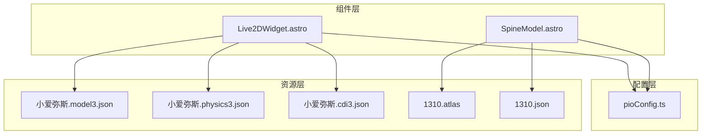
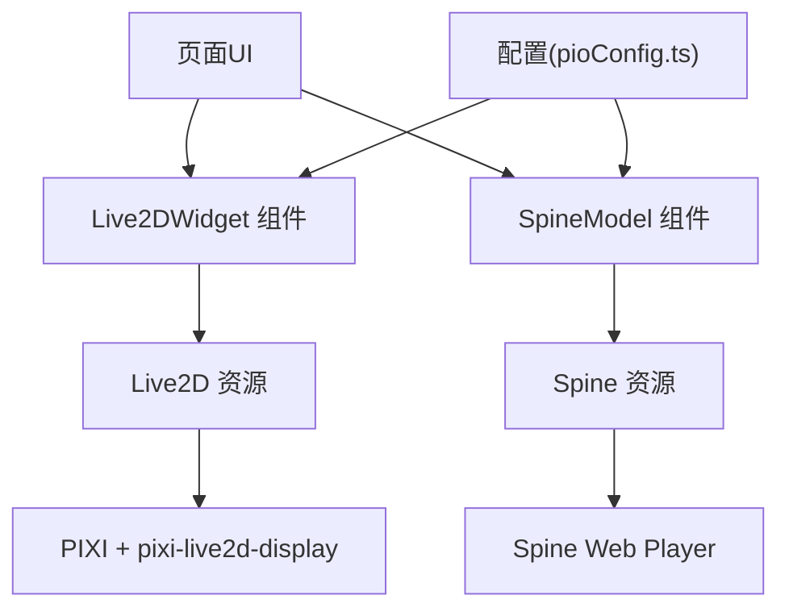
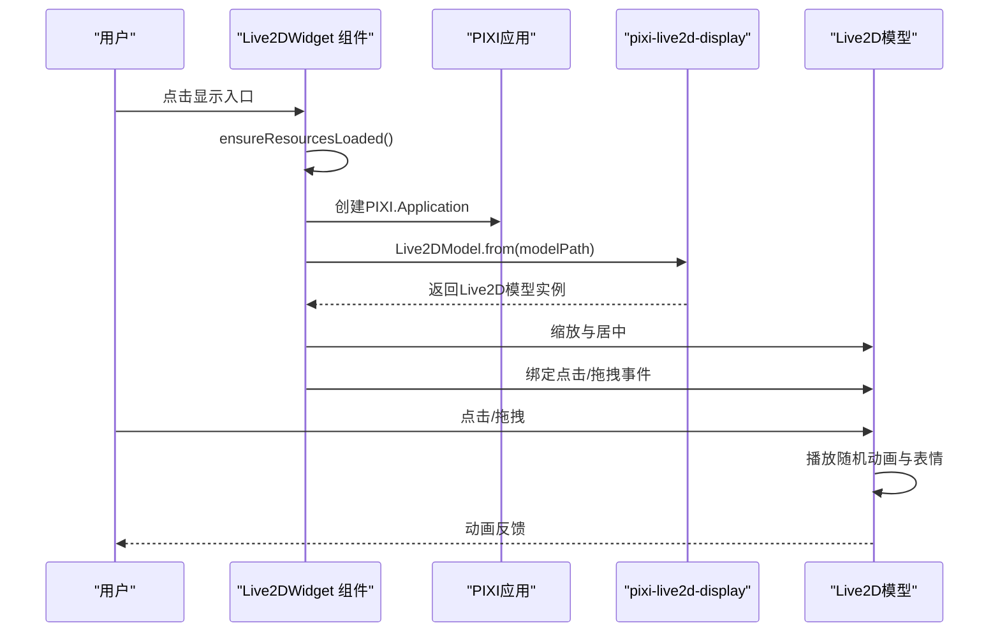
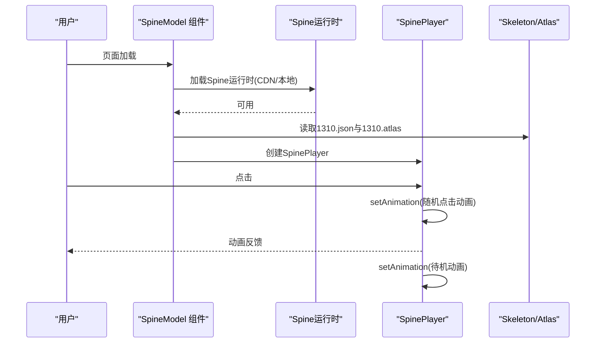
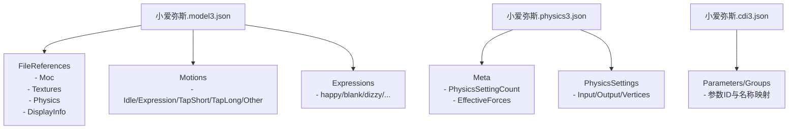
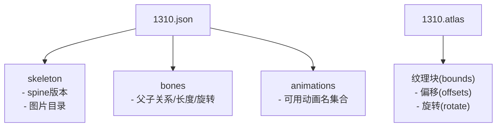
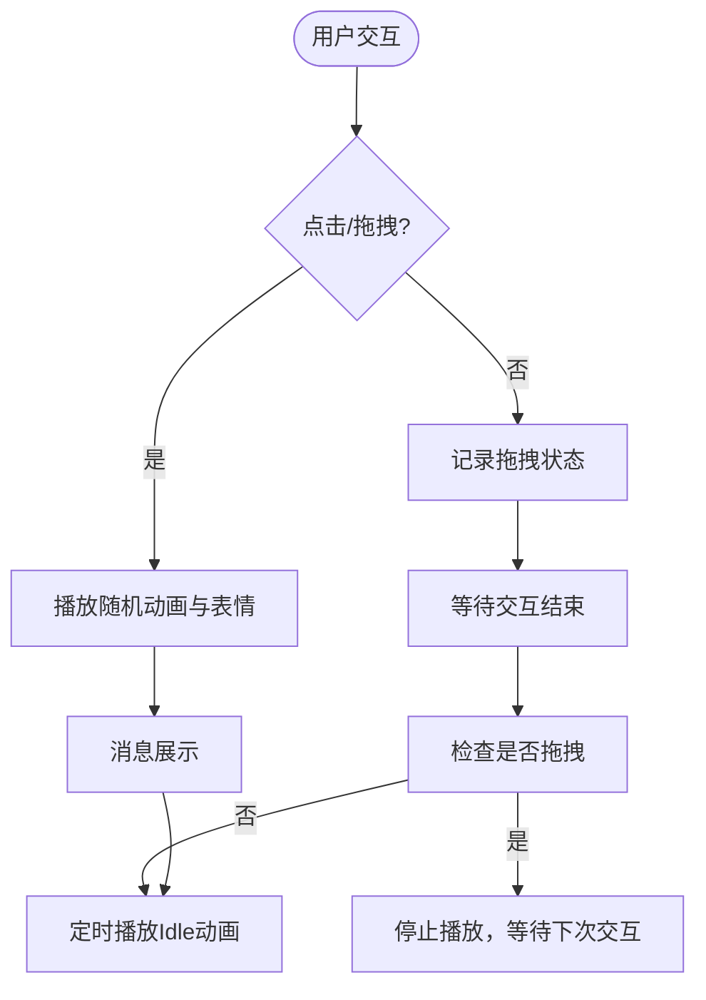
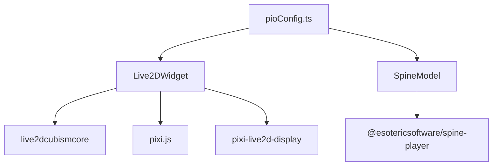

# Live2D虚拟助手

<cite>
**本文档引用的文件**
- [Live2DWidget.astro](file://src/components/features/Live2DWidget.astro)
- [SpineModel.astro](file://src/components/features/SpineModel.astro)
- [pioConfig.ts](file://src/config/pioConfig.ts)
- [小爱弥斯.model3.json](file://public/pio/models/live2d/小爱弥斯_vts/小爱弥斯.model3.json)
- [小爱弥斯.physics3.json](file://public/pio/models/live2d/小爱弥斯_vts/小爱弥斯.physics3.json)
- [小爱弥斯.cdi3.json](file://public/pio/models/live2d/小爱弥斯_vts/小爱弥斯.cdi3.json)
- [1310.json](file://public/pio/models/spine/firefly/1310.json)
- [1310.atlas](file://public/pio/models/spine/firefly/1310.atlas)
</cite>

## 目录
1. [简介](#简介)
2. [项目结构](#项目结构)
3. [核心组件](#核心组件)
4. [架构总览](#架构总览)
5. [详细组件分析](#详细组件分析)
6. [依赖关系分析](#依赖关系分析)
7. [性能考虑](#性能考虑)
8. [故障排除指南](#故障排除指南)
9. [结论](#结论)
10. [附录](#附录)

## 简介
本项目实现了基于Live2D Cubism与Spine骨骼动画的虚拟助手系统，提供可交互的看板娘体验。系统支持两种3D模型集成方式：Live2D Cubism（PIXI + pixi-live2d-display）与Spine Web Player。用户可通过点击、拖拽等交互触发随机动画与表情，并支持待机动画轮播与消息展示。系统具备资源懒加载、状态持久化、移动端适配与性能优化策略。

## 项目结构
虚拟助手相关的核心文件分布如下：
- 组件层：Live2DWidget.astro、SpineModel.astro
- 配置层：pioConfig.ts
- 资源层：Live2D模型文件（.model3.json、.physics3.json、.cdi3.json、.moc3）、Spine模型文件（1310.json、1310.atlas）

**图表来源**
- [Live2DWidget.astro](file://src/components/features/Live2DWidget.astro)
- [SpineModel.astro](file://src/components/features/SpineModel.astro)
- [pioConfig.ts](file://src/config/pioConfig.ts)
- [小爱弥斯.model3.json](file://public/pio/models/live2d/小爱弥斯_vts/小爱弥斯.model3.json)
- [1310.json](file://public/pio/models/spine/firefly/1310.json)
- [1310.atlas](file://public/pio/models/spine/firefly/1310.atlas)

**章节来源**
- [Live2DWidget.astro](file://src/components/features/Live2DWidget.astro)
- [SpineModel.astro](file://src/components/features/SpineModel.astro)
- [pioConfig.ts](file://src/config/pioConfig.ts)

## 核心组件
- Live2DWidget.astro：负责Live2D模型的加载、渲染、交互与动画调度，支持拖拽、点击响应、分组动画切换、待机动画与消息展示。
- SpineModel.astro：负责Spine模型的加载、运行时初始化、交互与动画调度，支持点击动画、待机动画轮播与消息展示。
- pioConfig.ts：集中管理Live2D与Spine模型的启用开关、位置、尺寸、交互参数与响应式配置。

**章节来源**
- [Live2DWidget.astro](file://src/components/features/Live2DWidget.astro)
- [SpineModel.astro](file://src/components/features/SpineModel.astro)
- [pioConfig.ts](file://src/config/pioConfig.ts)

## 架构总览
系统采用“组件 + 配置 + 资源”的分层架构：
- 组件层：以Astro组件形式封装Live2D与Spine的生命周期与交互逻辑。
- 配置层：通过类型安全的配置对象统一管理模型路径、交互行为与显示参数。
- 资源层：Live2D使用Cubism 3+的模型描述文件与物理文件；Spine使用Skeleton JSON与Atlas图集。

**图表来源**
- [Live2DWidget.astro](file://src/components/features/Live2DWidget.astro)
- [SpineModel.astro](file://src/components/features/SpineModel.astro)
- [pioConfig.ts](file://src/config/pioConfig.ts)

## 详细组件分析

### Live2DWidget 组件分析
Live2D组件通过PIXI应用承载Live2D模型，实现以下能力：
- 资源加载：并行加载cubismcore与pixi.js，随后串行加载pixi-live2d-display。
- 模型初始化：创建PIXI.Application，从model3.json加载Live2D模型，按容器尺寸缩放并居中。
- 交互控制：点击或拖拽后播放随机动画与表情；支持切换动画分组（表情、短动画、长动画、其他）。
- 待机动画：定时播放Idle动画，增强拟真感。
- 状态持久化：缓存可见性与位置，支持跨页面保持状态。
- 性能控制：隐藏时暂停渲染，释放GPU/CPU资源。

**图表来源**
- [Live2DWidget.astro](file://src/components/features/Live2DWidget.astro)
- [小爱弥斯.model3.json](file://public/pio/models/live2d/小爱弥斯_vts/小爱弥斯.model3.json)

**章节来源**
- [Live2DWidget.astro](file://src/components/features/Live2DWidget.astro)
- [小爱弥斯.model3.json](file://public/pio/models/live2d/小爱弥斯_vts/小爱弥斯.model3.json)
- [小爱弥斯.physics3.json](file://public/pio/models/live2d/小爱弥斯_vts/小爱弥斯.physics3.json)
- [小爱弥斯.cdi3.json](file://public/pio/models/live2d/小爱弥斯_vts/小爱弥斯.cdi3.json)

### SpineModel 组件分析
Spine组件通过Spine Web Player实现以下能力：
- 运行时加载：优先CDN加载Spine运行时，失败则回退本地静态资源。
- 播放器初始化：根据Skeleton JSON与Atlas图集创建SpinePlayer实例。
- 动画管理：构建可用动画集合，支持点击随机播放、待机动画轮播与兜底动画。
- 交互控制：点击触发随机动画，播放完成后回到待机状态；支持消息展示。
- 响应式处理：移动端可配置隐藏，窗口大小变化时更新显示。

**图表来源**
- [SpineModel.astro](file://src/components/features/SpineModel.astro)
- [1310.json](file://public/pio/models/spine/firefly/1310.json)
- [1310.atlas](file://public/pio/models/spine/firefly/1310.atlas)

**章节来源**
- [SpineModel.astro](file://src/components/features/SpineModel.astro)
- [1310.json](file://public/pio/models/spine/firefly/1310.json)
- [1310.atlas](file://public/pio/models/spine/firefly/1310.atlas)

### 模型文件组织与加载机制

#### Live2D模型文件结构
- model3.json：模型版本、文件引用（moc3、纹理、物理、显示信息）、动画分组与表情映射。
- physics3.json：物理设置与参数字典，定义各部位物理影响与约束。
- cdi3.json：参数与分组定义，用于表达与动画驱动。
- moc3：二进制模型数据，由Live2D Cubism Editor导出。

**图表来源**
- [小爱弥斯.model3.json](file://public/pio/models/live2d/小爱弥斯_vts/小爱弥斯.model3.json)
- [小爱弥斯.physics3.json](file://public/pio/models/live2d/小爱弥斯_vts/小爱弥斯.physics3.json)
- [小爱弥斯.cdi3.json](file://public/pio/models/live2d/小爱弥斯_vts/小爱弥斯.cdi3.json)

**章节来源**
- [小爱弥斯.model3.json](file://public/pio/models/live2d/小爱弥斯_vts/小爱弥斯.model3.json)
- [小爱弥斯.physics3.json](file://public/pio/models/live2d/小爱弥斯_vts/小爱弥斯.physics3.json)
- [小爱弥斯.cdi3.json](file://public/pio/models/live2d/小爱弥斯_vts/小爱弥斯.cdi3.json)

#### Spine模型文件结构
- 1310.json：骨架元数据（版本、尺寸、图片路径）、骨骼层级、皮肤与动画列表。
- 1310.atlas：图集描述，包含纹理裁剪、偏移与旋转信息，供运行时渲染。

**图表来源**
- [1310.json](file://public/pio/models/spine/firefly/1310.json)
- [1310.atlas](file://public/pio/models/spine/firefly/1310.atlas)

**章节来源**
- [1310.json](file://public/pio/models/spine/firefly/1310.json)
- [1310.atlas](file://public/pio/models/spine/firefly/1310.atlas)

### 交互控制系统
- Live2D交互：点击或拖拽后播放随机动画与表情；支持切换动画分组；移动端点击屏蔽；待机定时播放。
- Spine交互：点击触发随机点击动画，播放完成后回到待机；支持多待机动画轮播与消息展示。
- 拖拽：支持拖拽移动看板娘位置，移动端工具栏显隐控制。

**图表来源**
- [Live2DWidget.astro](file://src/components/features/Live2DWidget.astro)
- [SpineModel.astro](file://src/components/features/SpineModel.astro)

**章节来源**
- [Live2DWidget.astro](file://src/components/features/Live2DWidget.astro)
- [SpineModel.astro](file://src/components/features/SpineModel.astro)

### 动画系统与状态管理
- 动画分组：Live2D按分组管理动画（表情、短动画、长动画、其他），Spine按可用动画集合管理。
- 表情控制：Live2D通过expression接口与exp3文件驱动；Spine通过动画名切换。
- 状态管理：组件内部维护状态机与定时器，确保动画顺序与资源释放。

**章节来源**
- [小爱弥斯.model3.json](file://public/pio/models/live2d/小爱弥斯_vts/小爱弥斯.model3.json)
- [SpineModel.astro](file://src/components/features/SpineModel.astro)

### 性能优化策略
- 资源懒加载：首次访问不加载模型，点击入口后按需加载。
- 渲染暂停：隐藏时停止PIXI ticker，释放GPU/CPU资源。
- 分辨率控制：根据设备像素比限制渲染分辨率，平衡清晰度与性能。
- 并行加载：Live2D运行时并行加载，减少首屏等待。
- 待机动画节流：Spine待机动画轮播间隔可控，避免频繁切换造成卡顿。

**章节来源**
- [Live2DWidget.astro](file://src/components/features/Live2DWidget.astro)
- [SpineModel.astro](file://src/components/features/SpineModel.astro)
- [pioConfig.ts](file://src/config/pioConfig.ts)

### 模型替换与自定义流程
- Live2D替换步骤：
  1) 准备Cubism 3+模型文件（.model3.json、.moc3、纹理、.physics3.json、.cdi3.json）。
  2) 将模型文件放入public/pio/models/live2d/<新模型>/目录。
  3) 在配置中更新model.path指向新的.model3.json。
  4) 如需调整动画分组或表情，请在model3.json中核对Motions与Expressions字段。
- Spine替换步骤：
  1) 准备Skeleton JSON与Atlas图集（1310.json、1310.atlas）及对应图片资源。
  2) 放入public/pio/models/spine/<新模型>/目录。
  3) 在配置中更新model.path指向新的1310.json。
  4) 校验动画名与交互配置中的clickAnimations/idleAnimations是否存在于模型动画列表。

**章节来源**
- [pioConfig.ts](file://src/config/pioConfig.ts)
- [小爱弥斯.model3.json](file://public/pio/models/live2d/小爱弥斯_vts/小爱弥斯.model3.json)
- [1310.json](file://public/pio/models/spine/firefly/1310.json)

## 依赖关系分析
- Live2D依赖：cubismcore（Web SDK）、pixi.js（渲染引擎）、pixi-live2d-display（Live2D集成）。
- Spine依赖：Spine Web Player（CDN/本地回退）。
- 组件间耦合：组件通过配置对象解耦资源路径与交互参数。
- 外部依赖：CDN资源加载失败时回退本地静态资源，保证稳定性。

**图表来源**
- [Live2DWidget.astro](file://src/components/features/Live2DWidget.astro)
- [SpineModel.astro](file://src/components/features/SpineModel.astro)
- [pioConfig.ts](file://src/config/pioConfig.ts)

**章节来源**
- [Live2DWidget.astro](file://src/components/features/Live2DWidget.astro)
- [SpineModel.astro](file://src/components/features/SpineModel.astro)
- [pioConfig.ts](file://src/config/pioConfig.ts)

## 性能考虑
- 渲染性能：合理设置渲染分辨率与抗锯齿；隐藏时暂停渲染；避免同时加载多个大型模型。
- 网络性能：CDN优先，失败回退本地；按需加载运行时与模型资源。
- 内存管理：销毁旧实例与纹理缓存；清理定时器与事件监听器。
- 交互流畅性：点击防抖、待机动画间隔调优、动画淡入淡出时间合理配置。

[本节为通用指导，无需特定文件引用]

## 故障排除指南
- Live2D模型无法加载：
  - 检查model3.json路径与CDN/pixi依赖是否成功加载。
  - 确认moc3、纹理、physics3.json、cdi3.json路径正确且可访问。
  - 查看浏览器控制台是否存在脚本加载失败或PIXI对象不可用。
- Spine模型无法加载：
  - 检查1310.json与1310.atlas路径与CDN回退链路。
  - 确认可用动画名与配置中的clickAnimations/idleAnimations一致。
  - 关注error回调输出的具体原因。
- 交互无效：
  - 确认移动端断点设置与hideOnMobile配置。
  - 检查点击防抖与动画播放完成回调逻辑。
- 性能问题：
  - 降低渲染分辨率或关闭抗锯齿。
  - 减少待机动画数量与切换频率。
  - 避免同时启用Live2D与Spine两个看板娘。

**章节来源**
- [Live2DWidget.astro](file://src/components/features/Live2DWidget.astro)
- [SpineModel.astro](file://src/components/features/SpineModel.astro)

## 结论
本系统通过组件化的架构实现了Live2D与Spine双引擎的虚拟助手方案，具备完善的交互控制、动画调度与性能优化策略。通过配置中心化管理，用户可以便捷地替换与定制模型，满足不同场景需求。建议在生产环境中结合CDN与本地回退策略，确保资源加载稳定性，并根据设备性能动态调整渲染参数。

[本节为总结性内容，无需特定文件引用]

## 附录

### 配置项说明（摘录）
- Live2D配置要点：启用开关、默认可见性、模型路径、尺寸、分辨率、交互消息、作者信息、响应式断点。
- Spine配置要点：启用开关、模型路径、缩放与偏移、位置与尺寸、交互开关与消息、待机动画列表与间隔、移动端隐藏策略。

**章节来源**
- [pioConfig.ts](file://src/config/pioConfig.ts)