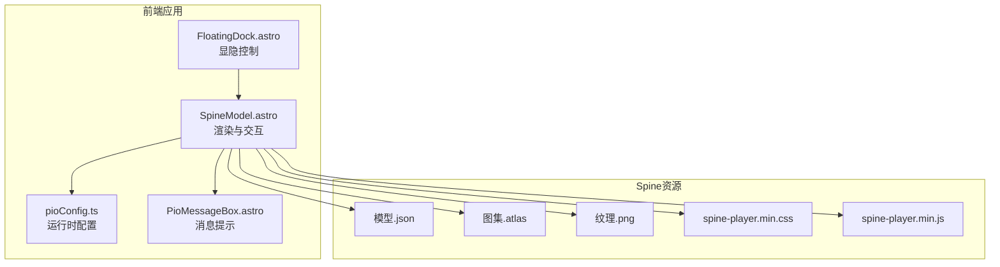
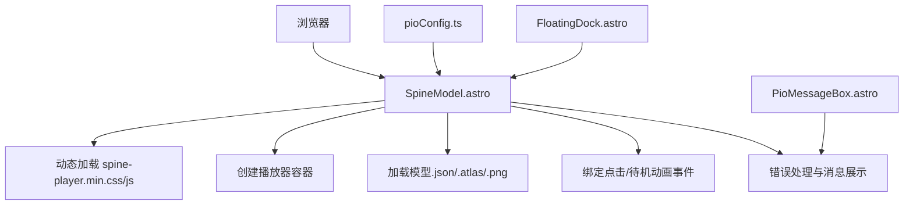
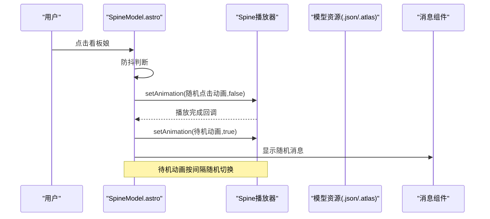
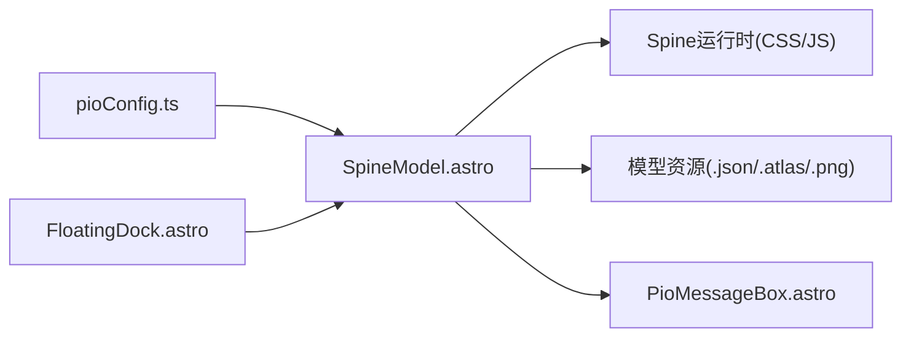

# Spine骨骼动画系统

<cite>
**本文引用的文件**
- [SpineModel.astro](file://src/components/features/SpineModel.astro)
- [pioConfig.ts](file://src/config/pioConfig.ts)
- [README.md（PIO使用指南）](file://public/pio/README.md)
- [FloatingDock.astro](file://src/components/controls/FloatingDock.astro)
- [PioMessageBox.astro](file://src/components/common/PioMessageBox.astro)
</cite>

## 目录
1. [简介](#简介)
2. [项目结构](#项目结构)
3. [核心组件](#核心组件)
4. [架构总览](#架构总览)
5. [详细组件分析](#详细组件分析)
6. [依赖关系分析](#依赖关系分析)
7. [性能考量](#性能考量)
8. [故障排查指南](#故障排查指南)
9. [结论](#结论)
10. [附录](#附录)

## 简介
本文件面向希望在Web端集成与运行Spine骨骼动画的开发者，基于仓库中的Spine看板娘实现进行技术梳理。内容涵盖运行时集成方式、模型文件组织（.json/.atlas）、交互与动画控制流程、响应式与性能优化策略，并给出调试与排障建议。

## 项目结构
Spine看板娘功能位于前端工程的特性组件与配置模块中，采用按需加载与响应式控制相结合的方式实现：

- 特性组件：负责渲染容器、动态加载运行时与样式、初始化播放器、绑定交互事件、错误处理与消息展示。
- 配置模块：集中管理Spine模型路径、尺寸、位置、交互开关、待机动画等参数。
- 资源目录：模型文件按约定放置于public/pio/models/[模型名]/，包含.json/.atlas/.png三件套。
- 控制面板：浮动停靠栏提供显隐切换入口，配合持久化状态控制显示/隐藏。

图表来源
- [SpineModel.astro:1-450](file://src/components/features/SpineModel.astro#L1-L450)
- [pioConfig.ts:1-200](file://src/config/pioConfig.ts#L1-L200)
- [FloatingDock.astro:1-300](file://src/components/controls/FloatingDock.astro#L1-L300)
- [PioMessageBox.astro:1-100](file://src/components/common/PioMessageBox.astro#L1-L100)

章节来源
- [SpineModel.astro:1-450](file://src/components/features/SpineModel.astro#L1-L450)
- [pioConfig.ts:1-200](file://src/config/pioConfig.ts#L1-L200)
- [README.md（PIO使用指南）:1-101](file://public/pio/README.md#L1-L101)
- [FloatingDock.astro:1-300](file://src/components/controls/FloatingDock.astro#L1-L300)
- [PioMessageBox.astro:1-100](file://src/components/common/PioMessageBox.astro#L1-L100)

## 核心组件
- SpineModel.astro：负责动态加载Spine运行时与样式、创建播放器容器、解析配置、初始化播放器、绑定点击与待机动画、错误处理与消息展示。
- pioConfig.ts：集中定义Spine模型路径、缩放、偏移、显示位置、尺寸、交互开关、待机动画列表与间隔、响应式策略、zIndex与透明度等。
- FloatingDock.astro：提供Spine看板娘的显隐切换按钮，结合本地存储持久化状态。
- PioMessageBox.astro：统一的消息提示组件，供Spine与Live2D复用。

章节来源
- [SpineModel.astro:1-450](file://src/components/features/SpineModel.astro#L1-L450)
- [pioConfig.ts:1-200](file://src/config/pioConfig.ts#L1-L200)
- [FloatingDock.astro:1-300](file://src/components/controls/FloatingDock.astro#L1-L300)
- [PioMessageBox.astro:1-100](file://src/components/common/PioMessageBox.astro#L1-L100)

## 架构总览
Spine看板娘的运行时架构由“前端组件 + 运行时库 + 模型资源”三层构成。前端组件负责生命周期与交互，运行时库负责渲染与动画播放，模型资源负责骨骼与纹理数据。

图表来源
- [SpineModel.astro:1-450](file://src/components/features/SpineModel.astro#L1-L450)
- [pioConfig.ts:1-200](file://src/config/pioConfig.ts#L1-L200)
- [FloatingDock.astro:1-300](file://src/components/controls/FloatingDock.astro#L1-L300)
- [PioMessageBox.astro:1-100](file://src/components/common/PioMessageBox.astro#L1-L100)

## 详细组件分析

### SpineModel.astro：运行时集成与动画控制
- 运行时与样式加载：优先尝试CDN加载运行时与样式，失败则回退到本地资源；确保只初始化一次，避免重复注入。
- 播放器初始化：根据配置创建播放器容器，加载模型与图集，设置缩放与偏移，更新世界变换以支持物理模式。
- 交互逻辑：
  - 点击事件：防抖处理，随机选择点击动画播放，完成后切回待机；同时触发消息提示。
  - 待机动画轮播：当存在多条待机动画时，按固定间隔随机切换。
- 错误处理：捕获初始化与定位异常，显示错误信息并隐藏画布，重置初始化标志以便重试。
- 响应式显示：根据移动端断点动态隐藏/显示容器。

图表来源
- [SpineModel.astro:1-450](file://src/components/features/SpineModel.astro#L1-L450)

章节来源
- [SpineModel.astro:1-450](file://src/components/features/SpineModel.astro#L1-L450)

### 配置模块：pioConfig.ts
- 关键配置项：
  - enable：是否启用看板娘
  - model：模型路径、缩放、X/Y偏移
  - position：角落位置、距离边缘偏移
  - size：容器宽高
  - interactive：交互开关、点击动画名、待机动画数组、待机切换间隔
  - responsive：移动端隐藏开关与断点
  - zIndex、opacity：层级与透明度
- 使用方式：在组件中以define:vars形式注入，或直接导入对象使用。

章节来源
- [pioConfig.ts:1-200](file://src/config/pioConfig.ts#L1-L200)

### 资源组织：.json/.atlas/.png
- 文件要求：每个模型需包含.json骨骼数据、.atlas纹理图集与对应.png纹理。
- 存放位置：public/pio/models/[模型名]/ 下，遵循“同名三件套”规则。
- 加载路径：组件内通过替换.json为.atlas与.png生成资源URL，保证一致性。

章节来源
- [README.md（PIO使用指南）:44-101](file://public/pio/README.md#L44-L101)
- [SpineModel.astro:1-120](file://src/components/features/SpineModel.astro#L1-L120)

### 交互与消息：FloatingDock与PioMessageBox
- FloatingDock：提供Spine显隐切换按钮，绑定事件后通过本地存储记录状态，再次进入页面时恢复显示/隐藏。
- PioMessageBox：作为消息提示组件，被Spine/Live2D调用以展示随机消息，提升互动体验。

章节来源
- [FloatingDock.astro:1-300](file://src/components/controls/FloatingDock.astro#L1-L300)
- [PioMessageBox.astro:1-100](file://src/components/common/PioMessageBox.astro#L1-L100)

## 依赖关系分析
- 组件耦合：
  - SpineModel.astro依赖pioConfig.ts提供的配置，依赖全局消息组件进行提示。
  - FloatingDock对SpineModel.astro进行显隐控制，二者通过DOM与本地存储协同。
- 外部依赖：
  - Spine Web Player运行时（CDN或本地），以及对应的CSS样式。
  - 模型资源（.json/.atlas/.png）必须完整且路径正确。
- 潜在风险：
  - CDN不可用时的回退链路需确保本地资源可用。
  - 重复初始化可能导致内存泄漏或渲染异常，需通过全局标志避免。

图表来源
- [SpineModel.astro:1-450](file://src/components/features/SpineModel.astro#L1-L450)
- [pioConfig.ts:1-200](file://src/config/pioConfig.ts#L1-L200)
- [FloatingDock.astro:1-300](file://src/components/controls/FloatingDock.astro#L1-L300)
- [PioMessageBox.astro:1-100](file://src/components/common/PioMessageBox.astro#L1-L100)

章节来源
- [SpineModel.astro:1-450](file://src/components/features/SpineModel.astro#L1-L450)
- [pioConfig.ts:1-200](file://src/config/pioConfig.ts#L1-L200)
- [FloatingDock.astro:1-300](file://src/components/controls/FloatingDock.astro#L1-L300)
- [PioMessageBox.astro:1-100](file://src/components/common/PioMessageBox.astro#L1-L100)

## 性能考量
- 资源加载优化
  - CDN优先，失败回退本地，减少首屏阻塞与失败率。
  - 模型文件尽量使用压缩纹理与合理的图集尺寸，降低内存占用。
- 动画与交互
  - 待机动画数量适中，避免频繁切换造成卡顿。
  - 点击防抖（如500ms）可减少重复触发与状态抖动。
- 响应式与可见性
  - 移动端默认隐藏可显著节省GPU/CPU资源。
  - 窗口尺寸变化时及时更新显示状态。
- 运行时更新
  - 通过setAnimation动态切换动画，避免重建播放器实例。
  - 更新世界变换时注意频率，避免过度计算。

## 故障排查指南
- 模型加载失败
  - 现象：显示错误提示，画布隐藏。
  - 排查：确认.json/.atlas/.png同名且路径正确；检查CDN与本地资源可用性。
- 运行时加载失败
  - 现象：运行时脚本报错或未定义。
  - 排查：检查CDN连通性与回退路径；确保CSS/JS版本兼容。
- 交互无效
  - 现象：点击无反应、待机动画不切换。
  - 排查：确认interactive.enabled开启；检查动画名称与列表；验证Canvas事件绑定。
- 显示异常
  - 现象：看板娘不显示或布局错乱。
  - 排查：检查position与size配置；移动端断点设置；容器CSS与zIndex。

章节来源
- [SpineModel.astro:370-420](file://src/components/features/SpineModel.astro#L370-L420)

## 结论
该实现以轻量组件为核心，结合运行时库与标准Spine资源，提供了可配置、可交互、可响应式的看板娘体验。通过清晰的配置模块与资源组织规范，开发者可快速接入并扩展动画控制与性能优化策略。

## 附录

### Spine模型文件格式与图集组织
- .json：包含骨骼层级、皮肤、槽位、顶点网格、动画序列等数据。
- .atlas：描述纹理图集中各子纹理的裁剪区域、旋转与重复属性。
- .png：纹理图像文件，与.atlas一一对应。
- 组织方式：同名三件套放置于同一目录，便于路径推导与加载。

章节来源
- [README.md（PIO使用指南）:44-101](file://public/pio/README.md#L44-L101)

### 动画控制器要点（基于现有实现）
- 动画切换：通过setAnimation(name, loop)实现即时切换与循环控制。
- 时间轴控制：由Spine运行时内部驱动，组件层通过名称与循环参数间接控制。
- 事件回调：当前实现未显式注册事件回调，如需帧事件可在运行时侧扩展。

章节来源
- [SpineModel.astro:250-370](file://src/components/features/SpineModel.astro#L250-L370)

### 骨骼层级与变换（概念说明）
- 局部坐标系：骨骼相对父骨骼的平移、旋转、缩放。
- 世界坐标系：根骨骼开始逐级相乘得到的世界矩阵，用于最终渲染定位。
- 物理模式：可通过更新世界变换影响骨骼姿态，常用于物理模拟。

（本节为概念性说明，不直接对应具体源码）