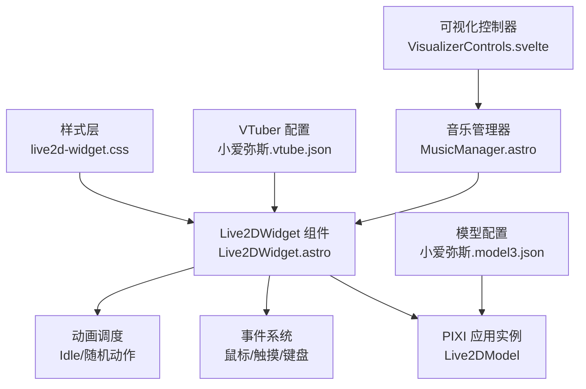
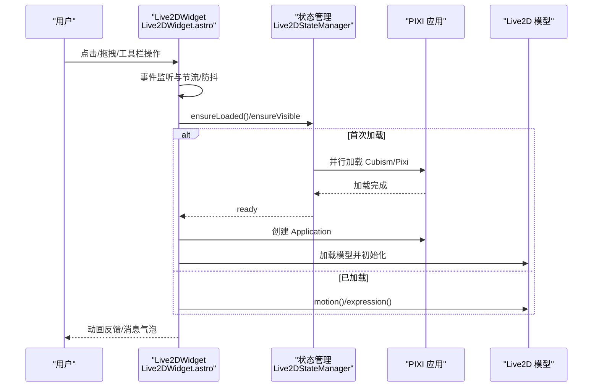
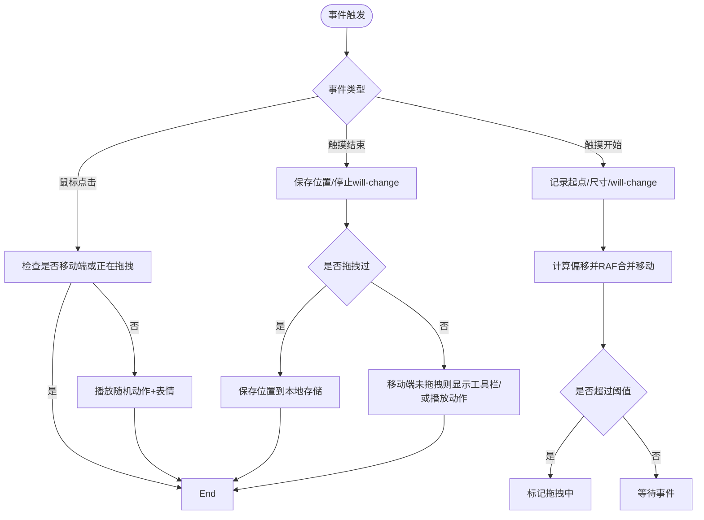
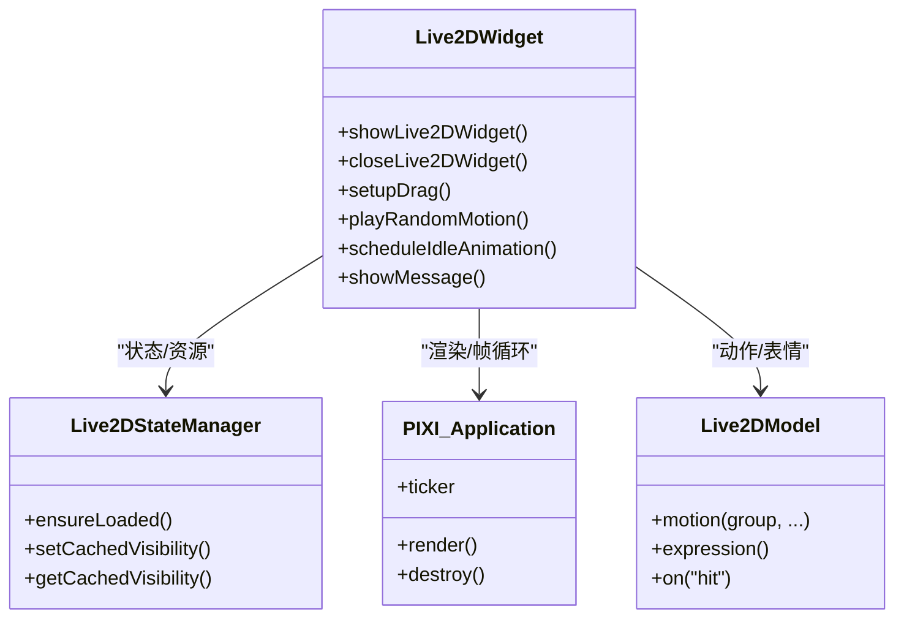
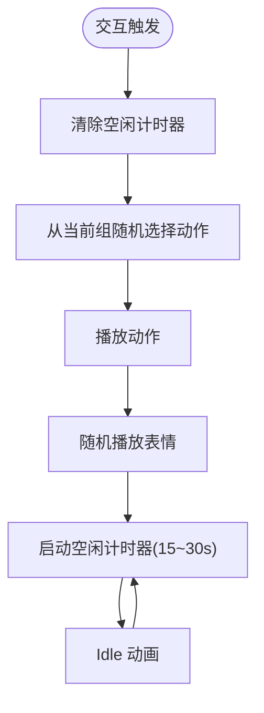
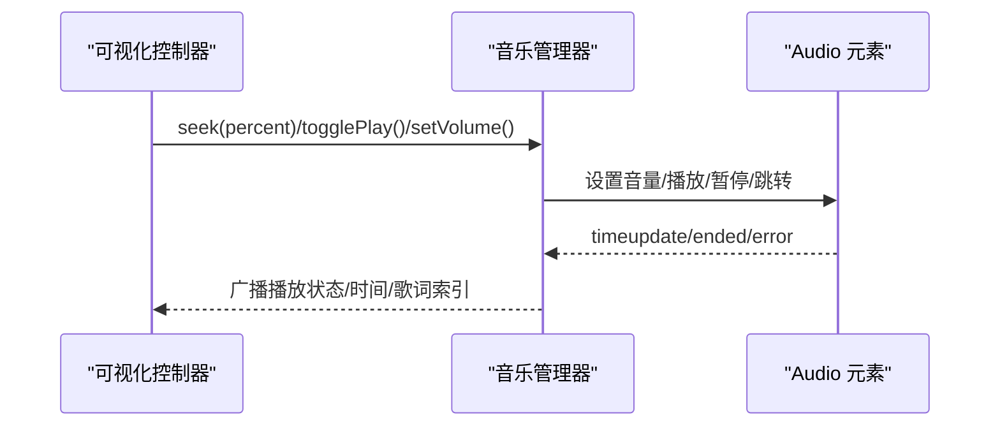
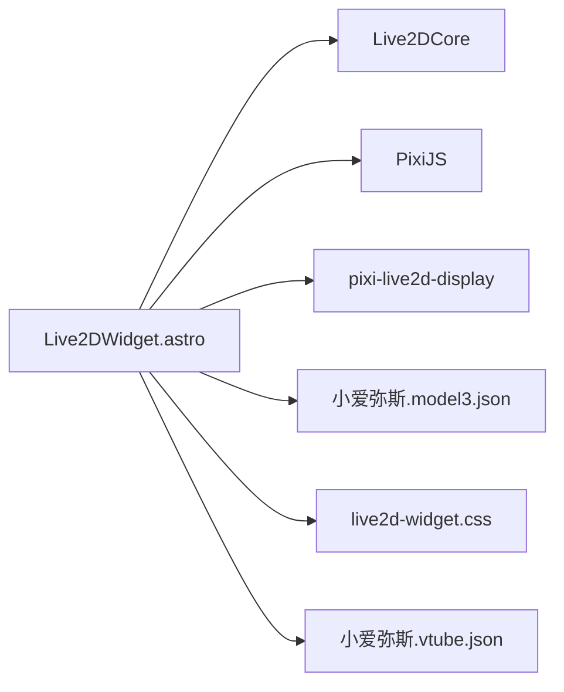

# 交互控制系统

<cite>
**本文引用的文件**
- [Live2DWidget.astro](file://src/components/features/Live2DWidget.astro)
- [live2d-widget.css](file://src/styles/components/live2d-widget.css)
- [小爱弥斯.model3.json](file://public/pio/models/live2d/小爱弥斯_vts/小爱弥斯.model3.json)
- [小爱弥斯.vtube.json](file://public/pio/models/live2d/小爱弥斯_vts/小爱弥斯.vtube.json)
- [MusicManager.astro](file://src/components/features/MusicManager.astro)
- [VisualizerControls.svelte](file://src/components/features/music-visualizer/VisualizerControls.svelte)
</cite>

## 目录
1. [简介](#简介)
2. [项目结构](#项目结构)
3. [核心组件](#核心组件)
4. [架构总览](#架构总览)
5. [详细组件分析](#详细组件分析)
6. [依赖分析](#依赖分析)
7. [性能考虑](#性能考虑)
8. [故障排查指南](#故障排查指南)
9. [结论](#结论)
10. [附录](#附录)

## 简介
本文件为“Live2D 交互控制系统”的技术文档，聚焦于用户交互事件的捕获与处理（鼠标点击、触摸手势、键盘快捷键）、虚拟助手的响应式交互设计（点击反馈、拖拽跟随、碰撞边界约束）、随机动画系统（动画队列管理、随机概率控制、状态机设计）、语音交互集成（音频播放控制、音量调节、歌词同步）、事件自定义扩展（监听器注册、回调管理、事件传播）、性能优化策略（事件节流/防抖、内存泄漏防护）以及测试与体验优化最佳实践。

## 项目结构
Live2D 交互系统主要由以下模块构成：
- 视图与交互层：Live2DWidget 组件负责渲染、事件绑定与交互逻辑
- 样式层：live2d-widget.css 提供布局、动画与移动端适配
- 资源层：Live2D 模型与动作资源（model3.json、motion3.json、exp3.json）
- 音频与可视化层：音乐管理器与可视化控制器（可选联动）

图表来源
- [Live2DWidget.astro:297-366](file://src/components/features/Live2DWidget.astro#L297-L366)
- [live2d-widget.css:6-51](file://src/styles/components/live2d-widget.css#L6-L51)
- [小爱弥斯.model3.json:11-63](file://public/pio/models/live2d/小爱弥斯_vts/小爱弥斯.model3.json#L11-L63)
- [MusicManager.astro:232-354](file://src/components/features/MusicManager.astro#L232-L354)
- [VisualizerControls.svelte:106-161](file://src/components/features/music-visualizer/VisualizerControls.svelte#L106-L161)

章节来源
- [Live2DWidget.astro:1-1209](file://src/components/features/Live2DWidget.astro#L1-L1209)
- [live2d-widget.css:1-313](file://src/styles/components/live2d-widget.css#L1-L313)
- [小爱弥斯.model3.json:1-111](file://public/pio/models/live2d/小爱弥斯_vts/小爱弥斯.model3.json#L1-L111)

## 核心组件
- Live2DStateManager：全局状态单例，负责资源加载、错误重试与可见性缓存
- Live2D 交互控制器：封装事件监听、拖拽、动画调度、可见性切换与跨页状态恢复
- 样式与动画：CSS 控制初始进入/退出/掉落动画、工具栏显隐、移动端工具栏
- 动画与表达：基于 model3.json 的动作分组（Idle/Expression/TapShort/TapLong/Other）与 exp3.json 表情参数

章节来源
- [Live2DWidget.astro:132-237](file://src/components/features/Live2DWidget.astro#L132-L237)
- [Live2DWidget.astro:378-465](file://src/components/features/Live2DWidget.astro#L378-L465)
- [live2d-widget.css:13-50](file://src/styles/components/live2d-widget.css#L13-L50)
- [小爱弥斯.model3.json:11-63](file://public/pio/models/live2d/小爱弥斯_vts/小爱弥斯.model3.json#L11-L63)

## 架构总览
系统采用“组件内联脚本 + 全局状态 + 事件信号（AbortController）”的设计，确保：
- 资源按需加载且并发优化
- 事件统一注册与批量清理
- 跨页面状态保持（Swup/Astro）
- 移动端与桌面端差异化交互

图表来源
- [Live2DWidget.astro:162-237](file://src/components/features/Live2DWidget.astro#L162-L237)
- [Live2DWidget.astro:297-366](file://src/components/features/Live2DWidget.astro#L297-L366)
- [Live2DWidget.astro:470-508](file://src/components/features/Live2DWidget.astro#L470-L508)

## 详细组件分析

### 交互事件捕获与处理
- 鼠标交互
  - 点击：在非移动端且非拖拽状态下触发随机动作与表情
  - 工具栏按钮：切换动画组、显示作者信息、拖拽开关、关闭控件
- 触摸交互
  - 单指拖拽：移动端拖拽跟随，带边界约束与 RAF 合并更新
  - 点击：未拖拽时显示移动端工具栏；拖拽后不触发动作
- 键盘快捷键
  - 未在该组件中实现键盘快捷键绑定（可通过外部监听器扩展）

图表来源
- [Live2DWidget.astro:395-465](file://src/components/features/Live2DWidget.astro#L395-L465)
- [Live2DWidget.astro:855-954](file://src/components/features/Live2DWidget.astro#L855-L954)

章节来源
- [Live2DWidget.astro:378-465](file://src/components/features/Live2DWidget.astro#L378-L465)
- [Live2DWidget.astro:855-954](file://src/components/features/Live2DWidget.astro#L855-L954)

### 虚拟助手响应式交互设计
- 点击反馈：播放随机动作与表情，同时展示消息气泡
- 拖拽跟随：使用 requestAnimationFrame 合并 DOM 更新，限制 will-change，避免频繁回流
- 碰撞检测与边界约束：根据窗口尺寸与元素尺寸进行 clamp，确保不超出可视区域
- 移动端工具栏：悬停显示桌面端工具栏，移动端长按显示工具栏，点击空白区域自动隐藏

图表来源
- [Live2DWidget.astro:132-237](file://src/components/features/Live2DWidget.astro#L132-L237)
- [Live2DWidget.astro:297-366](file://src/components/features/Live2DWidget.astro#L297-L366)
- [Live2DWidget.astro:470-508](file://src/components/features/Live2DWidget.astro#L470-L508)

章节来源
- [Live2DWidget.astro:510-525](file://src/components/features/Live2DWidget.astro#L510-L525)
- [Live2DWidget.astro:753-954](file://src/components/features/Live2DWidget.astro#L753-L954)
- [live2d-widget.css:284-312](file://src/styles/components/live2d-widget.css#L284-L312)

### 随机动画系统
- 动作分组：Idle/Expression/TapShort/TapLong/Other
- 随机选择：从当前选中的动作组中随机挑选一个动作播放
- 状态机：空闲计时器驱动 Idle 动画，交互后清空计时器，延时后重启
- 表达式：每次动作播放后随机播放一个表情

图表来源
- [Live2DWidget.astro:470-508](file://src/components/features/Live2DWidget.astro#L470-L508)
- [小爱弥斯.model3.json:11-63](file://public/pio/models/live2d/小爱弥斯_vts/小爱弥斯.model3.json#L11-L63)

章节来源
- [Live2DWidget.astro:470-508](file://src/components/features/Live2DWidget.astro#L470-L508)
- [小爱弥斯.model3.json:11-63](file://public/pio/models/live2d/小爱弥斯_vts/小爱弥斯.model3.json#L11-L63)

### 语音交互集成
- 音频播放控制：音量调节、静音切换、播放/暂停、上一首/下一首、进度跳转
- 歌词同步：基于时间轴索引推进，与播放事件联动
- 可视化联动：可视化控制器通过 window 全局接口与音乐管理器通信

图表来源
- [MusicManager.astro:232-354](file://src/components/features/MusicManager.astro#L232-L354)
- [VisualizerControls.svelte:106-161](file://src/components/features/music-visualizer/VisualizerControls.svelte#L106-L161)

章节来源
- [MusicManager.astro:232-354](file://src/components/features/MusicManager.astro#L232-L354)
- [VisualizerControls.svelte:106-161](file://src/components/features/music-visualizer/VisualizerControls.svelte#L106-L161)

### 事件自定义扩展
- 监听器注册：使用 AbortController 管理事件监听器生命周期，统一在 cleanup 中批量移除
- 回调管理：通过 CustomEvent 派发可见性变更等状态事件
- 事件传播：工具栏按钮阻止冒泡以避免误触，拖拽事件在容器内处理

章节来源
- [Live2DWidget.astro:1122-1147](file://src/components/features/Live2DWidget.astro#L1122-L1147)
- [Live2DWidget.astro:592-596](file://src/components/features/Live2DWidget.astro#L592-L596)
- [Live2DWidget.astro:404-435](file://src/components/features/Live2DWidget.astro#L404-L435)

## 依赖分析
- 外部库依赖
  - Live2D Core SDK（cubismcore）
  - PixiJS（渲染引擎）
  - pixi-live2d-display（Live2D 渲染桥接）
- 模型与动作依赖
  - model3.json 定义动作分组与表情映射
  - vtube.json 提供 VTuber 相关配置（可选）
- 样式依赖
  - live2d-widget.css 提供动画与移动端适配

图表来源
- [Live2DWidget.astro:194-212](file://src/components/features/Live2DWidget.astro#L194-L212)
- [小爱弥斯.model3.json:1-111](file://public/pio/models/live2d/小爱弥斯_vts/小爱弥斯.model3.json#L1-L111)
- [live2d-widget.css:1-51](file://src/styles/components/live2d-widget.css#L1-L51)
- [小爱弥斯.vtube.json:471-4223](file://public/pio/models/live2d/小爱弥斯_vts/小爱弥斯.vtube.json#L471-L4223)

章节来源
- [Live2DWidget.astro:194-212](file://src/components/features/Live2DWidget.astro#L194-L212)
- [小爱弥斯.model3.json:1-111](file://public/pio/models/live2d/小爱弥斯_vts/小爱弥斯.model3.json#L1-L111)
- [live2d-widget.css:1-51](file://src/styles/components/live2d-widget.css#L1-L51)
- [小爱弥斯.vtube.json:471-4223](file://public/pio/models/live2d/小爱弥斯_vts/小爱弥斯.vtube.json#L471-L4223)

## 性能考虑
- 事件节流/防抖
  - resize 使用防抖（150ms）减少频繁计算
  - 空闲动画计时器随机化（15~30s），降低持续渲染压力
- 渲染优化
  - 使用 will-change 与 RAF 合并 DOM 更新，避免每帧多次布局
  - 页面不可见时停止 ticker，恢复可见时再启动
- 资源管理
  - 资源按需加载并行化，失败重试最多两次
  - 统一销毁 PIXI 实例与纹理，防止内存泄漏
- 存储与跨页状态
  - 位置与可见性缓存到 localStorage，跨页恢复时避免重复初始化

章节来源
- [Live2DWidget.astro:1188-1191](file://src/components/features/Live2DWidget.astro#L1188-L1191)
- [Live2DWidget.astro:494-508](file://src/components/features/Live2DWidget.astro#L494-L508)
- [Live2DWidget.astro:1000-1011](file://src/components/features/Live2DWidget.astro#L1000-L1011)
- [Live2DWidget.astro:1126-1147](file://src/components/features/Live2DWidget.astro#L1126-L1147)
- [Live2DWidget.astro:1155-1174](file://src/components/features/Live2DWidget.astro#L1155-L1174)

## 故障排查指南
- 模型无法加载
  - 检查 model3.json 路径与网络可达性
  - 查看资源加载 Promise 错误与重试次数
- 动作不播放
  - 确认动作分组名称与 model3.json 中一致
  - 检查 expression() 是否成功调用
- 拖拽异常
  - 确认 AbortController 未提前 abort
  - 检查移动端工具栏遮挡导致的事件冲突
- 性能问题
  - 检查 ticker 是否在页面不可见时停止
  - 确认 RAF 合并与 will-change 使用正确

章节来源
- [Live2DWidget.astro:162-192](file://src/components/features/Live2DWidget.astro#L162-L192)
- [Live2DWidget.astro:427-434](file://src/components/features/Live2DWidget.astro#L427-L434)
- [Live2DWidget.astro:1000-1011](file://src/components/features/Live2DWidget.astro#L1000-L1011)

## 结论
该 Live2D 交互控制系统通过组件内联脚本与全局状态管理实现了资源按需加载、事件统一治理与跨页状态保持；结合 PIXI 渲染与 Live2D 动作系统，提供了流畅的点击反馈、拖拽跟随与随机动画体验；配合音频与可视化模块，可进一步拓展语音交互与实时可视化联动。建议在生产环境中完善键盘快捷键支持、增强错误上报与埋点统计，并持续优化移动端交互细节与性能指标。

## 附录
- 关键实现路径参考
  - 资源加载与状态管理：[Live2DWidget.astro:162-237](file://src/components/features/Live2DWidget.astro#L162-L237)
  - 初始化与渲染：[Live2DWidget.astro:297-366](file://src/components/features/Live2DWidget.astro#L297-L366)
  - 交互与动画调度：[Live2DWidget.astro:378-508](file://src/components/features/Live2DWidget.astro#L378-L508)
  - 拖拽与边界约束：[Live2DWidget.astro:753-954](file://src/components/features/Live2DWidget.astro#L753-L954)
  - 样式与动画：[live2d-widget.css:13-50](file://src/styles/components/live2d-widget.css#L13-L50)
  - 动作与表情配置：[小爱弥斯.model3.json:11-93](file://public/pio/models/live2d/小爱弥斯_vts/小爱弥斯.model3.json#L11-L93)
  - VTuber 配置：[小爱弥斯.vtube.json:471-4223](file://public/pio/models/live2d/小爱弥斯_vts/小爱弥斯.vtube.json#L471-L4223)
  - 音频控制与同步：[MusicManager.astro:232-354](file://src/components/features/MusicManager.astro#L232-L354)
  - 可视化联动：[VisualizerControls.svelte:106-161](file://src/components/features/music-visualizer/VisualizerControls.svelte#L106-L161)