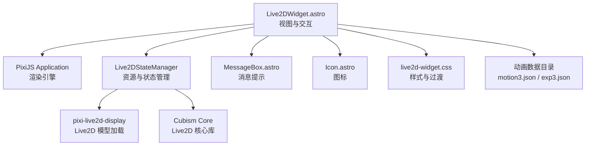
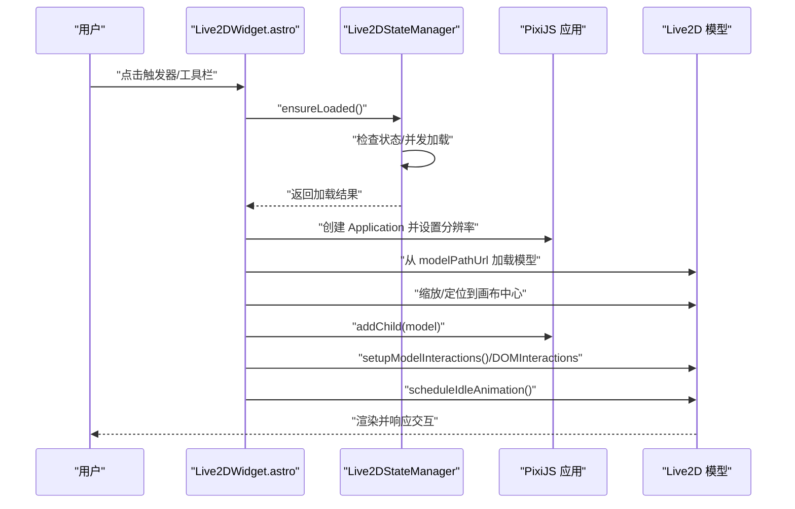
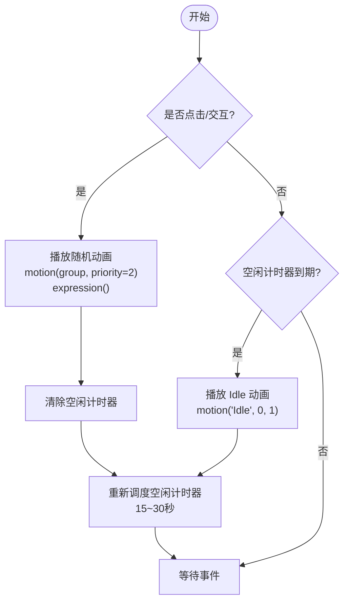
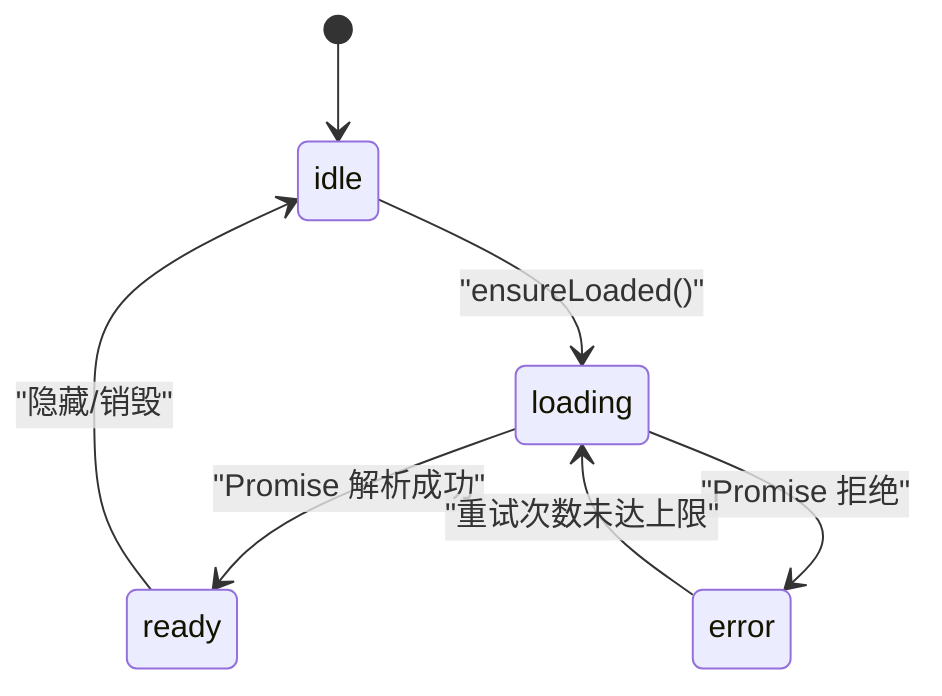
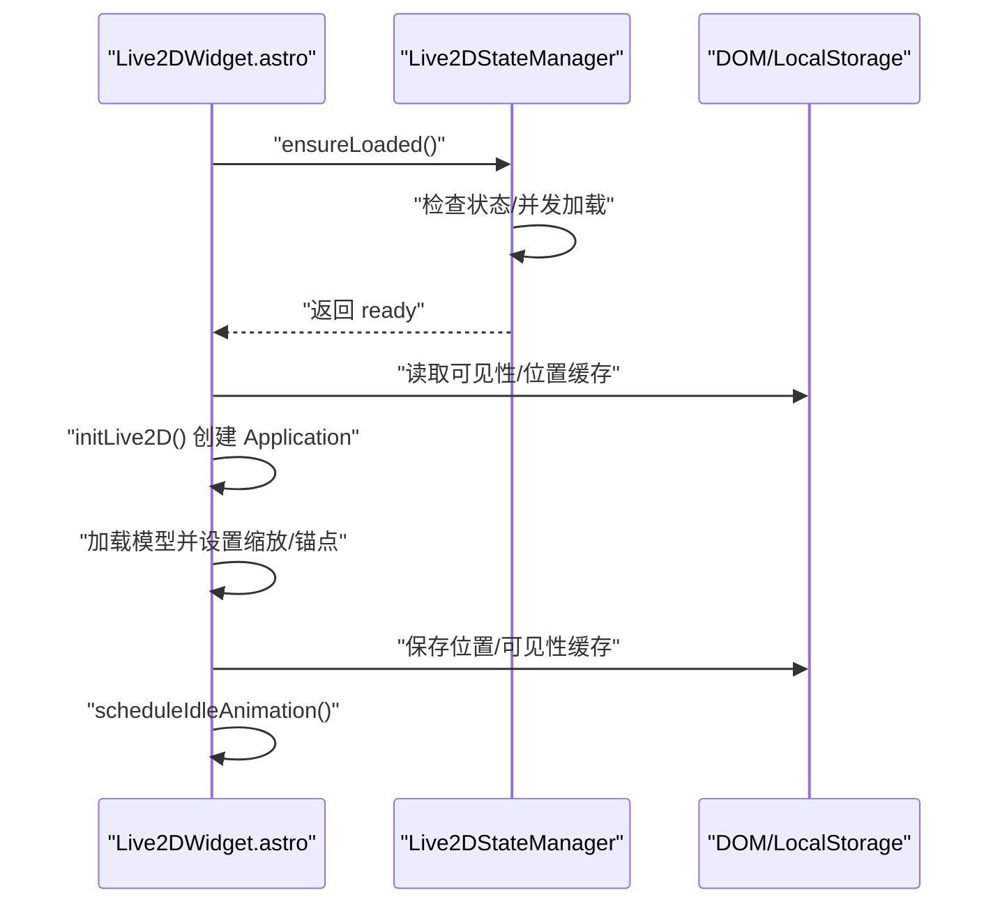
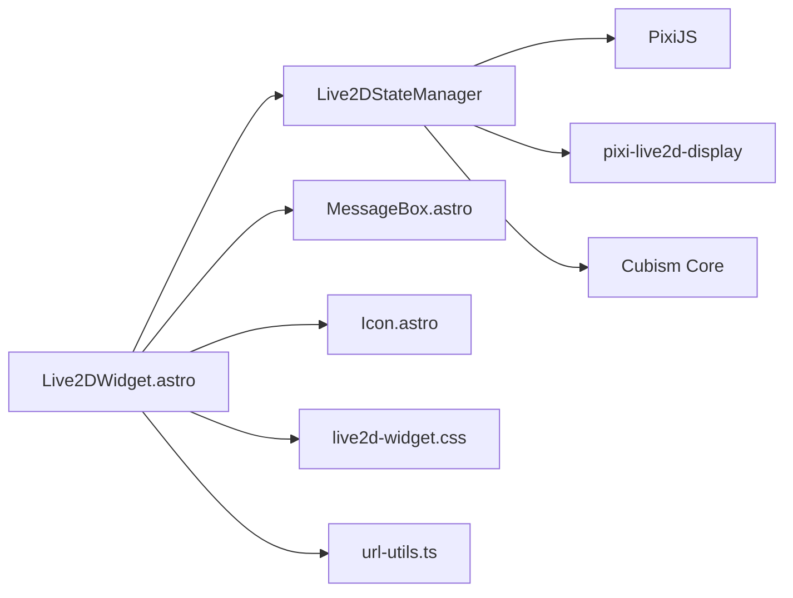

# 动画管理系统

<cite>
**本文引用的文件**
- [Live2DWidget.astro](file://src/components/features/Live2DWidget.astro)
- [live2d-widget.css](file://src/styles/components/live2d-widget.css)
- [pioConfig.ts](file://src/config/pioConfig.ts)
- [index.ts](file://src/config/index.ts)
- [url-utils.ts](file://src/utils/url-utils.ts)
- [MessageBox.astro](file://src/components/common/PioMessageBox.astro)
- [Icon.astro](file://src/components/common/Icon.astro)
- [小爱弥斯_vts 动画目录](file://public/pio/models/live2d/小爱弥斯_vts/动画)
- [小爱弥斯_vts 表情目录](file://public/pio/models/live2d/小爱弥斯_vts/表情)
- [小爱弥斯_vts 其他目录](file://public/pio/models/live2d/小爱弥斯_vts/其他)
</cite>

## 目录
1. [简介](#简介)
2. [项目结构](#项目结构)
3. [核心组件](#核心组件)
4. [架构总览](#架构总览)
5. [详细组件分析](#详细组件分析)
6. [依赖分析](#依赖分析)
7. [性能考虑](#性能考虑)
8. [故障排查指南](#故障排查指南)
9. [结论](#结论)
10. [附录](#附录)

## 简介
本文件为 Live2D 动画管理系统的深度技术文档，围绕以下目标展开：
- 动画数据的组织结构与分类体系：表情动画、动作动画、特殊效果动画的管理方式
- 动画播放器实现机制：动画序列控制、帧率管理、循环播放策略
- 动画状态机设计与实现：状态转换条件、优先级处理与冲突解决
- 资源预加载与懒加载策略：内存管理、缓存机制与资源回收
- 自定义与扩展：新增动画、参数调整与效果组合
- 性能优化：帧率控制、渲染批处理与 GPU 优化
- 调试工具与性能分析方法

该系统基于 Astro + Svelte 的前端框架，结合 PixiJS 与 pixi-live2d-display 实现 Live2D 模型的渲染与交互；动画数据以 motion3.json 与 exp3.json 形式组织，按“表情/短动画/长动画/其他”等分组进行管理。

## 项目结构
Live2D 动画系统主要由以下模块构成：
- 视图层组件：Live2DWidget.astro 提供 UI 容器、工具栏、触发器与消息气泡
- 样式层：live2d-widget.css 控制布局、过渡动画与移动端工具栏显隐
- 配置层：pioConfig.ts 与 index.ts 提供模型路径、尺寸、默认可见性等配置
- 工具层：url-utils.ts 提供资源 URL 构造
- 交互层：MessageBox.astro 与 Icon.astro 提供消息提示与图标
- 数据层：public/pio/models/live2d/小爱弥斯_vts 下的动画与表情资源

图表来源
- [Live2DWidget.astro:1-1209](file://src/components/features/Live2DWidget.astro#L1-L1209)
- [live2d-widget.css](file://src/styles/components/live2d-widget.css)
- [pioConfig.ts](file://src/config/pioConfig.ts)
- [index.ts](file://src/config/index.ts)
- [url-utils.ts](file://src/utils/url-utils.ts)

章节来源
- [Live2DWidget.astro:1-1209](file://src/components/features/Live2DWidget.astro#L1-L1209)
- [live2d-widget.css](file://src/styles/components/live2d-widget.css)
- [pioConfig.ts](file://src/config/pioConfig.ts)
- [index.ts](file://src/config/index.ts)
- [url-utils.ts](file://src/utils/url-utils.ts)

## 核心组件
- Live2DStateManager：单例状态管理器，负责资源加载（Cubism Core、PixiJS、pixi-live2d-display）与可见性缓存
- Live2DWidget.astro：主组件，负责生命周期、拖拽、点击交互、动画播放调度、可见性切换与跨页面状态恢复
- MessageBox.astro：消息气泡展示，配合点击交互反馈
- 样式与过渡：通过 CSS 类与变量控制进入/退出/掉落等动画状态

章节来源
- [Live2DWidget.astro:132-237](file://src/components/features/Live2DWidget.astro#L132-L237)
- [Live2DWidget.astro:297-366](file://src/components/features/Live2DWidget.astro#L297-L366)
- [Live2DWidget.astro:467-525](file://src/components/features/Live2DWidget.astro#L467-L525)
- [Live2DWidget.astro:529-704](file://src/components/features/Live2DWidget.astro#L529-L704)
- [Live2DWidget.astro:753-955](file://src/components/features/Live2DWidget.astro#L753-L955)
- [Live2DWidget.astro:957-1076](file://src/components/features/Live2DWidget.astro#L957-L1076)
- [Live2DWidget.astro:1152-1205](file://src/components/features/Live2DWidget.astro#L1152-L1205)

## 架构总览
系统采用“组件驱动 + 状态单例 + 资源懒加载”的架构模式：
- 组件层：Live2DWidget.astro 负责 UI、交互与生命周期
- 状态层：Live2DStateManager 统一管理资源加载与可见性缓存
- 渲染层：PixiJS Application + pixi-live2d-display 负责模型渲染
- 数据层：动画与表情资源按目录结构组织，按需加载

图表来源
- [Live2DWidget.astro:270-292](file://src/components/features/Live2DWidget.astro#L270-L292)
- [Live2DWidget.astro:297-366](file://src/components/features/Live2DWidget.astro#L297-L366)
- [Live2DWidget.astro:378-465](file://src/components/features/Live2DWidget.astro#L378-L465)
- [Live2DWidget.astro:494-508](file://src/components/features/Live2DWidget.astro#L494-L508)

## 详细组件分析

### 动画数据组织与分类体系
- 分类目录
  - 表情：表情.exp3.json，对应模型的表情参数
  - 短动画：短动画/*.motion3.json，通常为轻量交互片段
  - 长动画：长动画/*.motion3.json，持续时间较长的动作
  - 其他：其他/*.motion3.json，如入场、消失等特殊片段
- 分组策略
  - Expression：表情类
  - TapShort/TapLong：点击触发的短/长动画
  - Other：其他特殊效果
- 切换逻辑
  - 工具栏按钮循环切换当前分组，指示器显示当前组名
  - 点击模型或画布时随机播放当前分组内的一个动画，并同时播放默认表情

章节来源
- [Live2DWidget.astro:126-127](file://src/components/features/Live2DWidget.astro#L126-L127)
- [Live2DWidget.astro:401-436](file://src/components/features/Live2DWidget.astro#L401-L436)
- [Live2DWidget.astro:470-485](file://src/components/features/Live2DWidget.astro#L470-L485)
- [小爱弥斯_vts 动画目录](file://public/pio/models/live2d/小爱弥斯_vts/动画)
- [小爱弥斯_vts 表情目录](file://public/pio/models/live2d/小爱弥斯_vts/表情)
- [小爱弥斯_vts 其他目录](file://public/pio/models/live2d/小爱弥斯_vts/其他)

### 动画播放器实现机制
- 动画序列控制
  - 使用 model.motion(group, ..., priority) 播放指定分组动画，priority=2 提升优先级
  - 表情播放：model.expression() 播放默认表情
- 帧率管理
  - PixiJS Application 默认使用 ticker 驱动渲染，支持 start()/stop() 控制
  - 页面不可见时停止 ticker，可见时恢复渲染
- 循环播放策略
  - 空闲定时器：15~30 秒随机间隔自动播放 Idle 分组动画
  - 点击交互：每次点击清空空闲计时，播放随机动画后重新调度空闲

图表来源
- [Live2DWidget.astro:470-485](file://src/components/features/Live2DWidget.astro#L470-L485)
- [Live2DWidget.astro:494-508](file://src/components/features/Live2DWidget.astro#L494-L508)
- [Live2DWidget.astro:998-1011](file://src/components/features/Live2DWidget.astro#L998-L1011)

章节来源
- [Live2DWidget.astro:470-508](file://src/components/features/Live2DWidget.astro#L470-L508)
- [Live2DWidget.astro:998-1011](file://src/components/features/Live2DWidget.astro#L998-L1011)

### 动画状态机设计与实现
- 状态集合
  - idle：初始/待机
  - loading：资源加载中
  - ready：资源就绪，可渲染
  - error：加载失败
- 状态转换
  - idle → loading：调用 ensureLoaded()
  - loading → ready：Promise 成功解析
  - loading → error：Promise 拒绝，记录错误并限制重试次数
  - error → loading：达到最大重试次数前允许重试
- 优先级与冲突
  - 交互播放设置 priority=2，确保打断低优先级动画
  - 空闲播放设置 priority=1，避免频繁打断交互
  - 表情播放在交互与空闲时均会触发，作为视觉反馈

图表来源
- [Live2DWidget.astro:132-192](file://src/components/features/Live2DWidget.astro#L132-L192)
- [Live2DWidget.astro:470-485](file://src/components/features/Live2DWidget.astro#L470-L485)
- [Live2DWidget.astro:494-508](file://src/components/features/Live2DWidget.astro#L494-L508)

章节来源
- [Live2DWidget.astro:132-192](file://src/components/features/Live2DWidget.astro#L132-L192)
- [Live2DWidget.astro:470-508](file://src/components/features/Live2DWidget.astro#L470-L508)

### 资源预加载与懒加载策略
- 预加载
  - Cubism Core 与 PixiJS 并行加载，pixi-live2d-display 串行依赖加载
  - 通过 loadScript 动态注入脚本，避免阻塞首屏
- 懒加载
  - 首次显示时才创建 PixiJS Application 与 Live2D 模型
  - 关闭时销毁应用与模型，释放 GPU/内存资源
- 缓存与持久化
  - 可见性缓存：localStorage 存储 visible/hidden
  - 位置缓存：localStorage 存储 left/top，跨页恢复
- 资源回收
  - 销毁时清理 ticker、定时器、事件监听器与 DOM 引用
  - 在页面切换（Swup/Astro）时检测 DOM 替换并重建实例

图表来源
- [Live2DWidget.astro:162-192](file://src/components/features/Live2DWidget.astro#L162-L192)
- [Live2DWidget.astro:270-292](file://src/components/features/Live2DWidget.astro#L270-L292)
- [Live2DWidget.astro:297-366](file://src/components/features/Live2DWidget.astro#L297-L366)
- [Live2DWidget.astro:1122-1147](file://src/components/features/Live2DWidget.astro#L1122-L1147)

章节来源
- [Live2DWidget.astro:162-237](file://src/components/features/Live2DWidget.astro#L162-L237)
- [Live2DWidget.astro:270-366](file://src/components/features/Live2DWidget.astro#L270-L366)
- [Live2DWidget.astro:1122-1147](file://src/components/features/Live2DWidget.astro#L1122-L1147)

### 自定义与扩展方法
- 新增动画
  - 将 motion3.json 放入对应分组目录（表情/短动画/长动画/其他）
  - 若需独立分组，可在 allMotionGroups 中注册新组名
- 参数调整
  - 修改 config.interactive.clickMessages 自定义点击消息
  - 调整 config.size、config.resolution、config.position 控制尺寸与像素密度
  - 通过 CSS 类覆盖过渡动画与移动端工具栏样式
- 效果组合
  - 交互播放后可叠加 expression() 以恢复默认表情
  - 通过不同 priority 设置实现打断与叠加策略

章节来源
- [Live2DWidget.astro:126-127](file://src/components/features/Live2DWidget.astro#L126-L127)
- [Live2DWidget.astro:391-436](file://src/components/features/Live2DWidget.astro#L391-L436)
- [Live2DWidget.astro:960-976](file://src/components/features/Live2DWidget.astro#L960-L976)
- [live2d-widget.css](file://src/styles/components/live2d-widget.css)

### 动画调试工具与性能分析
- 调试建议
  - 使用浏览器开发者工具观察 PixiJS ticker 与渲染帧率
  - 检查 modelPathUrl 与资源加载状态，确认 Cubism Core 与 pixi-live2d-display 正常注入
  - 监听 live2d-visibility-change 自定义事件验证可见性切换
- 性能分析
  - 通过页面可见性事件暂停渲染，减少后台开销
  - 合理设置 resolution 与设备像素比，平衡清晰度与性能
  - 使用 requestAnimationFrame 与节流防抖处理拖拽与窗口大小变化

章节来源
- [Live2DWidget.astro:998-1011](file://src/components/features/Live2DWidget.astro#L998-L1011)
- [Live2DWidget.astro:1188-1191](file://src/components/features/Live2DWidget.astro#L1188-L1191)
- [Live2DWidget.astro:1196-1198](file://src/components/features/Live2DWidget.astro#L1196-L1198)

## 依赖分析
- 外部依赖
  - pixi.js：渲染引擎
  - pixi-live2d-display：Live2D 模型加载与渲染
  - Cubism Core：Live2D SDK 核心
- 内部依赖
  - Live2DWidget.astro 依赖 Live2DStateManager、MessageBox.astro、Icon.astro、样式与配置
  - 资源路径通过 url-utils.ts 生成

图表来源
- [Live2DWidget.astro:1-1209](file://src/components/features/Live2DWidget.astro#L1-L1209)
- [url-utils.ts](file://src/utils/url-utils.ts)

章节来源
- [Live2DWidget.astro:194-212](file://src/components/features/Live2DWidget.astro#L194-L212)
- [Live2DWidget.astro:80-84](file://src/components/features/Live2DWidget.astro#L80-L84)

## 性能考虑
- 帧率控制
  - 使用 PixiJS ticker 驱动渲染，页面不可见时停止，可见时恢复
  - 空闲动画采用随机延迟，降低恒定刷新压力
- 渲染批处理
  - 单一 Application 管理模型，减少上下文切换
  - 模型缩放与锚点统一设置，避免重复计算
- GPU 优化
  - 合理设置 resolution，避免过高像素导致 GPU 压力
  - 关闭时销毁纹理与基础纹理，释放显存
- 资源管理
  - 并行加载核心库，串行加载依赖库，缩短首帧时间
  - 懒加载模型，仅在可见时初始化

章节来源
- [Live2DWidget.astro:998-1011](file://src/components/features/Live2DWidget.astro#L998-L1011)
- [Live2DWidget.astro:330-338](file://src/components/features/Live2DWidget.astro#L330-L338)
- [Live2DWidget.astro:1126-1138](file://src/components/features/Live2DWidget.astro#L1126-L1138)

## 故障排查指南
- 资源加载失败
  - 现象：组件无法进入 ready 状态
  - 排查：检查 Cubism Core 与 PixiJS 注入是否成功，确认网络可达性
- 模型加载异常
  - 现象：初始化后无渲染或报错
  - 排查：确认 modelPathUrl 正确，检查 motion3.json/exp3.json 结构完整性
- 交互无效
  - 现象：点击无反应或工具栏不显示
  - 排查：确认事件监听器未被提前移除，检查移动端工具栏显隐逻辑
- 性能问题
  - 现象：帧率下降或卡顿
  - 排查：降低 resolution，检查是否有过多定时器与事件监听器未清理

章节来源
- [Live2DWidget.astro:162-192](file://src/components/features/Live2DWidget.astro#L162-L192)
- [Live2DWidget.astro:297-366](file://src/components/features/Live2DWidget.astro#L297-L366)
- [Live2DWidget.astro:378-465](file://src/components/features/Live2DWidget.astro#L378-L465)
- [Live2DWidget.astro:1122-1147](file://src/components/features/Live2DWidget.astro#L1122-L1147)

## 结论
本系统通过“组件 + 状态单例 + 资源懒加载”的架构，实现了对 Live2D 动画的高效管理与交互体验。其分类化的动画数据结构、优先级驱动的播放策略与完善的跨页面状态恢复机制，使得系统具备良好的可维护性与扩展性。结合帧率控制、渲染批处理与 GPU 优化策略，能够在多平台环境下稳定运行。

## 附录
- 配置项参考
  - config.position：角落与偏移
  - config.size：宽高
  - config.resolution：像素密度
  - config.defaultVisible：默认可见性
  - config.responsive.hideOnMobile：移动端隐藏
  - config.interactive.clickMessages：点击消息列表
  - config.interactive.messageDisplayTime：消息显示时长
- 目录结构参考
  - 表情：表情/*.exp3.json
  - 短动画：短动画/*.motion3.json
  - 长动画：长动画/*.motion3.json
  - 其他：其他/*.motion3.json

章节来源
- [Live2DWidget.astro:13-18](file://src/components/features/Live2DWidget.astro#L13-L18)
- [Live2DWidget.astro:960-976](file://src/components/features/Live2DWidget.astro#L960-L976)
- [小爱弥斯_vts 动画目录](file://public/pio/models/live2d/小爱弥斯_vts/动画)
- [小爱弥斯_vts 表情目录](file://public/pio/models/live2d/小爱弥斯_vts/表情)
- [小爱弥斯_vts 其他目录](file://public/pio/models/live2d/小爱弥斯_vts/其他)