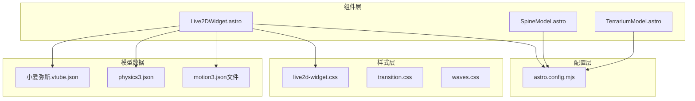
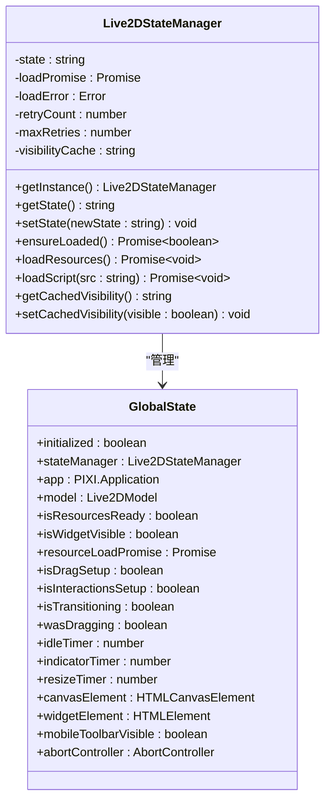
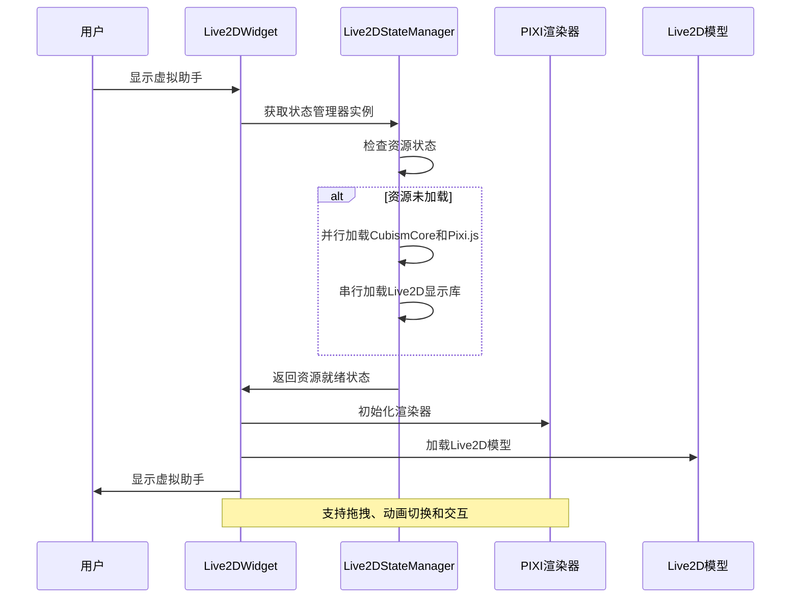
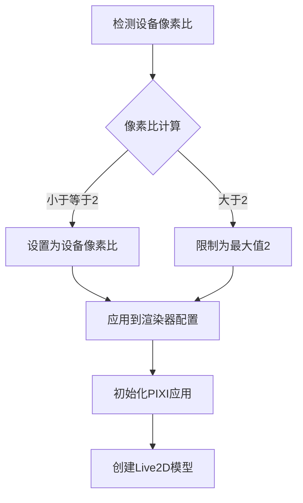
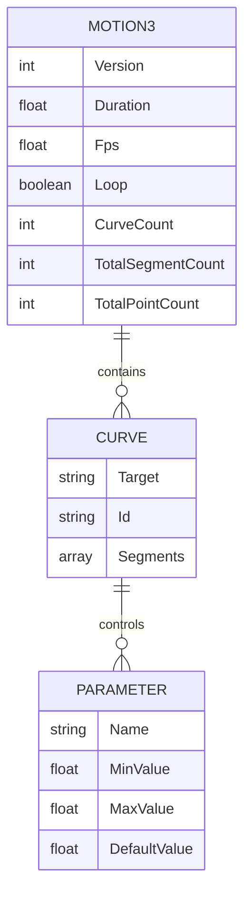
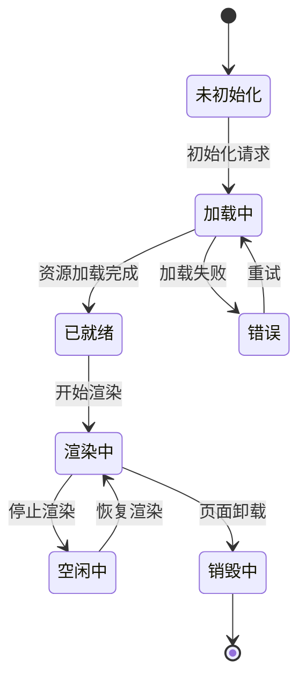
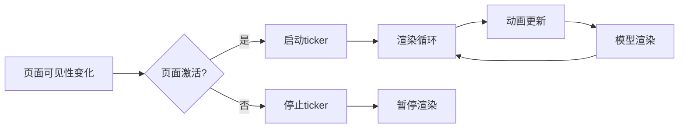
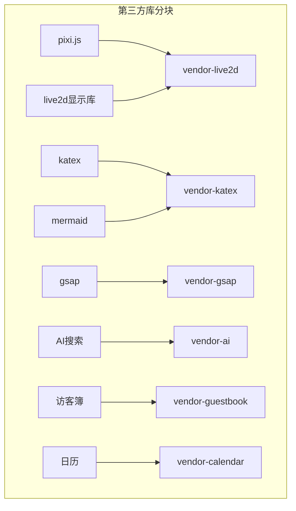

# 性能优化策略

<cite>
**本文档引用的文件**
- [Live2DWidget.astro](file://src/components/features/Live2DWidget.astro)
- [live2d-widget.css](file://src/styles/components/live2d-widget.css)
- [transition.css](file://src/styles/transition.css)
- [waves.css](file://src/styles/waves.css)
- [astro.config.mjs](file://astro.config.mjs)
- [小爱弥斯.vtube.json](file://public/pio/models/live2d/小爱弥斯_vts/小爱弥斯.vtube.json)
- [physics3.json](file://public/pio/models/live2d/小爱弥斯_vts/小爱弥斯.physics3.json)
- [待机.motion3.json](file://public/pio/models/live2d/小爱弥斯_vts/动画/长动画/待机.motion3.json)
- [晕.motion3.json](file://public/pio/models/live2d/小爱弥斯_vts/动画/其他/晕.motion3.json)
- [表情-横眼嘟嘴.motion3.json](file://public/pio/models/live2d/小爱弥斯_vts/动画/表情/横眼嘟嘴.motion3.json)
- [TerrariumModel.astro](file://src/components/widget/TerrariumModel.astro)
</cite>

## 目录
1. [项目概述](#项目概述)
2. [项目结构](#项目结构)
3. [核心组件](#核心组件)
4. [架构概览](#架构概览)
5. [详细组件分析](#详细组件分析)
6. [依赖关系分析](#依赖关系分析)
7. [性能考虑因素](#性能考虑因素)
8. [故障排除指南](#故障排除指南)
9. [结论](#结论)
10. [附录](#附录)

## 项目概述
本项目实现了基于 Live2D 的虚拟助手功能，集成了 3D 渲染、动画系统、交互控制和性能优化策略。Live2DWidget 组件提供了可拖拽的虚拟助手，支持多种动画组切换、触屏优化和资源管理。

## 项目结构
项目采用模块化架构，主要涉及以下关键目录和文件：

**图表来源**
- [Live2DWidget.astro:1-1209](file://src/components/features/Live2DWidget.astro#L1-L1209)
- [live2d-widget.css:1-313](file://src/styles/components/live2d-widget.css#L1-L313)
- [astro.config.mjs:245-280](file://astro.config.mjs#L245-L280)

**章节来源**
- [Live2DWidget.astro:1-1209](file://src/components/features/Live2DWidget.astro#L1-L1209)
- [live2d-widget.css:1-313](file://src/styles/components/live2d-widget.css#L1-L313)
- [astro.config.mjs:245-280](file://astro.config.mjs#L245-L280)

## 核心组件
Live2D 虚拟助手系统由多个核心组件构成，每个组件都针对特定的性能优化需求进行了专门设计。

### Live2DStateManager 类
负责资源管理和状态控制的核心类，实现了单例模式和异步资源加载机制。

**图表来源**
- [Live2DWidget.astro:132-237](file://src/components/features/Live2DWidget.astro#L132-L237)

### 渲染优化组件
系统实现了多层次的渲染优化策略，包括设备像素比适配、渲染器配置和资源管理。

**章节来源**
- [Live2DWidget.astro:297-366](file://src/components/features/Live2DWidget.astro#L297-L366)
- [live2d-widget.css:1-313](file://src/styles/components/live2d-widget.css#L1-L313)

## 架构概览
Live2D 虚拟助手采用事件驱动的架构模式，结合了状态管理模式和资源管理系统。

**图表来源**
- [Live2DWidget.astro:142-212](file://src/components/features/Live2DWidget.astro#L142-L212)
- [Live2DWidget.astro:297-366](file://src/components/features/Live2DWidget.astro#L297-L366)

## 详细组件分析

### 3D 渲染性能优化

#### 设备像素比优化
系统根据设备像素比动态调整渲染质量，平衡视觉效果和性能消耗。

**图表来源**
- [Live2DWidget.astro:311-314](file://src/components/features/Live2DWidget.astro#L311-L314)
- [Live2DWidget.astro:330-338](file://src/components/features/Live2DWidget.astro#L330-L338)

#### 渲染器配置优化
渲染器采用了多项优化配置来提升性能表现：

| 配置项 | 设置值 | 优化目的 |
|--------|--------|----------|
| antialias | true | 提升边缘质量 |
| resolution | 设备像素比 | 适配高密度屏幕 |
| autoDensity | true | 自动适配像素比 |
| backgroundAlpha | 0 | 透明背景，减少合成开销 |

**章节来源**
- [Live2DWidget.astro:330-338](file://src/components/features/Live2DWidget.astro#L330-L338)

### 动画系统性能优化

#### 动画数据结构
Live2D 动画采用 motion3.json 格式，包含曲线数据和参数控制：

**图表来源**
- [待机.motion3.json:1-106](file://public/pio/models/live2d/小爱弥斯_vts/动画/长动画/待机.motion3.json#L1-L106)
- [晕.motion3.json:1-100](file://public/pio/models/live2d/小爱弥斯_vts/动画/其他/晕.motion3.json#L1-L100)

#### 动画播放优化
系统实现了智能的动画播放策略，包括：

1. **动画组管理**：支持表情、短动画、长动画和其他动画组的切换
2. **随机播放**：避免重复播放同一动画造成视觉疲劳
3. **空闲动画**：定时播放待机动画保持自然表现
4. **交互响应**：用户交互时播放对应动画组

**章节来源**
- [Live2DWidget.astro:126-128](file://src/components/features/Live2DWidget.astro#L126-L128)
- [Live2DWidget.astro:470-485](file://src/components/features/Live2DWidget.astro#L470-L485)
- [Live2DWidget.astro:494-508](file://src/components/features/Live2DWidget.astro#L494-L508)

### 内存管理优化

#### 资源生命周期管理
系统实现了完善的资源生命周期管理：

**图表来源**
- [Live2DWidget.astro:1122-1147](file://src/components/features/Live2DWidget.astro#L1122-L1147)

#### 内存泄漏防护
通过 AbortController 管理所有事件监听器，确保页面卸载时彻底清理：

**章节来源**
- [Live2DWidget.astro:1122-1147](file://src/components/features/Live2DWidget.astro#L1122-L1147)

### 移动端性能适配

#### 触摸交互优化
系统针对移动端进行了专门的交互优化：

| 特性 | 实现方式 | 性能影响 |
|------|----------|----------|
| 触摸拖拽 | 单点触摸识别 | 减少不必要的事件处理 |
| 工具栏切换 | 点击显示/隐藏 | 避免常驻DOM节点 |
| 屏幕适配 | 响应式布局 | 适应不同屏幕尺寸 |
| 性能模式 | 移动端禁用入场动画 | 提升首屏加载速度 |

**章节来源**
- [Live2DWidget.astro:855-926](file://src/components/features/Live2DWidget.astro#L855-L926)
- [live2d-widget.css:284-312](file://src/styles/components/live2d-widget.css#L284-L312)

### 帧率控制优化

#### Ticker 系统
系统使用 PIXI 的 ticker 系统进行帧率控制：

**图表来源**
- [Live2DWidget.astro:998-1011](file://src/components/features/Live2DWidget.astro#L998-L1011)

**章节来源**
- [Live2DWidget.astro:998-1011](file://src/components/features/Live2DWidget.astro#L998-L1011)

## 依赖关系分析

### 外部依赖管理
项目通过打包配置对第三方库进行分块管理：

**图表来源**
- [astro.config.mjs:268-280](file://astro.config.mjs#L268-L280)

### 内部组件依赖
Live2D 组件与其他系统组件的集成关系：

**章节来源**
- [astro.config.mjs:268-280](file://astro.config.mjs#L268-L280)

## 性能考虑因素

### 渲染性能指标
系统关注的关键性能指标包括：

| 指标类型 | 目标值 | 监控方法 |
|----------|--------|----------|
| FPS | ≥ 60 | requestAnimationFrame回调间隔 |
| 内存使用 | 最小化 | performance.memory API |
| GPU 使用率 | ≤ 80% | 浏览器开发者工具 |
| 帧时间 | ≤ 16.7ms | performance.now() 计算 |

### 优化策略总结

#### 1. 渲染优化
- 动态设备像素比适配
- 渲染器配置优化
- Ticker 系统节流
- 资源按需加载

#### 2. 内存优化
- 生命周期管理
- 事件监听器清理
- DOM 节点复用
- 缓存策略

#### 3. 动画优化
- 动画数据压缩
- 智能播放调度
- 参数化动画控制
- 物理模拟优化

#### 4. 移动端优化
- 触摸事件优化
- 屏幕适配策略
- 电池续航保护
- 网络资源优化

## 故障排除指南

### 常见问题及解决方案

#### 1. 资源加载失败
**症状**：虚拟助手无法显示或报错
**排查步骤**：
1. 检查网络连接状态
2. 验证 CDN 资源可用性
3. 查看浏览器控制台错误信息
4. 确认 CORS 配置正确

**解决方案**：
- 实施重试机制
- 提供本地备用资源
- 添加错误边界处理

#### 2. 性能问题
**症状**：帧率下降或卡顿
**排查步骤**：
1. 使用浏览器性能面板分析
2. 检查内存使用情况
3. 监控 GPU 使用率
4. 分析事件监听器数量

**优化措施**：
- 实施懒加载策略
- 减少不必要的 DOM 操作
- 优化动画复杂度
- 启用硬件加速

#### 3. 移动端兼容性
**症状**：触摸响应异常或动画不流畅
**解决方案**：
- 实施触摸事件降级处理
- 优化触摸手势识别
- 调整动画性能参数
- 测试不同设备性能

**章节来源**
- [Live2DWidget.astro:194-212](file://src/components/features/Live2DWidget.astro#L194-L212)
- [Live2DWidget.astro:1122-1147](file://src/components/features/Live2DWidget.astro#L1122-L1147)

## 结论
本项目的 Live2D 虚拟助手性能优化策略体现了现代 Web 应用的最佳实践，通过合理的架构设计、资源管理和性能监控，在保证用户体验的同时最大化系统效率。关键优化点包括：

1. **智能化的资源管理**：按需加载、生命周期管理和错误恢复
2. **高效的渲染系统**：设备像素比适配、渲染器优化和帧率控制
3. **完善的内存管理**：事件监听器清理、DOM 节点复用和缓存策略
4. **移动端适配**：触摸优化、屏幕适配和电池续航保护
5. **性能监控**：实时监控、数据分析和自动优化

这些策略为构建高性能的 Web 3D 应用提供了参考框架，可根据具体需求进行调整和扩展。

## 附录

### 性能测试方法
建议使用以下方法进行性能测试：

1. **基准测试**：使用 WebPageTest 或 Lighthouse 进行页面性能评估
2. **压力测试**：模拟高并发场景下的系统表现
3. **内存泄漏检测**：定期监控内存使用趋势
4. **移动端测试**：在真实设备上验证性能表现

### 优化建议
1. **持续监控**：建立性能监控体系，及时发现性能问题
2. **渐进式优化**：优先解决影响最大的性能瓶颈
3. **A/B 测试**：对比不同优化策略的效果
4. **用户反馈**：收集用户实际使用中的性能反馈