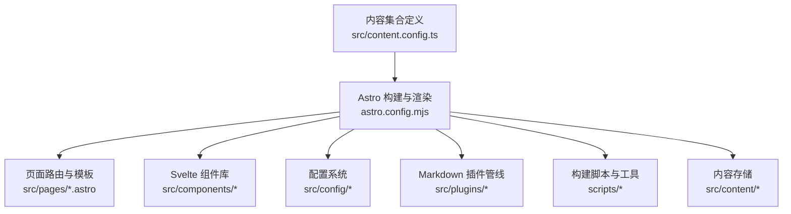
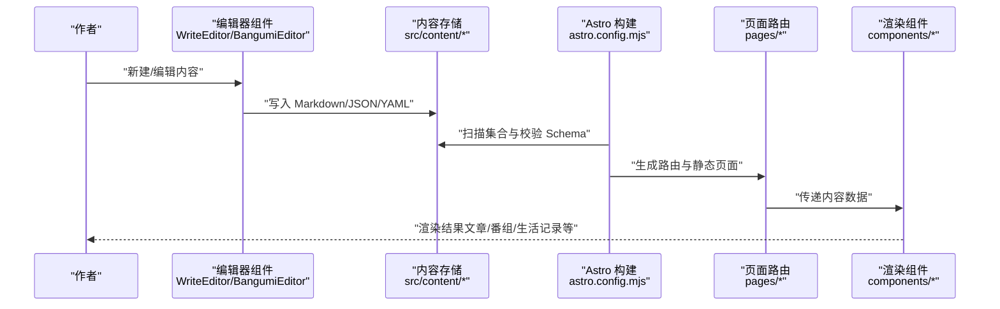
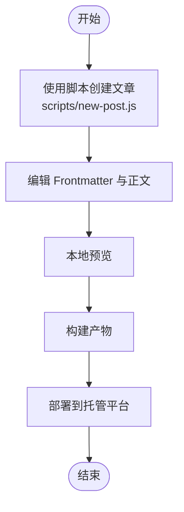
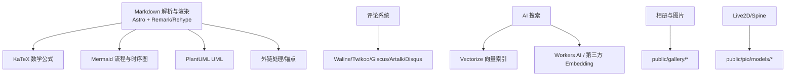

# 内容管理

<cite>
**本文档引用的文件**
- [content.config.ts](file://src/content.config.ts)
- [astro.config.mjs](file://astro.config.mjs)
- [package.json](file://package.json)
- [README.md](file://README.md)
- [CONTRIBUTING.md](file://CONTRIBUTING.md)
- [posts 示例：encrypted-post.md](file://src/content/posts/encrypted-post.md)
- [posts 示例：draft.md](file://src/content/posts/draft.md)
- [posts 示例：markdown-tutorial.md](file://src/content/posts/markdown-tutorial.md)
- [spec 示例：friends.mdx](file://src/content/spec/friends.mdx)
- [spec 示例：guestbook.md](file://src/content/spec/guestbook.md)
- [spec 示例：privacy.md](file://src/content/spec/privacy.md)
- [bangumi 示例：anime/你的名字.md](file://src/content/bangumi/anime/你的名字.md)
- [bangumi 示例：music/一生所爱.md](file://src/content/bangumi/music/一生所爱.md)
- [life 示例：moments/想法2026-5-10.md](file://src/content/moments/想法2026-5-10.md)
- [life 示例：notebooks/_index.json](file://src/content/life/notebooks/_index.json)
- [life 示例：places/2026-04-17.md](file://src/content/life/places/2026-04-17.md)
- [life 示例：routines/noon-rest.md](file://src/content/life/routines/noon-rest.md)
- [changelog 示例：2026-05-15-music-local.md](file://src/content/changelog/2026-05-15-music-local.md)
- [scripts/new-post.js](file://scripts/new-post.js)
- [scripts/build-vectorize-index.js](file://scripts/build-vectorize-index.js)
- [src/config/siteConfig.ts](file://src/config/siteConfig.ts)
- [src/config/aiSearchConfig.ts](file://src/config/aiSearchConfig.ts)
- [src/config/collectionsApiConfig.ts](file://src/config/collectionsApiConfig.ts)
- [src/config/commentConfig.ts](file://src/config/commentConfig.ts)
- [src/config/galleryConfig.ts](file://src/config/galleryConfig.ts)
- [src/config/friendsConfig.ts](file://src/config/friendsConfig.ts)
- [src/config/musicConfig.ts](file://src/config/musicConfig.ts)
- [src/config/pioConfig.ts](file://src/config/pioConfig.ts)
- [src/config/sponsorConfig.ts](file://src/config/sponsorConfig.ts)
- [src/config/calendarConfig.ts](file://src/config/calendarConfig.ts)
- [src/config/homePortfolioShutterConfig.ts](file://src/config/homePortfolioShutterConfig.ts)
- [src/config/licenseConfig.ts](file://src/config/licenseConfig.ts)
- [src/config/footerConfig.ts](file://src/config/footerConfig.ts)
- [src/config/coverImageConfig.ts](file://src/config/coverImageConfig.ts)
- [src/config/expressiveCodeConfig.ts](file://src/config/expressiveCodeConfig.ts)
- [src/config/plantumlConfig.ts](file://src/config/plantumlConfig.ts)
- [src/config/skillsConfig.ts](file://src/config/skillsConfig.ts)
- [src/config/backgroundWallpaper.ts](file://src/config/backgroundWallpaper.ts)
- [src/config/adConfig.ts](file://src/config/adConfig.ts)
- [src/config/announcementConfig.ts](file://src/config/announcementConfig.ts)
- [src/config/navBarConfig.ts](file://src/config/navBarConfig.ts)
- [src/config/sidebarConfig.ts](file://src/config/sidebarConfig.ts)
- [src/config/profileConfig.ts](file://src/config/profileConfig.ts)
- [src/config/sitemap.ts](file://src/config/sitemap.ts)
- [src/plugins/remark-mermaid.js](file://src/plugins/remark-mermaid.js)
- [src/plugins/remark-plantuml.js](file://src/plugins/remark-plantuml.js)
- [src/plugins/remark-excerpt.js](file://src/plugins/remark-excerpt.js)
- [src/plugins/remark-image-grid.js](file://src/plugins/remark-image-grid.js)
- [src/plugins/remark-reading-time.mjs](file://src/plugins/remark-reading-time.mjs)
- [src/plugins/remark-directive-rehype.js](file://src/plugins/remark-directive-rehype.js)
- [src/plugins/rehype-mermaid.mjs](file://src/plugins/rehype-mermaid.mjs)
- [src/plugins/rehype-plantuml.mjs](file://src/plugins/rehype-plantuml.mjs)
- [src/plugins/rehype-figure.mjs](file://src/plugins/rehype-figure.mjs)
- [src/plugins/rehype-external-links.mjs](file://src/plugins/rehype-external-links.mjs)
- [src/plugins/rehype-email-protection.mjs](file://src/plugins/rehype-email-protection.mjs)
- [src/plugins/rehype-component-github-card.mjs](file://src/plugins/rehype-component-github-card.mjs)
- [src/plugins/rehype-autolink-headings.mjs](file://src/plugins/rehype-autolink-headings.mjs)
- [src/pages/posts/[...slug].astro](file://src/pages/posts/[...slug].astro)
- [src/pages/bangumi/[...slug].astro](file://src/pages/bangumi/[...slug].astro)
- [src/pages/bangumi/index.astro](file://src/pages/bangumi/index.astro)
- [src/pages/admin/index.astro](file://src/pages/admin/index.astro)
- [src/pages/admin/bangumi.astro](file://src/pages/admin/bangumi.astro)
- [src/pages/admin/moments.astro](file://src/pages/admin/moments.astro)
- [src/pages/admin/notebooks.astro](file://src/pages/admin/notebooks.astro)
- [src/pages/admin/friends.astro](file://src/pages/admin/friends.astro)
- [src/components/edit/WriteEditor.svelte](file://src/components/edit/WriteEditor.svelte)
- [src/components/edit/BangumiEditor.svelte](file://src/components/edit/BangumiEditor.svelte)
- [src/components/edit/MomentsEditor.svelte](file://src/components/edit/MomentsEditor.svelte)
- [src/components/edit/NotebooksEditor.svelte](file://src/components/edit/NotebooksEditor.svelte)
- [src/components/edit/FriendsEditor.svelte](file://src/components/edit/FriendsEditor.svelte)
- [src/components/features/GuestbookDataProvider.svelte](file://src/components/features/GuestbookDataProvider.svelte)
- [src/components/features/FriendCard.astro](file://src/components/features/FriendCard.astro)
- [src/components/features/MusicPlayer.astro](file://src/components/features/MusicPlayer.astro)
- [src/components/features/Live2DWidget.astro](file://src/components/features/Live2DWidget.astro)
- [src/components/features/SpineModel.astro](file://src/components/features/SpineModel.astro)
- [src/components/common/Pagination.astro](file://src/components/common/Pagination.astro)
- [src/components/common/Markdown.astro](file://src/components/common/Markdown.astro)
- [src/components/layout/PostPage.astro](file://src/components/layout/PostPage.astro)
- [src/components/layout/PostCard.astro](file://src/components/layout/PostCard.astro)
- [src/components/layout/PostMeta.astro](file://src/components/layout/PostMeta.astro)
- [src/components/layout/CategoryBar.astro](file://src/components/layout/CategoryBar.astro)
- [src/components/layout/Navbar.astro](file://src/components/layout/Navbar.astro)
- [src/components/layout/Footer.astro](file://src/components/layout/Footer.astro)
- [src/components/widget/Tags.astro](file://src/components/widget/Tags.astro)
- [src/components/widget/TagBubble.astro](file://src/components/widget/TagBubble.astro)
- [src/components/widget/TagCardWall.astro](file://src/components/widget/TagCardWall.astro)
- [src/components/widget/TagGraph.astro](file://src/components/widget/TagGraph.astro)
- [src/components/widget/TagWordcloud.astro](file://src/components/widget/TagWordcloud.astro)
- [src/components/widget/ArchiveHeatmap.astro](file://src/components/widget/ArchiveHeatmap.astro)
- [src/components/widget/PostHeatmap.astro](file://src/components/widget/PostHeatmap.astro)
- [src/components/widget/Calendar.astro](file://src/components/widget/Calendar.astro)
- [src/components/widget/Profile.astro](file://src/components/widget/Profile.astro)
- [src/components/widget/SidebarTOC.astro](file://src/components/widget/SidebarTOC.astro)
- [src/components/misc/SharePoster.svelte](file://src/components/misc/SharePoster.svelte)
- [src/components/misc/RecommendedPost.astro](file://src/components/misc/RecommendedPost.astro)
- [src/components/misc/KatexManager.astro](file://src/components/misc/KatexManager.astro)
- [src/components/misc/FancyboxManager.astro](file://src/components/misc/FancyboxManager.astro)
- [src/components/misc/EncryptedPost.astro](file://src/components/misc/EncryptedPost.astro)
- [src/components/misc/Live2DWidget.astro](file://src/components/misc/Live2DWidget.astro)
- [src/components/misc/SpineModel.astro](file://src/components/misc/SpineModel.astro)
- [src/components/misc/MusicManager.astro](file://src/components/misc/MusicManager.astro)
- [src/components/misc/PageLoader.astro](file://src/components/misc/PageLoader.astro)
- [src/components/misc/VisitorCount.astro](file://src/components/misc/VisitorCount.astro)
- [src/components/misc/PrivacyModal.astro](file://src/components/misc/PrivacyModal.astro)
- [src/components/misc/Advertisement.astro](file://src/components/misc/Advertisement.astro)
- [src/components/misc/Announcement.astro](file://src/components/misc/Announcement.astro)
- [src/components/misc/License.astro](file://src/components/misc/License.astro)
- [src/components/misc/PostFooterActions.astro](file://src/components/misc/PostFooterActions.astro)
- [src/components/misc/SharePoster.svelte](file://src/components/misc/SharePoster.svelte)
- [src/components/misc/PostFooterActions.astro](file://src/components/misc/PostFooterActions.astro)
- [src/components/misc/PrivacyModal.astro](file://src/components/misc/PrivacyModal.astro)
- [src/components/misc/Advertisement.astro](file://src/components/misc/Advertisement.astro)
- [src/components/misc/Announcement.astro](file://src/components/misc/Announcement.astro)
- [src/components/misc/License.astro](file://src/components/misc/License.astro)
- [src/components/misc/PostFooterActions.astro](file://src/components/misc/PostFooterActions.astro)
- [src/components/misc/PrivacyModal.astro](file://src/components/misc/PrivacyModal.astro)
- [src/components/misc/Advertisement.astro](file://src/components/misc/Advertisement.astro)
- [src/components/misc/Announcement.astro](file://src/components/misc/Announcement.astro)
- [src/components/misc/License.astro](file://src/components/misc/License.astro)
- [src/components/misc/PostFooterActions.astro](file://src/components/misc/PostFooterActions.astro)
- [src/components/misc/PrivacyModal.astro](file://src/components/misc/PrivacyModal.astro)
- [src/components/misc/Advertisement.astro](file://src/components/misc/Advertisement.astro)
- [src/components/misc/Announcement.astro](file://src/components/misc/Announcement.astro)
- [src/components/misc/License.astro](file://src/components/misc/License.astro)
- [src/components/misc/PostFooterActions.astro](file://src/components/misc/PostFooterActions.astro)
- [src/components/misc/PrivacyModal.astro](file://src/components/misc/PrivacyModal.astro)
- [src/components/misc/Advertisement.astro](file://src/components/misc/Advertisement.astro)
- [src/components/misc/Announcement.astro](file://src/components/misc/Announcement.astro)
- [src/components/misc/License.astro](file://src/components/misc/License.astro)
- [src/components/misc/PostFooterActions.astro](file://src/components/misc/PostFooterActions.astro)
- [src/components/misc/PrivacyModal.astro](file://src/components/misc/PrivacyModal.astro)
- [src/components/misc/Advertisement.astro](file://src/components/misc/Advertisement.astro)
- [src/components/misc/Announcement.astro](file://src/components/misc/Announcement.astro)
- [src/components/misc/License.astro](file://src/components/misc/License.astro)
- [src/components/misc/PostFooterActions.astro](file://src/components/misc/PostFooterActions.astro)
- [src/components/misc/PrivacyModal.astro](file://src/components/misc/PrivacyModal.astro)
- [src/components/misc/Advertisement.astro](file://src/components/misc/Advertisement.astro)
- [src/components/misc/Announcement.astro](file://src/components/misc/Announcement.astro)
- [src/components/misc/License.astro](file://src/components/misc/License.astro)
- [src/components/misc/PostFooterActions.astro](file://src/components/misc/PostFooterActions.astro)
- [src/components/misc/PrivacyModal.astro](file://src/components/misc/PrivacyModal.astro)
- [src/components/misc/Advertisement.astro](file://src/components/misc/Advertisement.astro)
- [src/components/misc/Announcement.astro](......)
</cite>

## 目录
1. [简介](#简介)
2. [项目结构](#项目结构)
3. [核心组件](#核心组件)
4. [架构总览](#架构总览)
5. [详细组件分析](#详细组件分析)
6. [依赖关系分析](#依赖关系分析)
7. [性能考量](#性能考量)
8. [故障排除指南](#故障排除指南)
9. [结论](#结论)
10. [附录](#附录)

## 简介
本文件面向 Firefly-Mod 的内容管理系统，系统性阐述基于 Astro Content Collections 的内容组织与管理实践。内容覆盖：
- Astro Content Collections 的集合定义、加载与校验机制
- Markdown 内容的 Frontmatter 字段规范、元数据与分类体系
- 不同类型内容的存储位置与管理方式（文章、特殊页面、番组、生活记录等）
- 内容创建、编辑、发布工作流程
- 版本管理、草稿处理与发布策略
- SEO 优化、元数据与社交媒体分享配置
- 内容迁移、批量处理与自动化工具
- 内容质量检查与审核流程

## 项目结构
Firefly-Mod 采用 Astro 6.x + Svelte 5 + Tailwind CSS 4 的静态站点生成架构。内容管理的核心由以下部分组成：
- 内容集合定义：在内容配置文件中集中定义各集合的加载器与 Schema 校验
- Markdown 插件管线：在 Astro 配置中统一声明 Remark/Rehype 插件，实现数学公式、Mermaid、PlantUML、外链处理、锚点生成等增强能力
- 页面路由与渲染：通过 Astro 页面组件与 Svelte 组件组合，实现内容展示、分页、标签云、归档等
- 配置系统：集中于 src/config，涵盖站点、评论、音乐、Live2D/Spine、相册、友链、赞助、日历、首页作品百叶窗、技能标签、背景壁纸、广告、公告、封面图、代码块渲染、PlantUML、收藏 API、AI 搜索等

图表来源
- [content.config.ts:1-185](file://src/content.config.ts#L1-L185)
- [astro.config.mjs:1-307](file://astro.config.mjs#L1-L307)

章节来源
- [README.md:199-226](file://README.md#L199-L226)
- [astro.config.mjs:47-307](file://astro.config.mjs#L47-L307)
- [content.config.ts:1-185](file://src/content.config.ts#L1-L185)

## 核心组件
本节聚焦内容集合的定义与校验，以及与之配套的页面渲染与编辑组件。

- 内容集合与加载器
  - posts：Markdown/MDX 文章，支持草稿、置顶、标签、分类、作者、来源链接、许可证、评论开关、排序等字段
  - spec：特殊页面（如关于、友链、留言簿、隐私政策），不强制字段
  - moments：生活随笔，支持作者、头像、置顶、发布时间、图片数组、标签、地点、设备等
  - bangumi：番组数据，支持书籍/动漫/音乐/游戏/现实分类、状态、评分、音乐特有字段等
  - life：生活记录通用集合，支持标签、计划、笔记、地点、完成状态等
  - notebooks：笔记本集合，支持封面、摘要、标签、日期等
  - routines：日常例行事项集合
  - changelog：变更日志，支持版本、日期、类型、描述等

- 页面与编辑组件
  - 文章详情页：通过 slug 路由加载对应内容并渲染
  - 番组页：支持按分类/状态筛选与卡片展示
  - 管理后台：提供 Bangumi、Moments、Notebooks、Friends 等编辑器
  - 渲染组件：Markdown 解析、分页、标签云、归档、音乐播放器、Live2D/Spine 看板娘等

章节来源
- [content.config.ts:5-184](file://src/content.config.ts#L5-L184)
- [astro.config.mjs:182-237](file://astro.config.mjs#L182-L237)
- [src/pages/posts/[...slug].astro](file://src/pages/posts/[...slug].astro)
- [src/pages/bangumi/[...slug].astro](file://src/pages/bangumi/[...slug].astro)
- [src/pages/admin/index.astro](file://src/pages/admin/index.astro)
- [src/components/edit/BangumiEditor.svelte](file://src/components/edit/BangumiEditor.svelte)
- [src/components/edit/MomentsEditor.svelte](file://src/components/edit/MomentsEditor.svelte)
- [src/components/edit/NotebooksEditor.svelte](file://src/components/edit/NotebooksEditor.svelte)
- [src/components/edit/FriendsEditor.svelte](file://src/components/edit/FriendsEditor.svelte)

## 架构总览
内容从“写入”到“渲染”的整体流程如下：

图表来源
- [content.config.ts:1-185](file://src/content.config.ts#L1-L185)
- [astro.config.mjs:47-307](file://astro.config.mjs#L47-L307)
- [src/pages/posts/[...slug].astro](file://src/pages/posts/[...slug].astro)
- [src/pages/bangumi/[...slug].astro](file://src/pages/bangumi/[...slug].astro)
- [src/components/edit/WriteEditor.svelte](file://src/components/edit/WriteEditor.svelte)

## 详细组件分析

### 内容集合与字段规范
- posts 集合
  - 关键字段：标题、发布时间、可选更新时间、草稿标记、描述、封面图、标签数组、分类、语言、置顶、作者、来源链接、许可证名称/URL、评论开关、排序、内部 prev/next 标识
  - 草稿策略：通过草稿标记控制是否参与构建
  - 排序与置顶：通过 order 与 pinned 实现首页优先展示
  - 示例参考：加密文章、草稿、Markdown 教程等

- moments 集合
  - 关键字段：作者、头像、置顶、发布时间、图片数组（支持字符串或 image() 类型）、标签、地点、设备
  - 适用场景：生活随笔、照片墙、短记录

- bangumi 集合
  - 关键字段：标题、中文名、分类（书籍/动漫/音乐/游戏/现实）、子分类（电影/电视剧/动漫/纪录片）、状态（1-5 数值映射）、封面图、链接、评分、评论、标签、发布时间、音乐特有字段（艺术家、音频/歌词链接、Meting 服务器与 ID）
  - 数据来源：Markdown/YAML/YML，支持多格式混合

- life 集合
  - 关键字段：标签、计划目标（日/月）、签到日期数组、笔记本字段（名称、封面、摘要、条目数、更新时间）、地点字段（省/市/经纬度/体验/访问次数）、完成状态、遗留兼容字段（饮水杯数、餐食记录、连击/进度）
  - 适用场景：日记、计划、地点、笔记本元数据

- notebooks 集合
  - 关键字段：名称、封面、摘要、图片（字符串或数组）、标签、日期
  - 适用场景：笔记本实体的元数据与封面

- routines 集合
  - 关键字段：名称、时间、描述、图标、颜色、更新时间
  - 适用场景：日常例行事项卡片

- changelog 集合
  - 关键字段：版本、日期、可选时间、类型（功能/改进/修复/移除）、描述
  - 适用场景：站点更新日志

章节来源
- [content.config.ts:5-184](file://src/content.config.ts#L5-L184)
- [posts 示例：encrypted-post.md](file://src/content/posts/encrypted-post.md)
- [posts 示例：draft.md](file://src/content/posts/draft.md)
- [posts 示例：markdown-tutorial.md](file://src/content/posts/markdown-tutorial.md)
- [bangumi 示例：anime/你的名字.md](file://src/content/bangumi/anime/你的名字.md)
- [bangumi 示例：music/一生所爱.md](file://src/content/bangumi/music/一生所爱.md)
- [life 示例：moments/想法2026-5-10.md](file://src/content/moments/想法2026-5-10.md)
- [life 示例：notebooks/_index.json](file://src/content/life/notebooks/_index.json)
- [life 示例：places/2026-04-17.md](file://src/content/life/places/2026-04-17.md)
- [life 示例：routines/noon-rest.md](file://src/content/life/routines/noon-rest.md)
- [changelog 示例：2026-05-15-music-local.md](file://src/content/changelog/2026-05-15-music-local.md)

### Markdown 内容组织与 Frontmatter 规范
- 统一的 Markdown 插件管线
  - 解析阶段（Remark）：数学公式、阅读时长、图片网格、摘要、指令、分段、指令节点解析、Mermaid、PlantUML
  - HTML 转换阶段（Rehype）：KaTeX、提示框、标题锚点、Mermaid、PlantUML、figure 包裹、外链处理、邮箱保护、组件注入、自动锚点
- Frontmatter 字段建议
  - 文章类：标题、发布时间、可选更新时间、草稿、描述、封面图、标签、分类、语言、置顶、作者、来源链接、许可证、评论开关、排序
  - 生活随笔：作者、头像、置顶、发布时间、图片数组、标签、地点、设备
  - 番组：标题、中文名、分类、子分类、状态、封面图、链接、评分、评论、标签、发布时间、音乐特有字段
  - 生活记录：标签、计划目标、签到、笔记本元数据、地点、完成状态
  - 特殊页面：无固定字段，按页面需求定义
- 内容分类体系
  - 分类字段用于文章归类，结合标签实现细粒度筛选
  - 番组按分类与状态双重维度管理
  - 生活记录按笔记本、地点、例行事项等维度组织

章节来源
- [astro.config.mjs:182-237](file://astro.config.mjs#L182-L237)
- [README.md:200-214](file://README.md#L200-L214)
- [content.config.ts:7-31](file://src/content.config.ts#L7-L31)
- [content.config.ts:40-55](file://src/content.config.ts#L40-L55)
- [content.config.ts:62-84](file://src/content.config.ts#L62-L84)
- [content.config.ts:88-131](file://src/content.config.ts#L88-L131)

### 存储位置与管理方式
- 文章内容：src/content/posts/
- 特殊页面：src/content/spec/
- 番组数据：src/content/bangumi/（支持 md/mdx/yaml/yml）
- 生活记录：src/content/life/（含 notebooks、places、routines、moments）
- 变更日志：src/content/changelog/

章节来源
- [README.md:199-226](file://README.md#L199-L226)
- [content.config.ts:5-184](file://src/content.config.ts#L5-L184)

### 内容创建、编辑与发布工作流程
- 创建新文章
  - 使用脚本快速生成文章骨架
  - 在 Frontmatter 中填写必要字段
  - 在正文编写内容，必要时使用数学公式、Mermaid、PlantUML 等扩展
- 编辑与预览
  - 使用管理后台编辑器（Bangumi、Moments、Notebooks、Friends）
  - 通过本地开发服务器实时预览
- 发布
  - 本地构建与预览
  - 部署至静态托管平台（Cloudflare Pages/Vercel/Netlify 等）

图表来源
- [package.json:13-13](file://package.json#L13-L13)
- [scripts/new-post.js](file://scripts/new-post.js)
- [astro.config.mjs:47-307](file://astro.config.mjs#L47-L307)

章节来源
- [README.md:32-82](file://README.md#L32-L82)
- [package.json:13-13](file://package.json#L13-L13)
- [scripts/new-post.js](file://scripts/new-post.js)

### 版本管理、草稿处理与发布策略
- 草稿处理
  - 通过草稿标记控制内容是否参与构建
  - 草稿文章仅在本地可见，发布前需移除草稿标记
- 版本管理
  - 使用变更日志集合记录版本、类型与描述
  - 结合 Git 标签与发布说明进行版本发布
- 发布策略
  - 本地构建后进行全站预览，确认无误后再部署
  - 部署后可通过 AI 搜索与全文搜索进行内容检索验证

章节来源
- [content.config.ts:11-11](file://src/content.config.ts#L11-L11)
- [changelog 示例：2026-05-15-music-local.md](file://src/content/changelog/2026-05-15-music-local.md)
- [README.md:126-136](file://README.md#L126-L136)

### SEO 优化、元数据与社交媒体分享
- SEO 与元数据
  - 站点 URL、页面开关与 sitemap 过滤在站点配置中统一管理
  - 标题锚点、外链处理、邮箱保护等插件增强 SEO 友好性
- 社交媒体分享
  - 提供分享海报组件，便于生成社交分享图
  - 页面支持 Open Graph 图片生成路由

章节来源
- [astro.config.mjs:155-179](file://astro.config.mjs#L155-L179)
- [src/config/siteConfig.ts](file://src/config/siteConfig.ts)
- [src/components/misc/SharePoster.svelte](file://src/components/misc/SharePoster.svelte)
- [src/pages/og/[...slug].png.ts](file://src/pages/og/[...slug].png.ts)

### 内容迁移、批量处理与自动化工具
- 内容迁移
  - 通过集合 Schema 的 image() 类型与数组字段，支持图片迁移与封面图统一管理
  - YAML/YML 格式支持与现有番组数据平滑迁移
- 批量处理
  - 使用脚本生成文章骨架，减少重复劳动
  - 构建向量索引脚本支持增量与全量重建
- 自动化工具
  - CI/CD 工作流：类型检查、Lint、友链可达性巡检、AI 响应与审查
  - 部署：Cloudflare Pages 一键部署，支持环境变量与 KV/Vectorize 绑定

章节来源
- [content.config.ts:46-50](file://src/content.config.ts#L46-L50)
- [content.config.ts:59-61](file://src/content.config.ts#L59-L61)
- [package.json:13-18](file://package.json#L13-L18)
- [scripts/build-vectorize-index.js](file://scripts/build-vectorize-index.js)
- [README.md:126-136](file://README.md#L126-L136)

### 内容质量检查与审核流程
- 质量检查
  - 使用 Astro 类型检查与 Biome Lint 保证代码与配置质量
  - 提交前执行类型检查与格式化
- 审核流程
  - 重大改动建议先开 Issue 讨论
  - 采用约定式提交，保持历史清晰
  - CI 工作流自动执行质量检查与巡检任务

章节来源
- [README.md:126-136](file://README.md#L126-L136)
- [CONTRIBUTING.md:7-20](file://CONTRIBUTING.md#L7-L20)

## 依赖关系分析
内容管理涉及的外部依赖与集成点：
- Markdown 解析与渲染：Astro + Remark/Rehype 插件生态
- 代码块渲染：Expressive Code 主题与插件
- 数学公式：KaTeX
- 流程图/时序图：Mermaid
- UML：PlantUML
- 外链与锚点：外链处理、标题锚点、自动锚点
- 评论系统：Waline/Twikoo/Giscus/Artalk/Disqus
- Live2D/Spine：看板娘模型与渲染
- 相册：图片存储与封面管理
- AI 搜索：Cloudflare Vectorize 向量索引与 Workers AI

图表来源
- [astro.config.mjs:182-237](file://astro.config.mjs#L182-L237)
- [src/config/commentConfig.ts](file://src/config/commentConfig.ts)
- [src/config/aiSearchConfig.ts](file://src/config/aiSearchConfig.ts)
- [src/config/pioConfig.ts](file://src/config/pioConfig.ts)
- [src/config/galleryConfig.ts](file://src/config/galleryConfig.ts)

章节来源
- [astro.config.mjs:182-237](file://astro.config.mjs#L182-L237)
- [README.md:149-150](file://README.md#L149-L150)

## 性能考量
- 构建优化
  - Rollup 分包策略：将 KaTeX、Mermaid、Live2D、GSAP、AI 搜索、留言板、日历等模块拆分为独立 chunk，提升缓存命中率
  - Tree-shaking 与最小化：移除 console 与 debugger，CSS/JS 最小化
- 图像优化
  - Astro 图像优化配置，全局约束布局
- 代码块渲染
  - Expressive Code 主题与插件按需启用，减少不必要的渲染开销
- 搜索与索引
  - Pagefind 客户端全文搜索，构建时生成索引
  - AI 搜索向量索引支持增量重建，降低构建成本

章节来源
- [astro.config.mjs:256-304](file://astro.config.mjs#L256-L304)
- [astro.config.mjs:54-57](file://astro.config.mjs#L54-L57)
- [package.json:9-18](file://package.json#L9-L18)

## 故障排除指南
- 构建失败
  - 检查内容集合 Schema 是否符合要求（如日期、枚举、数组等）
  - 确认 Frontmatter 字段拼写与类型正确
- Markdown 渲染异常
  - 检查 Remark/Rehype 插件顺序与配置
  - 确认自定义组件（如 GitHub 卡片）正确注册
- 评论系统不可用
  - 检查评论配置与后端部署状态
- AI 搜索索引问题
  - 确认 Vectorize 索引名称与维度配置一致
  - 检查 API 密钥与账户 ID 环境变量
- Live2D/Spine 模型加载失败
  - 检查模型文件路径与权限
  - 确认看板娘配置与模型文件匹配

章节来源
- [content.config.ts:1-185](file://src/content.config.ts#L1-L185)
- [astro.config.mjs:182-237](file://astro.config.mjs#L182-L237)
- [src/config/commentConfig.ts](file://src/config/commentConfig.ts)
- [src/config/aiSearchConfig.ts](file://src/config/aiSearchConfig.ts)
- [src/config/pioConfig.ts](file://src/config/pioConfig.ts)

## 结论
Firefly-Mod 的内容管理以 Astro Content Collections 为核心，结合完善的 Markdown 插件管线与丰富的前端组件，实现了从内容创作、编辑、校验到渲染发布的完整闭环。通过明确的字段规范、分类体系与自动化工具，能够高效支撑文章、番组、生活记录等多种内容形态的管理与发布。建议在实际使用中遵循本文档的规范与流程，确保内容质量与发布效率。

## 附录
- 常用命令
  - 开发：pnpm dev
  - 构建：pnpm build
  - 预览：pnpm preview
  - 类型检查：pnpm check / pnpm type-check
  - 格式化与 Lint：pnpm format / pnpm lint
  - 新建文章：pnpm new-post <filename>
  - 重新生成图标：pnpm icons
  - 构建/更新 AI 搜索向量索引：pnpm build-index
- 配置文件一览
  - 站点配置：siteConfig.ts
  - 评论配置：commentConfig.ts
  - 音乐配置：musicConfig.ts
  - Live2D/Spine 配置：pioConfig.ts
  - 相册配置：galleryConfig.ts
  - 友链配置：friendsConfig.ts
  - 赞助配置：sponsorConfig.ts
  - 日历配置：calendarConfig.ts
  - 首页作品百叶窗配置：homePortfolioShutterConfig.ts
  - 技能标签配置：skillsConfig.ts
  - 背景壁纸配置：backgroundWallpaper.ts
  - 广告配置：adConfig.ts
  - 公告配置：announcementConfig.ts
  - 封面图配置：coverImageConfig.ts
  - 代码块渲染配置：expressiveCodeConfig.ts
  - PlantUML 配置：plantumlConfig.ts
  - 收藏 API 配置：collectionsApiConfig.ts
  - AI 搜索配置：aiSearchConfig.ts
  - 导航栏配置：navBarConfig.ts
  - 侧边栏配置：sidebarConfig.ts
  - 个人信息配置：profileConfig.ts
  - 站点地图配置：sitemap.ts

章节来源
- [README.md:68-82](file://README.md#L68-L82)
- [README.md:85-115](file://README.md#L85-L115)