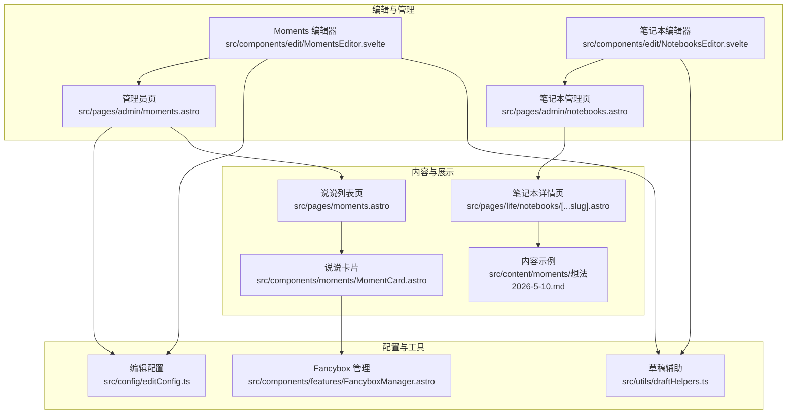
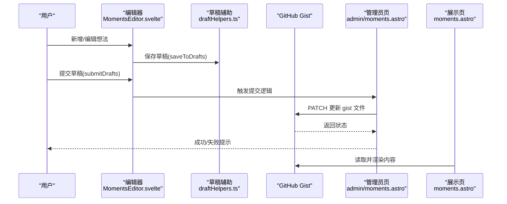
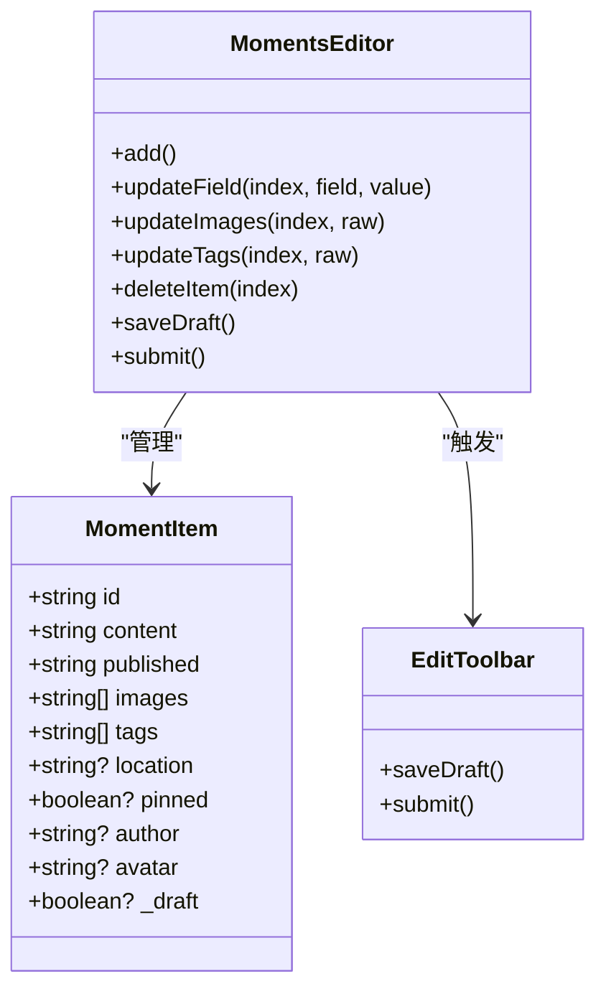
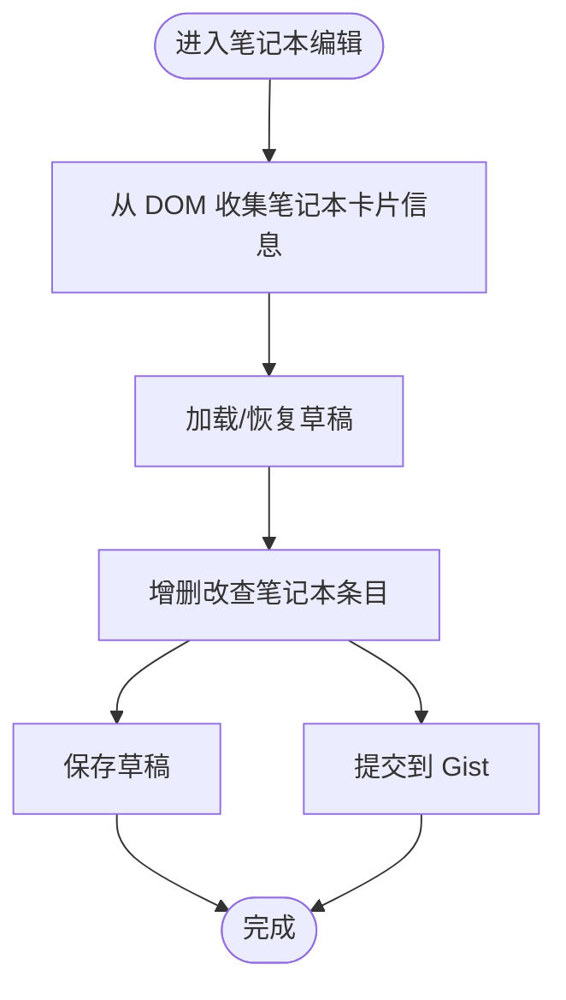
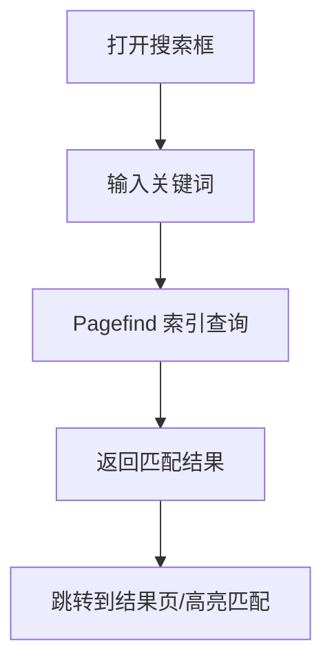
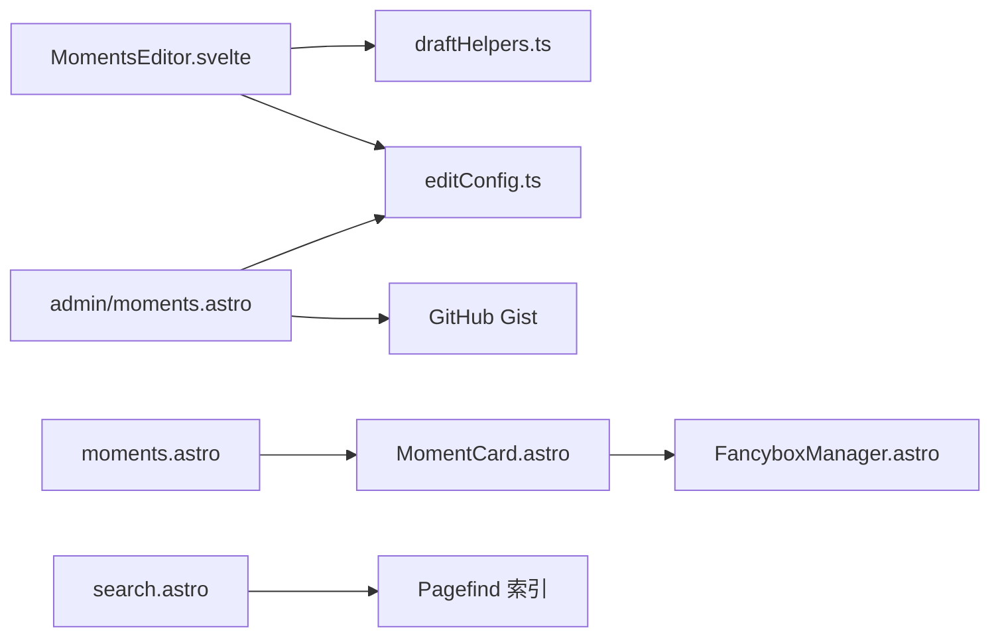

# 想法内容管理

<cite>
**本文引用的文件**
- [src/components/edit/MomentsEditor.svelte](file://src/components/edit/MomentsEditor.svelte)
- [src/pages/admin/moments.astro](file://src/pages/admin/moments.astro)
- [src/components/edit/MomentItemEditor.svelte](file://src/components/edit/MomentItemEditor.svelte)
- [src/components/edit/EditToolbar.svelte](file://src/components/edit/EditToolbar.svelte)
- [src/components/moments/MomentCard.astro](file://src/components/moments/MomentCard.astro)
- [src/pages/moments.astro](file://src/pages/moments.astro)
- [src/content/moments/想法2026-5-10.md](file://src/content/moments/想法2026-5-10.md)
- [src/pages/admin/notebooks.astro](file://src/pages/admin/notebooks.astro)
- [src/components/edit/NotebooksEditor.svelte](file://src/components/edit/NotebooksEditor.svelte)
- [src/pages/life/notebooks/[...slug].astro](file://src/pages/life/notebooks/[...slug].astro)
- [src/utils/draftHelpers.ts](file://src/utils/draftHelpers.ts)
- [src/config/editConfig.ts](file://src/config/editConfig.ts)
- [src/components/features/FancyboxManager.astro](file://src/components/features/FancyboxManager.astro)
- [src/plugins/remark-mermaid.js](file://src/plugins/remark-mermaid.js)
- [src/plugins/remark-plantuml.js](file://src/plugins/remark-plantuml.js)
- [src/plugins/remark-image-grid.js](file://src/plugins/remark-image-grid.js)
- [src/plugins/remark-directive-rehype.js](file://src/plugins/remark-directive-rehype.js)
- [src/plugins/remark-excerpt.js](file://src/plugins/remark-excerpt.js)
- [src/plugins/remark-reading-time.mjs](file://src/plugins/remark-reading-time.mjs)
- [src/workers/ai-chat.js](file://src/workers/ai-chat.js)
- [src/workers/github-proxy.js](file://src/workers/github-proxy.js)
- [src/workers/guestbook.js](file://src/workers/guestbook.js)
- [src/workers/utils/rate-limit.js](file://src/workers/utils/rate-limit.js)
- [src/workers/utils/streaming.js](file://src/workers/utils/streaming.js)
- [src/components/common/Markdown.astro](file://src/components/common/Markdown.astro)
- [src/components/common/Search.svelte](file://src/components/common/Search.svelte)
- [src/components/common/SearchModal.svelte](file://src/components/common/SearchModal.svelte)
- [src/pages/search.astro](file://src/pages/search.astro)
- [pagefind.yml](file://pagefind.yml)
</cite>

## 目录
1. [简介](#简介)
2. [项目结构](#项目结构)
3. [核心组件](#核心组件)
4. [架构总览](#架构总览)
5. [详细组件分析](#详细组件分析)
6. [依赖关系分析](#依赖关系分析)
7. [性能考量](#性能考量)
8. [故障排查指南](#故障排查指南)
9. [结论](#结论)
10. [附录](#附录)

## 简介
本文件面向 Firefly-Mod 的“想法内容”管理场景，系统性梳理该博客系统中“想法/灵感/思考片段/创意草稿”的采集、编辑、组织、检索与分享路径。当前仓库中与“想法内容”最贴近的是“说说（Moments）”与“笔记本（Notebooks）”两条主线：
- 说说（Moments）：以轻量、碎片化的形式记录灵感与思考片段，支持文本、图片、标签、位置、作者信息等元数据，并可通过 GitHub Gist 实现云端草稿与提交。
- 笔记本（Notebooks）：以本地内容集合的形式承载更系统的“想法草稿/随笔”，并可与远程 Gist 笔记本联动展示。

本文将围绕以下主题展开：内容形态与存储结构、时间戳与标签管理、创建与编辑流程、检索与回顾、导出与分享、长期保存与版本策略。

## 项目结构
与“想法内容”管理直接相关的前端与内容层分布如下：
- 编辑器与页面
  - 说说编辑器与管理页：src/components/edit/MomentsEditor.svelte、src/pages/admin/moments.astro
  - 说说卡片渲染：src/components/moments/MomentCard.astro、src/pages/moments.astro
  - 笔记本编辑器与管理页：src/components/edit/NotebooksEditor.svelte、src/pages/admin/notebooks.astro
  - 笔记本详情页：src/pages/life/notebooks/[...slug].astro
- 内容与配置
  - 说说内容示例：src/content/moments/想法2026-5-10.md
  - 编辑配置：src/config/editConfig.ts
  - 草稿辅助：src/utils/draftHelpers.ts
- 媒体与富文本插件
  - 图片预览与画廊：src/components/features/FancyboxManager.astro
  - Markdown 扩展插件：remark-* 系列
- 搜索与索引
  - 页面内搜索：src/components/common/Search.svelte、src/components/common/SearchModal.svelte、src/pages/search.astro
  - 全局索引：pagefind.yml

图表来源
- [src/components/edit/MomentsEditor.svelte:1-612](file://src/components/edit/MomentsEditor.svelte#L1-L612)
- [src/pages/admin/moments.astro:847-879](file://src/pages/admin/moments.astro#L847-L879)
- [src/components/edit/NotebooksEditor.svelte:1-80](file://src/components/edit/NotebooksEditor.svelte#L1-L80)
- [src/pages/admin/notebooks.astro:1-40](file://src/pages/admin/notebooks.astro#L1-L40)
- [src/components/moments/MomentCard.astro:1-240](file://src/components/moments/MomentCard.astro#L1-L240)
- [src/pages/moments.astro:108-153](file://src/pages/moments.astro#L108-L153)
- [src/pages/life/notebooks/[...slug].astro](file://src/pages/life/notebooks/[...slug].astro#L150-L178)
- [src/content/moments/想法2026-5-10.md:1-10](file://src/content/moments/想法2026-5-10.md#L1-L10)
- [src/config/editConfig.ts](file://src/config/editConfig.ts)
- [src/utils/draftHelpers.ts](file://src/utils/draftHelpers.ts)
- [src/components/features/FancyboxManager.astro:1-120](file://src/components/features/FancyboxManager.astro#L1-L120)

章节来源
- [src/components/edit/MomentsEditor.svelte:1-612](file://src/components/edit/MomentsEditor.svelte#L1-L612)
- [src/pages/admin/moments.astro:847-879](file://src/pages/admin/moments.astro#L847-L879)
- [src/components/edit/NotebooksEditor.svelte:1-80](file://src/components/edit/NotebooksEditor.svelte#L1-L80)
- [src/pages/admin/notebooks.astro:1-40](file://src/pages/admin/notebooks.astro#L1-L40)
- [src/components/moments/MomentCard.astro:1-240](file://src/components/moments/MomentCard.astro#L1-L240)
- [src/pages/moments.astro:108-153](file://src/pages/moments.astro#L108-L153)
- [src/pages/life/notebooks/[...slug].astro](file://src/pages/life/notebooks/[...slug].astro#L150-L178)
- [src/content/moments/想法2026-5-10.md:1-10](file://src/content/moments/想法2026-5-10.md#L1-L10)
- [src/config/editConfig.ts](file://src/config/editConfig.ts)
- [src/utils/draftHelpers.ts](file://src/utils/draftHelpers.ts)
- [src/components/features/FancyboxManager.astro:1-120](file://src/components/features/FancyboxManager.astro#L1-L120)

## 核心组件
- 说说（Moments）编辑与管理
  - 编辑器负责新增、编辑、删除、草稿保存、批量提交，支持图片 URL 列表、标签、位置、作者等字段。
  - 管理员页通过 GitHub Gist 接口进行持久化，支持草稿与提交流程。
- 笔记本（Notebooks）编辑与管理
  - 编辑器从 DOM 提取笔记本封面、名称、摘要、条目数、更新时间等信息，支持草稿与提交。
  - 管理页与详情页分别承担列表与内容展示，支持本地与远程笔记本联动。
- 内容与展示
  - 说说卡片渲染 Markdown 内容，支持图片画廊与外部链接预览。
  - 内容示例展示 Front Matter 字段（作者、头像、发布时间、标签、位置）。
- 搜索与索引
  - 页面内搜索组件与全局 Pagefind 索引共同实现内容检索。

章节来源
- [src/components/edit/MomentsEditor.svelte:1-612](file://src/components/edit/MomentsEditor.svelte#L1-L612)
- [src/pages/admin/moments.astro:847-879](file://src/pages/admin/moments.astro#L847-L879)
- [src/components/edit/NotebooksEditor.svelte:1-80](file://src/components/edit/NotebooksEditor.svelte#L1-L80)
- [src/pages/admin/notebooks.astro:1-40](file://src/pages/admin/notebooks.astro#L1-L40)
- [src/components/moments/MomentCard.astro:1-240](file://src/components/moments/MomentCard.astro#L1-L240)
- [src/pages/moments.astro:108-153](file://src/pages/moments.astro#L108-L153)
- [src/pages/life/notebooks/[...slug].astro](file://src/pages/life/notebooks/[...slug].astro#L150-L178)
- [src/content/moments/想法2026-5-10.md:1-10](file://src/content/moments/想法2026-5-10.md#L1-L10)
- [src/components/common/Search.svelte](file://src/components/common/Search.svelte)
- [src/components/common/SearchModal.svelte](file://src/components/common/SearchModal.svelte)
- [src/pages/search.astro](file://src/pages/search.astro)
- [pagefind.yml](file://pagefind.yml)

## 架构总览
“想法内容”的端到端流程由“编辑—草稿—提交—展示—检索”构成。编辑器通过草稿辅助模块将变更暂存于本地，随后统一提交至 GitHub Gist；展示层从 Gist 或本地内容集合读取并渲染；搜索层提供多维检索能力。

图表来源
- [src/components/edit/MomentsEditor.svelte:418-457](file://src/components/edit/MomentsEditor.svelte#L418-L457)
- [src/utils/draftHelpers.ts](file://src/utils/draftHelpers.ts)
- [src/pages/admin/moments.astro:847-879](file://src/pages/admin/moments.astro#L847-L879)
- [src/pages/moments.astro:108-153](file://src/pages/moments.astro#L108-L153)

## 详细组件分析

### 说说（Moments）编辑与工作流
- 数据模型
  - 字段：id、content、published（ISO 时间）、images（URL 数组）、tags（字符串数组）、location、pinned、author、avatar。
  - 草稿标记：_draft，用于标识本地临时草稿。
- 创建与编辑
  - 新增：生成带前缀的唯一 id，插入到非置顶项之后，进入编辑态。
  - 编辑：逐字段更新，支持图片与标签的多值输入。
  - 删除：确认预览后移除，维护编辑索引。
- 草稿与提交
  - 保存草稿：清洗空值，调用草稿辅助模块持久化。
  - 提交：统一清洗后提交至 Gist，提交完成后刷新页面。
- 展示与交互
  - 卡片渲染 Markdown 内容，支持图片画廊与外部链接预览。
  - 管理页按时间排序，支持空态提示与评论区挂载。

图表来源
- [src/components/edit/MomentsEditor.svelte:19-612](file://src/components/edit/MomentsEditor.svelte#L19-L612)
- [src/components/edit/EditToolbar.svelte:185-225](file://src/components/edit/EditToolbar.svelte#L185-L225)

章节来源
- [src/components/edit/MomentsEditor.svelte:351-457](file://src/components/edit/MomentsEditor.svelte#L351-L457)
- [src/components/edit/MomentItemEditor.svelte:1-140](file://src/components/edit/MomentItemEditor.svelte#L1-L140)
- [src/components/edit/EditToolbar.svelte:185-225](file://src/components/edit/EditToolbar.svelte#L185-L225)
- [src/pages/admin/moments.astro:847-879](file://src/pages/admin/moments.astro#L847-L879)
- [src/components/moments/MomentCard.astro:140-200](file://src/components/moments/MomentCard.astro#L140-L200)
- [src/pages/moments.astro:108-153](file://src/pages/moments.astro#L108-L153)

### 笔记本（Notebooks）编辑与组织
- 数据模型
  - 字段：id、folderName、name、summary、cover、entries、updatedAt。
  - 草稿标记：_draft、_deleted，便于批量处理。
- 收集与渲染
  - 从 DOM 卡片提取封面、标题、描述、条目数、更新时间等信息，生成笔记本列表。
  - 支持从远程 Gist 笔记本联动展示。
- 管理与提交
  - 与说说一致的草稿与提交流程，通过编辑工具栏触发。

图表来源
- [src/components/edit/NotebooksEditor.svelte:55-80](file://src/components/edit/NotebooksEditor.svelte#L55-L80)
- [src/pages/admin/notebooks.astro:1-40](file://src/pages/admin/notebooks.astro#L1-L40)
- [src/pages/life/notebooks/[...slug].astro](file://src/pages/life/notebooks/[...slug].astro#L150-L178)

章节来源
- [src/components/edit/NotebooksEditor.svelte:1-80](file://src/components/edit/NotebooksEditor.svelte#L1-L80)
- [src/pages/admin/notebooks.astro:1-40](file://src/pages/admin/notebooks.astro#L1-L40)
- [src/pages/life/notebooks/[...slug].astro](file://src/pages/life/notebooks/[...slug].astro#L150-L178)

### 内容存储与组织
- 说说内容示例
  - 使用 Front Matter 定义作者、头像、发布时间、标签、位置等元数据，正文为 Markdown。
- 笔记本内容
  - 本地内容集合通过 Astro 内容目录管理，支持远程 Gist 笔记本联动。
- 时间戳与标签
  - 时间戳：published 字段为 ISO 字符串，便于排序与筛选。
  - 标签：tags 为字符串数组，支持多标签分类。
- 媒体附件
  - images 字段为 URL 数组，配合图片画廊与外部链接预览。

章节来源
- [src/content/moments/想法2026-5-10.md:1-10](file://src/content/moments/想法2026-5-10.md#L1-L10)
- [src/components/moments/MomentCard.astro:170-200](file://src/components/moments/MomentCard.astro#L170-L200)
- [src/components/features/FancyboxManager.astro:1-120](file://src/components/features/FancyboxManager.astro#L1-L120)

### 检索与回顾
- 页面内搜索
  - Search.svelte 与 SearchModal.svelte 提供弹窗式搜索入口，search.astro 承载结果页。
- 全局索引
  - pagefind.yml 配置 Pagefind 索引范围，覆盖内容与页面。
- 时间线与标签过滤
  - 说说列表按 published 排序，标签作为筛选维度；笔记本详情页按日期与条目组织。

图表来源
- [src/components/common/Search.svelte](file://src/components/common/Search.svelte)
- [src/components/common/SearchModal.svelte](file://src/components/common/SearchModal.svelte)
- [src/pages/search.astro](file://src/pages/search.astro)
- [pagefind.yml](file://pagefind.yml)

章节来源
- [src/components/common/Search.svelte](file://src/components/common/Search.svelte)
- [src/components/common/SearchModal.svelte](file://src/components/common/SearchModal.svelte)
- [src/pages/search.astro](file://src/pages/search.astro)
- [pagefind.yml](file://pagefind.yml)

### 导出与分享
- Markdown 导出
  - 通过编辑器的草稿与提交流程，将内容以 JSON 形式持久化至 Gist，可视为“结构化导出”；如需纯 Markdown，可在本地内容集合中提取并导出。
- 社交分享
  - 说说卡片支持外部链接预览与图片画廊，便于复制链接分享。
- 打印输出
  - 展示页基于 Markdown 渲染，可利用浏览器打印功能输出。

章节来源
- [src/components/moments/MomentCard.astro:140-200](file://src/components/moments/MomentCard.astro#L140-L200)
- [src/components/common/Markdown.astro](file://src/components/common/Markdown.astro)

### 长期保存与版本管理
- 草稿与提交
  - 草稿辅助模块提供本地草稿保存与批量提交，避免丢失。
- 版本与历史
  - 依托 GitHub Gist 的版本历史，可追溯每次提交的变更。
- 迁移与清理
  - 建议定期将重要想法导出为本地 Markdown 文件归档；对不再使用的标签与图片，可在编辑时清理。

章节来源
- [src/utils/draftHelpers.ts](file://src/utils/draftHelpers.ts)
- [src/components/edit/MomentsEditor.svelte:418-457](file://src/components/edit/MomentsEditor.svelte#L418-L457)
- [src/pages/admin/moments.astro:847-879](file://src/pages/admin/moments.astro#L847-L879)

## 依赖关系分析
- 组件耦合
  - 编辑器与草稿辅助模块松耦合，通过统一接口保存与提交。
  - 管理员页与编辑器通过事件与配置协作，实现跨页面的数据同步。
- 外部依赖
  - GitHub Gist 作为持久化后端，编辑器与管理员页均依赖其 API。
  - Pagefind 作为静态索引服务，提升检索性能。
- 循环依赖
  - 未见明显循环依赖；编辑器与展示页通过数据流单向传递。

图表来源
- [src/components/edit/MomentsEditor.svelte:1-612](file://src/components/edit/MomentsEditor.svelte#L1-L612)
- [src/utils/draftHelpers.ts](file://src/utils/draftHelpers.ts)
- [src/config/editConfig.ts](file://src/config/editConfig.ts)
- [src/pages/admin/moments.astro:847-879](file://src/pages/admin/moments.astro#L847-L879)
- [src/pages/moments.astro:108-153](file://src/pages/moments.astro#L108-L153)
- [src/components/moments/MomentCard.astro:1-240](file://src/components/moments/MomentCard.astro#L1-L240)
- [src/components/features/FancyboxManager.astro:1-120](file://src/components/features/FancyboxManager.astro#L1-L120)
- [src/pages/search.astro](file://src/pages/search.astro)
- [pagefind.yml](file://pagefind.yml)

章节来源
- [src/components/edit/MomentsEditor.svelte:1-612](file://src/components/edit/MomentsEditor.svelte#L1-L612)
- [src/pages/admin/moments.astro:847-879](file://src/pages/admin/moments.astro#L847-L879)
- [src/components/moments/MomentCard.astro:1-240](file://src/components/moments/MomentCard.astro#L1-L240)
- [src/pages/moments.astro:108-153](file://src/pages/moments.astro#L108-L153)
- [src/components/features/FancyboxManager.astro:1-120](file://src/components/features/FancyboxManager.astro#L1-L120)
- [src/pages/search.astro](file://src/pages/search.astro)
- [pagefind.yml](file://pagefind.yml)

## 性能考量
- 索引与渲染
  - Pagefind 索引减少前端检索开销；Markdown 渲染与图片懒加载结合，优化首屏。
- 编辑体验
  - 草稿本地保存降低网络请求频率；批量提交减少 Gist API 调用次数。
- 媒体资源
  - 图片画廊与外部链接预览建议控制尺寸与数量，避免阻塞渲染。

## 故障排查指南
- 提交失败
  - 检查 GitHub Token 与 Gist ID 配置；确认网络连通性；查看管理员页提示信息。
- 草稿未恢复
  - 确认本地存储可用；检查草稿键名与页面键名一致。
- 图片无法显示
  - 检查图片 URL 是否有效；确认跨域访问权限；使用画廊组件预览外部图片。
- 搜索无结果
  - 确认 Pagefind 已构建且索引包含目标内容；检查搜索词拼写与大小写。

章节来源
- [src/pages/admin/moments.astro:847-879](file://src/pages/admin/moments.astro#L847-L879)
- [src/components/edit/EditToolbar.svelte:185-225](file://src/components/edit/EditToolbar.svelte#L185-L225)
- [src/components/features/FancyboxManager.astro:1-120](file://src/components/features/FancyboxManager.astro#L1-L120)
- [pagefind.yml](file://pagefind.yml)

## 结论
本系统以“说说（Moments）+ 笔记本（Notebooks）”为核心，结合草稿与 Gist 提交、Markdown 渲染与 Pagefind 索引，形成一套完整的“想法内容”采集、整理与回顾体系。通过清晰的数据模型、可控的编辑流程与稳定的外部依赖，既能满足快速记录与碎片化思考，也能支撑后续的系统化整理与长期保存。

## 附录
- 相关插件与扩展
  - Mermaid、PlantUML、图片网格、指令重写、摘要与阅读时长等插件增强内容表达与可读性。
- 工作线程
  - AI 聊天、GitHub 代理与访客簿等 Worker 提升交互与集成能力。

章节来源
- [src/plugins/remark-mermaid.js](file://src/plugins/remark-mermaid.js)
- [src/plugins/remark-plantuml.js](file://src/plugins/remark-plantuml.js)
- [src/plugins/remark-image-grid.js](file://src/plugins/remark-image-grid.js)
- [src/plugins/remark-directive-rehype.js](file://src/plugins/remark-directive-rehype.js)
- [src/plugins/remark-excerpt.js](file://src/plugins/remark-excerpt.js)
- [src/plugins/remark-reading-time.mjs](file://src/plugins/remark-reading-time.mjs)
- [src/workers/ai-chat.js](file://src/workers/ai-chat.js)
- [src/workers/github-proxy.js](file://src/workers/github-proxy.js)
- [src/workers/guestbook.js](file://src/workers/guestbook.js)
- [src/workers/utils/rate-limit.js](file://src/workers/utils/rate-limit.js)
- [src/workers/utils/streaming.js](file://src/workers/utils/streaming.js)