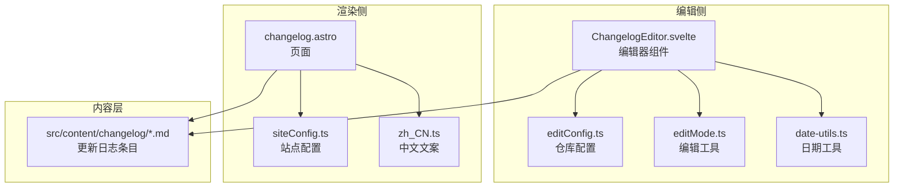
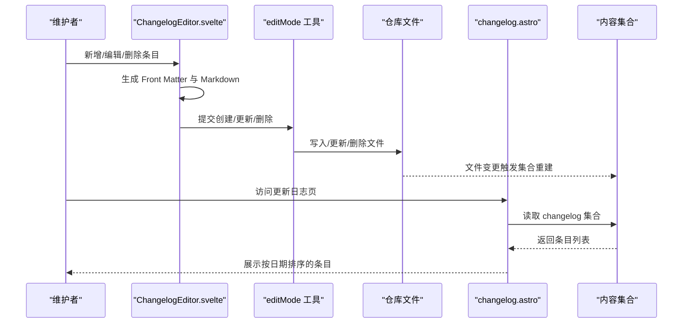
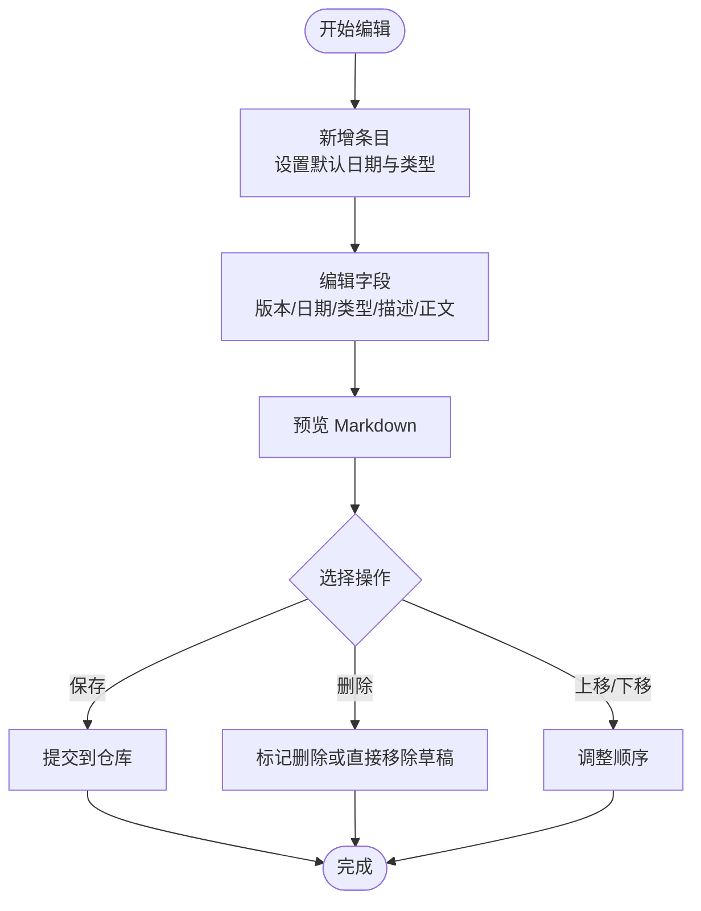
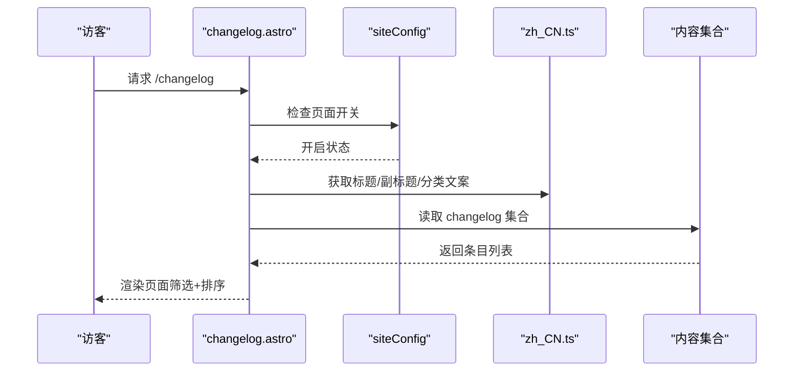
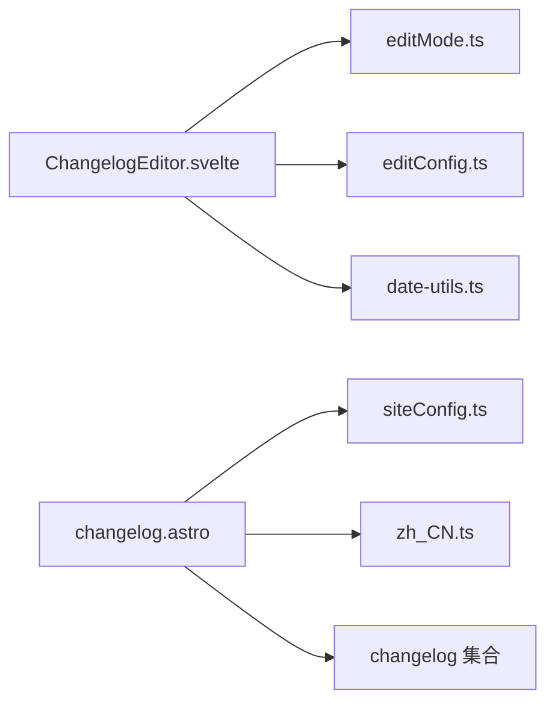

# 更新日志管理

<cite>
**本文引用的文件**
- [src/components/edit/ChangelogEditor.svelte](file://src/components/edit/ChangelogEditor.svelte)
- [src/pages/changelog.astro](file://src/pages/changelog.astro)
- [src/i18n/languages/zh_CN.ts](file://src/i18n/languages/zh_CN.ts)
- [src/config/editConfig.ts](file://src/config/editConfig.ts)
- [src/utils/editMode.ts](file://src/utils/editMode.ts)
- [src/content/changelog/2026-05-15-music-local.md](file://src/content/changelog/2026-05-15-music-local.md)
- [src/config/siteConfig.ts](file://src/config/siteConfig.ts)
- [src/utils/date-utils.ts](file://src/utils/date-utils.ts)
</cite>

## 目录
1. [简介](#简介)
2. [项目结构](#项目结构)
3. [核心组件](#核心组件)
4. [架构总览](#架构总览)
5. [详细组件分析](#详细组件分析)
6. [依赖关系分析](#依赖关系分析)
7. [性能考虑](#性能考虑)
8. [故障排除指南](#故障排除指南)
9. [结论](#结论)
10. [附录](#附录)

## 简介
本文件系统性梳理 Firefly-Mod 的更新日志（Changelog）管理方案，覆盖格式规范、版本管理策略、内容结构、自动化与手动编辑流程、发布与展示机制、历史对比与变更追踪、SEO 最佳实践以及用户反馈收集建议。目标是帮助维护者高效、一致地维护更新日志，同时提升用户体验与可发现性。

## 项目结构
更新日志功能由“编辑器组件 + 页面渲染 + 内容存储 + 配置与国际化”构成，核心路径如下：
- 编辑器组件：负责条目增删改、预览、提交到仓库
- 页面渲染：从内容集合读取并展示更新日志
- 内容存储：Markdown 文件按约定命名存放在内容目录
- 配置与国际化：页面开关、标题副标题、分类标签文案本地化
- 工具模块：编辑模式工具、仓库操作、日期工具

图示来源
- [src/components/edit/ChangelogEditor.svelte:1-351](file://src/components/edit/ChangelogEditor.svelte#L1-L351)
- [src/pages/changelog.astro:1-130](file://src/pages/changelog.astro#L1-L130)
- [src/config/editConfig.ts:1-200](file://src/config/editConfig.ts#L1-L200)
- [src/utils/editMode.ts:1-200](file://src/utils/editMode.ts#L1-L200)
- [src/utils/date-utils.ts:1-200](file://src/utils/date-utils.ts#L1-L200)
- [src/config/siteConfig.ts:1-200](file://src/config/siteConfig.ts#L1-L200)
- [src/i18n/languages/zh_CN.ts:1-100](file://src/i18n/languages/zh_CN.ts#L1-L100)

章节来源
- [src/components/edit/ChangelogEditor.svelte:1-351](file://src/components/edit/ChangelogEditor.svelte#L1-L351)
- [src/pages/changelog.astro:1-130](file://src/pages/changelog.astro#L1-L130)
- [src/config/editConfig.ts:1-200](file://src/config/editConfig.ts#L1-L200)
- [src/utils/editMode.ts:1-200](file://src/utils/editMode.ts#L1-L200)
- [src/utils/date-utils.ts:1-200](file://src/utils/date-utils.ts#L1-L200)
- [src/config/siteConfig.ts:1-200](file://src/config/siteConfig.ts#L1-L200)
- [src/i18n/languages/zh_CN.ts:1-100](file://src/i18n/languages/zh_CN.ts#L1-L100)

## 核心组件
- 更新日志编辑器（ChangelogEditor.svelte）
  - 支持新增、编辑、删除、上下移动、预览、提交
  - 条目字段：版本号、日期、类型、描述、正文
  - 类型选项：新功能、改进、修复、移除
  - 提交时生成 Markdown Front Matter 并写入仓库
- 更新日志页面（changelog.astro）
  - 读取内容集合，按日期倒序展示
  - 分类筛选：全部、新功能、改进、修复、移除
  - 国际化标题、副标题与文案
- 内容存储
  - 文件命名：YYYY-MM-DD-简述.md
  - Front Matter 字段：version、date、type、description
- 配置与国际化
  - 页面开关、页面名称、分类标签文案本地化
- 工具模块
  - 仓库操作：读取、创建、更新、删除文件
  - 日期工具：默认日期生成、格式化

章节来源
- [src/components/edit/ChangelogEditor.svelte:21-40](file://src/components/edit/ChangelogEditor.svelte#L21-L40)
- [src/pages/changelog.astro:9-53](file://src/pages/changelog.astro#L9-L53)
- [src/i18n/languages/zh_CN.ts:27-31](file://src/i18n/languages/zh_CN.ts#L27-L31)
- [src/config/editConfig.ts:1-200](file://src/config/editConfig.ts#L1-L200)
- [src/utils/editMode.ts:1-200](file://src/utils/editMode.ts#L1-L200)
- [src/utils/date-utils.ts:1-200](file://src/utils/date-utils.ts#L1-L200)

## 架构总览
更新日志的端到端流程分为“编辑侧”和“渲染侧”，二者通过内容集合与仓库文件协同工作。

图示来源
- [src/components/edit/ChangelogEditor.svelte:333-368](file://src/components/edit/ChangelogEditor.svelte#L333-L368)
- [src/utils/editMode.ts:1-200](file://src/utils/editMode.ts#L1-L200)
- [src/pages/changelog.astro:13-120](file://src/pages/changelog.astro#L13-L120)

## 详细组件分析

### 更新日志编辑器（ChangelogEditor.svelte）
- 数据模型与字段
  - id、slug、version、date、type、description、body、sha、_draft、_deleted
- 类型分类
  - 新功能、改进、修复、移除；对应图标与颜色
- 关键行为
  - 新增条目：自动填充今日日期，默认类型为改进
  - 删除条目：草稿直接移除；正式条目标记删除
  - 上下移动：调整显示顺序
  - 预览：基于 marked 渲染
  - 提交：根据是否已有 slug 判断创建或更新；删除则按 sha 删除
- 文件生成
  - 依据字段生成 YAML Front Matter 与正文
  - 文件路径：src/content/changelog/{slug}.md

图示来源
- [src/components/edit/ChangelogEditor.svelte:290-306](file://src/components/edit/ChangelogEditor.svelte#L290-L306)
- [src/components/edit/ChangelogEditor.svelte:333-368](file://src/components/edit/ChangelogEditor.svelte#L333-L368)
- [src/components/edit/ChangelogEditor.svelte:249-288](file://src/components/edit/ChangelogEditor.svelte#L249-L288)

章节来源
- [src/components/edit/ChangelogEditor.svelte:21-40](file://src/components/edit/ChangelogEditor.svelte#L21-L40)
- [src/components/edit/ChangelogEditor.svelte:290-306](file://src/components/edit/ChangelogEditor.svelte#L290-L306)
- [src/components/edit/ChangelogEditor.svelte:318-331](file://src/components/edit/ChangelogEditor.svelte#L318-L331)
- [src/components/edit/ChangelogEditor.svelte:333-368](file://src/components/edit/ChangelogEditor.svelte#L333-L368)
- [src/components/edit/ChangelogEditor.svelte:249-288](file://src/components/edit/ChangelogEditor.svelte#L249-L288)

### 更新日志页面（changelog.astro）
- 页面开关与标题
  - 通过站点配置控制页面是否启用
  - 标题、副标题来自国际化键值
- 内容读取与展示
  - 读取 changelog 内容集合
  - 按日期倒序排列
  - 分类筛选：全部、新功能、改进、修复、移除
- 无数据提示
  - 使用国际化文案提示暂无数据

图示来源
- [src/pages/changelog.astro:9-53](file://src/pages/changelog.astro#L9-L53)
- [src/pages/changelog.astro:13-120](file://src/pages/changelog.astro#L13-L120)
- [src/i18n/languages/zh_CN.ts:27-31](file://src/i18n/languages/zh_CN.ts#L27-L31)
- [src/config/siteConfig.ts:1-200](file://src/config/siteConfig.ts#L1-L200)

章节来源
- [src/pages/changelog.astro:9-53](file://src/pages/changelog.astro#L9-L53)
- [src/pages/changelog.astro:13-120](file://src/pages/changelog.astro#L13-L120)
- [src/i18n/languages/zh_CN.ts:27-31](file://src/i18n/languages/zh_CN.ts#L27-L31)
- [src/config/siteConfig.ts:1-200](file://src/config/siteConfig.ts#L1-L200)

### 内容结构与命名规范
- 文件命名
  - YYYY-MM-DD-简述.md
  - 示例：2026-05-15-music-local.md
- Front Matter 字段
  - version：版本号字符串
  - date：发布日期（YYYY-MM-DD）
  - type：类型（feature/improvement/fix/removal）
  - description：可选描述
- 正文
  - 使用 Markdown 格式记录变更详情

章节来源
- [src/content/changelog/2026-05-15-music-local.md:1-50](file://src/content/changelog/2026-05-15-music-local.md#L1-L50)
- [src/components/edit/ChangelogEditor.svelte:318-331](file://src/components/edit/ChangelogEditor.svelte#L318-L331)

### 版本管理策略
- 版本号定义
  - 使用语义化版本或自定义版本字符串，由维护者在编辑器中填写
- 日期命名规则
  - 采用 ISO 8601 日期格式（YYYY-MM-DD），用于文件名与 Front Matter
- 变更类型分类
  - feature：新增功能
  - improvement：改进
  - fix：修复问题
  - removal：移除或废弃项
- 排序与展示
  - 页面按日期倒序展示，确保最新条目优先可见

章节来源
- [src/components/edit/ChangelogEditor.svelte:35-40](file://src/components/edit/ChangelogEditor.svelte#L35-L40)
- [src/pages/changelog.astro:13-120](file://src/pages/changelog.astro#L13-L120)

### 自动生成与手动编辑流程
- 自动生成
  - 编辑器在新增条目时自动填充日期与默认类型
  - 提交时自动生成 Front Matter 与 Markdown 内容
- 手动编辑
  - 可直接在仓库中修改 Markdown 文件
  - 通过编辑器进行预览与批量操作
- 内容验证
  - 类型必须为允许值之一
  - version 与 date 不能为空
- 发布策略
  - 提交后由内容集合重建触发页面更新
  - 支持草稿与正式条目区分，删除时可选择物理删除或标记删除

章节来源
- [src/components/edit/ChangelogEditor.svelte:290-306](file://src/components/edit/ChangelogEditor.svelte#L290-L306)
- [src/components/edit/ChangelogEditor.svelte:333-368](file://src/components/edit/ChangelogEditor.svelte#L333-L368)
- [src/utils/editMode.ts:1-200](file://src/utils/editMode.ts#L1-L200)

### 维护与管理最佳实践
- 内容组织
  - 保持每个条目聚焦单一变更，便于检索与回溯
  - 使用清晰的描述字段，必要时在正文中补充技术细节
- 标签与分类
  - 严格使用内置类型，避免自定义类型导致筛选失效
- SEO 优化
  - 在 description 中提供简洁摘要，有助于搜索引擎理解页面主题
  - 页面标题与副标题使用明确关键词
- 用户体验
  - 保持日期与版本号一致性
  - 对破坏性变更（removal）提供迁移指引或替代方案

章节来源
- [src/i18n/languages/zh_CN.ts:27-31](file://src/i18n/languages/zh_CN.ts#L27-L31)
- [src/components/edit/ChangelogEditor.svelte:35-40](file://src/components/edit/ChangelogEditor.svelte#L35-L40)

### 展示方式与用户通知
- 展示方式
  - 页面支持分类筛选与全文阅读
  - 无数据时显示友好提示
- 用户通知
  - 编辑器在删除操作时给出确认与提示
  - 页面加载失败或无数据时提供明确文案

章节来源
- [src/pages/changelog.astro:120-130](file://src/pages/changelog.astro#L120-L130)
- [src/components/edit/ChangelogEditor.svelte:249-262](file://src/components/edit/ChangelogEditor.svelte#L249-L262)

### 历史版本对比、变更追踪与反馈收集
- 历史版本对比
  - 通过仓库文件历史查看具体变更
  - 建议在提交信息中使用统一前缀（如 chore(changelog): ）
- 变更追踪
  - 按日期倒序展示，便于追踪最新进展
  - 分类筛选快速定位特定类型变更
- 用户反馈
  - 建议在页面底部或评论区收集用户对变更的反馈
  - 结合站点统计与分析服务评估变更影响

章节来源
- [src/components/edit/ChangelogEditor.svelte:85-90](file://src/components/edit/ChangelogEditor.svelte#L85-L90)
- [src/pages/changelog.astro:13-120](file://src/pages/changelog.astro#L13-L120)

## 依赖关系分析
- 组件耦合
  - ChangelogEditor 依赖 editMode 工具与仓库配置
  - changelog 页面依赖站点配置与国际化资源
- 外部依赖
  - marked 用于 Markdown 预览
  - 仓库 API 用于文件读写与删除
- 潜在风险
  - 若 Front Matter 字段缺失或类型不合法，可能导致页面渲染异常
  - 删除操作需谨慎，避免误删正式条目

图示来源
- [src/components/edit/ChangelogEditor.svelte:1-30](file://src/components/edit/ChangelogEditor.svelte#L1-L30)
- [src/pages/changelog.astro:1-53](file://src/pages/changelog.astro#L1-L53)
- [src/config/editConfig.ts:1-200](file://src/config/editConfig.ts#L1-L200)
- [src/utils/editMode.ts:1-200](file://src/utils/editMode.ts#L1-L200)
- [src/utils/date-utils.ts:1-200](file://src/utils/date-utils.ts#L1-L200)
- [src/config/siteConfig.ts:1-200](file://src/config/siteConfig.ts#L1-L200)
- [src/i18n/languages/zh_CN.ts:1-100](file://src/i18n/languages/zh_CN.ts#L1-L100)

章节来源
- [src/components/edit/ChangelogEditor.svelte:1-30](file://src/components/edit/ChangelogEditor.svelte#L1-L30)
- [src/pages/changelog.astro:1-53](file://src/pages/changelog.astro#L1-L53)
- [src/config/editConfig.ts:1-200](file://src/config/editConfig.ts#L1-L200)
- [src/utils/editMode.ts:1-200](file://src/utils/editMode.ts#L1-L200)
- [src/utils/date-utils.ts:1-200](file://src/utils/date-utils.ts#L1-L200)
- [src/config/siteConfig.ts:1-200](file://src/config/siteConfig.ts#L1-L200)
- [src/i18n/languages/zh_CN.ts:1-100](file://src/i18n/languages/zh_CN.ts#L1-L100)

## 性能考虑
- 页面渲染
  - changelog 集合按日期倒序，避免前端二次排序
- 编辑体验
  - 预览使用客户端渲染，注意长文本的渲染开销
- 存储与提交
  - 批量提交时尽量合并多次操作，减少仓库写入次数

## 故障排除指南
- 提交失败
  - 检查仓库配置与权限
  - 确认 Front Matter 字段完整且类型合法
- 删除误操作
  - 使用“标记删除”而非直接删除，便于恢复
- 页面不显示
  - 确认站点配置中页面开关已开启
  - 检查内容集合是否正确构建

章节来源
- [src/utils/editMode.ts:1-200](file://src/utils/editMode.ts#L1-L200)
- [src/components/edit/ChangelogEditor.svelte:249-262](file://src/components/edit/ChangelogEditor.svelte#L249-L262)
- [src/pages/changelog.astro:9-13](file://src/pages/changelog.astro#L9-L13)

## 结论
本方案以“编辑器 + 页面 + 内容集合 + 配置与国际化”为核心，形成闭环的更新日志管理体系。通过严格的命名与 Front Matter 规范、清晰的类型分类、完善的提交与删除流程，以及友好的展示与筛选能力，既满足维护效率，也兼顾用户体验与可发现性。建议在团队内统一规范，持续优化提交信息与描述质量，以增强历史追踪与用户沟通效果。

## 附录
- 示例文件
  - [2026-05-15-music-local.md:1-50](file://src/content/changelog/2026-05-15-music-local.md#L1-L50)
- 相关实现参考
  - [ChangelogEditor.svelte:1-351](file://src/components/edit/ChangelogEditor.svelte#L1-L351)
  - [changelog.astro:1-130](file://src/pages/changelog.astro#L1-L130)
  - [editConfig.ts:1-200](file://src/config/editConfig.ts#L1-L200)
  - [editMode.ts:1-200](file://src/utils/editMode.ts#L1-L200)
  - [date-utils.ts:1-200](file://src/utils/date-utils.ts#L1-L200)
  - [siteConfig.ts:1-200](file://src/config/siteConfig.ts#L1-L200)
  - [zh_CN.ts:27-31](file://src/i18n/languages/zh_CN.ts#L27-L31)