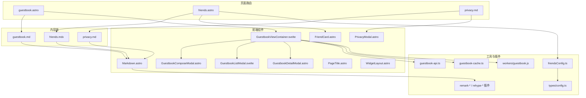
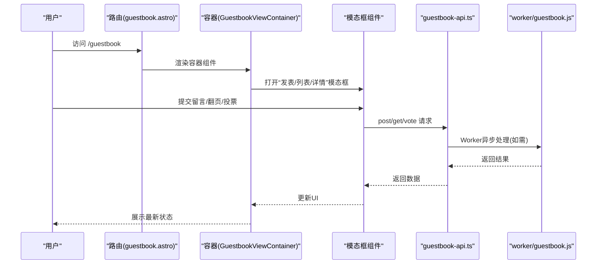
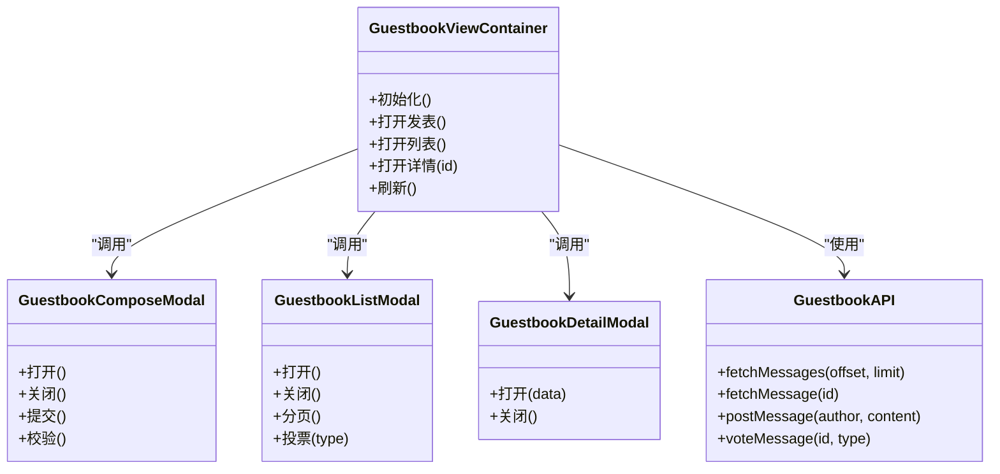
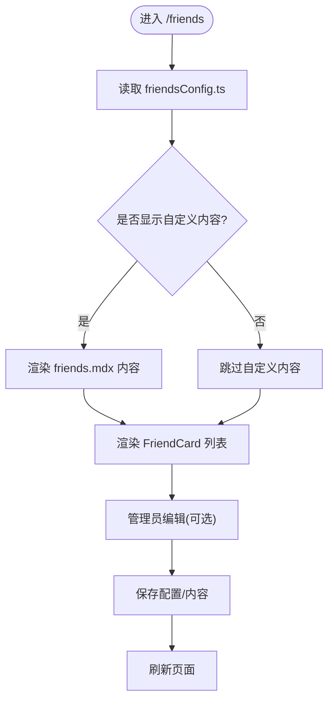
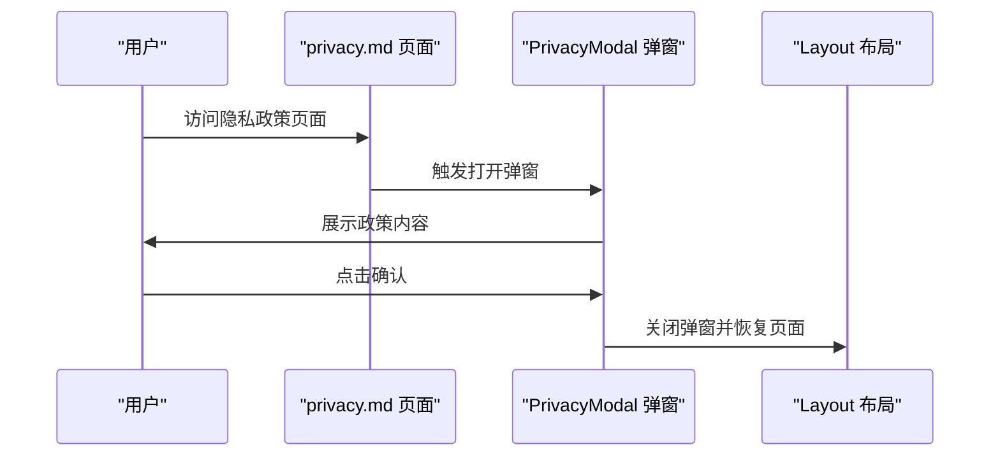
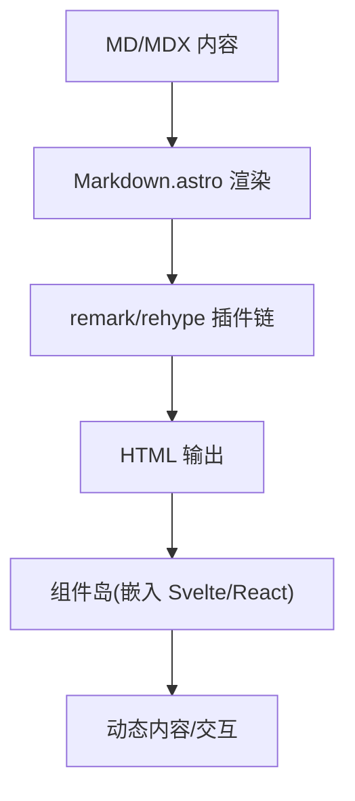
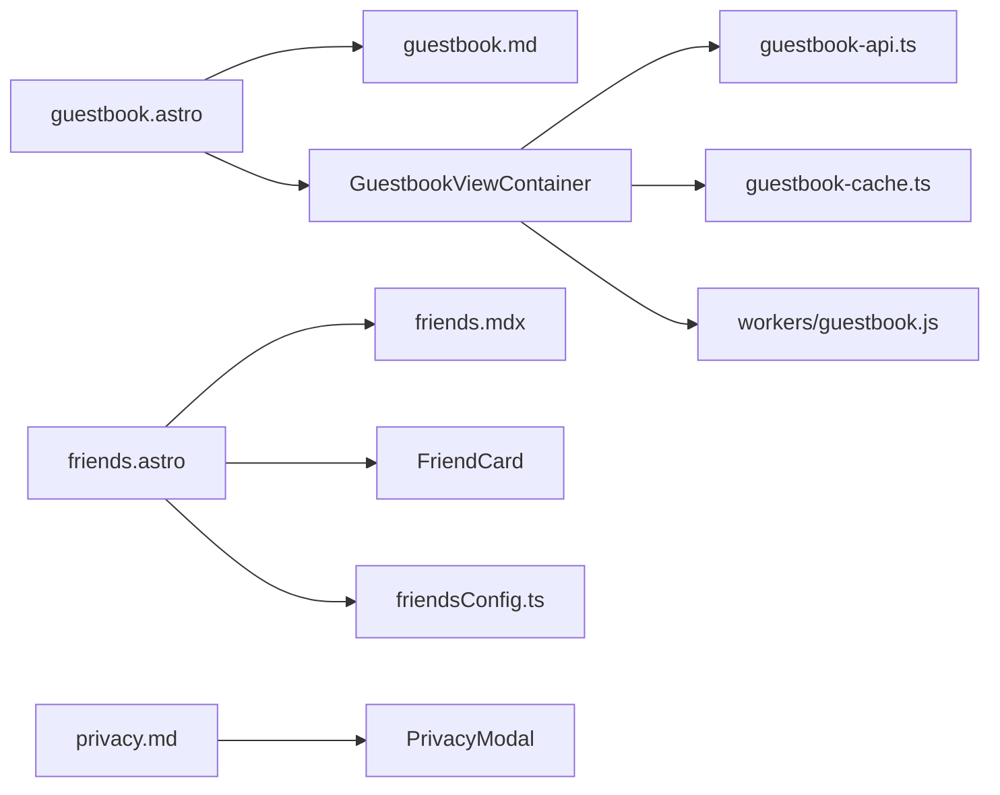

# 特殊页面管理

<cite>
**本文引用的文件**
- [src/pages/guestbook.astro](file://src/pages/guestbook.astro)
- [src/content/spec/guestbook.md](file://src/content/spec/guestbook.md)
- [src/components/features/GuestbookViewContainer.svelte](file://src/components/features/GuestbookViewContainer.svelte)
- [src/components/features/GuestbookComposeModal.astro](file://src/components/features/GuestbookComposeModal.astro)
- [src/components/features/GuestbookListModal.svelte](file://src/components/features/GuestbookListModal.svelte)
- [src/components/features/GuestbookDetailModal.astro](file://src/components/features/GuestbookDetailModal.astro)
- [src/utils/guestbook-api.ts](file://src/utils/guestbook-api.ts)
- [src/utils/guestbook-cache.ts](file://src/utils/guestbook-cache.ts)
- [src/workers/guestbook.js](file://src/workers/guestbook.js)
- [src/config/friendsConfig.ts](file://src/config/friendsConfig.ts)
- [src/content/spec/friends.mdx](file://src/content/spec/friends.mdx)
- [src/pages/friends.astro](file://src/pages/friends.astro)
- [src/components/features/FriendCard.astro](file://src/components/features/FriendCard.astro)
- [src/components/edit/FriendsEditor.svelte](file://src/components/edit/FriendsEditor.svelte)
- [src/content/spec/privacy.md](file://src/content/spec/privacy.md)
- [src/components/features/PrivacyModal.astro](file://src/components/features/PrivacyModal.astro)
- [src/layouts/Layout.astro](file://src/layouts/Layout.astro)
- [src/plugins/remark-directive-rehype.js](file://src/plugins/remark-directive-rehype.js)
- [src/plugins/remark-mermaid.js](file://src/plugins/remark-mermaid.js)
- [src/plugins/remark-plantuml.js](file://src/plugins/remark-plantuml.js)
- [src/plugins/remark-reading-time.mjs](file://src/plugins/remark-reading-time.mjs)
- [src/plugins/rehype-component-github-card.mjs](file://src/plugins/rehype-component-github-card.mjs)
- [src/plugins/rehype-email-protection.mjs](file://src/plugins/rehype-email-protection.mjs)
- [src/plugins/rehype-external-links.mjs](file://src/plugins/rehype-external-links.mjs)
- [src/plugins/rehype-figure.mjs](file://src/plugins/rehype-figure.mjs)
- [src/plugins/rehype-mermaid.mjs](file://src/plugins/rehype-mermaid.mjs)
- [src/plugins/rehype-plantuml.mjs](file://src/plugins/rehype-plantuml.mjs)
- [src/types/config.ts](file://src/types/config.ts)
- [src/pages/admin/index.astro](file://src/pages/admin/index.astro)
- [src/components/common/Markdown.astro](file://src/components/common/Markdown.astro)
- [src/components/common/PageTitle.astro](file://src/components/common/PageTitle.astro)
- [src/components/common/WidgetLayout.astro](file://src/components/common/WidgetLayout.astro)
- [src/styles/guestbook.css](file://src/styles/guestbook.css)
- [src/styles/components/privacy-modal.css](file://src/styles/components/privacy-modal.css)
</cite>

## 目录
1. [简介](#简介)
2. [项目结构](#项目结构)
3. [核心组件](#核心组件)
4. [架构总览](#架构总览)
5. [详细组件分析](#详细组件分析)
6. [依赖关系分析](#依赖关系分析)
7. [性能考量](#性能考量)
8. [故障排查指南](#故障排查指南)
9. [结论](#结论)
10. [附录](#附录)

## 简介
本文件面向Firefly-Mod博客系统的“特殊页面管理”，系统性梳理以下页面类型与实现方式：
- 友链页面：基于MDX内容与前端卡片组件的展示与管理
- 访客留言簿：基于Markdown页面与交互式留言组件的完整闭环
- 隐私政策：通过独立页面与弹窗组件实现合规展示
- MDX页面编写与组件集成：如何在MDX中嵌入React/Svelte组件、动态内容渲染
- 配置参数与显示逻辑：页面标题、描述、布局选项等
- 创建、编辑、维护工作流：从内容到前端渲染的全流程
- 权限控制与访问限制：当前实现中的可见性与交互约束
- 数据来源与动态内容：留言API、缓存、Worker处理
- 页面缓存策略、性能优化与SEO最佳实践

## 项目结构
特殊页面相关的核心位置如下：
- 页面路由与入口：src/pages 下的 guestbook.astro、friends.astro、privacy.md 对应页面
- 内容源：src/content/spec 下的 MD/MDX 文件
- 前端组件：src/components/features 与 src/components/common 下的组件
- 工具与插件：src/utils、src/workers、src/plugins
- 配置：src/config、src/types

图表来源
- [src/pages/guestbook.astro](file://src/pages/guestbook.astro)
- [src/pages/friends.astro](file://src/pages/friends.astro)
- [src/content/spec/guestbook.md](file://src/content/spec/guestbook.md)
- [src/content/spec/friends.mdx](file://src/content/spec/friends.mdx)
- [src/content/spec/privacy.md](file://src/content/spec/privacy.md)
- [src/components/features/GuestbookViewContainer.svelte](file://src/components/features/GuestbookViewContainer.svelte)
- [src/components/features/GuestbookComposeModal.astro](file://src/components/features/GuestbookComposeModal.astro)
- [src/components/features/GuestbookListModal.svelte](file://src/components/features/GuestbookListModal.svelte)
- [src/components/features/GuestbookDetailModal.astro](file://src/components/features/GuestbookDetailModal.astro)
- [src/components/features/FriendCard.astro](file://src/components/features/FriendCard.astro)
- [src/components/features/PrivacyModal.astro](file://src/components/features/PrivacyModal.astro)
- [src/components/common/Markdown.astro](file://src/components/common/Markdown.astro)
- [src/utils/guestbook-api.ts](file://src/utils/guestbook-api.ts)
- [src/utils/guestbook-cache.ts](file://src/utils/guestbook-cache.ts)
- [src/workers/guestbook.js](file://src/workers/guestbook.js)
- [src/config/friendsConfig.ts](file://src/config/friendsConfig.ts)
- [src/types/config.ts](file://src/types/config.ts)
- [src/plugins/remark-directive-rehype.js](file://src/plugins/remark-directive-rehype.js)

章节来源
- [src/pages/guestbook.astro](file://src/pages/guestbook.astro)
- [src/pages/friends.astro](file://src/pages/friends.astro)
- [src/content/spec/guestbook.md](file://src/content/spec/guestbook.md)
- [src/content/spec/friends.mdx](file://src/content/spec/friends.mdx)
- [src/content/spec/privacy.md](file://src/content/spec/privacy.md)

## 核心组件
- 访客留言簿容器与交互层
  - 容器组件负责整合“发表、列表、详情”三大视图与数据流
  - 交互组件提供模态框、分页、投票等能力
- 友链展示与管理
  - 基于MDX内容与卡片组件渲染友链列表
  - 通过配置文件与编辑器进行维护
- 隐私政策展示
  - 页面与弹窗组件配合，满足合规要求
- MDX页面与组件集成
  - Markdown渲染组件与多种Remark/Rehype插件协同
- 数据与缓存
  - API封装、Worker异步处理、客户端缓存策略

章节来源
- [src/components/features/GuestbookViewContainer.svelte](file://src/components/features/GuestbookViewContainer.svelte)
- [src/components/features/GuestbookComposeModal.astro](file://src/components/features/GuestbookComposeModal.astro)
- [src/components/features/GuestbookListModal.svelte](file://src/components/features/GuestbookListModal.svelte)
- [src/components/features/GuestbookDetailModal.astro](file://src/components/features/GuestbookDetailModal.astro)
- [src/components/features/FriendCard.astro](file://src/components/features/FriendCard.astro)
- [src/components/features/PrivacyModal.astro](file://src/components/features/PrivacyModal.astro)
- [src/components/common/Markdown.astro](file://src/components/common/Markdown.astro)
- [src/utils/guestbook-api.ts](file://src/utils/guestbook-api.ts)
- [src/utils/guestbook-cache.ts](file://src/utils/guestbook-cache.ts)
- [src/workers/guestbook.js](file://src/workers/guestbook.js)

## 架构总览
特殊页面的请求-渲染-交互-数据流如下：

图表来源
- [src/pages/guestbook.astro](file://src/pages/guestbook.astro)
- [src/components/features/GuestbookViewContainer.svelte](file://src/components/features/GuestbookViewContainer.svelte)
- [src/components/features/GuestbookComposeModal.astro](file://src/components/features/GuestbookComposeModal.astro)
- [src/utils/guestbook-api.ts](file://src/utils/guestbook-api.ts)
- [src/workers/guestbook.js](file://src/workers/guestbook.js)

## 详细组件分析

### 访客留言簿（Guestbook）
- 页面入口与内容绑定
  - 页面路由通过属性绑定到内容文件路径，确保页面与内容解耦
- 容器与交互
  - 容器组件聚合“发表、列表、详情”视图，负责状态管理与事件分发
  - 模态框组件提供表单校验、错误提示、提交流程
- 数据与缓存
  - API封装统一请求方法；缓存策略用于减少重复加载
  - Worker用于异步处理（如速率限制、批量操作）

图表来源
- [src/components/features/GuestbookViewContainer.svelte](file://src/components/features/GuestbookViewContainer.svelte)
- [src/components/features/GuestbookComposeModal.astro](file://src/components/features/GuestbookComposeModal.astro)
- [src/components/features/GuestbookListModal.svelte](file://src/components/features/GuestbookListModal.svelte)
- [src/components/features/GuestbookDetailModal.astro](file://src/components/features/GuestbookDetailModal.astro)
- [src/utils/guestbook-api.ts](file://src/utils/guestbook-api.ts)

章节来源
- [src/pages/guestbook.astro](file://src/pages/guestbook.astro)
- [src/content/spec/guestbook.md](file://src/content/spec/guestbook.md)
- [src/components/features/GuestbookViewContainer.svelte](file://src/components/features/GuestbookViewContainer.svelte)
- [src/components/features/GuestbookComposeModal.astro](file://src/components/features/GuestbookComposeModal.astro)
- [src/components/features/GuestbookListModal.svelte](file://src/components/features/GuestbookListModal.svelte)
- [src/components/features/GuestbookDetailModal.astro](file://src/components/features/GuestbookDetailModal.astro)
- [src/utils/guestbook-api.ts](file://src/utils/guestbook-api.ts)
- [src/utils/guestbook-cache.ts](file://src/utils/guestbook-cache.ts)
- [src/workers/guestbook.js](file://src/workers/guestbook.js)

### 友链页面（Friends）
- 内容与展示
  - MDX内容文件承载友链文案与结构
  - 卡片组件负责渲染每个友链项的样式与交互
- 配置与管理
  - 通过配置文件控制是否显示自定义内容
  - 编辑器组件支持友链的增删改查与批量维护
- 页面路由
  - 路由页面绑定到MDX内容文件，实现“内容即页面”

图表来源
- [src/pages/friends.astro](file://src/pages/friends.astro)
- [src/content/spec/friends.mdx](file://src/content/spec/friends.mdx)
- [src/components/features/FriendCard.astro](file://src/components/features/FriendCard.astro)
- [src/config/friendsConfig.ts](file://src/config/friendsConfig.ts)
- [src/types/config.ts](file://src/types/config.ts)
- [src/components/edit/FriendsEditor.svelte](file://src/components/edit/FriendsEditor.svelte)

章节来源
- [src/pages/friends.astro](file://src/pages/friends.astro)
- [src/content/spec/friends.mdx](file://src/content/spec/friends.mdx)
- [src/components/features/FriendCard.astro](file://src/components/features/FriendCard.astro)
- [src/config/friendsConfig.ts](file://src/config/friendsConfig.ts)
- [src/types/config.ts](file://src/types/config.ts)
- [src/components/edit/FriendsEditor.svelte](file://src/components/edit/FriendsEditor.svelte)

### 隐私政策（Privacy）
- 页面与弹窗
  - 页面文件承载隐私政策正文
  - 弹窗组件提供“打开/关闭/确认”交互，满足合规展示
- 布局与样式
  - 页面标题、描述、布局选项通过通用组件与样式文件控制

图表来源
- [src/content/spec/privacy.md](file://src/content/spec/privacy.md)
- [src/components/features/PrivacyModal.astro](file://src/components/features/PrivacyModal.astro)
- [src/layouts/Layout.astro](file://src/layouts/Layout.astro)
- [src/styles/components/privacy-modal.css](file://src/styles/components/privacy-modal.css)

章节来源
- [src/content/spec/privacy.md](file://src/content/spec/privacy.md)
- [src/components/features/PrivacyModal.astro](file://src/components/features/PrivacyModal.astro)
- [src/layouts/Layout.astro](file://src/layouts/Layout.astro)
- [src/styles/components/privacy-modal.css](file://src/styles/components/privacy-modal.css)

### MDX页面编写与组件集成
- 内容与渲染
  - MD/MDX内容通过Markdown组件渲染，支持指令与HTML混合
- 插件生态
  - Remark/Rehype插件扩展语法与组件注入能力（如Mermaid、PlantUML、外部链接、图片处理等）
- React/Svelte组件嵌入
  - 在Astro中通过组件岛（astro-island）形式嵌入Svelte组件，实现动态交互

图表来源
- [src/components/common/Markdown.astro](file://src/components/common/Markdown.astro)
- [src/plugins/remark-directive-rehype.js](file://src/plugins/remark-directive-rehype.js)
- [src/plugins/remark-mermaid.js](file://src/plugins/remark-mermaid.js)
- [src/plugins/remark-plantuml.js](file://src/plugins/remark-plantuml.js)
- [src/plugins/rehype-component-github-card.mjs](file://src/plugins/rehype-component-github-card.mjs)
- [src/plugins/rehype-email-protection.mjs](file://src/plugins/rehype-email-protection.mjs)
- [src/plugins/rehype-external-links.mjs](file://src/plugins/rehype-external-links.mjs)
- [src/plugins/rehype-figure.mjs](file://src/plugins/rehype-figure.mjs)
- [src/plugins/rehype-mermaid.mjs](file://src/plugins/rehype-mermaid.mjs)
- [src/plugins/rehype-plantuml.mjs](file://src/plugins/rehype-plantuml.mjs)

章节来源
- [src/components/common/Markdown.astro](file://src/components/common/Markdown.astro)
- [src/plugins/remark-directive-rehype.js](file://src/plugins/remark-directive-rehype.js)
- [src/plugins/remark-mermaid.js](file://src/plugins/remark-mermaid.js)
- [src/plugins/remark-plantuml.js](file://src/plugins/remark-plantuml.js)
- [src/plugins/rehype-component-github-card.mjs](file://src/plugins/rehype-component-github-card.mjs)
- [src/plugins/rehype-email-protection.mjs](file://src/plugins/rehype-email-protection.mjs)
- [src/plugins/rehype-external-links.mjs](file://src/plugins/rehype-external-links.mjs)
- [src/plugins/rehype-figure.mjs](file://src/plugins/rehype-figure.mjs)
- [src/plugins/rehype-mermaid.mjs](file://src/plugins/rehype-mermaid.mjs)
- [src/plugins/rehype-plantuml.mjs](file://src/plugins/rehype-plantuml.mjs)

## 依赖关系分析
- 页面到内容：路由页面通过属性绑定到具体内容文件，实现“内容即页面”
- 组件到工具：容器组件依赖API与缓存工具，Worker承担异步任务
- 配置到渲染：友链配置影响是否渲染自定义内容，编辑器负责维护
- 插件到渲染：Markdown渲染链路依赖插件生态，保证MDX功能完整性

图表来源
- [src/pages/guestbook.astro](file://src/pages/guestbook.astro)
- [src/content/spec/guestbook.md](file://src/content/spec/guestbook.md)
- [src/components/features/GuestbookViewContainer.svelte](file://src/components/features/GuestbookViewContainer.svelte)
- [src/utils/guestbook-api.ts](file://src/utils/guestbook-api.ts)
- [src/utils/guestbook-cache.ts](file://src/utils/guestbook-cache.ts)
- [src/workers/guestbook.js](file://src/workers/guestbook.js)
- [src/pages/friends.astro](file://src/pages/friends.astro)
- [src/content/spec/friends.mdx](file://src/content/spec/friends.mdx)
- [src/components/features/FriendCard.astro](file://src/components/features/FriendCard.astro)
- [src/config/friendsConfig.ts](file://src/config/friendsConfig.ts)
- [src/content/spec/privacy.md](file://src/content/spec/privacy.md)
- [src/components/features/PrivacyModal.astro](file://src/components/features/PrivacyModal.astro)

章节来源
- [src/pages/guestbook.astro](file://src/pages/guestbook.astro)
- [src/pages/friends.astro](file://src/pages/friends.astro)
- [src/pages/admin/index.astro](file://src/pages/admin/index.astro)

## 性能考量
- 客户端缓存
  - 使用缓存工具减少重复请求，提升列表与详情加载速度
- Worker异步处理
  - 将耗时或需要节流的操作放入Worker，避免阻塞主线程
- 渲染优化
  - 组件按需加载、懒加载图片与资源，降低首屏压力
- SEO与可访问性
  - 页面标题、描述、布局选项通过通用组件统一管理，利于SEO与无障碍

章节来源
- [src/utils/guestbook-cache.ts](file://src/utils/guestbook-cache.ts)
- [src/workers/guestbook.js](file://src/workers/guestbook.js)
- [src/components/common/PageTitle.astro](file://src/components/common/PageTitle.astro)
- [src/components/common/WidgetLayout.astro](file://src/components/common/WidgetLayout.astro)

## 故障排查指南
- 留言提交失败
  - 检查API返回状态码与错误信息，根据提示调整输入长度或频率
  - 查看错误弹窗与控制台日志定位问题
- 列表/详情加载异常
  - 确认缓存是否生效，尝试清除缓存后重试
  - 检查Worker是否正常运行
- 友链显示异常
  - 核对配置文件开关与内容文件路径
  - 确认编辑器保存后页面是否刷新
- 隐私政策弹窗
  - 确认弹窗组件初始化与事件绑定是否正确

章节来源
- [src/utils/guestbook-api.ts](file://src/utils/guestbook-api.ts)
- [src/utils/guestbook-cache.ts](file://src/utils/guestbook-cache.ts)
- [src/components/features/GuestbookComposeModal.astro](file://src/components/features/GuestbookComposeModal.astro)
- [src/components/features/PrivacyModal.astro](file://src/components/features/PrivacyModal.astro)

## 结论
Firefly-Mod的特殊页面管理以“内容即页面”为核心理念，结合Astro组件岛、Markdown渲染链与插件生态，实现了友链、留言簿、隐私政策等页面的高可维护性与良好用户体验。通过API、缓存与Worker的协同，系统在性能与交互上取得平衡；通过配置与编辑器，内容维护流程清晰可控。

## 附录
- 创建、编辑、维护工作流（示例）
  - 友链：在MDX中维护文案，通过编辑器维护配置，路由页面自动渲染
  - 留言簿：在内容文件中设置页面描述，容器组件负责交互与数据，API与缓存保障性能
  - 隐私政策：页面文件承载正文，弹窗组件提供交互，布局组件统一标题与描述
- 权限控制与访问限制
  - 当前实现主要通过可见性与交互约束控制，管理员可通过编辑器进行维护
- 数据来源与动态内容
  - 留言数据来自API，Worker负责异步处理；缓存策略减少重复请求
- 页面缓存策略、性能优化与SEO配置
  - 使用缓存工具与Worker异步处理；通过通用组件管理标题与描述，提升SEO友好度