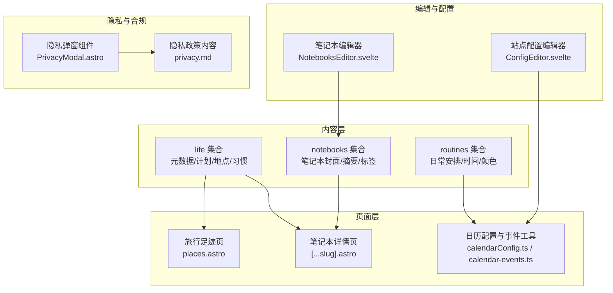
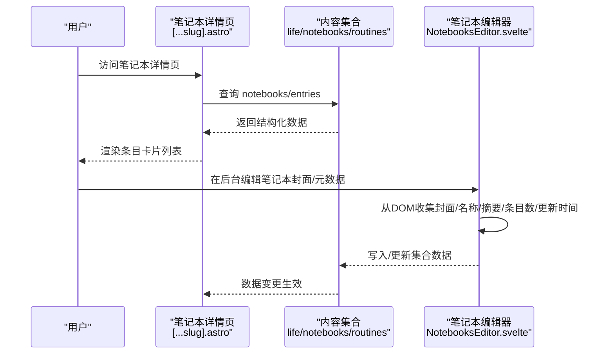
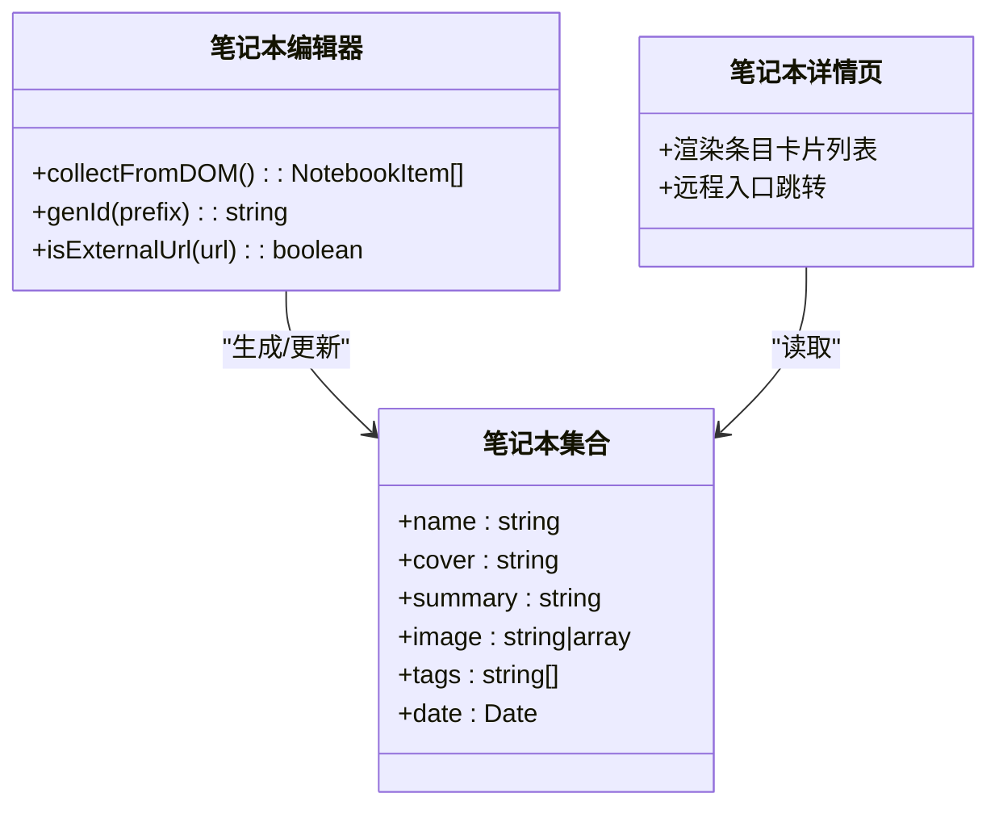
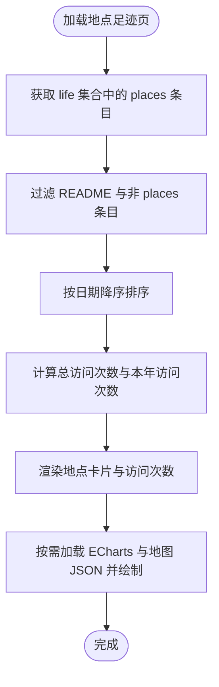
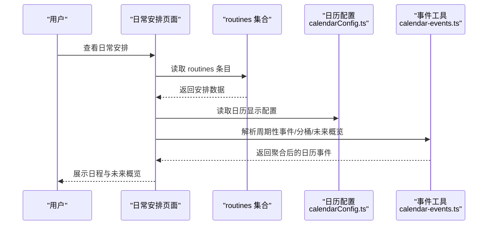
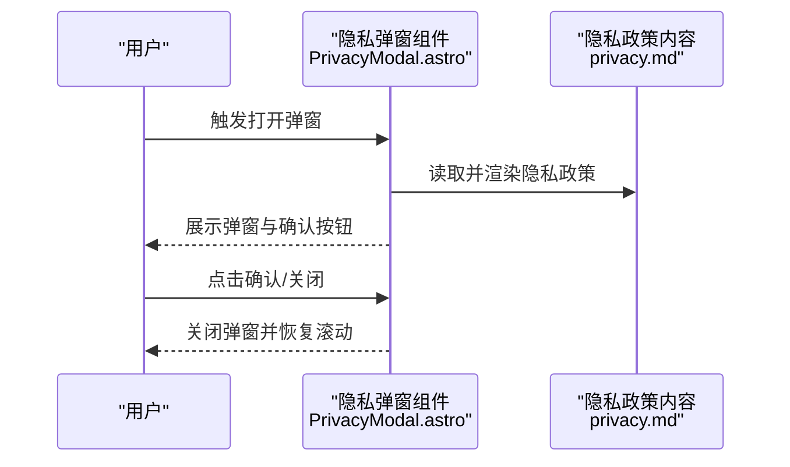
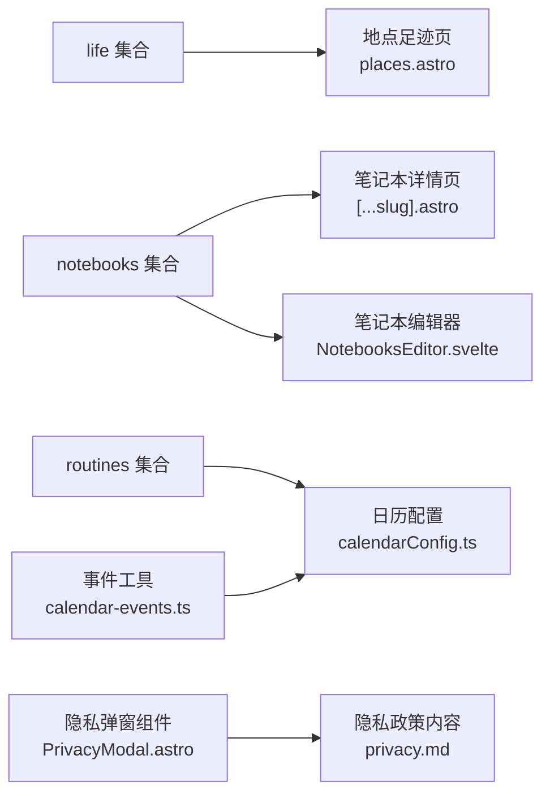

# 生活内容管理

<cite>
**本文引用的文件**
- [content.config.ts](file://src/content.config.ts)
- [NotebooksEditor.svelte](file://src/components/edit/NotebooksEditor.svelte)
- [ConfigEditor.svelte](file://src/components/edit/ConfigEditor.svelte)
- [[...slug].astro（笔记本详情页）](file://src/pages/life/notebooks/[...slug].astro)
- [places.astro](file://src/pages/life/places.astro)
- [每日时间规划表.md](file://src/content/life/routines/每日时间规划表.md)
- [calendarConfig.ts](file://src/config/calendarConfig.ts)
- [calendar-events.ts](file://src/utils/calendar-events.ts)
- [PrivacyModal.astro](file://src/components/features/PrivacyModal.astro)
- [privacy.md](file://src/content/spec/privacy.md)
</cite>

## 目录
1. [简介](#简介)
2. [项目结构](#项目结构)
3. [核心组件](#核心组件)
4. [架构总览](#架构总览)
5. [详细组件分析](#详细组件分析)
6. [依赖关系分析](#依赖关系分析)
7. [性能考量](#性能考量)
8. [故障排查指南](#故障排查指南)
9. [结论](#结论)
10. [附录](#附录)

## 简介
本文件面向 Firefly-Mod 的“生活内容管理系统”，系统性梳理生活记录的组织结构与管理流程，覆盖元数据模型、笔记本系统、地点记录、日常安排、时间线管理、标签体系、数据收集与展示、创建/编辑/归档工作流、隐私与访问控制、统计分析与可视化、以及导出使用指南。目标是帮助不同技术背景的读者快速理解并高效使用该系统。

## 项目结构
围绕“生活内容”的核心由三部分构成：
- 内容模型与集合定义：通过内容配置文件统一声明 life、notebooks、routines 等集合的字段与校验规则。
- 页面与编辑器：提供笔记本列表/详情、地点足迹、日常安排等页面，以及后台编辑器用于批量/单项维护。
- 工具与配置：日历事件聚合与展示、隐私策略与弹窗组件。

图表来源
- [content.config.ts:86-184](file://src/content.config.ts#L86-L184)
- [NotebooksEditor.svelte:49-80](file://src/components/edit/NotebooksEditor.svelte#L49-L80)
- [[...slug].astro（笔记本详情页）:263-296](file://src/pages/life/notebooks/[...slug].astro#L263-L296)
- [places.astro:1-153](file://src/pages/life/places.astro#L1-L153)
- [calendarConfig.ts:86-122](file://src/config/calendarConfig.ts#L86-L122)
- [calendar-events.ts:142-237](file://src/utils/calendar-events.ts#L142-L237)
- [PrivacyModal.astro:1-93](file://src/components/features/PrivacyModal.astro#L1-L93)
- [privacy.md:71-86](file://src/content/spec/privacy.md#L71-L86)

章节来源
- [content.config.ts:86-184](file://src/content.config.ts#L86-L184)

## 核心组件
- 内容集合与元数据
  - life 集合：支持通用元数据（标题、描述、日期）、笔记本元数据（名称、封面、摘要、条目数、更新时间）、计划元数据（计划名、目标描述、日/月目标、签到日期）、地点元数据（省/市、体验、访问次数、经纬度），以及兼容历史字段。
  - notebooks 集合：笔记本封面、摘要、图片（单图或多图）、标签、创建日期。
  - routines 集合：日常安排名称、时间段、描述、图标、颜色、更新时间。
- 页面与编辑器
  - 笔记本详情页：渲染笔记本条目卡片列表，支持远程入口跳转。
  - 地点足迹页：筛选 life 下 places 文件夹内的条目，按时间排序，统计总访问次数与本年访问次数，并提供地图可视化。
  - 日历配置与事件工具：提供日程模板、周期性事件解析、事件分桶与未来概览。
  - 笔记本编辑器：从 DOM 收集笔记本封面信息，生成标准化结构。
  - 站点配置编辑器：暴露“日常规划”“旅行足迹”“笔记本”等导航项。
- 隐私与访问控制
  - 隐私弹窗组件与隐私政策内容，确保用户知情与同意。

章节来源
- [content.config.ts:86-184](file://src/content.config.ts#L86-L184)
- [[...slug].astro（笔记本详情页）:263-296](file://src/pages/life/notebooks/[...slug].astro#L263-L296)
- [places.astro:1-153](file://src/pages/life/places.astro#L1-L153)
- [calendarConfig.ts:86-122](file://src/config/calendarConfig.ts#L86-L122)
- [calendar-events.ts:142-237](file://src/utils/calendar-events.ts#L142-L237)
- [NotebooksEditor.svelte:49-80](file://src/components/edit/NotebooksEditor.svelte#L49-L80)
- [ConfigEditor.svelte:47-88](file://src/components/edit/ConfigEditor.svelte#L47-L88)
- [PrivacyModal.astro:1-93](file://src/components/features/PrivacyModal.astro#L1-L93)
- [privacy.md:71-86](file://src/content/spec/privacy.md#L71-L86)

## 架构总览
系统采用 Astro 内容驱动架构，通过内容集合定义统一的数据模型，页面通过 Astro Content API 获取数据并渲染；编辑器负责将页面中的展示元素转换为结构化数据，便于批量维护与归档。

图表来源
- [[...slug].astro（笔记本详情页）:263-296](file://src/pages/life/notebooks/[...slug].astro#L263-L296)
- [content.config.ts:133-149](file://src/content.config.ts#L133-L149)
- [NotebooksEditor.svelte:49-80](file://src/components/edit/NotebooksEditor.svelte#L49-L80)

## 详细组件分析

### 组件A：笔记本系统
- 数据模型
  - 笔记本封面、摘要、图片（单图或多图）、标签、创建日期。
- 列表与详情
  - 列表页：按笔记本封面信息生成卡片，点击进入详情页。
  - 详情页：渲染条目卡片列表，支持远程入口跳转。
- 编辑流程
  - 编辑器从 DOM 收集封面、名称、摘要、条目数、更新时间等字段，生成标准化结构，便于批量提交与归档。

图表来源
- [content.config.ts:133-149](file://src/content.config.ts#L133-L149)
- [NotebooksEditor.svelte:49-80](file://src/components/edit/NotebooksEditor.svelte#L49-L80)
- [[...slug].astro（笔记本详情页）:263-296](file://src/pages/life/notebooks/[...slug].astro#L263-L296)

章节来源
- [content.config.ts:133-149](file://src/content.config.ts#L133-L149)
- [NotebooksEditor.svelte:49-80](file://src/components/edit/NotebooksEditor.svelte#L49-L80)
- [[...slug].astro（笔记本详情页）:263-296](file://src/pages/life/notebooks/[...slug].astro#L263-L296)

### 组件B：地点足迹与可视化
- 数据来源
  - 从 life 集合中筛选 places 文件夹下的条目，过滤 README，按日期降序排列。
- 统计指标
  - 总访问次数：对 visitCount 求和。
  - 本年访问次数：按年份筛选。
- 可视化
  - 使用 ECharts 加载中国地图 JSON，渲染地点分布与访问次数。

图表来源
- [places.astro:1-153](file://src/pages/life/places.astro#L1-L153)

章节来源
- [places.astro:1-153](file://src/pages/life/places.astro#L1-L153)

### 组件C：日常安排与日历集成
- 日常安排
  - routines 集合定义日常安排的名称、时间段、描述、图标、颜色、更新时间。
  - 示例：每日时间规划表，包含全天安排与自律约束。
- 日历集成
  - calendarConfig 提供日程模板与显示开关。
  - calendar-events 提供周期性事件解析、事件分桶、未来概览等工具函数。

图表来源
- [每日时间规划表.md:1-22](file://src/content/life/routines/每日时间规划表.md#L1-L22)
- [calendarConfig.ts:86-122](file://src/config/calendarConfig.ts#L86-L122)
- [calendar-events.ts:142-237](file://src/utils/calendar-events.ts#L142-L237)

章节来源
- [每日时间规划表.md:1-22](file://src/content/life/routines/每日时间规划表.md#L1-L22)
- [calendarConfig.ts:86-122](file://src/config/calendarConfig.ts#L86-L122)
- [calendar-events.ts:142-237](file://src/utils/calendar-events.ts#L142-L237)

### 组件D：隐私与访问控制
- 隐私弹窗组件
  - 通过 Astro Content 获取隐私政策内容并渲染，提供打开/关闭逻辑与样式。
- 隐私政策内容
  - 规定信息收集、使用、披露、权利等条款，确保合规。

图表来源
- [PrivacyModal.astro:1-93](file://src/components/features/PrivacyModal.astro#L1-L93)
- [privacy.md:71-86](file://src/content/spec/privacy.md#L71-L86)

章节来源
- [PrivacyModal.astro:1-93](file://src/components/features/PrivacyModal.astro#L1-L93)
- [privacy.md:71-86](file://src/content/spec/privacy.md#L71-L86)

## 依赖关系分析
- 内容集合之间的耦合
  - life 集合同时承载笔记本、计划、地点等元数据，形成跨域数据关联。
  - notebooks 与 routines 作为独立集合，分别服务于“内容载体”和“时间安排”。
- 页面与工具的依赖
  - 地点足迹页依赖 Astro Content API 与 ECharts 资源。
  - 日历事件工具被日历配置共同使用，提供事件聚合能力。
- 编辑器与页面的协作
  - 笔记本编辑器从 DOM 收集数据，写入 notebooks 集合，随后在详情页生效。

图表来源
- [content.config.ts:86-184](file://src/content.config.ts#L86-L184)
- [places.astro:1-153](file://src/pages/life/places.astro#L1-L153)
- [[...slug].astro（笔记本详情页）:263-296](file://src/pages/life/notebooks/[...slug].astro#L263-L296)
- [NotebooksEditor.svelte:49-80](file://src/components/edit/NotebooksEditor.svelte#L49-L80)
- [calendarConfig.ts:86-122](file://src/config/calendarConfig.ts#L86-L122)
- [calendar-events.ts:142-237](file://src/utils/calendar-events.ts#L142-L237)
- [PrivacyModal.astro:1-93](file://src/components/features/PrivacyModal.astro#L1-L93)
- [privacy.md:71-86](file://src/content/spec/privacy.md#L71-L86)

章节来源
- [content.config.ts:86-184](file://src/content.config.ts#L86-L184)

## 性能考量
- 内容加载优化
  - 使用 Astro Content API 按需加载集合，避免一次性渲染全部数据。
- 可视化性能
  - 地图资源按需加载，减少首屏体积；事件聚合在客户端完成，建议限制数据量或分页。
- 编辑器效率
  - DOM 收集仅针对可见卡片，避免全量扫描；批量化提交减少多次写入开销。

## 故障排查指南
- 笔记本封面缺失或链接错误
  - 检查编辑器收集逻辑与外部链接判断，确保封面 URL 有效。
- 地点足迹不显示或地图加载失败
  - 确认 ECharts 资源加载成功与地图 JSON 可达；检查数据中省/市/经纬度字段。
- 日历事件未出现或重复
  - 校验周期性事件配置与事件分桶逻辑；确保同日同类型事件去重。
- 隐私弹窗无法关闭
  - 检查弹窗事件绑定与滚动恢复逻辑，确认未被其他遮罩层干扰。

章节来源
- [NotebooksEditor.svelte:49-80](file://src/components/edit/NotebooksEditor.svelte#L49-L80)
- [places.astro:131-153](file://src/pages/life/places.astro#L131-L153)
- [calendar-events.ts:182-204](file://src/utils/calendar-events.ts#L182-L204)
- [PrivacyModal.astro:38-91](file://src/components/features/PrivacyModal.astro#L38-L91)

## 结论
该系统以内容集合为核心，结合页面渲染与编辑器工具，实现了生活内容的结构化管理与可视化呈现。通过统一的元数据模型与标签体系，支持笔记本、地点、日常安排等多维度内容的采集、整理与展示；配合日历工具与隐私组件，满足时间线管理与合规需求。建议在实际使用中遵循统一的字段规范与工作流，确保数据一致性与可维护性。

## 附录
- 创建/编辑/归档工作流
  - 创建：在 notebooks 或 routines 集合中新增条目，填写封面/摘要/标签/时间等字段。
  - 编辑：通过笔记本编辑器批量收集与更新，或在相应页面进行单项编辑。
  - 归档：将不再活跃的内容移动至归档目录或调整状态字段，保持主列表整洁。
- 统计分析与可视化
  - 地点足迹：基于 visitCount 与时间排序生成热力图与访问统计。
  - 日历概览：利用事件工具生成未来 N 天的事件列表，辅助时间规划。
- 导出使用指南
  - 利用 Astro Content API 获取集合数据，结合第三方工具进行二次导出与分析（例如 CSV/JSON）。