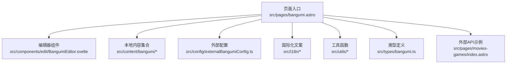
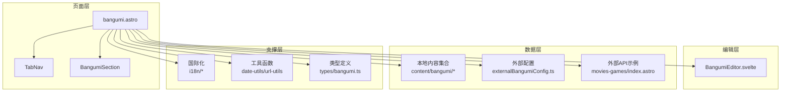
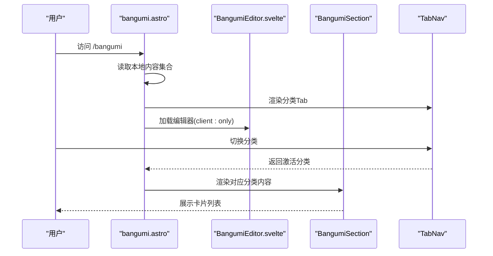
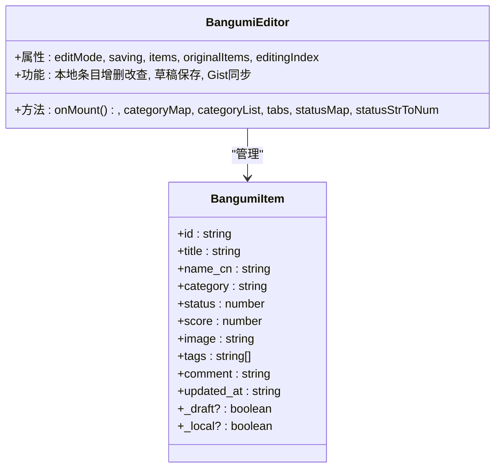
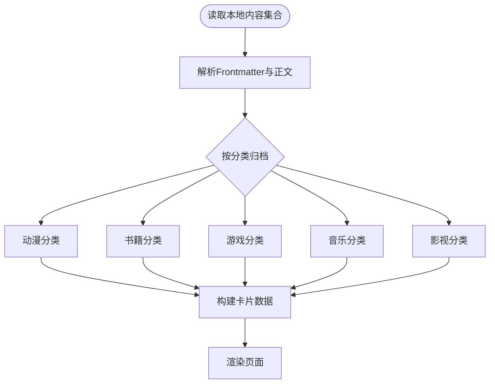
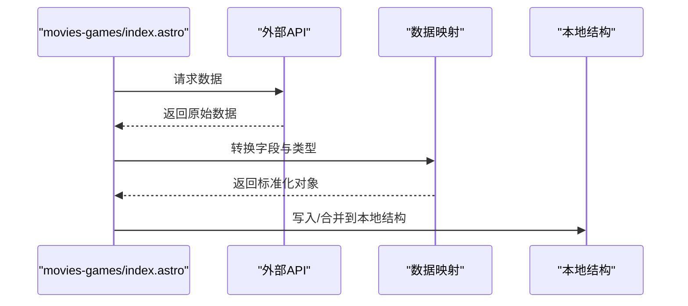
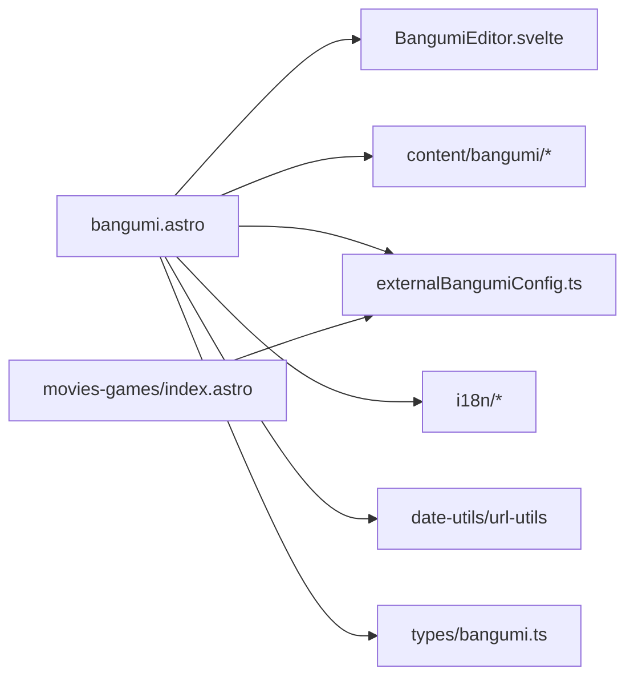

# 番组内容管理

<cite>
**本文引用的文件**
- [src/pages/bangumi.astro](file://src/pages/bangumi.astro)
- [src/components/edit/BangumiEditor.svelte](file://src/components/edit/BangumiEditor.svelte)
- [src/content/bangumi/anime/你的名字.md](file://src/content/bangumi/anime/你的名字.md)
- [src/content/bangumi/book/个人成长/强者思维.md](file://src/content/bangumi/book/个人成长/强者思维.md)
- [src/content/bangumi/game/王者荣耀.md](file://src/content/bangumi/game/王者荣耀.md)
- [src/content/bangumi/music/一生所爱.md](file://src/content/bangumi/music/一生所爱.md)
- [src/types/bangumi.ts](file://src/types/bangumi.ts)
- [src/config/externalBangumiConfig.ts](file://src/config/externalBangumiConfig.ts)
- [src/i18n/languages/zh_CN.ts](file://src/i18n/languages/zh_CN.ts)
- [src/i18n/languages/en.ts](file://src/i18n/languages/en.ts)
- [src/i18n/languages/zh_TW.ts](file://src/i18n/languages/zh_TW.ts)
- [src/i18n/i18nKey.ts](file://src/i18n/i18nKey.ts)
- [src/utils/date-utils.ts](file://src/utils/date-utils.ts)
- [src/utils/url-utils.ts](file://src/utils/url-utils.ts)
- [src/pages/movies-games/index.astro](file://src/pages/movies-games/index.astro)
</cite>

## 目录
1. [简介](#简介)
2. [项目结构](#项目结构)
3. [核心组件](#核心组件)
4. [架构总览](#架构总览)
5. [详细组件分析](#详细组件分析)
6. [依赖关系分析](#依赖关系分析)
7. [性能考虑](#性能考虑)
8. [故障排除指南](#故障排除指南)
9. [结论](#结论)
10. [附录](#附录)

## 简介
本文件面向Firefly-Mod的番组内容管理系统，系统性梳理番组数据的分类体系（动漫、书籍、游戏、音乐、影视）、条目数据结构与字段定义、本地内容与外部API集成方案、导入/同步/更新机制、筛选/排序/搜索能力、统计与分析、以及导出与分享流程。文档以仓库现有代码为依据，结合组件与类型定义进行说明，并提供可视化图示帮助理解。

## 项目结构
番组相关内容主要分布在以下区域：
- 页面入口与布局：src/pages/bangumi.astro
- 编辑器组件：src/components/edit/BangumiEditor.svelte
- 本地内容源：src/content/bangumi/{anime, book, game, music}
- 类型定义：src/types/bangumi.ts
- 外部集成配置：src/config/externalBangumiConfig.ts
- 国际化文案：src/i18n/languages/*.ts 与 src/i18n/i18nKey.ts
- 工具函数：src/utils/date-utils.ts、src/utils/url-utils.ts
- 外部API示例页面：src/pages/movies-games/index.astro

图表来源
- [src/pages/bangumi.astro:1-195](file://src/pages/bangumi.astro#L1-L195)
- [src/components/edit/BangumiEditor.svelte:1-107](file://src/components/edit/BangumiEditor.svelte#L1-L107)
- [src/config/externalBangumiConfig.ts](file://src/config/externalBangumiConfig.ts)
- [src/types/bangumi.ts](file://src/types/bangumi.ts)
- [src/i18n/languages/zh_CN.ts:71-144](file://src/i18n/languages/zh_CN.ts#L71-L144)
- [src/utils/date-utils.ts](file://src/utils/date-utils.ts)
- [src/utils/url-utils.ts](file://src/utils/url-utils.ts)
- [src/pages/movies-games/index.astro:41-98](file://src/pages/movies-games/index.astro#L41-L98)

章节来源
- [src/pages/bangumi.astro:1-195](file://src/pages/bangumi.astro#L1-L195)
- [src/components/edit/BangumiEditor.svelte:1-107](file://src/components/edit/BangumiEditor.svelte#L1-L107)

## 核心组件
- 页面入口与导航：负责加载本地bangumi集合、渲染Tab导航、调用编辑器并展示各分类内容。
- 编辑器组件：提供本地条目的增删改查、草稿保存、Gist同步等功能。
- 本地内容源：通过Astro内容集合读取本地Markdown条目，支持多分类。
- 外部集成：提供外部Bangumi配置项，用于对接外部API（如外部API示例页面展示了数据映射逻辑）。
- 国际化：统一管理番组相关文案，覆盖筛选、状态、分类、分页等。
- 工具函数：日期格式化、URL处理等辅助能力。

章节来源
- [src/pages/bangumi.astro:1-195](file://src/pages/bangumi.astro#L1-L195)
- [src/components/edit/BangumiEditor.svelte:1-107](file://src/components/edit/BangumiEditor.svelte#L1-L107)
- [src/i18n/languages/zh_CN.ts:71-144](file://src/i18n/languages/zh_CN.ts#L71-L144)

## 架构总览
系统采用“页面入口 + 组件 + 本地内容 + 外部配置 + 国际化”的分层架构。页面入口负责聚合数据与UI；编辑器组件负责本地数据的编辑与持久化；本地内容作为静态数据源；外部配置提供扩展接入点；国际化保障多语言体验。

图表来源
- [src/pages/bangumi.astro:1-195](file://src/pages/bangumi.astro#L1-L195)
- [src/components/edit/BangumiEditor.svelte:1-107](file://src/components/edit/BangumiEditor.svelte#L1-L107)
- [src/config/externalBangumiConfig.ts](file://src/config/externalBangumiConfig.ts)
- [src/pages/movies-games/index.astro:41-98](file://src/pages/movies-games/index.astro#L41-L98)
- [src/i18n/languages/zh_CN.ts:71-144](file://src/i18n/languages/zh_CN.ts#L71-L144)
- [src/utils/date-utils.ts](file://src/utils/date-utils.ts)
- [src/utils/url-utils.ts](file://src/utils/url-utils.ts)
- [src/types/bangumi.ts](file://src/types/bangumi.ts)

## 详细组件分析

### 页面入口与Tab导航
- 页面入口负责读取本地bangumi集合，构建分类映射（书籍、动漫、游戏、音乐、影视），渲染标题、更新时间、编辑器与Tab导航。
- Tab导航根据当前激活分类渲染对应Section，支持分页展示。

图表来源
- [src/pages/bangumi.astro:1-195](file://src/pages/bangumi.astro#L1-L195)
- [src/components/edit/BangumiEditor.svelte:1-107](file://src/components/edit/BangumiEditor.svelte#L1-L107)

章节来源
- [src/pages/bangumi.astro:1-195](file://src/pages/bangumi.astro#L1-L195)

### 编辑器组件（本地条目管理）
- 支持分类切换（全部、动漫、书籍、游戏、音乐、影视），状态映射（想看、看过、在看、搁置、抛弃），评分、标签、评论、图片等字段。
- 通过Gist草稿机制实现本地编辑与提交，具备变更检测与刷新能力。
- 提供默认分类参数与自定义页面名称，便于嵌入不同场景。

图表来源
- [src/components/edit/BangumiEditor.svelte:15-107](file://src/components/edit/BangumiEditor.svelte#L15-L107)

章节来源
- [src/components/edit/BangumiEditor.svelte:1-107](file://src/components/edit/BangumiEditor.svelte#L1-L107)

### 本地内容源与数据结构
- 本地内容位于src/content/bangumi/下，按分类组织（anime、book、game、music）。
- 条目以Markdown文件形式存在，字段由Frontmatter与正文构成，常见字段包括标题、封面、评分、状态、标签、评论、发布时间等。
- 页面入口通过Astro内容集合读取这些条目，并进行分类与链接生成。

图表来源
- [src/pages/bangumi.astro:38-158](file://src/pages/bangumi.astro#L38-L158)
- [src/content/bangumi/anime/你的名字.md](file://src/content/bangumi/anime/你的名字.md)
- [src/content/bangumi/book/个人成长/强者思维.md](file://src/content/bangumi/book/个人成长/强者思维.md)
- [src/content/bangumi/game/王者荣耀.md](file://src/content/bangumi/game/王者荣耀.md)
- [src/content/bangumi/music/一生所爱.md](file://src/content/bangumi/music/一生所爱.md)

章节来源
- [src/pages/bangumi.astro:38-158](file://src/pages/bangumi.astro#L38-L158)
- [src/content/bangumi/anime/你的名字.md](file://src/content/bangumi/anime/你的名字.md)
- [src/content/bangumi/book/个人成长/强者思维.md](file://src/content/bangumi/book/个人成长/强者思维.md)
- [src/content/bangumi/game/王者荣耀.md](file://src/content/bangumi/game/王者荣耀.md)
- [src/content/bangumi/music/一生所爱.md](file://src/content/bangumi/music/一生所爱.md)

### 外部API集成与数据映射
- 外部配置提供接入点，页面可按需启用外部数据源。
- 外部API示例页面展示了数据映射逻辑，包括subject类型映射、评分、状态、标签、更新时间等字段转换，便于与本地结构对齐。

图表来源
- [src/pages/movies-games/index.astro:41-98](file://src/pages/movies-games/index.astro#L41-L98)
- [src/config/externalBangumiConfig.ts](file://src/config/externalBangumiConfig.ts)

章节来源
- [src/pages/movies-games/index.astro:41-98](file://src/pages/movies-games/index.astro#L41-L98)
- [src/config/externalBangumiConfig.ts](file://src/config/externalBangumiConfig.ts)

### 国际化与筛选/排序/搜索
- 国际化键值覆盖番组筛选、状态、分类、分页等文案，支持简体中文、英文、繁体中文等。
- 页面通过Tab与过滤控件实现筛选；排序与搜索能力可结合前端组件实现（例如搜索框、排序下拉等，具体实现可在相应组件中扩展）。

章节来源
- [src/i18n/languages/zh_CN.ts:71-144](file://src/i18n/languages/zh_CN.ts#L71-L144)
- [src/i18n/languages/en.ts:70-180](file://src/i18n/languages/en.ts#L70-L180)
- [src/i18n/languages/zh_TW.ts:111-145](file://src/i18n/languages/zh_TW.ts#L111-L145)
- [src/i18n/i18nKey.ts:86-154](file://src/i18n/i18nKey.ts#L86-L154)

### 统计与分析
- 页面显示“数据更新于”构建时间，体现静态构建与数据时效性。
- 统计分析可通过筛选后的数据集进行聚合（如按状态计数、评分分布、时间统计等），具体实现可扩展至前端组件。

章节来源
- [src/pages/bangumi.astro:20-20](file://src/pages/bangumi.astro#L20-L20)
- [src/utils/date-utils.ts](file://src/utils/date-utils.ts)

## 依赖关系分析
- 页面入口依赖编辑器、本地内容集合、外部配置、国际化与工具函数。
- 编辑器依赖草稿与Gist同步工具、编辑配置。
- 类型定义为数据结构提供约束，确保前后端一致性。
- 外部API示例页面提供数据映射参考，便于对接第三方服务。

图表来源
- [src/pages/bangumi.astro:1-195](file://src/pages/bangumi.astro#L1-L195)
- [src/components/edit/BangumiEditor.svelte:1-107](file://src/components/edit/BangumiEditor.svelte#L1-L107)
- [src/config/externalBangumiConfig.ts](file://src/config/externalBangumiConfig.ts)
- [src/types/bangumi.ts](file://src/types/bangumi.ts)
- [src/i18n/languages/zh_CN.ts:71-144](file://src/i18n/languages/zh_CN.ts#L71-L144)
- [src/utils/date-utils.ts](file://src/utils/date-utils.ts)
- [src/utils/url-utils.ts](file://src/utils/url-utils.ts)
- [src/pages/movies-games/index.astro:41-98](file://src/pages/movies-games/index.astro#L41-L98)

章节来源
- [src/pages/bangumi.astro:1-195](file://src/pages/bangumi.astro#L1-L195)
- [src/components/edit/BangumiEditor.svelte:1-107](file://src/components/edit/BangumiEditor.svelte#L1-L107)
- [src/types/bangumi.ts](file://src/types/bangumi.ts)

## 性能考虑
- 静态构建：页面基于Astro内容集合构建，减少运行时查询开销。
- 分类分页：通过Tab与分页控制渲染数量，避免一次性加载过多条目。
- 数据映射：外部API返回数据需进行字段映射与类型转换，建议缓存与去重，降低重复计算。
- 图片资源：封面图应优化尺寸与格式，必要时使用懒加载与CDN加速。

## 故障排除指南
- 无法访问番组页面：确认页面配置已启用，否则将重定向至404。
- 无数据或空白：检查本地内容集合是否存在对应分类与条目，或外部API是否可用。
- 语言显示异常：核对国际化键值与当前语言包是否匹配。
- 更新时间不正确：检查日期格式化工具与构建时间逻辑。

章节来源
- [src/pages/bangumi.astro:16-18](file://src/pages/bangumi.astro#L16-L18)
- [src/i18n/languages/zh_CN.ts:71-144](file://src/i18n/languages/zh_CN.ts#L71-L144)
- [src/utils/date-utils.ts](file://src/utils/date-utils.ts)

## 结论
本系统以Astro内容集合为核心，结合编辑器组件与国际化支持，实现了对动漫、书籍、游戏、音乐、影视等多类番组内容的本地管理与展示。通过外部配置与API示例页面，系统具备扩展第三方数据的能力。建议后续完善筛选/排序/搜索、统计分析与导出分享功能，进一步提升用户体验与数据价值。

## 附录

### 番组数据结构与字段定义
- 标题：条目名称（支持中英文）
- 封面：图片地址或对象
- 评分：数值型评分
- 观看状态：想看、看过、在看、搁置、抛弃（或对应外部状态）
- 个人评价：评论文本
- 分类：anime、book、game、music、real
- 标签：字符串数组
- 更新时间：ISO时间戳
- 链接：条目详情页路径

章节来源
- [src/components/edit/BangumiEditor.svelte:15-28](file://src/components/edit/BangumiEditor.svelte#L15-L28)
- [src/pages/movies-games/index.astro:44-65](file://src/pages/movies-games/index.astro#L44-L65)

### 添加、编辑、删除操作指南
- 添加：在对应分类目录新增Markdown条目，填写Frontmatter字段后自动收录。
- 编辑：通过页面中的编辑器进行本地修改，支持草稿保存与Gist同步。
- 删除：移除对应Markdown文件或在编辑器中标记删除。

章节来源
- [src/pages/bangumi.astro:38-158](file://src/pages/bangumi.astro#L38-L158)
- [src/components/edit/BangumiEditor.svelte:1-107](file://src/components/edit/BangumiEditor.svelte#L1-L107)

### 导入、同步与更新机制
- 导入：本地Markdown条目自动被内容集合识别。
- 同步：编辑器支持草稿与Gist同步，便于跨设备协作。
- 更新：页面显示构建时间；外部API数据需映射后写入本地结构。

章节来源
- [src/pages/bangumi.astro:20-20](file://src/pages/bangumi.astro#L20-L20)
- [src/components/edit/BangumiEditor.svelte:51-62](file://src/components/edit/BangumiEditor.svelte#L51-L62)
- [src/pages/movies-games/index.astro:41-98](file://src/pages/movies-games/index.astro#L41-L98)

### 筛选、排序、搜索实现方式
- 筛选：通过Tab与过滤控件选择分类与状态。
- 排序：可按评分、时间等字段排序（具体实现可扩展）。
- 搜索：可增加关键词搜索框，对标题、标签等字段进行过滤。

章节来源
- [src/i18n/languages/zh_CN.ts:71-144](file://src/i18n/languages/zh_CN.ts#L71-L144)
- [src/i18n/i18nKey.ts:86-154](file://src/i18n/i18nKey.ts#L86-L154)

### 统计与分析
- 观看进度：按状态计数（想看、看过、在看、搁置、抛弃）。
- 评分分布：统计评分区间频次。
- 时间统计：按更新时间或发布时间进行趋势分析。

章节来源
- [src/pages/bangumi.astro:20-20](file://src/pages/bangumi.astro#L20-L20)

### 导出、分享与社交
- 导出：可基于当前筛选结果生成静态报告或分享链接。
- 分享：利用页面链接与社交媒体分享按钮进行传播。
- 社交：结合评论区与访客互动组件（如Twikoo等）增强社区氛围。

章节来源
- [src/pages/bangumi.astro:160-178](file://src/pages/bangumi.astro#L160-L178)