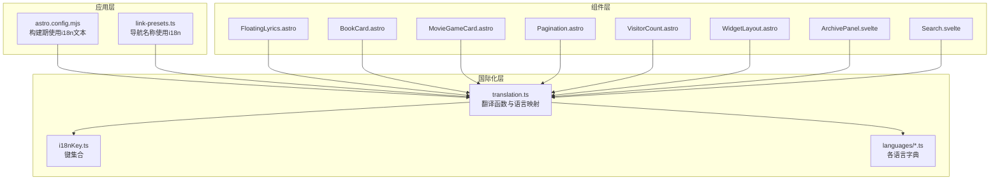
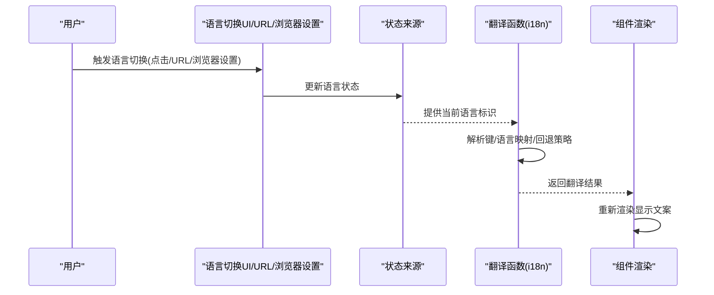
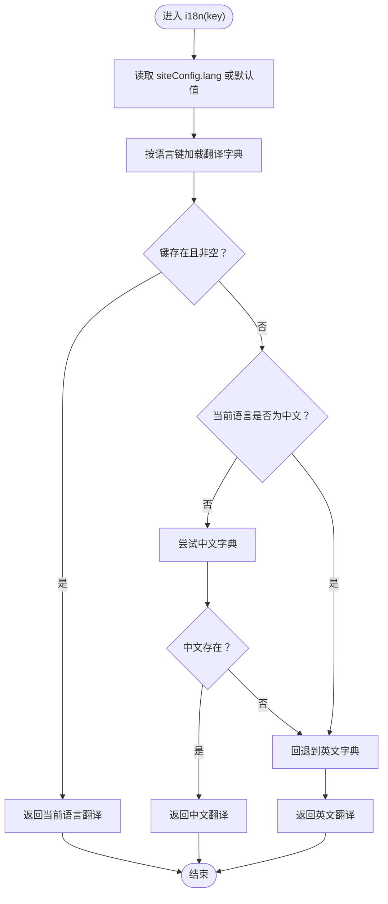
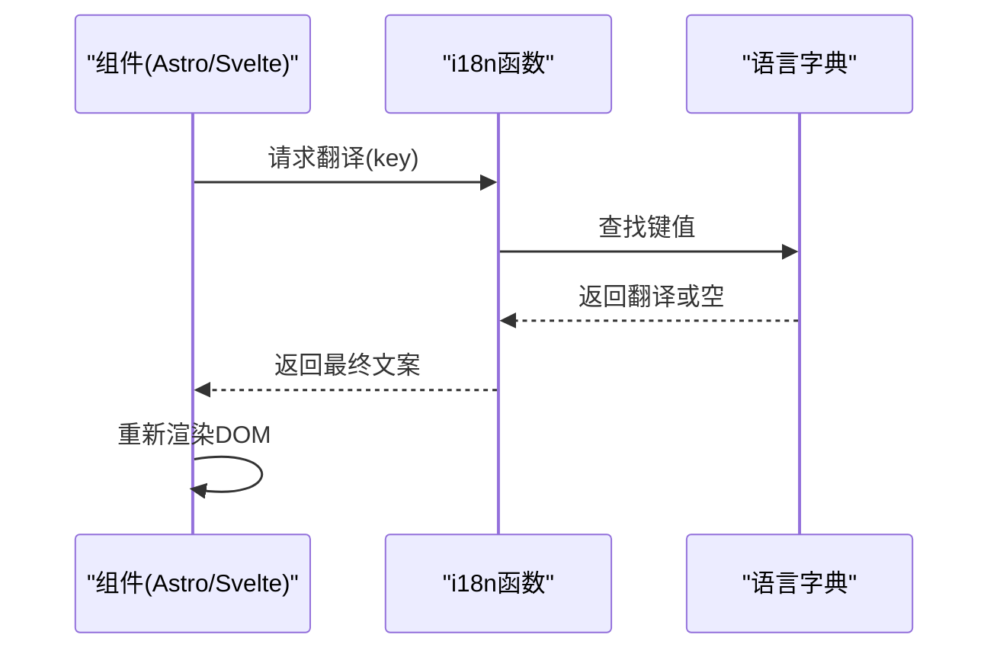
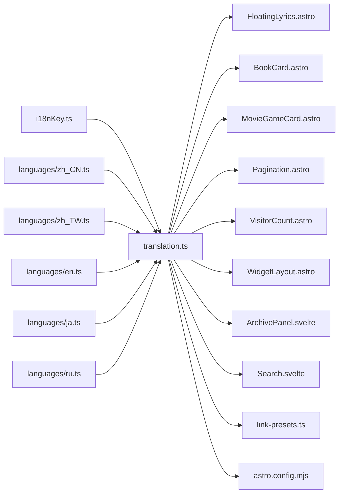

# 动态语言切换

<cite>
**本文引用的文件**
- [translation.ts](file://src/i18n/translation.ts)
- [i18nKey.ts](file://src/i18n/i18nKey.ts)
- [date-utils.ts](file://src/utils/date-utils.ts)
- [astro.config.mjs](file://astro.config.mjs)
- [link-presets.ts](file://src/constants/link-presets.ts)
- [FloatingLyrics.astro](file://src/components/features/FloatingLyrics.astro)
- [BookCard.astro](file://src/components/pages/books/BookCard.astro)
- [MovieGameCard.astro](file://src/components/pages/movies-games/MovieGameCard.astro)
- [ClientPagination.astro](file://src/components/common/Pagination.astro)
- [VisitorCount.astro](file://src/components/common/VisitorCount.astro)
- [WidgetLayout.astro](file://src/components/common/WidgetLayout.astro)
- [ArchivePanel.svelte](file://src/components/controls/ArchivePanel.svelte)
- [Search.svelte](file://src/components/controls/Search.svelte)
- [fix_i18n.cjs](file://fix_i18n.cjs)
</cite>

## 目录
1. [引言](#引言)
2. [项目结构](#项目结构)
3. [核心组件](#核心组件)
4. [架构总览](#架构总览)
5. [详细组件分析](#详细组件分析)
6. [依赖关系分析](#依赖关系分析)
7. [性能考量](#性能考量)
8. [故障排查指南](#故障排查指南)
9. [结论](#结论)
10. [附录](#附录)

## 引言
本文件面向Firefly-Mod项目的动态语言切换能力，系统性阐述其设计与实现：包括状态来源、翻译函数机制、组件渲染与路由处理、触发方式（UI操作、URL参数、浏览器设置）、持久化方案（本地存储/会话/Cookie）、响应式更新与性能优化、错误处理与回退策略，以及调试与测试方法。目标是帮助开发者在不直接阅读源码的情况下，也能准确理解并维护该功能。

## 项目结构
围绕国际化的核心目录与文件如下：
- 国际化定义与实现：src/i18n/translation.ts、src/i18n/i18nKey.ts、src/i18n/languages/*.ts
- 日期等格式化工具：src/utils/date-utils.ts
- 构建期插件配置：astro.config.mjs（使用i18n文本）
- 常量与链接预设：src/constants/link-presets.ts
- 使用i18n的组件示例：多个Astro/Svelte组件通过i18n函数渲染文案

图表来源
- [translation.ts:1-46](file://src/i18n/translation.ts#L1-L46)
- [i18nKey.ts:417-435](file://src/i18n/i18nKey.ts#L417-L435)
- [astro.config.mjs:97-135](file://astro.config.mjs#L97-L135)
- [link-presets.ts:1-52](file://src/constants/link-presets.ts#L1-L52)
- [FloatingLyrics.astro:1-23](file://src/components/features/FloatingLyrics.astro#L1-L23)
- [BookCard.astro:1-45](file://src/components/pages/books/BookCard.astro#L1-L45)
- [MovieGameCard.astro:1-52](file://src/components/pages/movies-games/MovieGameCard.astro#L1-L52)
- [ClientPagination.astro:1-120](file://src/components/common/Pagination.astro#L1-L120)
- [VisitorCount.astro:1-60](file://src/components/common/VisitorCount.astro#L1-L60)
- [WidgetLayout.astro:1-50](file://src/components/common/WidgetLayout.astro#L1-L50)
- [ArchivePanel.svelte:1-420](file://src/components/controls/ArchivePanel.svelte#L1-L420)
- [Search.svelte:1-210](file://src/components/controls/Search.svelte#L1-L210)

章节来源
- [translation.ts:1-46](file://src/i18n/translation.ts#L1-L46)
- [i18nKey.ts:417-435](file://src/i18n/i18nKey.ts#L417-L435)
- [astro.config.mjs:97-135](file://astro.config.mjs#L97-L135)
- [link-presets.ts:1-52](file://src/constants/link-presets.ts#L1-L52)

## 核心组件
- 翻译函数与语言映射：提供按语言键获取翻译对象、回退到默认语言与中文的逻辑
- 键集合：集中定义所有可翻译键值，保证一致性与可追踪性
- 日期格式化：根据语言选择合适的区域化日期/时间格式
- 构建期插件：在构建阶段注入i18n文本，确保静态资源与多语言一致
- 常量与链接：导航名称等静态常量也通过i18n生成，统一语言来源

章节来源
- [translation.ts:1-46](file://src/i18n/translation.ts#L1-L46)
- [i18nKey.ts:417-435](file://src/i18n/i18nKey.ts#L417-L435)
- [date-utils.ts:1-60](file://src/utils/date-utils.ts#L1-L60)
- [astro.config.mjs:97-135](file://astro.config.mjs#L97-L135)
- [link-presets.ts:1-52](file://src/constants/link-presets.ts#L1-L52)

## 架构总览
动态语言切换由“状态来源—翻译函数—组件渲染—路由处理”四部分构成。状态来源决定当前语言；翻译函数负责解析键、执行回退策略；组件在渲染时调用翻译函数；路由层面通过URL参数或浏览器设置影响初始语言。

图表来源
- [translation.ts:28-46](file://src/i18n/translation.ts#L28-L46)
- [FloatingLyrics.astro:10-23](file://src/components/features/FloatingLyrics.astro#L10-L23)
- [BookCard.astro:16-25](file://src/components/pages/books/BookCard.astro#L16-L25)
- [MovieGameCard.astro:30-49](file://src/components/pages/movies-games/MovieGameCard.astro#L30-L49)

## 详细组件分析

### 翻译函数与回退策略
- 语言映射：支持多种语言键（含地区变体）映射到具体语言对象
- 默认语言：当未匹配到语言时返回英文
- 回退机制：若当前语言缺失某键，优先尝试中文，再回退至英文
- 键解析：通过I18nKey枚举确保键名一致且类型安全

图表来源
- [translation.ts:28-46](file://src/i18n/translation.ts#L28-L46)

章节来源
- [translation.ts:1-46](file://src/i18n/translation.ts#L1-L46)
- [i18nKey.ts:417-435](file://src/i18n/i18nKey.ts#L417-L435)

### 语言状态来源与持久化
- 状态来源：站点配置提供当前语言标识
- 持久化建议：
  - 本地存储：在客户端保存用户选择的语言，刷新后恢复
  - Cookie：跨会话共享语言偏好，注意域与安全属性
  - URL参数：通过查询参数携带语言，便于分享与SEO
  - 浏览器设置：读取navigator.language作为初始语言
- 初始语言确定顺序（建议）：URL参数 → Cookie → 浏览器设置 → 默认语言

章节来源
- [translation.ts:32-34](file://src/i18n/translation.ts#L32-L34)

### 组件渲染与响应式更新
- 渲染入口：各组件在模板中调用i18n函数获取文案
- 响应式更新：组件在语言状态变化后重新渲染，展示对应语言文案
- 性能优化：避免在渲染热路径重复计算语言映射；可考虑缓存当前语言字典

图表来源
- [FloatingLyrics.astro:10-23](file://src/components/features/FloatingLyrics.astro#L10-L23)
- [BookCard.astro:16-25](file://src/components/pages/books/BookCard.astro#L16-L25)
- [MovieGameCard.astro:30-49](file://src/components/pages/movies-games/MovieGameCard.astro#L30-L49)
- [ClientPagination.astro:60-120](file://src/components/common/Pagination.astro#L60-L120)
- [VisitorCount.astro:40-60](file://src/components/common/VisitorCount.astro#L40-L60)
- [WidgetLayout.astro:40-50](file://src/components/common/WidgetLayout.astro#L40-L50)
- [ArchivePanel.svelte:80-160](file://src/components/controls/ArchivePanel.svelte#L80-L160)
- [Search.svelte:140-210](file://src/components/controls/Search.svelte#L140-L210)

### 路由与URL参数处理
- URL参数：在页面加载时读取语言参数，更新全局语言状态
- 路由更新：切换语言后更新页面URL，保持面包屑与导航一致
- SEO友好：可结合历史API与SSR/SPA路由策略，确保搜索引擎正确索引

章节来源
- [link-presets.ts:1-52](file://src/constants/link-presets.ts#L1-L52)

### 日期与区域化格式
- 区域映射：将内部语言键映射到Intl可用的区域字符串
- 日期格式：根据语言与可选时区进行本地化日期/时间格式化

章节来源
- [date-utils.ts:1-60](file://src/utils/date-utils.ts#L1-L60)

### 构建期国际化集成
- 插件配置：在构建期使用i18n文本，确保静态内容与多语言一致
- 示例：可折叠代码块的展开/收起按钮文本来自i18n

章节来源
- [astro.config.mjs:97-135](file://astro.config.mjs#L97-L135)

### 键管理与一致性
- 键集合：集中定义所有翻译键，避免拼写漂移
- 自动化校验：通过脚本对比键集合与语言字典，补齐缺失键

章节来源
- [i18nKey.ts:417-435](file://src/i18n/i18nKey.ts#L417-L435)
- [fix_i18n.cjs:23-41](file://fix_i18n.cjs#L23-L41)

## 依赖关系分析
- translation.ts依赖i18nKey.ts与各语言字典，提供统一的翻译接口
- 组件层广泛依赖translation.ts，形成“键→翻译”的单向依赖
- 构建期astro.config.mjs依赖translation.ts以生成多语言静态内容
- 常量层link-presets.ts依赖translation.ts生成导航名称

图表来源
- [translation.ts:1-46](file://src/i18n/translation.ts#L1-L46)
- [i18nKey.ts:417-435](file://src/i18n/i18nKey.ts#L417-L435)
- [FloatingLyrics.astro:1-23](file://src/components/features/FloatingLyrics.astro#L1-L23)
- [BookCard.astro:1-45](file://src/components/pages/books/BookCard.astro#L1-L45)
- [MovieGameCard.astro:1-52](file://src/components/pages/movies-games/MovieGameCard.astro#L1-L52)
- [ClientPagination.astro:1-120](file://src/components/common/Pagination.astro#L1-L120)
- [VisitorCount.astro:1-60](file://src/components/common/VisitorCount.astro#L1-L60)
- [WidgetLayout.astro:1-50](file://src/components/common/WidgetLayout.astro#L1-L50)
- [ArchivePanel.svelte:1-420](file://src/components/controls/ArchivePanel.svelte#L1-L420)
- [Search.svelte:1-210](file://src/components/controls/Search.svelte#L1-L210)
- [link-presets.ts:1-52](file://src/constants/link-presets.ts#L1-L52)
- [astro.config.mjs:97-135](file://astro.config.mjs#L97-L135)

## 性能考量
- 语言字典加载：建议在应用启动时一次性加载所需语言包，避免重复请求
- 缓存策略：对当前语言字典进行内存缓存，减少查找开销
- 渲染优化：在Svelte/Astro中，尽量将i18n调用放在模板层，利用框架的响应式更新
- 构建期优化：在astro.config.mjs中提前注入i18n文本，减少运行时计算

## 故障排查指南
- 常见问题
  - 键缺失：组件渲染空白或默认英文
  - 语言回退异常：当前语言与中文均无翻译
  - 区域化失败：日期格式不符合预期
- 排查步骤
  - 检查i18nKey.ts与语言字典是否一致
  - 确认translation.ts的回退逻辑是否生效
  - 验证siteConfig.lang与URL参数/本地存储的一致性
  - 使用date-utils.ts验证区域映射与时区设置
- 修复建议
  - 使用fix_i18n.cjs补齐缺失键
  - 在translation.ts中调整回退策略
  - 在astro.config.mjs中修正构建期文本

章节来源
- [translation.ts:28-46](file://src/i18n/translation.ts#L28-L46)
- [i18nKey.ts:417-435](file://src/i18n/i18nKey.ts#L417-L435)
- [fix_i18n.cjs:23-41](file://fix_i18n.cjs#L23-L41)
- [date-utils.ts:1-60](file://src/utils/date-utils.ts#L1-L60)

## 结论
Firefly-Mod的动态语言切换以translation.ts为核心，配合i18nKey.ts与多语言字典，实现了简洁可靠的翻译机制。组件层通过i18n函数实现文案渲染，构建期与常量层进一步强化了多语言一致性。结合本地存储、Cookie、URL参数与浏览器设置，可实现完善的语言状态持久化与切换体验。建议在实际部署中完善状态来源与持久化策略，并持续通过键管理与自动化脚本保障翻译完整性。

## 附录
- 术语
  - 翻译键：i18nKey.ts中定义的键名
  - 语言字典：languages/*.ts中的翻译集合
  - 回退策略：当前语言→中文→英文的逐级回退
- 最佳实践
  - 在组件中仅通过i18n函数访问文案
  - 使用键集合统一管理翻译键
  - 在构建期注入i18n文本，提升SEO与首屏性能
  - 对语言状态变更进行统一入口管理，避免分散更新