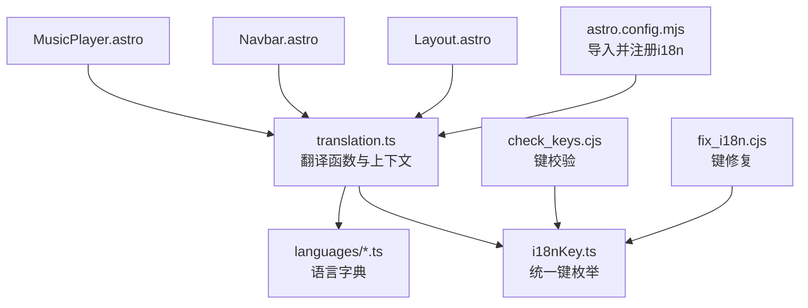
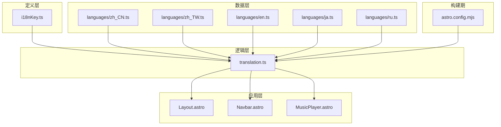
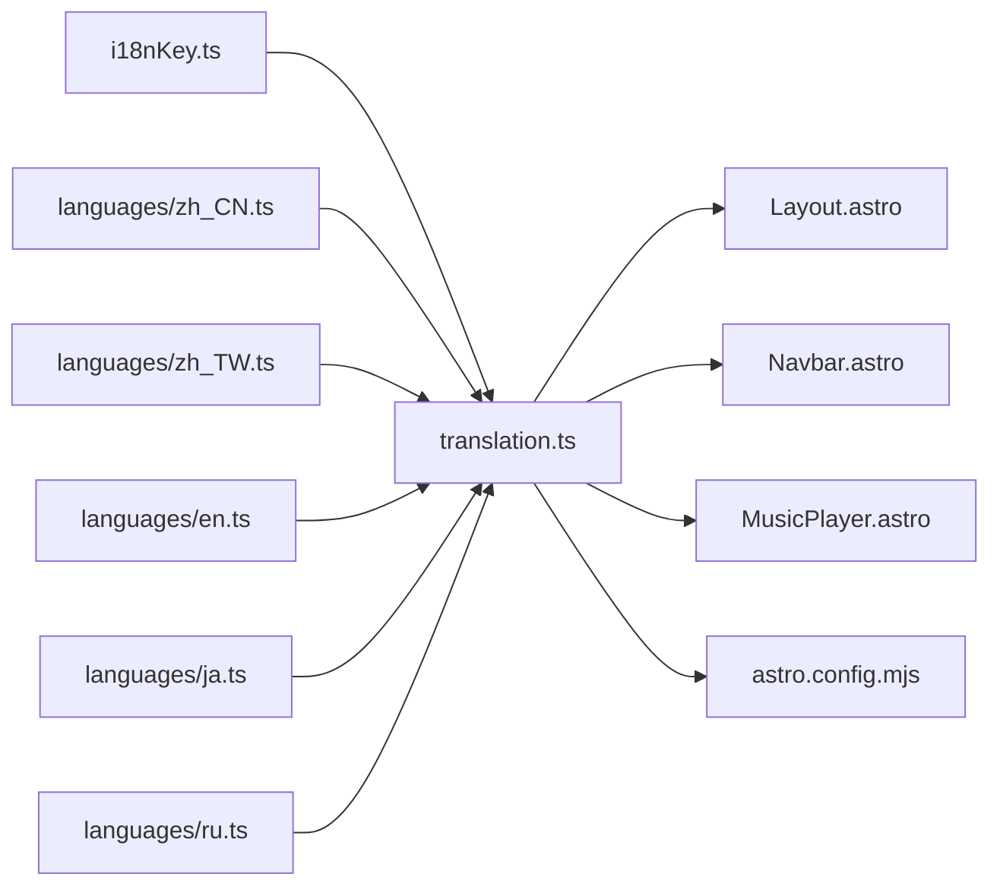

# 国际化支持

<cite>
**本文引用的文件**
- [astro.config.mjs](file://astro.config.mjs)
- [i18nKey.ts](file://src/i18n/i18nKey.ts)
- [translation.ts](file://src/i18n/translation.ts)
- [en.ts](file://src/i18n/languages/en.ts)
- [ja.ts](file://src/i18n/languages/ja.ts)
- [ru.ts](file://src/i18n/languages/ru.ts)
- [zh_CN.ts](file://src/i18n/languages/zh_CN.ts)
- [zh_TW.ts](file://src/i18n/languages/zh_TW.ts)
- [check_keys.cjs](file://check_keys.cjs)
- [fix_i18n.cjs](file://fix_i18n.cjs)
- [Layout.astro](file://src/layouts/Layout.astro)
- [Navbar.astro](file://src/components/layout/Navbar.astro)
- [MusicPlayer.astro](file://src/features/music-visualizer/MusicPlayer.astro)
- [GoogleAnalytics.astro](file://src/components/analytics/GoogleAnalytics.astro)
- [UmamiAnalytics.astro](file://src/components/analytics/UmamiAnalytics.astro)
- [La51Analytics.astro](file://src/components/analytics/La51Analytics.astro)
- [MicrosoftClarity.astro](file://src/components/analytics/MicrosoftClarity.astro)
</cite>

## 目录
1. [简介](#简介)
2. [项目结构](#项目结构)
3. [核心组件](#核心组件)
4. [架构总览](#架构总览)
5. [详细组件分析](#详细组件分析)
6. [依赖关系分析](#依赖关系分析)
7. [性能考量](#性能考量)
8. [故障排查指南](#故障排查指南)
9. [结论](#结论)
10. [附录](#附录)

## 简介
本文件面向Firefly-Mod项目的国际化（i18n）系统，系统性梳理了多语言包管理、动态语言切换、本地化资源组织、文化适配（日期/数字/货币/方向性）、翻译工作流、新增语言支持与维护、性能优化以及测试与验证方法。内容基于仓库中实际存在的国际化文件与Astro配置进行分析，并提供可操作的实践建议。

## 项目结构
国际化相关的核心文件集中在src/i18n目录，配合Astro构建时的i18n集成与前端组件中的使用。关键结构如下：
- src/i18n/i18nKey.ts：统一的翻译键枚举，确保键名一致性与可追踪性
- src/i18n/translation.ts：翻译函数与当前语言上下文管理
- src/i18n/languages/*.ts：各语言的翻译字典（en/ja/ru/zh_CN/zh_TW）
- astro.config.mjs：Astro侧导入并注册i18n，用于静态内容与插件文案的本地化
- check_keys.cjs / fix_i18n.cjs：翻译键校验与修复脚本
- 组件层：Navbar、Layout、MusicPlayer等组件通过i18n函数渲染本地化文案
- 分析发现：站点头部og:locale元信息在构建产物中固定为zh-CN，与运行时i18n切换解耦

图表来源
- [astro.config.mjs](file://astro.config.mjs)
- [translation.ts](file://src/i18n/translation.ts)
- [i18nKey.ts](file://src/i18n/i18nKey.ts)
- [en.ts](file://src/i18n/languages/en.ts)
- [Layout.astro](file://src/layouts/Layout.astro)
- [Navbar.astro](file://src/components/layout/Navbar.astro)
- [MusicPlayer.astro](file://src/features/music-visualizer/MusicPlayer.astro)
- [check_keys.cjs](file://check_keys.cjs)
- [fix_i18n.cjs](file://fix_i18n.cjs)

章节来源
- [astro.config.mjs](file://astro.config.mjs)
- [i18nKey.ts](file://src/i18n/i18nKey.ts)
- [translation.ts](file://src/i18n/translation.ts)
- [en.ts](file://src/i18n/languages/en.ts)
- [ja.ts](file://src/i18n/languages/ja.ts)
- [ru.ts](file://src/i18n/languages/ru.ts)
- [zh_CN.ts](file://src/i18n/languages/zh_CN.ts)
- [zh_TW.ts](file://src/i18n/languages/zh_TW.ts)

## 核心组件
- 翻译键枚举（i18nKey.ts）：集中定义所有翻译键，便于IDE提示、重构与跨文件引用
- 翻译函数（translation.ts）：封装当前语言选择、回退策略、占位符替换与复数形式处理（如适用）
- 语言字典（languages/*.ts）：按语言分文件组织，键值对对应具体语言的翻译
- Astro集成（astro.config.mjs）：在构建期引入i18n，供Expressive Code等插件使用
- 校验与修复脚本（check_keys.cjs / fix_i18n.cjs）：保证键的一致性与完整性

章节来源
- [i18nKey.ts](file://src/i18n/i18nKey.ts)
- [translation.ts](file://src/i18n/translation.ts)
- [check_keys.cjs](file://check_keys.cjs)
- [fix_i18n.cjs](file://fix_i18n.cjs)

## 架构总览
整体架构由“键定义—字典—翻译函数—组件渲染—构建期集成”构成，遵循“键中心、字典分离、函数统一封装”的设计原则。

图表来源
- [i18nKey.ts](file://src/i18n/i18nKey.ts)
- [translation.ts](file://src/i18n/translation.ts)
- [zh_CN.ts](file://src/i18n/languages/zh_CN.ts)
- [zh_TW.ts](file://src/i18n/languages/zh_TW.ts)
- [en.ts](file://src/i18n/languages/en.ts)
- [ja.ts](file://src/i18n/languages/ja.ts)
- [ru.ts](file://src/i18n/languages/ru.ts)
- [Layout.astro](file://src/layouts/Layout.astro)
- [Navbar.astro](file://src/components/layout/Navbar.astro)
- [MusicPlayer.astro](file://src/features/music-visualizer/MusicPlayer.astro)
- [astro.config.mjs](file://astro.config.mjs)

## 详细组件分析

### 翻译键与字典组织
- 键的组织：以i18nKey.ts为唯一事实源，组件与服务通过键获取翻译
- 字典文件：按语言拆分，便于独立维护与审阅；键集合应与i18nKey.ts保持一致
- 命名规范：建议采用层级式命名（如“section.feature.action”），提升可读性与可检索性
- 占位符：统一使用参数化占位符（如“{count}”、“{name}”），避免硬编码拼接
- 复数形式：优先在翻译函数中根据数值与语言规则处理；若语言差异较大，可在字典中提供不同变体键

章节来源
- [i18nKey.ts](file://src/i18n/i18nKey.ts)
- [zh_CN.ts](file://src/i18n/languages/zh_CN.ts)
- [zh_TW.ts](file://src/i18n/languages/zh_TW.ts)
- [en.ts](file://src/i18n/languages/en.ts)
- [ja.ts](file://src/i18n/languages/ja.ts)
- [ru.ts](file://src/i18n/languages/ru.ts)

### 翻译函数与上下文管理
- 上下文选择：translation.ts负责维护当前语言与回退链（如zh_CN → zh → en）
- 渲染调用：组件通过i18n(key, params)获取本地化字符串
- 参数处理：支持占位符替换与类型安全的参数传递
- 复数与性别：可在翻译函数内扩展规则，或在字典中提供多变体键
- 性能：缓存已解析键值，避免重复计算

章节来源
- [translation.ts](file://src/i18n/translation.ts)

### Astro构建期集成
- 插件文案：在astro.config.mjs中通过i18n函数为Expressive Code等插件注入本地化文本
- 集成方式：import i18n与I18nKey后，在插件配置中直接使用i18n(I18nKey.xxx)

章节来源
- [astro.config.mjs](file://astro.config.mjs)

### 组件中的使用示例
- 布局与导航：Layout.astro与Navbar.astro通过i18n渲染标题、菜单项与辅助文本
- 音乐播放器：MusicPlayer.astro使用i18n渲染播放器按钮、歌词与错误提示文案
- 分析发现：站点og:locale在构建产物中固定为zh-CN，与运行时i18n切换解耦，不参与运行时语言切换

章节来源
- [Layout.astro](file://src/layouts/Layout.astro)
- [Navbar.astro](file://src/components/layout/Navbar.astro)
- [MusicPlayer.astro](file://src/features/music-visualizer/MusicPlayer.astro)

### 文化适配（日期/数字/货币/方向性）
- 日期与数字：建议在需要格式化的场景使用Intl.DateTimeFormat与Intl.NumberFormat；在translation.ts中提供格式化辅助函数
- 货币：通过Intl.NumberFormat的style: 'currency'选项，结合语言环境输出
- 方向性：CSS层面通过dir属性与双语排版适配；组件层注意文本截断与省略号方向
- 本地化资源：将格式化模板置于字典中，便于按语言调整

章节来源
- [translation.ts](file://src/i18n/translation.ts)

### 语言切换机制
- 状态管理：建议在顶层组件或全局状态中保存当前语言；切换时更新translation.ts上下文
- 路由处理：可将语言作为路由前缀或查询参数；切换时更新URL并持久化用户偏好
- 组件重渲染：通过响应式状态驱动组件重新渲染；避免不必要的全站刷新
- 页面级切换：切换语言后，页面标题、描述等元信息可通过SSR/SSG阶段的i18n生成

章节来源
- [translation.ts](file://src/i18n/translation.ts)
- [Layout.astro](file://src/layouts/Layout.astro)

### 翻译工作流
- 键提取：使用check_keys.cjs扫描项目，导出缺失或冗余键清单
- 任务分配：以语言字典为单位划分任务，优先补齐缺失键，再进行润色
- 质量控制：通过fix_i18n.cjs自动修复常见问题（如键名不一致、占位符缺失），并结合人工审校
- 版本管理：每次批量修改后，提交变更并标注语言版本

章节来源
- [check_keys.cjs](file://check_keys.cjs)
- [fix_i18n.cjs](file://fix_i18n.cjs)

### 新增语言支持与维护
- 新增语言：在src/i18n/languages下新增语言文件，复制现有字典结构，仅翻译缺失部分
- 维护策略：定期运行check_keys.cjs，确保新功能的键被覆盖；fix_i18n.cjs修复潜在问题
- 审校流程：建立PR审查机制，至少一名母语者审校

章节来源
- [zh_CN.ts](file://src/i18n/languages/zh_CN.ts)
- [en.ts](file://src/i18n/languages/en.ts)
- [check_keys.cjs](file://check_keys.cjs)
- [fix_i18n.cjs](file://fix_i18n.cjs)

### 性能优化
- 按需加载：仅在进入特定页面或切换语言时加载对应语言包，减少初始Bundle体积
- 缓存策略：translation.ts内部缓存已解析键值；浏览器端可缓存最近使用的语言包
- Bundle控制：合并通用键与页面专用键，避免重复；对大字典进行分块加载
- 渲染优化：避免在高频渲染路径中重复调用翻译函数；必要时进行节流或防抖

章节来源
- [translation.ts](file://src/i18n/translation.ts)

### 测试与验证
- 自动化校验：在CI中执行check_keys.cjs，失败即阻断合并
- 人工验收：针对关键页面（首页、文章页、音乐播放器）进行多语言展示验收
- 回归测试：新增键后，运行fix_i18n.cjs并核对差异
- 用户反馈：提供一键切换语言的入口，收集真实使用反馈

章节来源
- [check_keys.cjs](file://check_keys.cjs)
- [fix_i18n.cjs](file://fix_i18n.cjs)

## 依赖关系分析
- translation.ts依赖i18nKey.ts与各语言字典
- 组件通过translation.ts间接依赖i18nKey.ts
- astro.config.mjs依赖translation.ts与i18nKey.ts，用于插件本地化
- 校验脚本依赖i18nKey.ts与语言字典，进行键一致性检查

图表来源
- [i18nKey.ts](file://src/i18n/i18nKey.ts)
- [translation.ts](file://src/i18n/translation.ts)
- [zh_CN.ts](file://src/i18n/languages/zh_CN.ts)
- [zh_TW.ts](file://src/i18n/languages/zh_TW.ts)
- [en.ts](file://src/i18n/languages/en.ts)
- [ja.ts](file://src/i18n/languages/ja.ts)
- [ru.ts](file://src/i18n/languages/ru.ts)
- [Layout.astro](file://src/layouts/Layout.astro)
- [Navbar.astro](file://src/components/layout/Navbar.astro)
- [MusicPlayer.astro](file://src/features/music-visualizer/MusicPlayer.astro)
- [astro.config.mjs](file://astro.config.mjs)

## 性能考量
- 初始加载：仅加载默认语言包；其他语言按需异步加载
- 缓存：translation.ts内部缓存键值；浏览器端可持久化用户偏好的语言包
- 字典体积：拆分页面级字典，避免一次性加载全部键
- 渲染路径：高频渲染组件避免重复翻译；必要时进行节流

## 故障排查指南
- 键缺失：运行check_keys.cjs，对照i18nKey.ts逐项补齐
- 键冲突：fix_i18n.cjs自动修复键名不一致；人工核对占位符与数量
- 组件未更新：确认组件是否通过i18n函数渲染；检查translation.ts上下文是否正确切换
- 构建期文案异常：检查astro.config.mjs中i18n调用是否正确传入I18nKey

章节来源
- [check_keys.cjs](file://check_keys.cjs)
- [fix_i18n.cjs](file://fix_i18n.cjs)
- [translation.ts](file://src/i18n/translation.ts)
- [astro.config.mjs](file://astro.config.mjs)

## 结论
本项目的国际化体系以“键中心、字典分离、函数统一封装”为核心，结合Astro构建期集成与组件渲染，形成了清晰、可维护且可扩展的i18n架构。建议在现有基础上完善语言切换的前端状态管理与路由集成，并持续通过自动化脚本保障键的一致性与完整性。

## 附录
- 术语
  - 键：翻译标识符，唯一对应一个文案片段
  - 字典：某语言下的键值对集合
  - 上下文：当前语言与回退链的组合
- 最佳实践
  - 保持i18nKey.ts为唯一事实源
  - 在translation.ts中集中处理占位符与复数
  - 使用脚本自动化校验与修复
  - 对高频渲染路径进行性能优化