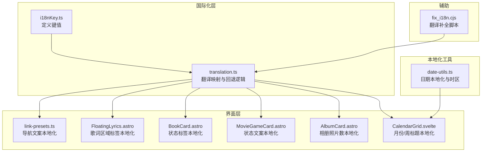
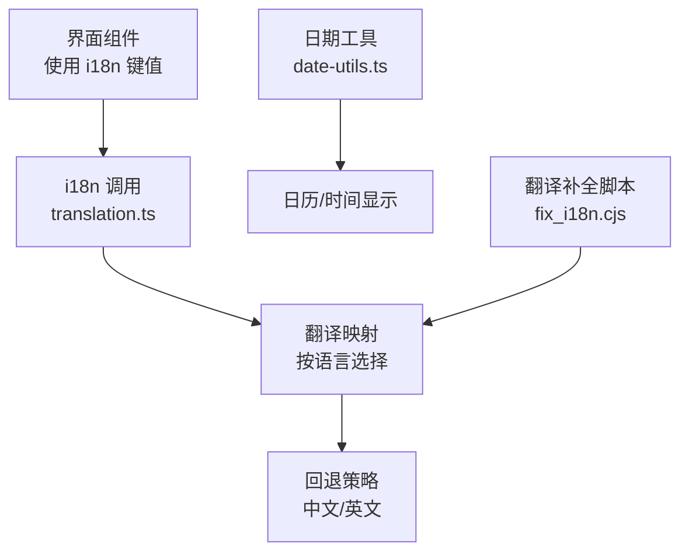
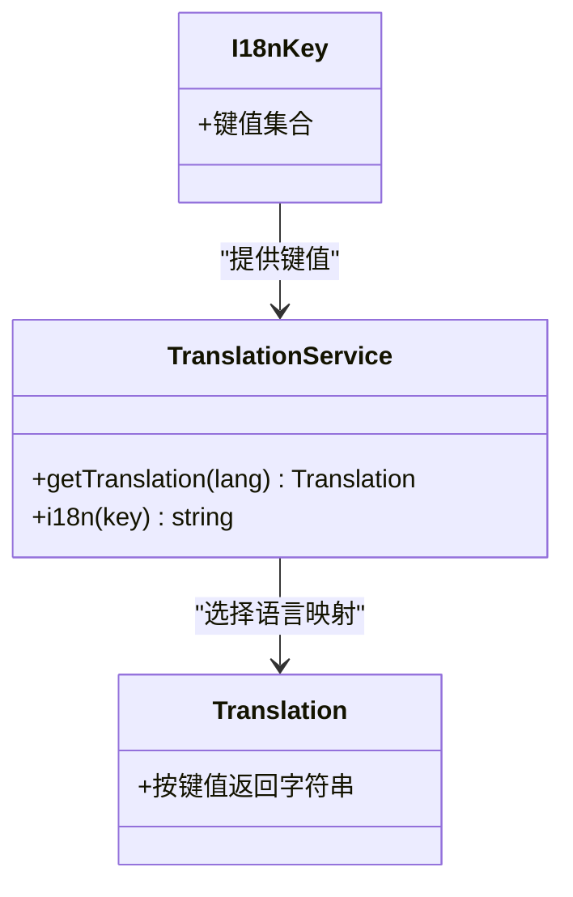
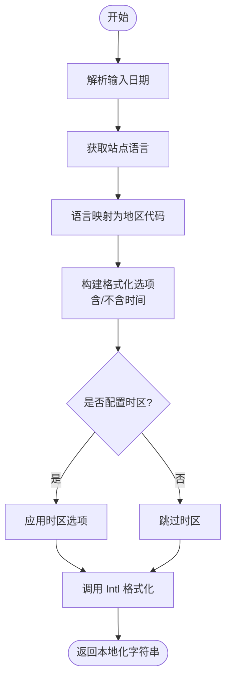
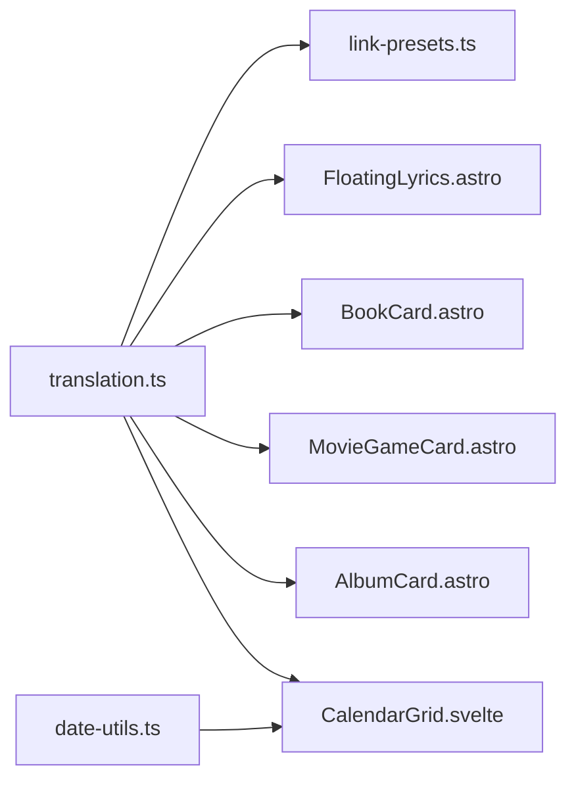
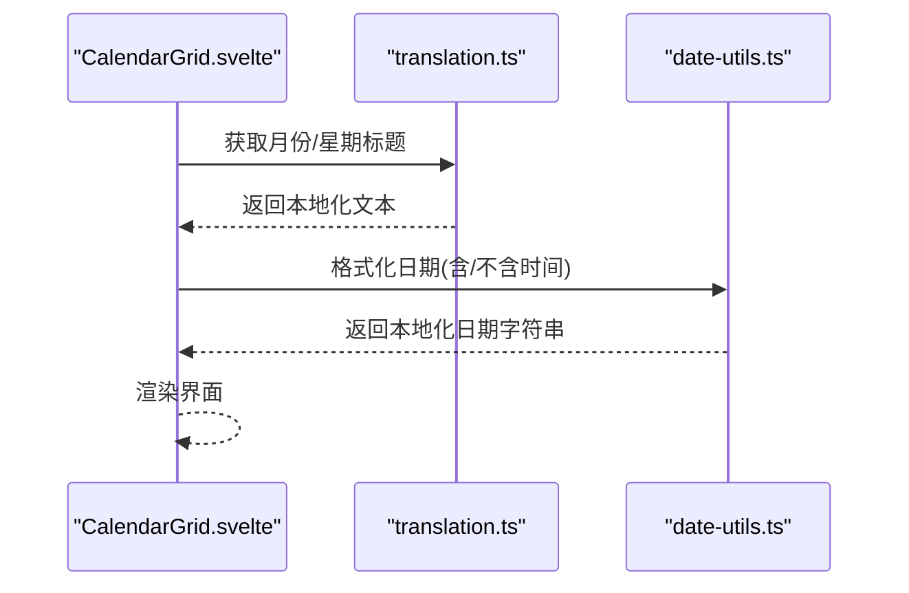

# 文化适配处理

<cite>
**本文引用的文件**
- [src/utils/date-utils.ts](file://src/utils/date-utils.ts)
- [src/i18n/translation.ts](file://src/i18n/translation.ts)
- [src/i18n/i18nKey.ts](file://src/i18n/i18nKey.ts)
- [src/constants/link-presets.ts](file://src/constants/link-presets.ts)
- [src/components/features/FloatingLyrics.astro](file://src/components/features/FloatingLyrics.astro)
- [src/components/pages/books/BookCard.astro](file://src/components/pages/books/BookCard.astro)
- [src/components/pages/movies-games/MovieGameCard.astro](file://src/components/pages/movies-games/MovieGameCard.astro)
- [src/components/pages/gallery/AlbumCard.astro](file://src/components/pages/gallery/AlbumCard.astro)
- [src/components/pages/calendar/CalendarGrid.svelte](file://src/components/pages/calendar/CalendarGrid.svelte)
- [fix_i18n.cjs](file://fix_i18n.cjs)
</cite>

## 目录
1. [简介](#简介)
2. [项目结构](#项目结构)
3. [核心组件](#核心组件)
4. [架构总览](#架构总览)
5. [详细组件分析](#详细组件分析)
6. [依赖关系分析](#依赖关系分析)
7. [性能考量](#性能考量)
8. [故障排查指南](#故障排查指南)
9. [结论](#结论)
10. [附录](#附录)

## 简介
本文件面向Firefly-Mod的文化适配处理系统，系统性梳理并解释项目中的国际化与本地化实现，覆盖以下主题：
- 日期格式化与本地化显示（含时区支持）
- 数字与货币格式化的本地化策略
- 文本方向（LTR/RTL）支持与布局适配
- 复数形式处理机制（规则、条件与动态生成）
- 特殊字符与符号的本地化（标点、引号、Unicode）
- 文化适配的测试与验证流程

说明：经对仓库源码的全面检索，发现项目中存在明确的国际化键值体系与翻译映射、日期本地化工具、以及多处使用i18n键值渲染界面文本的组件；但未发现专门的“数字/货币格式化”与“复数规则处理”的通用模块；同时，也未发现显式的“文本方向（LTR/RTL）切换与CSS类应用”的实现。因此，本文在相应章节给出基于现有代码的实现现状说明，并提供可扩展的建议与最佳实践。

## 项目结构
围绕文化适配的关键目录与文件如下：
- 国际化键值与翻译映射：src/i18n/i18nKey.ts、src/i18n/translation.ts
- 日期本地化工具：src/utils/date-utils.ts
- 常量与导航链接的本地化：src/constants/link-presets.ts
- 使用i18n键值渲染界面文本的组件示例：src/components/features/FloatingLyrics.astro、src/components/pages/books/BookCard.astro、src/components/pages/movies-games/MovieGameCard.astro、src/components/pages/gallery/AlbumCard.astro、src/components/pages/calendar/CalendarGrid.svelte
- 翻译补全脚本：fix_i18n.cjs

**图表来源**
- [src/i18n/i18nKey.ts:1-435](file://src/i18n/i18nKey.ts#L1-L435)
- [src/i18n/translation.ts:1-46](file://src/i18n/translation.ts#L1-L46)
- [src/utils/date-utils.ts:1-60](file://src/utils/date-utils.ts#L1-L60)
- [src/constants/link-presets.ts:1-52](file://src/constants/link-presets.ts#L1-L52)
- [src/components/features/FloatingLyrics.astro:1-23](file://src/components/features/FloatingLyrics.astro#L1-L23)
- [src/components/pages/books/BookCard.astro:1-45](file://src/components/pages/books/BookCard.astro#L1-L45)
- [src/components/pages/movies-games/MovieGameCard.astro:1-52](file://src/components/pages/movies-games/MovieGameCard.astro#L1-L52)
- [src/components/pages/gallery/AlbumCard.astro:1-55](file://src/components/pages/gallery/AlbumCard.astro#L1-L55)
- [src/components/pages/calendar/CalendarGrid.svelte:50-96](file://src/components/pages/calendar/CalendarGrid.svelte#L50-L96)
- [fix_i18n.cjs:23-41](file://fix_i18n.cjs#L23-L41)

**章节来源**
- [src/i18n/i18nKey.ts:1-435](file://src/i18n/i18nKey.ts#L1-L435)
- [src/i18n/translation.ts:1-46](file://src/i18n/translation.ts#L1-L46)
- [src/utils/date-utils.ts:1-60](file://src/utils/date-utils.ts#L1-L60)
- [src/constants/link-presets.ts:1-52](file://src/constants/link-presets.ts#L1-L52)
- [src/components/features/FloatingLyrics.astro:1-23](file://src/components/features/FloatingLyrics.astro#L1-L23)
- [src/components/pages/books/BookCard.astro:1-45](file://src/components/pages/books/BookCard.astro#L1-L45)
- [src/components/pages/movies-games/MovieGameCard.astro:1-52](file://src/components/pages/movies-games/MovieGameCard.astro#L1-L52)
- [src/components/pages/gallery/AlbumCard.astro:1-55](file://src/components/pages/gallery/AlbumCard.astro#L1-L55)
- [src/components/pages/calendar/CalendarGrid.svelte:50-96](file://src/components/pages/calendar/CalendarGrid.svelte#L50-L96)
- [fix_i18n.cjs:23-41](file://fix_i18n.cjs#L23-L41)

## 核心组件
- 国际化键值体系：通过集中式枚举定义所有可翻译键值，保证键名一致性与覆盖率。
- 翻译映射与回退：根据当前语言选择对应翻译对象，若目标语言缺失则回退到中文或英文。
- 日期本地化工具：基于Intl.DateTimeFormat与站点配置的locale与时区，统一输出本地化日期/时间。
- 界面本地化渲染：大量组件通过i18n键值渲染文案，形成一致的本地化体验。
- 翻译补全脚本：自动化检测缺失键值并补充默认翻译，提升维护效率。

**章节来源**
- [src/i18n/i18nKey.ts:1-435](file://src/i18n/i18nKey.ts#L1-L435)
- [src/i18n/translation.ts:1-46](file://src/i18n/translation.ts#L1-L46)
- [src/utils/date-utils.ts:1-60](file://src/utils/date-utils.ts#L1-L60)
- [fix_i18n.cjs:23-41](file://fix_i18n.cjs#L23-L41)

## 架构总览
文化适配系统采用“键值定义—翻译映射—界面渲染—工具支撑”的分层架构：
- 键值层：集中管理所有可翻译键值，避免重复与遗漏。
- 翻译层：按语言映射到具体翻译对象，提供回退策略。
- 渲染层：在组件中以键值调用i18n函数获取本地化文本。
- 工具层：提供日期本地化与翻译补全脚本，保障一致性与完整性。

**图表来源**
- [src/i18n/translation.ts:1-46](file://src/i18n/translation.ts#L1-L46)
- [src/utils/date-utils.ts:1-60](file://src/utils/date-utils.ts#L1-L60)
- [fix_i18n.cjs:23-41](file://fix_i18n.cjs#L23-L41)

## 详细组件分析

### 国际化键值与翻译映射
- 键值定义：集中于i18nKey.ts，涵盖页面标题、导航、卡片状态、日历等广泛场景。
- 翻译映射：translation.ts提供多语言映射与回退逻辑，优先使用当前语言，否则回退至中文或英文。
- 使用方式：组件通过i18n函数传入键值获取本地化文本，如导航栏、状态标签、日历标题等。

**图表来源**
- [src/i18n/i18nKey.ts:1-435](file://src/i18n/i18nKey.ts#L1-L435)
- [src/i18n/translation.ts:1-46](file://src/i18n/translation.ts#L1-L46)

**章节来源**
- [src/i18n/i18nKey.ts:1-435](file://src/i18n/i18nKey.ts#L1-L435)
- [src/i18n/translation.ts:1-46](file://src/i18n/translation.ts#L1-L46)

### 日期格式化与本地化显示
- 语言映射：通过localeMap将站点语言代码映射为Intl可识别的地区代码。
- 选项配置：根据是否包含时间，动态启用小时/分钟/秒字段。
- 时区支持：若站点配置了时区（IANA字符串），则在格式化时应用该时区。
- 输出结果：统一使用toLocaleDateString或toLocaleString输出本地化日期/时间。

**图表来源**
- [src/utils/date-utils.ts:1-60](file://src/utils/date-utils.ts#L1-L60)

**章节来源**
- [src/utils/date-utils.ts:1-60](file://src/utils/date-utils.ts#L1-L60)

### 数字与货币格式化（现状与建议）
- 现状：仓库中未发现专门的数字/货币格式化模块。日期格式化使用Intl，其他数值显示多为直接拼接字符串。
- 建议：
  - 引入Intl.NumberFormat与Intl.RelativeTimeFormat，分别处理数字、货币、百分比与相对时间。
  - 在站点配置中增加货币类型与小数/千分位规则，按语言自动切换。
  - 对于复数规则，建议在需要的场景引入Pluralization规则库或自建规则表，按语言映射复数类别。

[本节为概念性建议，不直接分析具体文件，故无“章节来源”]

### 文本方向（LTR/RTL）支持（现状与建议）
- 现状：仓库中未发现显式的LTR/RTL切换逻辑与CSS类应用。
- 建议：
  - 在根元素上根据语言动态添加dir属性（如ar-SA设为rtl）。
  - 提供CSS类切换（如ltr/rtl），并在布局组件中按需应用。
  - 对于复杂文本（混合阿拉伯语与数字），使用unicode-bidi控制文本方向。

[本节为概念性建议，不直接分析具体文件，故无“章节来源”]

### 复数形式处理（现状与建议）
- 现状：仓库中未发现通用的复数规则处理模块。个别组件通过状态码映射展示不同标签文本，但未体现复数规则。
- 建议：
  - 引入Intl.PluralRules或第三方库，按语言返回复数类别（零、一、二、多等）。
  - 在翻译键值中为不同复数类别提供对应文案，或在渲染前根据数量计算类别并选择文案。
  - 对于动态生成的复数文本，建议在服务端或构建期生成多语言版本，减少前端分支判断。

[本节为概念性建议，不直接分析具体文件，故无“章节来源”]

### 特殊字符与符号的本地化（标点、引号、Unicode）
- 现状：仓库中未发现专门的特殊字符本地化模块。日历组件使用i18n键值渲染月份与星期标题，未见针对标点与引号的特殊处理。
- 建议：
  - 引入Unicode本地化库，按语言自动替换引号、省略号、顿号等标点。
  - 对于阿拉伯语等从右到左语言，确保括号与引号方向正确。
  - 对特殊Unicode字符（如emoji）进行兼容性测试，避免在不同字体/平台下的显示差异。

[本节为概念性建议，不直接分析具体文件，故无“章节来源”]

### 翻译补全与质量保障
- 自动化补全：fix_i18n.cjs脚本会检测缺失键值并补充默认翻译，有助于保持翻译完整性。
- 建议：
  - 在CI中加入翻译键值扫描与缺失检测任务。
  - 对新增键值强制要求在所有语言中补齐，避免回退到默认语言。

**章节来源**
- [fix_i18n.cjs:23-41](file://fix_i18n.cjs#L23-L41)

## 依赖关系分析
- 组件依赖翻译服务：多个组件通过i18n函数渲染本地化文本，形成对translation.ts的强依赖。
- 日历组件依赖日期工具：CalendarGrid.svelte使用date-utils.ts提供的本地化日期格式化能力。
- 导航预设依赖翻译键值：link-presets.ts通过i18n键值生成导航文案。

**图表来源**
- [src/i18n/translation.ts:1-46](file://src/i18n/translation.ts#L1-L46)
- [src/constants/link-presets.ts:1-52](file://src/constants/link-presets.ts#L1-L52)
- [src/components/features/FloatingLyrics.astro:1-23](file://src/components/features/FloatingLyrics.astro#L1-L23)
- [src/components/pages/books/BookCard.astro:1-45](file://src/components/pages/books/BookCard.astro#L1-L45)
- [src/components/pages/movies-games/MovieGameCard.astro:1-52](file://src/components/pages/movies-games/MovieGameCard.astro#L1-L52)
- [src/components/pages/gallery/AlbumCard.astro:1-55](file://src/components/pages/gallery/AlbumCard.astro#L1-L55)
- [src/components/pages/calendar/CalendarGrid.svelte:50-96](file://src/components/pages/calendar/CalendarGrid.svelte#L50-L96)
- [src/utils/date-utils.ts:1-60](file://src/utils/date-utils.ts#L1-L60)

**章节来源**
- [src/i18n/translation.ts:1-46](file://src/i18n/translation.ts#L1-L46)
- [src/constants/link-presets.ts:1-52](file://src/constants/link-presets.ts#L1-L52)
- [src/components/features/FloatingLyrics.astro:1-23](file://src/components/features/FloatingLyrics.astro#L1-L23)
- [src/components/pages/books/BookCard.astro:1-45](file://src/components/pages/books/BookCard.astro#L1-L45)
- [src/components/pages/movies-games/MovieGameCard.astro:1-52](file://src/components/pages/movies-games/MovieGameCard.astro#L1-L52)
- [src/components/pages/gallery/AlbumCard.astro:1-55](file://src/components/pages/gallery/AlbumCard.astro#L1-L55)
- [src/components/pages/calendar/CalendarGrid.svelte:50-96](file://src/components/pages/calendar/CalendarGrid.svelte#L50-L96)
- [src/utils/date-utils.ts:1-60](file://src/utils/date-utils.ts#L1-L60)

## 性能考量
- 翻译缓存：translation.ts按语言缓存翻译对象，避免重复映射开销。
- 日期格式化：date-utils.ts复用Intl实例，减少重复初始化成本。
- 组件渲染：大量使用i18n键值渲染，建议在构建期进行键值校验，降低运行时错误与回退次数。

[本节提供一般性指导，不直接分析具体文件，故无“章节来源”]

## 故障排查指南
- 翻译缺失：若某键值在当前语言中缺失，translation.ts会回退到中文或英文。可通过fix_i18n.cjs补全缺失键值。
- 日期显示异常：检查站点配置中的语言与时区设置，确认localeMap映射正确且时区字符串有效。
- 文本方向问题：若出现阿拉伯语或希伯来语文本方向错误，需在根元素上设置dir属性并应用相应的CSS类。

**章节来源**
- [src/i18n/translation.ts:1-46](file://src/i18n/translation.ts#L1-L46)
- [src/utils/date-utils.ts:1-60](file://src/utils/date-utils.ts#L1-L60)
- [fix_i18n.cjs:23-41](file://fix_i18n.cjs#L23-L41)

## 结论
- 项目已建立完善的国际化键值体系与翻译映射，并在多处组件中落地使用。
- 日期本地化具备时区支持，满足跨时区展示需求。
- 数字/货币格式化、复数规则、文本方向与特殊字符本地化尚未有通用模块实现，建议后续按需引入或扩展。
- 建议在CI中强化翻译键值与本地化质量检查，确保多语言一致性与稳定性。

[本节为总结性内容，不直接分析具体文件，故无“章节来源”]

## 附录
- 关键流程示意：日历组件加载时，先通过translation.ts获取月份与星期标题，再由date-utils.ts输出本地化日期字符串，最终渲染到界面。

**图表来源**
- [src/components/pages/calendar/CalendarGrid.svelte:50-96](file://src/components/pages/calendar/CalendarGrid.svelte#L50-L96)
- [src/i18n/translation.ts:1-46](file://src/i18n/translation.ts#L1-L46)
- [src/utils/date-utils.ts:1-60](file://src/utils/date-utils.ts#L1-L60)