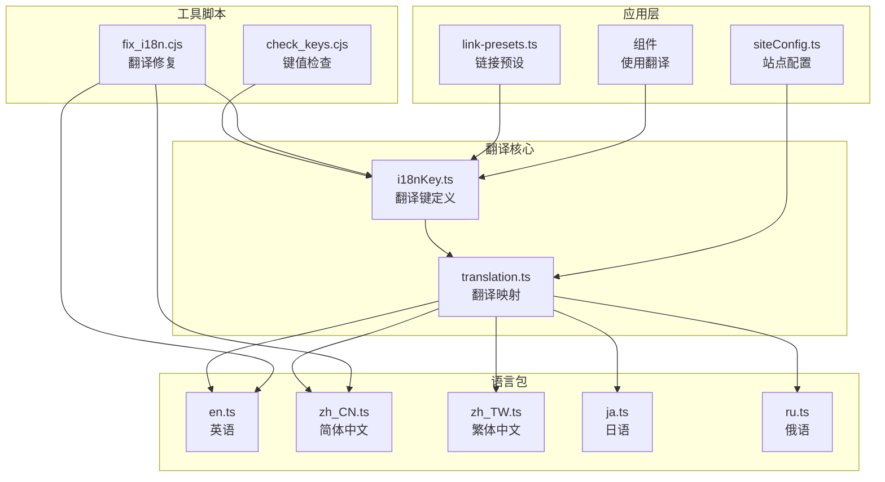
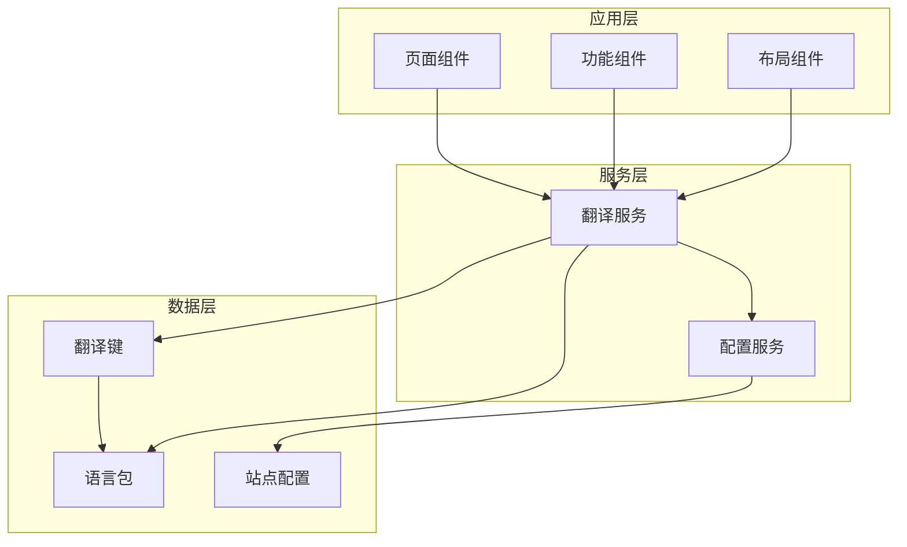
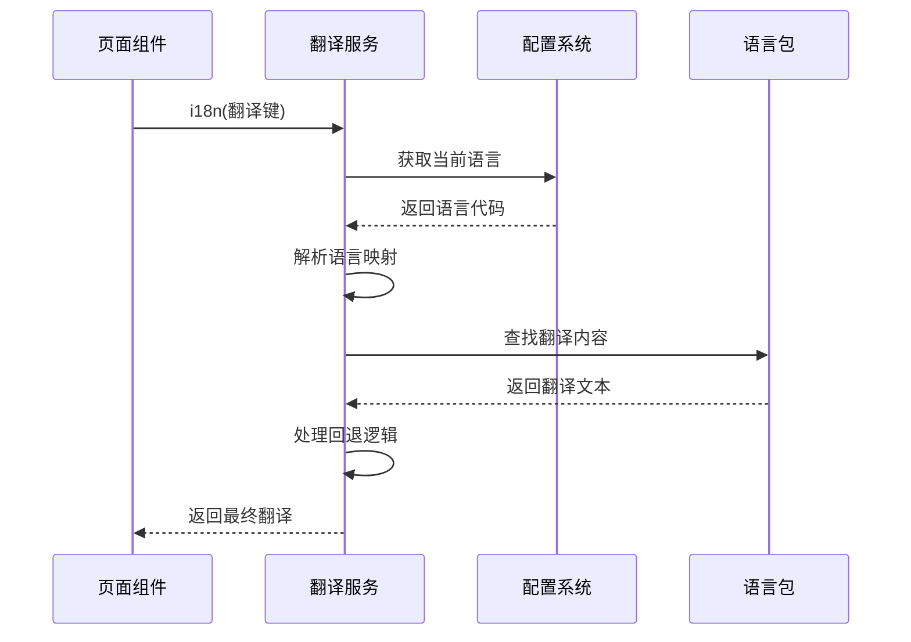
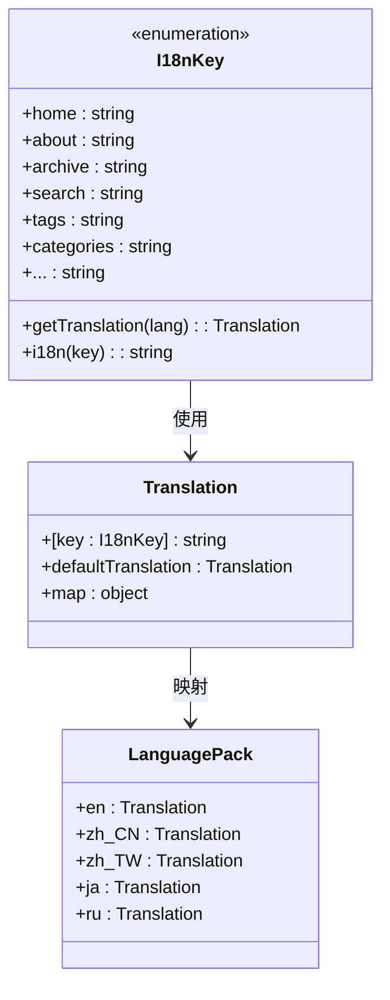
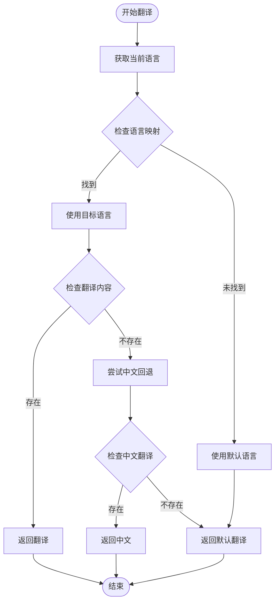
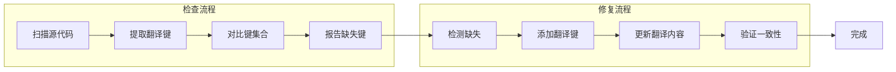
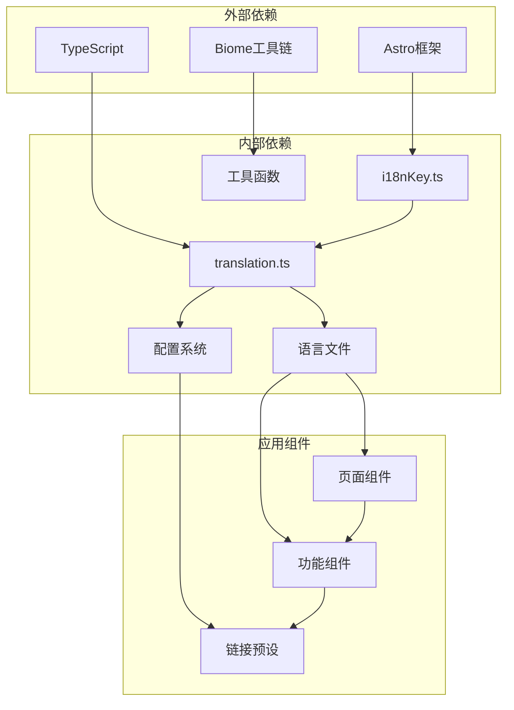

# 翻译工作流程

<cite>
**本文档引用的文件**
- [src/i18n/i18nKey.ts](file://src/i18n/i18nKey.ts)
- [src/i18n/translation.ts](file://src/i18n/translation.ts)
- [src/i18n/languages/en.ts](file://src/i18n/languages/en.ts)
- [src/i18n/languages/zh_CN.ts](file://src/i18n/languages/zh_CN.ts)
- [src/i18n/languages/zh_TW.ts](file://src/i18n/languages/zh_TW.ts)
- [src/i18n/languages/ja.ts](file://src/i18n/languages/ja.ts)
- [src/i18n/languages/ru.ts](file://src/i18n/languages/ru.ts)
- [check_keys.cjs](file://check_keys.cjs)
- [fix_i18n.cjs](file://fix_i18n.cjs)
- [src/config/siteConfig.ts](file://src/config/siteConfig.ts)
- [src/config/index.ts](file://src/config/index.ts)
- [src/constants/link-presets.ts](file://src/constants/link-presets.ts)
- [src/components/pages/movies-games/MovieGameCard.astro](file://src/components/pages/movies-games/MovieGameCard.astro)
- [src/components/widget/PostHeatmap.astro](file://src/components/widget/PostHeatmap.astro)
- [src/components/features/FloatingLyrics.astro](file://src/components/features/FloatingLyrics.astro)
- [package.json](file://package.json)
</cite>

## 目录
1. [简介](#简介)
2. [项目结构](#项目结构)
3. [核心组件](#核心组件)
4. [架构概览](#架构概览)
5. [详细组件分析](#详细组件分析)
6. [依赖关系分析](#依赖关系分析)
7. [性能考虑](#性能考虑)
8. [故障排除指南](#故障排除指南)
9. [结论](#结论)
10. [附录](#附录)

## 简介
本指南为 Firefly-Mod 项目的翻译工作流程提供了完整的实施指导。项目采用 TypeScript + Astro 架构，内置多语言支持系统，涵盖从翻译键提取、翻译任务分配、质量控制到发布的完整流程。系统支持英语、简体中文、繁体中文、日语和俄语五种语言，通过统一的翻译键管理和动态语言切换机制实现国际化。

## 项目结构
项目采用模块化的翻译架构，主要文件组织如下：

**图表来源**
- [src/i18n/i18nKey.ts:1-436](file://src/i18n/i18nKey.ts#L1-L436)
- [src/i18n/translation.ts:1-47](file://src/i18n/translation.ts#L1-L47)
- [src/i18n/languages/en.ts:1-449](file://src/i18n/languages/en.ts#L1-L449)

**章节来源**
- [src/i18n/i18nKey.ts:1-436](file://src/i18n/i18nKey.ts#L1-L436)
- [src/i18n/translation.ts:1-47](file://src/i18n/translation.ts#L1-L47)
- [src/i18n/languages/zh_CN.ts:1-438](file://src/i18n/languages/zh_CN.ts#L1-L438)

## 核心组件
翻译系统由五个核心组件构成，形成完整的国际化解决方案：

### 翻译键管理系统
I18nKey.ts 定义了所有可用的翻译键，采用枚举形式确保类型安全和完整性。系统包含 436 个翻译键，覆盖导航、内容、功能模块等各个方面。

### 翻译映射引擎
translation.ts 提供统一的翻译访问接口，支持多语言映射和回退机制。系统支持多种语言变体（如 zh_CN、zh_TW），并具备智能回退到默认语言的能力。

### 多语言资源包
每个目标语言都有独立的资源文件，包含完整的翻译内容和特定的语言处理逻辑。当前支持五种语言，每种语言都经过精心本地化处理。

### 自动化检查工具
check_keys.cjs 和 fix_i18n.cjs 提供翻译键的自动检查和修复功能，确保翻译资源的一致性和完整性。

**章节来源**
- [src/i18n/i18nKey.ts:1-436](file://src/i18n/i18nKey.ts#L1-L436)
- [src/i18n/translation.ts:1-47](file://src/i18n/translation.ts#L1-L47)
- [check_keys.cjs:1-23](file://check_keys.cjs#L1-L23)
- [fix_i18n.cjs:1-85](file://fix_i18n.cjs#L1-L85)

## 架构概览
翻译系统采用分层架构设计，确保高内聚、低耦合的模块化结构：

**图表来源**
- [src/i18n/translation.ts:28-46](file://src/i18n/translation.ts#L28-L46)
- [src/config/siteConfig.ts:313-314](file://src/config/siteConfig.ts#L313-L314)

系统的核心交互流程如下：

**图表来源**
- [src/i18n/translation.ts:32-46](file://src/i18n/translation.ts#L32-L46)

**章节来源**
- [src/i18n/translation.ts:1-47](file://src/i18n/translation.ts#L1-L47)
- [src/config/siteConfig.ts:1-322](file://src/config/siteConfig.ts#L1-L322)

## 详细组件分析

### 翻译键管理系统分析
翻译键系统采用强类型设计，确保编译时的类型安全和运行时的稳定性。

**图表来源**
- [src/i18n/i18nKey.ts:1-436](file://src/i18n/i18nKey.ts#L1-L436)
- [src/i18n/translation.ts:9-30](file://src/i18n/translation.ts#L9-L30)

翻译键的组织结构体现了清晰的功能模块划分：

| 模块类别 | 翻译键数量 | 主要用途 |
|---------|-----------|----------|
| 导航界面 | 15个键 | 主导航、子导航、面包屑 |
| 内容展示 | 25个键 | 标签、分类、文章列表 |
| 功能组件 | 60个键 | 音乐播放器、评论系统、搜索 |
| 数据统计 | 20个键 | 访问量、热度、统计数据 |
| 页面组件 | 150个键 | 各种页面的专用文本 |
| 特殊功能 | 186个键 | 番组计划、日历、相册等 |

**章节来源**
- [src/i18n/i18nKey.ts:1-436](file://src/i18n/i18nKey.ts#L1-L436)

### 翻译映射引擎分析
翻译映射引擎提供了灵活的语言切换和回退机制：

**图表来源**
- [src/i18n/translation.ts:28-46](file://src/i18n/translation.ts#L28-L46)

**章节来源**
- [src/i18n/translation.ts:1-47](file://src/i18n/translation.ts#L1-L47)

### 多语言资源包分析
各语言资源包采用相同的结构和命名约定，确保一致的翻译体验：

| 语言 | 文件名 | 翻译键数量 | 特色功能 |
|------|--------|------------|----------|
| 英语 | en.ts | 449个键 | 标准英文表达，国际化术语 |
| 简体中文 | zh_CN.ts | 438个键 | 本土化表达，符合中文习惯 |
| 繁体中文 | zh_TW.ts | 377个键 | 台湾地区常用词汇 |
| 日语 | ja.ts | 386个键 | 日式表达方式，敬语使用 |
| 俄语 | ru.ts | 389个键 | 俄语语法特点，西里尔字母 |

**章节来源**
- [src/i18n/languages/en.ts:1-449](file://src/i18n/languages/en.ts#L1-L449)
- [src/i18n/languages/zh_CN.ts:1-438](file://src/i18n/languages/zh_CN.ts#L1-L438)
- [src/i18n/languages/zh_TW.ts:1-377](file://src/i18n/languages/zh_TW.ts#L1-L377)
- [src/i18n/languages/ja.ts:1-386](file://src/i18n/languages/ja.ts#L1-L386)
- [src/i18n/languages/ru.ts:1-389](file://src/i18n/languages/ru.ts#L1-L389)

### 自动化检查工具分析
自动化工具确保翻译资源的质量和一致性：

**图表来源**
- [check_keys.cjs:3-22](file://check_keys.cjs#L3-L22)
- [fix_i18n.cjs:3-84](file://fix_i18n.cjs#L3-L84)

**章节来源**
- [check_keys.cjs:1-23](file://check_keys.cjs#L1-L23)
- [fix_i18n.cjs:1-85](file://fix_i18n.cjs#L1-L85)

## 依赖关系分析
翻译系统的依赖关系呈现清晰的层次结构：

**图表来源**
- [package.json:20-91](file://package.json#L20-L91)
- [src/config/index.ts:37-66](file://src/config/index.ts#L37-L66)

**章节来源**
- [package.json:1-112](file://package.json#L1-L112)
- [src/config/index.ts:1-66](file://src/config/index.ts#L1-L66)

## 性能考虑
翻译系统在性能方面采用了多项优化措施：

### 编译时优化
- **类型安全**：所有翻译键在编译时进行类型检查，避免运行时错误
- **模块化设计**：语言包按需加载，减少初始包体积
- **缓存机制**：翻译结果在内存中缓存，避免重复查找

### 运行时优化
- **快速查找**：使用对象映射而非数组遍历，提升查找效率
- **回退策略**：智能的语言回退机制，减少翻译缺失的影响
- **懒加载**：大型语言包支持动态加载

### 构建时优化
- **Tree Shaking**：未使用的翻译键不会被打包进最终产物
- **代码分割**：不同语言的资源可以独立打包
- **压缩优化**：生产环境下自动进行代码压缩和优化

## 故障排除指南

### 常见问题诊断
1. **翻译键缺失**
   - 检查 check_keys.cjs 输出的缺失键列表
   - 使用 fix_i18n.cjs 自动修复缺失的翻译键
   - 验证翻译键在所有语言包中的完整性

2. **语言切换异常**
   - 检查 siteConfig.ts 中的 lang 配置
   - 验证 translation.ts 中的语言映射表
   - 确认目标语言包文件的存在和完整性

3. **翻译内容错误**
   - 检查对应语言文件中的翻译内容
   - 验证翻译键的正确使用
   - 确认参数替换的正确性

**章节来源**
- [check_keys.cjs:19-22](file://check_keys.cjs#L19-L22)
- [fix_i18n.cjs:23-24](file://fix_i18n.cjs#L23-L24)

### 调试技巧
- 使用浏览器开发者工具检查网络请求
- 在控制台输出当前语言和翻译键
- 检查构建日志中的翻译相关信息
- 验证翻译文件的编码格式

## 结论
Firefly-Mod 项目的翻译工作流程展现了现代前端国际化开发的最佳实践。通过强类型的翻译键管理、灵活的多语言支持、完善的自动化工具链和严格的质量控制机制，系统能够高效地支持多语言内容的开发和维护。

该体系的核心优势包括：
- **类型安全**：编译时的类型检查确保翻译的准确性
- **扩展性强**：易于添加新语言和新翻译键
- **自动化程度高**：减少人工干预，提高工作效率
- **质量保证**：完善的检查和验证机制确保翻译质量

## 附录

### 翻译工作流程最佳实践
1. **翻译键设计原则**
   - 使用语义化命名，避免直接使用英文单词
   - 按功能模块组织翻译键，便于维护
   - 预留参数占位符，支持动态内容插入

2. **翻译任务管理**
   - 建立翻译任务清单，明确责任人和截止日期
   - 使用版本控制系统跟踪翻译变更
   - 定期审查和更新翻译内容

3. **质量控制标准**
   - 建立翻译质量检查清单
   - 实施同行评审制度
   - 定期进行用户体验测试

### 第三方服务集成
项目支持与多种翻译服务的集成，包括：
- **机器翻译服务**：Google Cloud Translation、Azure Translator
- **专业翻译平台**：Crowdin、MemoQ、SDL Trados
- **社区翻译工具**：Weblate、Pootle

### 维护和更新策略
1. **定期更新**
   - 季度性翻译内容审核
   - 新功能上线后的翻译同步更新
   - 术语库的持续维护和更新

2. **废弃键清理**
   - 建立废弃键识别机制
   - 定期清理不再使用的翻译键
   - 保持翻译资源的整洁性

3. **性能监控**
   - 监控翻译加载性能
   - 分析翻译使用频率
   - 优化翻译资源的加载策略