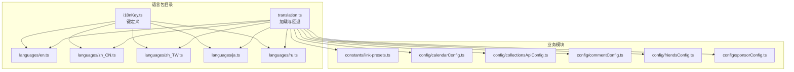
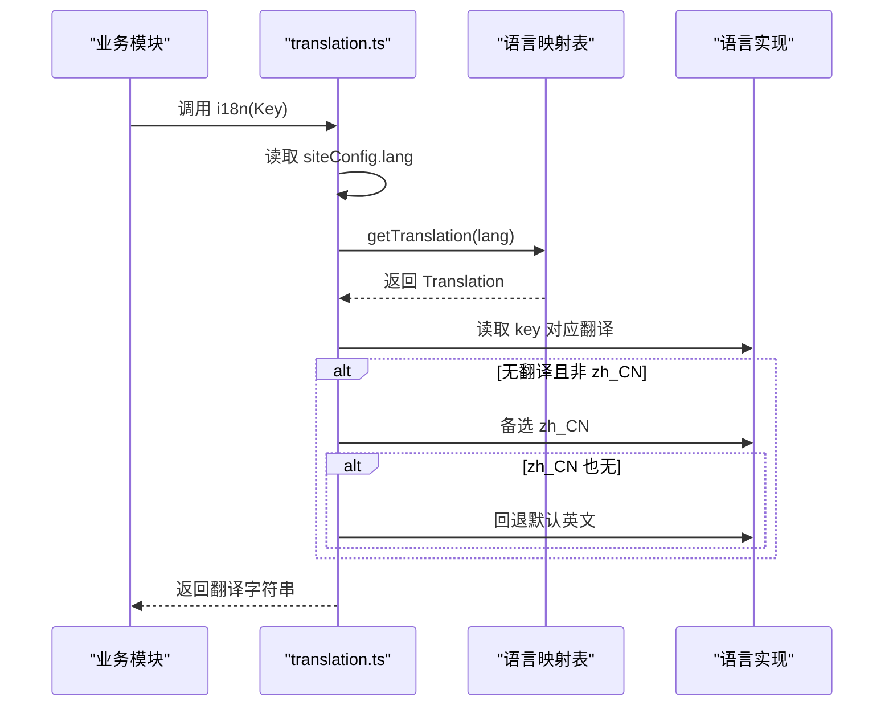
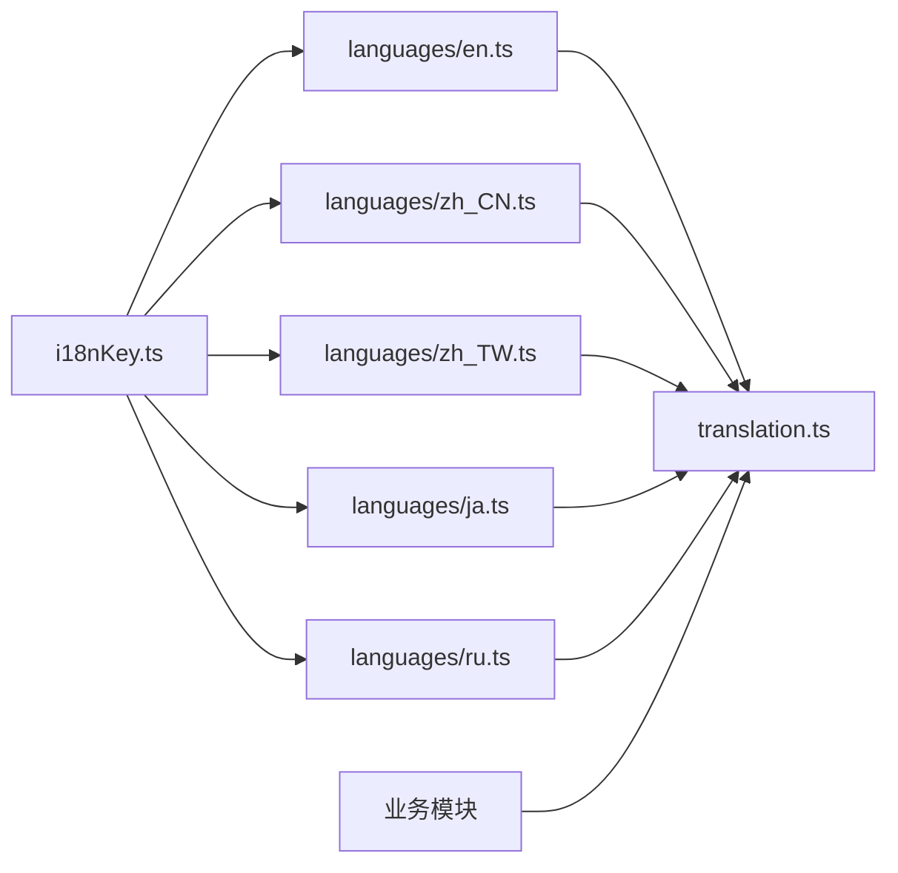

# 语言包管理

<cite>
**本文引用的文件**
- [src/i18n/translation.ts](file://src/i18n/translation.ts)
- [src/i18n/i18nKey.ts](file://src/i18n/i18nKey.ts)
- [src/i18n/languages/en.ts](file://src/i18n/languages/en.ts)
- [src/i18n/languages/zh_CN.ts](file://src/i18n/languages/zh_CN.ts)
- [src/i18n/languages/zh_TW.ts](file://src/i18n/languages/zh_TW.ts)
- [src/i18n/languages/ja.ts](file://src/i18n/languages/ja.ts)
- [src/i18n/languages/ru.ts](file://src/i18n/languages/ru.ts)
- [src/constants/link-presets.ts](file://src/constants/link-presets.ts)
- [src/config/calendarConfig.ts](file://src/config/calendarConfig.ts)
- [src/config/collectionsApiConfig.ts](file://src/config/collectionsApiConfig.ts)
- [src/config/commentConfig.ts](file://src/config/commentConfig.ts)
- [src/config/friendsConfig.ts](file://src/config/friendsConfig.ts)
- [src/config/sponsorConfig.ts](file://src/config/sponsorConfig.ts)
</cite>

## 目录
1. [简介](#简介)
2. [项目结构](#项目结构)
3. [核心组件](#核心组件)
4. [架构概览](#架构概览)
5. [详细组件分析](#详细组件分析)
6. [依赖关系分析](#依赖关系分析)
7. [性能考虑](#性能考虑)
8. [故障排查指南](#故障排查指南)
9. [结论](#结论)
10. [附录](#附录)

## 简介
本文件面向 Firefly-Mod 的语言包管理系统，系统性阐述多语言包的组织结构、文件命名规范、翻译键值对定义方式；详解语言包加载机制（含按需加载策略、缓存与内存管理）、翻译键命名约定与冲突处理；给出维护最佳实践（翻译质量控制、键值对版本管理与批量更新流程）；说明新增语言支持的步骤（文件创建、初始化与测试验证）；并提供性能优化策略（Tree Shaking、懒加载与 Bundle 分割）。

## 项目结构
语言包相关代码集中在 src/i18n 目录，采用“键定义 + 多语言实现 + 加载与回退逻辑”的三层结构：
- 键定义层：统一的 I18nKey 枚举，确保所有语言文件共享同一套键集合。
- 语言实现层：按语言拆分的翻译对象，分别导出对应语言的 Translation 实例。
- 加载与回退层：根据当前语言映射到具体语言对象，并在缺失翻译时提供备选语言（默认英文，以及中文备选）。

图表来源
- [src/i18n/translation.ts:1-47](file://src/i18n/translation.ts#L1-L47)
- [src/i18n/i18nKey.ts:1-436](file://src/i18n/i18nKey.ts#L1-L436)
- [src/i18n/languages/en.ts:1-449](file://src/i18n/languages/en.ts#L1-L449)
- [src/i18n/languages/zh_CN.ts:1-438](file://src/i18n/languages/zh_CN.ts#L1-L438)
- [src/i18n/languages/zh_TW.ts:1-377](file://src/i18n/languages/zh_TW.ts#L1-L377)
- [src/i18n/languages/ja.ts:1-386](file://src/i18n/languages/ja.ts#L1-L386)
- [src/i18n/languages/ru.ts:1-389](file://src/i18n/languages/ru.ts#L1-L389)
- [src/constants/link-presets.ts:1-71](file://src/constants/link-presets.ts#L1-L71)
- [src/config/calendarConfig.ts:1-10](file://src/config/calendarConfig.ts#L1-L10)
- [src/config/collectionsApiConfig.ts:1-10](file://src/config/collectionsApiConfig.ts#L1-L10)
- [src/config/commentConfig.ts:1-50](file://src/config/commentConfig.ts#L1-L50)
- [src/config/friendsConfig.ts:1-10](file://src/config/friendsConfig.ts#L1-L10)
- [src/config/sponsorConfig.ts:1-10](file://src/config/sponsorConfig.ts#L1-L10)

章节来源
- [src/i18n/translation.ts:1-47](file://src/i18n/translation.ts#L1-L47)
- [src/i18n/i18nKey.ts:1-436](file://src/i18n/i18nKey.ts#L1-L436)

## 核心组件
- 键定义（I18nKey）
  - 以枚举形式集中声明所有翻译键，保证跨语言一致性与编译期校验能力。
  - 键名采用语义化命名，覆盖导航、页面、组件、功能模块等场景。
- 类型与映射（Translation 与 getTranslation）
  - Translation 将 I18nKey 映射到字符串，确保类型安全。
  - getTranslation 提供语言到翻译对象的映射表，支持多种语言变体（如 zh_cn、en_us 等）。
- 回退策略（i18n）
  - 优先使用当前语言；若无对应翻译且非 zh_CN，则回退到 zh_CN；否则回退到默认英文。
- 语言实现（各语言文件）
  - 每个语言文件导入 I18nKey 并导出对应 Translation 对象，键值一一对应。

章节来源
- [src/i18n/i18nKey.ts:1-436](file://src/i18n/i18nKey.ts#L1-L436)
- [src/i18n/translation.ts:9-46](file://src/i18n/translation.ts#L9-L46)
- [src/i18n/languages/en.ts:1-449](file://src/i18n/languages/en.ts#L1-L449)
- [src/i18n/languages/zh_CN.ts:1-438](file://src/i18n/languages/zh_CN.ts#L1-L438)
- [src/i18n/languages/zh_TW.ts:1-377](file://src/i18n/languages/zh_TW.ts#L1-L377)
- [src/i18n/languages/ja.ts:1-386](file://src/i18n/languages/ja.ts#L1-L386)
- [src/i18n/languages/ru.ts:1-389](file://src/i18n/languages/ru.ts#L1-L389)

## 架构概览
语言包系统遵循“键中心、语言分散、加载统一、回退兜底”的设计原则。业务模块通过统一入口 i18n 获取翻译，无需感知具体语言实现细节。

图表来源
- [src/i18n/translation.ts:28-46](file://src/i18n/translation.ts#L28-L46)

章节来源
- [src/i18n/translation.ts:1-47](file://src/i18n/translation.ts#L1-L47)

## 详细组件分析

### 键定义与命名规范
- 命名风格
  - 使用语义化英文标识，避免缩写与歧义；例如 home、about、archive、search 等。
  - 模块化分组：导航类（home、about、archive）、页面类（rss、calendar）、组件类（music、gallery）、功能类（sponsor、bangumi）等。
- 层级与组织
  - 采用扁平枚举，不引入嵌套层级；通过语义组合表达上下文（如 musicPlayMode、calendarJanuary）。
- 重复键与冲突处理
  - 由于采用统一枚举，天然避免重复键；若出现同名不同义，应在枚举层面修正，确保键唯一。
- 版本管理
  - 枚举变更属于破坏性修改，需配合迁移脚本与回归测试。

章节来源
- [src/i18n/i18nKey.ts:1-436](file://src/i18n/i18nKey.ts#L1-L436)

### 语言实现与文件组织
- 文件命名规范
  - 语言文件按语言代码命名，如 zh_CN.ts、en.ts、ja.ts、ru.ts、zh_TW.ts。
- 结构与职责
  - 每个文件导入 I18nKey 与 Translation 类型，导出对应语言的 Translation 对象。
  - 键值对严格一一对应，保持与 I18nKey 的一致性。
- 示例语言文件
  - 英文：覆盖导航、页面、组件、功能等全量键。
  - 中文简体/繁体：覆盖导航、页面、组件、功能等全量键。
  - 日语/俄语：覆盖导航、页面、组件、功能等全量键。

章节来源
- [src/i18n/languages/en.ts:1-449](file://src/i18n/languages/en.ts#L1-L449)
- [src/i18n/languages/zh_CN.ts:1-438](file://src/i18n/languages/zh_CN.ts#L1-L438)
- [src/i18n/languages/zh_TW.ts:1-377](file://src/i18n/languages/zh_TW.ts#L1-L377)
- [src/i18n/languages/ja.ts:1-386](file://src/i18n/languages/ja.ts#L1-L386)
- [src/i18n/languages/ru.ts:1-389](file://src/i18n/languages/ru.ts#L1-L389)

### 加载机制与回退策略
- 语言映射
  - translation.ts 定义语言到翻译对象的映射表，支持多种语言变体（如 zh_cn、en_us 等）。
- 加载流程
  - i18n 函数读取 siteConfig.lang，调用 getTranslation 获取对应 Translation。
  - 若当前语言无对应翻译，且非 zh_CN，则回退 zh_CN；否则回退默认英文。
- 缓存与内存管理
  - 语言对象在模块级别常驻，避免重复解析与实例化。
  - 业务侧建议仅在需要时调用 i18n，减少不必要的字符串拼接与模板渲染压力。

章节来源
- [src/i18n/translation.ts:15-46](file://src/i18n/translation.ts#L15-L46)

### 业务模块集成点
- 导航与链接
  - constants/link-presets.ts 通过 i18n 与 I18nKey 生成导航名称。
- 页面配置
  - config/*.ts 中的页面标题/描述字段支持留空使用 i18n 翻译，提升灵活性。

章节来源
- [src/constants/link-presets.ts:1-71](file://src/constants/link-presets.ts#L1-L71)
- [src/config/calendarConfig.ts:1-10](file://src/config/calendarConfig.ts#L1-L10)
- [src/config/collectionsApiConfig.ts:1-10](file://src/config/collectionsApiConfig.ts#L1-L10)
- [src/config/commentConfig.ts:1-50](file://src/config/commentConfig.ts#L1-L50)
- [src/config/friendsConfig.ts:1-10](file://src/config/friendsConfig.ts#L1-L10)
- [src/config/sponsorConfig.ts:1-10](file://src/config/sponsorConfig.ts#L1-L10)

## 依赖关系分析
- 组件耦合
  - 语言实现文件仅依赖 I18nKey 与 Translation 类型，低耦合、高内聚。
  - translation.ts 依赖各语言实现与 siteConfig，承担统一入口职责。
- 直接与间接依赖
  - translation.ts 直接依赖各语言实现；间接被业务模块（导航、配置等）依赖。
- 潜在循环依赖
  - 语言实现文件之间无直接相互依赖，不会形成循环。
- 外部依赖
  - siteConfig 由站点配置提供，translation.ts 通过其决定当前语言。

图表来源
- [src/i18n/i18nKey.ts:1-436](file://src/i18n/i18nKey.ts#L1-L436)
- [src/i18n/translation.ts:1-47](file://src/i18n/translation.ts#L1-L47)
- [src/i18n/languages/en.ts:1-449](file://src/i18n/languages/en.ts#L1-L449)
- [src/i18n/languages/zh_CN.ts:1-438](file://src/i18n/languages/zh_CN.ts#L1-L438)
- [src/i18n/languages/zh_TW.ts:1-377](file://src/i18n/languages/zh_TW.ts#L1-L377)
- [src/i18n/languages/ja.ts:1-386](file://src/i18n/languages/ja.ts#L1-L386)
- [src/i18n/languages/ru.ts:1-389](file://src/i18n/languages/ru.ts#L1-L389)

章节来源
- [src/i18n/translation.ts:1-47](file://src/i18n/translation.ts#L1-L47)

## 性能考虑
- Tree Shaking
  - 语言实现文件导出独立对象，打包器可基于静态分析按需剔除未使用的语言实现。
- 懒加载
  - 可将语言实现改为动态导入（按需加载），在用户切换语言或进入特定页面时再加载对应语言包，降低初始包体积。
- Bundle 分割
  - 将各语言文件拆分为独立 chunk，结合路由或页面维度进行代码分割，进一步缩小首屏体积。
- 内存管理
  - 语言对象常驻，避免频繁创建；可通过应用生命周期在切换语言时复用已有对象。
- 渲染优化
  - 在业务模块中延迟计算翻译字符串，避免在高频渲染路径中重复拼接。

## 故障排查指南
- 症状：页面显示英文键名而非翻译
  - 排查要点：确认 siteConfig.lang 是否正确；检查 translation.ts 中 getTranslation 是否命中目标语言；确认语言文件是否包含对应键。
- 症状：部分文案缺失
  - 排查要点：检查 i18n 回退逻辑是否触发；确认 zh_CN 是否包含对应键；必要时在 zh_CN 中补齐。
- 症状：新增键后编译报错
  - 排查要点：确认 i18nKey.ts 是否已添加新键；各语言文件是否同步更新；是否存在拼写错误。
- 症状：切换语言无效
  - 排查要点：确认 getTranslation 的语言变体映射是否覆盖；确认业务侧是否重新渲染。

章节来源
- [src/i18n/translation.ts:28-46](file://src/i18n/translation.ts#L28-L46)
- [src/i18n/i18nKey.ts:1-436](file://src/i18n/i18nKey.ts#L1-L436)

## 结论
Firefly-Mod 的语言包系统以统一键定义为核心，辅以清晰的文件组织与稳健的加载回退机制，既保证了多语言一致性，又便于扩展与维护。通过合理的性能优化策略与完善的维护流程，可在保证用户体验的同时，持续提升系统的可维护性与可扩展性。

## 附录

### 新增语言支持流程
- 创建语言文件
  - 在 src/i18n/languages 下新建 {lang}.ts，导入 I18nKey 与 Translation，导出 Translation 对象。
- 更新映射表
  - 在 translation.ts 的 map 中添加语言到实现的映射。
- 配置回退策略
  - 如需特殊回退规则，在 getTranslation 或 i18n 中补充。
- 验证与测试
  - 在业务模块中调用 i18n 验证关键文案；在不同语言间切换验证回退逻辑。

章节来源
- [src/i18n/translation.ts:15-30](file://src/i18n/translation.ts#L15-L30)
- [src/i18n/languages/en.ts:1-449](file://src/i18n/languages/en.ts#L1-L449)