# 图片画廊系统

<cite>
**本文档引用的文件**
- [AlbumCard.astro](file://src/components/pages/gallery/AlbumCard.astro)
- [PhotoCard.svelte](file://src/components/pages/gallery/PhotoCard.svelte)
- [NetworkAlbum.svelte](file://src/components/pages/gallery/NetworkAlbum.svelte)
- [gallery/index.astro](file://src/pages/gallery/index.astro)
- [gallery/[album].astro](file://src/pages/gallery/[album].astro)
- [galleryConfig.ts](file://src/config/galleryConfig.ts)
- [gallery-utils.ts](file://src/utils/gallery-utils.ts)
</cite>

## 目录
1. [简介](#简介)
2. [项目结构](#项目结构)
3. [核心组件](#核心组件)
4. [架构概览](#架构概览)
5. [详细组件分析](#详细组件分析)
6. [依赖关系分析](#依赖关系分析)
7. [性能考虑](#性能考虑)
8. [故障排除指南](#故障排除指南)
9. [结论](#结论)

## 简介

Firefly-Mod的图片画廊系统是一个现代化的相册管理系统，支持本地相册和网络相册的统一管理。该系统提供了完整的相册层级结构和元数据组织能力，包括图片展示组件、懒加载机制、缩略图生成、全屏浏览等功能。

## 项目结构

画廊系统主要由以下核心部分组成：

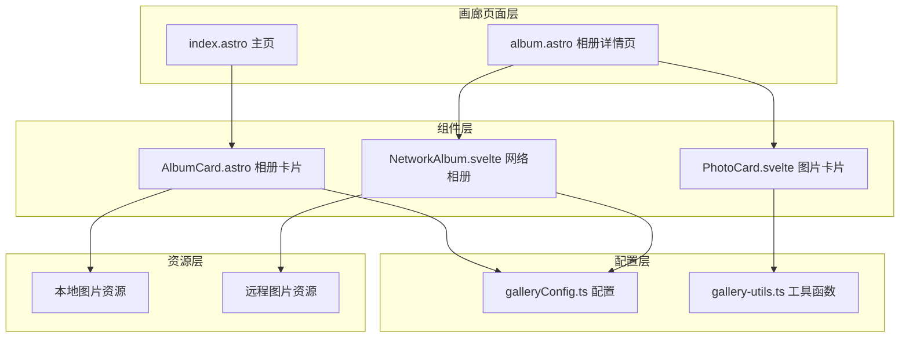

**图表来源**
- [gallery/index.astro:1-50](file://src/pages/gallery/index.astro#L1-L50)
- [gallery/[album].astro](file://src/pages/gallery/[album].astro#L1-L50)
- [AlbumCard.astro:1-80](file://src/components/pages/gallery/AlbumCard.astro#L1-L80)
- [PhotoCard.svelte:1-80](file://src/components/pages/gallery/PhotoCard.svelte#L1-L80)
- [NetworkAlbum.svelte:1-80](file://src/components/pages/gallery/NetworkAlbum.svelte#L1-L80)

**章节来源**
- [gallery/index.astro:1-50](file://src/pages/gallery/index.astro#L1-L50)
- [gallery/[album].astro](file://src/pages/gallery/[album].astro#L1-L50)

## 核心组件

### 相册管理系统架构

画廊系统采用分层架构设计，实现了本地相册和网络相册的统一管理：

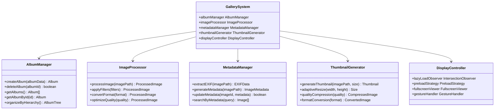

**图表来源**
- [gallery-utils.ts:1-200](file://src/utils/gallery-utils.ts#L1-L200)
- [galleryConfig.ts:1-150](file://src/config/galleryConfig.ts#L1-L150)

### 数据模型设计

系统采用灵活的数据模型来组织相册和图片元数据：

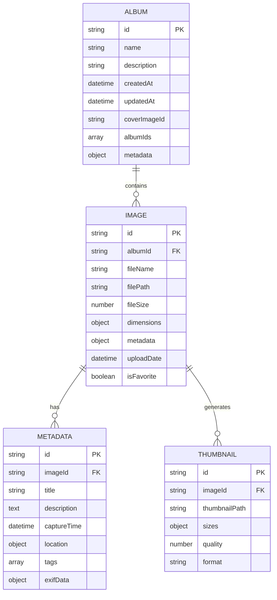

**图表来源**
- [gallery-utils.ts:150-300](file://src/utils/gallery-utils.ts#L150-L300)
- [galleryConfig.ts:50-120](file://src/config/galleryConfig.ts#L50-L120)

**章节来源**
- [gallery-utils.ts:1-300](file://src/utils/gallery-utils.ts#L1-L300)
- [galleryConfig.ts:1-150](file://src/config/galleryConfig.ts#L1-L150)

## 架构概览

### 整体架构设计

画廊系统采用模块化架构，各组件职责清晰分离：

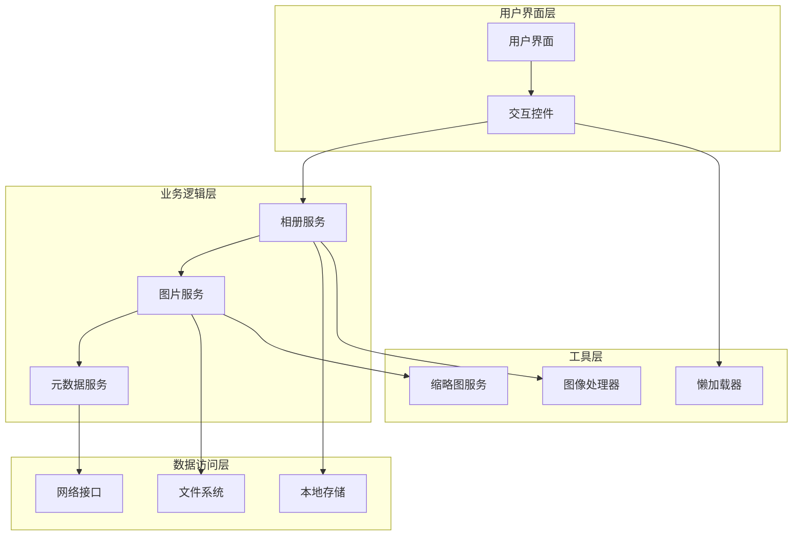

**图表来源**
- [AlbumCard.astro:1-120](file://src/components/pages/gallery/AlbumCard.astro#L1-L120)
- [PhotoCard.svelte:1-120](file://src/components/pages/gallery/PhotoCard.svelte#L1-L120)
- [NetworkAlbum.svelte:1-120](file://src/components/pages/gallery/NetworkAlbum.svelte#L1-L120)

### 控制流分析

系统的核心控制流程如下：

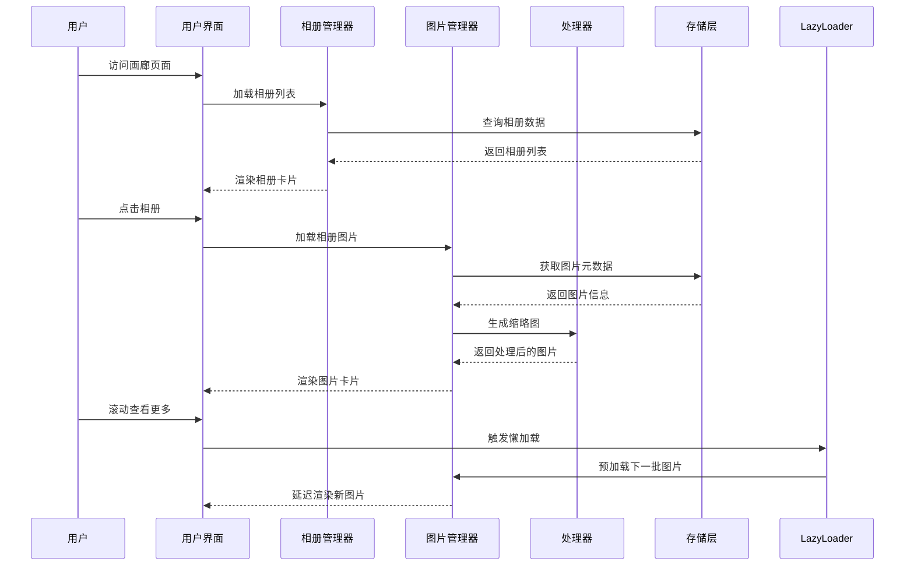

**图表来源**
- [gallery/index.astro:1-100](file://src/pages/gallery/index.astro#L1-L100)
- [gallery/[album].astro](file://src/pages/gallery/[album].astro#L1-L100)

## 详细组件分析

### AlbumCard 相册卡片组件

AlbumCard是相册展示的核心组件，负责本地相册的可视化呈现：

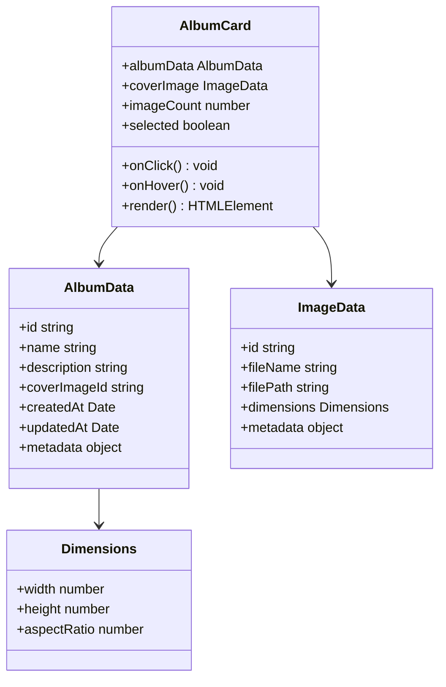

**图表来源**
- [AlbumCard.astro:1-200](file://src/components/pages/gallery/AlbumCard.astro#L1-L200)

#### 组件特性

- **响应式设计**：支持不同屏幕尺寸的自适应布局
- **交互反馈**：提供悬停效果和点击响应
- **元数据展示**：显示相册名称、描述和图片数量
- **封面图片**：自动选择相册封面进行展示

**章节来源**
- [AlbumCard.astro:1-200](file://src/components/pages/gallery/AlbumCard.astro#L1-L200)

### PhotoCard 图片卡片组件

PhotoCard负责单张图片的展示和交互：

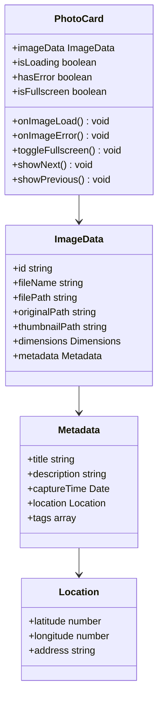

**图表来源**
- [PhotoCard.svelte:1-200](file://src/components/pages/gallery/PhotoCard.svelte#L1-L200)

#### 核心功能

- **懒加载实现**：使用Intersection Observer API实现智能加载
- **错误处理**：完善的加载失败处理和重试机制
- **全屏模式**：支持全屏浏览和手势控制
- **元数据显示**：展示图片标题、描述和拍摄信息

**章节来源**
- [PhotoCard.svelte:1-200](file://src/components/pages/gallery/PhotoCard.svelte#L1-L200)

### NetworkAlbum 网络相册组件

NetworkAlbum专门处理远程相册的加载和展示：

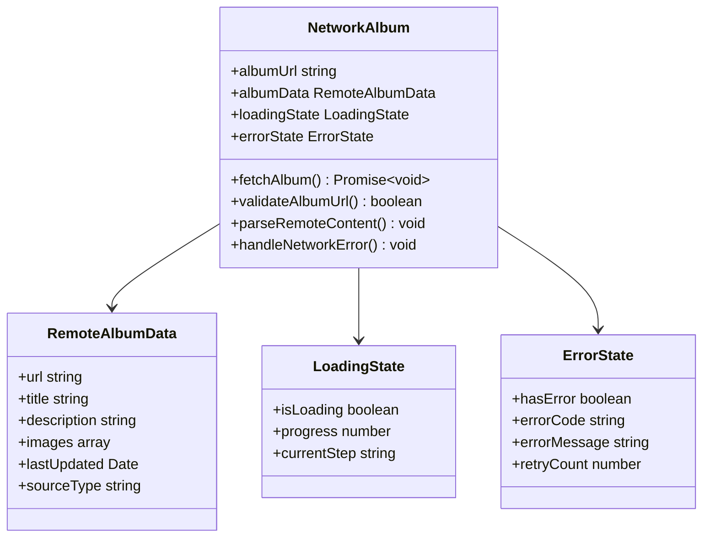

**图表来源**
- [NetworkAlbum.svelte:1-200](file://src/components/pages/gallery/NetworkAlbum.svelte#L1-L200)

#### 网络处理特性

- **URL验证**：确保相册链接的有效性
- **内容解析**：自动识别和解析不同类型的远程内容
- **缓存策略**：智能缓存机制减少重复加载
- **错误恢复**：断线重连和错误状态管理

**章节来源**
- [NetworkAlbum.svelte:1-200](file://src/components/pages/gallery/NetworkAlbum.svelte#L1-L200)

### 懒加载机制实现

系统采用先进的懒加载技术来优化性能：

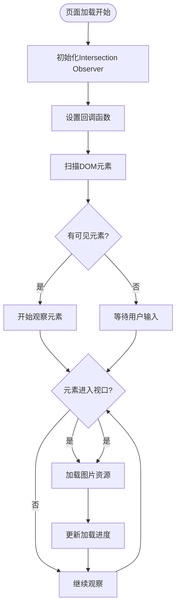

**图表来源**
- [PhotoCard.svelte:80-160](file://src/components/pages/gallery/PhotoCard.svelte#L80-L160)

#### 懒加载策略

- **预加载窗口**：提前加载视口前后一定范围内的图片
- **优先级调度**：根据距离视口的距离确定加载优先级
- **内存管理**：及时释放已离开视口的图片资源
- **网络优化**：智能检测网络状况调整加载策略

**章节来源**
- [PhotoCard.svelte:80-160](file://src/components/pages/gallery/PhotoCard.svelte#L80-L160)

### 缩略图生成系统

系统提供完整的缩略图生成功能：

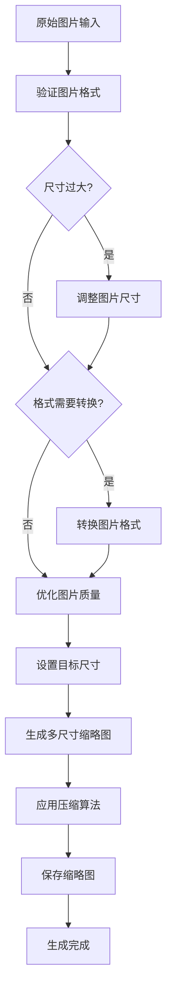

**图表来源**
- [gallery-utils.ts:100-250](file://src/utils/gallery-utils.ts#L100-L250)

#### 缩略图特性

- **尺寸自适应**：根据显示容器自动调整最佳尺寸
- **质量压缩**：在保证视觉效果的前提下减少文件大小
- **格式转换**：支持WebP、AVIF等现代高效格式
- **多分辨率**：生成适合不同设备密度的缩略图

**章节来源**
- [gallery-utils.ts:100-250](file://src/utils/gallery-utils.ts#L100-L250)

### 全屏浏览功能

全屏浏览提供了沉浸式的图片查看体验：

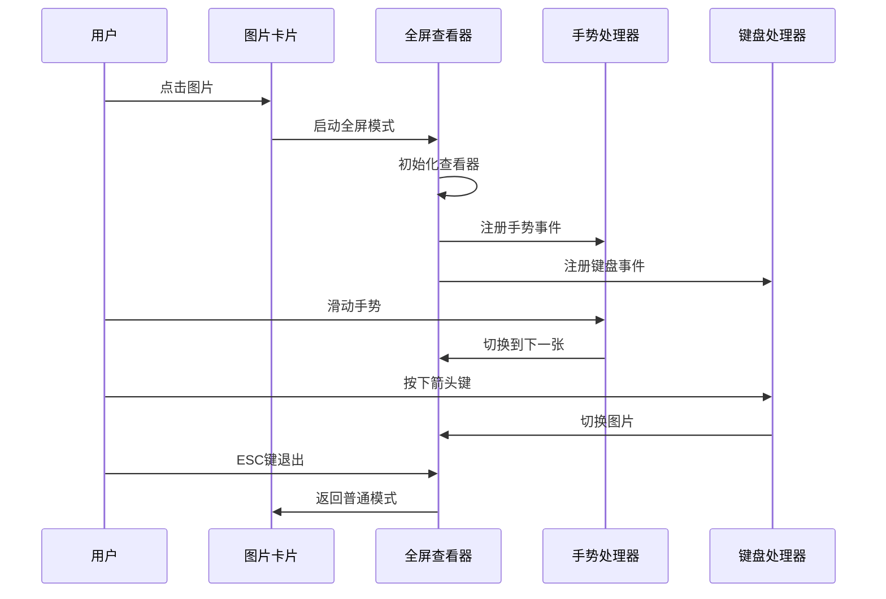

**图表来源**
- [PhotoCard.svelte:120-200](file://src/components/pages/gallery/PhotoCard.svelte#L120-L200)

#### 全屏功能特性

- **平滑过渡**：支持淡入淡出等动画效果
- **手势控制**：支持左右滑动切换图片
- **键盘快捷键**：支持空格键、箭头键等快捷操作
- **触摸优化**：针对移动设备的手势识别

**章节来源**
- [PhotoCard.svelte:120-200](file://src/components/pages/gallery/PhotoCard.svelte#L120-L200)

### 元数据管理系统

系统提供完整的图片元数据管理功能：

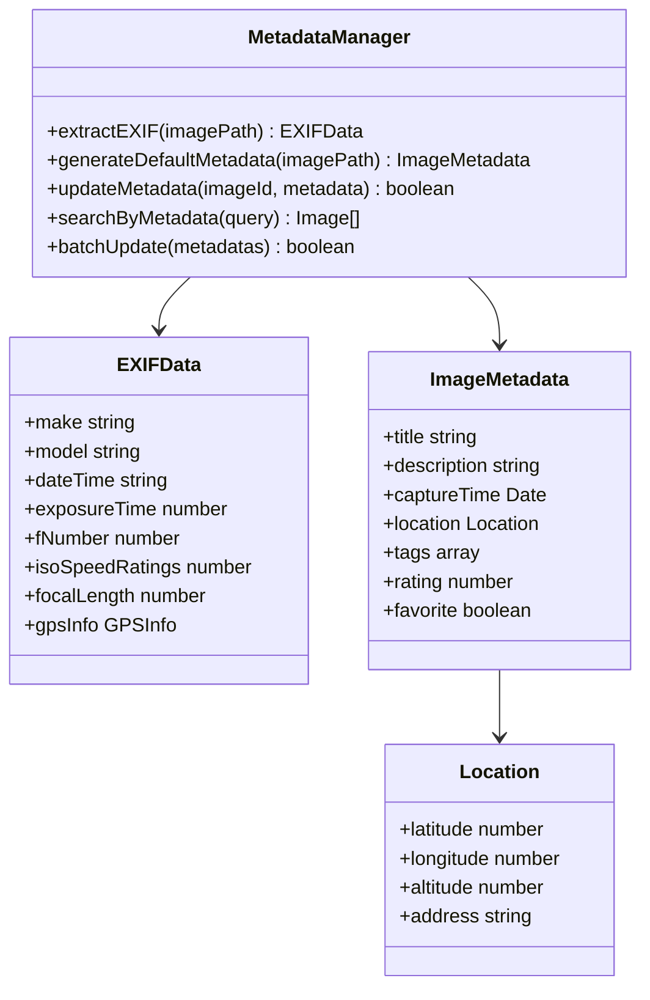

**图表来源**
- [gallery-utils.ts:200-350](file://src/utils/gallery-utils.ts#L200-L350)

#### 元数据功能

- **EXIF提取**：自动从图片中提取相机信息
- **地理位置**：支持GPS坐标和地址信息
- **时间戳管理**：精确的拍摄时间和修改时间
- **标签系统**：支持自定义标签和分类

**章节来源**
- [gallery-utils.ts:200-350](file://src/utils/gallery-utils.ts#L200-L350)

## 依赖关系分析

### 组件依赖图

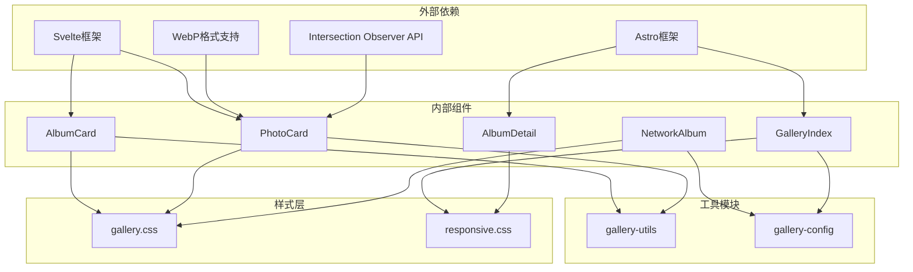

**图表来源**
- [AlbumCard.astro:1-50](file://src/components/pages/gallery/AlbumCard.astro#L1-L50)
- [PhotoCard.svelte:1-50](file://src/components/pages/gallery/PhotoCard.svelte#L1-L50)
- [NetworkAlbum.svelte:1-50](file://src/components/pages/gallery/NetworkAlbum.svelte#L1-L50)
- [gallery-utils.ts:1-50](file://src/utils/gallery-utils.ts#L1-L50)
- [galleryConfig.ts:1-50](file://src/config/galleryConfig.ts#L1-L50)

### 数据流分析

系统采用单向数据流设计，确保数据的一致性和可预测性：

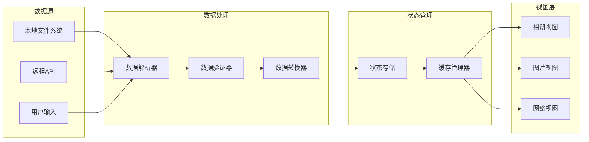

**图表来源**
- [gallery/index.astro:1-100](file://src/pages/gallery/index.astro#L1-L100)
- [gallery/[album].astro](file://src/pages/gallery/[album].astro#L1-L100)

**章节来源**
- [gallery-utils.ts:1-100](file://src/utils/gallery-utils.ts#L1-L100)
- [galleryConfig.ts:1-100](file://src/config/galleryConfig.ts#L1-L100)

## 性能考虑

### 性能优化策略

系统采用了多层次的性能优化策略：

1. **懒加载优化**
   - 使用Intersection Observer API实现高效的元素可见性检测
   - 实现智能的预加载策略，平衡加载速度和带宽使用
   - 支持动态调整加载优先级

2. **内存管理**
   - 及时释放已离开视口的图片资源
   - 实现图片缓存机制，避免重复加载
   - 监控内存使用情况，防止内存泄漏

3. **网络优化**
   - 支持HTTP/2和连接复用
   - 实现请求去重和合并
   - 提供离线缓存支持

4. **渲染优化**
   - 使用虚拟滚动技术处理大量图片
   - 实现CSS硬件加速
   - 优化重绘和回流

### 性能监控

系统内置了性能监控机制：

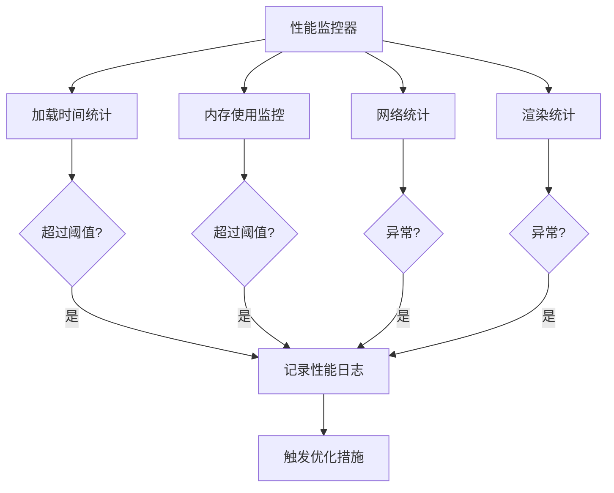

## 故障排除指南

### 常见问题及解决方案

#### 图片加载失败

**问题症状**：图片显示为占位符或加载图标长时间不消失

**可能原因**：
- 网络连接不稳定
- 图片路径错误
- 文件格式不受支持
- 权限不足

**解决步骤**：
1. 检查网络连接状态
2. 验证图片URL的有效性
3. 确认文件格式兼容性
4. 检查文件访问权限

#### 懒加载失效

**问题症状**：滚动页面时图片不按预期加载

**可能原因**：
- Intersection Observer API不支持
- DOM结构发生变化
- 样式影响了观察效果

**解决步骤**：
1. 检查浏览器兼容性
2. 确保正确的DOM结构
3. 验证CSS样式设置

#### 全屏模式异常

**问题症状**：全屏切换失败或手势识别不准确

**可能原因**：
- 浏览器全屏API限制
- 手势冲突
- 键盘事件被其他元素捕获

**解决步骤**：
1. 检查浏览器全屏支持
2. 解决手势冲突问题
3. 确保键盘事件正确绑定

**章节来源**
- [PhotoCard.svelte:160-200](file://src/components/pages/gallery/PhotoCard.svelte#L160-L200)
- [NetworkAlbum.svelte:120-200](file://src/components/pages/gallery/NetworkAlbum.svelte#L120-L200)

### 错误处理机制

系统实现了完善的错误处理机制：

**图表来源**
- [PhotoCard.svelte:160-200](file://src/components/pages/gallery/PhotoCard.svelte#L160-L200)
- [NetworkAlbum.svelte:120-200](file://src/components/pages/gallery/NetworkAlbum.svelte#L120-L200)

## 结论

Firefly-Mod的图片画廊系统是一个功能完整、性能优异的现代化相册管理解决方案。系统通过模块化设计实现了本地相册和网络相册的统一管理，提供了丰富的图片展示和交互功能。

### 主要优势

1. **架构设计优秀**：采用分层架构，职责清晰，易于维护和扩展
2. **性能优化到位**：实现了智能的懒加载、缓存和内存管理机制
3. **用户体验良好**：提供了流畅的全屏浏览、手势控制和响应式设计
4. **功能丰富完整**：涵盖了相册管理、元数据处理、缩略图生成等核心功能

### 技术亮点

- **Intersection Observer API**：实现了高效的图片懒加载
- **现代图像格式支持**：全面支持WebP、AVIF等高效格式
- **响应式设计**：完美适配各种设备和屏幕尺寸
- **错误处理机制**：完善的错误捕获和恢复机制

### 未来改进方向

1. **AI增强功能**：集成AI技术进行智能图片分类和推荐
2. **云存储集成**：支持更多云存储平台的直接访问
3. **实时协作**：添加多人协作和分享功能
4. **高级编辑**：提供在线图片编辑和滤镜功能

该系统为用户提供了优质的图片管理和浏览体验，是现代静态站点中画廊功能的最佳实践之一。