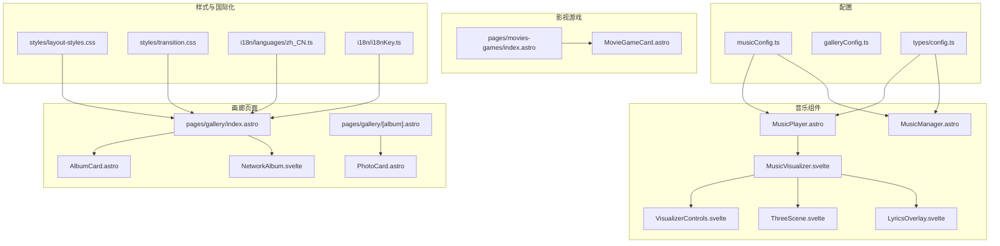
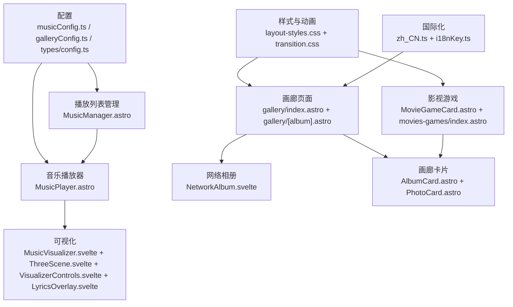
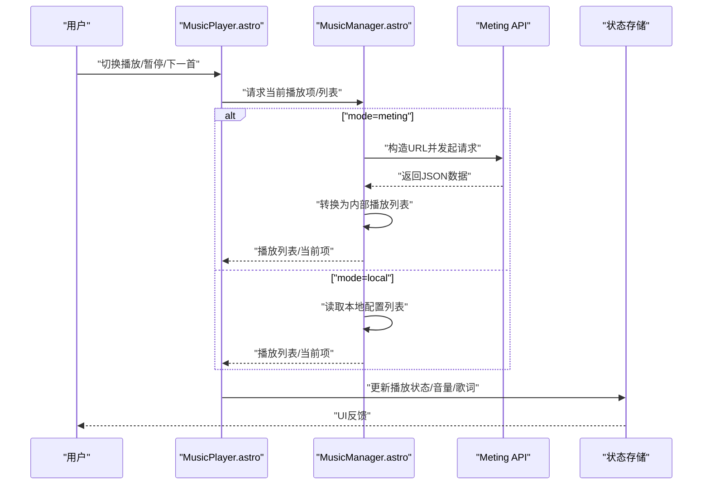
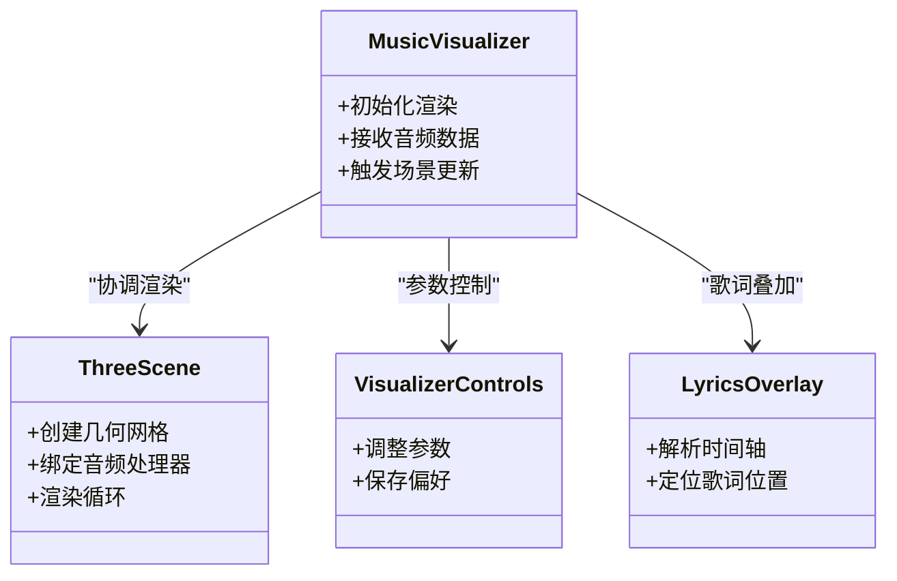
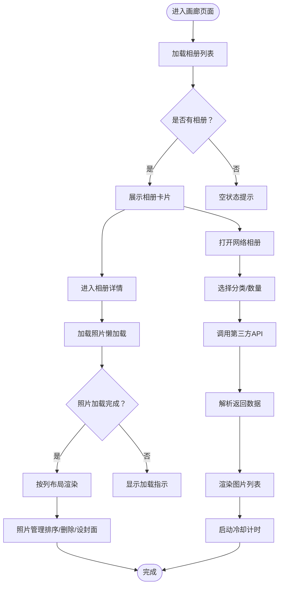
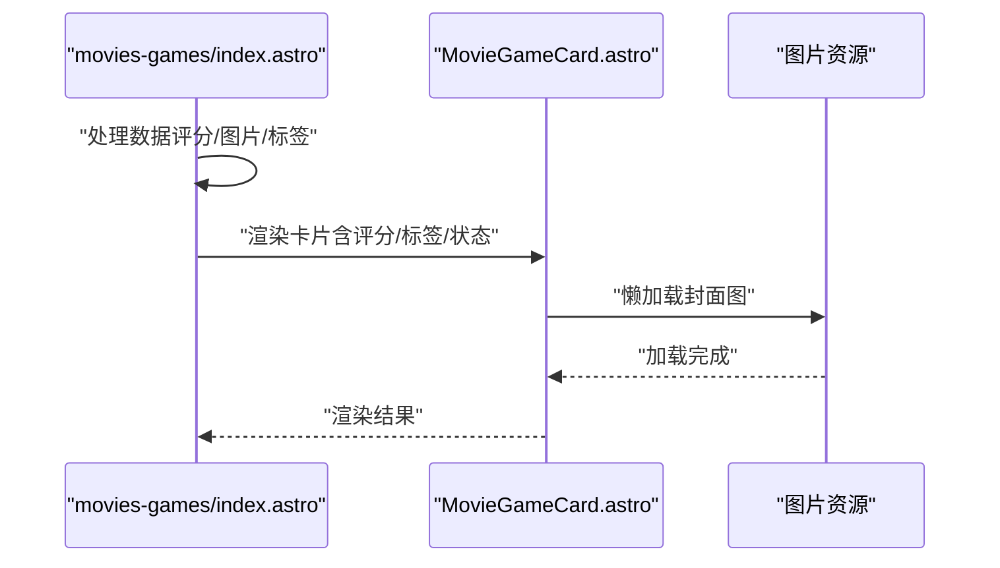
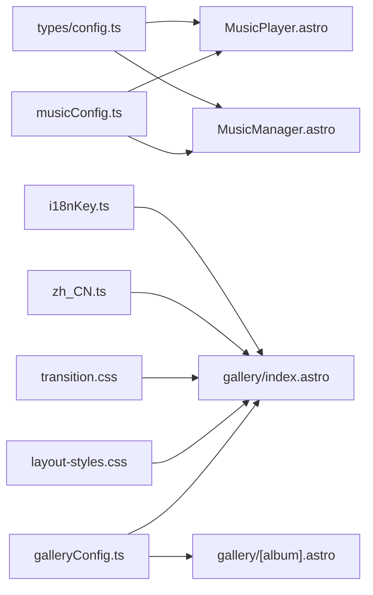

# 多媒体内容

<cite>
**本文档引用的文件**
- [musicConfig.ts](file://src/config/musicConfig.ts)
- [galleryConfig.ts](file://src/config/galleryConfig.ts)
- [MusicManager.astro](file://src/components/features/MusicManager.astro)
- [MusicPlayer.astro](file://src/components/features/MusicPlayer.astro)
- [MusicVisualizer.svelte](file://src/components/features/music-visualizer/MusicVisualizer.svelte)
- [LyricsOverlay.svelte](file://src/components/features/music-visualizer/LyricsOverlay.svelte)
- [VisualizerControls.svelte](file://src/components/features/music-visualizer/VisualizerControls.svelte)
- [ThreeScene.svelte](file://src/components/features/music-visualizer/ThreeScene.svelte)
- [AlbumCard.astro](file://src/components/pages/gallery/AlbumCard.astro)
- [PhotoCard.astro](file://src/components/pages/gallery/PhotoCard.astro)
- [NetworkAlbum.svelte](file://src/components/pages/gallery/NetworkAlbum.svelte)
- [gallery/index.astro](file://src/pages/gallery/index.astro)
- [gallery/[album].astro](file://src/pages/gallery/[album].astro)
- [MovieGameCard.astro](file://src/components/pages/movies-games/MovieGameCard.astro)
- [movies-games/index.astro](file://src/pages/movies-games/index.astro)
- [config.ts](file://src/types/config.ts)
- [zh_CN.ts](file://src/i18n/languages/zh_CN.ts)
- [i18nKey.ts](file://src/i18n/i18nKey.ts)
- [layout-styles.css](file://src/styles/layout-styles.css)
- [transition.css](file://src/styles/transition.css)
- [admin/index.astro](file://src/pages/admin/index.astro)
</cite>

## 目录
1. [简介](#简介)
2. [项目结构](#项目结构)
3. [核心组件](#核心组件)
4. [架构总览](#架构总览)
5. [详细组件分析](#详细组件分析)
6. [依赖关系分析](#依赖关系分析)
7. [性能考虑](#性能考虑)
8. [故障排除指南](#故障排除指南)
9. [结论](#结论)
10. [附录](#附录)

## 简介
本文件面向Firefly-Mod的多媒体内容系统，围绕音乐播放器、图片画廊、视频内容集成、资源优化、元数据管理、用户体验设计、无障碍与性能监控以及备份迁移策略进行系统化梳理。文档以实际源码为依据，结合架构图与流程图，帮助开发者与运营人员快速理解与维护多媒体模块。

## 项目结构
多媒体相关内容主要分布在以下区域：
- 配置层：音乐与画廊的全局配置
- 组件层：音乐播放器、可视化、画廊卡片与网络相册
- 页面层：画廊首页、相册详情页、影视游戏页
- 样式层：响应式布局与过渡动画
- 国际化层：画廊相关文案键值

**图表来源**
- [musicConfig.ts](file://src/config/musicConfig.ts)
- [galleryConfig.ts](file://src/config/galleryConfig.ts)
- [config.ts](file://src/types/config.ts)
- [MusicPlayer.astro](file://src/components/features/MusicPlayer.astro)
- [MusicManager.astro](file://src/components/features/MusicManager.astro)
- [MusicVisualizer.svelte](file://src/components/features/music-visualizer/MusicVisualizer.svelte)
- [VisualizerControls.svelte](file://src/components/features/music-visualizer/VisualizerControls.svelte)
- [ThreeScene.svelte](file://src/components/features/music-visualizer/ThreeScene.svelte)
- [LyricsOverlay.svelte](file://src/components/features/music-visualizer/LyricsOverlay.svelte)
- [AlbumCard.astro](file://src/components/pages/gallery/AlbumCard.astro)
- [PhotoCard.astro](file://src/components/pages/gallery/PhotoCard.astro)
- [NetworkAlbum.svelte](file://src/components/pages/gallery/NetworkAlbum.svelte)
- [gallery/index.astro](file://src/pages/gallery/index.astro)
- [gallery/[album].astro](file://src/pages/gallery/[album].astro)
- [MovieGameCard.astro](file://src/components/pages/movies-games/MovieGameCard.astro)
- [movies-games/index.astro](file://src/pages/movies-games/index.astro)
- [layout-styles.css](file://src/styles/layout-styles.css)
- [transition.css](file://src/styles/transition.css)
- [zh_CN.ts](file://src/i18n/languages/zh_CN.ts)
- [i18nKey.ts](file://src/i18n/i18nKey.ts)

**章节来源**
- [musicConfig.ts](file://src/config/musicConfig.ts)
- [galleryConfig.ts](file://src/config/galleryConfig.ts)
- [config.ts](file://src/types/config.ts)
- [MusicPlayer.astro](file://src/components/features/MusicPlayer.astro)
- [MusicManager.astro](file://src/components/features/MusicManager.astro)
- [MusicVisualizer.svelte](file://src/components/features/music-visualizer/MusicVisualizer.svelte)
- [VisualizerControls.svelte](file://src/components/features/music-visualizer/VisualizerControls.svelte)
- [ThreeScene.svelte](file://src/components/features/music-visualizer/ThreeScene.svelte)
- [LyricsOverlay.svelte](file://src/components/features/music-visualizer/LyricsOverlay.svelte)
- [AlbumCard.astro](file://src/components/pages/gallery/AlbumCard.astro)
- [PhotoCard.astro](file://src/components/pages/gallery/PhotoCard.astro)
- [NetworkAlbum.svelte](file://src/components/pages/gallery/NetworkAlbum.svelte)
- [gallery/index.astro](file://src/pages/gallery/index.astro)
- [gallery/[album].astro](file://src/pages/gallery/[album].astro)
- [MovieGameCard.astro](file://src/components/pages/movies-games/MovieGameCard.astro)
- [movies-games/index.astro](file://src/pages/movies-games/index.astro)
- [layout-styles.css](file://src/styles/layout-styles.css)
- [transition.css](file://src/styles/transition.css)
- [zh_CN.ts](file://src/i18n/languages/zh_CN.ts)
- [i18nKey.ts](file://src/i18n/i18nKey.ts)

## 核心组件
- 音乐播放器与播放列表管理：通过配置驱动，支持Meting API与本地音乐两种模式；具备播放模式、音量、歌词显示、导航栏展示等能力。
- 音频可视化：基于Three.js的3D地形可视化，支持频谱分析与实时响应。
- 图片画廊：本地相册与网络相册双通道，支持相册卡片、照片卡片、懒加载与封面设置。
- 影视游戏内容：卡片式展示，支持评分、标签、状态标识与评论覆盖层。
- 响应式与动画：移动端横幅优化、入口动画与减少运动偏好适配。
- 国际化：画廊相关文案键值与翻译映射。

**章节来源**
- [config.ts](file://src/types/config.ts)
- [musicConfig.ts](file://src/config/musicConfig.ts)
- [MusicPlayer.astro](file://src/components/features/MusicPlayer.astro)
- [MusicManager.astro](file://src/components/features/MusicManager.astro)
- [MusicVisualizer.svelte](file://src/components/features/music-visualizer/MusicVisualizer.svelte)
- [AlbumCard.astro](file://src/components/pages/gallery/AlbumCard.astro)
- [PhotoCard.astro](file://src/components/pages/gallery/PhotoCard.astro)
- [NetworkAlbum.svelte](file://src/components/pages/gallery/NetworkAlbum.svelte)
- [MovieGameCard.astro](file://src/components/pages/movies-games/MovieGameCard.astro)
- [layout-styles.css](file://src/styles/layout-styles.css)
- [transition.css](file://src/styles/transition.css)
- [zh_CN.ts](file://src/i18n/languages/zh_CN.ts)
- [i18nKey.ts](file://src/i18n/i18nKey.ts)

## 架构总览
多媒体系统采用“配置驱动 + 组件分层”的架构：
- 配置层：集中定义音乐播放器模式、Meting API参数、本地播放列表、画廊开关与网络相册参数。
- 组件层：音乐播放器负责UI与控制；MusicManager负责从外部API或本地资源构建播放列表；可视化组件负责音频驱动的3D渲染。
- 页面层：画廊首页与相册详情页承载相册与照片卡片；影视游戏页承载内容卡片。
- 样式层：移动端横幅与过渡动画提升体验；减少运动偏好与移动端入口动画降噪。
- 国际化层：统一文案键值与翻译映射，保证多语言一致性。

**图表来源**
- [musicConfig.ts](file://src/config/musicConfig.ts)
- [galleryConfig.ts](file://src/config/galleryConfig.ts)
- [config.ts](file://src/types/config.ts)
- [MusicPlayer.astro](file://src/components/features/MusicPlayer.astro)
- [MusicManager.astro](file://src/components/features/MusicManager.astro)
- [MusicVisualizer.svelte](file://src/components/features/music-visualizer/MusicVisualizer.svelte)
- [ThreeScene.svelte](file://src/components/features/music-visualizer/ThreeScene.svelte)
- [VisualizerControls.svelte](file://src/components/features/music-visualizer/VisualizerControls.svelte)
- [LyricsOverlay.svelte](file://src/components/features/music-visualizer/LyricsOverlay.svelte)
- [gallery/index.astro](file://src/pages/gallery/index.astro)
- [gallery/[album].astro](file://src/pages/gallery/[album].astro)
- [NetworkAlbum.svelte](file://src/components/pages/gallery/NetworkAlbum.svelte)
- [AlbumCard.astro](file://src/components/pages/gallery/AlbumCard.astro)
- [PhotoCard.astro](file://src/components/pages/gallery/PhotoCard.astro)
- [MovieGameCard.astro](file://src/components/pages/movies-games/MovieGameCard.astro)
- [movies-games/index.astro](file://src/pages/movies-games/index.astro)
- [layout-styles.css](file://src/styles/layout-styles.css)
- [transition.css](file://src/styles/transition.css)
- [zh_CN.ts](file://src/i18n/languages/zh_CN.ts)
- [i18nKey.ts](file://src/i18n/i18nKey.ts)

## 详细组件分析

### 音乐播放器与播放列表管理
- 配置项：mode（meting/local）、volume、playMode（list/one/random）、showLyrics、showInNavbar、Meting API参数（api/server/type/id/auth/fallbackApis）、本地播放列表（name/artist/url/pic/lrc）。
- 控制流：MusicPlayer负责UI与交互；MusicManager根据配置调用Meting API或读取本地列表，构建标准化播放列表；支持备用API回退。
- 关键行为：按顺序尝试多个API地址，替换占位符与认证参数；解析返回数据为内部结构；失败则抛出异常并提示。

**图表来源**
- [MusicManager.astro](file://src/components/features/MusicManager.astro)
- [MusicPlayer.astro](file://src/components/features/MusicPlayer.astro)
- [config.ts](file://src/types/config.ts)

**章节来源**
- [config.ts](file://src/types/config.ts)
- [MusicManager.astro](file://src/components/features/MusicManager.astro)
- [MusicPlayer.astro](file://src/components/features/MusicPlayer.astro)

### 音频可视化（Three.js 3D地形）
- 组件职责：MusicVisualizer作为容器协调ThreeScene渲染、VisualizerControls控制参数（如频谱强度、形状变化）、LyricsOverlay叠加歌词。
- 数据流：从播放器获取音频数据，驱动ThreeScene中的几何顶点位移与材质变化，形成随音乐起伏的地形。
- 用户交互：通过VisualizerControls调整参数，支持实时预览与保存偏好。

**图表来源**
- [MusicVisualizer.svelte](file://src/components/features/music-visualizer/MusicVisualizer.svelte)
- [ThreeScene.svelte](file://src/components/features/music-visualizer/ThreeScene.svelte)
- [VisualizerControls.svelte](file://src/components/features/music-visualizer/VisualizerControls.svelte)
- [LyricsOverlay.svelte](file://src/components/features/music-visualizer/LyricsOverlay.svelte)

**章节来源**
- [MusicVisualizer.svelte](file://src/components/features/music-visualizer/MusicVisualizer.svelte)
- [ThreeScene.svelte](file://src/components/features/music-visualizer/ThreeScene.svelte)
- [VisualizerControls.svelte](file://src/components/features/music-visualizer/VisualizerControls.svelte)
- [LyricsOverlay.svelte](file://src/components/features/music-visualizer/LyricsOverlay.svelte)

### 图片画廊系统
- 本地相册：画廊首页展示相册卡片，相册详情页按列布局展示照片卡片，支持客户端可见性懒加载与封面设置。
- 网络相册：NetworkAlbum通过第三方接口拉取图片，支持分类选择与数量限制，内置冷却计时防止频繁请求。
- 国际化：画廊相关文案键值与翻译映射，确保界面提示一致。

**图表来源**
- [gallery/index.astro](file://src/pages/gallery/index.astro)
- [gallery/[album].astro](file://src/pages/gallery/[album].astro)
- [AlbumCard.astro](file://src/components/pages/gallery/AlbumCard.astro)
- [PhotoCard.astro](file://src/components/pages/gallery/PhotoCard.astro)
- [NetworkAlbum.svelte](file://src/components/pages/gallery/NetworkAlbum.svelte)
- [zh_CN.ts](file://src/i18n/languages/zh_CN.ts)
- [i18nKey.ts](file://src/i18n/i18nKey.ts)

**章节来源**
- [gallery/index.astro](file://src/pages/gallery/index.astro)
- [gallery/[album].astro](file://src/pages/gallery/[album].astro)
- [AlbumCard.astro](file://src/components/pages/gallery/AlbumCard.astro)
- [PhotoCard.astro](file://src/components/pages/gallery/PhotoCard.astro)
- [NetworkAlbum.svelte](file://src/components/pages/gallery/NetworkAlbum.svelte)
- [zh_CN.ts](file://src/i18n/languages/zh_CN.ts)
- [i18nKey.ts](file://src/i18n/i18nKey.ts)

### 影视游戏内容集成
- 卡片组件：MovieGameCard展示封面、评分、标签、状态与评论覆盖层，支持懒加载与渐变遮罩。
- 页面聚合：movies-games/index.astro对数据进行二次加工与排序，按子类别自动归类。

**图表来源**
- [movies-games/index.astro](file://src/pages/movies-games/index.astro)
- [MovieGameCard.astro](file://src/components/pages/movies-games/MovieGameCard.astro)

**章节来源**
- [movies-games/index.astro](file://src/pages/movies-games/index.astro)
- [MovieGameCard.astro](file://src/components/pages/movies-games/MovieGameCard.astro)

## 依赖关系分析
- 配置到组件：musicConfig与types/config为MusicPlayer与MusicManager提供运行参数；galleryConfig为画廊页面与组件提供开关与参数。
- 组件到页面：MusicPlayer与画廊组件被页面文件直接引用；NetworkAlbum作为客户端组件在页面中按需加载。
- 样式到页面：layout-styles.css与transition.css分别负责移动端横幅与过渡动画，影响画廊与影视游戏页面的视觉表现。
- 国际化到页面：zh_CN.ts与i18nKey.ts为画廊页面提供文案键值，保障多语言一致性。

**图表来源**
- [musicConfig.ts](file://src/config/musicConfig.ts)
- [galleryConfig.ts](file://src/config/galleryConfig.ts)
- [config.ts](file://src/types/config.ts)
- [MusicPlayer.astro](file://src/components/features/MusicPlayer.astro)
- [MusicManager.astro](file://src/components/features/MusicManager.astro)
- [gallery/index.astro](file://src/pages/gallery/index.astro)
- [gallery/[album].astro](file://src/pages/gallery/[album].astro)
- [layout-styles.css](file://src/styles/layout-styles.css)
- [transition.css](file://src/styles/transition.css)
- [zh_CN.ts](file://src/i18n/languages/zh_CN.ts)
- [i18nKey.ts](file://src/i18n/i18nKey.ts)

**章节来源**
- [musicConfig.ts](file://src/config/musicConfig.ts)
- [galleryConfig.ts](file://src/config/galleryConfig.ts)
- [config.ts](file://src/types/config.ts)
- [MusicPlayer.astro](file://src/components/features/MusicPlayer.astro)
- [MusicManager.astro](file://src/components/features/MusicManager.astro)
- [gallery/index.astro](file://src/pages/gallery/index.astro)
- [gallery/[album].astro](file://src/pages/gallery/[album].astro)
- [layout-styles.css](file://src/styles/layout-styles.css)
- [transition.css](file://src/styles/transition.css)
- [zh_CN.ts](file://src/i18n/languages/zh_CN.ts)
- [i18nKey.ts](file://src/i18n/i18nKey.ts)

## 性能考虑
- 图片懒加载：相册详情页使用客户端可见性触发加载，减少初始渲染压力。
- 移动端优化：移动端横幅高度与文字大小采用流式单位，降低断点复杂度；入口动画在移动端禁用，减少不必要的重绘。
- 减少运动偏好：减少运动模式下禁用入场动画，避免对敏感用户的干扰。
- 请求节流：网络相册获取后启动冷却计时，避免频繁请求导致限流或资源浪费。
- CDN与缓存：建议将静态资源（音乐封面、画廊图片、模型与纹理）部署至CDN，并启用浏览器缓存与服务端缓存策略（具体部署由构建/托管环境决定）。

**章节来源**
- [gallery/[album].astro](file://src/pages/gallery/[album].astro)
- [layout-styles.css](file://src/styles/layout-styles.css)
- [transition.css](file://src/styles/transition.css)
- [NetworkAlbum.svelte](file://src/components/pages/gallery/NetworkAlbum.svelte)

## 故障排除指南
- Meting API失败：检查配置中的API地址、server/type/id/auth与fallbackApis；确认网络连通性与第三方接口可用性。
- 无法加载播放列表：核对mode是否正确；若为local模式，检查本地列表字段完整性（name/artist/url/pic/lrc）。
- 可视化无响应：确认Three.js资源加载成功；检查音频数据是否正常传递到ThreeScene。
- 画廊图片不显示：检查图片URL有效性与跨域设置；确认懒加载条件满足。
- 网络相册获取失败：查看冷却计时是否生效；检查第三方接口返回码与数据结构。

**章节来源**
- [MusicManager.astro](file://src/components/features/MusicManager.astro)
- [config.ts](file://src/types/config.ts)
- [MusicVisualizer.svelte](file://src/components/features/music-visualizer/MusicVisualizer.svelte)
- [ThreeScene.svelte](file://src/components/features/music-visualizer/ThreeScene.svelte)
- [NetworkAlbum.svelte](file://src/components/pages/gallery/NetworkAlbum.svelte)

## 结论
该多媒体系统以配置为中心，结合组件化与页面化实现，覆盖音乐播放、可视化、画廊与影视游戏内容。通过懒加载、移动端优化与减少运动偏好等策略，兼顾性能与体验。建议在生产环境中配合CDN与缓存策略进一步提升加载速度，并完善监控与备份方案以保障稳定性。

## 附录
- 配置入口：管理员页面提供音乐与可视化模块的快捷入口与说明。
- 国际化键值：画廊相关文案键值集中在i18nKey.ts，翻译映射在zh_CN.ts中维护。

**章节来源**
- [admin/index.astro](file://src/pages/admin/index.astro)
- [i18nKey.ts](file://src/i18n/i18nKey.ts)
- [zh_CN.ts](file://src/i18n/languages/zh_CN.ts)