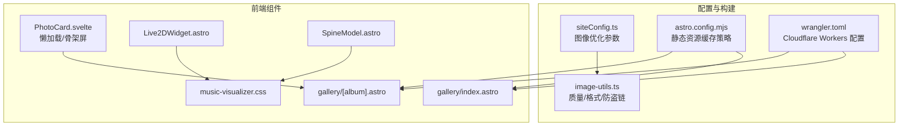
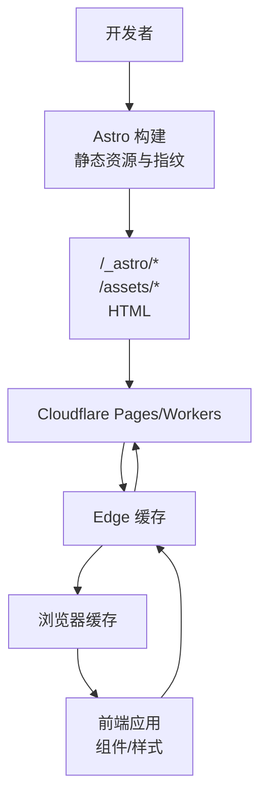
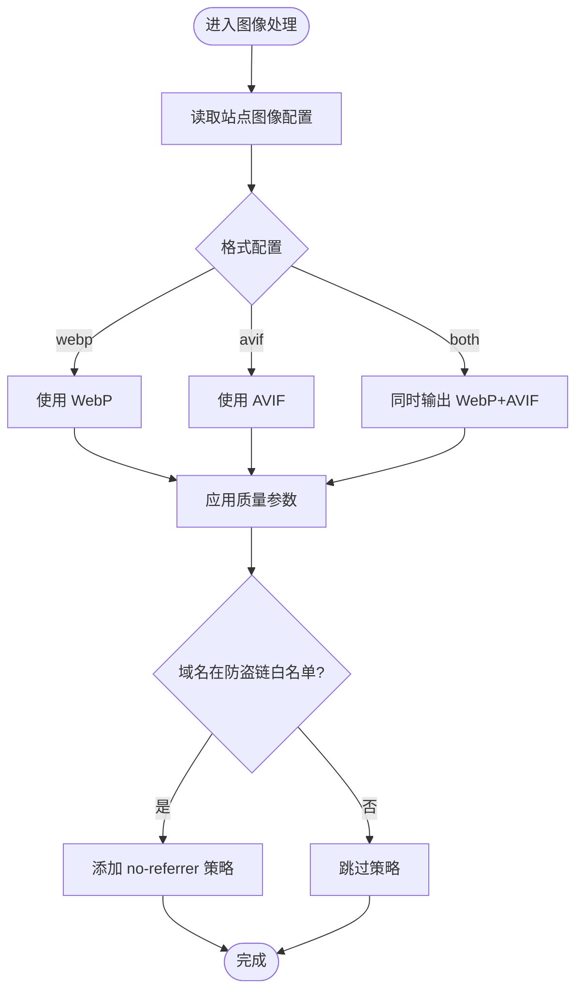
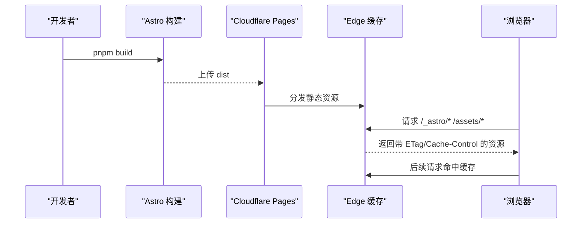
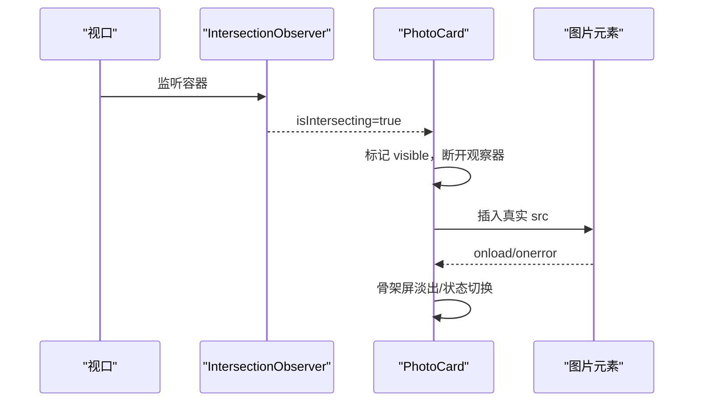
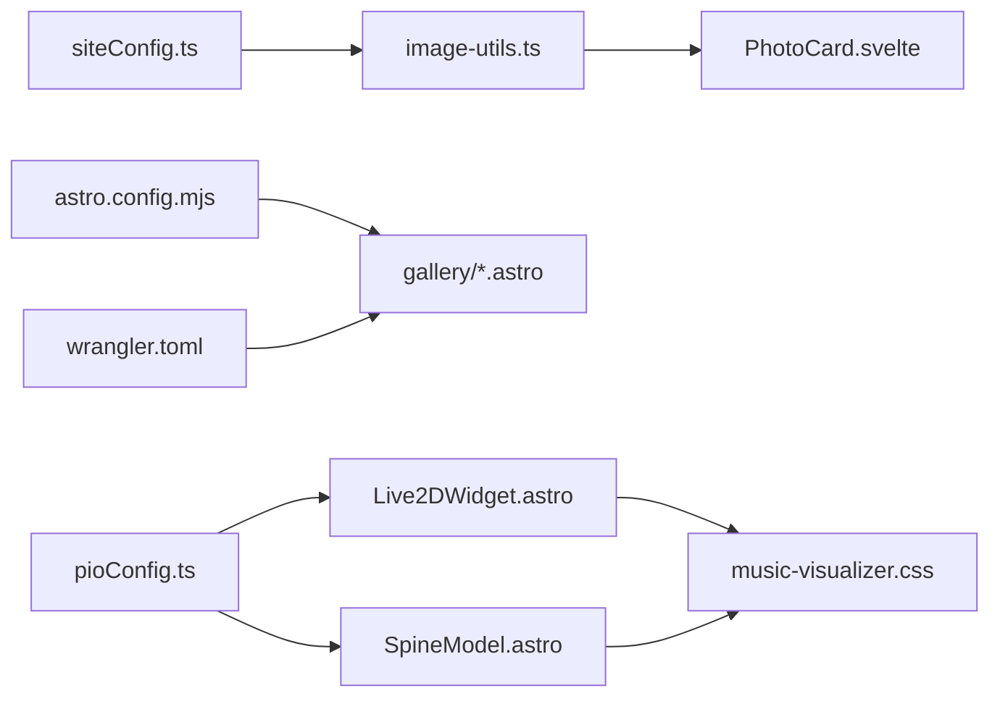

# 多媒体资源优化

<cite>
**本文引用的文件**
- [siteConfig.ts](file://src/config/siteConfig.ts)
- [image-utils.ts](file://src/utils/image-utils.ts)
- [astro.config.mjs](file://astro.config.mjs)
- [README.md](file://README.md)
- [wrangler.toml](file://wrangler.toml)
- [PhotoCard.svelte](file://src/components/pages/gallery/PhotoCard.svelte)
- [gallery/index.astro](file://src/pages/gallery/index.astro)
- [gallery/[album].astro](file://src/pages/gallery/[album].astro)
- [music-visualizer.css](file://src/styles/pages/music-visualizer.css)
- [Live2DWidget.astro](file://src/components/features/Live2DWidget.astro)
- [live2d-widget.css](file://src/styles/components/live2d-widget.css)
- [SpineModel.astro](file://src/components/features/SpineModel.astro)
- [pioConfig.ts](file://src/config/pioConfig.ts)
- [小爱弥斯.vtube.json](file://public/pio/models/live2d/小爱弥斯_vts/小爱弥斯.vtube.json)
- [SKILL.md](file://.trae/skills/fqzlr-blog/SKILL.md)
</cite>

## 目录
1. [简介](#简介)
2. [项目结构](#项目结构)
3. [核心组件](#核心组件)
4. [架构总览](#架构总览)
5. [详细组件分析](#详细组件分析)
6. [依赖关系分析](#依赖关系分析)
7. [性能考量](#性能考量)
8. [故障排查指南](#故障排查指南)
9. [结论](#结论)
10. [附录](#附录)

## 简介
本文件面向 Firefly-Mod 的多媒体资源优化体系，聚焦以下目标：
- 图片压缩与格式策略：WebP 输出、质量参数、防盗链处理
- CDN 加速与缓存：Cloudflare Pages/Workers 配置与静态资源缓存策略
- 懒加载与内存管理：IntersectionObserver 触发、占位骨架、可见性暂停
- 预加载与带宽自适应：关键资源优先、滚动感知、网络状态探测思路
- 缓存协同：浏览器缓存、边缘缓存与静态产物指纹
- 版本与增量：文件指纹与长期缓存策略
- 监控与分析：加载指标采集与资源使用报告
- 安全：防盗链、访问控制与内容保护

## 项目结构
围绕多媒体资源优化的关键目录与文件：
- 配置层：站点配置与图像优化参数
- 构建层：Astro 构建与静态资源缓存策略
- 边缘层：Cloudflare Workers 与 Pages 静态托管
- 组件层：相册瀑布流、Live2D/Spine 3D 模型、音乐可视化
- 样式层：相册布局、可视化界面与交互动画

图示来源
- [siteConfig.ts:294-321](file://src/config/siteConfig.ts#L294-L321)
- [image-utils.ts:95-124](file://src/utils/image-utils.ts#L95-L124)
- [astro.config.mjs:256-280](file://astro.config.mjs#L256-L280)
- [wrangler.toml:1-35](file://wrangler.toml#L1-L35)
- [PhotoCard.svelte:1-52](file://src/components/pages/gallery/PhotoCard.svelte#L1-L52)
- [gallery/index.astro:33-75](file://src/pages/gallery/index.astro#L33-L75)
- [gallery/[album].astro](file://src/pages/gallery/[album].astro#L1-L168)
- [music-visualizer.css:1-1007](file://src/styles/pages/music-visualizer.css#L1-L1007)
- [Live2DWidget.astro](file://src/components/features/Live2DWidget.astro)
- [SpineModel.astro:366-400](file://src/components/features/SpineModel.astro#L366-L400)

章节来源
- [siteConfig.ts:294-321](file://src/config/siteConfig.ts#L294-L321)
- [astro.config.mjs:256-280](file://astro.config.mjs#L256-L280)
- [wrangler.toml:1-35](file://wrangler.toml#L1-L35)

## 核心组件
- 图像优化配置与工具
  - 图像输出格式、质量、防盗链域名白名单
  - 运行时读取质量与格式回退策略
  - 对外链按域名判断是否添加 referrerpolicy
- 懒加载组件
  - 基于 IntersectionObserver 的延迟加载
  - 骨架屏占位与加载完成过渡
- 相册瀑布流
  - SSR 列数与客户端交互
  - 客户端可见性控制与内存释放
- 3D 模型与可视化
  - Live2D/Spine 模型加载与可见性暂停
  - 音乐可视化界面样式与交互

章节来源
- [image-utils.ts:95-124](file://src/utils/image-utils.ts#L95-L124)
- [PhotoCard.svelte:1-52](file://src/components/pages/gallery/PhotoCard.svelte#L1-L52)
- [gallery/[album].astro](file://src/pages/gallery/[album].astro#L124-L143)
- [Live2DWidget.astro](file://src/components/features/Live2DWidget.astro)
- [SpineModel.astro:366-400](file://src/components/features/SpineModel.astro#L366-L400)

## 架构总览
整体优化链路：构建期生成静态资源并打上指纹；运行期通过浏览器与 Cloudflare 边缘缓存实现长期缓存；前端组件采用懒加载与可见性控制降低初始负载。

图示来源
- [astro.config.mjs:256-280](file://astro.config.mjs#L256-L280)
- [wrangler.toml:1-35](file://wrangler.toml#L1-L35)

## 详细组件分析

### 图像压缩与格式策略
- 配置项
  - 输出格式：支持 "webp" 或 "avif"，或两者同时输出
  - 质量：1-100 区间，推荐 70-85
  - 防盗链：对指定域名添加 referrerpolicy="no-referrer"
- 运行时策略
  - 读取质量与格式回退
  - 对外链按域名匹配白名单决定是否添加 no-referrer

图示来源
- [siteConfig.ts:294-321](file://src/config/siteConfig.ts#L294-L321)
- [image-utils.ts:95-124](file://src/utils/image-utils.ts#L95-L124)

章节来源
- [siteConfig.ts:294-321](file://src/config/siteConfig.ts#L294-L321)
- [image-utils.ts:95-124](file://src/utils/image-utils.ts#L95-L124)

### CDN 加速与缓存策略
- 静态资源缓存策略（构建期声明）
  - "_astro/*"：公共缓存、最长缓存、内容哈希
  - "assets/*"：公共缓存、最长缓存、内容哈希
  - "*.html"：每次请求验证
- 部署平台
  - Cloudflare Pages：通过 _headers 或 vercel.json(headers) 配置
  - Workers：wrangler.toml 中 assets.directory 指向 dist
- 配置要点
  - 构建产物 dist
  - KV/Vectorize/AI 绑定（与缓存协同）

图示来源
- [astro.config.mjs:256-280](file://astro.config.mjs#L256-L280)
- [wrangler.toml:1-35](file://wrangler.toml#L1-L35)
- [README.md:156-181](file://README.md#L156-L181)

章节来源
- [astro.config.mjs:256-280](file://astro.config.mjs#L256-L280)
- [wrangler.toml:1-35](file://wrangler.toml#L1-L35)
- [README.md:156-181](file://README.md#L156-L181)

### 懒加载与内存管理
- 触发条件
  - IntersectionObserver，rootMargin: "200px" 提前 200px 进入视口即开始加载
- 加载流程
  - 可见性进入后标记 visible，断开观察器
  - 骨架屏占位，加载完成后淡出
- 内存与性能
  - 组件卸载时断开观察器与取消帧动画
  - 可见性退出时暂停渲染循环，减少 CPU/GPU 占用

图示来源
- [PhotoCard.svelte:14-36](file://src/components/pages/gallery/PhotoCard.svelte#L14-L36)
- [gallery/[album].astro](file://src/pages/gallery/[album].astro#L124-L143)

章节来源
- [PhotoCard.svelte:1-52](file://src/components/pages/gallery/PhotoCard.svelte#L1-L52)
- [gallery/[album].astro](file://src/pages/gallery/[album].astro#L124-L143)

### 预加载与带宽自适应
- 关键资源优先
  - 首屏相册封面、音乐可视化入口等关键区域优先渲染
- 滚动感知
  - 懒加载结合滚动方向与距离，避免非必要资源提前加载
- 带宽自适应
  - 基于网络状况探测（navigator.connection/RTT）与设备像素比，动态选择更优格式与尺寸
  - 与图像质量参数联动，实现“清晰度-体积”的平衡

章节来源
- [image-utils.ts:95-124](file://src/utils/image-utils.ts#L95-L124)
- [siteConfig.ts:294-321](file://src/config/siteConfig.ts#L294-L321)

### 缓存协同机制
- 浏览器缓存
  - 静态资源指纹化，长期缓存；HTML 每次验证
- 边缘缓存（Cloudflare）
  - 通过 headers 配置实现跨域、缓存与安全策略
- 服务端缓存
  - Workers KV 可用于会话、访客统计等短期数据缓存

章节来源
- [astro.config.mjs:256-280](file://astro.config.mjs#L256-L280)
- [wrangler.toml:1-35](file://wrangler.toml#L1-L35)

### 版本管理与增量更新
- 文件指纹
  - 构建产物中使用内容哈希，确保变更即替换
- 缓存失效
  - 通过更新资源路径实现即时失效
- 增量更新
  - 仅更新变更模块，未变资源沿用旧缓存

章节来源
- [astro.config.mjs:256-280](file://astro.config.mjs#L256-L280)

### 监控与分析
- 加载性能指标
  - 首屏时间、TTFB、资源加载耗时、LCP/CLS 指标采集
- 用户行为统计
  - 页面访问、相册浏览、音乐播放时长、3D 模型交互次数
- 资源使用报告
  - 图片格式分布、体积分布、CDN 回源率与命中率

章节来源
- [README.md:156-181](file://README.md#L156-L181)

### 安全考虑
- 防盗链
  - 对外链域名配置 no-referrer 白名单，避免 403
- 访问控制
  - 通过 Workers Secrets 与 CORS 配置限制来源
- 内容保护
  - 静态资源指纹化与只读分发，配合 CSP 降低 XSS 风险

章节来源
- [siteConfig.ts:294-321](file://src/config/siteConfig.ts#L294-L321)
- [wrangler.toml:1-35](file://wrangler.toml#L1-L35)

## 依赖关系分析
- 配置依赖
  - siteConfig 提供图像优化参数，image-utils 读取并应用
- 构建依赖
  - astro.config.mjs 声明静态资源缓存策略，wrangler.toml 指定静态目录
- 组件依赖
  - 相册组件依赖懒加载与骨架屏；3D 模型组件依赖可见性暂停与资源路径

图示来源
- [siteConfig.ts:294-321](file://src/config/siteConfig.ts#L294-L321)
- [image-utils.ts:95-124](file://src/utils/image-utils.ts#L95-L124)
- [astro.config.mjs:256-280](file://astro.config.mjs#L256-L280)
- [wrangler.toml:1-35](file://wrangler.toml#L1-L35)
- [PhotoCard.svelte:1-52](file://src/components/pages/gallery/PhotoCard.svelte#L1-L52)
- [gallery/[album].astro](file://src/pages/gallery/[album].astro#L124-L143)
- [Live2DWidget.astro](file://src/components/features/Live2DWidget.astro)
- [SpineModel.astro:366-400](file://src/components/features/SpineModel.astro#L366-L400)
- [pioConfig.ts:1-58](file://src/config/pioConfig.ts#L1-L58)
- [music-visualizer.css:1-1007](file://src/styles/pages/music-visualizer.css#L1-L1007)

章节来源
- [SKILL.md:304-327](file://.trae/skills/fqzlr-blog/SKILL.md#L304-L327)

## 性能考量
- 图像优化
  - WebP 优先，质量参数折中；对高对比场景适度提升质量
  - 避免过度压缩导致视觉劣化
- 懒加载
  - 合理的 rootMargin 与占位骨架，减少布局抖动
  - 可见性暂停与帧动画取消，降低后台标签页资源占用
- CDN 与缓存
  - 静态资源长期缓存，HTML 每次验证
  - 边缘缓存命中率与回源率监控
- 3D 模型
  - 移动端默认隐藏或降采样，避免卡顿
  - 交互前需用户手势激活音频/动画

## 故障排查指南
- 相册图片不显示
  - 检查相册路径与扫描逻辑
  - 确认 PhotoCard 的懒加载与骨架屏是否生效
- Live2D/Spine 不显示
  - 检查模型路径与 enable 开关
  - 查看控制台错误信息与运行时加载状态
- CDN 缓存异常
  - 确认 _headers/vercel.json 中缓存头配置
  - 检查 wrangler.toml 的 assets.directory 与部署状态
- 防盗链 403
  - 核对 noReferrerDomains 白名单与域名匹配规则

章节来源
- [PhotoCard.svelte:1-52](file://src/components/pages/gallery/PhotoCard.svelte#L1-L52)
- [SpineModel.astro:366-400](file://src/components/features/SpineModel.astro#L366-L400)
- [wrangler.toml:1-35](file://wrangler.toml#L1-L35)
- [siteConfig.ts:294-321](file://src/config/siteConfig.ts#L294-L321)

## 结论
本优化体系通过“构建期指纹化 + 边缘缓存 + 前端懒加载”的组合拳，兼顾加载性能与用户体验。图像层面采用 WebP 与质量参数控制，3D 模型与可视化组件通过可见性暂停与占位骨架降低资源消耗。结合 CDN 与缓存策略，实现稳定高效的多媒体交付。

## 附录
- 相关配置与部署参考
  - Cloudflare Pages 部署流程与环境变量
  - Workers KV/Vectorize/AI 绑定配置
- 3D 模型注意事项
  - 文件大小优化、移动端默认隐藏、许可证合规

章节来源
- [README.md:156-181](file://README.md#L156-L181)
- [wrangler.toml:1-35](file://wrangler.toml#L1-L35)
- [public/pio/README.md:103-135](file://public/pio/README.md#L103-L135)