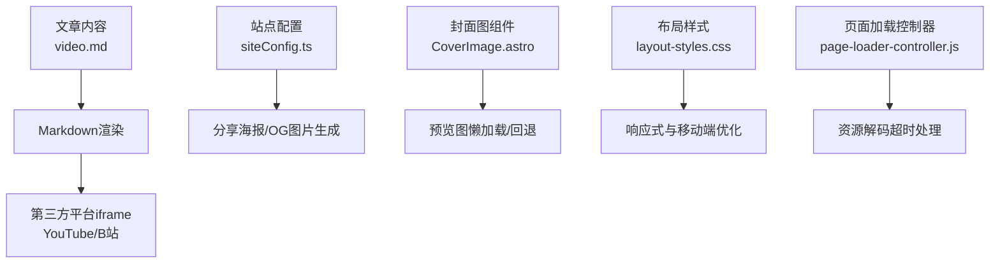
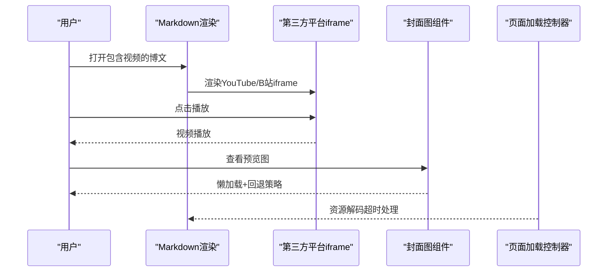
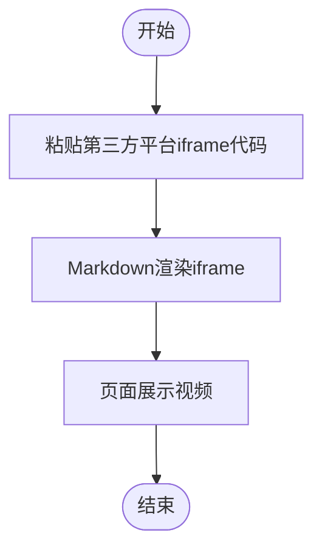
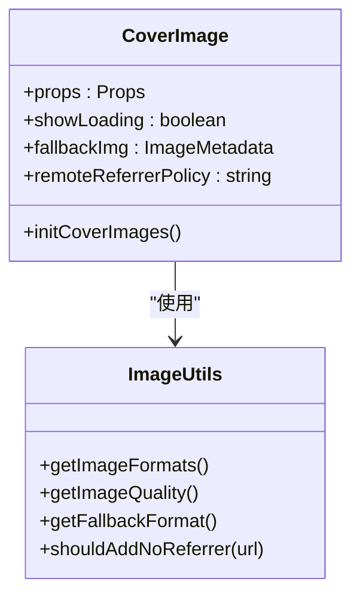
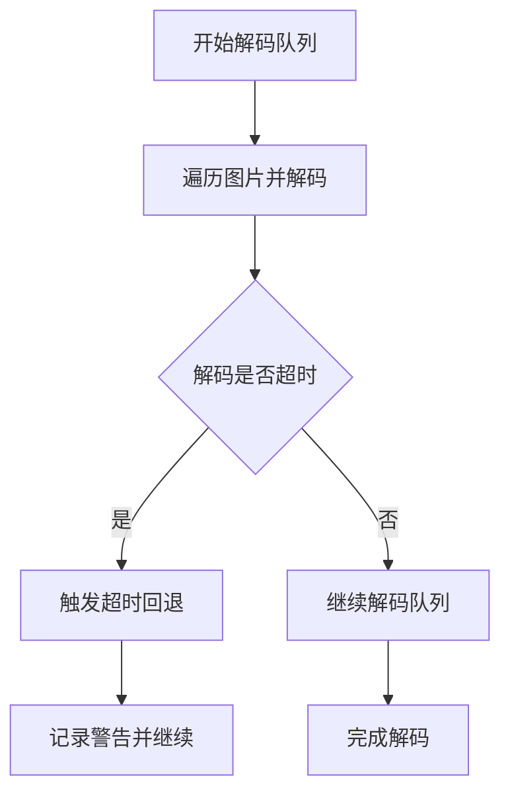
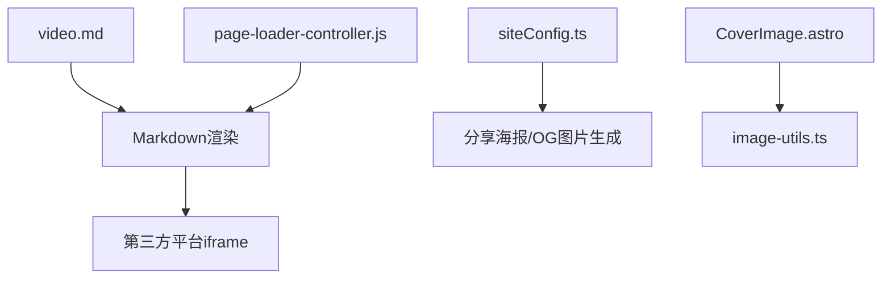

# 视频内容集成

<cite>
**本文档引用的文件**
- [video.md](file://src/content/posts/video.md)
- [siteConfig.ts](file://src/config/siteConfig.ts)
- [CoverImage.astro](file://src/components/common/CoverImage.astro)
- [image-utils.ts](file://src/utils/image-utils.ts)
- [HomePortfolioShutterLayer.astro](file://src/components/layout/HomePortfolioShutterLayer.astro)
- [page-loader-controller.js](file://src/utils/page-loader-controller.js)
- [MusicPlayer.astro](file://src/components/features/MusicPlayer.astro)
- [layout-styles.css](file://src/styles/layout-styles.css)
- [cover-image.css](file://src/styles/components/cover-image.css)
- [transition.css](file://src/styles/transition.css)
- [navigation-utils.ts](file://src/utils/navigation-utils.ts)
</cite>

## 目录
1. [简介](#简介)
2. [项目结构](#项目结构)
3. [核心组件](#核心组件)
4. [架构总览](#架构总览)
5. [详细组件分析](#详细组件分析)
6. [依赖关系分析](#依赖关系分析)
7. [性能考虑](#性能考虑)
8. [故障排查指南](#故障排查指南)
9. [结论](#结论)
10. [附录](#附录)

## 简介
本文件面向Firefly-Mod的视频内容集成系统，聚焦于如何在博客文章中嵌入视频内容，涵盖以下方面：
- 视频嵌入播放器实现：Markdown中直接粘贴第三方平台iframe、原生HTML5视频标签的使用建议
- 视频格式支持策略：MP4/WebM/Ogg等格式的兼容性与自动降级思路
- 响应式设计：自适应宽高比、移动端触摸控制与全屏播放支持
- 视频预览图生成：封面截图提取、缩略图优化与懒加载实现
- 用户体验设计：播放控制、进度条、音量控制与字幕支持
- SEO优化：结构化数据标记、社交媒体分享与Open Graph协议支持
- 性能优化：视频压缩、CDN加速与缓存机制
- 错误处理与浏览器兼容性检查
- 无障碍访问：屏幕阅读器兼容与键盘导航

## 项目结构
与视频内容集成相关的关键位置：
- 文档示例：在文章内容中直接嵌入第三方平台iframe
- 配置中心：站点配置项用于控制分享海报与OpenGraph图片生成
- 封面图组件：提供图片懒加载、错误回退与防盗链处理能力，可作为视频预览图的基础
- 布局与样式：响应式布局与移动端优化，为视频播放器提供基础环境
- 页面加载控制器：统一管理页面加载与资源解码超时，保障视频播放体验

**图表来源**
- [video.md:1-27](file://src/content/posts/video.md#L1-L27)
- [siteConfig.ts:160-167](file://src/config/siteConfig.ts#L160-L167)
- [CoverImage.astro:124-212](file://src/components/common/CoverImage.astro#L124-L212)
- [layout-styles.css:41-82](file://src/styles/layout-styles.css#L41-L82)
- [page-loader-controller.js:197-220](file://src/utils/page-loader-controller.js#L197-L220)

**章节来源**
- [video.md:1-27](file://src/content/posts/video.md#L1-L27)
- [siteConfig.ts:160-167](file://src/config/siteConfig.ts#L160-L167)

## 核心组件
- 第三方平台iframe嵌入：在Markdown中直接粘贴YouTube或B站的iframe代码，即可在文章中展示视频
- 封面图组件：提供图片懒加载、错误回退与防盗链处理，可作为视频预览图的基础
- 页面加载控制器：统一管理页面加载与资源解码超时，保障视频播放体验
- 布局样式：移动端与桌面端的响应式布局，为视频播放器提供良好的显示环境

**章节来源**
- [video.md:19-27](file://src/content/posts/video.md#L19-L27)
- [CoverImage.astro:124-212](file://src/components/common/CoverImage.astro#L124-L212)
- [page-loader-controller.js:197-220](file://src/utils/page-loader-controller.js#L197-L220)
- [layout-styles.css:41-82](file://src/styles/layout-styles.css#L41-L82)

## 架构总览
视频内容在页面中的工作流如下：
- 文章内容通过Markdown解析，第三方平台iframe直接渲染
- 封面图组件负责预览图的懒加载与错误回退
- 页面加载控制器确保资源解码超时后的容错处理
- 布局样式提供响应式与移动端优化

**图表来源**
- [video.md:19-27](file://src/content/posts/video.md#L19-L27)
- [CoverImage.astro:216-273](file://src/components/common/CoverImage.astro#L216-L273)
- [page-loader-controller.js:197-220](file://src/utils/page-loader-controller.js#L197-L220)

## 详细组件分析

### 第三方平台iframe集成
- 在Markdown中直接粘贴第三方平台iframe代码，即可在文章中展示视频
- 建议保持iframe的宽高比与容器一致，以提升响应式表现
- 注意iframe的跨域与隐私策略，确保在目标平台允许的范围内使用

**图表来源**
- [video.md:19-27](file://src/content/posts/video.md#L19-L27)

**章节来源**
- [video.md:19-27](file://src/content/posts/video.md#L19-L27)

### 封面图组件与视频预览图
- 封面图组件提供懒加载、错误回退与防盗链处理，可作为视频预览图的基础
- 支持本地图片、公共路径图片与远程图片
- 当图片加载失败时，自动切换到回退图片，保证内容可读性

**图表来源**
- [CoverImage.astro:15-40](file://src/components/common/CoverImage.astro#L15-L40)
- [image-utils.ts:81-124](file://src/utils/image-utils.ts#L81-L124)

**章节来源**
- [CoverImage.astro:124-212](file://src/components/common/CoverImage.astro#L124-L212)
- [image-utils.ts:81-124](file://src/utils/image-utils.ts#L81-L124)

### 页面加载控制器与资源解码超时
- 页面加载控制器在资源解码超时后执行回退逻辑，避免长时间等待
- 通过Promise竞争机制与超时控制，确保页面交互流畅

**图表来源**
- [page-loader-controller.js:197-220](file://src/utils/page-loader-controller.js#L197-L220)

**章节来源**
- [page-loader-controller.js:197-220](file://src/utils/page-loader-controller.js#L197-L220)

### 响应式设计与移动端优化
- 布局样式提供移动端与桌面端的响应式处理，有助于视频播放器的自适应显示
- 通过CSS媒体查询与流式布局，减少断点带来的复杂性

**章节来源**
- [layout-styles.css:41-82](file://src/styles/layout-styles.css#L41-L82)

### 用户体验设计（参考音乐播放器）
- 音乐播放器组件展示了进度条、音量控制与播放模式切换的UI与交互模式
- 可借鉴其无障碍属性（aria-*）、键盘交互与触控优化经验

**章节来源**
- [MusicPlayer.astro:63-106](file://src/components/features/MusicPlayer.astro#L63-L106)

## 依赖关系分析
- 文章内容依赖Markdown渲染引擎
- 第三方平台iframe依赖目标平台的跨域策略与隐私设置
- 封面图组件依赖站点配置中的图片优化参数
- 页面加载控制器依赖浏览器资源解码能力与超时策略

**图表来源**
- [video.md:1-27](file://src/content/posts/video.md#L1-L27)
- [siteConfig.ts:160-167](file://src/config/siteConfig.ts#L160-L167)
- [CoverImage.astro:1-14](file://src/components/common/CoverImage.astro#L1-L14)
- [image-utils.ts:1-3](file://src/utils/image-utils.ts#L1-L3)
- [page-loader-controller.js:1-104](file://src/utils/page-loader-controller.js#L1-L104)

**章节来源**
- [video.md:1-27](file://src/content/posts/video.md#L1-L27)
- [siteConfig.ts:160-167](file://src/config/siteConfig.ts#L160-L167)
- [CoverImage.astro:1-14](file://src/components/common/CoverImage.astro#L1-L14)
- [image-utils.ts:1-3](file://src/utils/image-utils.ts#L1-L3)
- [page-loader-controller.js:1-104](file://src/utils/page-loader-controller.js#L1-L104)

## 性能考虑
- 图片优化与回退：通过站点配置控制输出格式与质量，结合回退格式与防盗链策略，提升加载成功率
- 懒加载与解码超时：封面图组件与页面加载控制器共同保障资源解码超时后的容错
- 响应式布局：移动端与桌面端的响应式处理，减少不必要的重排与重绘

**章节来源**
- [siteConfig.ts:295-307](file://src/config/siteConfig.ts#L295-L307)
- [CoverImage.astro:124-212](file://src/components/common/CoverImage.astro#L124-L212)
- [page-loader-controller.js:197-220](file://src/utils/page-loader-controller.js#L197-L220)
- [layout-styles.css:41-82](file://src/styles/layout-styles.css#L41-L82)

## 故障排查指南
- iframe加载失败：检查第三方平台的跨域与隐私策略，确认iframe参数正确
- 预览图加载失败：查看封面图组件的错误回退逻辑，确认回退图片配置有效
- 资源解码超时：页面加载控制器会在超时后执行回退，检查网络状况与资源大小
- 导航降级：当SPA导航不可用时，系统会降级到普通跳转，确保页面可访问

**章节来源**
- [CoverImage.astro:234-268](file://src/components/common/CoverImage.astro#L234-L268)
- [page-loader-controller.js:197-220](file://src/utils/page-loader-controller.js#L197-L220)
- [navigation-utils.ts:53-84](file://src/utils/navigation-utils.ts#L53-L84)

## 结论
本系统通过Markdown直接嵌入第三方平台iframe的方式，快速实现视频内容展示；借助封面图组件与页面加载控制器，提供预览图懒加载、错误回退与解码超时处理；配合响应式布局与站点配置，实现较好的性能与用户体验。未来可在视频格式支持、SEO结构化数据与无障碍访问方面进一步完善。

## 附录
- 视频格式支持策略：建议优先采用广泛兼容的格式组合，并在必要时提供自动降级方案
- SEO优化：结合站点配置中的分享海报与OpenGraph图片生成，提升社交媒体分享效果
- 无障碍访问：参考音乐播放器组件的无障碍属性与键盘交互，增强视频播放器的可访问性