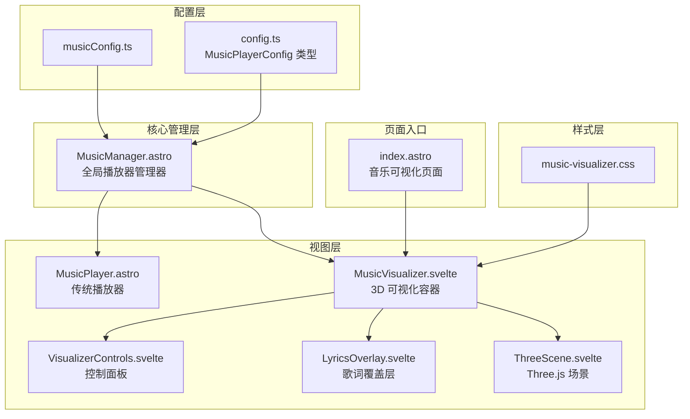
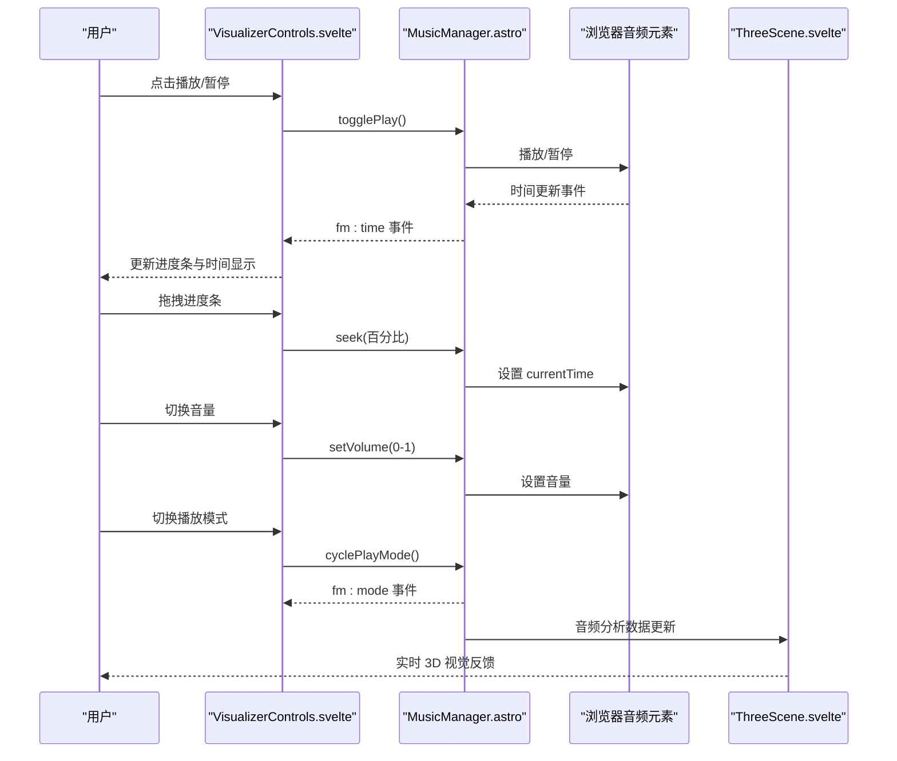
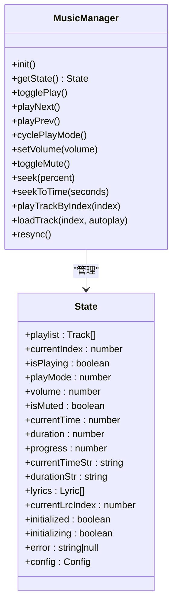
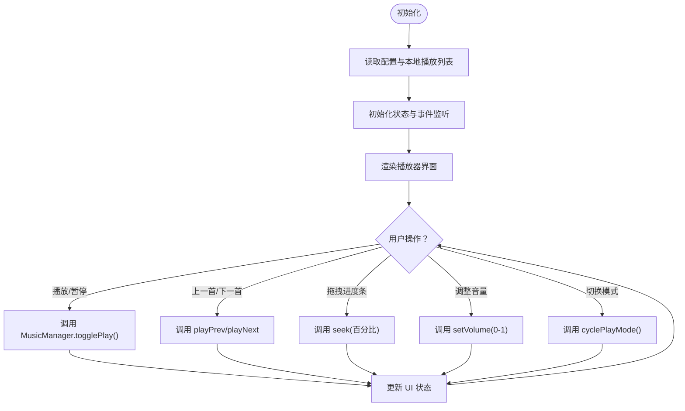
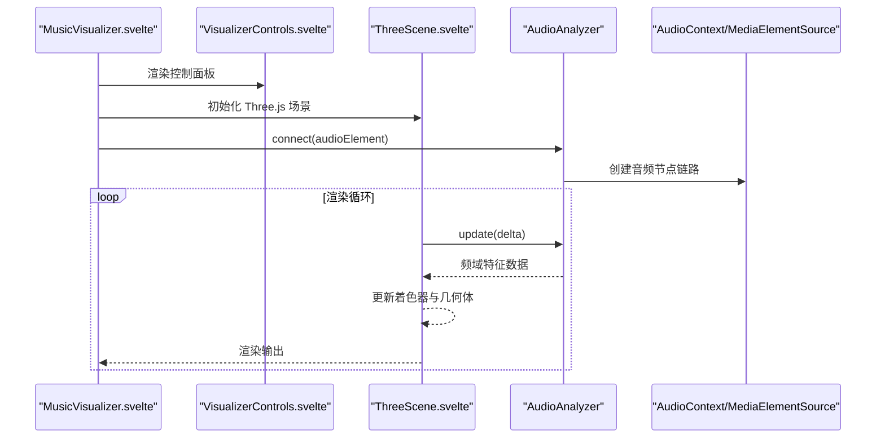
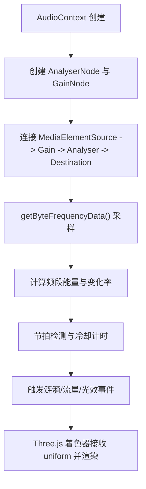
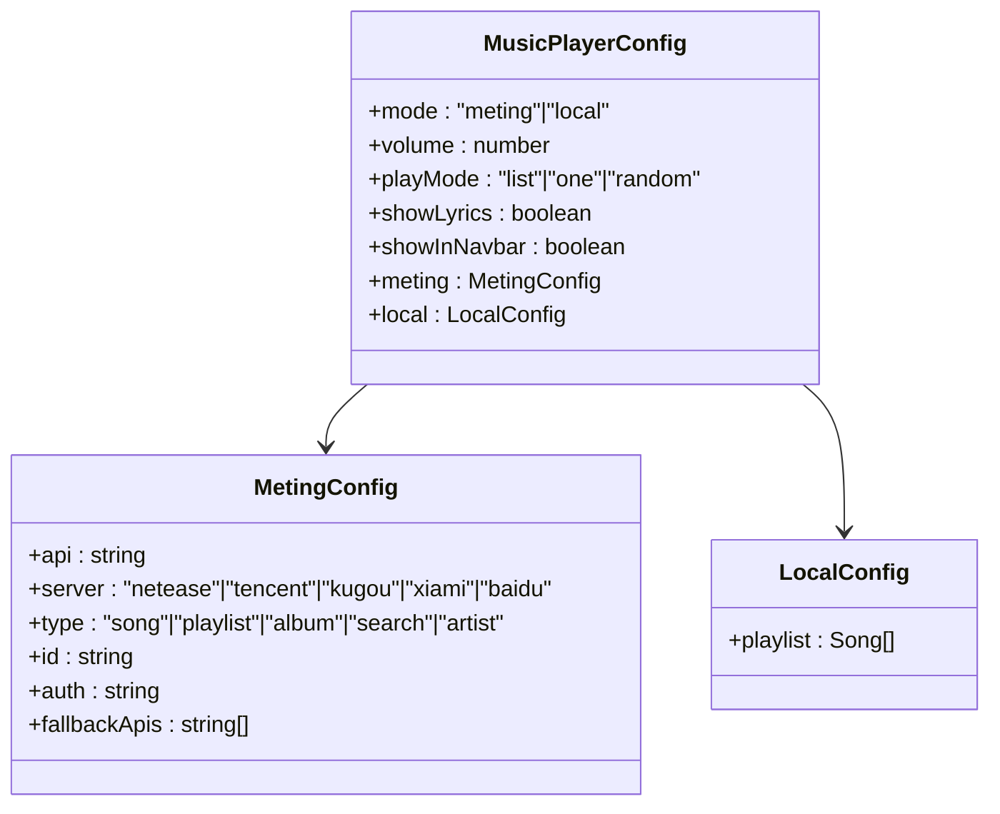
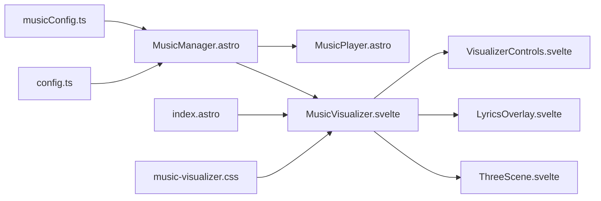

# 音乐播放器系统

<cite>
**本文档引用的文件**
- [MusicManager.astro](file://src/components/features/MusicManager.astro)
- [MusicPlayer.astro](file://src/components/features/MusicPlayer.astro)
- [MusicVisualizer.svelte](file://src/components/features/music-visualizer/MusicVisualizer.svelte)
- [VisualizerControls.svelte](file://src/components/features/music-visualizer/VisualizerControls.svelte)
- [ThreeScene.svelte](file://src/components/features/music-visualizer/ThreeScene.svelte)
- [LyricsOverlay.svelte](file://src/components/features/music-visualizer/LyricsOverlay.svelte)
- [musicConfig.ts](file://src/config/musicConfig.ts)
- [music-visualizer.css](file://src/styles/pages/music-visualizer.css)
- [index.astro](file://src/pages/music/index.astro)
- [2026-05-15-music-local.md](file://src/content/changelog/2026-05-15-music-local.md)
</cite>

## 目录
1. [简介](#简介)
2. [项目结构](#项目结构)
3. [核心组件](#核心组件)
4. [架构总览](#架构总览)
5. [详细组件分析](#详细组件分析)
6. [依赖关系分析](#依赖关系分析)
7. [性能考虑](#性能考虑)
8. [故障排除指南](#故障排除指南)
9. [结论](#结论)

## 简介
本系统是基于 Firefly-Mod 的音乐播放器与 3D 可视化解决方案，提供本地音乐播放、动态歌单管理、歌词同步展示以及基于 Three.js 的实时音频可视化。系统通过单一全局管理器对外暴露统一 API，配合 Svelte 组件实现交互控制，并通过自定义音频分析器将频域特征映射到 3D 场景中，形成沉浸式的音乐体验。

## 项目结构
音乐播放器相关文件主要分布在以下位置：
- 配置层：音乐配置与类型定义
- 核心管理层：MusicManager（全局状态与播放逻辑）
- 视图层：MusicPlayer（传统播放器界面）、MusicVisualizer（3D 可视化页面）
- 可视化子组件：ThreeScene、VisualizerControls、LyricsOverlay
- 页面入口：音乐可视化页面路由
- 样式层：音乐可视化专用样式

**图表来源**
- [musicConfig.ts:33-61](file://src/config/musicConfig.ts#L33-L61)
- [MusicManager.astro:1-390](file://src/components/features/MusicManager.astro#L1-L390)
- [MusicPlayer.astro:363-396](file://src/components/features/MusicPlayer.astro#L363-L396)
- [MusicVisualizer.svelte:49-91](file://src/components/features/music-visualizer/MusicVisualizer.svelte#L49-L91)
- [VisualizerControls.svelte:238-287](file://src/components/features/music-visualizer/VisualizerControls.svelte#L238-L287)
- [LyricsOverlay.svelte](file://src/components/features/music-visualizer/LyricsOverlay.svelte)
- [ThreeScene.svelte](file://src/components/features/music-visualizer/ThreeScene.svelte)
- [index.astro:1-18](file://src/pages/music/index.astro#L1-L18)
- [music-visualizer.css:1-1059](file://src/styles/pages/music-visualizer.css#L1-L1059)

**章节来源**
- [musicConfig.ts:33-61](file://src/config/musicConfig.ts#L33-L61)
- [MusicManager.astro:1-390](file://src/components/features/MusicManager.astro#L1-L390)
- [index.astro:1-18](file://src/pages/music/index.astro#L1-L18)

## 核心组件
- MusicManager：全局播放器管理器，负责初始化、播放列表加载、播放控制、事件分发与状态同步。
- MusicPlayer：传统播放器界面组件，提供播放控制按钮、进度条、音量调节、播放列表等。
- MusicVisualizer：3D 可视化页面容器，整合 Three.js 场景、音频分析器与交互控制。
- ThreeScene：Three.js 场景构建与渲染循环，承载地形网格、粒子系统与光源。
- VisualizerControls：3D 视觉化控制面板，包含播放/暂停、上一首/下一首、音量、播放模式切换等。
- LyricsOverlay：歌词同步显示层，根据音频时间轴高亮当前歌词行。
- 音乐配置：支持 Meting API 与本地音乐两种模式，包含默认播放列表、音质与偏好设置。

**章节来源**
- [MusicManager.astro:405-471](file://src/components/features/MusicManager.astro#L405-L471)
- [MusicPlayer.astro:363-396](file://src/components/features/MusicPlayer.astro#L363-L396)
- [MusicVisualizer.svelte:49-91](file://src/components/features/music-visualizer/MusicVisualizer.svelte#L49-L91)
- [ThreeScene.svelte](file://src/components/features/music-visualizer/ThreeScene.svelte)
- [VisualizerControls.svelte:238-287](file://src/components/features/music-visualizer/VisualizerControls.svelte#L238-L287)
- [LyricsOverlay.svelte](file://src/components/features/music-visualizer/LyricsOverlay.svelte)
- [musicConfig.ts:33-61](file://src/config/musicConfig.ts#L33-L61)

## 架构总览
系统采用“配置驱动 + 全局管理器 + 组件化视图”的分层架构：
- 配置层：定义播放模式、API 参数、本地资源路径与默认偏好。
- 管理层：封装播放逻辑、状态管理、事件广播与跨页面同步。
- 视图层：提供传统播放器与 3D 可视化两种交互形态，组件间通过全局事件通信。
- 可视化层：基于 Web Audio API 分析频域数据，映射至 Three.js 着色器与几何体。

**图表来源**
- [VisualizerControls.svelte:106-161](file://src/components/features/music-visualizer/VisualizerControls.svelte#L106-L161)
- [MusicManager.astro:405-471](file://src/components/features/MusicManager.astro#L405-L471)
- [ThreeScene.svelte](file://src/components/features/music-visualizer/ThreeScene.svelte)

## 详细组件分析

### MusicManager 组件分析
MusicManager 是整个音乐系统的核心，负责：
- 初始化：根据配置选择 Meting API 或本地模式，加载播放列表并设置初始状态。
- 播放控制：播放/暂停、上一首/下一首、跳转到指定时间、按索引播放。
- 模式管理：列表循环、单曲循环、随机播放三种模式切换。
- 音量与静音：音量调节与静音开关。
- 歌词解析：解析 LRC 歌词格式，维护歌词索引与状态。
- 事件系统：通过自定义事件向 UI 层推送状态变化，确保多组件同步。
- 跨页面同步：监听页面导航事件，触发重同步以保持播放器状态一致。

**图表来源**
- [MusicManager.astro:106-119](file://src/components/features/MusicManager.astro#L106-L119)
- [MusicManager.astro:405-471](file://src/components/features/MusicManager.astro#L405-L471)

**章节来源**
- [MusicManager.astro:132-390](file://src/components/features/MusicManager.astro#L132-L390)
- [MusicManager.astro:405-471](file://src/components/features/MusicManager.astro#L405-L471)

### MusicPlayer 组件分析
MusicPlayer 提供传统播放器界面，包含：
- 播放控制：播放/暂停、上一首/下一首、音量调节、播放模式切换。
- 进度条：点击拖拽实现跳转，实时显示当前时间与总时长。
- 歌单列表：懒加载渲染，滚动到底部自动追加批次，确保性能。
- 状态同步：监听全局事件，动态更新 UI。

**图表来源**
- [MusicPlayer.astro:363-396](file://src/components/features/MusicPlayer.astro#L363-L396)
- [MusicManager.astro:405-471](file://src/components/features/MusicManager.astro#L405-L471)

**章节来源**
- [MusicPlayer.astro:363-396](file://src/components/features/MusicPlayer.astro#L363-L396)

### MusicVisualizer 组件分析
MusicVisualizer 是 3D 可视化页面的容器，整合：
- ThreeScene：构建场景、相机、渲染器与光源，执行渲染循环。
- VisualizerControls：提供与传统播放器相同的控制按钮与进度条。
- LyricsOverlay：歌词同步显示，随音频时间轴高亮当前行。
- 音频分析器：连接浏览器音频元素，提取频域特征并传递给场景。

**图表来源**
- [MusicVisualizer.svelte:49-91](file://src/components/features/music-visualizer/MusicVisualizer.svelte#L49-L91)
- [ThreeScene.svelte](file://src/components/features/music-visualizer/ThreeScene.svelte)
- [VisualizerControls.svelte:238-287](file://src/components/features/music-visualizer/VisualizerControls.svelte#L238-L287)

**章节来源**
- [MusicVisualizer.svelte:49-91](file://src/components/features/music-visualizer/MusicVisualizer.svelte#L49-L91)
- [ThreeScene.svelte](file://src/components/features/music-visualizer/ThreeScene.svelte)
- [VisualizerControls.svelte:238-287](file://src/components/features/music-visualizer/VisualizerControls.svelte#L238-L287)

### 音频可视化系统分析
系统通过 Web Audio API 的 AnalyserNode 获取频域数据，计算多个音频特征（低音、中音、高音、能量、亮度等），并将这些特征作为着色器 uniform 传入 Three.js 场景，驱动地形网格的形变与粒子系统的动态效果。同时，系统内置节拍检测与流星特效触发机制，增强视觉反馈。

**图表来源**
- [MusicVisualizer.svelte:49-91](file://src/components/features/music-visualizer/MusicVisualizer.svelte#L49-L91)
- [ThreeScene.svelte](file://src/components/features/music-visualizer/ThreeScene.svelte)

**章节来源**
- [MusicVisualizer.svelte:49-91](file://src/components/features/music-visualizer/MusicVisualizer.svelte#L49-L91)

### 音乐配置系统分析
系统支持两种播放模式：
- Meting API 模式：通过配置 API 地址、服务器源、类型与 ID 获取远程音乐数据，支持备用 API。
- 本地模式：直接使用本地音乐列表，包含歌曲名、艺术家、URL、封面与歌词路径，支持相对路径自动补全。

**图表来源**
- [musicConfig.ts:33-61](file://src/config/musicConfig.ts#L33-L61)
- [config.ts:794-836](file://src/types/config.ts#L794-L836)

**章节来源**
- [musicConfig.ts:33-61](file://src/config/musicConfig.ts#L33-L61)
- [config.ts:794-836](file://src/types/config.ts#L794-L836)
- [2026-05-15-music-local.md:1-19](file://src/content/changelog/2026-05-15-music-local.md#L1-L19)

## 依赖关系分析
- 配置依赖：MusicManager 依赖 musicConfig.ts 中的配置对象；类型定义来自 config.ts。
- 组件依赖：MusicVisualizer 依赖 ThreeScene、VisualizerControls、LyricsOverlay；MusicPlayer 依赖 MusicManager 的事件接口。
- 样式依赖：音乐可视化页面样式独立于组件，通过全局样式文件控制布局与响应式行为。
- 页面入口：index.astro 将 MusicVisualizer 作为客户端仅渲染组件挂载到页面。

**图表来源**
- [musicConfig.ts:33-61](file://src/config/musicConfig.ts#L33-L61)
- [MusicManager.astro:1-390](file://src/components/features/MusicManager.astro#L1-L390)
- [MusicPlayer.astro:363-396](file://src/components/features/MusicPlayer.astro#L363-L396)
- [MusicVisualizer.svelte:49-91](file://src/components/features/music-visualizer/MusicVisualizer.svelte#L49-L91)
- [VisualizerControls.svelte:238-287](file://src/components/features/music-visualizer/VisualizerControls.svelte#L238-L287)
- [LyricsOverlay.svelte](file://src/components/features/music-visualizer/LyricsOverlay.svelte)
- [ThreeScene.svelte](file://src/components/features/music-visualizer/ThreeScene.svelte)
- [index.astro:1-18](file://src/pages/music/index.astro#L1-L18)
- [music-visualizer.css:1-1059](file://src/styles/pages/music-visualizer.css#L1-L1059)

**章节来源**
- [index.astro:1-18](file://src/pages/music/index.astro#L1-L18)
- [music-visualizer.css:1-1059](file://src/styles/pages/music-visualizer.css#L1-L1059)

## 性能考虑
- 渲染性能
  - Three.js 场景使用 instanced rendering（实例化网格）减少绘制调用，控制顶点数量与像素比例上限。
  - 渲染循环中对 uniform 值进行平滑插值，避免频繁大跨度更新。
- 音频分析
  - 使用较大的 FFT 窗口与平滑系数平衡实时性与稳定性；仅在音频播放时启用分析，空闲时降低采样权重。
  - 节拍检测引入冷却时间，防止高频触发导致额外开销。
- 列表渲染
  - MusicPlayer 采用分批渲染与懒加载，滚动到底部再追加一批，避免一次性渲染大量 DOM 节点。
- 资源加载
  - 本地模式优先使用静态资源，避免网络请求；远程模式提供备用 API 与错误降级策略。
- 内存管理
  - 组件销毁时断开音频连接与观察者，释放 Three.js 几何体与材质资源。

[本节为通用性能建议，不直接分析具体文件]

## 故障排除指南
- 无法播放或音频无输出
  - 确认页面首次交互后已调用音频上下文恢复；检查音频元素是否正确连接到分析器。
  - 检查跨域问题（本地模式无需跨域，远程模式需确认 CORS 设置）。
- 歌单为空或加载失败
  - 检查配置中的播放模式与 API 参数；Meting 模式下验证主 API 与备用 API 可用性。
  - 本地模式下确认资源路径有效且可访问。
- 进度条拖拽无效
  - 确保事件绑定正确，seek 方法被调用且传入合法百分比。
- 3D 视觉效果异常
  - 检查着色器 uniform 是否正确更新；确认渲染循环未被阻塞。
- 页面切换后播放器不同步
  - 确认已注册页面导航钩子并调用 resync 方法，确保所有播放器组件重新同步状态。

**章节来源**
- [MusicManager.astro:451-471](file://src/components/features/MusicManager.astro#L451-L471)
- [MusicVisualizer.svelte:49-91](file://src/components/features/music-visualizer/MusicVisualizer.svelte#L49-L91)

## 结论
该音乐播放器系统以 MusicManager 为核心，结合传统播放器与 3D 可视化两种形态，实现了稳定的本地音乐播放、灵活的播放列表管理、丰富的音频可视化效果与良好的用户体验。通过模块化的组件设计与清晰的事件通信机制，系统具备良好的扩展性与可维护性。未来可在网络异常恢复、缓存策略与更多可视化主题方面进一步优化。