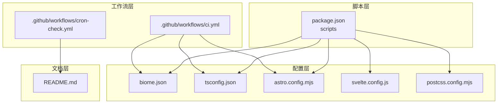
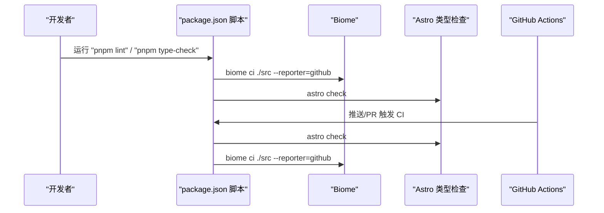
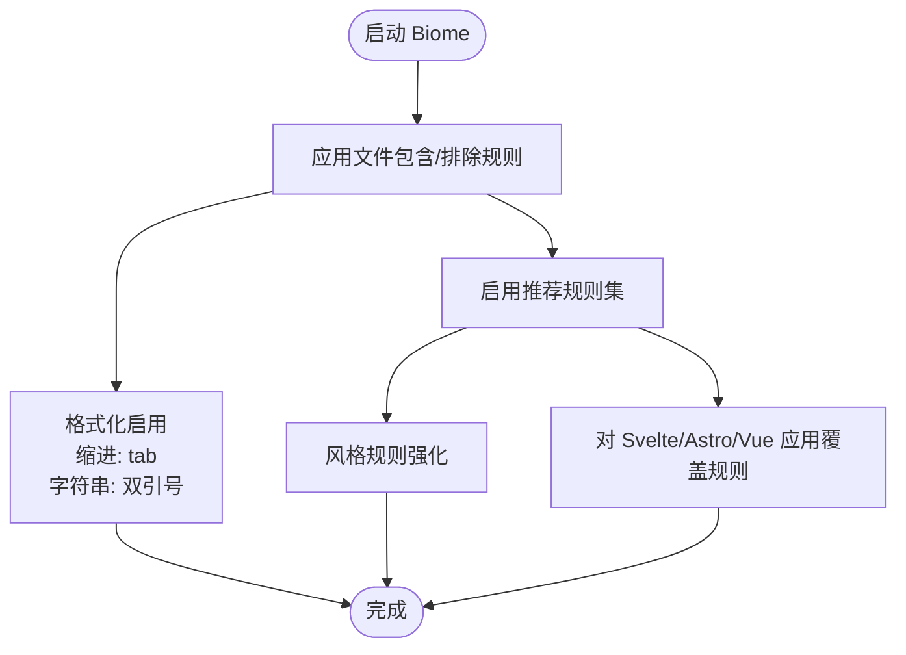
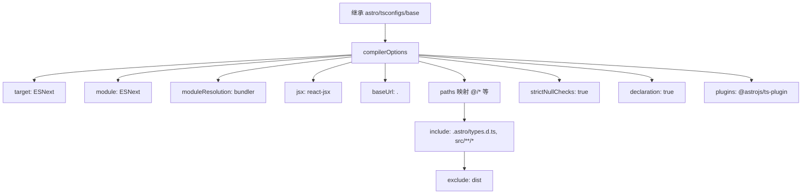
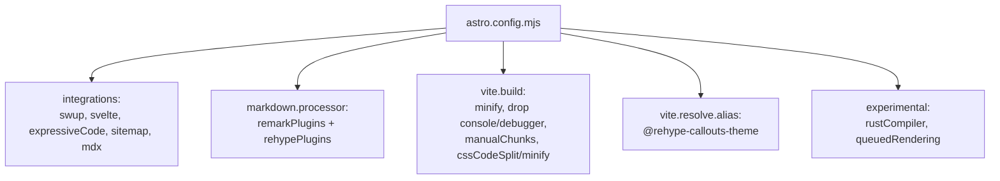
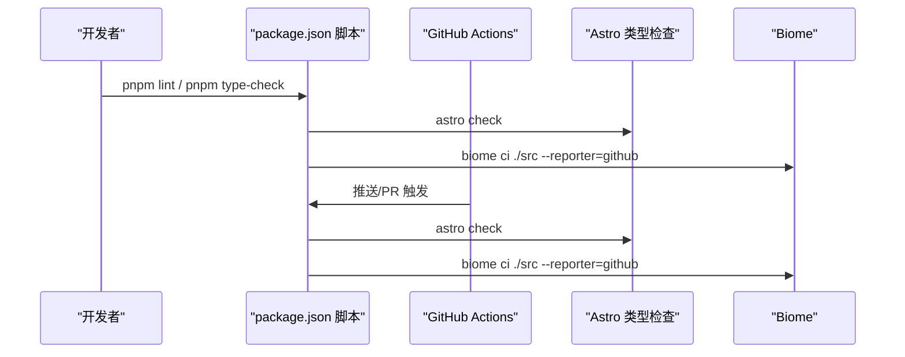
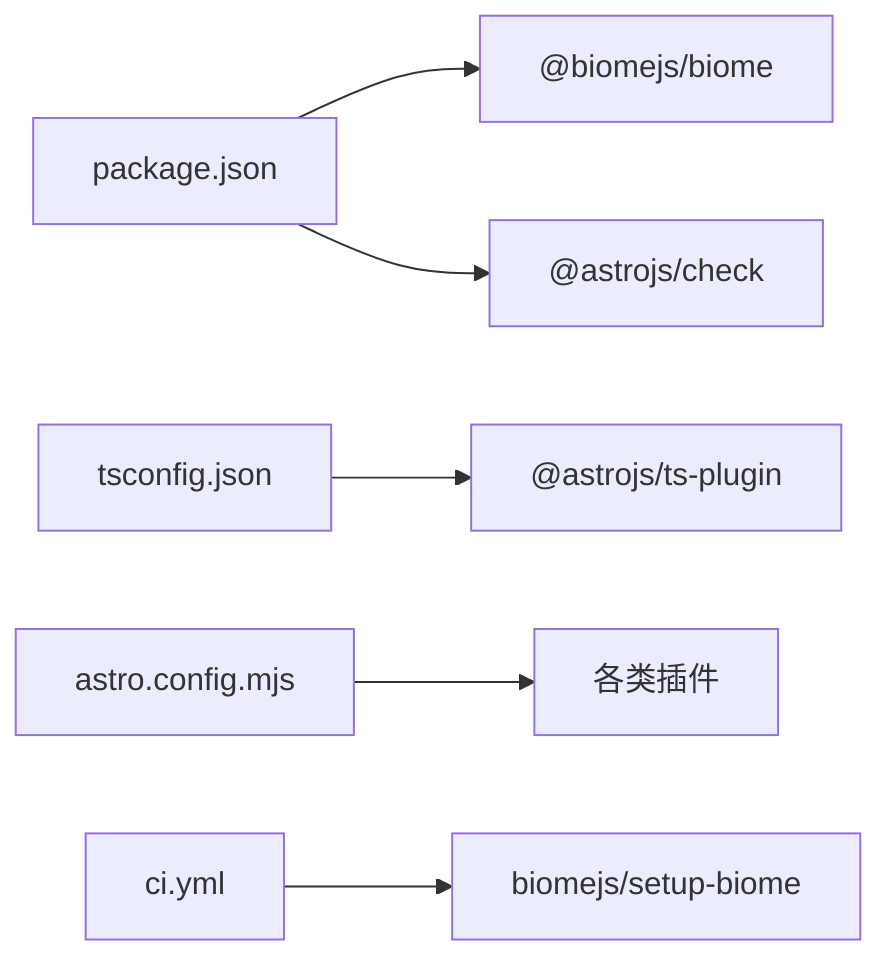

# 代码质量工具

<cite>
**本文档引用的文件**
- [biome.json](file://biome.json)
- [package.json](file://package.json)
- [tsconfig.json](file://tsconfig.json)
- [README.md](file://README.md)
- [.github/workflows/ci.yml](file://.github/workflows/ci.yml)
- [.github/workflows/cron-check.yml](file://.github/workflows/cron-check.yml)
- [astro.config.mjs](file://astro.config.mjs)
- [svelte.config.js](file://svelte.config.js)
- [postcss.config.mjs](file://postcss.config.mjs)
</cite>

## 目录
1. [简介](#简介)
2. [项目结构](#项目结构)
3. [核心组件](#核心组件)
4. [架构总览](#架构总览)
5. [详细组件分析](#详细组件分析)
6. [依赖关系分析](#依赖关系分析)
7. [性能考量](#性能考量)
8. [故障排查指南](#故障排查指南)
9. [结论](#结论)
10. [附录](#附录)

## 简介
本项目采用 Biome 作为统一的代码质量工具，覆盖代码检查、格式化、导入排序与类型检查，结合 Astro、Svelte、TypeScript 与多种插件生态，形成一体化的质量保障体系。同时通过 GitHub Actions 实现 CI/CD 集成，确保每次推送与拉取请求均执行类型检查与代码质量扫描。

## 项目结构
围绕代码质量的关键文件分布如下：
- 配置层：Biome 配置、TypeScript 配置、Astro 配置、Svelte 配置、PostCSS 配置
- 脚本层：package.json 中的脚本命令，统一调用 Biome 与 Astro 类型检查
- 工作流层：.github/workflows 下的 CI 任务，集成 Biome 与 Astro 类型检查
- 文档层：README.md 提供使用说明、常用命令与 CI/CD 工作流概览

图表来源
- [biome.json:1-66](file://biome.json#L1-L66)
- [package.json:1-112](file://package.json#L1-L112)
- [tsconfig.json:1-50](file://tsconfig.json#L1-L50)
- [.github/workflows/ci.yml:1-52](file://.github/workflows/ci.yml#L1-L52)
- [.github/workflows/cron-check.yml:1-206](file://.github/workflows/cron-check.yml#L1-L206)
- [astro.config.mjs:1-307](file://astro.config.mjs#L1-L307)
- [svelte.config.js:1-6](file://svelte.config.js#L1-L6)
- [postcss.config.mjs:1-10](file://postcss.config.mjs#L1-L10)
- [README.md:1-254](file://README.md#L1-L254)

章节来源
- [README.md:32-82](file://README.md#L32-L82)
- [package.json:5-18](file://package.json#L5-L18)

## 核心组件
- Biome 配置：启用格式化、导入排序与 Lint，针对不同文件类型（Svelte/Astro/Vue）定制规则覆盖，兼顾推荐规则与项目风格。
- TypeScript 配置：基于 Astro 基础配置扩展，启用严格空值检查、路径映射与 @astrojs/ts-plugin，确保类型检查与模块解析一致性。
- Astro 配置：集成 Svelte、Expressive Code、MDX、Sitemap 等插件，统一 Markdown/HTML 处理管线，提升渲染与可访问性。
- Svelte 配置：与 Astro 预处理集成，保证 Svelte 组件在 Astro 环境下的编译一致性。
- PostCSS 配置：启用 postcss-import 与 postcss-nesting，简化样式组织与嵌套语法。
- 脚本与工作流：通过 package.json 脚本统一调用 Biome 与 Astro 类型检查；CI 工作流在 Ubuntu 环境中执行 Astro 类型检查与 Biome Lint。

章节来源
- [biome.json:1-66](file://biome.json#L1-L66)
- [tsconfig.json:1-50](file://tsconfig.json#L1-L50)
- [astro.config.mjs:1-307](file://astro.config.mjs#L1-L307)
- [svelte.config.js:1-6](file://svelte.config.js#L1-L6)
- [postcss.config.mjs:1-10](file://postcss.config.mjs#L1-L10)
- [package.json:5-18](file://package.json#L5-L18)
- [.github/workflows/ci.yml:1-52](file://.github/workflows/ci.yml#L1-L52)

## 架构总览
下图展示从开发者本地到 CI 的代码质量检查流程，强调 Biome 与 Astro 类型检查的协同作用。

图表来源
- [package.json:5-18](file://package.json#L5-L18)
- [.github/workflows/ci.yml:37-51](file://.github/workflows/ci.yml#L37-L51)
- [README.md:68-82](file://README.md#L68-L82)

章节来源
- [README.md:126-136](file://README.md#L126-L136)
- [.github/workflows/ci.yml:1-52](file://.github/workflows/ci.yml#L1-L52)

## 详细组件分析

### Biome 配置详解
- VCS 控制：禁用内置 VCS 集成，使用 Git 忽略文件策略。
- 文件过滤：排除 CSS、public、dist、node_modules、特定常量文件与 Obsidian 目录，聚焦源代码。
- 格式化：启用格式化，缩进使用 tab；JavaScript 字符串使用双引号。
- Lint：启用推荐规则集，重点强化风格一致性（如参数赋值、const 断言、默认参数顺序、枚举初始化、自闭合元素、变量声明合并、模板字面量、Number 命名空间、显式类型、无用 else）。
- 导入排序：开启 organizeImports，配合 overrides 对 Svelte/Astro/Vue 关闭部分变量/导入未使用规则，避免框架特性的误报。
- 性能与可维护性：通过 overrides 精准放宽规则，减少噪音；格式化与 Lint 统一入口，便于 CI 执行。

图表来源
- [biome.json:3-64](file://biome.json#L3-L64)

章节来源
- [biome.json:1-66](file://biome.json#L1-L66)

### TypeScript 编译配置
- 继承 Astro 基础配置，确保与 Astro 生态兼容。
- 编译目标与模块：ESNext 目标与 ESNext 模块，bundler 解析策略，提升现代打包器兼容性。
- JSX：启用 react-jsx，指定 jsxImportSource 为 react。
- 路径映射：通过 baseUrl 与 paths 映射 @/*、@components/*、@assets/*、@constants/*、@utils/*、@i18n/*、@layouts/*，统一模块解析。
- 严格性：开启 strictNullChecks，关闭 allowJs，启用 declaration，提升类型安全性。
- 插件：集成 @astrojs/ts-plugin，增强 Astro 模板与类型支持。
- 包含/排除：包含 .astro/types.d.ts 与 src/**/*，排除 dist。

图表来源
- [tsconfig.json:1-49](file://tsconfig.json#L1-L49)

章节来源
- [tsconfig.json:1-50](file://tsconfig.json#L1-L50)

### Astro 配置与插件生态
- 站点与基础设置：site、base、trailingSlash、图像优化等。
- 实验性优化：可选的 Rust 编译器与队列渲染，按需启用。
- 集成：Swup 页面过渡、Svelte 组件、Expressive Code 代码块渲染、Sitemap、MDX。
- Markdown 处理：Remark 插件（数学公式、阅读时长、图片网格、摘录、指令、分段、Mermaid、PlantUML）与 Rehype 插件（KaTeX、提示框、锚点、Mermaid、PlantUML、外链、邮箱保护、组件容器、自动锚点）。
- 构建优化：Rollup 分包策略、esbuild 去除 console/debugger、CSS 最小化与内联阈值控制。
- Svelte 预处理：与 Astro 预处理集成，确保 Svelte 组件在 Astro 环境下正确编译。

图表来源
- [astro.config.mjs:47-307](file://astro.config.mjs#L47-L307)

章节来源
- [astro.config.mjs:1-307](file://astro.config.mjs#L1-L307)

### Svelte 配置
- 与 Astro 预处理集成，启用脚本预处理，确保 Svelte 组件在 Astro 环境中正确编译。

章节来源
- [svelte.config.js:1-6](file://svelte.config.js#L1-L6)

### PostCSS 配置
- 启用 postcss-import 与 postcss-nesting，简化样式组织与嵌套语法，提升可维护性。

章节来源
- [postcss.config.mjs:1-10](file://postcss.config.mjs#L1-L10)

### 脚本与工作流
- package.json 脚本：统一暴露格式化、Lint、类型检查与构建命令，便于本地与 CI 使用。
- CI 工作流：在 Ubuntu 环境中安装 pnpm、Node.js，执行 astro check 与 biome ci，确保类型与代码质量双保险。
- Cron 巡检：每日定时对友链进行可达性检查，异常自动创建 Issue 报告，辅助站点健康监控。

图表来源
- [package.json:5-18](file://package.json#L5-L18)
- [.github/workflows/ci.yml:37-51](file://.github/workflows/ci.yml#L37-L51)

章节来源
- [README.md:68-82](file://README.md#L68-L82)
- [.github/workflows/ci.yml:1-52](file://.github/workflows/ci.yml#L1-L52)
- [.github/workflows/cron-check.yml:1-206](file://.github/workflows/cron-check.yml#L1-L206)

## 依赖关系分析
- 脚本依赖：package.json 的 scripts 依赖 @biomejs/biome 与 @astrojs/check，分别提供 Biome 与 Astro 类型检查能力。
- 配置依赖：tsconfig.json 依赖 @astrojs/ts-plugin，astro.config.mjs 依赖各类插件生态。
- 工作流依赖：ci.yml 依赖 biomejs/setup-biome，使用 GitHub Actions Runner 环境执行检查。

图表来源
- [package.json:93-95](file://package.json#L93-L95)
- [tsconfig.json:13-16](file://tsconfig.json#L13-L16)
- [astro.config.mjs:1-40](file://astro.config.mjs#L1-L40)
- [.github/workflows/ci.yml:47-49](file://.github/workflows/ci.yml#L47-L49)

章节来源
- [package.json:93-109](file://package.json#L93-L109)
- [tsconfig.json:13-16](file://tsconfig.json#L13-L16)
- [astro.config.mjs:1-40](file://astro.config.mjs#L1-L40)
- [.github/workflows/ci.yml:47-49](file://.github/workflows/ci.yml#L47-L49)

## 性能考量
- 构建优化：Astro 配置中启用 esbuild 去除 console/debugger、Rollup manualChunks 按依赖拆分、CSS 最小化与内联阈值控制，降低运行时体积与首屏阻塞。
- 实验性优化：可选的 rustCompiler 与 queuedRendering，按需启用以平衡稳定性与性能。
- 类型检查：TypeScript 配置启用 strictNullChecks 与 declaration，提升类型安全，减少运行时错误。
- 格式化与 Lint：Biome 统一入口，避免重复扫描，CI 中一次性执行，缩短反馈周期。

章节来源
- [astro.config.mjs:256-304](file://astro.config.mjs#L256-L304)
- [tsconfig.json:10-12](file://tsconfig.json#L10-L12)
- [biome.json:20-47](file://biome.json#L20-L47)

## 故障排查指南
- Biome 报错
  - 检查 overrides 是否对 Svelte/Astro/Vue 场景过度放宽，必要时调整规则覆盖范围。
  - 确认格式化与 Lint 的入口命令是否正确执行，参考 package.json 脚本。
- 类型检查失败
  - 确认 tsconfig.json 的 paths 与 baseUrl 是否与实际目录一致，避免模块解析错误。
  - 检查 @astrojs/ts-plugin 是否正确加载，确保 Astro 模板类型支持生效。
- CI 执行失败
  - 确认 Node.js 版本与 pnpm 版本满足要求，Ubuntu Runner 环境中安装依赖后执行 astro check 与 biome ci。
  - 若报告 GitHub 上的格式化差异，优先在本地执行 pnpm format 与 pnpm lint，再推送。
- 友链巡检异常
  - 检查 src/config/friendsConfig.ts 中的配置是否符合预期，确认 enabled 字段与 URL 格式。
  - 确认 Cron 工作流中 Playwright 依赖安装与浏览器环境配置。

章节来源
- [README.md:126-136](file://README.md#L126-L136)
- [.github/workflows/cron-check.yml:57-100](file://.github/workflows/cron-check.yml#L57-L100)
- [package.json:5-18](file://package.json#L5-L18)

## 结论
本项目通过 Biome 统一代码质量工具链，结合 Astro、Svelte、TypeScript 与丰富的插件生态，实现了从本地开发到 CI/CD 的全链路质量保障。配置文件清晰、脚本命令统一、工作流稳定可靠，适合在大型前端项目中推广使用。建议持续关注 Biome 与 Astro 的新版本特性，在保证稳定的前提下逐步引入实验性优化。

## 附录
- 常用命令
  - 开发服务器：pnpm dev
  - 构建：pnpm build
  - 预览：pnpm preview
  - Astro 类型检查：pnpm check
  - TypeScript 类型检查：pnpm type-check
  - 格式化：pnpm format
  - Lint + 自动修复：pnpm lint
- CI/CD 工作流
  - ci.yml：Astro 类型检查 + Biome Lint
  - cron-check.yml：友链可达性巡检，异常自动创建 Issue

章节来源
- [README.md:68-82](file://README.md#L68-L82)
- [.github/workflows/ci.yml:126-136](file://README.md#L126-L136)
- [.github/workflows/ci.yml:1-52](file://.github/workflows/ci.yml#L1-L52)
- [.github/workflows/cron-check.yml:1-206](file://.github/workflows/cron-check.yml#L1-L206)