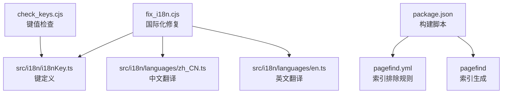
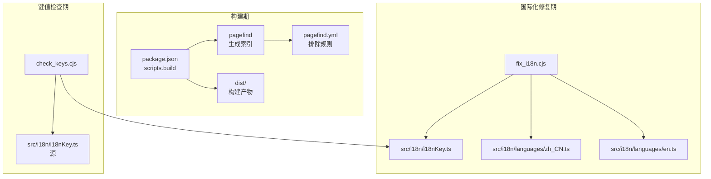
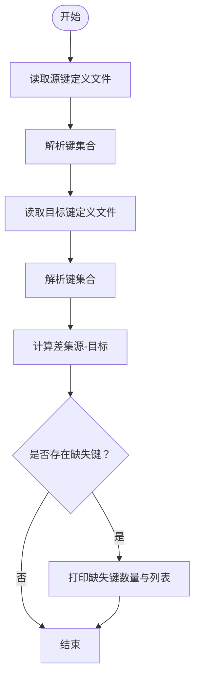
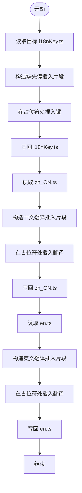
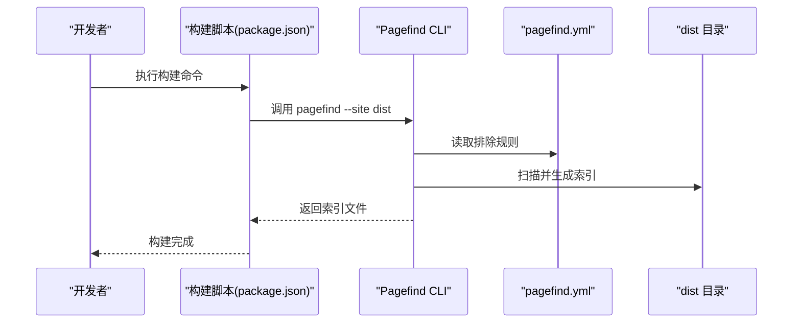
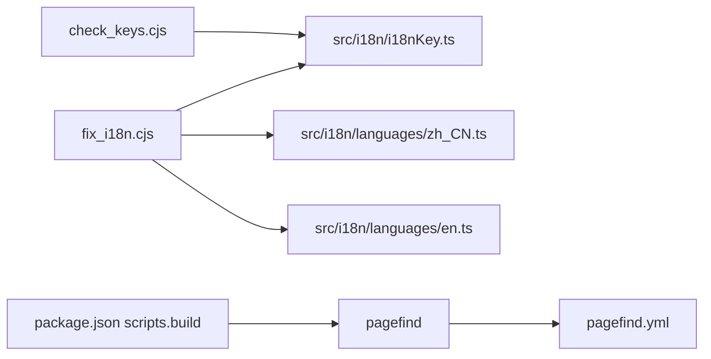

# 实用工具

<cite>
**本文引用的文件**
- [check_keys.cjs](file://check_keys.cjs)
- [fix_i18n.cjs](file://fix_i18n.cjs)
- [pagefind.yml](file://pagefind.yml)
- [package.json](file://package.json)
- [src/i18n/i18nKey.ts](file://src/i18n/i18nKey.ts)
- [src/i18n/languages/zh_CN.ts](file://src/i18n/languages/zh_CN.ts)
- [src/i18n/languages/en.ts](file://src/i18n/languages/en.ts)
</cite>

## 目录
1. [简介](#简介)
2. [项目结构](#项目结构)
3. [核心组件](#核心组件)
4. [架构总览](#架构总览)
5. [详细组件分析](#详细组件分析)
6. [依赖关系分析](#依赖关系分析)
7. [性能考虑](#性能考虑)
8. [故障排查指南](#故障排查指南)
9. [结论](#结论)
10. [附录](#附录)

## 简介
本文件面向开发者与维护者，系统性梳理并说明本仓库中的实用工具，包括：
- 键值检查工具：用于对比源与目标国际化键集合，发现缺失键并输出报告。
- 国际化修复工具：用于向键定义与多语言翻译文件批量注入缺失键及默认翻译，实现快速补齐。
- Pagefind 搜索引擎：介绍其配置与在构建流程中的集成方式，涵盖索引生成、排除规则与性能调优思路。
- 其他辅助工具：基于构建脚本与配置，说明数据校验、格式转换与批量处理的常见实践路径。

文档同时提供命令行参数说明、使用示例、工作流集成建议、结果验证方法，以及扩展与定制新工具的指导。

## 项目结构
围绕实用工具的相关文件组织如下：
- 键值检查与国际化修复：位于仓库根目录的两个 CJS 脚本，分别负责键集合比对与批量修复。
- 国际化键与翻译：位于 src/i18n 下，包含键枚举与各语言翻译映射。
- Pagefind 配置：位于仓库根目录，定义页面索引排除规则。
- 构建与索引：通过包管理脚本在构建阶段调用 Pagefind 生成搜索索引。

**图表来源**
- [check_keys.cjs:1-23](file://check_keys.cjs#L1-L23)
- [fix_i18n.cjs:1-85](file://fix_i18n.cjs#L1-L85)
- [src/i18n/i18nKey.ts:1-436](file://src/i18n/i18nKey.ts#L1-L436)
- [src/i18n/languages/zh_CN.ts:1-438](file://src/i18n/languages/zh_CN.ts#L1-L438)
- [src/i18n/languages/en.ts:1-449](file://src/i18n/languages/en.ts#L1-L449)
- [pagefind.yml:1-7](file://pagefind.yml#L1-L7)
- [package.json:1-112](file://package.json#L1-L112)

**章节来源**
- [check_keys.cjs:1-23](file://check_keys.cjs#L1-L23)
- [fix_i18n.cjs:1-85](file://fix_i18n.cjs#L1-L85)
- [src/i18n/i18nKey.ts:1-436](file://src/i18n/i18nKey.ts#L1-L436)
- [src/i18n/languages/zh_CN.ts:1-438](file://src/i18n/languages/zh_CN.ts#L1-L438)
- [src/i18n/languages/en.ts:1-449](file://src/i18n/languages/en.ts#L1-L449)
- [pagefind.yml:1-7](file://pagefind.yml#L1-L7)
- [package.json:1-112](file://package.json#L1-L112)

## 核心组件
- 键值检查工具（check_keys.cjs）
  - 功能：从源与目标两处读取键定义，提取键集合，计算差集，输出缺失键清单。
  - 关键行为：解析键定义文件，使用正则匹配键名，集合运算比较，控制台输出。
- 国际化修复工具（fix_i18n.cjs）
  - 功能：向键定义文件插入缺失键；向中文与英文翻译文件注入对应键值映射。
  - 关键行为：读取目标文件，构造插入片段，替换占位符位置，写回文件。
- Pagefind 搜索引擎
  - 功能：在构建阶段生成全文搜索索引，配合排除规则提升索引质量与性能。
  - 关键行为：通过构建脚本调用 pagefind 命令，结合配置文件的排除选择器。

**章节来源**
- [check_keys.cjs:1-23](file://check_keys.cjs#L1-L23)
- [fix_i18n.cjs:1-85](file://fix_i18n.cjs#L1-L85)
- [pagefind.yml:1-7](file://pagefind.yml#L1-L7)
- [package.json:1-112](file://package.json#L1-L112)

## 架构总览
下图展示工具在构建与运行期的交互关系：

**图表来源**
- [package.json:1-112](file://package.json#L1-L112)
- [pagefind.yml:1-7](file://pagefind.yml#L1-L7)
- [check_keys.cjs:1-23](file://check_keys.cjs#L1-L23)
- [fix_i18n.cjs:1-85](file://fix_i18n.cjs#L1-L85)
- [src/i18n/i18nKey.ts:1-436](file://src/i18n/i18nKey.ts#L1-L436)
- [src/i18n/languages/zh_CN.ts:1-438](file://src/i18n/languages/zh_CN.ts#L1-L438)
- [src/i18n/languages/en.ts:1-449](file://src/i18n/languages/en.ts#L1-L449)

## 详细组件分析

### 键值检查工具（check_keys.cjs）
- 输入
  - 源键定义文件：用于对比的基准集合。
  - 目标键定义文件：实际构建使用的集合。
- 处理逻辑
  - 逐行解析键定义，提取键名，建立集合。
  - 计算源集合与目标集合的差集，得到缺失键。
  - 控制台输出缺失键数量与列表。
- 输出
  - 缺失键清单，便于人工核对与后续修复。

**图表来源**
- [check_keys.cjs:1-23](file://check_keys.cjs#L1-L23)

**章节来源**
- [check_keys.cjs:1-23](file://check_keys.cjs#L1-L23)

### 国际化修复工具（fix_i18n.cjs）
- 输入
  - 目标键定义文件：待补全缺失键。
  - 中文与英文翻译文件：待补全对应键值映射。
- 处理逻辑
  - 读取目标文件内容，构造插入片段（键名与默认值）。
  - 在指定占位符位置进行字符串替换，写回文件。
  - 控制台输出每类补全的数量与状态。
- 输出
  - 更新后的键定义与翻译文件，减少手工维护成本。

**图表来源**
- [fix_i18n.cjs:1-85](file://fix_i18n.cjs#L1-L85)

**章节来源**
- [fix_i18n.cjs:1-85](file://fix_i18n.cjs#L1-L85)

### Pagefind 搜索引擎（pagefind.yml 与构建脚本）
- 配置要点
  - 排除选择器：定义不参与索引的 DOM 结构，如数学公式、特定面板等。
- 构建集成
  - 构建脚本在打包完成后调用 pagefind 命令，对 dist 目录生成索引。
- 性能与质量
  - 通过排除无关节点降低索引体积与构建时间。
  - 保持排除规则与前端组件结构同步，避免误排除有效内容。

**图表来源**
- [package.json:1-112](file://package.json#L1-L112)
- [pagefind.yml:1-7](file://pagefind.yml#L1-L7)

**章节来源**
- [pagefind.yml:1-7](file://pagefind.yml#L1-L7)
- [package.json:1-112](file://package.json#L1-L112)

## 依赖关系分析
- 键值检查工具依赖目标键定义文件，用于对比与输出。
- 国际化修复工具依赖键定义与翻译文件，作为写回目标。
- Pagefind 依赖构建脚本与排除配置，作为索引生成入口。
- 以上工具均以 Node.js CJS 形式运行，适合在 CI/CD 或本地开发环境中执行。

**图表来源**
- [check_keys.cjs:1-23](file://check_keys.cjs#L1-L23)
- [fix_i18n.cjs:1-85](file://fix_i18n.cjs#L1-L85)
- [src/i18n/i18nKey.ts:1-436](file://src/i18n/i18nKey.ts#L1-L436)
- [src/i18n/languages/zh_CN.ts:1-438](file://src/i18n/languages/zh_CN.ts#L1-L438)
- [src/i18n/languages/en.ts:1-449](file://src/i18n/languages/en.ts#L1-L449)
- [package.json:1-112](file://package.json#L1-L112)
- [pagefind.yml:1-7](file://pagefind.yml#L1-L7)

**章节来源**
- [check_keys.cjs:1-23](file://check_keys.cjs#L1-L23)
- [fix_i18n.cjs:1-85](file://fix_i18n.cjs#L1-L85)
- [src/i18n/i18nKey.ts:1-436](file://src/i18n/i18nKey.ts#L1-L436)
- [src/i18n/languages/zh_CN.ts:1-438](file://src/i18n/languages/zh_CN.ts#L1-L438)
- [src/i18n/languages/en.ts:1-449](file://src/i18n/languages/en.ts#L1-L449)
- [package.json:1-112](file://package.json#L1-L112)
- [pagefind.yml:1-7](file://pagefind.yml#L1-L7)

## 性能考虑
- Pagefind 索引生成
  - 合理设置排除规则，避免对大型或动态内容（如数学公式、复杂面板）建立索引，降低索引体积与构建时间。
  - 在 CI 中缓存索引产物，减少重复构建开销。
- 键值检查与修复
  - 修复脚本仅做文本替换，执行速度快；建议在变更集中批量运行，减少频繁 IO。
  - 对翻译文件的插入采用占位符定位策略，确保结构一致性。

[本节为通用建议，不直接分析具体文件]

## 故障排查指南
- 键值检查无输出
  - 确认源与目标键定义文件路径正确且存在。
  - 检查键定义格式是否与正则匹配一致。
- 修复脚本未生效
  - 确认占位符位置与替换逻辑一致，避免误删或覆盖。
  - 检查文件写权限与路径拼写。
- Pagefind 索引异常
  - 检查排除规则是否过于宽泛导致有效内容被忽略。
  - 确认构建脚本已正确调用 pagefind 并指向 dist 目录。
- 构建失败
  - 查看构建脚本输出，确认依赖安装与命令可用性。

**章节来源**
- [check_keys.cjs:1-23](file://check_keys.cjs#L1-L23)
- [fix_i18n.cjs:1-85](file://fix_i18n.cjs#L1-L85)
- [pagefind.yml:1-7](file://pagefind.yml#L1-L7)
- [package.json:1-112](file://package.json#L1-L112)

## 结论
本仓库提供了简洁高效的工具链：通过键值检查与国际化修复工具，显著降低多语言维护成本；通过 Pagefind 的配置与构建集成，实现快速、可控的全文搜索索引生成。建议在开发与发布流程中引入这些工具，形成自动化与可验证的维护闭环。

[本节为总结性内容，不直接分析具体文件]

## 附录

### 命令行参数与使用示例
- 键值检查
  - 用途：对比源与目标键集合，输出缺失键。
  - 示例：在项目根目录执行键值检查脚本，观察控制台输出的缺失键数量与列表。
- 国际化修复
  - 用途：向键定义与翻译文件批量注入缺失键与默认翻译。
  - 示例：在项目根目录执行修复脚本，观察控制台输出的补全数量与状态。
- Pagefind 索引生成
  - 用途：在构建完成后生成搜索索引。
  - 示例：执行构建脚本，触发 pagefind 对 dist 目录生成索引。
- 参数说明
  - 以上脚本均为 CJS 文件，不接受外部命令行参数；需根据文件内硬编码路径与逻辑调整以适配不同环境。

**章节来源**
- [check_keys.cjs:1-23](file://check_keys.cjs#L1-L23)
- [fix_i18n.cjs:1-85](file://fix_i18n.cjs#L1-L85)
- [package.json:1-112](file://package.json#L1-L112)
- [pagefind.yml:1-7](file://pagefind.yml#L1-L7)

### 工作流集成与结果验证
- 集成建议
  - 在本地开发阶段：提交前运行键值检查与修复脚本，确保新增键已补齐。
  - 在 CI/CD 阶段：在构建步骤后加入 pagefind 索引生成，校验索引产物存在。
- 结果验证
  - 键值检查：核对缺失键列表是否为空或可接受范围。
  - 修复脚本：确认目标文件中新增键与翻译已正确写入。
  - Pagefind：确认 dist 目录下生成了索引文件，且搜索功能正常。

**章节来源**
- [check_keys.cjs:1-23](file://check_keys.cjs#L1-L23)
- [fix_i18n.cjs:1-85](file://fix_i18n.cjs#L1-L85)
- [package.json:1-112](file://package.json#L1-L112)
- [pagefind.yml:1-7](file://pagefind.yml#L1-L7)

### 扩展与定制
- 新增键值检查场景
  - 可在现有脚本基础上增加正则匹配规则或输出格式化选项，以适配更复杂的键命名规范。
- 新增国际化修复场景
  - 可扩展缺失键集合与默认翻译映射，或引入模板化生成策略，减少手工维护。
- 新增工具类型
  - 数据验证：可编写校验脚本，对配置文件或内容元数据进行一致性检查。
  - 格式转换：可引入第三方库或自定义转换逻辑，统一资源命名与结构。
  - 批量处理：可封装循环与并行策略，提升大规模文件处理效率。

[本节为通用指导，不直接分析具体文件]