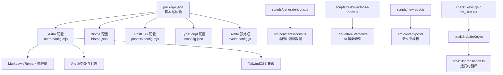
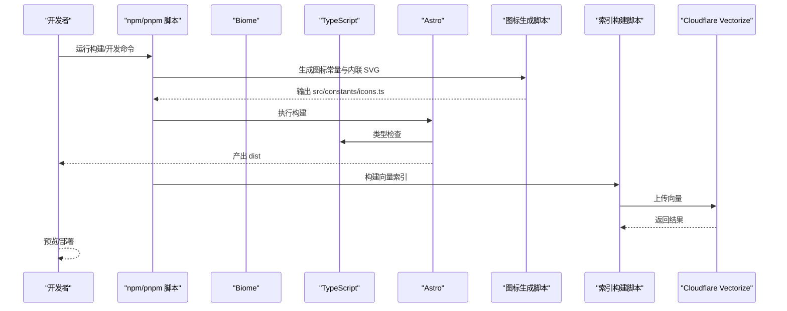
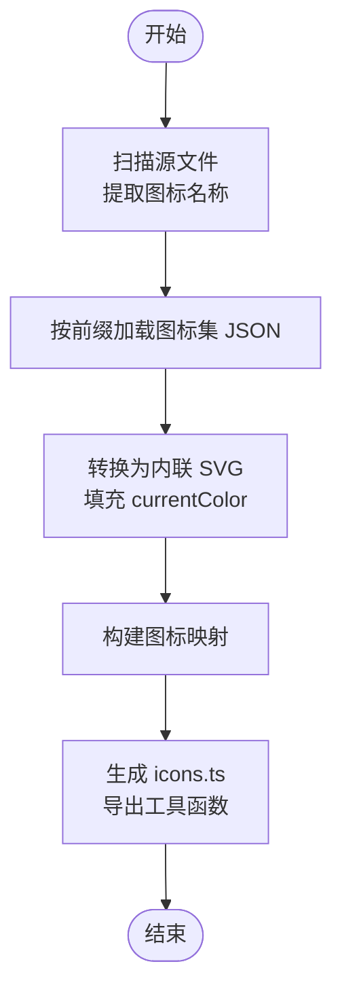
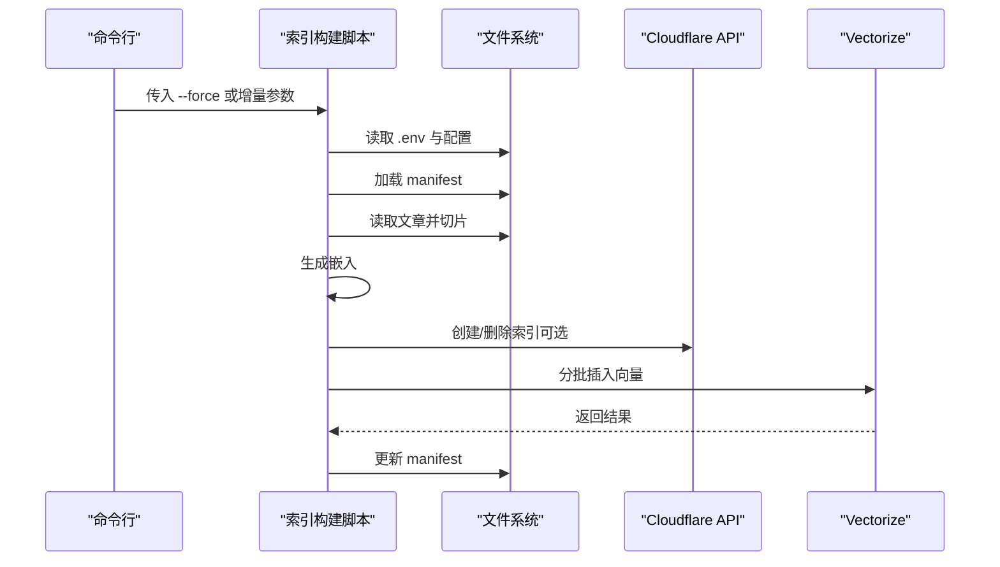
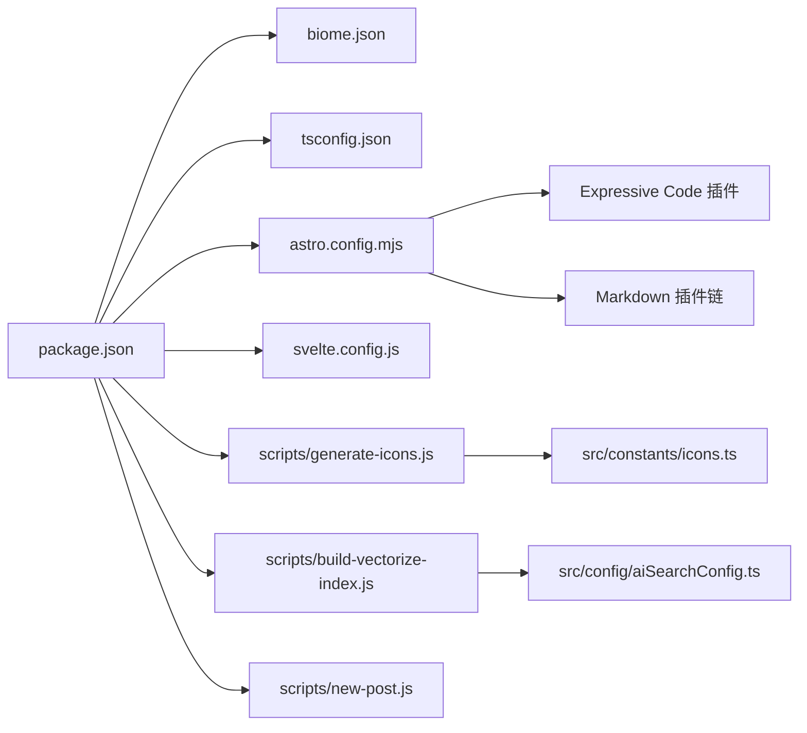

# 开发工具与脚本

<cite>
**本文引用的文件**
- [biome.json](file://biome.json)
- [postcss.config.mjs](file://postcss.config.mjs)
- [tsconfig.json](file://tsconfig.json)
- [package.json](file://package.json)
- [astro.config.mjs](file://astro.config.mjs)
- [svelte.config.js](file://svelte.config.js)
- [scripts/generate-icons.js](file://scripts/generate-icons.js)
- [scripts/build-vectorize-index.js](file://scripts/build-vectorize-index.js)
- [scripts/new-post.js](file://scripts/new-post.js)
- [check_keys.cjs](file://check_keys.cjs)
- [fix_i18n.cjs](file://fix_i18n.cjs)
- [src/config/aiSearchConfig.ts](file://src/config/aiSearchConfig.ts)
- [src/i18n/i18nKey.ts](file://src/i18n/i18nKey.ts)
- [src/i18n/translation.ts](file://src/i18n/translation.ts)
</cite>

## 目录
1. [简介](#简介)
2. [项目结构](#项目结构)
3. [核心组件](#核心组件)
4. [架构总览](#架构总览)
5. [详细组件分析](#详细组件分析)
6. [依赖关系分析](#依赖关系分析)
7. [性能考虑](#性能考虑)
8. [故障排查指南](#故障排查指南)
9. [结论](#结论)
10. [附录](#附录)

## 简介
本文件面向 Firefly-Mod 项目的开发者与维护者，系统梳理开发工具链与自动化脚本体系，覆盖以下主题：
- 开发工具链：Biome 代码质量、PostCSS 样式处理、TypeScript 编译配置
- 自动化脚本：图标生成、索引构建、国际化修复、新文章模板
- 代码规范与质量控制：ESLint 规则、Prettier 格式化、Git 钩子建议
- 开发环境配置：IDE 设置、调试配置、热重载机制
- 性能分析与调试：浏览器 DevTools、网络监控、内存分析
- 重构与迁移：自动修复脚本、批量处理工具
- 效率提升：快捷键、模板、重复性任务自动化
- 团队协作：开发规范与最佳实践

## 项目结构
本项目采用 Astro + Svelte + TypeScript 的现代化前端技术栈，结合自研脚本与第三方工具实现高质量交付。关键目录与文件职责概览：
- 配置层：Astro、Biome、PostCSS、TypeScript、Svelte 等配置文件
- 脚本层：scripts 目录下的图标生成、索引构建、新文章模板等自动化脚本
- 国际化层：src/i18n 下的语言键值与翻译映射
- 构建与发布：package.json 中的脚本命令串联各工具链

图表来源
- [package.json:1-112](file://package.json#L1-L112)
- [astro.config.mjs:1-307](file://astro.config.mjs#L1-L307)
- [biome.json:1-66](file://biome.json#L1-L66)
- [postcss.config.mjs:1-10](file://postcss.config.mjs#L1-L10)
- [tsconfig.json:1-50](file://tsconfig.json#L1-L50)
- [svelte.config.js:1-6](file://svelte.config.js#L1-L6)
- [scripts/generate-icons.js:1-275](file://scripts/generate-icons.js#L1-L275)
- [scripts/build-vectorize-index.js:1-388](file://scripts/build-vectorize-index.js#L1-L388)
- [scripts/new-post.js:1-60](file://scripts/new-post.js#L1-L60)
- [src/i18n/i18nKey.ts:1-436](file://src/i18n/i18nKey.ts#L1-L436)
- [src/i18n/translation.ts:1-47](file://src/i18n/translation.ts#L1-L47)

章节来源
- [package.json:1-112](file://package.json#L1-L112)
- [astro.config.mjs:1-307](file://astro.config.mjs#L1-L307)

## 核心组件
- Biome 代码质量工具
  - 启用格式化与 Lint，针对 JS/TS 与 Svelte/Astro/Vue 采用差异化规则
  - 默认使用制表符缩进，双引号字符串风格
- PostCSS 样式处理
  - 引入 postcss-import 与 postcss-nesting，简化样式组织与嵌套
- TypeScript 编译配置
  - 继承 Astro 基础配置，启用严格空值检查，配置路径别名与插件
- Astro 集成与构建
  - 集成 Svelte、Expressive Code、MDX、Sitemap 等插件；Vite 代理与缓存策略
- 自动化脚本
  - 图标生成：扫描源码提取图标，按需生成内联 SVG
  - 索引构建：将文章按标题层级切片，生成向量并上传至 Cloudflare Vectorize
  - 新文章模板：快速生成带 Front Matter 的 Markdown 文件
  - 国际化修复：补齐缺失键与多语言翻译

章节来源
- [biome.json:1-66](file://biome.json#L1-L66)
- [postcss.config.mjs:1-10](file://postcss.config.mjs#L1-L10)
- [tsconfig.json:1-50](file://tsconfig.json#L1-L50)
- [astro.config.mjs:1-307](file://astro.config.mjs#L1-L307)
- [scripts/generate-icons.js:1-275](file://scripts/generate-icons.js#L1-L275)
- [scripts/build-vectorize-index.js:1-388](file://scripts/build-vectorize-index.js#L1-L388)
- [scripts/new-post.js:1-60](file://scripts/new-post.js#L1-L60)
- [fix_i18n.cjs:1-85](file://fix_i18n.cjs#L1-L85)

## 架构总览
整体开发与构建流程如下：

图表来源
- [package.json:5-19](file://package.json#L5-L19)
- [scripts/generate-icons.js:207-275](file://scripts/generate-icons.js#L207-L275)
- [scripts/build-vectorize-index.js:324-388](file://scripts/build-vectorize-index.js#L324-L388)
- [astro.config.mjs:66-181](file://astro.config.mjs#L66-L181)

## 详细组件分析

### Biome 代码质量工具
- 功能要点
  - 文件范围：排除 CSS、public、dist、node_modules、特定常量文件与 Obsidian 目录
  - 格式化：启用格式化，制表符缩进，双引号
  - Lint：启用推荐规则，对 Svelte/Astro/Vue 关闭部分变量/导入检查，避免误报
  - JavaScript：统一双引号
- 使用方式
  - 格式化：npm run format
  - Lint 并自动修复：npm run lint
- 最佳实践
  - 在 IDE 中集成 Biome 插件，保存即格式化
  - 结合 Git 钩子在提交前执行 biomes check --write

章节来源
- [biome.json:1-66](file://biome.json#L1-L66)
- [package.json:14-15](file://package.json#L14-L15)

### PostCSS 样式处理
- 功能要点
  - postcss-import：支持在样式中导入外部文件
  - postcss-nesting：支持 CSS 嵌套语法
- 使用方式
  - 在样式文件中直接使用 @import 与嵌套规则
- 最佳实践
  - 与 TailwindCSS 协同使用，注意导入顺序与冲突

章节来源
- [postcss.config.mjs:1-10](file://postcss.config.mjs#L1-L10)

### TypeScript 编译配置
- 功能要点
  - 继承 Astro 基础配置，目标 ESNext，模块 bundler
  - 启用严格空值检查，开启声明生成
  - 配置路径别名（@/、@components/、@assets/ 等）
  - 集成 Astro TS 插件
- 使用方式
  - npm run type-check 执行类型检查
- 最佳实践
  - 保持路径别名一致性，避免相对路径地狱
  - 在组件中优先使用类型定义

章节来源
- [tsconfig.json:1-50](file://tsconfig.json#L1-L50)
- [package.json:12](file://package.json#L12)

### Astro 集成与构建
- 功能要点
  - 集成 Svelte、Expressive Code、MDX、Sitemap、Swup 等
  - Markdown 插件链：数学公式、Mermaid、PlantUML、外链、邮箱保护、自动锚点等
  - Vite：代理 /api 到本地服务，构建产物分包与压缩
- 使用方式
  - 开发：npm run dev
  - 预览：npm run preview
  - 类型检查：npm run check
- 最佳实践
  - 合理划分 vendor chunk，减少首屏体积
  - 使用 pagefind 进行站内搜索，构建后自动注入

章节来源
- [astro.config.mjs:1-307](file://astro.config.mjs#L1-L307)
- [package.json:6-11](file://package.json#L6-L11)

### Svelte 预处理
- 功能要点
  - 使用 vitePreprocess，启用脚本预处理
- 使用方式
  - 在 Svelte 组件中编写 TypeScript/JSX 片段
- 最佳实践
  - 与 Astro 集成时遵循 Astro 的组件约定

章节来源
- [svelte.config.js:1-6](file://svelte.config.js#L1-L6)

### 图标生成脚本
- 功能要点
  - 扫描 Svelte/Astro/TS 文件，提取图标名称（含多种匹配模式）
  - 按图标集加载 JSON，转换为内联 SVG，确保 fill="currentColor"
  - 生成 src/constants/icons.ts，导出 getIconSvg、hasIcon、getAvailableIcons
- 使用方式
  - 构建前自动执行：npm run build
  - 单独执行：npm run icons
- 最佳实践
  - 图标命名遵循 iconify 格式（前缀:名称）
  - 避免在运行时动态拼接 SVG，尽量使用生成的常量

图表来源
- [scripts/generate-icons.js:37-91](file://scripts/generate-icons.js#L37-L91)
- [scripts/generate-icons.js:96-154](file://scripts/generate-icons.js#L96-L154)
- [scripts/generate-icons.js:159-202](file://scripts/generate-icons.js#L159-L202)

章节来源
- [scripts/generate-icons.js:1-275](file://scripts/generate-icons.js#L1-L275)
- [package.json:9](file://package.json#L9)

### 索引构建脚本（Vectorize）
- 功能要点
  - 读取 src/content/posts 下的 Markdown/MDX，过滤草稿
  - 按标题层级切片，生成 chunk 文本，附加元数据
  - 生成向量：支持第三方 embedding API 或 Cloudflare Workers AI
  - 增量更新：基于 .vectorize-manifest.json，仅处理新增/变更/删除
  - 上传至 Cloudflare Vectorize，支持分批插入
- 使用方式
  - 全量重建：node scripts/build-vectorize-index.js --force
  - 增量更新：node scripts/build-vectorize-index.js
  - 配置：CLOUDFLARE_API_TOKEN、CLOUDFLARE_ACCOUNT_ID、可选 AI_API_KEY
- 最佳实践
  - 在 CI 中定期增量更新索引
  - 保持 aiSearchConfig.ts 与部署环境一致

图表来源
- [scripts/build-vectorize-index.js:40-81](file://scripts/build-vectorize-index.js#L40-L81)
- [scripts/build-vectorize-index.js:100-129](file://scripts/build-vectorize-index.js#L100-L129)
- [scripts/build-vectorize-index.js:131-188](file://scripts/build-vectorize-index.js#L131-L188)
- [scripts/build-vectorize-index.js:192-222](file://scripts/build-vectorize-index.js#L192-L222)
- [scripts/build-vectorize-index.js:226-274](file://scripts/build-vectorize-index.js#L226-L274)
- [scripts/build-vectorize-index.js:324-388](file://scripts/build-vectorize-index.js#L324-L388)
- [src/config/aiSearchConfig.ts:1-30](file://src/config/aiSearchConfig.ts#L1-L30)

章节来源
- [scripts/build-vectorize-index.js:1-388](file://scripts/build-vectorize-index.js#L1-L388)
- [src/config/aiSearchConfig.ts:1-30](file://src/config/aiSearchConfig.ts#L1-L30)

### 新文章模板脚本
- 功能要点
  - 生成带 Front Matter 的 Markdown 文件，默认包含日期、标签、分类等字段
  - 自动创建多级目录
- 使用方式
  - npm run new-post -- <文件名>
- 最佳实践
  - 保持文件名语义化，便于后续检索与管理

章节来源
- [scripts/new-post.js:1-60](file://scripts/new-post.js#L1-L60)
- [package.json:13](file://package.json#L13)

### 国际化修复脚本
- 功能要点
  - check_keys.cjs：对比源与目标 i18nKey.ts，输出缺失键
  - fix_i18n.cjs：自动补齐缺失键与多语言翻译（zh_CN/en）
- 使用方式
  - 检查缺失键：node check_keys.cjs
  - 一键补齐：node fix_i18n.cjs
- 最佳实践
  - 在 PR 中先执行检查，再执行修复，确保多语言一致性

章节来源
- [check_keys.cjs:1-23](file://check_keys.cjs#L1-L23)
- [fix_i18n.cjs:1-85](file://fix_i18n.cjs#L1-L85)
- [src/i18n/i18nKey.ts:1-436](file://src/i18n/i18nKey.ts#L1-L436)
- [src/i18n/translation.ts:1-47](file://src/i18n/translation.ts#L1-L47)

## 依赖关系分析
- 脚本与工具链
  - package.json 中的 scripts 将 Biome、TypeScript、Astro、图标生成、索引构建串联
- 配置文件耦合
  - astro.config.mjs 依赖 expressiveCodeConfig、siteConfig、i18nKey 等
  - scripts/build-vectorize-index.js 依赖 src/config/aiSearchConfig.ts
- 组件间关系
  - 图标生成脚本输出的 icons.ts 被组件消费
  - 翻译脚本 translation.ts 提供运行时多语言支持

图表来源
- [package.json:1-112](file://package.json#L1-L112)
- [astro.config.mjs:1-307](file://astro.config.mjs#L1-L307)
- [scripts/generate-icons.js:1-275](file://scripts/generate-icons.js#L1-L275)
- [scripts/build-vectorize-index.js:1-388](file://scripts/build-vectorize-index.js#L1-L388)
- [src/config/aiSearchConfig.ts:1-30](file://src/config/aiSearchConfig.ts#L1-L30)

章节来源
- [package.json:1-112](file://package.json#L1-L112)
- [astro.config.mjs:1-307](file://astro.config.mjs#L1-L307)

## 性能考虑
- 构建优化
  - Vite Rollup 分包策略：按 vendor-* 逻辑拆分，降低缓存失效
  - esbuild 压缩与 drop console/debugger，减小产物体积
  - TailwindCSS 与 CSS 优化：按需拆分与最小化
- 索引构建
  - 分批 embedding 与分批插入，避免超时与限流
  - 增量更新仅处理变更，缩短 CI 时间
- 开发体验
  - Vite 代理 /api，便于本地联调后端
  - pagefind 静态搜索，构建后自动注入

章节来源
- [astro.config.mjs:256-304](file://astro.config.mjs#L256-L304)
- [scripts/build-vectorize-index.js:192-222](file://scripts/build-vectorize-index.js#L192-L222)
- [scripts/build-vectorize-index.js:277-320](file://scripts/build-vectorize-index.js#L277-L320)

## 故障排查指南
- Biome
  - 若格式化/校验失败，先执行 npm run format，再 npm run lint
  - 检查 biome.json 中的文件包含/排除规则是否符合预期
- TypeScript
  - 使用 npm run type-check 定位类型问题
  - 检查 tsconfig.json 的路径别名与插件配置
- Astro
  - 开发时若样式异常，检查 postcss.config.mjs 与 TailwindCSS 集成
  - 构建失败时，查看 Vite rollupOptions 的警告并针对性调整
- 图标生成
  - 若图标缺失，确认图标名称格式与图标集是否正确
  - 检查 node_modules 中对应 @iconify-json/* 包是否存在
- 索引构建
  - 缺少环境变量：确保 .env 中配置 CLOUDFLARE_API_TOKEN、CLOUDFLARE_ACCOUNT_ID
  - 第三方 embedding API：核对 apiUrl、AI_API_KEY、embeddingModel 与维度
  - 增量更新失败：删除 .vectorize-manifest.json 重新全量重建
- 国际化
  - 键缺失：先 node check_keys.cjs，再 node fix_i18n.cjs
  - 翻译不生效：检查 src/i18n/translation.ts 的语言映射与 siteConfig.lang

章节来源
- [biome.json:1-66](file://biome.json#L1-L66)
- [tsconfig.json:1-50](file://tsconfig.json#L1-L50)
- [astro.config.mjs:238-305](file://astro.config.mjs#L238-L305)
- [scripts/generate-icons.js:96-154](file://scripts/generate-icons.js#L96-L154)
- [scripts/build-vectorize-index.js:40-81](file://scripts/build-vectorize-index.js#L40-L81)
- [fix_i18n.cjs:1-85](file://fix_i18n.cjs#L1-L85)
- [src/i18n/translation.ts:1-47](file://src/i18n/translation.ts#L1-L47)

## 结论
本项目通过 Biome、PostCSS、TypeScript、Astro 与自研脚本形成完整的开发工具链，配合增量索引与国际化修复工具，显著提升了开发效率与质量。建议在团队中推广以下实践：
- 统一使用 Biome 格式化与 Lint，提交前执行
- 严格管理图标与翻译键，CI 中加入检查步骤
- 保持配置集中化（如 aiSearchConfig.ts），跨脚本共享
- 利用分包与缓存策略优化构建性能

## 附录

### 开发环境配置指南
- IDE 设置
  - VS Code：安装 Biome、ESLint、Prettier、TailwindCSS 插件，启用保存格式化
  - Svelte：启用 Svelte for VS Code，配合 vitePreprocess
- 调试配置
  - Chrome DevTools：启用“保留日志”“网络面板”“性能面板”
  - 网络监控：观察 /api 代理与第三方资源加载
  - 内存分析：使用 Performance 面板录制，定位内存泄漏
- 热重载机制
  - Vite 默认热重载，可在 astro.config.mjs 的 server.watch 中添加忽略项

章节来源
- [astro.config.mjs:240-250](file://astro.config.mjs#L240-L250)

### 代码规范与质量控制流程
- ESLint 规则
  - 通过 Biome 的 linter.rules.recommended 与 overrides 实现
- Prettier 格式化
  - 通过 Biome formatter 统一风格
- Git 钩子配置（建议）
  - pre-commit：biome check --write ./src && npm run type-check
  - pre-push：npm run build && npm run check

章节来源
- [biome.json:25-64](file://biome.json#L25-L64)

### 重构与迁移工具支持
- 自动修复脚本
  - fix_i18n.cjs：一键补齐缺失键与翻译
  - scripts/generate-icons.js：自动扫描并生成图标常量
- 批量处理工具
  - scripts/build-vectorize-index.js：支持全量与增量重建
- 国际化修复流程
  - check_keys.cjs → fix_i18n.cjs → 提交 PR

章节来源
- [fix_i18n.cjs:1-85](file://fix_i18n.cjs#L1-L85)
- [scripts/generate-icons.js:1-275](file://scripts/generate-icons.js#L1-L275)
- [scripts/build-vectorize-index.js:1-388](file://scripts/build-vectorize-index.js#L1-L388)

### 开发效率提升技巧
- 快捷键配置
  - VS Code：Ctrl+Shift+P → “Configure Task”，绑定常用脚本
- 模板使用
  - npm run new-post 生成标准化文章模板
- 重复性任务自动化
  - package.json scripts 统一入口，CI 中复用相同命令

章节来源
- [package.json:5-19](file://package.json#L5-L19)
- [scripts/new-post.js:1-60](file://scripts/new-post.js#L1-L60)

### 团队协作开发规范与最佳实践
- 提交规范
  - 使用语义化提交信息，附带影响范围（如 docs: update Biome config）
- 分支策略
  - develop/main 双线，hotfix/feature/bugfix 分支命名清晰
- 代码审查
  - PR 必须通过 Biome 格式化、类型检查与构建
- 国际化
  - 新增文案必须补充 i18nKey.ts 与多语言翻译
- 配置一致性
  - aiSearchConfig.ts、siteConfig 等集中配置，跨脚本共享

章节来源
- [src/i18n/i18nKey.ts:1-436](file://src/i18n/i18nKey.ts#L1-L436)
- [src/i18n/translation.ts:1-47](file://src/i18n/translation.ts#L1-L47)
- [src/config/aiSearchConfig.ts:1-30](file://src/config/aiSearchConfig.ts#L1-L30)