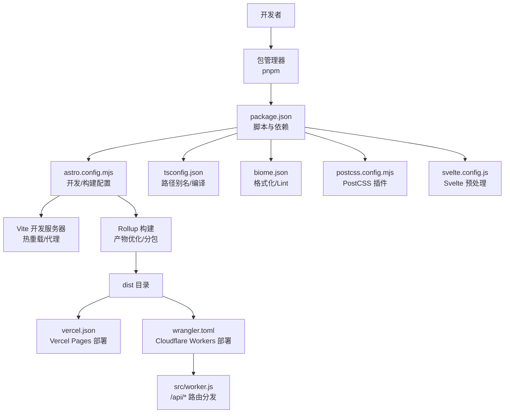
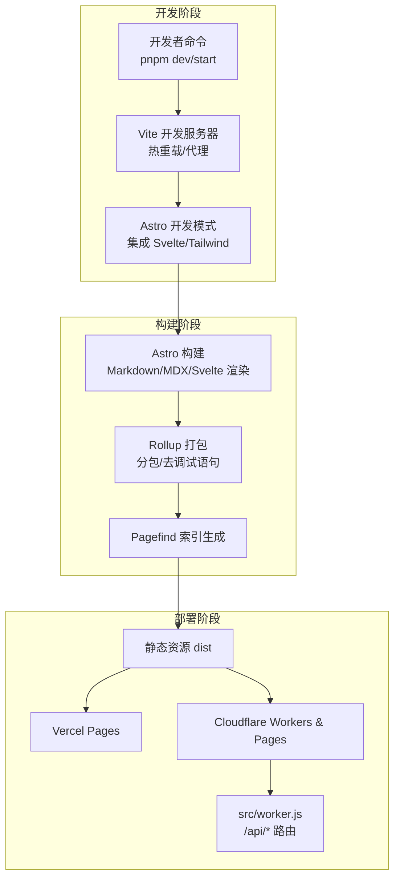
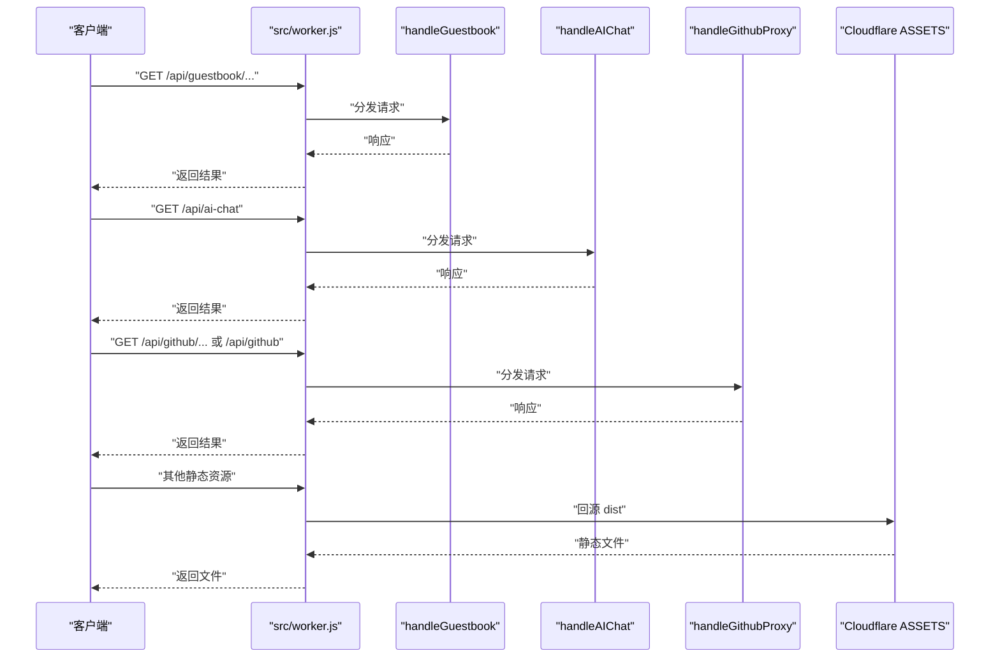
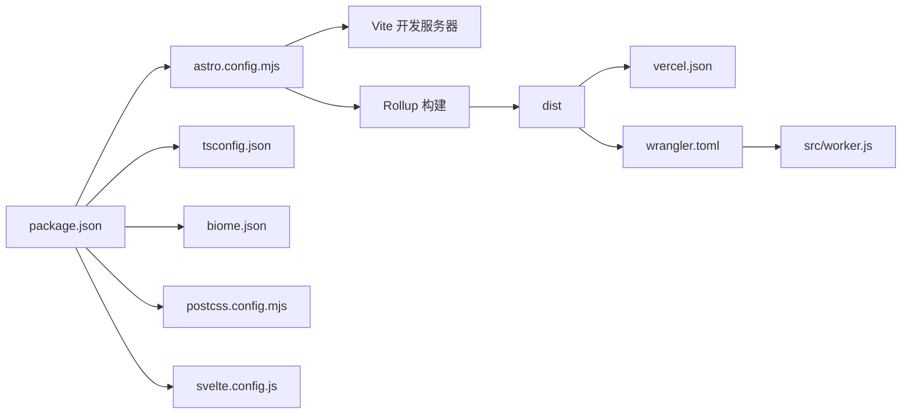

# 开发环境配置

<cite>
**本文引用的文件**
- [package.json](file://package.json)
- [astro.config.mjs](file://astro.config.mjs)
- [vercel.json](file://vercel.json)
- [wrangler.toml](file://wrangler.toml)
- [tsconfig.json](file://tsconfig.json)
- [biome.json](file://biome.json)
- [postcss.config.mjs](file://postcss.config.mjs)
- [svelte.config.js](file://svelte.config.js)
- [src/config/index.ts](file://src/config/index.ts)
- [src/config/siteConfig.ts](file://src/config/siteConfig.ts)
- [src/config/expressiveCodeConfig.ts](file://src/config/expressiveCodeConfig.ts)
- [src/config/commentConfig.ts](file://src/config/commentConfig.ts)
- [scripts/generate-icons.js](file://scripts/generate-icons.js)
- [scripts/new-post.js](file://scripts/new-post.js)
- [src/env.d.ts](file://src/env.d.ts)
- [src/global.d.ts](file://src/global.d.ts)
- [src/worker.js](file://src/worker.js)
- [CONTRIBUTING.md](file://CONTRIBUTING.md)
- [.github/pull_request_template.md](file://.github/pull_request_template.md)
</cite>

## 目录
1. [简介](#简介)
2. [项目结构](#项目结构)
3. [核心组件](#核心组件)
4. [架构总览](#架构总览)
5. [详细组件分析](#详细组件分析)
6. [依赖关系分析](#依赖关系分析)
7. [性能考虑](#性能考虑)
8. [故障排除指南](#故障排除指南)
9. [结论](#结论)
10. [附录](#附录)

## 简介
本文件面向参与本项目的开发者，提供从零到一的开发环境搭建与维护指南。内容覆盖 Node.js 版本与包管理器、依赖安装、开发服务器启动与热重载、构建工具配置（Astro、Cloudflare Workers、Vercel）、调试工具与 IDE 配置、Git 工作流与分支策略、以及常见问题排查。文档基于仓库现有配置文件整理，确保与实际代码一致。

## 项目结构
本项目采用 Astro + Svelte 的前端技术栈，结合 TailwindCSS、Biome、Pagefind 等工具，支持本地开发、构建与多平台部署（Vercel Pages、Cloudflare Workers）。关键目录与文件职责概览：
- 根级配置：package.json（脚本、依赖、包管理器锁定）、astro.config.mjs（构建与开发服务器配置）、tsconfig.json（TypeScript 路径别名与编译选项）、biome.json（格式化与 Lint 规则）、postcss.config.mjs（PostCSS 插件）、svelte.config.js（Svelte 预处理）
- 配置与类型：src/config 下集中管理站点、评论、代码高亮等配置；src/types 下定义类型
- 构建与脚本：scripts 目录包含图标生成、新文章创建等自动化脚本
- Workers：src/worker.js 作为 Cloudflare Worker 入口，统一处理 /api/* 请求并回源静态资源
- 部署：vercel.json（Vercel Pages 配置）、wrangler.toml（Cloudflare Workers Pages 配置）

图表来源
- [package.json:1-112](file://package.json#L1-L112)
- [astro.config.mjs:47-307](file://astro.config.mjs#L47-L307)
- [vercel.json:1-40](file://vercel.json#L1-L40)
- [wrangler.toml:1-36](file://wrangler.toml#L1-L36)
- [tsconfig.json:1-50](file://tsconfig.json#L1-L50)
- [biome.json:1-66](file://biome.json#L1-L66)
- [postcss.config.mjs:1-10](file://postcss.config.mjs#L1-L10)
- [svelte.config.js:1-6](file://svelte.config.js#L1-L6)
- [src/worker.js:1-27](file://src/worker.js#L1-L27)

章节来源
- [package.json:1-112](file://package.json#L1-L112)
- [astro.config.mjs:47-307](file://astro.config.mjs#L47-L307)
- [vercel.json:1-40](file://vercel.json#L1-L40)
- [wrangler.toml:1-36](file://wrangler.toml#L1-L36)
- [tsconfig.json:1-50](file://tsconfig.json#L1-L50)
- [biome.json:1-66](file://biome.json#L1-L66)
- [postcss.config.mjs:1-10](file://postcss.config.mjs#L1-L10)
- [svelte.config.js:1-6](file://svelte.config.js#L1-L6)

## 核心组件
- 包管理器与版本锁定：根级 package.json 明确使用 pnpm，并通过 preinstall 脚本限制只能使用 pnpm，避免混用导致锁文件不一致
- 开发服务器：基于 Vite，提供热重载与代理；开发模式下调整事件监听上限以稳定开发体验
- 构建工具：Astro + esbuild/Rollup，内置按模块分包、移除调试语句、CSS 优化与资源内联阈值控制
- 部署配置：Vercel Pages 与 Cloudflare Workers Pages 双通道部署，分别通过 vercel.json 与 wrangler.toml 配置
- 代码质量：Biome 格式化与 Lint，TypeScript 路径别名与严格检查，PostCSS 插件链保证样式一致性
- 配置中心：src/config 下集中导出站点、评论、代码高亮等配置，便于组件复用与统一管理

章节来源
- [package.json:16-18](file://package.json#L16-L18)
- [astro.config.mjs:42-44](file://astro.config.mjs#L42-L44)
- [astro.config.mjs:238-305](file://astro.config.mjs#L238-L305)
- [vercel.json:1-40](file://vercel.json#L1-L40)
- [wrangler.toml:1-36](file://wrangler.toml#L1-L36)
- [biome.json:1-66](file://biome.json#L1-L66)
- [tsconfig.json:18-40](file://tsconfig.json#L18-L40)
- [postcss.config.mjs:1-10](file://postcss.config.mjs#L1-L10)
- [src/config/index.ts:1-66](file://src/config/index.ts#L1-L66)

## 架构总览
下图展示开发、构建与部署的整体流程，以及关键配置文件之间的关系：

图表来源
- [package.json:5-18](file://package.json#L5-L18)
- [astro.config.mjs:47-307](file://astro.config.mjs#L47-L307)
- [vercel.json:1-40](file://vercel.json#L1-L40)
- [wrangler.toml:1-36](file://wrangler.toml#L1-L36)
- [src/worker.js:1-27](file://src/worker.js#L1-L27)

## 详细组件分析

### Node.js 与包管理器
- Node.js 版本：Cloudflare Worker 配置中声明 NODE_VERSION=22，建议本地使用相同或兼容版本以避免运行时差异
- 包管理器：明确使用 pnpm，preinstall 脚本强制仅允许 pnpm 安装，避免 yarn/npm 混用
- 依赖安装：使用 pnpm install 安装根依赖与工作区依赖

章节来源
- [wrangler.toml:9](file://wrangler.toml#L9)
- [package.json:16](file://package.json#L16)
- [package.json:110](file://package.json#L110)

### 开发服务器与热重载
- 启动命令：dev/start 均指向 astro dev，开发服务器默认监听端口由 Vite 决定
- 热重载：Vite 默认启用，无需额外配置
- 代理设置：开发服务器通过 proxy 将 /api 前缀转发至本地后端服务（默认 http://localhost:8787）
- 忽略监听：watch.ignored 排除 package 与 Firefly-docs 目录，降低不必要的重载

章节来源
- [package.json:6-7](file://package.json#L6-L7)
- [astro.config.mjs:240-250](file://astro.config.mjs#L240-L250)
- [astro.config.mjs:241-242](file://astro.config.mjs#L241-L242)

### 构建工具与参数
- 构建命令：build 脚本先执行图标生成脚本，再执行 astro build，最后运行 pagefind 生成搜索索引
- 构建优化：
  - minify/esbuild：移除 console 与 debugger
  - manualChunks：按模块与功能拆分 vendor 包（如 katex、mermaid、live2d、gsap、AI、Guestbook、Calendar）
  - CSS：关闭 cssCodeSplit，使用 esbuild 压缩
  - assetsInlineLimit：控制小资源内联阈值
- Rollup 警告抑制：针对动态/静态导入冲突与 Svelte 中误报的 unused 警告进行忽略
- 站点与资源：
  - site/base/trailingSlash：统一站点 URL 结构
  - 静态资源缓存策略：/_astro/* 长缓存，HTML 每次校验，部署平台需同步配置

章节来源
- [package.json:9](file://package.json#L9)
- [scripts/generate-icons.js:1-275](file://scripts/generate-icons.js#L1-L275)
- [astro.config.mjs:256-304](file://astro.config.mjs#L256-L304)
- [astro.config.mjs:48-51](file://astro.config.mjs#L48-L51)

### Cloudflare Workers 配置
- 入口与资源：main 指向 src/worker.js，assets.directory 指向 dist
- 变量与命名空间：
  - vars：NODE_VERSION、Umami 统计 API/Website ID
  - kv_namespaces：绑定 VISITOR_KV
  - vectorize：绑定 VECTORIZE，索引名为 blog-ai-search
  - ai：绑定 AI
- Worker 路由：
  - /api/guestbook → handleGuestbook
  - /api/ai-chat → handleAIChat
  - /api/github* → handleGithubProxy
  - 其余请求优先回源静态资源（ASSETS.fetch）

图表来源
- [src/worker.js:1-27](file://src/worker.js#L1-L27)
- [wrangler.toml:5-36](file://wrangler.toml#L5-L36)

章节来源
- [wrangler.toml:1-36](file://wrangler.toml#L1-L36)
- [src/worker.js:1-27](file://src/worker.js#L1-L27)

### Vercel 部署设置
- framework：astro
- buildCommand：pnpm build
- installCommand：pnpm install
- outputDirectory：dist
- 安全与缓存头：
  - X-Content-Type-Options、X-Frame-Options、X-XSS-Protection、Referrer-Policy
  - /_astro/* 设置 public, max-age=31536000, immutable 长缓存

章节来源
- [vercel.json:1-40](file://vercel.json#L1-L40)

### TypeScript 与路径别名
- extends：astro/tsconfigs/base
- strictNullChecks：启用严格空值检查
- jsx/react-jsx 与 jsxImportSource：配合 React JSX
- 路径别名：@components、@assets、@constants、@utils、@i18n、@layouts、@/*
- include/exclude：包含 .astro/types.d.ts 与 src，排除 dist

章节来源
- [tsconfig.json:1-50](file://tsconfig.json#L1-L50)

### Biome 代码质量
- formatter：启用，缩进使用 tab
- linter：启用，推荐规则，部分文件类型放宽规则（如 .svelte/.astro/.vue）
- vcs：禁用，不使用 Git 作为 VCS 客户端

章节来源
- [biome.json:1-66](file://biome.json#L1-L66)

### PostCSS 插件链
- postcss-import：支持 @import
- postcss-nesting：支持 CSS 嵌套

章节来源
- [postcss.config.mjs:1-10](file://postcss.config.mjs#L1-L10)

### Svelte 预处理
- vitePreprocess：启用 Svelte 预处理，支持 script 标签

章节来源
- [svelte.config.js:1-6](file://svelte.config.js#L1-L6)

### 配置中心与站点能力
- 配置入口：src/config/index.ts 统一导出各子配置
- 站点配置：siteConfig.ts 定义站点标题、URL、关键词、导航栏、页面开关、统计分析、图像优化、字体等
- 代码高亮：expressiveCodeConfig.ts 控制暗/亮主题与折叠/语言徽章插件
- 评论系统：commentConfig.ts 支持多种评论系统（Twikoo、Waline、Giscus、Disqus、Artalk），默认启用 Twikoo

章节来源
- [src/config/index.ts:1-66](file://src/config/index.ts#L1-L66)
- [src/config/siteConfig.ts:1-322](file://src/config/siteConfig.ts#L1-L322)
- [src/config/expressiveCodeConfig.ts:1-33](file://src/config/expressiveCodeConfig.ts#L1-L33)
- [src/config/commentConfig.ts:1-79](file://src/config/commentConfig.ts#L1-L79)

### 自动化脚本
- 图标生成：scripts/generate-icons.js 在构建时扫描 Svelte/Astro/TS 文件，提取图标集并生成内联 SVG 数据，输出到 src/constants/icons.ts
- 新文章：scripts/new-post.js 创建带 Front Matter 的 Markdown 文件，自动补全日期与目录层级

章节来源
- [scripts/generate-icons.js:1-275](file://scripts/generate-icons.js#L1-L275)
- [scripts/new-post.js:1-60](file://scripts/new-post.js#L1-L60)

### 类型声明
- src/env.d.ts：声明 ImportMetaEnv 与全局窗口接口（如 pagefind、音乐播放器等）
- src/global.d.ts：补充更多全局类型与接口，如 Swup、Live2D、Spine、TOC 等

章节来源
- [src/env.d.ts:1-31](file://src/env.d.ts#L1-L31)
- [src/global.d.ts:1-120](file://src/global.d.ts#L1-L120)

## 依赖关系分析
- 开发服务器与构建：astro.config.mjs 作为中枢，Vite server.proxy 与 resolve.alias 影响开发体验；Rollup manualChunks 影响产物体积与缓存命中
- 部署：vercel.json 与 wrangler.toml 分别约束 Vercel 与 Cloudflare 的构建与路由行为
- 代码质量：biome.json 与 tsconfig.json 共同保障代码风格与类型安全
- 配置耦合：src/config 下各配置被 Astro 集成与组件消费，修改需谨慎并遵循“重启开发服务器”生效的约定

图表来源
- [package.json:1-112](file://package.json#L1-L112)
- [astro.config.mjs:47-307](file://astro.config.mjs#L47-L307)
- [vercel.json:1-40](file://vercel.json#L1-L40)
- [wrangler.toml:1-36](file://wrangler.toml#L1-L36)
- [tsconfig.json:1-50](file://tsconfig.json#L1-L50)
- [biome.json:1-66](file://biome.json#L1-L66)
- [postcss.config.mjs:1-10](file://postcss.config.mjs#L1-L10)
- [svelte.config.js:1-6](file://svelte.config.js#L1-L6)
- [src/worker.js:1-27](file://src/worker.js#L1-L27)

章节来源
- [package.json:1-112](file://package.json#L1-L112)
- [astro.config.mjs:47-307](file://astro.config.mjs#L47-L307)
- [vercel.json:1-40](file://vercel.json#L1-L40)
- [wrangler.toml:1-36](file://wrangler.toml#L1-L36)
- [tsconfig.json:1-50](file://tsconfig.json#L1-L50)
- [biome.json:1-66](file://biome.json#L1-L66)
- [postcss.config.mjs:1-10](file://postcss.config.mjs#L1-L10)
- [svelte.config.js:1-6](file://svelte.config.js#L1-L6)
- [src/worker.js:1-27](file://src/worker.js#L1-L27)

## 性能考虑
- 构建优化：启用 esbuild 压缩、移除 console/debugger、按模块分包、CSS 关闭按需拆分、合理设置 assetsInlineLimit
- 缓存策略：/_astro/* 长缓存，HTML 每次校验；部署平台需同步 headers 配置
- 图像优化：src 图像优化与响应式配置，建议按需开启以平衡体积与构建时间
- 开发体验：开发模式下事件监听上限提升，代理与忽略监听减少无效重载

章节来源
- [astro.config.mjs:256-304](file://astro.config.mjs#L256-L304)
- [astro.config.mjs:257-261](file://astro.config.mjs#L257-L261)
- [vercel.json:6-38](file://vercel.json#L6-L38)
- [src/config/siteConfig.ts:290-307](file://src/config/siteConfig.ts#L290-L307)

## 故障排除指南
- 依赖安装异常
  - 确认使用 pnpm，preinstall 已限制其他包管理器
  - 若出现锁文件不一致，清理 node_modules 并重新安装
- 开发服务器无法热重载
  - 检查 ignored 目录是否正确，避免误排除源文件
  - 确认代理目标端口（默认 8787）已启动
- 构建产物过大或缓存命中率低
  - 检查 manualChunks 分包策略与第三方库版本
  - 确认 /_astro/* 缓存头已在部署平台生效
- Cloudflare Workers 访问 /api 失败
  - 确认 src/worker.js 路由分发逻辑与 wrangler.toml 变量/命名空间配置一致
  - 检查 KV/Vectorize/变量是否在 Cloudflare Dashboard 正确设置
- Vercel 部署 404 或静态资源缺失
  - 确认 vercel.json 的 outputDirectory 与 buildCommand 一致
  - 检查 headers 中缓存与安全头是否正确
- 代码格式与 Lint 报错
  - 使用 pnpm format/lint 修复或检查 biomes 规则
- TypeScript 类型错误
  - 检查 tsconfig.json 路径别名与 include/exclude
  - 如涉及 Astro 类型，确认 .astro/types.d.ts 存在

章节来源
- [package.json:16](file://package.json#L16)
- [astro.config.mjs:240-250](file://astro.config.mjs#L240-L250)
- [astro.config.mjs:256-304](file://astro.config.mjs#L256-L304)
- [vercel.json:1-40](file://vercel.json#L1-L40)
- [wrangler.toml:1-36](file://wrangler.toml#L1-L36)
- [src/worker.js:1-27](file://src/worker.js#L1-L27)
- [biome.json:1-66](file://biome.json#L1-L66)
- [tsconfig.json:1-50](file://tsconfig.json#L1-L50)

## 结论
本项目以 Astro 为核心，结合 Svelte、TailwindCSS、Biome、Pagefind 等工具，形成完整的开发、构建与部署闭环。通过严格的配置中心与脚本化工具，提升了开发效率与产物质量。建议在团队协作中遵循 Conventional Commits 与 PR 模板，保持提交历史清晰与变更可控。

## 附录

### 开发环境搭建步骤
- 安装 Node.js（建议与 Cloudflare Worker 一致，即 22）
- 使用 pnpm 安装依赖
- 启动开发服务器
- 如需后端 API，请在同一机器启动本地服务并确保代理目标可达

章节来源
- [wrangler.toml:9](file://wrangler.toml#L9)
- [package.json:110](file://package.json#L110)
- [package.json:6](file://package.json#L6)
- [astro.config.mjs:244-249](file://astro.config.mjs#L244-L249)

### 依赖安装与脚本
- 依赖安装：pnpm install
- 开发：pnpm dev 或 pnpm start
- 类型检查：pnpm type-check
- 构建：pnpm build（含图标生成与 Pagefind 索引）
- 预览：pnpm preview
- 格式化：pnpm format
- Lint：pnpm lint
- 新文章：pnpm new-post -- <文件名>

章节来源
- [package.json:5-18](file://package.json#L5-L18)

### 配置与调试要点
- 开发服务器代理：/api → http://localhost:8787
- 站点配置：siteConfig.ts 中的 pages、analytics、imageOptimization 等
- 代码高亮：expressiveCodeConfig.ts 控制主题与折叠
- 评论系统：commentConfig.ts 选择并配置任一评论系统
- 全局类型：src/env.d.ts 与 src/global.d.ts 提供运行时接口

章节来源
- [astro.config.mjs:244-249](file://astro.config.mjs#L244-L249)
- [src/config/siteConfig.ts:169-204](file://src/config/siteConfig.ts#L169-L204)
- [src/config/expressiveCodeConfig.ts:9-32](file://src/config/expressiveCodeConfig.ts#L9-L32)
- [src/config/commentConfig.ts:3-78](file://src/config/commentConfig.ts#L3-L78)
- [src/env.d.ts:1-31](file://src/env.d.ts#L1-L31)
- [src/global.d.ts:1-120](file://src/global.d.ts#L1-L120)

### Git 工作流与分支管理
- 提交规范：遵循 Conventional Commits
- PR 模板：使用 .github/pull_request_template.md
- 代码检查：提交前执行 pnpm check 与 pnpm format

章节来源
- [CONTRIBUTING.md:13](file://CONTRIBUTING.md#L13)
- [.github/pull_request_template.md:1-38](file://.github/pull_request_template.md#L1-L38)