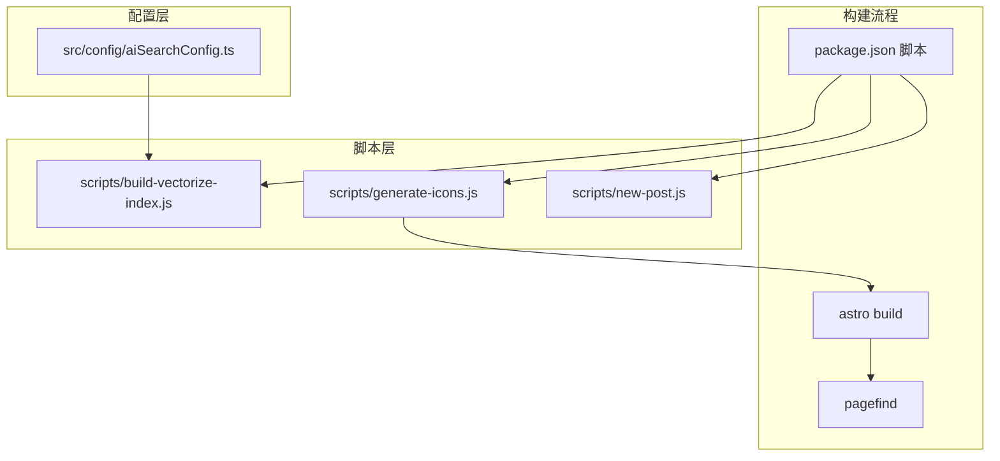
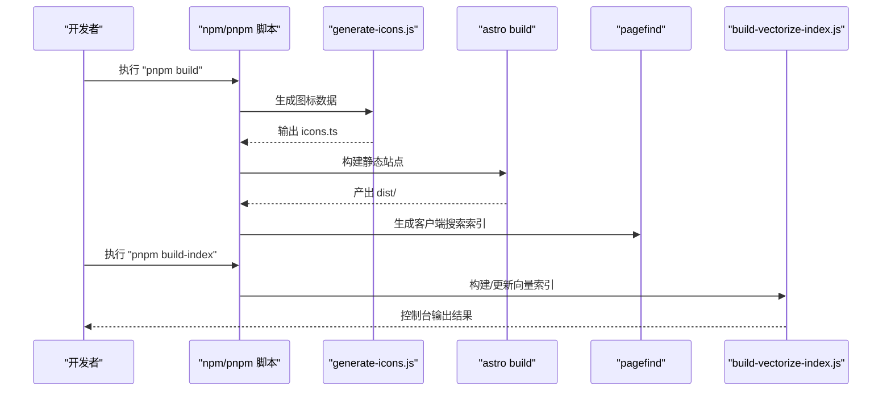
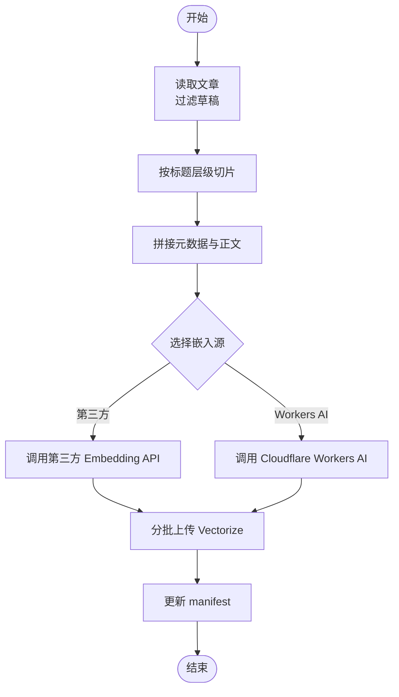
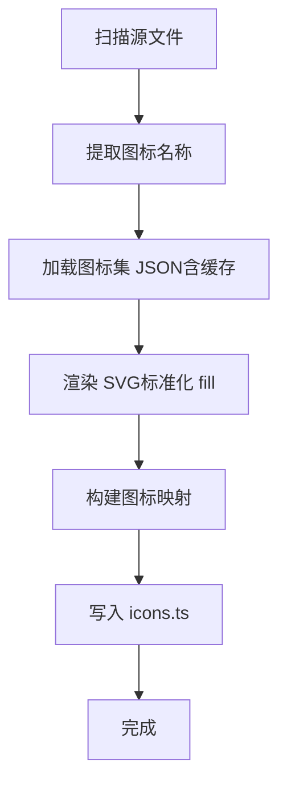
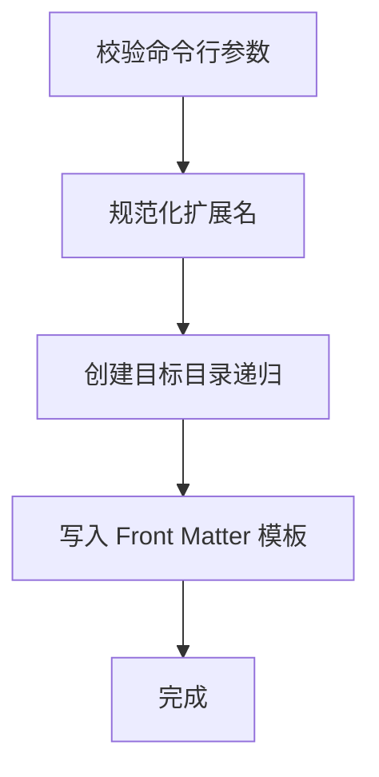
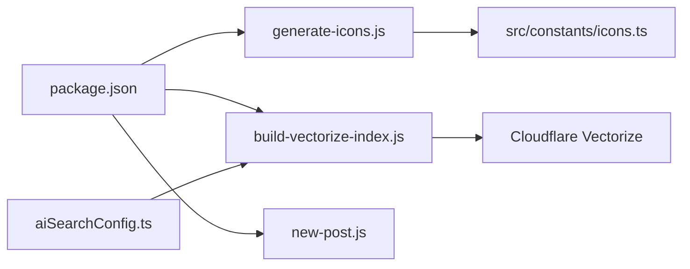

# 自动化脚本

<cite>
**本文档引用的文件**
- [build-vectorize-index.js](file://scripts/build-vectorize-index.js)
- [generate-icons.js](file://scripts/generate-icons.js)
- [new-post.js](file://scripts/new-post.js)
- [aiSearchConfig.ts](file://src/config/aiSearchConfig.ts)
- [package.json](file://package.json)
- [README.md](file://README.md)
</cite>

## 目录
1. [简介](#简介)
2. [项目结构](#项目结构)
3. [核心组件](#核心组件)
4. [架构总览](#架构总览)
5. [详细组件分析](#详细组件分析)
6. [依赖关系分析](#依赖关系分析)
7. [性能考量](#性能考量)
8. [故障排查指南](#故障排查指南)
9. [结论](#结论)
10. [附录](#附录)

## 简介
本文件系统性梳理并深入解读本项目的三大自动化脚本：向量索引构建脚本、图标生成脚本与新文章创建脚本。文档覆盖每个脚本的功能定位、输入输出、处理流程、关键算法、错误处理、性能特征与扩展方法，并给出在本地与 CI/CD 中的集成实践建议。

## 项目结构
三个自动化脚本均位于 scripts 目录，分别承担不同职责：
- 向量索引构建：读取文章内容，按标题层级切片，生成向量并上传至 Cloudflare Vectorize，支持增量更新与全量重建。
- 图标生成：扫描源代码中的图标使用，按需拉取图标集 JSON，生成内联 SVG 数据文件，供运行时快速渲染。
- 新文章创建：根据模板生成带 Front Matter 的 Markdown 文件，自动补全日期与目录结构。

图表来源
- [build-vectorize-index.js:1-388](file://scripts/build-vectorize-index.js#L1-L388)
- [generate-icons.js:1-275](file://scripts/generate-icons.js#L1-L275)
- [new-post.js:1-60](file://scripts/new-post.js#L1-L60)
- [aiSearchConfig.ts:1-30](file://src/config/aiSearchConfig.ts#L1-L30)
- [package.json:1-112](file://package.json#L1-L112)

章节来源
- [package.json:1-112](file://package.json#L1-L112)
- [README.md:32-82](file://README.md#L32-L82)

## 核心组件
- 向量索引构建脚本（build-vectorize-index.js）
  - 功能：从文章内容切片、生成嵌入、上传 Vectorize，支持增量与全量两种模式。
  - 关键点：基于灰度配置与环境变量控制第三方 Embedding API 或 Cloudflare Workers AI；使用 manifest 进行增量更新；分批请求与延迟退避以规避限流。
- 图标生成脚本（generate-icons.js）
  - 功能：扫描源码中的图标使用，按需加载图标集 JSON，生成内联 SVG 数据文件。
  - 关键点：多模式匹配图标名称；按图标集分组统计；生成类型安全的导出函数。
- 新文章创建脚本（new-post.js）
  - 功能：生成带 Front Matter 的 Markdown 文件，自动补全日期与目录。
  - 关键点：参数校验、路径安全、扩展名规范化、递归创建目录。

章节来源
- [build-vectorize-index.js:1-388](file://scripts/build-vectorize-index.js#L1-L388)
- [generate-icons.js:1-275](file://scripts/generate-icons.js#L1-L275)
- [new-post.js:1-60](file://scripts/new-post.js#L1-L60)

## 架构总览
整体构建流程由 npm 脚本编排：先生成图标数据，再执行 Astro 构建，最后运行 pagefind 生成客户端搜索索引。AI 搜索向量索引由独立脚本维护，既可手动执行，也可纳入 CI/CD。

图表来源
- [package.json:9-18](file://package.json#L9-L18)
- [generate-icons.js:207-275](file://scripts/generate-icons.js#L207-L275)
- [build-vectorize-index.js:324-387](file://scripts/build-vectorize-index.js#L324-L387)

章节来源
- [README.md:66](file://README.md#L66)
- [package.json:9-18](file://package.json#L9-L18)

## 详细组件分析

### 向量索引构建脚本（build-vectorize-index.js）

- 功能与目标
  - 读取所有文章（排除草稿），按标题层级切分为“章节块”，为每块生成向量并上传至 Cloudflare Vectorize。
  - 支持两种模式：增量更新（默认，基于 manifest）与全量重建（--force）。
- 输入/输出
  - 输入：src/content/posts 下的 Markdown/MDX 文章、aiSearchConfig.ts 配置、.env 环境变量（Cloudflare 凭证与可选第三方 API Key）。
  - 输出：Vectorize 索引中的向量数据；本地 .vectorize-manifest.json 用于增量更新。
- 数据处理流程
  - 读取与过滤：glob 匹配文章文件，gray-matter 解析 Front Matter，过滤草稿。
  - 切片策略：按标题层级（最多四级）切分，不足最小长度的片段丢弃。
  - 片段增强：为每块拼接标题、发布日期、分类、标签、章节路径与正文，形成最终文本。
  - 嵌入生成：优先使用第三方 Embedding API（由 aiSearchConfig.ts 指定），否则回退至 Cloudflare Workers AI。
  - 上传：分批插入 Vectorize，批次大小与嵌入批次大小均可配置。
  - 增量更新：对比 manifest 中的哈希与当前内容哈希，仅对新增/变更/删除的块执行相应操作。
- 错误处理
  - 环境变量缺失时直接退出。
  - API 返回非 2xx 时抛出错误并打印上下文。
  - 删除索引时对 404 进行宽容处理（索引不存在或已被删除）。
  - 嵌入/上传失败时记录失败范围并继续后续批次。
- 性能与优化
  - 分批与并发：嵌入与上传均采用分批，减少单次请求体积与内存占用。
  - 延迟退避：嵌入批次间加入短暂延迟，缓解第三方 API 限流风险。
  - 哈希与 manifest：通过内容哈希与 chunkId 列表实现高效增量。
- 关键配置
  - aiSearchConfig.ts：indexName、vectorizeDim、batchSize、embedBatchSize、apiUrl、embeddingModel 等。
  - .env：CLOUDFLARE_API_TOKEN、CLOUDFLARE_ACCOUNT_ID、可选 AI_API_KEY。

图表来源
- [build-vectorize-index.js:100-188](file://scripts/build-vectorize-index.js#L100-L188)
- [build-vectorize-index.js:192-222](file://scripts/build-vectorize-index.js#L192-L222)
- [build-vectorize-index.js:226-273](file://scripts/build-vectorize-index.js#L226-L273)
- [build-vectorize-index.js:324-387](file://scripts/build-vectorize-index.js#L324-L387)

章节来源
- [build-vectorize-index.js:1-388](file://scripts/build-vectorize-index.js#L1-L388)
- [aiSearchConfig.ts:8-29](file://src/config/aiSearchConfig.ts#L8-L29)
- [README.md:149](file://README.md#L149)

### 图标生成脚本（generate-icons.js）

- 功能与目标
  - 扫描 Svelte/Astro/TS 源文件中的图标使用，按需加载图标集 JSON，生成内联 SVG 字符串映射文件，供运行时 getIconSvg/hasIcon 使用。
- 输入/输出
  - 输入：src 下的 Svelte/Astro/TS 文件；各图标集包（如 material-symbols、fa7-* 等）。
  - 输出：src/constants/icons.ts，包含图标映射、辅助函数与类型导出。
- 处理流程
  - 文件遍历：递归扫描指定扩展名文件，跳过 node_modules 与隐藏目录。
  - 名称提取：使用多正则模式匹配 icon 属性、函数调用与对象属性中的图标名。
  - 图标加载：按图标前缀查找对应包，读取 icons.json，提取图标数据。
  - 渲染与标准化：将图标转为 SVG，确保 fill="currentColor" 以适配主题色；去重与排序。
  - 文件生成：生成类型安全的映射与工具函数，写入目标文件。
- 错误处理
  - 未知图标集：警告并跳过。
  - 图标集加载失败：警告并跳过。
  - 图标不存在：警告并跳过。
- 性能与优化
  - 图标集数据缓存：避免重复读取同一图标集。
  - 批量写入：一次性生成并写入文件，减少 IO 次数。
- 扩展方法
  - 新增图标集：在 ICON_SETS 中注册包名；脚本会自动解析 node_modules 中的 icons.json。

图表来源
- [generate-icons.js:37-59](file://scripts/generate-icons.js#L37-L59)
- [generate-icons.js:64-91](file://scripts/generate-icons.js#L64-L91)
- [generate-icons.js:96-117](file://scripts/generate-icons.js#L96-L117)
- [generate-icons.js:122-154](file://scripts/generate-icons.js#L122-L154)
- [generate-icons.js:159-202](file://scripts/generate-icons.js#L159-L202)
- [generate-icons.js:207-275](file://scripts/generate-icons.js#L207-L275)

章节来源
- [generate-icons.js:1-275](file://scripts/generate-icons.js#L1-L275)

### 新文章创建脚本（new-post.js）

- 功能与目标
  - 快速创建带标准 Front Matter 的 Markdown 文件，自动补全日期、目录与扩展名。
- 输入/输出
  - 输入：命令行参数（文件名）。
  - 输出：src/content/posts 下的 Markdown 文件。
- 处理流程
  - 参数校验：缺少参数时报错并退出。
  - 扩展名规范化：若无 .md/.mdx 扩展名则追加 .md。
  - 目录准备：若目标目录不存在则递归创建。
  - 内容生成：按模板写入 Front Matter（标题、发布日期、描述、标签、分类、草稿等）。
- 错误处理
  - 文件已存在：报错并退出。
  - 目录创建失败：交由系统错误处理。
- 使用建议
  - 建议在执行前确认目标目录结构与权限。
  - 可结合编辑器快捷键或 IDE 集成一键调用。

图表来源
- [new-post.js:15-37](file://scripts/new-post.js#L15-L37)
- [new-post.js:45-57](file://scripts/new-post.js#L45-L57)

章节来源
- [new-post.js:1-60](file://scripts/new-post.js#L1-L60)
- [README.md:199-214](file://README.md#L199-L214)

## 依赖关系分析
- 脚本与配置
  - build-vectorize-index.js 依赖 aiSearchConfig.ts 中的索引名称、维度、批大小与第三方 API 配置。
  - generate-icons.js 依赖 package.json 中的图标集依赖与 @iconify/utils。
  - new-post.js 为独立脚本，不依赖外部配置。
- 脚本与构建流程
  - package.json 的 build 脚本串联 generate-icons.js → astro build → pagefind。
  - build-index 脚本可单独执行，用于维护 AI 搜索向量索引。
- 外部依赖
  - Cloudflare API 与 Vectorize 服务（用于向量索引构建）。
  - 第三方 Embedding API（可选，由 AI_API_KEY 与 apiUrl 驱动）。

图表来源
- [package.json:9-18](file://package.json#L9-L18)
- [build-vectorize-index.js:60-77](file://scripts/build-vectorize-index.js#L60-L77)
- [aiSearchConfig.ts:8-29](file://src/config/aiSearchConfig.ts#L8-L29)

章节来源
- [package.json:1-112](file://package.json#L1-L112)
- [README.md:149](file://README.md#L149)

## 性能考量
- 向量索引构建
  - 嵌入与上传分批，降低内存峰值与网络压力；嵌入批次间延迟有助于应对第三方 API 限流。
  - 增量更新显著减少重复计算与网络传输。
- 图标生成
  - 图标集缓存避免重复 IO；批量写入减少磁盘开销。
- 新文章创建
  - 文件写入为单次操作，性能开销极低。

## 故障排查指南
- 向量索引构建
  - 环境变量缺失：检查 .env 是否包含 CLOUDFLARE_API_TOKEN 与 CLOUDFLARE_ACCOUNT_ID；若使用第三方 API，还需 AI_API_KEY。
  - API 返回错误：查看具体状态码与响应体，确认凭据与配额。
  - 索引不存在：脚本会尝试创建索引（当使用 --force 或首次运行时），若失败请检查账户权限。
  - 增量更新异常：清理 .vectorize-manifest.json 后重试全量重建。
- 图标生成
  - 未知图标集：确认 ICON_SETS 中是否注册该包；检查 node_modules 对应包是否存在。
  - 图标未找到：确认图标名称格式为 "前缀:名称"，且图标存在于对应包中。
  - 生成文件为空：检查源文件中是否正确使用图标名称（支持多种书写形式）。
- 新文章创建
  - 文件已存在：更换文件名或删除已有文件。
  - 目录权限不足：以管理员权限或调整目录权限后重试。

章节来源
- [build-vectorize-index.js:74-77](file://scripts/build-vectorize-index.js#L74-L77)
- [build-vectorize-index.js:244-251](file://scripts/build-vectorize-index.js#L244-L251)
- [generate-icons.js:102-116](file://scripts/generate-icons.js#L102-L116)
- [generate-icons.js:134-138](file://scripts/generate-icons.js#L134-L138)
- [new-post.js:34-37](file://scripts/new-post.js#L34-L37)

## 结论
本项目的自动化脚本体系围绕“构建期优化”与“开发效率提升”展开：通过图标内联与向量索引的预处理，显著改善运行时性能与搜索体验；通过新文章模板脚本，降低写作门槛。建议在 CI/CD 中将图标生成与向量索引构建纳入常规流程，确保产物一致性与可追溯性。

## 附录

### 运行环境与依赖安装
- Node.js 版本：≥ 22（见 README）
- 包管理：pnpm（版本 ≥ 9，preinstall 限制）
- 依赖安装：执行 pnpm install
- 构建命令：pnpm build（串联图标生成 → Astro 构建 → pagefind）
- 常用脚本：
  - 重新生成图标：pnpm icons
  - 构建/更新 AI 搜索向量索引：pnpm build-index
  - 强制全量重建：pnpm build-index -- --force
  - 新建文章：pnpm new-post -- <文件名>

章节来源
- [README.md:32-64](file://README.md#L32-L64)
- [package.json:5-18](file://package.json#L5-L18)

### CI/CD 集成与最佳实践
- 推荐流程
  - 代码推送触发类型检查与 Lint（参考 README 中的 ci.yml）。
  - 构建阶段执行 pnpm build，确保图标与索引处于最新状态。
  - 部署前执行 pnpm build-index（可选，若使用 AI 搜索）。
- 最佳实践
  - 将 CLOUDFLARE_API_TOKEN、CLOUDFLARE_ACCOUNT_ID、AI_API_KEY 等敏感变量配置在 CI 环境中。
  - 使用缓存策略减少依赖安装时间（pnpm store）。
  - 将 .vectorize-manifest.json 与 dist/ 产物纳入缓存或制品库，便于回溯与重用。
  - 对第三方 Embedding API 的调用增加重试与超时配置，避免偶发失败影响流水线。

章节来源
- [README.md:126-136](file://README.md#L126-L136)
- [README.md:149](file://README.md#L149)