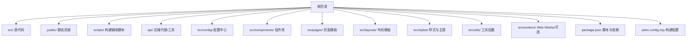
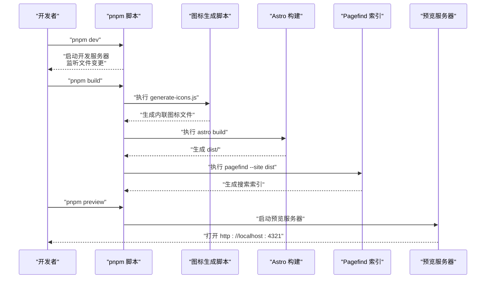
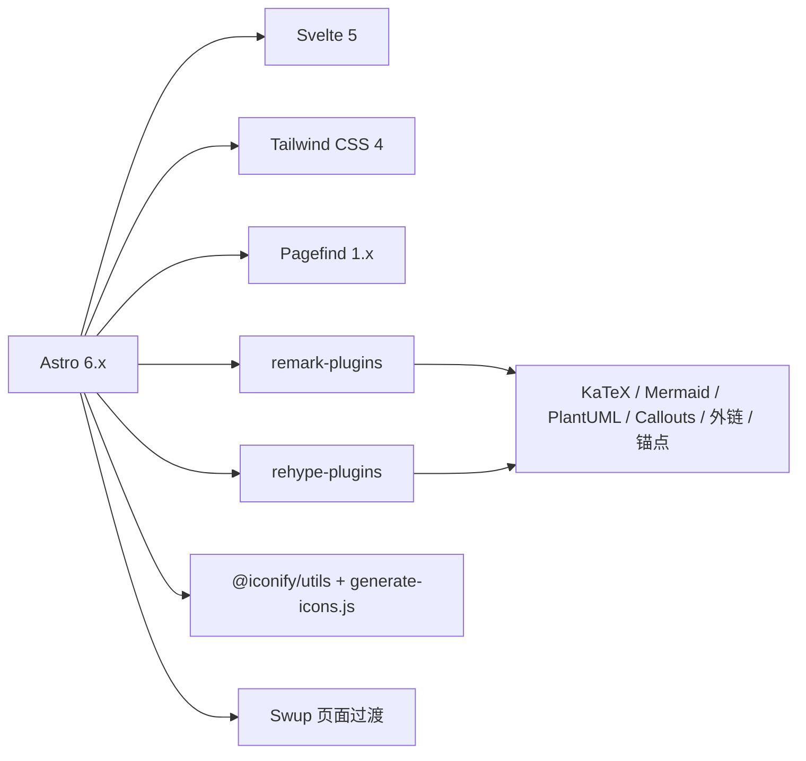

# 快速开始

<cite>
**本文引用的文件**
- [package.json](file://package.json)
- [README.md](file://README.md)
- [astro.config.mjs](file://astro.config.mjs)
- [src/config/index.ts](file://src/config/index.ts)
- [src/config/siteConfig.ts](file://src/config/siteConfig.ts)
- [src/config/commentConfig.ts](file://src/config/commentConfig.ts)
- [src/config/aiSearchConfig.ts](file://src/config/aiSearchConfig.ts)
- [scripts/generate-icons.js](file://scripts/generate-icons.js)
- [scripts/new-post.js](file://scripts/new-post.js)
- [src/pages/index.astro](file://src/pages/index.astro)
- [src/layouts/Layout.astro](file://src/layouts/Layout.astro)
- [CONTRIBUTING.md](file://CONTRIBUTING.md)
</cite>

## 目录
1. [简介](#简介)
2. [项目结构](#项目结构)
3. [核心组件](#核心组件)
4. [架构总览](#架构总览)
5. [详细组件分析](#详细组件分析)
6. [依赖关系分析](#依赖关系分析)
7. [性能注意事项](#性能注意事项)
8. [故障排除指南](#故障排除指南)
9. [结论](#结论)
10. [附录](#附录)

## 简介
本指南面向首次接触 Firefly-Mod 博客项目的开发者与运营人员，帮助你在 30 分钟内完成环境准备、项目克隆、依赖安装、开发服务器启动与生产构建，并看到基本界面。文档覆盖：
- 环境要求：Node.js 22+、pnpm 9+
- 项目克隆与依赖安装
- 开发服务器启动与常用命令详解
- 生产构建与预览
- 常见问题与故障排除
- 目录结构概览与关键文件作用

## 项目结构
该项目采用 Astro 6.x + Svelte 5 + Tailwind CSS 4 的静态站点生成架构，内容与配置分离，组件化程度高，便于扩展与维护。

图表来源
- [astro.config.mjs:47-307](file://astro.config.mjs#L47-L307)
- [src/config/index.ts:1-66](file://src/config/index.ts#L1-L66)

章节来源
- [astro.config.mjs:47-307](file://astro.config.mjs#L47-L307)
- [src/config/index.ts:1-66](file://src/config/index.ts#L1-L66)

## 核心组件
- 构建与运行脚本：通过 package.json 的 scripts 定义，统一入口命令，包括开发、构建、预览、类型检查、格式化、Lint、图标生成、AI 索引构建等。
- 配置系统：集中于 src/config，通过 barrel 文件统一导出，便于组件按需导入。
- 页面与布局：页面模板位于 src/pages，布局模板位于 src/layouts，首页示例位于 src/pages/index.astro。
- Markdown 插件管线：在 astro.config.mjs 中定义 remark 与 rehype 插件顺序，涵盖数学公式、Mermaid、PlantUML、外链、锚点、Callouts 等。
- 图标内联：构建时扫描 Svelte/Astro/TS 文件，自动生成内联 SVG 图标，减少运行时请求。

章节来源
- [package.json:5-19](file://package.json#L5-L19)
- [src/config/index.ts:1-66](file://src/config/index.ts#L1-L66)
- [src/pages/index.astro:1-19](file://src/pages/index.astro#L1-L19)
- [src/layouts/Layout.astro:1-200](file://src/layouts/Layout.astro#L1-L200)
- [astro.config.mjs:182-237](file://astro.config.mjs#L182-L237)
- [scripts/generate-icons.js:1-275](file://scripts/generate-icons.js#L1-L275)

## 架构总览
下图展示从开发到生产的典型流程：pnpm dev 启动 Astro 开发服务器，热更新；pnpm build 执行图标生成、Astro 构建与 Pagefind 索引生成；pnpm preview 预览 dist 产物。

图表来源
- [package.json:9-9](file://package.json#L9-L9)
- [scripts/generate-icons.js:207-275](file://scripts/generate-icons.js#L207-L275)
- [astro.config.mjs:238-305](file://astro.config.mjs#L238-L305)

## 详细组件分析

### 环境准备与安装
- Node.js 要求：≥ 22
- 包管理器：pnpm ≥ 9
- 强制使用 pnpm：preinstall 脚本限制，确保团队一致性

建议步骤
- 安装 Node.js 22+（官方下载或包管理器）
- 安装 pnpm 9+（官方安装指南）
- 在项目根目录执行安装命令

章节来源
- [README.md:32-64](file://README.md#L32-L64)
- [package.json:16-16](file://package.json#L16-L16)
- [package.json:110-111](file://package.json#L110-L111)

### 项目克隆与依赖安装
- 克隆仓库后，在项目根目录执行安装命令
- 安装完成后，即可进入开发流程

章节来源
- [README.md:34-36](file://README.md#L34-L36)

### 开发服务器启动（pnpm dev）
- 启动 Astro 开发服务器，监听文件变更并热更新
- 默认端口：localhost:4321
- 预期输出：控制台显示“Local”、“Network”、“Press h + enter”等提示

章节来源
- [README.md:38-39](file://README.md#L38-L39)
- [package.json:6-8](file://package.json#L6-L8)

### 生产构建（pnpm build）
- 构建流程三步：图标生成 → Astro 构建 → Pagefind 索引生成
- 输出目录：dist/
- 预期输出：dist/ 产物与 Pagefind 索引文件

章节来源
- [README.md:66-66](file://README.md#L66-L66)
- [package.json:9-9](file://package.json#L9-L9)
- [scripts/generate-icons.js:207-275](file://scripts/generate-icons.js#L207-L275)
- [astro.config.mjs:238-305](file://astro.config.mjs#L238-L305)

### 预览构建产物（pnpm preview）
- 启动本地预览服务器，验证生产构建结果
- 预期输出：控制台显示预览地址

章节来源
- [README.md:44-45](file://README.md#L44-L45)
- [package.json:10-10](file://package.json#L10-L10)

### 常用命令详解
- 类型检查：pnpm check / pnpm type-check
- 格式化：pnpm format（Biome）
- Lint：pnpm lint（Biome）
- 新建文章：pnpm new-post <filename>
- 重新生成图标：pnpm icons
- 构建/更新 AI 搜索向量索引：pnpm build-index（支持 --force）

章节来源
- [README.md:68-82](file://README.md#L68-L82)
- [package.json:8-18](file://package.json#L8-L18)
- [scripts/new-post.js:1-60](file://scripts/new-post.js#L1-L60)
- [scripts/generate-icons.js:1-275](file://scripts/generate-icons.js#L1-L275)

### 配置系统概览
- 集中配置：src/config 下的各类配置文件
- 统一导出：src/config/index.ts 提供 barrel 导出，组件按需导入
- 关键配置举例：
  - 站点基础：siteConfig.ts
  - 评论系统：commentConfig.ts
  - AI 搜索：aiSearchConfig.ts

章节来源
- [README.md:85-115](file://README.md#L85-L115)
- [src/config/index.ts:1-66](file://src/config/index.ts#L1-L66)
- [src/config/siteConfig.ts:1-200](file://src/config/siteConfig.ts#L1-L200)
- [src/config/commentConfig.ts:1-79](file://src/config/commentConfig.ts#L1-L79)
- [src/config/aiSearchConfig.ts:1-30](file://src/config/aiSearchConfig.ts#L1-L30)

### Markdown 插件管线
- 解析阶段（remarkPlugins）：数学公式、阅读时长、图片网格、摘要、指令、分段、Mermaid、PlantUML 等
- HTML 转换阶段（rehypePlugins）：KaTeX、Callouts、锚点、Mermaid、PlantUML、外链、邮箱保护、组件注入、自动链接等

章节来源
- [README.md:116-125](file://README.md#L116-L125)
- [astro.config.mjs:182-237](file://astro.config.mjs#L182-L237)

### 首页与布局
- 首页模板：src/pages/index.astro 组合多个布局层组件
- 布局模板：src/layouts/Layout.astro 注入分析、字体、Favicon、OG 图、主题初始化等

章节来源
- [src/pages/index.astro:1-19](file://src/pages/index.astro#L1-L19)
- [src/layouts/Layout.astro:1-200](file://src/layouts/Layout.astro#L1-L200)

## 依赖关系分析
- 构建工具链：Astro 6.x、Svelte 5、Tailwind CSS 4、Pagefind 1.x
- Markdown 渲染：remark 与 rehype 插件生态，含 KaTeX、Mermaid、PlantUML、Callouts、外链、锚点等
- 图标系统：@iconify/utils + 自定义扫描脚本，构建时生成内联 SVG
- 代码质量：Biome（格式化与 Lint）
- 页面过渡：Swup

图表来源
- [astro.config.mjs:1-307](file://astro.config.mjs#L1-L307)
- [scripts/generate-icons.js:1-275](file://scripts/generate-icons.js#L1-L275)
- [package.json:20-91](file://package.json#L20-L91)

章节来源
- [astro.config.mjs:1-307](file://astro.config.mjs#L1-L307)
- [package.json:20-91](file://package.json#L20-L91)

## 性能注意事项
- 构建优化：Rollup 分包策略、ESBuild 压缩、移除 console/debugger、CSS 优化
- 资源缓存：静态资源长期缓存、HTML 每次校验
- 实验性选项：Rust 编译器与队列渲染（按需启用）
- 图标内联：构建时生成，减少运行时请求

章节来源
- [astro.config.mjs:256-305](file://astro.config.mjs#L256-L305)
- [scripts/generate-icons.js:1-275](file://scripts/generate-icons.js#L1-L275)

## 故障排除指南
- Node.js 版本过低
  - 现象：安装或运行时报错
  - 处理：升级至 Node.js 22+，重新安装依赖
- pnpm 版本过低或非 pnpm
  - 现象：preinstall 脚本阻止安装
  - 处理：安装 pnpm 9+，使用 pnpm install
- 开发服务器端口占用
  - 现象：端口 4321 被占用
  - 处理：释放端口或修改 Vite server.port（在 astro.config.mjs 中）
- 构建失败（Pagefind）
  - 现象：构建时报错找不到 pagefind
  - 处理：确认已安装 pagefind，或检查脚本路径
- 图标生成失败
  - 现象：构建时图标缺失
  - 处理：检查 generate-icons.js 依赖与图标名称格式
- 评论系统不可用
  - 现象：评论区空白或报错
  - 处理：检查 commentConfig.ts 中的后端地址与 Token
- AI 搜索索引未生成
  - 现象：AI 搜索无结果
  - 处理：确认 Cloudflare API 与 Vectorize 索引配置，执行 build-index

章节来源
- [README.md:138-197](file://README.md#L138-L197)
- [package.json:16-16](file://package.json#L16-L16)
- [scripts/generate-icons.js:1-275](file://scripts/generate-icons.js#L1-L275)
- [src/config/commentConfig.ts:1-79](file://src/config/commentConfig.ts#L1-L79)
- [src/config/aiSearchConfig.ts:1-30](file://src/config/aiSearchConfig.ts#L1-L30)

## 结论
通过本指南，你可以在 30 分钟内完成环境准备、项目启动与构建，并理解项目的核心组件与配置体系。建议在本地开发时先熟悉配置文件与常用命令，再逐步接入评论、统计、AI 搜索等高级功能。

## 附录

### 常用命令一览
- 安装依赖：pnpm install
- 启动开发：pnpm dev
- 构建生产：pnpm build
- 预览构建：pnpm preview
- 类型检查：pnpm check / pnpm type-check
- 格式化：pnpm format
- Lint：pnpm lint
- 新建文章：pnpm new-post <filename>
- 重新生成图标：pnpm icons
- 构建/更新 AI 搜索向量索引：pnpm build-index（支持 --force）

章节来源
- [README.md:68-82](file://README.md#L68-L82)
- [package.json:5-19](file://package.json#L5-L19)
- [scripts/new-post.js:1-60](file://scripts/new-post.js#L1-L60)

### 配置文件清单与职责
- siteConfig.ts：站点基础配置（标题、描述、主题色、页面开关、导航栏、时区等）
- commentConfig.ts：评论系统配置（Twikoo、Waline、Giscus、Artalk、Disqus）
- aiSearchConfig.ts：AI 搜索配置（模型、Embedding、向量维度、索引名等）
- 其他配置：sidebarConfig.ts、navBarConfig.ts、musicConfig.ts、pioConfig.ts、fontConfig.ts、galleryConfig.ts、friendsConfig.ts、sponsorConfig.ts、calendarConfig.ts、homePortfolioShutterConfig.ts、skillsConfig.ts、backgroundWallpaper.ts、adConfig.ts、announcementConfig.ts、licenseConfig.ts、footerConfig.ts、coverImageConfig.ts、expressiveCodeConfig.ts、plantumlConfig.ts、collectionsApiConfig.ts

章节来源
- [README.md:85-115](file://README.md#L85-L115)
- [src/config/index.ts:1-66](file://src/config/index.ts#L1-L66)