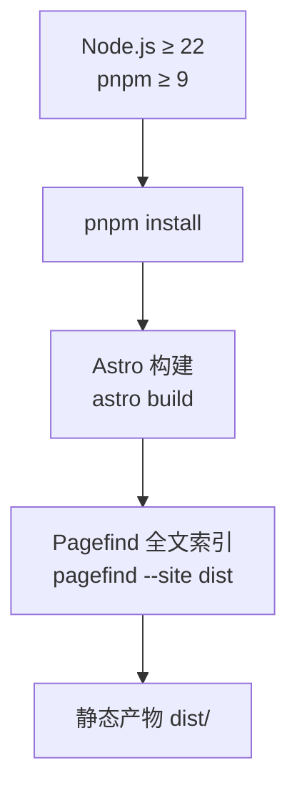
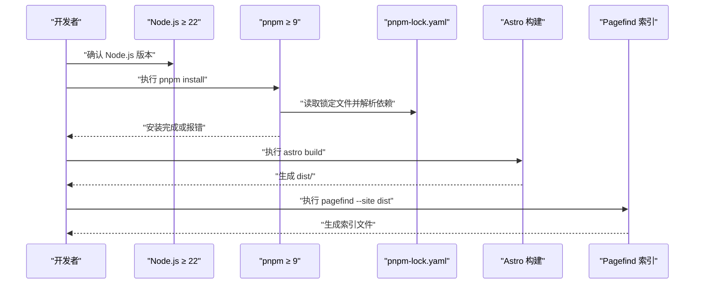
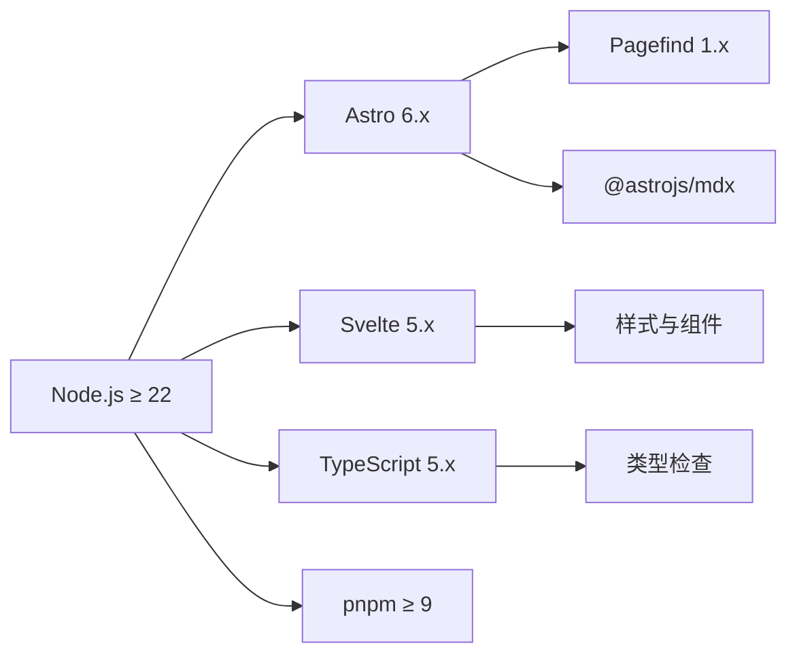

# 安装问题

<cite>
**本文档引用的文件**
- [package.json](file://package.json)
- [README.md](file://README.md)
- [pnpm-lock.yaml](file://pnpm-lock.yaml)
- [pagefind.yml](file://pagefind.yml)
- [wrangler.toml](file://wrangler.toml)
- [biome.json](file://biome.json)
</cite>

## 目录
1. [简介](#简介)
2. [项目结构](#项目结构)
3. [核心组件](#核心组件)
4. [架构总览](#架构总览)
5. [详细组件分析](#详细组件分析)
6. [依赖关系分析](#依赖关系分析)
7. [性能考量](#性能考量)
8. [故障排除指南](#故障排除指南)
9. [结论](#结论)
10. [附录](#附录)

## 简介
本指南聚焦于本项目在安装与运行过程中可能遇到的常见问题，覆盖 Node.js 版本不兼容、pnpm 包管理器安装失败、依赖下载超时、权限问题、依赖冲突、缓存清理与镜像源配置、以及在不同操作系统（Windows、macOS、Linux）上的针对性解决方案。同时提供离线安装与企业网络环境下的特殊配置方法，并给出诊断安装失败根因的思路与步骤。

## 项目结构
本项目采用 Astro 6.x + Svelte 5 + Tailwind CSS 4 + TypeScript 5 的技术栈，使用 pnpm 作为包管理器，Node.js 运行时要求 ≥ 22，pnpm 要求 ≥ 9。构建流程包含图标生成、Astro 构建与 Pagefind 全文索引生成三步。

**图表来源**
- [README.md:32-66](file://README.md#L32-L66)
- [package.json:10,16,110:10-110](file://package.json#L10-L110)

**章节来源**
- [README.md:18-31](file://README.md#L18-L31)
- [package.json:10,16,110:10-110](file://package.json#L10-L110)

## 核心组件
- Node.js 与 pnpm 版本约束：项目明确要求 Node.js ≥ 22、pnpm ≥ 9，并在 preinstall 阶段强制仅允许 pnpm。
- 构建与索引工具：Astro 构建、Pagefind 全文索引、Biome 代码质量工具。
- Cloudflare Workers 配置：wrangler.toml 中定义了变量、KV 命名空间、Vectorize 索引绑定与 AI 绑定，Node 版本固定为 22。

**章节来源**
- [README.md:5-6,29-30,66:5-6](file://README.md#L5-L6)
- [package.json:16,110:16-110](file://package.json#L16-L110)
- [wrangler.toml:8-10,26-32:8-10](file://wrangler.toml#L8-L10)

## 架构总览
安装与运行的关键路径如下：

**图表来源**
- [README.md:32-66](file://README.md#L32-L66)
- [package.json:9,16,110:9-110](file://package.json#L9-L110)
- [pnpm-lock.yaml:1-10](file://pnpm-lock.yaml#L1-L10)

## 详细组件分析

### Node.js 版本兼容性
- 项目要求 Node.js ≥ 22，且部分依赖对 Node 版本有引擎要求（例如某些包声明了 >=22.12.0 或 18.20.8 || ^20.3.0 || >=22）。
- 在 Windows/macOS/Linux 上均需满足该版本要求，否则会出现安装失败或运行时报错。

**章节来源**
- [README.md:5-6,30:5-6](file://README.md#L5-L6)
- [pnpm-lock.yaml:317,349,357:317-357](file://pnpm-lock.yaml#L317-L357)

### pnpm 包管理器与 preinstall 强制
- package.json 中通过 preinstall 脚本强制仅允许 pnpm 安装，若使用 npm/yarn 将被阻止。
- pnpm 锁定文件由 pnpm 生成，确保依赖树稳定。

**章节来源**
- [package.json:16](file://package.json#L16)
- [pnpm-lock.yaml:1](file://pnpm-lock.yaml#L1)

### 依赖下载超时与网络问题
- 常见症状：安装卡住、长时间无响应、最终超时失败。
- 可能原因：DNS 不稳定、代理配置错误、防火墙拦截、镜像源不可用或速率过低。

**章节来源**
- [package.json:16](file://package.json#L16)

### 权限问题
- Windows/macOS/Linux 上若用户对全局或本地目录权限不足，可能导致写入失败或安装中断。
- 建议以当前用户身份运行，避免使用 sudo（Linux/macOS），必要时调整目录权限或使用管理员权限。

**章节来源**
- [package.json:16](file://package.json#L16)

### 依赖冲突与版本不匹配
- 项目中存在多处对 Node 版本的引擎要求，若本地 Node 版本与依赖声明不匹配，pnpm 会拒绝安装或导致后续构建失败。
- 解决思路：统一升级 Node.js 至 ≥ 22；核对依赖的引擎字段，避免混合使用不同 Node 版本。

**章节来源**
- [pnpm-lock.yaml:317,349,357:317-357](file://pnpm-lock.yaml#L317-L357)

### 缓存清理与镜像源配置
- 清理缓存：删除本地缓存与锁文件，重新安装。
- 镜像源：配置 pnpm 使用国内镜像源可显著提升下载速度。

**章节来源**
- [package.json:16](file://package.json#L16)

### 离线安装与企业网络环境
- 离线安装：准备完整的依赖包与 pnpm-store，结合 pnpm 的离线/只读模式进行安装。
- 企业网络：配置代理、信任 CA 证书、白名单放行 npm registry 与二进制资源域名。

**章节来源**
- [package.json:16](file://package.json#L16)

## 依赖关系分析
项目对 Node.js 与 pnpm 的版本要求较为严格，且部分依赖声明了较高的 Node 版本门槛。下图展示关键依赖与其 Node 版本要求的关系：

**图表来源**
- [README.md:29-30](file://README.md#L29-L30)
- [pnpm-lock.yaml:317,349,357:317-357](file://pnpm-lock.yaml#L317-L357)

**章节来源**
- [README.md:29-30](file://README.md#L29-L30)
- [pnpm-lock.yaml:317,349,357:317-357](file://pnpm-lock.yaml#L317-L357)

## 性能考量
- 使用 pnpm 的去重与硬链接机制可减少磁盘占用与安装时间。
- 在企业网络或弱网环境下，优先配置镜像源与代理，避免重复下载。
- Pagefind 索引生成在大型站点上耗时较长，建议在 CI 环境中缓存索引产物。

**章节来源**
- [README.md:66](file://README.md#L66)

## 故障排除指南

### 1) Node.js 版本不兼容
- 症状：安装报错提示 Node 版本过低；构建时报“不支持的引擎”。
- 排查步骤：
  - 检查本地 Node.js 版本是否 ≥ 22。
  - 查看依赖声明的引擎要求，确认是否存在 >=22.12.0 或 18.20.8 || ^20.3.0 || >=22 的约束。
- 解决方案：
  - 升级 Node.js 至 ≥ 22。
  - 使用 nvm（macOS/Linux）或类似工具切换版本后再安装。

**章节来源**
- [README.md:5-6,30:5-6](file://README.md#L5-L6)
- [pnpm-lock.yaml:317,349,357:317-357](file://pnpm-lock.yaml#L317-L357)

### 2) pnpm 安装失败（非 pnpm）
- 症状：preinstall 脚本阻止使用 npm/yarn。
- 排查步骤：确认是否通过 pnpm install 执行。
- 解决方案：改用 pnpm install；若仍失败，清理缓存后重试。

**章节来源**
- [package.json:16](file://package.json#L16)

### 3) 依赖下载超时
- 症状：长时间无响应、最终超时。
- 排查步骤：
  - 检查 DNS 与网络连通性。
  - 确认防火墙/代理未拦截 npm registry 与二进制资源域名。
- 解决方案：
  - 配置 pnpm 使用镜像源（如 cnpm、npmmirror）。
  - 在企业网络中配置代理与信任证书。
  - 清理 pnpm 缓存后重试。

**章节来源**
- [package.json:16](file://package.json#L16)

### 4) 权限问题
- 症状：无法写入 node_modules、全局安装失败。
- 排查步骤：检查当前用户对项目目录与 pnpm 缓存目录的权限。
- 解决方案：
  - macOS/Linux：避免使用 sudo；修正目录权限或使用 chown。
  - Windows：以管理员身份打开终端或调整目录权限。
  - 使用 pnpm 的 store 目录指定到当前用户的可写路径。

**章节来源**
- [package.json:16](file://package.json#L16)

### 5) 依赖冲突与版本不匹配
- 症状：安装阶段报“peer 依赖不满足”或“引擎不匹配”。
- 排查步骤：
  - 核对 Node.js 版本是否满足依赖声明的引擎要求。
  - 检查 package.json 与 pnpm-lock.yaml 是否一致。
- 解决方案：
  - 升级 Node.js 至 ≥ 22。
  - 删除 node_modules、pnpm-lock.yaml 与 pnpm 缓存，重新安装。

**章节来源**
- [pnpm-lock.yaml:317,349,357:317-357](file://pnpm-lock.yaml#L317-L357)
- [package.json:16](file://package.json#L16)

### 6) 缓存清理与镜像源配置
- 步骤：
  - 清理 pnpm 缓存与锁文件，重新安装。
  - 配置 pnpm registry 与 store。
- 注意：镜像源切换后需验证连通性与稳定性。

**章节来源**
- [package.json:16](file://package.json#L16)

### 7) 离线安装与企业网络环境
- 离线安装：
  - 准备完整依赖包与 pnpm store。
  - 使用 pnpm 的离线/只读模式安装。
- 企业网络：
  - 配置代理与信任证书。
  - 将 npm registry 与二进制资源域名加入白名单。

**章节来源**
- [package.json:16](file://package.json#L16)

### 8) 不同操作系统特定解决方案
- Windows：
  - 使用管理员权限运行终端。
  - 确保 Node.js 与 pnpm 安装路径不在受保护目录。
- macOS：
  - 使用 nvm 管理 Node.js 版本。
  - 避免使用 sudo，修正目录权限。
- Linux：
  - 使用 nvm 或包管理器安装 Node.js。
  - 配置 pnpm store 到用户目录，避免权限问题。

**章节来源**
- [README.md:5-6,29-30:5-6](file://README.md#L5-L6)

### 9) 诊断安装失败的根本原因
- 网络问题：检查 DNS、代理、防火墙与镜像源可用性。
- 磁盘空间不足：清理临时文件与缓存，释放空间。
- 防火墙阻拦：放行 npm registry 与二进制资源域名。
- 版本不匹配：统一 Node.js 至 ≥ 22，核对依赖引擎要求。

**章节来源**
- [pnpm-lock.yaml:317,349,357:317-357](file://pnpm-lock.yaml#L317-L357)

## 结论
本项目对 Node.js 与 pnpm 的版本要求较为严格，安装失败多源于版本不匹配、网络受限或权限问题。遵循本文提供的排查步骤与解决方案，可在不同操作系统上高效定位并解决问题。对于企业网络与离线场景，建议提前配置镜像源、代理与缓存策略，以获得更稳定的安装体验。

## 附录

### A. 关键配置文件要点
- package.json：定义脚本、preinstall 强制 pnpm、packageManager 版本。
- pnpm-lock.yaml：锁定依赖树与版本，确保一致性。
- pagefind.yml：配置 Pagefind 排除选择器。
- wrangler.toml：定义变量、KV、Vectorize、AI 绑定与 Node 版本。
- biome.json：代码格式化与 Lint 规则配置。

**章节来源**
- [package.json:10,16,110:10-110](file://package.json#L10-L110)
- [pnpm-lock.yaml:1](file://pnpm-lock.yaml#L1)
- [pagefind.yml:1-7](file://pagefind.yml#L1-L7)
- [wrangler.toml:8-10,26-32:8-10](file://wrangler.toml#L8-L10)
- [biome.json:1-66](file://biome.json#L1-L66)