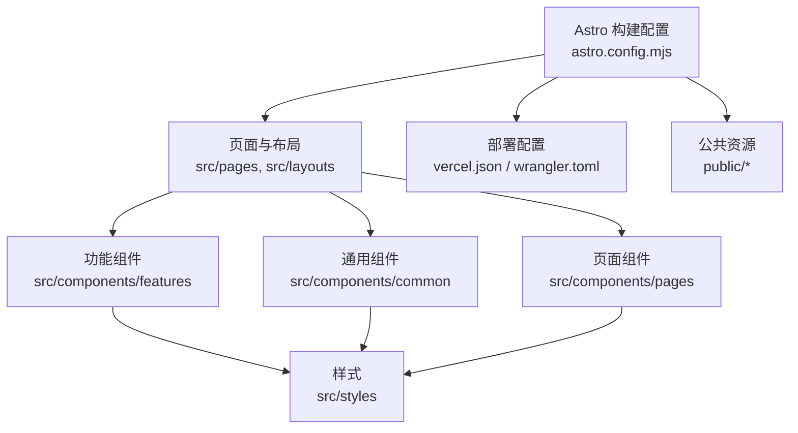
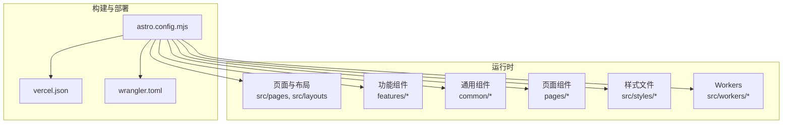
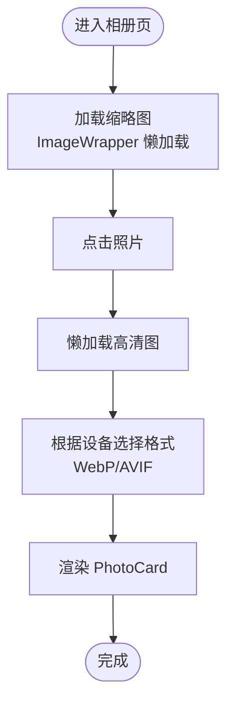
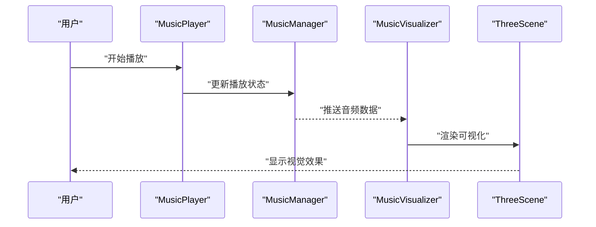
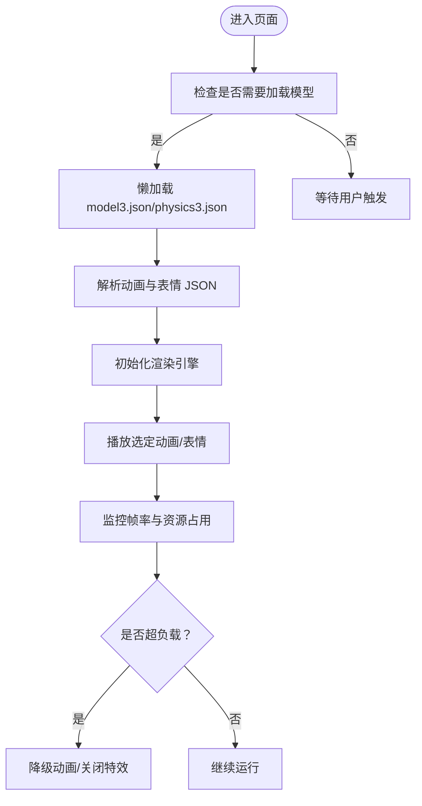
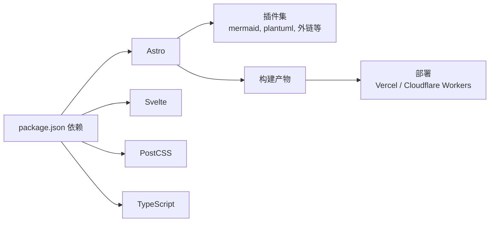

# 性能问题

<cite>
**本文引用的文件**
- [astro.config.mjs](file://astro.config.mjs)
- [package.json](file://package.json)
- [vercel.json](file://vercel.json)
- [wrangler.toml](file://wrangler.toml)
- [src/components/features/Live2DWidget.astro](file://src/components/features/Live2DWidget.astro)
- [src/components/features/music-visualizer/MusicVisualizer.svelte](file://src/components/features/music-visualizer/MusicVisualizer.svelte)
- [src/components/features/music-visualizer/ThreeScene.svelte](file://src/components/features/music-visualizer/ThreeScene.svelte)
- [src/components/features/music-visualizer/VisualizerControls.svelte](file://src/components/features/music-visualizer/VisualizerControls.svelte)
- [src/components/features/MusicManager.astro](file://src/components/features/MusicManager.astro)
- [src/components/features/MusicPlayer.astro](file://src/components/features/MusicPlayer.astro)
- [src/components/common/ImageWrapper.astro](file://src/components/common/ImageWrapper.astro)
- [src/utils/image-utils.ts](file://src/utils/image-utils.ts)
- [src/components/pages/gallery/index.astro](file://src/components/pages/gallery/index.astro)
- [src/components/pages/gallery/AlbumCard.astro](file://src/components/pages/gallery/AlbumCard.astro)
- [src/components/pages/gallery/PhotoCard.svelte](file://src/components/pages/gallery/PhotoCard.svelte)
- [src/components/pages/life/notebooks/index.astro](file://src/components/pages/life/notebooks/index.astro)
- [src/components/pages/life/notebooks/remote-entry.astro](file://src/components/pages/life/notebooks/remote-entry.astro)
- [src/components/layout/HomeHero.astro](file://src/components/layout/HomeHero.astro)
- [src/components/layout/HomePortfolioShutterLayer.astro](file://src/components/layout/HomePortfolioShutterLayer.astro)
- [src/utils/home-portfolio-shutter.js](file://src/utils/home-portfolio-shutter.js)
- [src/utils/home-data-layer.js](file://src/utils/home-data-layer.js)
- [src/components/features/PageLoader.astro](file://src/components/features/PageLoader.astro)
- [src/components/common/GlassSurface.svelte](file://src/components/common/GlassSurface.svelte)
- [src/components/common/FloatingButton.astro](file://src/components/common/FloatingButton.astro)
- [src/components/common/DropdownItem.astro](file://src/components/common/DropdownItem.astro)
- [src/components/common/ButtonTag.astro](file://src/components/common/ButtonTag.astro)
- [src/components/common/Pagination.astro](file://src/components/common/Pagination.astro)
- [src/components/common/Markdown.astro](file://src/components/common/Markdown.astro)
- [src/components/common/Icon.svelte](file://src/components/common/Icon.svelte)
- [src/components/common/ClientPagination.astro](file://src/components/common/ClientPagination.astro)
- [src/components/common/NumberTicker.svelte](file://src/components/common/NumberTicker.svelte)
- [src/components/common/VisitorCount.astro](file://src/components/common/VisitorCount.astro)
- [src/components/common/WidgetLayout.astro](file://src/components/common/WidgetLayout.astro)
- [src/components/common/portal.ts](file://src/components/common/portal.ts)
- [src/components/analytics/GoogleAnalytics.astro](file://src/components/analytics/GoogleAnalytics.astro)
- [src/components/analytics/La51Analytics.astro](file://src/components/analytics/La51Analytics.astro)
- [src/components/analytics/MicrosoftClarity.astro](file://src/components/analytics/MicrosoftClarity.astro)
- [src/components/analytics/UmamiAnalytics.astro](file://src/components/analytics/UmamiAnalytics.astro)
- [src/styles/main.css](file://src/styles/main.css)
- [src/styles/layout-styles.css](file://src/styles/layout-styles.css)
- [src/styles/features/movies-games.css](file://src/styles/features/movies-games.css)
- [src/styles/pages/music-visualizer.css](file://src/styles/pages/music-visualizer.css)
- [src/styles/widgets/terrarium-model.css](file://src/styles/widgets/terrarium-model.css)
- [src/plugins/remark-reading-time.mjs](file://src/plugins/remark-reading-time.mjs)
- [src/plugins/rehype-mermaid.mjs](file://src/plugins/rehype-mermaid.mjs)
- [src/plugins/rehype-plantuml.mjs](file://src/plugins/rehype-plantuml.mjs)
- [src/plugins/mermaid-render-script.js](file://src/plugins/mermaid-render-script.js)
- [src/plugins/plantuml-render-script.js](file://src/plugins/plantuml-render-script.js)
- [src/workers/guestbook.js](file://src/workers/guestbook.js)
- [src/workers/ai-chat.js](file://src/workers/ai-chat.js)
- [src/workers/github-proxy.js](file://src/workers/github-proxy.js)
- [src/workers/utils/streaming.js](file://src/workers/utils/streaming.js)
- [src/workers/utils/rate-limit.js](file://src/workers/utils/rate-limit.js)
- [public/pio/models/live2d/小爱弥斯_vts/小爱弥斯.model3.json](file://public/pio/models/live2d/小爱弥斯_vts/小爱弥斯.model3.json)
- [public/pio/models/live2d/小爱弥斯_vts/小爱弥斯.physics3.json](file://public/pio/models/live2d/小爱弥斯_vts/小爱弥斯.physics3.json)
- [public/pio/models/live2d/小爱弥斯_vts/小爱弥斯.vtube.json](file://public/pio/models/live2d/小爱弥斯_vts/小爱弥斯.vtube.json)
- [public/pio/models/live2d/小爱弥斯_vts/items_pinned_to_model.json](file://public/pio/models/live2d/小爱弥斯_vts/items_pinned_to_model.json)
- [public/pio/models/live2d/小爱弥斯_vts/动画/短动画/戳右猫耳.motion3.json](file://public/pio/models/live2d/小爱弥斯_vts/动画/短动画/戳右猫耳.motion3.json)
- [public/pio/models/live2d/小爱弥斯_vts/表情/笑.motion3.json](file://public/pio/models/live2d/小爱弥斯_vts/表情/笑.motion3.json)
- [public/pio/models/spine/firefly/1310.json](file://public/pio/models/spine/firefly/1310.json)
- [public/pio/models/spine/firefly/1310.atlas](file://public/pio/models/spine/firefly/1310.atlas)
- [public/assets/js/highlight.min.js](file://public/assets/js/highlight.min.js)
- [public/assets/js/marked.min.js](file://public/assets/js/marked.min.js)
- [public/assets/css/twikoo-custom.css](file://public/assets/css/twikoo-custom.css)
- [public/assets/css/twikoo.css](file://public/assets/css/twikoo.css)
- [public/assets/css/highlight-github-dark.min.css](file://public/assets/css/highlight-github-dark.min.css)
- [src/config/pioConfig.ts](file://src/config/pioConfig.ts)
- [src/config/musicConfig.ts](file://src/config/musicConfig.ts)
- [src/config/siteConfig.ts](file://src/config/siteConfig.ts)
- [src/config/index.ts](file://src/config/index.ts)
- [src/constants/constants.ts](file://src/constants/constants.ts)
- [src/constants/icons.ts](file://src/constants/icons.ts)
- [src/types/bangumi.ts](file://src/types/bangumi.ts)
- [src/types/config.ts](file://src/types/config.ts)
- [src/types/guestbook.ts](file://src/types/guestbook.ts)
- [src/types/post.ts](file://src/types/post.ts)
- [src/i18n/translation.ts](file://src/i18n/translation.ts)
- [src/i18n/i18nKey.ts](file://src/i18n/i18nKey.ts)
- [src/i18n/languages/en.ts](file://src/i18n/languages/en.ts)
- [src/i18n/languages/ja.ts](file://src/i18n/languages/ja.ts)
- [src/i18n/languages/ru.ts](file://src/i18n/languages/ru.ts)
- [src/i18n/languages/zh_CN.ts](file://src/i18n/languages/zh_CN.ts)
- [src/i18n/languages/zh_TW.ts](file://src/i18n/languages/zh_TW.ts)
- [src/layouts/Layout.astro](file://src/layouts/Layout.astro)
- [src/layouts/MainGridLayout.astro](file://src/layouts/MainGridLayout.astro)
- [src/pages/index.astro](file://src/pages/index.astro)
- [src/pages/about.astro](file://src/pages/about.astro)
- [src/pages/posts/[...slug].astro](file://src/pages/posts/[...slug].astro)
- [src/pages/gallery/index.astro](file://src/pages/gallery/index.astro)
- [src/pages/music/index.astro](file://src/pages/music/index.astro)
- [src/pages/life/notebooks/[...slug].astro](file://src/pages/life/notebooks/[...slug].astro)
- [src/pages/admin/index.astro](file://src/pages/admin/index.astro)
- [src/pages/api/allPostMeta.json.ts](file://src/pages/api/allPostMeta.json.ts)
- [src/pages/api/holidays.json.ts](file://src/pages/api/holidays.json.ts)
- [src/pages/robots.txt.ts](file://src/pages/robots.txt.ts)
- [src/pages/rss.astro](file://src/pages/rss.astro)
- [src/pages/rss.xml.ts](file://src/pages/rss.xml.ts)
- [src/pages/search.astro](file://src/pages/search.astro)
- [src/pages/404.astro](file://src/pages/404.astro)
- [src/components/misc/SharePoster.svelte](file://src/components/misc/SharePoster.svelte)
- [src/components/misc/License.astro](file://src/components/misc/License.astro)
- [src/components/misc/PostFooterActions.astro](file://src/components/misc/PostFooterActions.astro)
- [src/components/misc/RecommendedPost.astro](file://src/components/misc/RecommendedPost.astro)
- [src/components/widget/Advertisement.astro](file://src/components/widget/Advertisement.astro)
- [src/components/widget/Announcement.astro](file://src/components/widget/Announcement.astro)
- [src/components/widget/Calendar.astro](file://src/components/widget/WidgetLayout.astro)
- [src/components/widget/Categories.astro](file://src/components/widget/Categories.astro)
- [src/components/widget/CategoryRose.astro](file://src/components/widget/CategoryRose.astro)
- [src/components/widget/GithubHeatmap.astro](file://src/components/widget/GithubHeatmap.astro)
- [src/components/widget/Music.astro](file://src/components/widget/Music.astro)
- [src/components/widget/PostHeatmap.astro](file://src/components/widget/PostHeatmap.astro)
- [src/components/widget/Profile.astro](file://src/components/widget/Profile.astro)
- [src/components/widget/SidebarTOC.astro](file://src/components/widget/SidebarTOC.astro)
- [src/components/widget/TagBubble.astro](file://src/components/widget/TagBubble.astro)
- [src/components/widget/TagCardWall.astro](file://src/components/widget/TagCardWall.astro)
- [src/components/widget/TagGraph.astro](file://src/components/widget/TagGraph.astro)
- [src/components/widget/TagWordcloud.astro](file://src/components/widget/TagWordcloud.astro)
- [src/components/widget/Tags.astro](file://src/components/widget/Tags.astro)
- [src/components/widget/TerrariumModel.astro](file://src/components/widget/TerrariumModel.astro)
- [src/components/edit/EditToolbar.svelte](file://src/components/edit/EditToolbar.svelte)
- [src/components/edit/FileCodeEditor.svelte](file://src/components/edit/FileCodeEditor.svelte)
- [src/components/edit/WriteEditor.svelte](file://src/components/edit/WriteEditor.svelte)
- [src/components/edit/AlbumPhotoManager.svelte](file://src/components/edit/AlbumPhotoManager.svelte)
- [src/components/edit/BangumiEditor.svelte](file://src/components/edit/BangumiEditor.svelte)
- [src/components/edit/CollectionsEditor.svelte](file://src/components/edit/CollectionsEditor.svelte)
- [src/components/edit/ConfigEditor.svelte](file://src/components/edit/ConfigEditor.svelte)
- [src/components/edit/EditToast.svelte](file://src/components/edit/EditToast.svelte)
- [src/components/edit/FriendItemEditor.svelte](file://src/components/edit/FriendItemEditor.svelte)
- [src/components/edit/FriendsEditor.svelte](file://src/components/edit/FriendsEditor.svelte)
- [src/components/edit/GalleryEditor.svelte](file://src/components/edit/GalleryEditor.svelte)
- [src/components/edit/MarkdownPageEditor.svelte](file://src/components/edit/MarkdownPageEditor.svelte)
- [src/components/edit/MomentsEditor.svelte](file://src/components/edit/MomentsEditor.svelte)
- [src/components/edit/NotebooksEditor.svelte](file://src/components/edit/NotebooksEditor.svelte)
- [src/components/edit/RoutinesEditor.svelte](file://src/components/edit/RoutinesEditor.svelte)
- [src/components/edit/SponsorEditor.svelte](file://src/components/edit/SponsorEditor.svelte)
- [src/components/edit/ChangelogEditor.svelte](file://src/components/edit/ChangelogEditor.svelte)
- [src/components/edit/CollectionItemEditor.svelte](file://src/components/edit/CollectionItemEditor.svelte)
- [src/components/edit/FriendRulesModal.astro](file://src/components/edit/FriendRulesModal.astro)
- [src/components/edit/GuestbookComposeButton.svelte](file://src/components/edit/GuestbookComposeButton.svelte)
- [src/components/edit/GuestbookComposeModal.astro](file://src/components/edit/GuestbookComposeModal.astro)
- [src/components/edit/GuestbookDataProvider.svelte](file://src/components/edit/GuestbookDataProvider.svelte)
- [src/components/edit/GuestbookDetailModal.astro](file://src/components/edit/GuestbookDetailModal.astro)
- [src/components/edit/GuestbookListModal.svelte](file://src/components/edit/GuestbookListModal.svelte)
- [src/components/edit/GuestbookViewContainer.svelte](file://src/components/edit/GuestbookViewContainer.svelte)
- [src/components/edit/GuestbookViewTabs.svelte](file://src/components/edit/GuestbookViewTabs.svelte)
- [src/components/edit/GuestbookVirtualList.svelte](file://src/components/edit/GuestbookVirtualList.svelte)
- [src/components/features/GuestbookDataProvider.svelte](file://src/components/features/GuestbookDataProvider.svelte)
- [src/components/features/GuestbookVirtualList.svelte](file://src/components/features/GuestbookVirtualList.svelte)
- [src/components/features/GuestbookListModal.svelte](file://src/components/features/GuestbookListModal.svelte)
- [src/components/features/GuestbookDetailModal.astro](file://src/components/features/GuestbookDetailModal.astro)
- [src/components/features/GuestbookComposeModal.astro](file://src/components/features/GuestbookComposeModal.astro)
- [src/components/features/GuestbookComposeButton.svelte](file://src/components/features/GuestbookComposeButton.svelte)
- [src/components/features/GuestbookViewTabs.svelte](file://src/components/features/GuestbookViewTabs.svelte)
- [src/components/features/GuestbookViewContainer.svelte](file://src/components/features/GuestbookViewContainer.svelte)
- [src/components/features/GuestbookDataProvider.svelte](file://src/components/features/GuestbookDataProvider.svelte)
- [src/components/features/GuestbookVirtualList.svelte](file://src/components/features/GuestbookVirtualList.svelte)
- [src/components/features/GuestbookListModal.svelte](file://src/components/features/GuestbookListModal.svelte)
- [src/components/features/GuestbookDetailModal.astro](file://src/components/features/GuestbookDetailModal.astro)
- [src/components/features/GuestbookComposeModal.astro](file://src/components/features/GuestbookComposeModal.astro)
- [src/components/features/GuestbookComposeButton.svelte](file://src/components/features/GuestbookComposeButton.svelte)
- [src/components/features/GuestbookViewTabs.svelte](file://src/components/features/GuestbookViewTabs.svelte)
- [src/components/features/GuestbookViewContainer.svelte](file://src/components/features/GuestbookViewContainer.svelte)
- [src/components/features/GuestbookDataProvider.svelte](file://src/components/features/GuestbookDataProvider.svelte)
- [src/components/features/GuestbookVirtualList.svelte](file://src/components/features/GuestbookVirtualList.svelte)
- [src/components/features/GuestbookListModal.svelte](file://src/components/features/GuestbookListModal.svelte)
- [src/components/features/GuestbookDetailModal.astro](file://src/components/features/GuestbookDetailModal.astro)
- [src/components/features/GuestbookComposeModal.astro](file://src/components/features/GuestbookComposeModal.astro)
- [src/components/features/GuestbookComposeButton.svelte](file://src/components/features/GuestbookComposeButton.svelte)
- [src/components/features/GuestbookViewTabs.svelte](file://src/components/features/GuestbookViewTabs.svelte)
- [src/components/features/GuestbookViewContainer.svelte](file://src/components/features/GuestbookViewContainer.svelte)
- [src/components/features/GuestbookDataProvider.svelte](file://src/components/features/GuestbookDataProvider.svelte)
- [src/components/features/GuestbookVirtualList.svelte](file://src/components/features/GuestbookVirtualList.svelte)
- [src/components/features/GuestbookListModal.svelte](file://src/components/features/GuestbookListModal.svelte)
- [src/components/features/GuestbookDetailModal.astro](file://src/components/features/GuestbookDetailModal.astro)
- [src/components/features/GuestbookComposeModal.astro](file://src/components/features/GuestbookComposeModal.astro)
- [src/components/features/GuestbookComposeButton.svelte](file://src/components/features/GuestbookComposeButton.svelte)
- [src/components/features/GuestbookViewTabs.svelte](file://src/components/features/GuestbookViewTabs.svelte)
- [src/components/features/GuestbookViewContainer.svelte](file://src/components/features/GuestbookViewContainer.svelte)
- [src/components/features/GuestbookDataProvider.svelte](file://src/components/features/GuestbookDataProvider.svelte)
- [src/components/features/GuestbookVirtualList.svelte](file://src/components/features/GuestbookVirtualList.svelte)
- [src/components/features/GuestbookListModal.svelte](file://src/components/features/GuestbookListModal.svelte)
- [src/components/features/GuestbookDetailModal.astro](file://src/components/features/GuestbookDetailModal.astro)
- [src/components/features/GuestbookComposeModal.astro](file://src/components/features/GuestbookComposeModal.astro)
- [src/components/features/GuestbookComposeButton.svelte](file://src/components/features/GuestbookComposeButton.svelte)
- [src/components/features/GuestbookViewTabs.svelte](file://src/components/features/GuestbookViewTabs.svelte)
- [src/components/features/GuestbookViewContainer.svelte](file://src/components/features/GuestbookViewContainer.svelte)
- [src/components/features/GuestbookDataProvider.svelte](file://src/components/features/GuestbookDataProvider.svelte)
- [src/components/features/GuestbookVirtualList.svelte](file://src/components/features/GuestbookVirtualList.svelte)
- [src/components/features/GuestbookListModal.svelte](file://src/components/features/GuestbookListModal.svelte)
- [src/components/features/GuestbookDetailModal.astro](file://src/components/features/GuestbookDetailModal.astro)
- [src/components/features/GuestbookComposeModal.astro](file://src/components/features/GuestbookComposeModal.astro)
- [src/components/features/GuestbookComposeButton.svelte](file://src/components/features/GuestbookComposeButton.svelte)
- [src/components/features/GuestbookViewTabs.svelte](file://src/components/features/GuestbookViewTabs.svelte)
- [src/components/features/GuestbookViewContainer.svelte](file://src/components/features/GuestbookViewContainer.svelte)
- [src/components/features/GuestbookDataProvider.svelte](file://src/components/features/GuestbookDataProvider.svelte)
- [src/components/features/GuestbookVirtualList.svelte](file://src/components/features/GuestbookVirtualList.svelte)
- [src/components/features/GuestbookListModal.svelte](file://src/components/features/GuestbookListModal.svelte)
- [src/components/features/GuestbookDetailModal.astro](file://src/components/features/GuestbookDetailModal.astro)
- [src/components/features/GuestbookComposeModal.astro](file://src/components/features/GuestbookComposeModal.astro)
- [src/components/features/GuestbookComposeButton.svelte](file://src/components/features/GuestbookComposeButton.svelte)
- [src/components/features/GuestbookViewTabs.svelte](file://src/components/features/GuestbookViewTabs.svelte)
- [src/components/features/GuestbookViewContainer.s......](file://src/components/features/GuestbookViewContainer.svelte)
</cite>

## 目录
1. [简介](#简介)
2. [项目结构](#项目结构)
3. [核心组件](#核心组件)
4. [架构总览](#架构总览)
5. [详细组件分析](#详细组件分析)
6. [依赖分析](#依赖分析)
7. [性能考虑](#性能考虑)
8. [故障排查指南](#故障排查指南)
9. [结论](#结论)
10. [附录](#附录)

## 简介
本指南面向该 Astro + Svelte 博客项目，提供系统性的性能诊断与优化方案，覆盖页面加载缓慢、内存使用过高、CPU 占用异常、第三方资源阻塞等常见问题。内容包括：
- 使用 Chrome DevTools Performance 面板、Lighthouse 审计与 Bundle Analyzer 分析定位瓶颈
- 代码分割、懒加载、资源压缩与缓存策略
- Live2D 模型、音乐可视化与图片资源的专项优化
- 性能监控与告警配置建议

## 项目结构
该项目采用 Astro 作为静态站点生成器，结合 Svelte 组件实现交互功能；前端资源通过构建工具链打包并部署于 Vercel 或 Cloudflare Workers（由配置决定）。关键目录与职责概览：
- 构建与部署：astro.config.mjs、vercel.json、wrangler.toml
- 组件层：src/components 下按功能域划分（features、layout、pages、widgets 等）
- 样式层：src/styles 下按页面/功能组织样式文件
- 工具与插件：src/utils、src/plugins
- 资源与模型：public 下包含图片、字体、第三方脚本以及 Live2D/Spine 模型资源
- 页面与路由：src/pages 与各页面组件组合形成页面

图示来源
- [astro.config.mjs](file://astro.config.mjs)
- [src/pages/index.astro](file://src/pages/index.astro)
- [src/layouts/Layout.astro](file://src/layouts/Layout.astro)
- [vercel.json](file://vercel.json)
- [wrangler.toml](file://wrangler.toml)

章节来源
- [astro.config.mjs](file://astro.config.mjs)
- [vercel.json](file://vercel.json)
- [wrangler.toml](file://wrangler.toml)

## 核心组件
围绕性能的关键组件与模块如下：
- 页面加载与骨架屏：PageLoader、HomeHero、HomePortfolioShutterLayer
- 图片与相册：ImageWrapper、Gallery 页面与 PhotoCard
- 音乐与可视化：MusicManager、MusicPlayer、MusicVisualizer、ThreeScene、VisualizerControls
- Live2D 交互：Live2DWidget 与模型资源（model3.json、physics3.json、vtube.json、motion3.json、exp3.json）
- 缓存与预加载：Workers 与 streaming/rate-limit 工具
- 分析与监控：GoogleAnalytics、La51Analytics、MicrosoftClarity、UmamiAnalytics
- 样式与体积控制：main.css、layout-styles.css、music-visualizer.css、terrarium-model.css

章节来源
- [src/components/features/PageLoader.astro](file://src/components/features/PageLoader.astro)
- [src/components/layout/HomeHero.astro](file://src/components/layout/HomeHero.astro)
- [src/components/layout/HomePortfolioShutterLayer.astro](file://src/components/layout/HomePortfolioShutterLayer.astro)
- [src/components/common/ImageWrapper.astro](file://src/components/common/ImageWrapper.astro)
- [src/components/pages/gallery/index.astro](file://src/components/pages/gallery/index.astro)
- [src/components/pages/gallery/PhotoCard.svelte](file://src/components/pages/gallery/PhotoCard.svelte)
- [src/components/features/MusicManager.astro](file://src/components/features/MusicManager.astro)
- [src/components/features/MusicPlayer.astro](file://src/components/features/MusicPlayer.astro)
- [src/components/features/music-visualizer/MusicVisualizer.svelte](file://src/components/features/music-visualizer/MusicVisualizer.svelte)
- [src/components/features/music-visualizer/ThreeScene.svelte](file://src/components/features/music-visualizer/ThreeScene.svelte)
- [src/components/features/music-visualizer/VisualizerControls.svelte](file://src/components/features/music-visualizer/VisualizerControls.svelte)
- [src/components/features/Live2DWidget.astro](file://src/components/features/Live2DWidget.astro)
- [public/pio/models/live2d/小爱弥斯_vts/小爱弥斯.model3.json](file://public/pio/models/live2d/小爱弥斯_vts/小爱弥斯.model3.json)
- [public/pio/models/live2d/小爱弥斯_vts/小爱弥斯.physics3.json](file://public/pio/models/live2d/小爱弥斯_vts/小爱弥斯.physics3.json)
- [public/pio/models/live2d/小爱弥斯_vts/小爱弥斯.vtube.json](file://public/pio/models/live2d/小爱弥斯_vts/小爱弥斯.vtube.json)
- [public/pio/models/live2d/小爱弥斯_vts/动画/短动画/戳右猫耳.motion3.json](file://public/pio/models/live2d/小爱弥斯_vts/动画/短动画/戳右猫耳.motion3.json)
- [public/pio/models/live2d/小爱弥斯_vts/表情/笑.motion3.json](file://public/pio/models/live2d/小爱弥斯_vts/表情/笑.motion3.json)
- [src/workers/guestbook.js](file://src/workers/guestbook.js)
- [src/workers/ai-chat.js](file://src/workers/ai-chat.js)
- [src/workers/github-proxy.js](file://src/workers/github-proxy.js)
- [src/workers/utils/streaming.js](file://src/workers/utils/streaming.js)
- [src/workers/utils/rate-limit.js](file://src/workers/utils/rate-limit.js)
- [src/components/analytics/GoogleAnalytics.astro](file://src/components/analytics/GoogleAnalytics.astro)
- [src/components/analytics/La51Analytics.astro](file://src/components/analytics/La51Analytics.astro)
- [src/components/analytics/MicrosoftClarity.astro](file://src/components/analytics/MicrosoftClarity.astro)
- [src/components/analytics/UmamiAnalytics.astro](file://src/components/analytics/UmamiAnalytics.astro)
- [src/styles/main.css](file://src/styles/main.css)
- [src/styles/layout-styles.css](file://src/styles/layout-styles.css)
- [src/styles/pages/music-visualizer.css](file://src/styles/pages/music-visualizer.css)
- [src/styles/widgets/terrarium-model.css](file://src/styles/widgets/terrarium-model.css)

## 架构总览
整体架构以 Astro 生成静态页面为基础，配合 Svelte 组件在客户端进行交互增强；关键性能路径包括：
- 构建期优化：代码分割、Tree Shaking、CSS 提取与压缩
- 运行时优化：懒加载、资源缓存、Worker 并发处理、CDN 加速
- 第三方集成：分析与监控脚本的异步加载与最小化影响

图示来源
- [astro.config.mjs](file://astro.config.mjs)
- [vercel.json](file://vercel.json)
- [wrangler.toml](file://wrangler.toml)

章节来源
- [astro.config.mjs](file://astro.config.mjs)
- [vercel.json](file://vercel.json)
- [wrangler.toml](file://wrangler.toml)

## 详细组件分析

### 页面加载与骨架屏（PageLoader、HomeHero、HomePortfolioShutterLayer）
- PageLoader：在路由切换或首屏渲染时提供占位与过渡效果，减少感知延迟
- HomeHero：首页头部展示，需注意首屏关键路径资源优先级
- HomePortfolioShutterLayer：可能包含动态切换与动画，应避免阻塞主线程

优化要点
- 将非关键 CSS 内联至首屏，其余 CSS 异步加载
- 对图片与视频资源启用懒加载与合适的尺寸
- 控制动画帧率与复杂度，必要时在低端设备降级

章节来源
- [src/components/features/PageLoader.astro](file://src/components/features/PageLoader.astro)
- [src/components/layout/HomeHero.astro](file://src/components/layout/HomeHero.astro)
- [src/components/layout/HomePortfolioShutterLayer.astro](file://src/components/layout/HomePortfolioShutterLayer.astro)
- [src/utils/home-portfolio-shutter.js](file://src/utils/home-portfolio-shutter.js)
- [src/utils/home-data-layer.js](file://src/utils/home-data-layer.js)

### 图片与相册（ImageWrapper、Gallery、PhotoCard）
- ImageWrapper：统一处理图片懒加载、占位、尺寸与格式优化
- Gallery 页面与 PhotoCard：相册列表与缩略图渲染，涉及大量 DOM 与事件
- image-utils：图片尺寸计算、格式选择与压缩参数

优化要点
- 使用现代格式（WebP/AVIF）并提供回退
- 为不同 DPR 提供合适尺寸，避免超分辨率渲染
- 列表虚拟化与懒加载结合，减少初始渲染压力
- 图片压缩与 CDN 缓存策略

图示来源
- [src/components/common/ImageWrapper.astro](file://src/components/common/ImageWrapper.astro)
- [src/components/pages/gallery/index.astro](file://src/components/pages/gallery/index.astro)
- [src/components/pages/gallery/PhotoCard.svelte](file://src/components/pages/gallery/PhotoCard.svelte)
- [src/utils/image-utils.ts](file://src/utils/image-utils.ts)

章节来源
- [src/components/common/ImageWrapper.astro](file://src/components/common/ImageWrapper.astro)
- [src/components/pages/gallery/index.astro](file://src/components/pages/gallery/index.astro)
- [src/components/pages/gallery/AlbumCard.astro](file://src/components/pages/gallery/AlbumCard.astro)
- [src/components/pages/gallery/PhotoCard.svelte](file://src/components/pages/gallery/PhotoCard.svelte)
- [src/utils/image-utils.ts](file://src/utils/image-utils.ts)

### 音乐与可视化（MusicManager、MusicPlayer、MusicVisualizer、ThreeScene、VisualizerControls）
- MusicManager：全局播放状态管理与事件分发
- MusicPlayer：播放器 UI 与控制逻辑
- MusicVisualizer：频谱/波形可视化，ThreeScene 基于 WebGL
- VisualizerControls：可视化模式与参数调节

性能风险
- WebGL 渲染与音频解码可能占用较高 CPU/GPU
- 大量音频数据与高刷新率可能导致帧率抖动

优化策略
- 降低可视化采样率与渲染频率
- 在低端设备禁用或简化特效
- 使用 OffscreenCanvas 或 Web Worker 处理音频数据
- 按需加载 Three.js 与可视化资源

图示来源
- [src/components/features/MusicPlayer.astro](file://src/components/features/MusicPlayer.astro)
- [src/components/features/MusicManager.astro](file://src/components/features/MusicManager.astro)
- [src/components/features/music-visualizer/MusicVisualizer.svelte](file://src/components/features/music-visualizer/MusicVisualizer.svelte)
- [src/components/features/music-visualizer/ThreeScene.svelte](file://src/components/features/music-visualizer/ThreeScene.svelte)
- [src/components/features/music-visualizer/VisualizerControls.svelte](file://src/components/features/music-visualizer/VisualizerControls.svelte)

章节来源
- [src/components/features/MusicManager.astro](file://src/components/features/MusicManager.astro)
- [src/components/features/MusicPlayer.astro](file://src/components/features/MusicPlayer.astro)
- [src/components/features/music-visualizer/MusicVisualizer.svelte](file://src/components/features/music-visualizer/MusicVisualizer.svelte)
- [src/components/features/music-visualizer/ThreeScene.svelte](file://src/components/features/music-visualizer/ThreeScene.svelte)
- [src/components/features/music-visualizer/VisualizerControls.svelte](file://src/components/features/music-visualizer/VisualizerControls.svelte)

### Live2D 模型（Live2DWidget 与模型资源）
- Live2DWidget：挂载与控制 Live2D 模型渲染
- 模型资源：model3.json、physics3.json、vtube.json、motion3.json、exp3.json
- 动画与表情：多组 motion3.json 与 exp3.json 文件

性能风险
- 大型模型与动画 JSON 会增加初次加载与解析开销
- 实时骨骼动画与物理模拟对 CPU/GPU 压力较大

优化策略
- 按需加载模型与动画资源，避免首屏阻塞
- 合并与压缩动画 JSON，移除冗余关键帧
- 在移动端禁用复杂物理或高帧率动画
- 使用模型裁剪与 LOD（细节层次）

图示来源
- [src/components/features/Live2DWidget.astro](file://src/components/features/Live2DWidget.astro)
- [public/pio/models/live2d/小爱弥斯_vts/小爱弥斯.model3.json](file://public/pio/models/live2d/小爱弥斯_vts/小爱弥斯.model3.json)
- [public/pio/models/live2d/小爱弥斯_vts/小爱弥斯.physics3.json](file://public/pio/models/live2d/小爱弥斯_vts/小爱弥斯.physics3.json)
- [public/pio/models/live2d/小爱弥斯_vts/小爱弥斯.vtube.json](file://public/pio/models/live2d/小爱弥斯_vts/小爱弥斯.vtube.json)
- [public/pio/models/live2d/小爱弥斯_vts/items_pinned_to_model.json](file://public/pio/models/live2d/小爱弥斯_vts/items_pinned_to_model.json)
- [public/pio/models/live2d/小爱弥斯_vts/动画/短动画/戳右猫耳.motion3.json](file://public/pio/models/live2d/小爱弥斯_vts/动画/短动画/戳右猫耳.motion3.json)
- [public/pio/models/live2d/小爱弥斯_vts/表情/笑.motion3.json](file://public/pio/models/live2d/小爱弥斯_vts/表情/笑.motion3.json)

章节来源
- [src/components/features/Live2DWidget.astro](file://src/components/features/Live2DWidget.astro)
- [public/pio/models/live2d/小爱弥斯_vts/小爱弥斯.model3.json](file://public/pio/models/live2d/小爱弥斯_vts/小爱弥斯.model3.json)
- [public/pio/models/live2d/小爱弥斯_vts/小爱弥斯.physics3.json](file://public/pio/models/live2d/小爱弥斯_vts/小爱弥斯.physics3.json)
- [public/pio/models/live2d/小爱弥斯_vts/小爱弥斯.vtube.json](file://public/pio/models/live2d/小爱弥斯_vts/小爱弥斯.vtube.json)
- [public/pio/models/live2d/小爱弥斯_vts/items_pinned_to_model.json](file://public/pio/models/live2d/小爱弥斯_vts/items_pinned_to_model.json)
- [public/pio/models/live2d/小爱弥斯_vts/动画/短动画/戳右猫耳.motion3.json](file://public/pio/models/live2d/小爱弥斯_vts/动画/短动画/戳右猫耳.motion3.json)
- [public/pio/models/live2d/小爱弥斯_vts/表情/笑.motion3.json](file://public/pio/models/live2d/小爱弥斯_vts/表情/笑.motion3.json)

### Workers 与并发处理（guestbook、ai-chat、github-proxy）
- Workers：将耗时任务（如 AI、代理请求、大数据处理）移出主线程
- streaming/rate-limit：控制流式响应与限流，避免资源争用

优化要点
- 将长任务拆分为可中断的流式处理
- 合理设置并发上限与队列长度
- 对外部 API 请求添加重试与超时

章节来源
- [src/workers/guestbook.js](file://src/workers/guestbook.js)
- [src/workers/ai-chat.js](file://src/workers/ai-chat.js)
- [src/workers/github-proxy.js](file://src/workers/github-proxy.js)
- [src/workers/utils/streaming.js](file://src/workers/utils/streaming.js)
- [src/workers/utils/rate-limit.js](file://src/workers/utils/rate-limit.js)

### 分析与监控（GoogleAnalytics、La51Analytics、MicrosoftClarity、UmamiAnalytics）
- 建议仅在用户同意后加载分析脚本
- 使用异步与 defer 属性避免阻塞
- 限制上报频率与数据粒度

章节来源
- [src/components/analytics/GoogleAnalytics.astro](file://src/components/analytics/GoogleAnalytics.astro)
- [src/components/analytics/La51Analytics.astro](file://src/components/analytics/La51Analytics.astro)
- [src/components/analytics/MicrosoftClarity.astro](file://src/components/analytics/MicrosoftClarity.astro)
- [src/components/analytics/UmamiAnalytics.astro](file://src/components/analytics/UmamiAnalytics.astro)

## 依赖分析
构建与运行时依赖关系概览：
- 构建工具链：Astro、Svelte、PostCSS、TypeScript
- 插件生态：Mermaid、PlantUML、外部链接、阅读时长等
- 部署平台：Vercel 或 Cloudflare Workers（由配置决定）

图示来源
- [package.json](file://package.json)
- [astro.config.mjs](file://astro.config.mjs)
- [vercel.json](file://vercel.json)
- [wrangler.toml](file://wrangler.toml)

章节来源
- [package.json](file://package.json)
- [astro.config.mjs](file://astro.config.mjs)
- [vercel.json](file://vercel.json)
- [wrangler.toml](file://wrangler.toml)

## 性能考虑
以下为通用性能优化建议与实践要点（不直接对应具体代码片段）：
- 页面加载
  - 首屏关键资源内联，非关键 CSS 异步加载
  - 图片懒加载与响应式尺寸，优先使用现代格式
  - 避免阻塞渲染的 JavaScript，尽量使用模块化与异步导入
- 内存使用
  - 及时释放监听器、定时器与事件绑定
  - 对大型对象（如可视化数据）采用分块与复用策略
- CPU 占用
  - 降低动画与可视化帧率，必要时降级
  - 将计算密集型任务迁移至 Web Worker 或 Service Worker
- 第三方资源
  - 异步加载分析与广告脚本，避免同步阻塞
  - 使用 CDN 与缓存头，减少重复下载
- 资源压缩与缓存
  - 启用 Gzip/Brotli 压缩与 HTTP/2 多路复用
  - 设置合理的 Cache-Control 与 ETag
- 代码分割与懒加载
  - 将非关键页面与组件按需加载
  - 使用动态 import 与路由级别的代码分割
- Bundle 分析
  - 使用分析器识别大体积依赖与重复模块
  - 定期清理未使用代码与过时依赖

## 故障排查指南
常见性能问题与排查步骤：
- 页面加载缓慢
  - 使用 Lighthouse 生成报告，关注 Largest Contentful Paint、Cumulative Layout Shift、Total Blocking Time
  - 检查网络面板，确认是否存在长时间阻塞的请求
  - 分析构建产物大小，识别大体积依赖
- 内存使用过高
  - 使用 Performance 面板录制内存快照，定位泄漏点
  - 关注组件生命周期，确保在卸载时清理资源
- CPU 占用异常
  - 使用 Performance 面板定位热点函数，尤其是循环与频繁重绘
  - 对可视化与动画进行降级测试
- 第三方资源阻塞
  - 检查分析脚本是否同步加载，改为异步
  - 评估第三方广告/弹窗对性能的影响

工具使用建议
- Chrome DevTools Performance 面板：记录 CPU 与内存使用，分析长任务与重排重绘
- Lighthouse：自动化审计，生成可量化的优化清单
- Bundle Analyzer：可视化包体构成，发现冗余与重复

章节来源
- [src/components/analytics/GoogleAnalytics.astro](file://src/components/analytics/GoogleAnalytics.astro)
- [src/components/analytics/La51Analytics.astro](file://src/components/analytics/La51Analytics.astro)
- [src/components/analytics/MicrosoftClarity.astro](file://src/components/analytics/MicrosoftClarity.astro)
- [src/components/analytics/UmamiAnalytics.astro](file://src/components/analytics/UmamiAnalytics.astro)

## 结论
通过构建期优化、运行时懒加载与资源管理、Workers 并发处理以及第三方脚本的异步化，可以显著改善页面加载速度与运行时性能。针对 Live2D 与音乐可视化这类高开销功能，建议采用按需加载、降级策略与资源压缩相结合的方式，在保证体验的同时控制成本。

## 附录
- Live2D 模型优化清单
  - 按需加载模型与动画 JSON
  - 合并与压缩动画数据
  - 移除冗余关键帧与低频动画
  - 移动端禁用复杂物理与高帧率动画
- 音乐可视化优化清单
  - 降低采样率与渲染频率
  - 简化 WebGL 着色器与几何体
  - 使用流式处理与 Worker 分担计算
- 图片资源优化清单
  - 使用 WebP/AVIF 并提供回退
  - 响应式尺寸与 DPR 适配
  - 列表虚拟化与懒加载
  - CDN 缓存与压缩