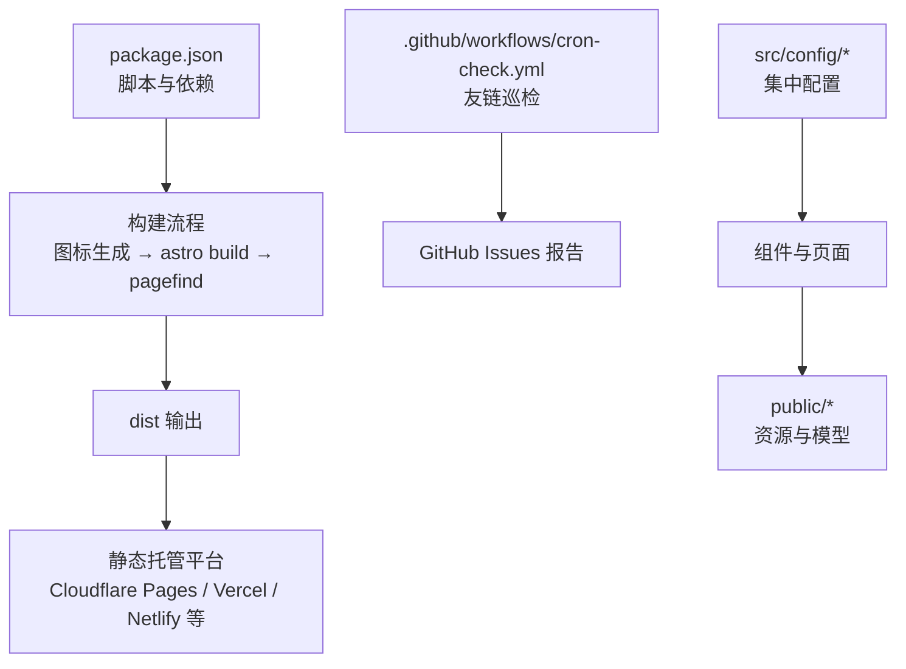
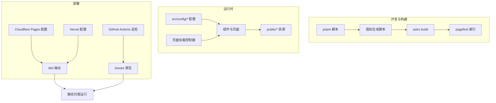
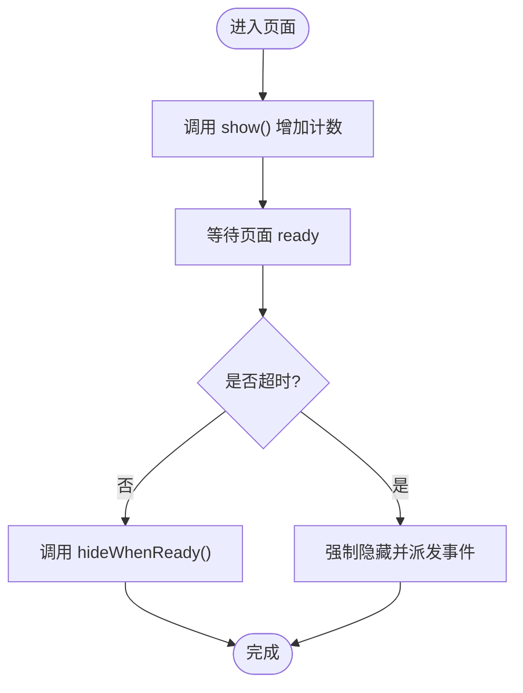
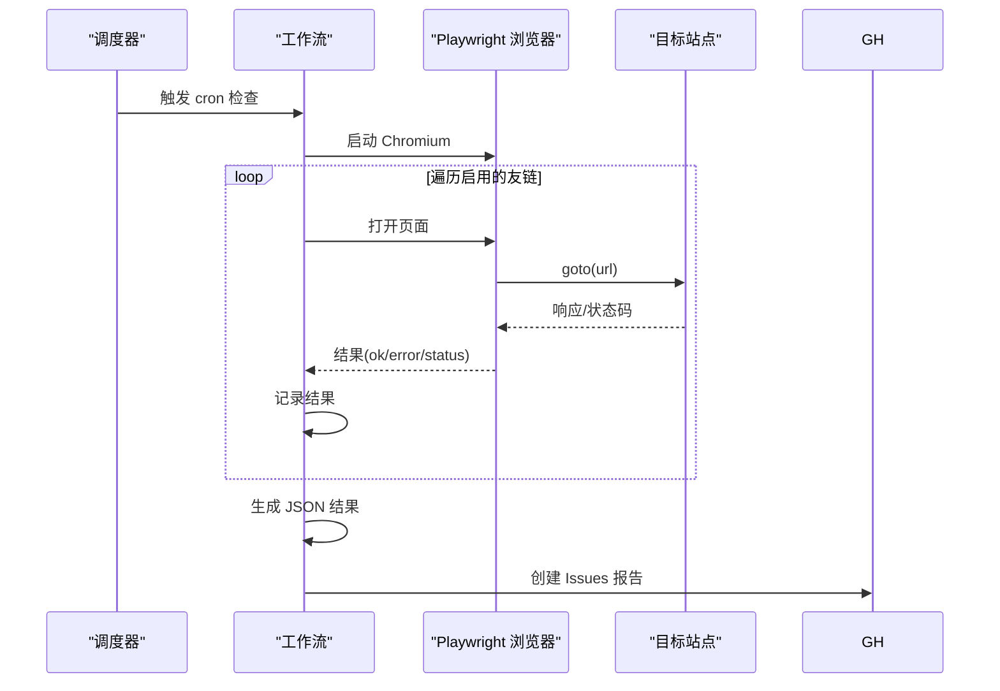
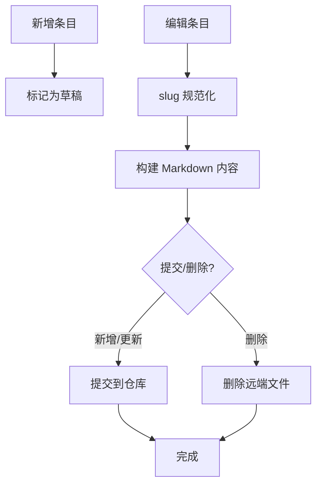
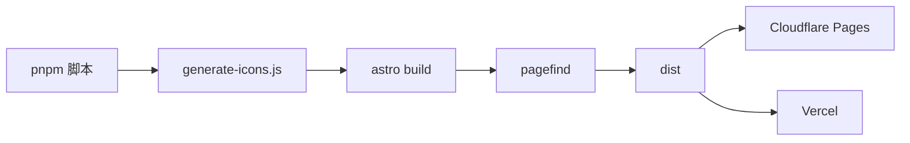

# 故障排除手册

<cite>
**本文档引用的文件**
- [package.json](file://package.json)
- [README.md](file://README.md)
- [.github/workflows/cron-check.yml](file://.github/workflows/cron-check.yml)
- [.github/scripts/process-friend-request.cjs](file://.github/scripts/process-friend-request.cjs)
- [vercel.json](file://vercel.json)
- [src/components/features/TypewriterText.astro](file://src/components/features/TypewriterText.astro)
- [src/utils/page-loader-controller.js](file://src/utils/page-loader-controller.js)
- [src/components/edit/ChangelogEditor.svelte](file://src/components/edit/ChangelogEditor.svelte)
- [src/components/edit/NotebooksEditor.svelte](file://src/components/edit/NotebooksEditor.svelte)
- [src/content/posts/blog/img-bed.md](file://src/content/posts/blog/img-bed.md)
</cite>

## 目录
1. [简介](#简介)
2. [项目结构](#项目结构)
3. [核心组件](#核心组件)
4. [架构总览](#架构总览)
5. [详细组件分析](#详细组件分析)
6. [依赖关系分析](#依赖关系分析)
7. [性能注意事项](#性能注意事项)
8. [故障排除指南](#故障排除指南)
9. [结论](#结论)
10. [附录](#附录)

## 简介
本手册面向 Firefly-Mod 项目的使用者与维护者，提供从安装、构建、运行到部署的全流程故障排除方法，涵盖常见问题诊断、错误信息解读、调试工具使用、性能排查、配置校验、数据问题处理、用户反馈流程、社区支持与问题报告模板，以及预防性维护最佳实践与检查清单。

## 项目结构
- 采用 Astro 6.x + Svelte 5 + Tailwind CSS 4 的静态站点生成架构，结合多种插件与工具链（Biome、Pagefind、Wrangler 等），支持 Cloudflare Pages/Vercel 等静态托管平台。
- 关键目录与职责概览：
  - src/config：集中式配置入口，统一导出，便于全局替换与维护。
  - src/components：功能组件与页面组件，含编辑器、看板娘、音乐可视化等。
  - src/utils：通用工具函数，如页面加载控制器、内容处理等。
  - public：公共资源与模型资源，如 Live2D/Spine 模型、相册图片等。
  - .github/workflows：CI/CD 与自动化巡检工作流。
  - scripts：构建辅助脚本（图标生成、向量索引构建等）。
  - astro.config.mjs：Markdown/HTML 插件流水线定义。

图表来源
- [package.json:1-112](file://package.json#L1-L112)
- [README.md:32-181](file://README.md#L32-L181)
- [.github/workflows/cron-check.yml:1-205](file://.github/workflows/cron-check.yml#L1-L205)

章节来源
- [README.md:12-181](file://README.md#L12-L181)
- [package.json:1-112](file://package.json#L1-L112)

## 核心组件
- 配置系统：通过 src/config 下的多个配置文件集中管理站点行为，统一从 index.ts 导出，便于替换与迁移。
- 编辑器组件：如变更日志编辑器、笔记本编辑器，支持草稿、增删改排序、与 GitHub 交互。
- 页面加载控制器：统一管理页面过渡与加载隐藏逻辑，避免闪烁与提前隐藏。
- 友链巡检：基于 Playwright 的定时巡检，自动创建 Issue 报告不可达链接。
- 构建与部署：pnpm 脚本驱动，Cloudflare Pages/Vercel 配置文件提供安全头与缓存策略。

章节来源
- [README.md:85-181](file://README.md#L85-L181)
- [src/utils/page-loader-controller.js:1-58](file://src/utils/page-loader-controller.js#L1-L58)
- [.github/workflows/cron-check.yml:1-205](file://.github/workflows/cron-check.yml#L1-L205)

## 架构总览

图表来源
- [package.json:5-18](file://package.json#L5-L18)
- [README.md:152-174](file://README.md#L152-L174)
- [vercel.json:1-39](file://vercel.json#L1-L39)
- [.github/workflows/cron-check.yml:1-205](file://.github/workflows/cron-check.yml#L1-L205)

## 详细组件分析

### 页面加载控制器
- 功能要点：统一展示/隐藏页面加载器，带超时与事件派发，避免闪烁与提前隐藏。
- 关键行为：show 增加计数，hideWhenReady 在 ready 后按令牌隐藏，支持超时回调。
- 常见问题：隐藏过早导致闪烁、隐藏过晚导致卡顿、事件未派发导致外部联动失效。

图表来源
- [src/utils/page-loader-controller.js:36-58](file://src/utils/page-loader-controller.js#L36-L58)

章节来源
- [src/utils/page-loader-controller.js:1-58](file://src/utils/page-loader-controller.js#L1-L58)

### 友链巡检工作流
- 触发方式：定时任务与手动触发。
- 执行流程：拉起 Chromium，遍历启用的友链，重试机制，记录结果并汇总。
- 报告生成：创建 Issues，附带可达性统计与失败原因，确保标签存在。
- 常见问题：Playwright 依赖未安装、网络超时、目标站点返回非 2xx、配置解析失败。

图表来源
- [.github/workflows/cron-check.yml:1-205](file://.github/workflows/cron-check.yml#L1-L205)

章节来源
- [.github/workflows/cron-check.yml:1-205](file://.github/workflows/cron-check.yml#L1-L205)

### 变更日志编辑器
- 功能要点：支持新增、编辑、删除、移动、恢复、草稿、与 GitHub 交互提交。
- 关键流程：生成草稿条目、slug 规范化、构建 Markdown 内容、按状态提交或删除文件。
- 常见问题：slug 冲突、提交失败（权限不足/网络错误）、删除确认误触。

图表来源
- [src/components/edit/ChangelogEditor.svelte:290-351](file://src/components/edit/ChangelogEditor.svelte#L290-L351)

章节来源
- [src/components/edit/ChangelogEditor.svelte:233-351](file://src/components/edit/ChangelogEditor.svelte#L233-L351)

### 笔记本编辑器
- 功能要点：批量校验与创建/更新索引文件，统一提交，失败提示与重试。
- 关键流程：逐项校验，创建缺失文件，统一提交，成功后刷新页面。
- 常见问题：GitHub App 权限不足、网络波动导致提交失败、文件路径不匹配。

章节来源
- [src/components/edit/NotebooksEditor.svelte:233-270](file://src/components/edit/NotebooksEditor.svelte#L233-L270)

### 打字机组件
- 功能要点：支持多段文本、随机显示、打字机效果参数化。
- 常见问题：文本为空、参数非法导致异常、未启用打字机时随机显示不生效。

章节来源
- [src/components/features/TypewriterText.astro:49-94](file://src/components/features/TypewriterText.astro#L49-L94)

## 依赖关系分析
- 包管理：强制使用 pnpm，版本要求 Node.js ≥ 22、pnpm ≥ 9。
- 构建链路：图标生成 → Astro 构建 → Pagefind 索引，最终输出 dist。
- 部署配置：Cloudflare Pages 与 Vercel 均提供安全头与缓存策略，确保安全性与性能。

图表来源
- [package.json:5-18](file://package.json#L5-L18)
- [README.md:66](file://README.md#L66)
- [vercel.json:1-39](file://vercel.json#L1-L39)

章节来源
- [package.json:1-112](file://package.json#L1-L112)
- [README.md:32-82](file://README.md#L32-L82)
- [vercel.json:1-39](file://vercel.json#L1-L39)

## 性能注意事项
- 构建与缓存
  - 使用 Vercel 配置中的公共缓存头与静态资源长期缓存策略，减少重复请求。
  - Pagefind 索引在构建阶段生成，避免运行时计算开销。
- 运行时性能
  - 页面加载控制器统一隐藏时机，避免闪烁与多余 DOM 操作。
  - 图片与资源尽量使用 CDN 与合适的尺寸，减少首屏阻塞。
- 网络与第三方
  - 友链巡检设置合理超时与重试，避免长时间阻塞。
  - 评论系统、统计服务等外部依赖需监控可用性与响应时间。

章节来源
- [vercel.json:6-37](file://vercel.json#L6-L37)
- [src/utils/page-loader-controller.js:1-58](file://src/utils/page-loader-controller.js#L1-L58)
- [.github/workflows/cron-check.yml:36-55](file://.github/workflows/cron-check.yml#L36-L55)

## 故障排除指南

### 一、安装与环境问题
- 症状
  - 安装失败、版本不兼容、包管理器被拒绝。
- 排查步骤
  - 确认 Node.js 版本满足要求（≥ 22），pnpm 版本满足要求（≥ 9）。
  - 强制使用 pnpm（preinstall 限制），避免混用其他包管理器。
  - 清理缓存后重装：删除 node_modules/.pnpm-store 并重新安装。
- 相关文件
  - [package.json:110](file://package.json#L110)
  - [README.md:32-46](file://README.md#L32-L46)

章节来源
- [package.json:110](file://package.json#L110)
- [README.md:32-46](file://README.md#L32-L46)

### 二、构建错误
- 症状
  - 构建中断、图标生成失败、Pagefind 索引失败。
- 排查步骤
  - 按顺序执行：图标生成 → Astro 构建 → Pagefind 索引。
  - 检查依赖安装完整性，必要时清理缓存后重装。
  - 若使用 AI 搜索，确认 Cloudflare API 令牌与账户 ID 配置正确。
- 相关文件
  - [package.json:9](file://package.json#L9)
  - [README.md:66](file://README.md#L66)
  - [README.md:149](file://README.md#L149)

章节来源
- [package.json:9](file://package.json#L9)
- [README.md:66](file://README.md#L66)
- [README.md:149](file://README.md#L149)

### 三、运行时异常
- 症状
  - 页面加载闪烁、隐藏过早/过晚、打字机效果异常、组件报错。
- 排查步骤
  - 页面加载控制器：检查 ready 事件派发与超时设置，避免隐藏时机不当。
  - 打字机组件：确认文本数据与参数合法，未启用打字机时随机显示生效。
  - 组件异常：查看浏览器控制台错误堆栈，定位具体组件与调用链。
- 相关文件
  - [src/utils/page-loader-controller.js:36-58](file://src/utils/page-loader-controller.js#L36-L58)
  - [src/components/features/TypewriterText.astro:49-94](file://src/components/features/TypewriterText.astro#L49-L94)

章节来源
- [src/utils/page-loader-controller.js:36-58](file://src/utils/page-loader-controller.js#L36-L58)
- [src/components/features/TypewriterText.astro:49-94](file://src/components/features/TypewriterText.astro#L49-L94)

### 四、部署问题
- 症状
  - 部署失败、静态资源 404、安全头未生效、缓存策略异常。
- 排查步骤
  - Cloudflare Pages：确认构建命令与输出目录配置，环境变量与 KV/Vectorize 绑定正确。
  - Vercel：核对 vercel.json 中构建命令、输出目录、安全头与缓存策略。
  - 评论系统与统计服务：确保对应后端已部署并配置密钥。
- 相关文件
  - [README.md:152-174](file://README.md#L152-L174)
  - [vercel.json:1-39](file://vercel.json#L1-39)

章节来源
- [README.md:152-174](file://README.md#L152-L174)
- [vercel.json:1-39](file://vercel.json#L1-L39)

### 五、调试工具使用
- 浏览器开发者工具
  - Console：查看运行时错误与警告；Network：检查资源加载与第三方接口响应。
  - Elements：定位组件渲染问题；Performance/DevTools：分析首屏与交互性能。
- Node.js 调试器
  - 本地开发：使用 Node 调试器附加 Astro 开发进程，断点定位构建/插件问题。
  - CI 场景：在 GitHub Actions 中增加日志级别与重试策略，便于定位不稳定因素。
- 日志分析
  - 友链巡检：关注 cron-check 工作流日志中的错误信息与重试次数。
  - 构建日志：关注 Pagefind 索引与 Wrangler 部署阶段的错误提示。

章节来源
- [.github/workflows/cron-check.yml:144-148](file://.github/workflows/cron-check.yml#L144-L148)

### 六、性能问题排查
- 内存泄漏检测
  - 使用浏览器 Performance 录制长页面交互，观察堆内存增长趋势；定位未释放的监听器或循环引用。
- CPU 使用率分析
  - 关注大文件渲染（图片/视频/3D 模型）、复杂动画与插件转换阶段的耗时。
- 网络延迟诊断
  - 使用 Network 面板分析关键资源加载时间，识别慢查询与重定向；结合友链巡检日志评估第三方可用性。

### 七、配置问题诊断
- 环境变量检查
  - Cloudflare：AI_API_KEY、UMAMI_TOKEN、KV 命名空间 ID、Vectorize 索引名等。
  - Vercel：确认环境变量在 Dashboard 中正确配置并生效。
- 文件权限验证
  - 本地：确保 Node 用户对项目目录与缓存目录具有读写权限。
  - CI：确保 Actions Secret 与权限矩阵配置正确。
- 依赖版本冲突
  - 使用 pnpm 锁定版本，避免不同依赖对同一包的冲突；必要时清理 node_modules 与 pnpm-store 后重装。

章节来源
- [README.md:149](file://README.md#L149)
- [README.md:164-166](file://README.md#L164-L166)
- [vercel.json:1-39](file://vercel.json#L1-L39)

### 八、数据问题处理
- 内容丢失
  - 变更日志与笔记本编辑器均支持草稿与删除标记，检查提交历史与远端文件状态。
- 缓存异常
  - 清理浏览器缓存与 Service Worker；检查静态托管缓存头与版本化资源。
- 数据库连接问题
  - 评论系统与留言板依赖 KV/数据库，确认命名空间与连接参数正确；参考图床部署文档进行 KV/D1/R2 配置。

章节来源
- [src/components/edit/ChangelogEditor.svelte:249-262](file://src/components/edit/ChangelogEditor.svelte#L249-L262)
- [src/components/edit/NotebooksEditor.svelte:233-247](file://src/components/edit/NotebooksEditor.svelte#L233-L247)
- [src/content/posts/blog/img-bed.md:49-86](file://src/content/posts/blog/img-bed.md#L49-L86)

### 九、用户反馈与处理流程
- 问题分类
  - 安装/构建：版本不兼容、依赖缺失、脚本失败。
  - 运行异常：组件崩溃、样式错乱、第三方接口异常。
  - 部署问题：静态托管配置错误、环境变量缺失、缓存策略不当。
- 处理流程
  - 收集信息：操作系统、Node/pnpm/Astro 版本、错误日志、复现步骤。
  - 自查清单：重装依赖、清理缓存、核对配置、最小化复现。
  - 提交 Issue：附带环境信息、日志与截图，选择合适模板。

章节来源
- [.github/scripts/process-friend-request.cjs:390-396](file://.github/scripts/process-friend-request.cjs#L390-L396)

### 十、社区支持与问题报告模板
- 社区支持渠道
  - GitHub Issues：用于缺陷报告与功能请求。
  - GitHub Discussions：用于提问与经验分享。
- 问题报告模板
  - 环境信息：操作系统、Node/pnpm/Astro/TypeScript 版本。
  - 复现步骤：最小可复现工程或清晰步骤。
  - 预期与实际结果：明确对比。
  - 日志与截图：控制台错误、网络请求、UI 截图。
  - 附加信息：相关配置片段、依赖版本、部署平台。

章节来源
- [README.md:126-136](file://README.md#L126-L136)

### 十一、预防性维护与检查清单
- 定期检查
  - 依赖升级：使用 pnpm outdated 检查，按需升级并测试。
  - 类型检查：定期运行类型检查，修复潜在类型问题。
  - 代码质量：运行 Biome 格式化与 Lint，保持一致性。
  - 友链巡检：确保 cron-check 工作流正常运行并及时处理异常。
  - 部署验证：每次部署后验证关键页面与功能，检查缓存与安全头。
- 最佳实践
  - 使用 pnpm 并锁定版本，避免环境漂移。
  - 将配置集中管理并通过 barrel 文件导出，便于替换。
  - 对关键流程（构建、部署、巡检）增加日志与告警。

章节来源
- [README.md:126-136](file://README.md#L126-L136)
- [README.md:68-82](file://README.md#L68-L82)

## 结论
本手册提供了从安装到部署的全链路故障排除方法与最佳实践。通过规范化的配置管理、完善的 CI/CD 工作流与调试工具使用，能够快速定位并解决问题，保障站点稳定运行与良好体验。

## 附录
- 快速命令参考
  - 开发：pnpm dev
  - 构建：pnpm build
  - 预览：pnpm preview
  - 类型检查：pnpm check / pnpm type-check
  - 格式化与 Lint：pnpm format / pnpm lint
  - 重新生成图标：pnpm icons
  - 构建/更新 AI 搜索向量索引：pnpm build-index
  - 部署到 Cloudflare：npx wrangler login / npx wrangler deploy

章节来源
- [README.md:32-82](file://README.md#L32-L82)