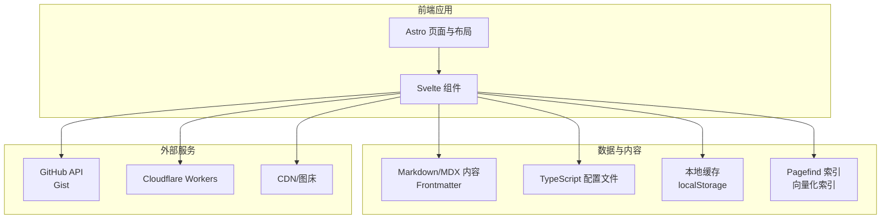
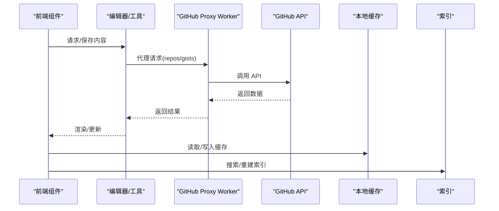
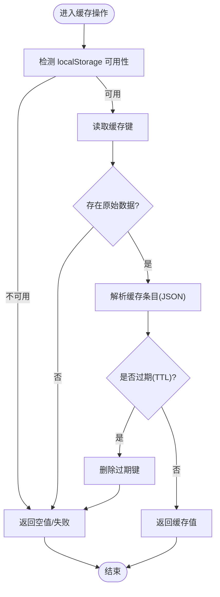
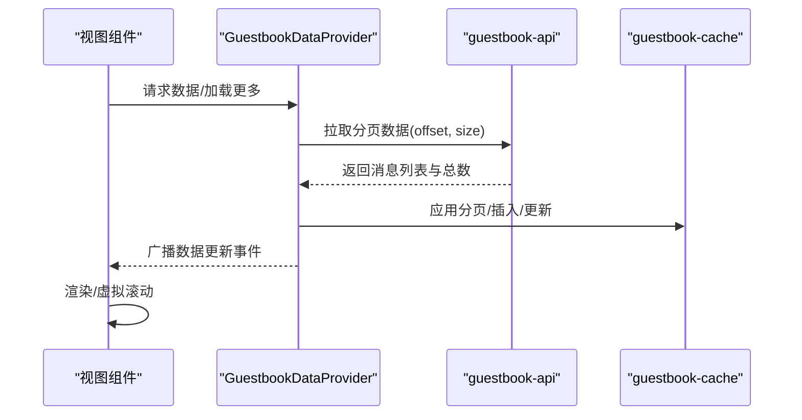
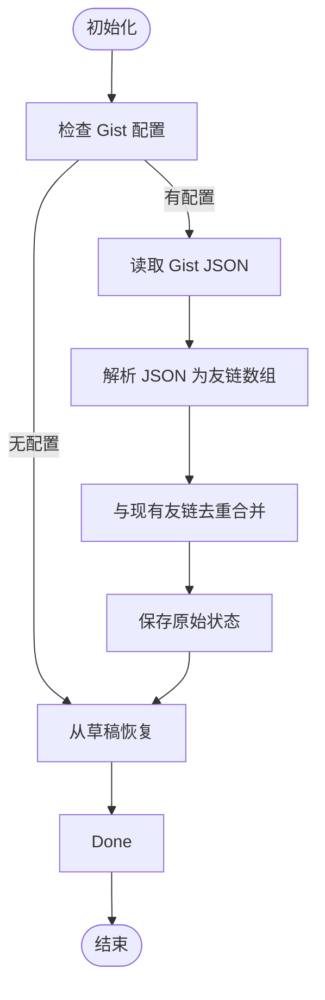
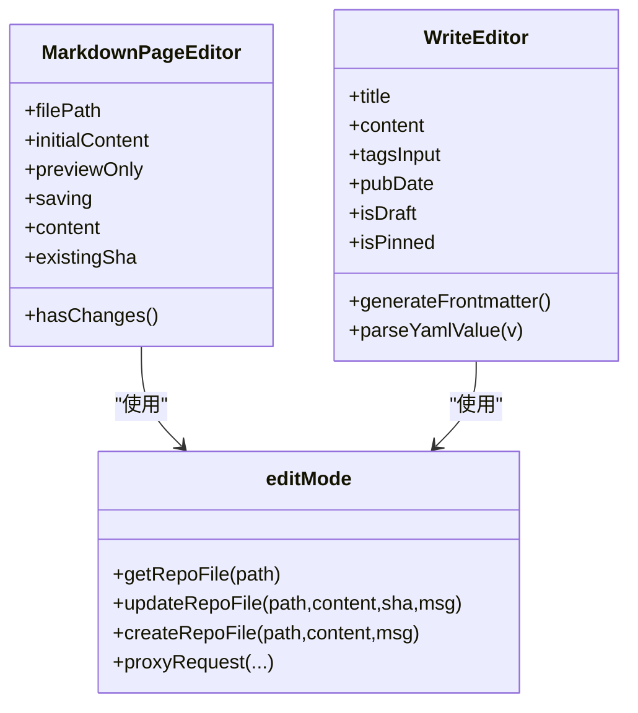
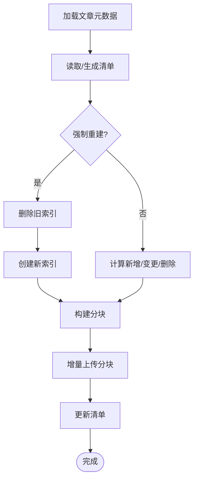
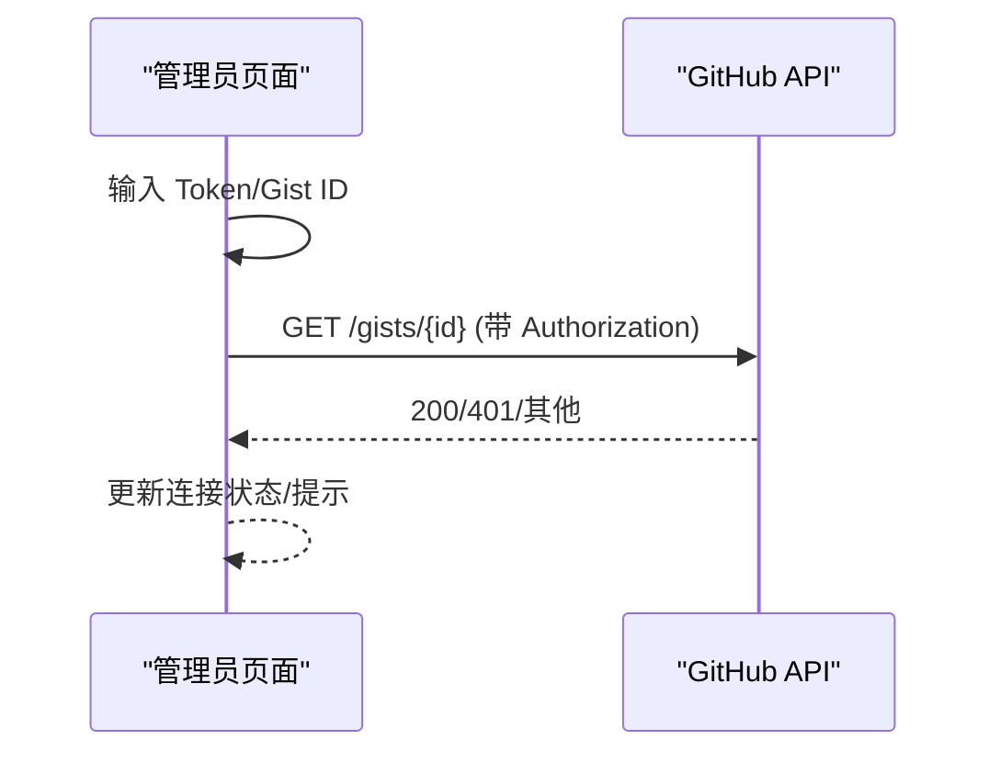
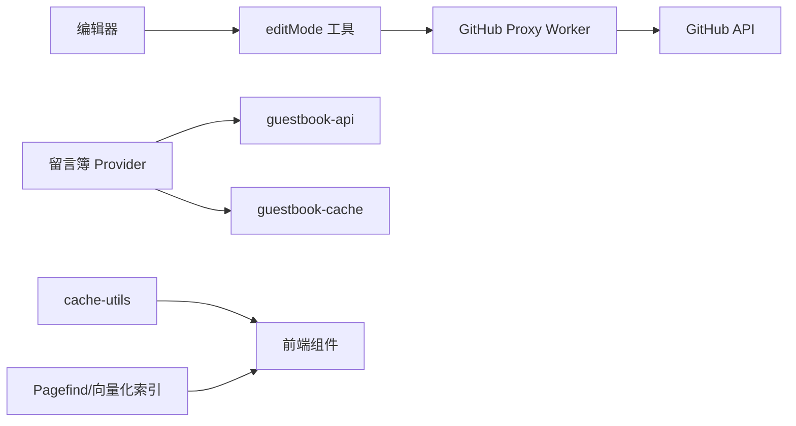

# 数据问题

<cite>
**本文引用的文件**
- [src/utils/cache-utils.ts](file://src/utils/cache-utils.ts)
- [src/components/features/GuestbookDataProvider.svelte](file://src/components/features/GuestbookDataProvider.svelte)
- [src/components/features/GuestbookCardStack.svelte](file://src/components/features/GuestbookCardStack.svelte)
- [src/types/guestbook.ts](file://src/types/guestbook.ts)
- [src/utils/guestbook-api.ts](file://src/utils/guestbook-api.ts)
- [src/utils/guestbook-cache.ts](file://src/utils/guestbook-cache.ts)
- [src/components/edit/FriendsEditor.svelte](file://src/components/edit/FriendsEditor.svelte)
- [src/utils/editMode.ts](file://src/utils/editMode.ts)
- [src/components/edit/MarkdownPageEditor.svelte](file://src/components/edit/MarkdownPageEditor.svelte)
- [src/components/edit/WriteEditor.svelte](file://src/components/edit/WriteEditor.svelte)
- [src/pages/admin/moments.astro](file://src/pages/admin/moments.astro)
- [.github/scripts/process-friend-request.cjs](file://.github/scripts/process-friend-request.cjs)
- [scripts/build-vectorize-index.js](file://scripts/build-vectorize-index.js)
- [_frontmatter.json](file://_frontmatter.json)
- [src/content/posts/encrypted-post.md](file://src/content/posts/encrypted-post.md)
- [src/content/posts/guide/index.md](file://src/content/posts/guide/index.md)
- [src/content/spec/guestbook.md](file://src/content/spec/guestbook.md)
- [src/content/spec/friends.mdx](file://src/content/spec/friends.mdx)
- [src/content/spec/privacy.md](file://src/content/spec/privacy.md)
- [src/config/siteConfig.ts](file://src/config/siteConfig.ts)
- [src/config/editConfig.ts](file://src/config/editConfig.ts)
- [src/config/friendsConfig.ts](file://src/config/friendsConfig.ts)
- [src/config/collectionsApiConfig.ts](file://src/config/collectionsApiConfig.ts)
- [src/config/commentConfig.ts](file://src/config/commentConfig.ts)
- [src/config/externalFriendsConfig.ts](file://src/config/externalFriendsConfig.ts)
- [src/config/externalMomentsConfig.ts](file://src/config/externalMomentsConfig.ts)
- [src/config/externalNotebooksConfig.ts](file://src/config/externalNotebooksConfig.ts)
- [src/config/externalBangumiConfig.ts](file://src/config/externalBangumiConfig.ts)
- [src/config/aiSearchConfig.ts](file://src/config/aiSearchConfig.ts)
- [src/workers/guestbook.js](file://src/workers/guestbook.js)
- [src/workers/github-proxy.js](file://src/workers/github-proxy.js)
- [wrangler.toml](file://wrangler.toml)
- [pagefind.yml](file://pagefind.yml)
- [package.json](file://package.json)
</cite>

## 目录
1. [简介](#简介)
2. [项目结构](#项目结构)
3. [核心组件](#核心组件)
4. [架构总览](#架构总览)
5. [详细组件分析](#详细组件分析)
6. [依赖关系分析](#依赖关系分析)
7. [性能考量](#性能考量)
8. [故障排除指南](#故障排除指南)
9. [结论](#结论)
10. [附录](#附录)

## 简介
本指南聚焦于本博客系统中的“数据问题”故障排除与运维实践，覆盖以下方面：
- 数据丢失与恢复：内容文件、配置文件、索引与缓存
- 缓存异常：本地存储缓存、增量索引与向量化检索
- 数据库/外部服务连接问题：GitHub Gist、外部 API、Workers
- 文件上传与媒体资源：图片、相册与 CDN
- 内容完整性：Frontmatter 格式、Markdown 解析、索引一致性
- 用户数据：访客留言簿、友链同步、动态同步
- 数据安全与隐私：加密文章、评论与隐私声明

## 项目结构
本项目采用 Astro + Svelte 前端架构，数据来源主要包括：
- 内容层：Markdown/MDX 文档与 Frontmatter
- 配置层：TypeScript 配置文件与 YAML/JSON 规范
- 外部集成：GitHub Gist、第三方 API、Cloudflare Workers
- 搜索与索引：Pagefind、向量化索引构建脚本

[本图为概念性结构示意，不直接映射具体源码文件，故不附“图表来源”]

## 核心组件
- 本地缓存工具：提供基于 localStorage 的 TTL 缓存封装，用于减少重复请求与提升性能
- 留言板数据层：统一拉取、缓存与广播消息，避免重复请求与视图间数据不一致
- 友链编辑器：从 Gist 同步友链数据，合并去重并持久化
- 编辑器与内容工具：Markdown 解析、Frontmatter 生成与校验、仓库文件读写代理
- 搜索与索引：Pagefind 全文索引与向量化索引增量重建
- 外部集成：GitHub Proxy Worker、Moments 同步、外部 API 配置

**章节来源**
- [src/utils/cache-utils.ts:1-64](file://src/utils/cache-utils.ts#L1-L64)
- [src/components/features/GuestbookDataProvider.svelte:1-151](file://src/components/features/GuestbookDataProvider.svelte#L1-L151)
- [src/components/edit/FriendsEditor.svelte:52-91](file://src/components/edit/FriendsEditor.svelte#L52-L91)
- [src/utils/editMode.ts:354-484](file://src/utils/editMode.ts#L354-L484)
- [scripts/build-vectorize-index.js:324-355](file://scripts/build-vectorize-index.js#L324-L355)

## 架构总览
本系统数据流的关键路径如下：
- 内容与配置：前端组件通过编辑器与工具函数读取/写入 Markdown/TS 配置；必要时经由 GitHub Proxy Worker 与 GitHub API 交互
- 用户数据：留言簿通过统一 Provider 组件拉取与广播；友链从 Gist 同步；动态通过管理员页面连接 GitHub Token
- 搜索与索引：Pagefind 提供全文检索；向量化索引脚本负责增量重建与校验

**图表来源**
- [src/utils/editMode.ts:354-484](file://src/utils/editMode.ts#L354-L484)
- [src/workers/github-proxy.js](file://src/workers/github-proxy.js)
- [src/utils/cache-utils.ts:1-64](file://src/utils/cache-utils.ts#L1-L64)
- [scripts/build-vectorize-index.js:324-355](file://scripts/build-vectorize-index.js#L324-L355)

**章节来源**
- [src/utils/editMode.ts:354-484](file://src/utils/editMode.ts#L354-L484)
- [src/workers/github-proxy.js](file://src/workers/github-proxy.js)
- [src/utils/cache-utils.ts:1-64](file://src/utils/cache-utils.ts#L1-L64)
- [scripts/build-vectorize-index.js:324-355](file://scripts/build-vectorize-index.js#L324-L355)

## 详细组件分析

### 本地缓存组件分析
- 设计要点：以 localStorage 存储带时间戳的缓存条目，按 TTL 判断是否过期
- 关键行为：读取失败自动清理键；写入异常兜底删除键；提供 get/set/clear/fetch 接口
- 性能影响：减少重复网络请求，降低前端首屏与切换成本

**图表来源**
- [src/utils/cache-utils.ts:18-64](file://src/utils/cache-utils.ts#L18-L64)

**章节来源**
- [src/utils/cache-utils.ts:1-64](file://src/utils/cache-utils.ts#L1-L64)

### 留言板数据层分析
- 组件职责：集中拉取、缓存、广播留言数据；支持“加载更多”“重新加载”“新增/更新消息”
- 数据一致性：通过全局状态与 CustomEvent 广播，避免多个视图重复请求
- 错误处理：加载失败记录日志，保持状态稳定

**图表来源**
- [src/components/features/GuestbookDataProvider.svelte:63-118](file://src/components/features/GuestbookDataProvider.svelte#L63-L118)
- [src/utils/guestbook-api.ts](file://src/utils/guestbook-api.ts)
- [src/utils/guestbook-cache.ts](file://src/utils/guestbook-cache.ts)
- [src/types/guestbook.ts:1-45](file://src/types/guestbook.ts#L1-L45)

**章节来源**
- [src/components/features/GuestbookDataProvider.svelte:1-151](file://src/components/features/GuestbookDataProvider.svelte#L1-L151)
- [src/components/features/GuestbookCardStack.svelte:380-432](file://src/components/features/GuestbookCardStack.svelte#L380-L432)
- [src/types/guestbook.ts:1-45](file://src/types/guestbook.ts#L1-L45)

### 友链编辑器分析
- 同步逻辑：从 Gist 读取 JSON 数据，与现有友链去重合并，保留唯一性
- 错误处理：读取失败记录日志，保证本地编辑不受影响
- 集成点：依赖编辑器的 Gist 读取工具与草稿恢复机制

**图表来源**
- [src/components/edit/FriendsEditor.svelte:60-88](file://src/components/edit/FriendsEditor.svelte#L60-L88)
- [src/utils/editMode.ts:367-375](file://src/utils/editMode.ts#L367-L375)

**章节来源**
- [src/components/edit/FriendsEditor.svelte:52-91](file://src/components/edit/FriendsEditor.svelte#L52-L91)
- [src/utils/editMode.ts:367-375](file://src/utils/editMode.ts#L367-L375)

### 编辑器与内容工具分析
- MarkdownPageEditor：支持预览、草稿、SHA 校验与提交信息生成
- WriteEditor：Frontmatter 生成与解析、标签/日期/分类处理、保存路径推导
- editMode：文件读取、仓库文件读取/更新/创建、代理请求与凭据校验

**图表来源**
- [src/components/edit/MarkdownPageEditor.svelte:1-51](file://src/components/edit/MarkdownPageEditor.svelte#L1-L51)
- [src/components/edit/WriteEditor.svelte:122-240](file://src/components/edit/WriteEditor.svelte#L122-L240)
- [src/utils/editMode.ts:430-484](file://src/utils/editMode.ts#L430-L484)

**章节来源**
- [src/components/edit/MarkdownPageEditor.svelte:1-51](file://src/components/edit/MarkdownPageEditor.svelte#L1-L51)
- [src/components/edit/WriteEditor.svelte:122-240](file://src/components/edit/WriteEditor.svelte#L122-L240)
- [src/utils/editMode.ts:430-484](file://src/utils/editMode.ts#L430-L484)

### 搜索与索引分析
- Pagefind：全文检索引擎，支持过滤、排序、高亮与多实例合并
- 向量化索引：脚本负责加载文章、构建分块、增量对比与上传，失败时输出错误日志

**图表来源**
- [scripts/build-vectorize-index.js:324-355](file://scripts/build-vectorize-index.js#L324-L355)

**章节来源**
- [scripts/build-vectorize-index.js:315-355](file://scripts/build-vectorize-index.js#L315-L355)

### 外部集成与管理员页面
- GitHub Gist 连接：管理员页面提供 Token 输入、Gist ID 校验与连接状态反馈
- 友链验证：CI 脚本使用 Playwright 访问友链页面，记录状态码与标题，便于排查可达性

**图表来源**
- [src/pages/admin/moments.astro:580-604](file://src/pages/admin/moments.astro#L580-L604)

**章节来源**
- [src/pages/admin/moments.astro:580-604](file://src/pages/admin/moments.astro#L580-L604)
- [.github/scripts/process-friend-request.cjs:261-302](file://.github/scripts/process-friend-request.cjs#L261-L302)

## 依赖关系分析
- 组件耦合：编辑器与工具函数松耦合，通过接口抽象与代理请求解耦外部 API
- 缓存与索引：缓存用于减少请求，索引用于加速查询；两者互不影响但共同提升用户体验
- 外部服务：GitHub API 通过 Worker 代理，避免前端直连密钥泄露风险

**图表来源**
- [src/utils/editMode.ts:354-484](file://src/utils/editMode.ts#L354-L484)
- [src/workers/github-proxy.js](file://src/workers/github-proxy.js)
- [src/components/features/GuestbookDataProvider.svelte:1-151](file://src/components/features/GuestbookDataProvider.svelte#L1-L151)
- [src/utils/guestbook-api.ts](file://src/utils/guestbook-api.ts)
- [src/utils/guestbook-cache.ts](file://src/utils/guestbook-cache.ts)
- [src/utils/cache-utils.ts:1-64](file://src/utils/cache-utils.ts#L1-L64)
- [scripts/build-vectorize-index.js:324-355](file://scripts/build-vectorize-index.js#L324-L355)

**章节来源**
- [src/utils/editMode.ts:354-484](file://src/utils/editMode.ts#L354-L484)
- [src/components/features/GuestbookDataProvider.svelte:1-151](file://src/components/features/GuestbookDataProvider.svelte#L1-L151)
- [src/utils/cache-utils.ts:1-64](file://src/utils/cache-utils.ts#L1-L64)
- [scripts/build-vectorize-index.js:324-355](file://scripts/build-vectorize-index.js#L324-L355)

## 性能考量
- 缓存策略：合理设置 TTL，避免频繁读取；对易变数据缩短 TTL
- 索引更新：增量重建优先，避免全量重建带来的部署窗口
- 请求节流：对高频 API 调用增加防抖/节流与并发限制
- 资源优化：CDN 与懒加载，减少首屏阻塞

[本节为通用指导，不直接分析具体文件，故不附“章节来源”]

## 故障排除指南

### 一、内容丢失与恢复
- 现象
  - 编辑器保存失败或内容未更新
  - 草稿未恢复或丢失
- 诊断步骤
  - 检查编辑器的 SHA 校验与提交信息生成逻辑
  - 核对代理请求返回状态，确认凭据有效
  - 查看本地草稿是否被清理或覆盖
- 处理建议
  - 重新登录并刷新凭据
  - 手动回滚到上一个 SHA 或使用历史版本
  - 检查仓库分支与权限

**章节来源**
- [src/components/edit/MarkdownPageEditor.svelte:1-51](file://src/components/edit/MarkdownPageEditor.svelte#L1-L51)
- [src/utils/editMode.ts:445-484](file://src/utils/editMode.ts#L445-L484)

### 二、缓存异常
- 现象
  - 页面加载缓慢或数据不更新
  - 缓存键异常或过期未清理
- 诊断步骤
  - 检查 localStorage 是否可用
  - 校验缓存条目 JSON 结构与时间戳
- 处理建议
  - 清理对应缓存键或禁用缓存后重试
  - 调整 TTL 或在关键路径关闭缓存

**章节来源**
- [src/utils/cache-utils.ts:18-64](file://src/utils/cache-utils.ts#L18-L64)

### 三、数据库/外部服务连接问题
- 现象
  - GitHub Gist 读取失败或 401
  - 友链同步失败或页面不可达
- 诊断步骤
  - 管理员页面检查 Token 与 Gist ID
  - CI 脚本记录的状态码与标题
- 处理建议
  - 重新生成/更新 Token
  - 校验 Gist 权限与文件名一致性
  - 对外链进行可达性测试与超时调整

**章节来源**
- [src/pages/admin/moments.astro:580-604](file://src/pages/admin/moments.astro#L580-L604)
- [.github/scripts/process-friend-request.cjs:261-302](file://.github/scripts/process-friend-request.cjs#L261-L302)

### 四、文件上传失败
- 现象
  - 图片上传至 CDN/图床失败
  - 本地 public 目录写入受限
- 诊断步骤
  - 检查上传目标服务可用性与配额
  - 校验路径与权限
- 处理建议
  - 切换备用 CDN 或使用相对路径回退
  - 确认部署环境具备写权限

[本节为通用指导，不直接分析具体文件，故不附“章节来源”]

### 五、内容完整性检查与修复
- Frontmatter 格式问题
  - 使用编辑器的 Frontmatter 生成与解析逻辑进行比对
  - 参考规范文档与示例字段
- Markdown 解析错误
  - 检查渲染插件配置与兼容性
  - 对异常段落进行最小化复现
- 内容索引失效
  - 重建 Pagefind 索引与向量化索引
  - 对比清单与实际文章，修复缺失项

**章节来源**
- [src/components/edit/WriteEditor.svelte:122-240](file://src/components/edit/WriteEditor.svelte#L122-L240)
- [src/content/posts/encrypted-post.md:34-50](file://src/content/posts/encrypted-post.md#L34-L50)
- [src/content/posts/guide/index.md:32-37](file://src/content/posts/guide/index.md#L32-L37)
- [scripts/build-vectorize-index.js:324-355](file://scripts/build-vectorize-index.js#L324-L355)

### 六、用户数据异常
- 访客留言簿数据异常
  - 检查 Provider 的加载/广播流程
  - 核对消息结构与 votes 字段
- 友链同步失败
  - 校验 Gist JSON 格式与 URL 去重
  - 确认编辑器草稿恢复逻辑

**章节来源**
- [src/components/features/GuestbookDataProvider.svelte:63-118](file://src/components/features/GuestbookDataProvider.svelte#L63-L118)
- [src/types/guestbook.ts:1-45](file://src/types/guestbook.ts#L1-L45)
- [src/components/edit/FriendsEditor.svelte:60-88](file://src/components/edit/FriendsEditor.svelte#L60-L88)

### 七、备份与恢复流程
- 内容与配置
  - 备份 src/content 与 src/config 下的关键文件
  - 记录当前 SHA 与清单状态
- 索引
  - 备份 Pagefind 与向量化索引产物
- 操作建议
  - 使用版本控制作为主要备份手段
  - 对外链与动态数据定期导出快照

[本节为通用指导，不直接分析具体文件，故不附“章节来源”]

### 八、数据迁移策略
- 内容迁移
  - 统一 Frontmatter 字段与路径结构
  - 使用编辑器批量生成/转换
- 配置迁移
  - 对齐配置项与默认值
  - 逐步替换旧配置文件
- 索引迁移
  - 重建 Pagefind 与向量化索引
  - 校验搜索结果一致性

[本节为通用指导，不直接分析具体文件，故不附“章节来源”]

### 九、数据安全与隐私
- 加密文章
  - 使用 Frontmatter 的加密字段与密码提示
- 评论与隐私
  - 参考隐私声明文档，明确数据收集与处理范围
- 配置与密钥
  - 通过 Workers 代理外部 API，避免前端暴露密钥
  - 在部署平台使用 Secret 管理敏感信息

**章节来源**
- [src/content/posts/encrypted-post.md:34-50](file://src/content/posts/encrypted-post.md#L34-L50)
- [src/content/spec/privacy.md](file://src/content/spec/privacy.md)
- [src/workers/github-proxy.js](file://src/workers/github-proxy.js)
- [wrangler.toml:1-5](file://wrangler.toml#L1-L5)

## 结论
本指南围绕数据问题的识别、定位与解决提供了系统化的思路与实操建议。通过完善缓存策略、健壮的外部服务连接、严格的 Frontmatter 与索引管理，以及规范的安全与隐私配置，可显著提升系统的稳定性与可维护性。

[本节为总结性内容，不直接分析具体文件，故不附“章节来源”]

## 附录

### A. 关键配置与规范参考
- Frontmatter 规范与字段说明
- 站点配置与页面开关
- 外部集成配置（友链、动态、收藏 API）

**章节来源**
- [_frontmatter.json:1-67](file://_frontmatter.json#L1-L67)
- [src/config/siteConfig.ts](file://src/config/siteConfig.ts)
- [src/config/friendsConfig.ts](file://src/config/friendsConfig.ts)
- [src/config/externalFriendsConfig.ts](file://src/config/externalFriendsConfig.ts)
- [src/config/externalMomentsConfig.ts](file://src/config/externalMomentsConfig.ts)
- [src/config/externalNotebooksConfig.ts](file://src/config/externalNotebooksConfig.ts)
- [src/config/externalBangumiConfig.ts](file://src/config/externalBangumiConfig.ts)
- [src/config/collectionsApiConfig.ts](file://src/config/collectionsApiConfig.ts)
- [src/config/commentConfig.ts](file://src/config/commentConfig.ts)
- [src/config/aiSearchConfig.ts](file://src/config/aiSearchConfig.ts)

### B. 搜索与索引配置
- Pagefind 配置与多实例合并
- 向量化索引构建脚本参数与日志

**章节来源**
- [pagefind.yml](file://pagefind.yml)
- [scripts/build-vectorize-index.js:324-355](file://scripts/build-vectorize-index.js#L324-L355)

### C. 开发与部署工具
- 包管理与脚本入口
- Workers 配置与部署

**章节来源**
- [package.json](file://package.json)
- [wrangler.toml:1-5](file://wrangler.toml#L1-L5)