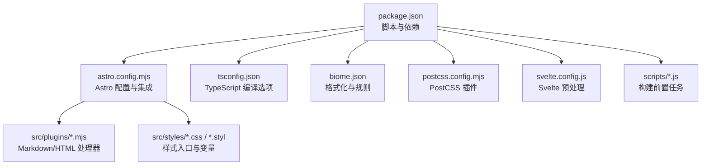
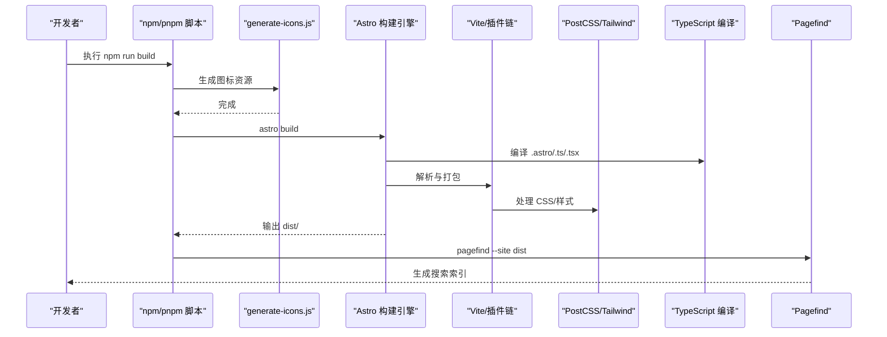
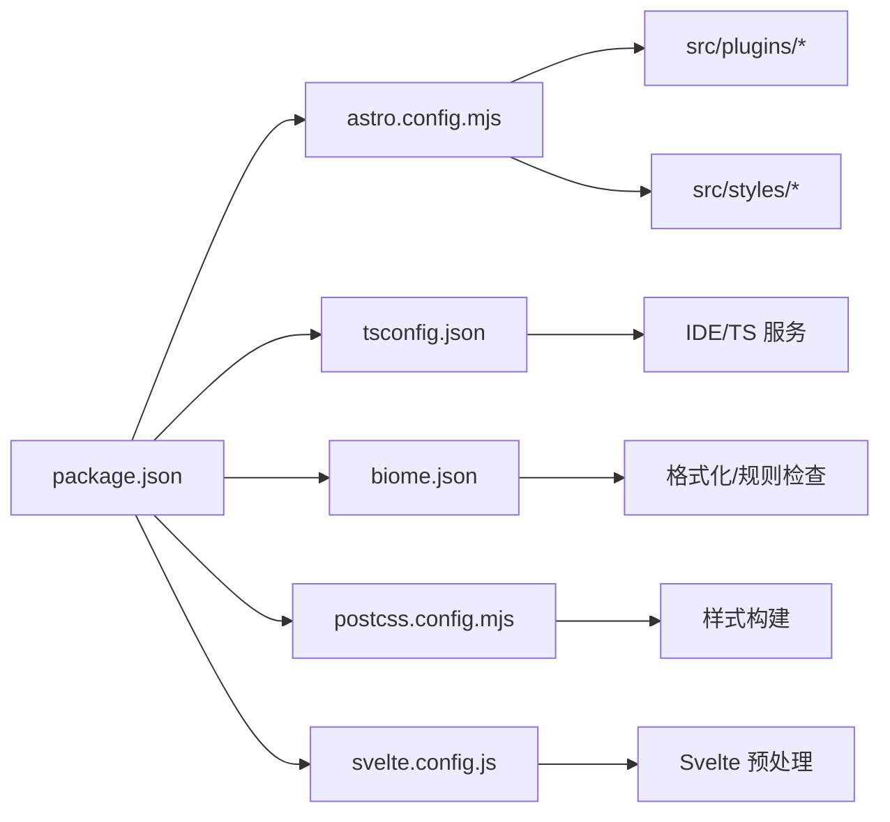

# 构建错误

<cite>
**本文引用的文件**
- [package.json](file://package.json)
- [astro.config.mjs](file://astro.config.mjs)
- [tsconfig.json](file://tsconfig.json)
- [biome.json](file://biome.json)
- [postcss.config.mjs](file://postcss.config.mjs)
- [svelte.config.js](file://svelte.config.js)
- [scripts/generate-icons.js](file://scripts/generate-icons.js)
- [scripts/build-vectorize-index.js](file://scripts/build-vectorize-index.js)
- [scripts/new-post.js](file://scripts/new-post.js)
- [src/config/index.ts](file://src/config/index.ts)
- [src/i18n/translation.ts](file://src/i18n/translation.ts)
- [src/plugins/rehype-mermaid.mjs](file://src/plugins/rehype-mermaid.mjs)
- [src/plugins/remark-mermaid.js](file://src/plugins/remark-mermaid.js)
- [src/plugins/rehype-plantuml.mjs](file://src/plugins/rehype-plantuml.mjs)
- [src/plugins/remark-plantuml.js](file://src/plugins/remark-plantuml.js)
- [src/plugins/rehype-figure.mjs](file://src/plugins/rehype-figure.mjs)
- [src/plugins/rehype-email-protection.mjs](file://src/plugins/rehype-email-protection.mjs)
- [src/plugins/rehype-external-links.mjs](file://src/plugins/rehype-external-links.mjs)
- [src/plugins/remark-image-grid.js](file://src/plugins/remark-image-grid.js)
- [src/plugins/remark-excerpt.js](file://src/plugins/remark-excerpt.js)
- [src/plugins/remark-directive-rehype.js](file://src/plugins/remark-directive-rehype.js)
- [src/plugins/remark-reading-time.mjs](file://src/plugins/remark-reading-time.mjs)
- [src/styles/main.css](file://src/styles/main.css)
- [src/styles/markdown.css](file://src/styles/markdown.css)
- [src/styles/variables.styl](file://src/styles/variables.styl)
- [src/styles/markdown-extend.styl](file://src/styles/markdown-extend.styl)
</cite>

## 目录
1. [简介](#简介)
2. [项目结构](#项目结构)
3. [核心组件](#核心组件)
4. [架构总览](#架构总览)
5. [详细组件分析](#详细组件分析)
6. [依赖关系分析](#依赖关系分析)
7. [性能考量](#性能考量)
8. [故障排除指南](#故障排除指南)
9. [结论](#结论)
10. [附录](#附录)

## 简介
本指南聚焦于 Astro 构建过程中的常见错误类型与系统化排查路径，覆盖 TypeScript 编译错误、ESLint/Biome 规则冲突、CSS 预处理器与样式管线问题、静态资源打包失败等。文档同时给出构建配置问题定位、依赖版本不兼容识别、内存不足导致的构建失败等场景的修复建议，并区分开发与生产环境的差异处理方式，以及如何启用详细日志辅助诊断。

## 项目结构
该仓库采用 Astro + Svelte + MDX 的混合技术栈，结合 TailwindCSS、PostCSS、Biome、Mermaid、PlantUML 等生态工具。构建流程通过 npm scripts 调度，包含图标生成、Astro 构建与 Pagefind 索引生成。

图表来源
- [package.json:1-112](file://package.json#L1-L112)
- [astro.config.mjs:1-307](file://astro.config.mjs#L1-L307)
- [tsconfig.json:1-50](file://tsconfig.json#L1-L50)
- [biome.json:1-66](file://biome.json#L1-L66)
- [postcss.config.mjs:1-10](file://postcss.config.mjs#L1-L10)
- [svelte.config.js:1-6](file://svelte.config.js#L1-L6)

章节来源
- [package.json:1-112](file://package.json#L1-L112)
- [astro.config.mjs:1-307](file://astro.config.mjs#L1-L307)

## 核心组件
- 构建脚本与流水线
  - 开发：dev/start 调用 astro dev
  - 类型检查：type-check 使用 tsc
  - 构建：build 先执行图标生成脚本，再执行 astro build，最后运行 pagefind
  - 预览：preview 调用 astro preview
  - 质量检查：lint/format 分别调用 Biome
- 配置中心
  - Astro 主配置定义站点信息、实验特性、集成、Markdown/MDX 处理链、Vite/Tailwind 集成与构建优化
  - TypeScript 配置启用 Astro 推荐基座并引入 @astrojs/ts-plugin
  - Biome 配置启用 linter 与 formatter，并对特定文件类型放宽规则
  - PostCSS 配置启用 import 与 nesting
  - Svelte 配置使用 Astro 提供的 vitePreprocess

章节来源
- [package.json:5-19](file://package.json#L5-L19)
- [astro.config.mjs:47-307](file://astro.config.mjs#L47-L307)
- [tsconfig.json:1-50](file://tsconfig.json#L1-L50)
- [biome.json:1-66](file://biome.json#L1-L66)
- [postcss.config.mjs:1-10](file://postcss.config.mjs#L1-L10)
- [svelte.config.js:1-6](file://svelte.config.js#L1-L6)

## 架构总览
下图展示从命令到产物的关键路径，以及各工具在流程中的职责边界。

图表来源
- [package.json:9](file://package.json#L9)
- [scripts/generate-icons.js](file://scripts/generate-icons.js)
- [astro.config.mjs:238-305](file://astro.config.mjs#L238-L305)
- [postcss.config.mjs:1-10](file://postcss.config.mjs#L1-L10)
- [tsconfig.json:13-17](file://tsconfig.json#L13-L17)

## 详细组件分析

### TypeScript 编译错误
- 常见症状
  - 类型不匹配、未声明的模块、JSX/React 配置不一致、路径映射失效
- 关联配置
  - tsconfig.json 继承 astro/tsconfigs/base，启用严格空值检查，使用 bundler 模块解析，启用 @astrojs/ts-plugin
- 诊断要点
  - 确认 JSX/React 配置与实际使用一致
  - 检查路径映射是否与导入语句匹配
  - 若使用 Svelte/Vue/Astro 片段，确认对应语言的 lint/类型规则被 Biome 放宽
- 修复步骤
  - 修正类型错误或添加必要的类型声明
  - 对于 Astro/Svelte/Vue 片段，参考 biome.json 中对这些文件类型的 linter 放宽
  - 如需自定义类型，确保 include/exclude 覆盖到目标目录

章节来源
- [tsconfig.json:1-50](file://tsconfig.json#L1-L50)
- [biome.json:48-64](file://biome.json#L48-L64)

### ESLint/Biome 规则冲突
- 常见症状
  - 格式化与规则冲突、特定文件类型（.astro/.svelte/.vue）规则误判、导入顺序组织失败
- 关联配置
  - biome.json 启用 linter/recommended，对 .svelte/.astro/.vue 放宽若干规则；formatter 启用并使用 tab 缩进
- 诊断要点
  - 确认文件 glob 是否正确忽略不需要检查的目录
  - 检查 overrides 是否覆盖到目标文件类型
- 修复步骤
  - 使用 npm run lint 修复可自动修复的问题
  - 对于误报，调整 overrides 或在文件内使用注释抑制
  - 如需统一团队风格，固定 Biome 版本并在 CI 中执行

章节来源
- [biome.json:1-66](file://biome.json#L1-L66)

### CSS 预处理器与样式管线错误
- 常见症状
  - PostCSS 插件缺失、@apply 未解析、嵌套语法不生效、Tailwind 主题未应用
- 关联配置
  - postcss.config.mjs 启用 postcss-import 与 postcss-nesting
  - astro.config.mjs 中 vite.plugins 引入 @tailwindcss/vite
  - 样式入口位于 src/styles，包含 main.css、markdown.css、Stylus 变量与扩展
- 诊断要点
  - 检查 PostCSS 插件安装与版本兼容
  - 确认 Tailwind 指令（如 @apply）在构建时可用
  - Stylus 变量与扩展文件是否被正确引入
- 修复步骤
  - 安装缺失的 PostCSS 插件并核对版本
  - 在样式入口中显式引入变量与扩展文件
  - 生产构建时开启 cssMinify 与 cssCodeSplit，避免样式丢失

章节来源
- [postcss.config.mjs:1-10](file://postcss.config.mjs#L1-L10)
- [astro.config.mjs:238-305](file://astro.config.mjs#L238-L305)
- [src/styles/main.css](file://src/styles/main.css)
- [src/styles/markdown.css](file://src/styles/markdown.css)
- [src/styles/variables.styl](file://src/styles/variables.styl)
- [src/styles/markdown-extend.styl](file://src/styles/markdown-extend.styl)

### 静态资源打包失败
- 常见症状
  - 图标生成失败、字体/图片未被打包、CDN/缓存头配置不当
- 关联配置
  - 构建脚本先执行 generate-icons.js，再执行 astro build
  - Vite 构建参数 assetsInlineLimit 控制内联阈值
- 诊断要点
  - 检查 generate-icons.js 是否能正常写入 public/assets
  - 确认资源路径与导入语句一致，避免相对路径错误
- 修复步骤
  - 修复图标生成脚本中的权限或路径问题
  - 调整 assetsInlineLimit 或拆分大资源
  - 在部署端配置合适的缓存头（参见 astro.config.mjs 中注释）

章节来源
- [package.json:9](file://package.json#L9)
- [scripts/generate-icons.js](file://scripts/generate-icons.js)
- [astro.config.mjs:256-304](file://astro.config.mjs#L256-L304)

### Markdown/MDX 渲染与插件链错误
- 常见症状
  - Mermaid/PlantUML 图表不显示、数学公式渲染异常、外部链接/邮箱保护未生效
- 关联配置
  - astro.config.mjs 中统一配置 remarkPlugins 与 rehypePlugins
  - src/plugins 下提供具体实现（如 rehype-mermaid、remark-mermaid、rehype-plantuml、remark-plantuml、rehype-figure、rehype-email-protection、rehype-external-links）
- 诊断要点
  - 确认插件顺序与依赖是否满足（如 rehypeKatex 需在 rehypeSlug 之后）
  - 检查主题与语言包是否正确加载
- 修复步骤
  - 按照配置顺序逐一启用/禁用插件定位问题
  - 为 Mermaid/PlantUML 提供必要的主题与资源
  - 对外部链接与邮箱保护进行针对性测试

章节来源
- [astro.config.mjs:182-237](file://astro.config.mjs#L182-L237)
- [src/plugins/rehype-mermaid.mjs](file://src/plugins/rehype-mermaid.mjs)
- [src/plugins/remark-mermaid.js](file://src/plugins/remark-mermaid.js)
- [src/plugins/rehype-plantuml.mjs](file://src/plugins/rehype-plantuml.mjs)
- [src/plugins/remark-plantuml.js](file://src/plugins/remark-plantuml.js)
- [src/plugins/rehype-figure.mjs](file://src/plugins/rehype-figure.mjs)
- [src/plugins/rehype-email-protection.mjs](file://src/plugins/rehype-email-protection.mjs)
- [src/plugins/rehype-external-links.mjs](file://src/plugins/rehype-external-links.mjs)

### Svelte 组件与预处理
- 常见症状
  - Svelte 组件编译错误、事件处理器类型不匹配、预处理链缺失
- 关联配置
  - svelte.config.js 使用 @astrojs/svelte 提供的 vitePreprocess
- 修复步骤
  - 确保 Svelte 组件遵循 TS/JSX 规范
  - 如需额外预处理，可在 preprocess 数组中追加

章节来源
- [svelte.config.js:1-6](file://svelte.config.js#L1-L6)

## 依赖关系分析
- 构建链路依赖
  - npm 脚本 -> generate-icons.js -> Astro -> Vite -> PostCSS/Tailwind -> Pagefind
- 关键耦合点
  - astro.config.mjs 的 integrations 与 plugins 与 src/plugins 存在直接耦合
  - tsconfig.json 与 @astrojs/ts-plugin 影响类型检查与 IDE 支持
- 潜在风险
  - 插件顺序不当可能导致渲染失败
  - PostCSS 插件缺失会导致样式异常
  - 资源路径错误导致打包失败

图表来源
- [package.json:1-112](file://package.json#L1-L112)
- [astro.config.mjs:1-307](file://astro.config.mjs#L1-L307)
- [tsconfig.json:1-50](file://tsconfig.json#L1-L50)
- [biome.json:1-66](file://biome.json#L1-L66)
- [postcss.config.mjs:1-10](file://postcss.config.mjs#L1-L10)
- [svelte.config.js:1-6](file://svelte.config.js#L1-L6)

章节来源
- [package.json:1-112](file://package.json#L1-L112)
- [astro.config.mjs:1-307](file://astro.config.mjs#L1-L307)

## 性能考量
- 实验特性
  - experimental.rustCompiler 默认关闭，若启用需评估平台兼容性
  - experimental.queuedRendering 启用队列渲染以优化性能
- 构建优化
  - esbuild minify 与 drop console/debugger
  - Rollup manualChunks 按 vendor 分包
  - CSS 代码分割与压缩
  - assetsInlineLimit 控制内联阈值
- 建议
  - 在 CI 中开启更严格的警告与规则，本地适度放宽以提升效率
  - 对大体积依赖（如 katex、mermaid、live2d、gsap）按需分包

章节来源
- [astro.config.mjs:59-64](file://astro.config.mjs#L59-L64)
- [astro.config.mjs:256-304](file://astro.config.mjs#L256-L304)

## 故障排除指南

### 开发环境常见问题
- 端口占用或代理异常
  - 检查 vite.server.proxy 配置与后端服务状态
- 热更新失效
  - 确认 ignored 列表未误屏蔽关键目录
- Svelte 预处理报错
  - 确认 vitePreprocess 已启用且参数正确

章节来源
- [astro.config.mjs:240-250](file://astro.config.mjs#L240-L250)
- [svelte.config.js:1-6](file://svelte.config.js#L1-L6)

### 生产环境常见问题
- 构建失败或内存溢出
  - 降低并发或增加内存限制
  - 检查大文件与动态导入
- 资源 404 或缓存问题
  - 核对 CDN/边缘缓存头配置
  - 确认内容哈希资源路径正确
- 搜索索引缺失
  - 确认 pagefind 正常执行且 dist 目录存在

章节来源
- [package.json:9](file://package.json#L9)
- [astro.config.mjs:256-261](file://astro.config.mjs#L256-L261)

### 启用详细日志输出
- TypeScript
  - 使用 npm run type-check 并结合 IDE 的 TS Server 日志
- Astro
  - 在命令行添加详细标志（如 --verbose，视具体版本支持而定）
- Biome
  - 使用 --reporter=json 或 --reporter=text 获取更详细输出
- Vite/PostCSS
  - 通过环境变量或调试模式查看中间产物与插件执行日志

章节来源
- [package.json:12](file://package.json#L12)
- [biome.json:1-66](file://biome.json#L1-L66)

### 错误分类与修复步骤速查
- TypeScript 类型错误
  - 症状：编译阶段报错，IDE 标红
  - 修复：完善类型声明，调整 tsconfig.json 的 strictNullChecks、paths 等
- Biome 规则冲突
  - 症状：格式化与规则冲突，CI 失败
  - 修复：调整 biome.json 的 overrides 或使用注释抑制
- CSS/PostCSS 错误
  - 症状：样式未生效、@apply 无效
  - 修复：安装并启用 postcss-import/postcss-nesting，确认 Tailwind 指令位置
- 静态资源打包失败
  - 症状：图标/字体/图片缺失
  - 修复：检查 generate-icons.js 权限与路径，调整 assetsInlineLimit
- Markdown/MDX 插件链异常
  - 症状：Mermaid/PlantUML/数学公式不显示
  - 修复：核对 astro.config.mjs 中插件顺序与依赖，检查主题与资源
- Svelte 预处理错误
  - 症状：Svelte 组件编译失败
  - 修复：确认 vitePreprocess 参数与组件规范一致

章节来源
- [tsconfig.json:1-50](file://tsconfig.json#L1-L50)
- [biome.json:1-66](file://biome.json#L1-L66)
- [postcss.config.mjs:1-10](file://postcss.config.mjs#L1-L10)
- [astro.config.mjs:182-237](file://astro.config.mjs#L182-L237)
- [svelte.config.js:1-6](file://svelte.config.js#L1-L6)

## 结论
本指南提供了从配置到脚本、从类型系统到样式管线、从插件链到静态资源的全链路构建错误诊断路径。建议在本地与 CI 中分别采用“宽松+高效”与“严格+可重复”的策略，配合详细的日志输出与分步定位，快速定位并修复问题。

## 附录
- 相关脚本与任务
  - 新文章：npm run new-post
  - 构建索引：npm run build-index
- 配置参考
  - 站点配置：src/config/index.ts
  - 国际化：src/i18n/translation.ts

章节来源
- [package.json:13-18](file://package.json#L13-L18)
- [src/config/index.ts](file://src/config/index.ts)
- [src/i18n/translation.ts](file://src/i18n/translation.ts)