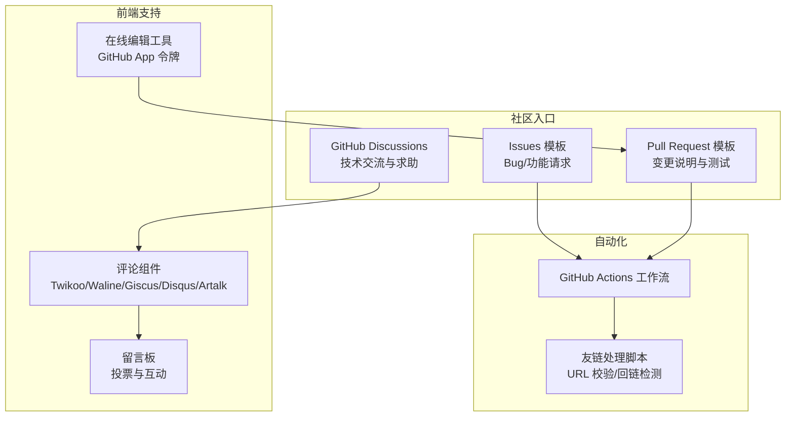
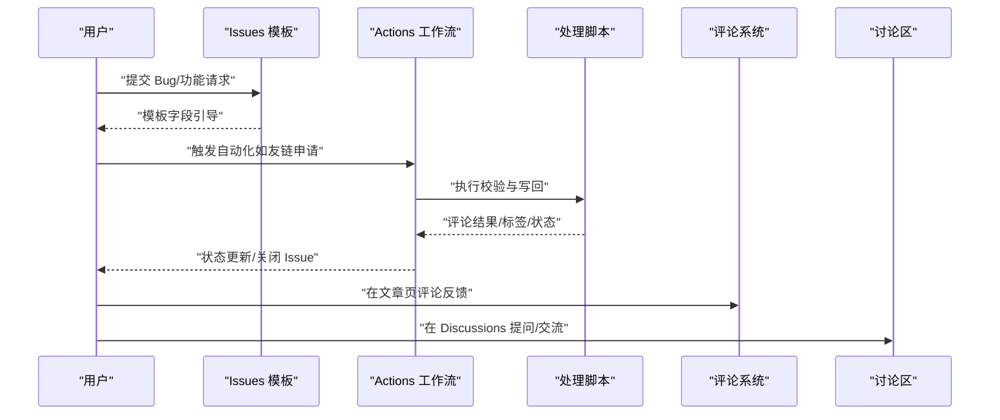
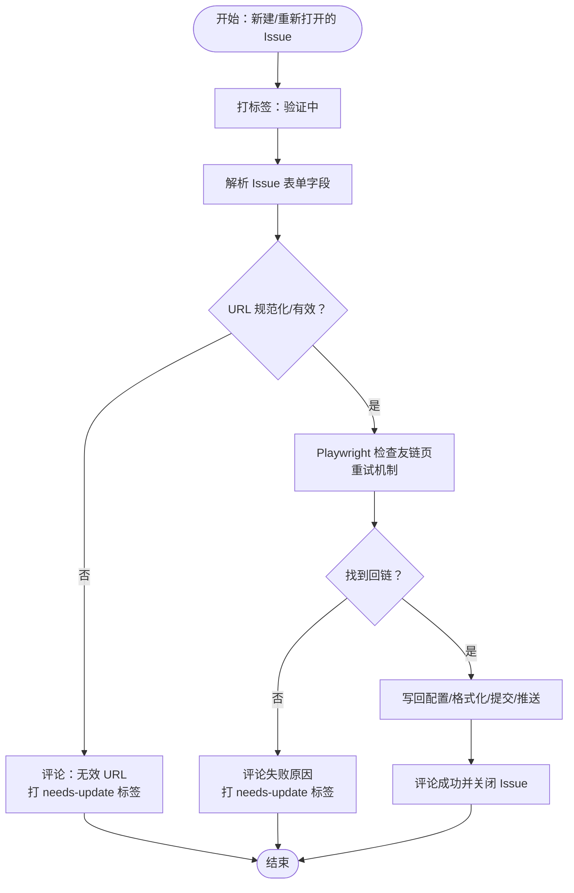
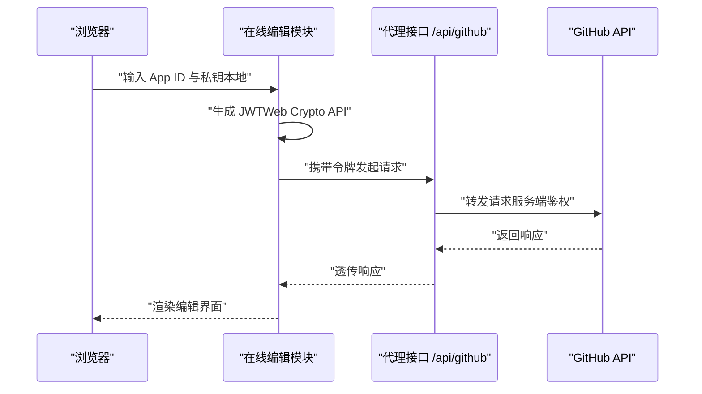
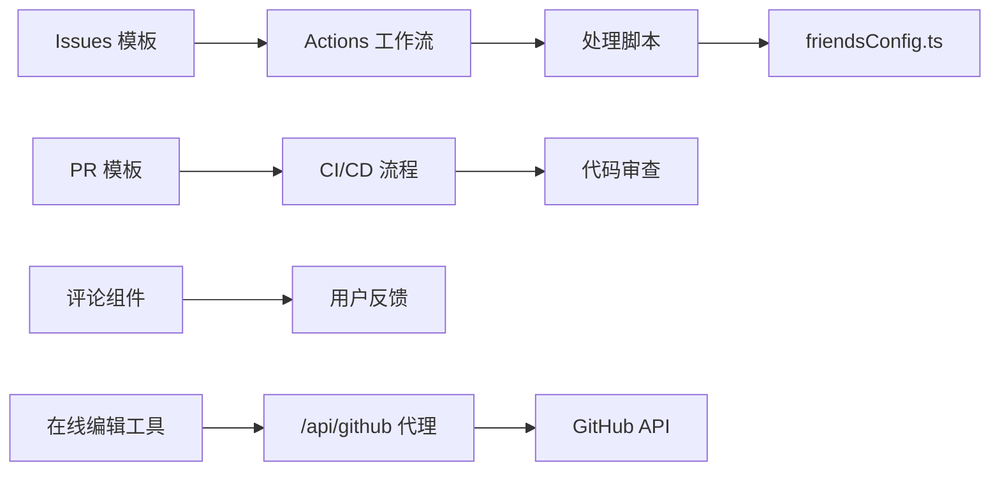

# 社区支持与反馈

<cite>
**本文引用的文件**
- [.github/pull_request_template.md](file://.github/pull_request_template.md)
- [CONTRIBUTING.md](file://CONTRIBUTING.md)
- [.github/ISSUE_TEMPLATE/01-bug_report.yml](file://.github/ISSUE_TEMPLATE/01-bug_report.yml)
- [.github/ISSUE_TEMPLATE/02-feature_request.yml](file://.github/ISSUE_TEMPLATE/02-feature_request.yml)
- [src/components/comment/index.astro](file://src/components/comment/index.astro)
- [src/config/commentConfig.ts](file://src/config/commentConfig.ts)
- [src/content/posts/blog/friend-link-auto-apply-guide.md](file://src/content/posts/blog/friend-link-auto-apply-guide.md)
- [.github/scripts/process-friend-request.cjs](file://.github/scripts/process-friend-request.cjs)
- [src/utils/editMode.ts](file://src/utils/editMode.ts)
- [src/types/guestbook.ts](file://src/types/guestbook.ts)
</cite>

## 目录
1. [简介](#简介)
2. [项目结构](#项目结构)
3. [核心组件](#核心组件)
4. [架构总览](#架构总览)
5. [详细组件分析](#详细组件分析)
6. [依赖关系分析](#依赖关系分析)
7. [性能考虑](#性能考虑)
8. [故障排查指南](#故障排查指南)
9. [结论](#结论)
10. [附录](#附录)

## 简介
本指南面向社区用户与贡献者，围绕问题反馈、技术交流、贡献流程与问题跟踪展开，结合仓库内现有的 GitHub Issues 模板、PR 模板、评论系统与自动化脚本，提供可操作的最佳实践与参考路径。目标是帮助你在最短时间内获得高质量的支持与帮助，同时提升社区协作效率。

## 项目结构
本项目在 GitHub Actions 与前端组件层面提供了完善的社区支持能力：
- Issues 模板：标准化 Bug 报告与功能请求
- PR 模板：规范化变更说明与测试指引
- 评论系统：集成多种第三方评论组件，便于用户反馈与讨论
- 自动化脚本：基于 GitHub Actions 的友链申请与验证流程
- 在线编辑工具：通过 GitHub App 令牌实现安全的在线编辑与预览

**图表来源**
- [.github/ISSUE_TEMPLATE/01-bug_report.yml:1-58](file://.github/ISSUE_TEMPLATE/01-bug_report.yml#L1-L58)
- [.github/ISSUE_TEMPLATE/02-feature_request.yml:1-41](file://.github/ISSUE_TEMPLATE/02-feature_request.yml#L1-L41)
- [.github/pull_request_template.md:1-38](file://.github/pull_request_template.md#L1-L38)
- [src/components/comment/index.astro:39-59](file://src/components/comment/index.astro#L39-L59)
- [src/config/commentConfig.ts:1-38](file://src/config/commentConfig.ts#L1-L38)
- [src/content/posts/blog/friend-link-auto-apply-guide.md:197-1156](file://src/content/posts/blog/friend-link-auto-apply-guide.md#L197-L1156)
- [.github/scripts/process-friend-request.cjs:390-473](file://.github/scripts/process-friend-request.cjs#L390-L473)
- [src/utils/editMode.ts:1-37](file://src/utils/editMode.ts#L1-L37)

**章节来源**
- [.github/ISSUE_TEMPLATE/01-bug_report.yml:1-58](file://.github/ISSUE_TEMPLATE/01-bug_report.yml#L1-L58)
- [.github/ISSUE_TEMPLATE/02-feature_request.yml:1-41](file://.github/ISSUE_TEMPLATE/02-feature_request.yml#L1-L41)
- [.github/pull_request_template.md:1-38](file://.github/pull_request_template.md#L1-L38)
- [src/components/comment/index.astro:39-59](file://src/components/comment/index.astro#L39-L59)
- [src/config/commentConfig.ts:1-38](file://src/config/commentConfig.ts#L1-L38)
- [src/content/posts/blog/friend-link-auto-apply-guide.md:197-1156](file://src/content/posts/blog/friend-link-auto-apply-guide.md#L197-L1156)
- [.github/scripts/process-friend-request.cjs:390-473](file://.github/scripts/process-friend-request.cjs#L390-L473)
- [src/utils/editMode.ts:1-37](file://src/utils/editMode.ts#L1-L37)

## 核心组件
- Issues 模板：提供 Bug 报告与功能请求的标准字段，确保信息完整度与可复现性
- PR 模板：约束变更类型、自检清单、相关 Issue、变更说明、测试方法与截图等
- 评论系统：在文章页集成多种评论组件，便于即时反馈与讨论
- 友链自动化：通过 Issues 申请 + Actions 校验 + 脚本写回配置，形成闭环
- 在线编辑：以 GitHub App 令牌在客户端侧生成 JWT 并调用代理接口，保障凭据安全

**章节来源**
- [.github/ISSUE_TEMPLATE/01-bug_report.yml:1-58](file://.github/ISSUE_TEMPLATE/01-bug_report.yml#L1-L58)
- [.github/ISSUE_TEMPLATE/02-feature_request.yml:1-41](file://.github/ISSUE_TEMPLATE/02-feature_request.yml#L1-L41)
- [.github/pull_request_template.md:1-38](file://.github/pull_request_template.md#L1-L38)
- [src/components/comment/index.astro:39-59](file://src/components/comment/index.astro#L39-L59)
- [src/config/commentConfig.ts:1-38](file://src/config/commentConfig.ts#L1-L38)
- [src/content/posts/blog/friend-link-auto-apply-guide.md:197-1156](file://src/content/posts/blog/friend-link-auto-apply-guide.md#L197-L1156)
- [.github/scripts/process-friend-request.cjs:390-473](file://.github/scripts/process-friend-request.cjs#L390-L473)
- [src/utils/editMode.ts:1-37](file://src/utils/editMode.ts#L1-L37)

## 架构总览
下图展示了从问题发现到解决闭环的关键节点与交互：

**图表来源**
- [.github/ISSUE_TEMPLATE/01-bug_report.yml:1-58](file://.github/ISSUE_TEMPLATE/01-bug_report.yml#L1-L58)
- [.github/ISSUE_TEMPLATE/02-feature_request.yml:1-41](file://.github/ISSUE_TEMPLATE/02-feature_request.yml#L1-L41)
- [src/content/posts/blog/friend-link-auto-apply-guide.md:197-1156](file://src/content/posts/blog/friend-link-auto-apply-guide.md#L197-L1156)
- [.github/scripts/process-friend-request.cjs:390-473](file://.github/scripts/process-friend-request.cjs#L390-L473)
- [src/components/comment/index.astro:39-59](file://src/components/comment/index.astro#L39-L59)

## 详细组件分析

### Issues 模板：Bug 报告与功能请求
- Bug 报告模板包含：问题描述、复现步骤、预期行为、操作系统、浏览器等字段，确保可复现与可定位
- 功能请求模板包含：问题背景、期望方案、替代方案、附加上下文等，便于权衡与决策

最佳实践要点
- 问题描述：聚焦现象与影响范围，避免主观臆测
- 复现步骤：按序号列出最小可复现场景，包含关键操作与环境条件
- 预期行为：明确对照标准，便于回归验证
- 环境信息：尽量提供浏览器版本、操作系统、网络环境等

**章节来源**
- [.github/ISSUE_TEMPLATE/01-bug_report.yml:1-58](file://.github/ISSUE_TEMPLATE/01-bug_report.yml#L1-L58)
- [.github/ISSUE_TEMPLATE/02-feature_request.yml:1-41](file://.github/ISSUE_TEMPLATE/02-feature_request.yml#L1-L41)

### PR 模板：变更说明与测试指引
- 变更类型：明确 Bug 修复、新功能、破坏性变更等
- 自检清单：阅读贡献指南、自我审查、无新增警告等
- 相关 Issue：关联问题编号，便于追踪
- 变更说明：清晰描述改动范围与动机
- 测试方法：说明本地验证步骤与截图
- 附加说明：补充评审关注点

**章节来源**
- [.github/pull_request_template.md:1-38](file://.github/pull_request_template.md#L1-L38)
- [CONTRIBUTING.md:1-20](file://CONTRIBUTING.md#L1-L20)

### 评论系统：技术交流与反馈入口
- 支持多种评论组件（Twikoo、Waline、Giscus、Disqus、Artalk），可在配置中切换
- 文章页评论区提供标题与副标题，引导用户表达观点
- 未启用时提示配置说明，避免误导

使用建议
- 选择与隐私策略匹配的评论系统
- 在文章页评论反馈具体页面与段落，便于作者定位
- 遵循社区礼仪，保持讨论聚焦与尊重

**章节来源**
- [src/components/comment/index.astro:39-59](file://src/components/comment/index.astro#L39-L59)
- [src/config/commentConfig.ts:1-38](file://src/config/commentConfig.ts#L1-L38)

### 友链自动化：从申请到上线的闭环
该流程通过 Issues 表单收集信息，由 Actions 工作流驱动脚本完成 URL 校验与回链检测，并自动写回配置、格式化与提交，最终在 Issue 中评论结果并关闭。

关键步骤
- 表单字段：站点名称、链接、友链页面 URL 等
- URL 规范化与有效性校验
- 使用无头浏览器检查回链存在
- 解析现有配置并生成新对象
- 写回配置、格式化、Git 提交与推送
- 在 Issue 中评论结果、打标签、关闭 Issue

**图表来源**
- [src/content/posts/blog/friend-link-auto-apply-guide.md:197-1156](file://src/content/posts/blog/friend-link-auto-apply-guide.md#L197-L1156)
- [.github/scripts/process-friend-request.cjs:390-473](file://.github/scripts/process-friend-request.cjs#L390-L473)

**章节来源**
- [src/content/posts/blog/friend-link-auto-apply-guide.md:197-1156](file://src/content/posts/blog/friend-link-auto-apply-guide.md#L197-L1156)
- [.github/scripts/process-friend-request.cjs:390-473](file://.github/scripts/process-friend-request.cjs#L390-L473)

### 在线编辑工具：安全的凭据管理
- 通过客户端侧生成 JWT 并调用代理接口，私钥与 App ID 仅存储于本地缓存
- 代理地址固定，减少暴露风险
- 适用于需要在线编辑场景的安全需求

**图表来源**
- [src/utils/editMode.ts:1-37](file://src/utils/editMode.ts#L1-L37)

**章节来源**
- [src/utils/editMode.ts:1-37](file://src/utils/editMode.ts#L1-L37)

### 留言板与互动：社区氛围与反馈渠道
- 留言板提供卡片式交互与投票，鼓励用户表达观点
- 示例数据包含时间戳、点赞/反对/中立统计，便于观察社区反馈趋势

**章节来源**
- [src/types/guestbook.ts:43-83](file://src/types/guestbook.ts#L43-L83)

## 依赖关系分析
- Issues 模板依赖 GitHub 的 Issue 表单渲染与标签系统
- PR 模板依赖贡献指南与 CI/CD 流程
- 评论系统依赖前端组件与后端服务（如 Twikoo、Waline）
- 友链自动化依赖 Actions 工作流、脚本与配置文件
- 在线编辑依赖 GitHub App 与代理接口

**图表来源**
- [.github/ISSUE_TEMPLATE/01-bug_report.yml:1-58](file://.github/ISSUE_TEMPLATE/01-bug_report.yml#L1-L58)
- [.github/ISSUE_TEMPLATE/02-feature_request.yml:1-41](file://.github/ISSUE_TEMPLATE/02-feature_request.yml#L1-L41)
- [.github/pull_request_template.md:1-38](file://.github/pull_request_template.md#L1-L38)
- [src/config/commentConfig.ts:1-38](file://src/config/commentConfig.ts#L1-L38)
- [src/content/posts/blog/friend-link-auto-apply-guide.md:197-1156](file://src/content/posts/blog/friend-link-auto-apply-guide.md#L197-L1156)
- [.github/scripts/process-friend-request.cjs:390-473](file://.github/scripts/process-friend-request.cjs#L390-L473)
- [src/utils/editMode.ts:1-37](file://src/utils/editMode.ts#L1-L37)

**章节来源**
- [.github/ISSUE_TEMPLATE/01-bug_report.yml:1-58](file://.github/ISSUE_TEMPLATE/01-bug_report.yml#L1-L58)
- [.github/ISSUE_TEMPLATE/02-feature_request.yml:1-41](file://.github/ISSUE_TEMPLATE/02-feature_request.yml#L1-L41)
- [.github/pull_request_template.md:1-38](file://.github/pull_request_template.md#L1-L38)
- [src/config/commentConfig.ts:1-38](file://src/config/commentConfig.ts#L1-L38)
- [src/content/posts/blog/friend-link-auto-apply-guide.md:197-1156](file://src/content/posts/blog/friend-link-auto-apply-guide.md#L197-L1156)
- [.github/scripts/process-friend-request.cjs:390-473](file://.github/scripts/process-friend-request.cjs#L390-L473)
- [src/utils/editMode.ts:1-37](file://src/utils/editMode.ts#L1-L37)

## 性能考虑
- 评论系统：根据流量与延迟选择合适的服务端（如 Twikoo/Waline），必要时开启访问量统计与表情资源缓存
- 友链校验：URL 规范化与无效快速失败可减少不必要的浏览器启动；回链检测采用重试机制降低偶发失败率
- 在线编辑：令牌生成与代理调用应避免频繁往返，合理设置缓存与过期策略

[本节为通用指导，无需特定文件引用]

## 故障排查指南
- Issues 模板填写不完整
  - 现象：自动化流程无法继续或被标记为待更新
  - 排查：确认必填字段（站点名称、链接、友链页面 URL）是否齐全且格式正确
  - 参考：[友链处理脚本中的校验与标签逻辑:439-450](file://.github/scripts/process-friend-request.cjs#L439-L450)

- URL 无效或不可访问
  - 现象：校验失败并提示无效 URL 或页面不可访问
  - 排查：使用规范化 URL 校验，确认网络连通性与 CDN 状态
  - 参考：[URL 规范化与错误提示:440-450](file://.github/scripts/process-friend-request.cjs#L440-L450)

- 未找到回链
  - 现象：回链检测失败，提示需先在对方站点添加本站信息
  - 排查：检查对方站点是否包含本站域名或名称；修正后再触发重新验证
  - 参考：[回链检测与失败提示:452-501](file://.github/scripts/process-friend-request.cjs#L452-L501)

- PR 审查未通过
  - 现象：CI 报错或审查意见较多
  - 排查：遵循贡献指南的检查清单，运行格式化与检查命令，逐项修正
  - 参考：[贡献指南与 PR 模板:1-20](file://CONTRIBUTING.md#L1-L20), [PR 模板:1-38](file://.github/pull_request_template.md#L1-L38)

- 评论系统异常
  - 现象：评论区空白或加载失败
  - 排查：确认评论系统类型与配置项是否正确；检查后端服务可用性
  - 参考：[评论组件与配置:39-59](file://src/components/comment/index.astro#L39-L59), [评论配置:1-38](file://src/config/commentConfig.ts#L1-L38)

**章节来源**
- [.github/scripts/process-friend-request.cjs:439-501](file://.github/scripts/process-friend-request.cjs#L439-L501)
- [CONTRIBUTING.md:1-20](file://CONTRIBUTING.md#L1-L20)
- [.github/pull_request_template.md:1-38](file://.github/pull_request_template.md#L1-L38)
- [src/components/comment/index.astro:39-59](file://src/components/comment/index.astro#L39-L59)
- [src/config/commentConfig.ts:1-38](file://src/config/commentConfig.ts#L1-L38)

## 结论
通过标准化的 Issues 模板、严谨的 PR 流程、灵活的评论系统与高效的自动化脚本，本项目构建了完整的社区支持与反馈体系。建议在提问、反馈与贡献过程中严格遵循本文档的最佳实践，以提高沟通效率与问题解决速度。

[本节为总结性内容，无需特定文件引用]

## 附录

### 如何有效使用 GitHub Discussions 进行技术交流
- 选择合适的主题分区（如 Q&A、想法、讨论等）
- 提供清晰的标题与摘要，便于他人快速理解
- 在提问时附带必要的上下文（环境、版本、截图/录屏）
- 回答他人问题时保持耐心与专业，必要时提供可复现步骤与参考链接

[本节为通用指导，无需特定文件引用]

### 问题分类与优先级评估方法
- 分类维度：功能缺陷、设计建议、性能问题、兼容性问题、文档缺失等
- 优先级参考：紧急（阻塞性问题）、高（影响多数用户）、中（局部影响）、低（微小体验问题）
- 评估依据：影响范围、复现难度、资源投入与收益平衡

[本节为通用指导，无需特定文件引用]

### 跟踪问题解决进度
- 利用标签（如 bug、enhancement、验证中、needs-update）直观查看状态
- 关注自动化评论与关闭状态，及时响应与补充信息
- 在 PR 中关联相关 Issue，便于回溯与回归验证

[本节为通用指导，无需特定文件引用]

### 常见问题 FAQ 与自助解决方案
- 如何快速定位评论系统问题？
  - 检查配置项与后端服务状态，尝试切换到其他评论组件进行对比
  - 参考：[评论配置:1-38](file://src/config/commentConfig.ts#L1-L38)
- 如何自助验证友链页面？
  - 确认对方站点包含回链文本或域名；使用浏览器开发者工具检查网络与 DOM
  - 参考：[友链处理脚本中的校验逻辑:452-501](file://.github/scripts/process-friend-request.cjs#L452-L501)

**章节来源**
- [src/config/commentConfig.ts:1-38](file://src/config/commentConfig.ts#L1-L38)
- [.github/scripts/process-friend-request.cjs:452-501](file://.github/scripts/process-friend-request.cjs#L452-L501)

### 参与开源社区建设与发展路线图讨论
- 在 Discussions 中提出路线图建议与投票
- 通过 Issues 与 PR 跟踪具体任务与里程碑
- 遵循贡献指南与审查标准，确保质量与一致性

[本节为通用指导，无需特定文件引用]