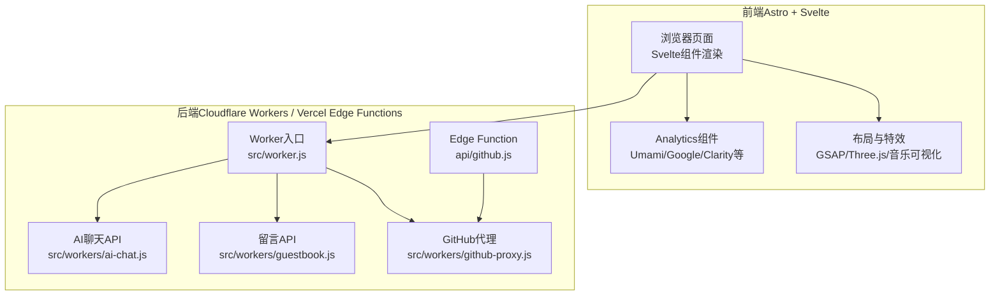
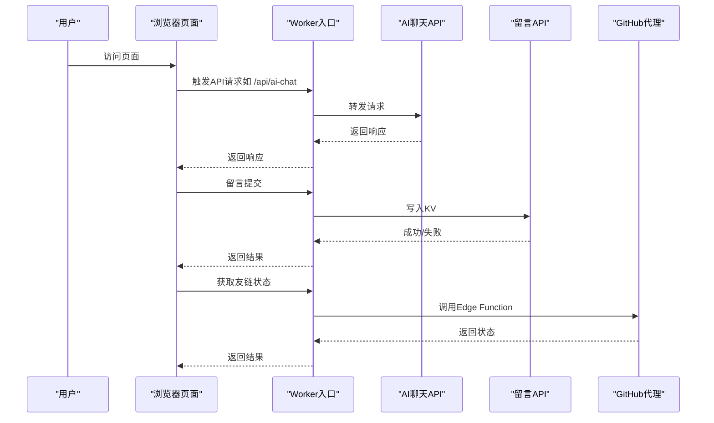
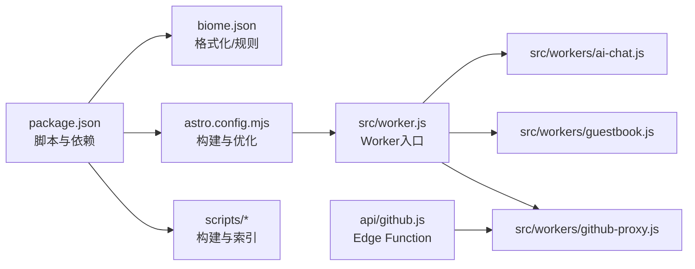
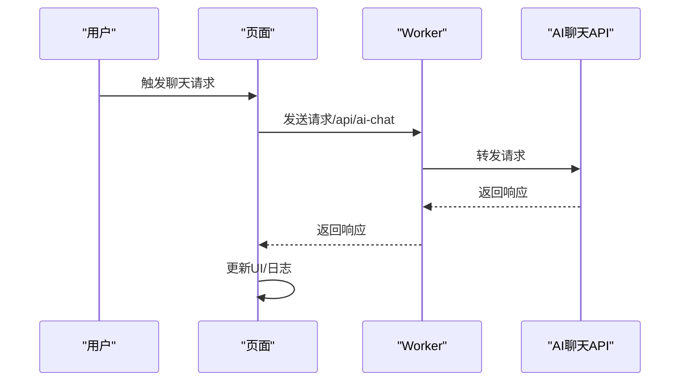

# 调试工具使用

<cite>
**本文引用的文件**
- [package.json](file://package.json)
- [astro.config.mjs](file://astro.config.mjs)
- [biome.json](file://biome.json)
- [.gitignore](file://.gitignore)
- [src/components/analytics/UmamiAnalytics.astro](file://src/components/analytics/UmamiAnalytics.astro)
- [src/utils/home-data-layer.js](file://src/utils/home-data-layer.js)
- [src/components/layout/HomeHero.astro](file://src/components/layout/HomeHero.astro)
- [src/components/features/BubbleMenu.svelte](file://src/components/features/BubbleMenu.svelte)
- [src/components/features/TypewriterText.astro](file://src/components/features/TypewriterText.astro)
- [src/components/edit/ConfigEditor.svelte](file://src/components/edit/ConfigEditor.svelte)
- [src/workers/ai-chat.js](file://src/workers/ai-chat.js)
- [src/workers/guestbook.js](file://src/workers/guestbook.js)
- [src/workers/github-proxy.js](file://src/workers/github-proxy.js)
- [src/worker.js](file://src/worker.js)
- [api/github.js](file://api/github.js)
- [scripts/build-vectorize-index.js](file://scripts/build-vectorize-index.js)
- [.github/workflows/cron-check.yml](file://.github/workflows/cron-check.yml)
- [public/assets/js/marked.min.js](file://public/assets/js/marked.min.js)
- [public/pio/models/live2d/小爱弥斯_vts/动画/表情/笑.motion3.json](file://public/pio/models/live2d/小爱弥斯_vts/动画/表情/笑.motion3.json)
- [public/pio/models/live2d/小爱弥斯_vts/动画/表情/wink.motion3.json](file://public/pio/models/live2d/小爱弥斯_vts/动画/表情/wink.motion3.json)
- [public/pio/models/live2d/小爱弥斯_vts/动画/表情/哭.motion3.json](file://public/pio/models/live2d/小爱弥斯_vts/动画/表情/哭.motion3.json)
- [public/pio/models/live2d/小爱弥斯_vts/动画/长动画/捂嘴笑.motion3.json](file://public/pio/models/live2d/小爱弥斯_vts/动画/长动画/捂嘴笑.motion3.json)
</cite>

## 目录
1. [简介](#简介)
2. [项目结构](#项目结构)
3. [核心组件](#核心组件)
4. [架构总览](#架构总览)
5. [详细组件分析](#详细组件分析)
6. [依赖关系分析](#依赖关系分析)
7. [性能考量](#性能考量)
8. [故障排查指南](#故障排查指南)
9. [结论](#结论)
10. [附录](#附录)

## 简介
本指南面向前端与全栈开发者，围绕浏览器开发者工具与Node.js调试器，结合本项目的实际代码与部署形态（Astro + Svelte + Cloudflare Workers/Vercel Edge Functions），系统讲解以下主题：
- 浏览器开发者工具各面板的实战用法：Elements、Console、Sources、Network、Performance
- 断点调试JavaScript与Source Maps定位源码
- 监控网络请求与API调用（含Worker与Edge Function）
- VS Code与命令行调试Node.js（含Playwright巡检脚本）
- 日志分析、错误追踪与性能瓶颈定位
- 移动端与跨平台调试要点

## 项目结构
本项目采用Astro + Svelte + Cloudflare Workers/Vercel Edge Functions的混合架构，前端组件与页面通过Astro构建，静态资源与Worker/Edge Function负责后端逻辑与API代理。

图表来源
- [src/worker.js](file://src/worker.js)
- [src/workers/ai-chat.js](file://src/workers/ai-chat.js)
- [src/workers/guestbook.js](file://src/workers/guestbook.js)
- [src/workers/github-proxy.js](file://src/workers/github-proxy.js)
- [api/github.js](file://api/github.js)
- [src/components/analytics/UmamiAnalytics.astro](file://src/components/analytics/UmamiAnalytics.astro)

章节来源
- [SKILL.md](file://.trae/skills/fqzlr-blog/SKILL.md)
- [package.json](file://package.json)

## 核心组件
- 统计与性能采集：通过Analytics组件注入脚本参数，控制Web Vitals采集与采样率等，便于在Performance面板中观察指标。
- 布局与动画：首页Hero区与特效组件使用GSAP与VFX，适合在Performance面板进行帧率与滚动触发器分析。
- Worker与Edge Function：AI聊天、留言、GitHub代理等API均在Worker/Edge Function中实现，便于在Network与Sources面板定位请求与断点。
- 源码与构建：Biome格式化与校验、打包脚本、Source Maps等，影响断点与日志可读性。

章节来源
- [src/components/analytics/UmamiAnalytics.astro](file://src/components/analytics/UmamiAnalytics.astro)
- [src/components/layout/HomeHero.astro](file://src/components/layout/HomeHero.astro)
- [src/components/features/BubbleMenu.svelte](file://src/components/features/BubbleMenu.svelte)
- [src/worker.js](file://src/worker.js)
- [biome.json](file://biome.json)
- [package.json](file://package.json)

## 架构总览
下图展示从浏览器到Worker/Edge Function的关键调用路径，便于在Network与Performance面板定位问题。

图表来源
- [src/worker.js](file://src/worker.js)
- [src/workers/ai-chat.js](file://src/workers/ai-chat.js)
- [src/workers/guestbook.js](file://src/workers/guestbook.js)
- [src/workers/github-proxy.js](file://src/workers/github-proxy.js)
- [api/github.js](file://api/github.js)

## 详细组件分析

### 统计与性能采集（Analytics）
- 作用：通过注入脚本参数控制Web Vitals采集、采样率、遮罩级别与最大时长等，便于在Performance面板中查看指标。
- 实战建议：
  - 在Performance面板开启“记录Web Vitals”以捕获CLS/FID/LCP等指标。
  - 使用Network面板筛选采集脚本请求，核对参数是否正确下发。
- 注意：Analytics组件在构建时可能被压缩，建议配合Source Maps进行断点调试。

章节来源
- [src/components/analytics/UmamiAnalytics.astro](file://src/components/analytics/UmamiAnalytics.astro)

### 首页Hero与动画（GSAP/VFX）
- 作用：首页Hero区域使用GSAP注册ScrollTrigger并执行开启动画；在移动端或减少动画偏好下会降级。
- 实战建议：
  - 在Performance面板观察滚动触发器导致的重绘/回流峰值。
  - 在Sources面板设置断点于初始化函数，验证是否进入移动端降级分支。
- 适用场景：滚动触发动画卡顿、首屏渲染延迟、内存泄漏排查。

章节来源
- [src/components/layout/HomeHero.astro](file://src/components/layout/HomeHero.astro)

### 动态菜单与交互（Svelte）
- 作用：气泡菜单使用GSAP进行缩放与透明度动画，监听主题变化并动态计算背景色。
- 实战建议：
  - 在Elements面板检查DOM结构与类名变化。
  - 在Sources面板设置断点于动画timeline与主题监听回调，验证动画时序与颜色映射。

章节来源
- [src/components/features/BubbleMenu.svelte](file://src/components/features/BubbleMenu.svelte)

### 文本打字机效果（Astro + Svelte）
- 作用：根据data-*属性解析文本序列，逐字打字/删除，支持速度与暂停时间配置。
- 实战建议：
  - 在Console面板打印关键状态（当前文本索引、是否删除中），辅助定位逻辑分支。
  - 在Sources面板设置断点于构造函数与动画循环，验证文本解析与定时器行为。

章节来源
- [src/components/features/TypewriterText.astro](file://src/components/features/TypewriterText.astro)

### 站点配置编辑器（ConfigEditor）
- 作用：在线编辑站点配置，生成TypeScript代码模板，涉及深拷贝与默认值合并。
- 实战建议：
  - 在Console面板输出关键配置对象，核对默认值与覆盖逻辑。
  - 在Sources面板设置断点于加载与生成流程，验证字段完整性与关键字数组拼接。

章节来源
- [src/components/edit/ConfigEditor.svelte](file://src/components/edit/ConfigEditor.svelte)

### Worker与Edge Function（API路由）
- 作用：Worker入口分发请求至具体API模块；Edge Function提供GitHub API代理。
- 实战建议：
  - 在Network面板观察请求路径与响应状态码，定位上游代理是否成功。
  - 在Sources面板设置断点于Worker与Edge Function入口，验证鉴权、限流与错误处理。
- 部署差异：Cloudflare Workers与Vercel Edge Functions共享同一代理逻辑，但入口与配置不同。

章节来源
- [src/worker.js](file://src/worker.js)
- [src/workers/ai-chat.js](file://src/workers/ai-chat.js)
- [src/workers/guestbook.js](file://src/workers/guestbook.js)
- [src/workers/github-proxy.js](file://src/workers/github-proxy.js)
- [api/github.js](file://api/github.js)

### 源码与构建（Source Maps与格式化）
- 作用：Biome负责格式化与规则校验；构建脚本生成图标与向量索引；.gitignore排除临时产物。
- 实战建议：
  - 在Sources面板启用“启用源码映射”，确保断点命中真实源文件而非压缩版本。
  - 使用命令行格式化与检查，减少构建期错误导致的断点失效。

章节来源
- [biome.json](file://biome.json)
- [package.json](file://package.json)
- [.gitignore](file://.gitignore)

### 模型动画数据（Live2D/Spine）
- 作用：表情与长动画的JSON描述参数随时间变化，用于驱动模型表现。
- 实战建议：
  - 在Network面板观察模型资源加载与动画片段请求。
  - 在Sources面板设置断点于动画播放逻辑，验证参数段与时间轴。

章节来源
- [public/pio/models/live2d/小爱弥斯_vts/动画/表情/笑.motion3.json](file://public/pio/models/live2d/小爱弥斯_vts/动画/表情/笑.motion3.json)
- [public/pio/models/live2d/小爱弥斯_vts/动画/表情/wink.motion3.json](file://public/pio/models/live2d/小爱弥斯_vts/动画/表情/wink.motion3.json)
- [public/pio/models/live2d/小爱弥斯_vts/动画/表情/哭.motion3.json](file://public/pio/models/live2d/小爱弥斯_vts/动画/表情/哭.motion3.json)
- [public/pio/models/live2d/小爱弥斯_vts/动画/长动画/捂嘴笑.motion3.json](file://public/pio/models/live2d/小爱弥斯_vts/动画/长动画/捂嘴笑.motion3.json)

## 依赖关系分析
- 前端依赖：Astro、Svelte、GSAP、ECharts、Three.js等，影响Performance面板中的渲染与动画开销。
- 后端依赖：Cloudflare Workers SDK、Vercel Edge Functions运行时、KV/Vectorize绑定。
- 构建与质量：Biome、Pagefind、向量索引构建脚本。

图表来源
- [package.json](file://package.json)
- [astro.config.mjs](file://astro.config.mjs)
- [biome.json](file://biome.json)
- [scripts/build-vectorize-index.js](file://scripts/build-vectorize-index.js)
- [src/worker.js](file://src/worker.js)
- [src/workers/ai-chat.js](file://src/workers/ai-chat.js)
- [src/workers/guestbook.js](file://src/workers/guestbook.js)
- [src/workers/github-proxy.js](file://src/workers/github-proxy.js)
- [api/github.js](file://api/github.js)

章节来源
- [package.json](file://package.json)
- [astro.config.mjs](file://astro.config.mjs)
- [biome.json](file://biome.json)
- [scripts/build-vectorize-index.js](file://scripts/build-vectorize-index.js)

## 性能考量
- 渲染与动画
  - 使用GSAP与ScrollTrigger的组件在Performance面板中容易产生高CPU占用，建议：
    - 合理设置动画时长与缓动函数
    - 在移动端或“减少动画”偏好下降级
    - 使用“避免昂贵操作”与“帧限制”模拟器评估性能
- 网络与API
  - 在Network面板观察请求耗时、重定向与缓存命中情况
  - 对Worker/Edge Function接口进行节流与超时控制，避免阻塞主线程
- 构建与Source Maps
  - 启用Source Maps以便在Sources面板精确定位
  - 使用Biome格式化减少不必要的空白与注释，降低包体与解析成本

## 故障排查指南

### 浏览器开发者工具面板实战
- Elements
  - 检查元素类名、内联样式与属性变更，定位动画与布局问题
- Console
  - 输出关键状态与配置对象，辅助定位逻辑分支与边界条件
- Sources
  - 启用“启用源码映射”，设置断点于初始化与事件回调
  - 在Network面板筛选XHR/Fetch，核对请求参数与响应体
- Network
  - 观察Worker/Edge Function返回的状态码与耗时
  - 区分静态资源与API请求，识别缓存策略与CDN命中
- Performance
  - 记录Web Vitals，关注滚动触发器导致的重绘/回流峰值
  - 使用“火焰图”定位耗时函数与调用栈

### Node.js调试器（VS Code与命令行）
- VS Code调试配置
  - 使用Playwright巡检脚本时，可在VS Code中设置Node调试任务，附加到运行中的Node进程
  - 配合环境变量与工作目录，确保脚本能够访问到Playwright依赖
- 命令行调试
  - 使用inspect标志启动Node进程，连接Chrome DevTools进行断点调试
  - 在巡检脚本中加入关键日志，便于在CI日志中定位失败原因

章节来源
- [.github/workflows/cron-check.yml](file://.github/workflows/cron-check.yml)

### 错误追踪与日志分析
- 在Analytics组件中启用采样与遮罩，结合Performance面板的错误堆栈
- 在Worker/Edge Function中增加结构化日志，区分业务错误与系统错误
- 使用Network面板过滤错误状态码，快速定位上游服务异常

章节来源
- [src/components/analytics/UmamiAnalytics.astro](file://src/components/analytics/UmamiAnalytics.astro)
- [src/workers/github-proxy.js](file://src/workers/github-proxy.js)

### 移动端与跨平台调试
- 移动端
  - 在Performance面板启用“移动设备模拟”，观察滚动与触摸事件对动画的影响
  - 在Console面板打印媒体查询匹配结果，验证移动端降级逻辑
- 跨平台
  - 在Network面板对比不同UA下的响应差异
  - 在Sources面板设置断点于环境检测逻辑，验证平台特定分支

章节来源
- [src/components/layout/HomeHero.astro](file://src/components/layout/HomeHero.astro)

## 结论
本指南提供了从浏览器到Node.js的全链路调试方法，结合本项目的Astro+Svelte架构与Cloudflare Workers/Vercel Edge Functions部署形态，帮助你快速定位问题、优化性能并提升开发效率。建议在日常开发中：
- 始终启用Source Maps与严格日志
- 在Performance面板持续监控关键指标
- 在Network面板聚焦API与资源瓶颈
- 在Sources面板通过断点与条件断点深入定位

## 附录

### 常用断点设置清单
- 初始化与生命周期：组件挂载、主题监听、滚动触发器注册
- 事件回调：点击、滚动、键盘输入、窗口大小变化
- 数据流：配置加载、API请求、响应处理、错误捕获
- 动画与渲染：GSAP timeline、帧循环、重绘/回流热点

### 关键流程断点图（以AI聊天为例）

图表来源
- [src/worker.js](file://src/worker.js)
- [src/workers/ai-chat.js](file://src/workers/ai-chat.js)