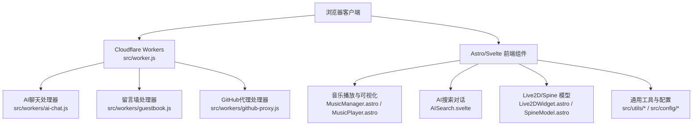
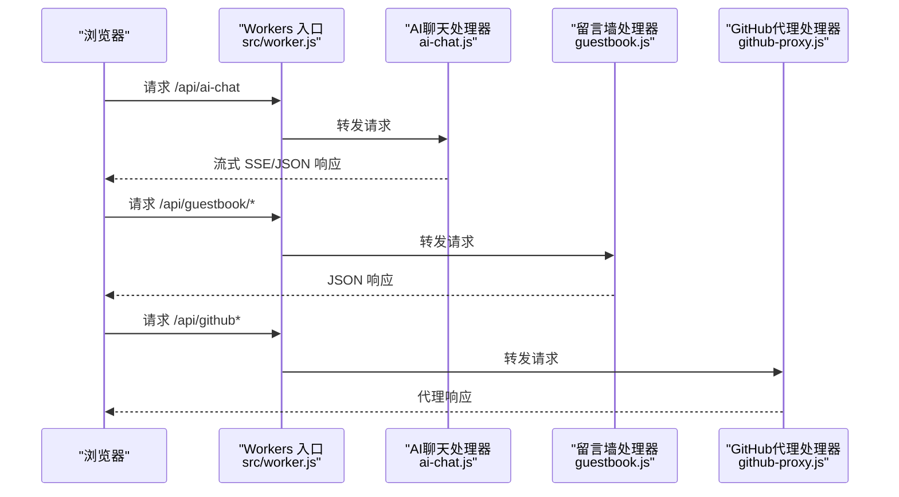
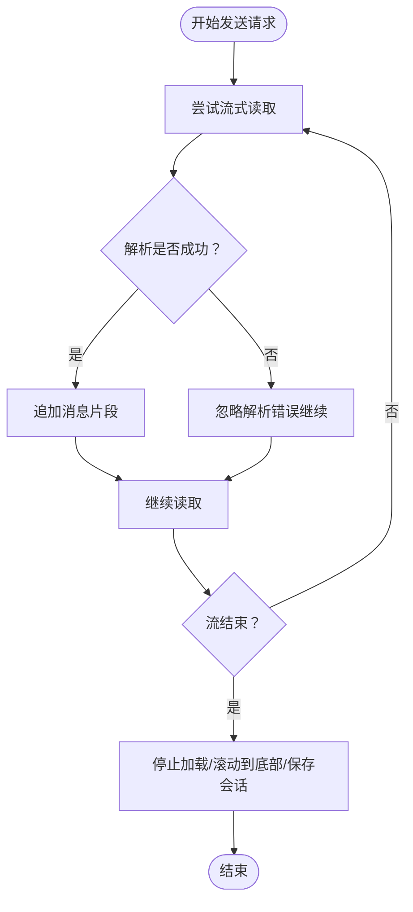
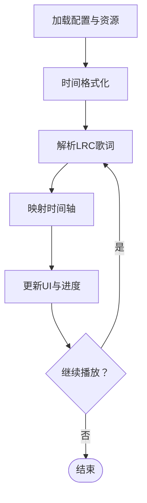
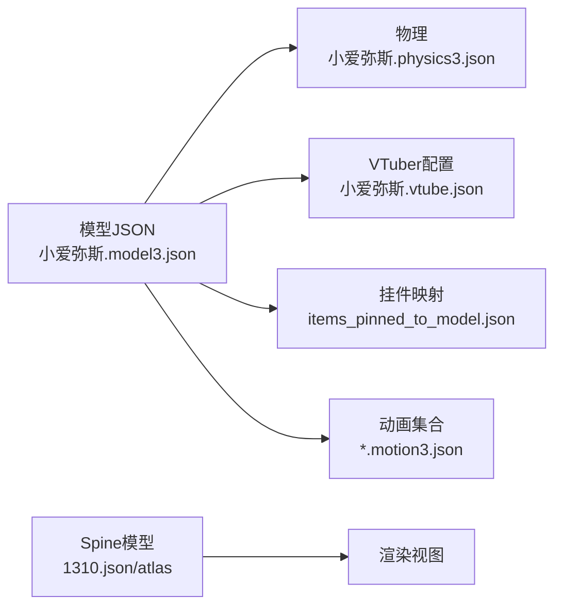
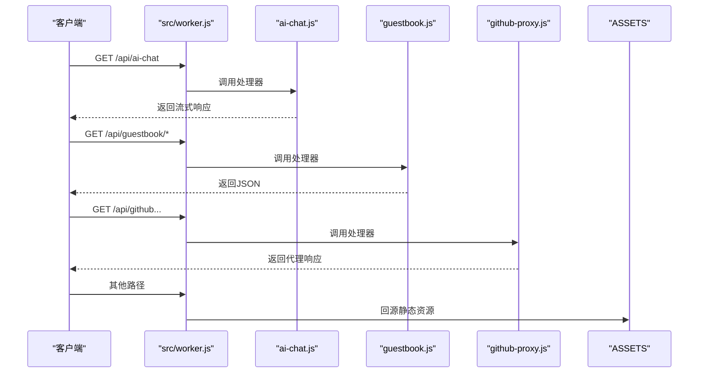
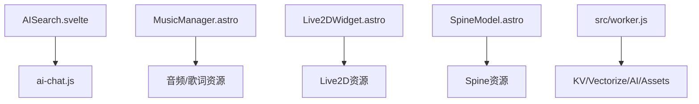

# 运行时问题

<cite>
**本文档引用的文件**
- [src/worker.js](file://src/worker.js)
- [wrangler.toml](file://wrangler.toml)
- [src/components/features/MusicManager.astro](file://src/components/features/MusicManager.astro)
- [src/components/controls/AISearch.svelte](file://src/components/controls/AISearch.svelte)
- [src/workers/ai-chat.js](file://src/workers/ai-chat.js)
- [src/workers/guestbook.js](file://src/workers/guestbook.js)
- [src/workers/github-proxy.js](file://src/workers/github-proxy.js)
- [src/workers/utils/streaming.js](file://src/workers/utils/streaming.js)
- [src/workers/utils/rate-limit.js](file://src/workers/utils/rate-limit.js)
- [public/assets/js/highlight.min.js](file://public/assets/js/highlight.min.js)
- [public/assets/js/marked.min.js](file://public/assets/js/marked.min.js)
- [public/pio/models/live2d/小爱弥斯_vts/小爱弥斯.model3.json](file://public/pio/models/live2d/小爱弥斯_vts/小爱弥斯.model3.json)
- [public/pio/models/live2d/小爱弥斯_vts/小爱弥斯.physics3.json](file://public/pio/models/live2d/小爱弥斯_vts/小爱弥斯.physics3.json)
- [public/pio/models/live2d/小爱弥斯_vts/小爱弥斯.vtube.json](file://public/pio/models/live2d/小爱弥斯_vts/小爱弥斯.vtube.json)
- [public/pio/models/live2d/小爱弥斯_vts/items_pinned_to_model.json](file://public/pio/models/live2d/小爱弥斯_vts/items_pinned_to_model.json)
- [public/pio/models/live2d/小爱弥斯_vts/动画/长动画/待机.motion3.json](file://public/pio/models/live2d/小爱弥斯_vts/动画/长动画/待机.motion3.json)
- [public/pio/models/live2d/小爱弥斯_vts/动画/表情/笑.motion3.json](file://public/pio/models/live2d/小爱弥斯_vts/动画/表情/笑.motion3.json)
- [public/pio/models/live2d/小爱弥斯_vts/动画/短动画/戳脸.motion3.json](file://public/pio/models/live2d/小爱弥斯_vts/动画/短动画/戳脸.motion3.json)
- [public/pio/models/spine/firefly/1310.json](file://public/pio/models/spine/firefly/1310.json)
- [public/pio/models/spine/firefly/1310.atlas](file://public/pio/models/spine/firefly/1310.atlas)
- [src/components/features/Live2DWidget.astro](file://src/components/features/Live2DWidget.astro)
- [src/components/features/SpineModel.astro](file://src/components/features/SpineModel.astro)
- [src/components/features/music-visualizer/MusicVisualizer.svelte](file://src/components/features/music-visualizer/MusicVisualizer.svelte)
- [src/components/features/music-visualizer/ThreeScene.svelte](file://src/components/features/music-visualizer/ThreeScene.svelte)
- [src/components/features/music-visualizer/VisualizerControls.svelte](file://src/components/features/music-visualizer/VisualizerControls.svelte)
- [src/components/features/MusicPlayer.astro](file://src/components/features/MusicPlayer.astro)
- [src/components/features/FloatingLyrics.astro](file://src/components/features/FloatingLyrics.astro)
- [src/config/aiSearchConfig.ts](file://src/config/aiSearchConfig.ts)
- [src/config/musicConfig.ts](file://src/config/musicConfig.ts)
- [src/config/pioConfig.ts](file://src/config/pioConfig.ts)
- [src/utils/home-data-layer.js](file://src/utils/home-data-layer.js)
- [src/utils/page-loader-controller.js](file://src/utils/page-loader-controller.js)
- [src/utils/virtual-list-window.js](file://src/utils/virtual-list-window.js)
- [src/utils/icon-loader.ts](file://src/utils/icon-loader.ts)
- [src/utils/image-utils.ts](file://src/utils/image-utils.ts)
- [src/utils/url-utils.ts](file://src/utils/url-utils.ts)
- [src/utils/crypto-utils.ts](file://src/utils/crypto-utils.ts)
- [src/utils/date-utils.ts](file://src/utils/date-utils.ts)
- [src/utils/layout-utils.ts](file://src/utils/layout-utils.ts)
- [src/utils/navigation-utils.ts](file://src/utils/navigation-utils.ts)
- [src/utils/toc-utils.ts](file://src/utils/toc-utils.ts)
- [src/utils/guestbook-api.ts](file://src/utils/guestbook-api.ts)
- [src/utils/guestbook-cache.ts](file://src/utils/guestbook-cache.ts)
- [src/utils/hatch-effect.ts](file://src/utils/hatch-effect.ts)
- [src/utils/calendar-events.ts](file://src/utils/calendar-events.ts)
- [src/utils/content-utils.ts](file://src/utils/content-utils.ts)
- [src/utils/draftHelpers.ts](file://src/utils/draftHelpers.ts)
- [src/utils/editMode.ts](file://src/utils/editMode.ts)
- [src/utils/gallery-utils.ts](file://src/utils/gallery-utils.ts)
- [src/utils/logo-loop.js](file://src/utils/logo-loop.js)
- [src/utils/lunar-utils.ts](file://src/utils/lunar-utils.ts)
- [src/utils/setting-utils.ts](file://src/utils/setting-utils.ts)
- [src/utils/tag-graph-data.ts](file://src/utils/tag-graph-data.ts)
- [src/utils/url-utils.ts](file://src/utils/url-utils.ts)
- [src/utils/virtual-list-window.js](file://src/utils/virtual-list-window.js)
- [src/utils/home-portfolio-shutter.js](file://src/utils/home-portfolio-shutter.js)
- [src/utils/home-data-layer.js](file://src/utils/home-data-layer.js)
- [src/utils/page-loader-controller.js](file://src/utils/page-loader-controller.js)
- [src/utils/hatch-effect.ts](file://src/utils/hatch-effect.ts)
- [src/utils/navigation-utils.ts](file://src/utils/navigation-utils.ts)
- [src/utils/layout-utils.ts](file://src/utils/layout-utils.ts)
- [src/utils/date-utils.ts](file://src/utils/date-utils.ts)
- [src/utils/content-utils.ts](file://src/utils/content-utils.ts)
- [src/utils/image-utils.ts](file://src/utils/image-utils.ts)
- [src/utils/icon-loader.ts](file://src/utils/icon-loader.ts)
- [src/utils/url-utils.ts](file://src/utils/url-utils.ts)
- [src/utils/crypto-utils.ts](file://src/utils/crypto-utils.ts)
- [src/utils/tag-graph-data.ts](file://src/utils/tag-graph-data.ts)
- [src/utils/editMode.ts](file://src/utils/editMode.ts)
- [src/utils/draftHelpers.ts](file://src/utils/draftHelpers.ts)
- [src/utils/gallery-utils.ts](file://src/utils/gallery-utils.ts)
- [src/utils/lunar-utils.ts](file://src/utils/lunar-utils.ts)
- [src/utils/setting-utils.ts](file://src/utils/setting-utils.ts)
- [src/utils/calendar-events.ts](file://src/utils/calendar-events.ts)
- [src/utils/logo-loop.js](file://src/utils/logo-loop.js)
- [src/utils/home-portfolio-shutter.js](file://src/utils/home-portfolio-shutter.js)
- [src/utils/home-data-layer.js](file://src/utils/home-data-layer.js)
- [src/utils/page-loader-controller.js](file://src/utils/page-loader-controller.js)
- [src/utils/virtual-list-window.js](file://src/utils/virtual-list-window.js)
- [src/utils/hatch-effect.ts](file://src/utils/hatch-effect.ts)
- [src/utils/navigation-utils.ts](file://src/utils/navigation-utils.ts)
- [src/utils/layout-utils.ts](file://src/utils/layout-utils.ts)
- [src/utils/date-utils.ts](file://src/utils/date-utils.ts)
- [src/utils/content-utils.ts](file://src/utils/content-utils.ts)
- [src/utils/image-utils.ts](file://src/utils/image-utils.ts)
- [src/utils/icon-loader.ts](file://src/utils/icon-loader.ts)
- [src/utils/url-utils.ts](file://src/utils/url-utils.ts)
- [src/utils/crypto-utils.ts](file://src/utils/crypto-utils.ts)
- [src/utils/tag-graph-data.ts](file://src/utils/tag-graph-data.ts)
- [src/utils/editMode.ts](file://src/utils/editMode.ts)
- [src/utils/draftHelpers.ts](file://src/utils/draftHelpers.ts)
- [src/utils/gallery-utils.ts](file://src/utils/gallery-utils.ts)
- [src/utils/lunar-utils.ts](file://src/utils/lunar-utils.ts)
- [src/utils/setting-utils.ts](file://src/utils/setting-utils.ts)
- [src/utils/calendar-events.ts](file://src/utils/calendar-events.ts)
- [src/utils/logo-loop.js](file://src/utils/logo-loop.js)
- [src/utils/home-portfolio-shutter.js](file://src/utils/home-portfolio-shutter.js)
- [src/utils/home-data-layer.js](file://src/utils/home-data-layer.js)
- [src/utils/page-loader-controller.js](file://src/utils/page-loader-controller.js)
- [src/utils/virtual-list-window.js](file://src/utils/virtual-list-window.js)
- [src/utils/hatch-effect.ts](file://src/utils/hatch-effect.ts)
- [src/utils/navigation-utils.ts](file://src/utils/navigation-utils.ts)
- [src/utils/layout-utils.ts](file://src/utils/layout-utils.ts)
- [src/utils/date-utils.ts](file://src/utils/date-utils.ts)
- [src/utils/content-utils.ts](file://src/utils/content-utils.ts)
- [src/utils/image-utils.ts](file://src/utils/image-utils.ts)
- [src/utils/icon-loader.ts](file://src/utils/icon-loader.ts)
- [src/utils/url-utils.ts](file://src/utils/url-utils.ts)
- [src/utils/crypto-utils.ts](file://src/utils/crypto-utils.ts)
- [src/utils/tag-graph-data.ts](file://src/utils/tag-graph-data.ts)
- [src/utils/editMode.ts](file://src/utils/editMode.ts)
- [src/utils/draftHelpers.ts](file://src/utils/draftHelpers.ts)
- [src/utils/gallery-utils.ts](file://src/utils/gallery-utils.ts)
- [src/utils/lunar-utils.ts](file://src/utils/lunar-utils.ts)
- [src/utils/setting-utils.ts](file://src/utils/setting-utils.ts)
- [src/utils/calendar-events.ts](file://src/utils/calendar-events.ts)
- [src/utils/logo-loop.js](file://src/utils/logo-loop.js)
- [src/utils/home-portfolio-shutter.js](file://src/utils/home-portfolio-shutter.js)
- [src/utils/home-data-layer.js](file://src/utils/home-data-layer.js)
- [src/utils/page-loader-controller.js](file://src/utils/page-loader-controller.js)
- [src/utils/virtual-list-window.js](file://src/utils/virtual-list-window.js)
- [src/utils/hatch-effect.ts](file://src/utils/hatch-effect.ts)
- [src/utils/navigation-utils.ts](file://src/utils/navigation-utils.ts)
- [src/utils/layout-utils.ts](file://src/utils/layout-utils.ts)
- [src/utils/date-utils.ts](file://src/utils/date-utils.ts)
- [src/utils/content-utils.ts](file://src/utils/content-utils.ts)
- [src/utils/image-utils.ts](file://src/utils/image-utils.ts)
- [src/utils/icon-loader.ts](file://src/utils/icon-loader.ts)
- [src/utils/url-utils.ts](file://src/utils/url-utils.ts)
- [src/utils/crypto-utils.ts](file://src/utils/crypto-utils.ts)
- [src/utils/tag-graph-data.ts](file://src/utils/tag-graph-data.ts)
- [src/utils/editMode.ts](file://src/utils/editMode.ts)
- [src/utils/draftHelpers.ts](file://src/utils/draftHelpers.ts)
- [src/utils/gallery-utils.ts](file://src/utils/gallery-utils.ts)
- [src/utils/lunar-utils.ts](file://src/utils/lunar-utils.ts)
- [src/utils/setting-utils.ts](file://src/utils/setting-utils.ts)
- [src/utils/calendar-events.ts](file://src/utils/calendar-events.ts)
- [src/utils/logo-loop.js](file://src/utils/logo-loop.js)
- [src/utils/home-portfolio-shutter.js](file://src/utils/home-portfolio-shutter.js)
- [src/utils/home-data-layer.js](file://src/utils/home-data-layer.js)
- [src/utils/page-loader-controller.js](file://src/utils/page-loader-controller.js)
- [src/utils/virtual-list-window.js](file://src/utils/virtual-list-window.js)
- [src/utils/hatch-effect.ts](file://src/utils/hatch-effect.ts)
- [src/utils/navigation-utils.ts](file://src/utils/navigation-utils.ts)
- [src/utils/layout-utils.ts](file://src/utils/layout-utils.ts)
- [src/utils/date-utils.ts](file://src/utils/date-utils.ts)
- [src/utils/content-utils.ts](file://src/utils/content-utils.ts)
- [src/utils/image-utils.ts](file://src/utils/image-utils.ts)
- [src/utils/icon-loader.ts](file://src/utils/icon-loader.ts)
- [src/utils/url-utils.ts](file://src/utils/url-utils.ts)
- [src/utils/crypto-utils.ts](file://src/utils/crypto-utils.ts)
- [src/utils/tag-graph-data.ts](file://src/utils/tag-graph-data.ts)
- [src/utils/editMode.ts](file://src/utils/editMode.ts)
- [src/utils/draftHelpers.ts](file://src/utils/draftHelpers.ts)
- [src/utils/gallery-utils.ts](file://src/utils/gallery-utils.ts)
- [src/utils/lunar-utils.ts](file://src/utils/lunar-utils.ts)
- [src/utils/setting-utils.ts](file://src/utils/setting-utils.ts)
- [src/utils/calendar-events.ts](file://src/utils/calendar-events.ts)
- [src/utils/logo-loop.js](file://src/utils/logo-loop.js)
- [src/utils/home-portfolio-shutter.js](file://src/utils/home-portfolio-shutter.js)
- [src/utils/home-data-layer.js](file://src/utils/home-data-layer.js)
- [src/utils/page-loader-controller.js](file://src/utils/page-loader-controller.js)
- [src/utils/virtual-list-window.js](file://src/utils/virtual-list-window.js)
- [src/utils/hatch-effect.ts](file://src/utils/hatch-effect.ts)
- [src/utils/navigation-utils.ts](file://src/utils/navigation-utils.ts)
- [src/utils/layout-utils.ts](file://src/utils/layout-utils.ts)
- [src/utils/date-utils.ts](file://src/utils/date-utils.ts)
- [src/utils/content-utils.ts](file://src/utils/content-utils.ts)
- [src/utils/image-utils.ts](file://src/utils/image-utils.ts)
- [src/utils/icon-loader.ts](file://src/utils/icon-loader.ts)
- [src/utils/url-utils.ts](file://src/utils/url-utils.ts)
- [src/utils/crypto-utils.ts](file://src/utils/crypto-utils.ts)
- [src/utils/tag-graph-data.ts](file://src/utils/tag-graph-data.ts)
- [src/utils/editMode.ts](file://src/utils/editMode.ts)
- [src/utils/draftHelpers.ts](file://src/utils/draftHelpers.ts)
- [src/utils/gallery-utils.ts](file://src/utils/gallery-utils.ts)
- [src/utils/lunar-utils.ts](file://src/utils/lunar-utils.ts)
- [src/utils/setting-utils.ts](file://src/utils/setting-utils.ts)
- [src/utils/calendar-events.ts](file://src/utils/calendar-events.ts)
- [src/utils/logo-loop.js](file://src/utils/logo-loop.js)
- [src/utils/home-portfolio-shutter.js](file://src/utils/home-portfolio-shutter.js)
- [src/utils/home-data-layer.js](file://src/utils/home-data-layer.js)
- [src/utils/page-loader-controller.js](file://src/utils/page-loader-controller.js)
- [src/utils/virtual-list-window.js](file://src/utils/virtual-list-window.js)
- [src/utils/hatch-effect.ts](file://src/utils/hatch-effect.ts)
- [src/utils/navigation-utils.ts](file://src/utils/navigation-utils.ts)
- [src/utils......](file://src/utils/.../...)
</cite>

## 目录
1. [简介](#简介)
2. [项目结构](#项目结构)
3. [核心组件](#核心组件)
4. [架构总览](#架构总览)
5. [详细组件分析](#详细组件分析)
6. [依赖关系分析](#依赖关系分析)
7. [性能考量](#性能考量)
8. [故障排除指南](#故障排除指南)
9. [结论](#结论)
10. [附录](#附录)

## 简介
本手册面向前端与边缘运行时（Cloudflare Workers）环境中的常见运行时问题，覆盖以下主题：
- Cloudflare Workers 服务异常（AI聊天、留言墙、GitHub代理）
- Live2D/Spine 模型加载失败
- AI聊天功能不可用与流式响应中断
- 音乐播放器与歌词可视化问题
- 浏览器兼容性与第三方库冲突
- 使用浏览器开发者工具进行调试（Network/Console/Performance）
- SSR/CSR 混合模式下的特殊问题处理

## 项目结构
该站点采用 Astro + Svelte 的混合前端架构，配合 Cloudflare Workers 提供部分后端能力与静态资源分发。关键运行时路径如下：
- 边缘层：src/worker.js 作为入口，路由分发至各 Worker 处理器
- 前端层：Svelte 组件负责交互与可视化（音乐、AI聊天、Live2D/Spine）
- 静态资源：public 下的模型、音频、脚本等由 Cloudflare Assets 或 CDN 提供
- 配置层：src/config 下的 TypeScript 配置文件控制行为与资源路径

图表来源
- [src/worker.js:1-26](file://src/worker.js#L1-L26)
- [src/workers/ai-chat.js](file://src/workers/ai-chat.js)
- [src/workers/guestbook.js](file://src/workers/guestbook.js)
- [src/workers/github-proxy.js](file://src/workers/github-proxy.js)
- [src/components/features/MusicManager.astro](file://src/components/features/MusicManager.astro)
- [src/components/features/MusicPlayer.astro](file://src/components/features/MusicPlayer.astro)
- [src/components/controls/AISearch.svelte](file://src/components/controls/AISearch.svelte)
- [src/components/features/Live2DWidget.astro](file://src/components/features/Live2DWidget.astro)
- [src/components/features/SpineModel.astro](file://src/components/features/SpineModel.astro)
- [src/config/musicConfig.ts](file://src/config/musicConfig.ts)
- [src/config/aiSearchConfig.ts](file://src/config/aiSearchConfig.ts)
- [src/config/pioConfig.ts](file://src/config/pioConfig.ts)

章节来源
- [src/worker.js:1-26](file://src/worker.js#L1-L26)
- [wrangler.toml:1-35](file://wrangler.toml#L1-L35)

## 核心组件
- 边缘路由与服务
  - src/worker.js：统一入口，根据路径分发到 AI 聊天、留言墙、GitHub 代理或静态资源回源
  - wrangler.toml：定义 KV/Vectorize/AI 绑定、Assets 目录、变量与兼容日期
- 前端交互组件
  - MusicManager.astro：音乐播放器状态管理、歌词解析与格式化
  - MusicPlayer.astro：播放器 UI 控制
  - AISearch.svelte：AI 对话 UI、流式响应处理、错误分类与中止控制
  - Live2DWidget.astro / SpineModel.astro：Live2D/Spine 模型加载与动画驱动
- 配置与工具
  - src/config/*：音乐、AI搜索、PIO（Live2D/Spine）等配置
  - src/utils/*：URL/缓存/布局/导航等通用逻辑

章节来源
- [src/worker.js:1-26](file://src/worker.js#L1-L26)
- [wrangler.toml:1-35](file://wrangler.toml#L1-L35)
- [src/components/features/MusicManager.astro:45-81](file://src/components/features/MusicManager.astro#L45-L81)
- [src/components/controls/AISearch.svelte:318-375](file://src/components/controls/AISearch.svelte#L318-L375)
- [src/config/musicConfig.ts](file://src/config/musicConfig.ts)
- [src/config/aiSearchConfig.ts](file://src/config/aiSearchConfig.ts)
- [src/config/pioConfig.ts](file://src/config/pioConfig.ts)

## 架构总览
下图展示从浏览器到边缘与前端组件的关键调用链路。

图表来源
- [src/worker.js:5-25](file://src/worker.js#L5-L25)
- [src/workers/ai-chat.js](file://src/workers/ai-chat.js)
- [src/workers/guestbook.js](file://src/workers/guestbook.js)
- [src/workers/github-proxy.js](file://src/workers/github-proxy.js)

## 详细组件分析

### 组件A：AI聊天（AISearch.svelte）
- 关键行为
  - 使用 fetch 流式接收响应，逐段拼接到消息列表
  - 捕获 AbortError 并提示“已取消”
  - 对 429/配额不足等错误进行友好提示
  - 支持中止流式读取与会话持久化
- 典型运行时问题
  - Workers AI/第三方配额耗尽
  - 网络中断导致流式读取异常
  - CORS/Origin 限制导致代理失败
- 排障要点
  - 在 Console 查看错误类型与消息
  - 在 Network 面板确认响应码与流式数据帧
  - 在 Performance 面板观察主线程阻塞

图表来源
- [src/components/controls/AISearch.svelte:318-375](file://src/components/controls/AISearch.svelte#L318-L375)

章节来源
- [src/components/controls/AISearch.svelte:318-375](file://src/components/controls/AISearch.svelte#L318-L375)

### 组件B：音乐播放器（MusicManager.astro / MusicPlayer.astro）
- 关键行为
  - 时间格式化与歌词解析（LRC）
  - 歌词时间轴映射与高亮
  - 播放队列与封面加载
- 典型运行时问题
  - 歌词文件缺失或格式不正确
  - 音频跨域/HTTPS 限制
  - DOM 操作时机不当导致进度条不同步
- 排障要点
  - 在 Network 面板检查音频与歌词资源 200/404
  - 在 Console 检查歌词解析报错
  - 在 Performance 面板观察渲染卡顿

图表来源
- [src/components/features/MusicManager.astro:45-81](file://src/components/features/MusicManager.astro#L45-L81)

章节来源
- [src/components/features/MusicManager.astro:45-81](file://src/components/features/MusicManager.astro#L45-L81)

### 组件C：Live2D/Spine 模型（Live2DWidget.astro / SpineModel.astro）
- 关键行为
  - 加载模型 JSON、物理、vtube 等配置
  - 加载动画 motion3.json 与表情/动作
  - 加载 spine atlas/json 资源
- 典型运行时问题
  - 资源路径错误或 404
  - 跨域/HTTPS 限制
  - 第三方库版本不匹配导致初始化失败
- 排障要点
  - 在 Network 面板核对模型与动画资源 200
  - 在 Console 检查初始化错误堆栈
  - 在 Elements 面板确认容器存在且尺寸有效

图表来源
- [public/pio/models/live2d/小爱弥斯_vts/小爱弥斯.model3.json](file://public/pio/models/live2d/小爱弥斯_vts/小爱弥斯.model3.json)
- [public/pio/models/live2d/小爱弥斯_vts/小爱弥斯.physics3.json](file://public/pio/models/live2d/小爱弥斯_vts/小爱弥斯.physics3.json)
- [public/pio/models/live2d/小爱弥斯_vts/小爱弥斯.vtube.json](file://public/pio/models/live2d/小爱弥斯_vts/小爱弥斯.vtube.json)
- [public/pio/models/live2d/小爱弥斯_vts/items_pinned_to_model.json](file://public/pio/models/live2d/小爱弥斯_vts/items_pinned_to_model.json)
- [public/pio/models/live2d/小爱弥斯_vts/动画/长动画/待机.motion3.json](file://public/pio/models/live2d/小爱弥斯_vts/动画/长动画/待机.motion3.json)
- [public/pio/models/live2d/小爱弥斯_vts/动画/表情/笑.motion3.json](file://public/pio/models/live2d/小爱弥斯_vts/动画/表情/笑.motion3.json)
- [public/pio/models/live2d/小爱弥斯_vts/动画/短动画/戳脸.motion3.json](file://public/pio/models/live2d/小爱弥斯_vts/动画/短动画/戳脸.motion3.json)
- [public/pio/models/spine/firefly/1310.json](file://public/pio/models/spine/firefly/1310.json)
- [public/pio/models/spine/firefly/1310.atlas](file://public/pio/models/spine/firefly/1310.atlas)

章节来源
- [public/pio/models/live2d/小爱弥斯_vts/小爱弥斯.model3.json](file://public/pio/models/live2d/小爱弥斯_vts/小爱弥斯.model3.json)
- [public/pio/models/live2d/小爱弥斯_vts/小爱弥斯.physics3.json](file://public/pio/models/live2d/小爱弥斯_vts/小爱弥斯.physics3.json)
- [public/pio/models/live2d/小爱弥斯_vts/小爱弥斯.vtube.json](file://public/pio/models/live2d/小爱弥斯_vts/小爱弥斯.vtube.json)
- [public/pio/models/live2d/小爱弥斯_vts/items_pinned_to_model.json](file://public/pio/models/live2d/小爱弥斯_vts/items_pinned_to_model.json)
- [public/pio/models/spine/firefly/1310.json](file://public/pio/models/spine/firefly/1310.json)
- [public/pio/models/spine/firefly/1310.atlas](file://public/pio/models/spine/firefly/1310.atlas)

### 组件D：Workers 服务（AI聊天/留言墙/GitHub代理）
- 关键行为
  - 路由分发：/api/ai-chat -> ai-chat.js
  - 路由分发：/api/guestbook/* -> guestbook.js
  - 路由分发：/api/github* -> github-proxy.js
  - 静态回源：未匹配到 API 则回源 ASSETS
- 典型运行时问题
  - KV/Vectorize/AI 绑定未配置或密钥缺失
  - 路由前缀不匹配导致 404
  - 代理超时/跨域失败
- 排障要点
  - 在 Wrangler 日志查看绑定状态
  - 在 Network 面板确认 API 路径与响应码
  - 在 Console 检查环境变量与错误堆栈

图表来源
- [src/worker.js:5-25](file://src/worker.js#L5-L25)
- [src/workers/ai-chat.js](file://src/workers/ai-chat.js)
- [src/workers/guestbook.js](file://src/workers/guestbook.js)
- [src/workers/github-proxy.js](file://src/workers/github-proxy.js)

章节来源
- [src/worker.js:1-26](file://src/worker.js#L1-L26)
- [wrangler.toml:1-35](file://wrangler.toml#L1-L35)

## 依赖关系分析
- 组件耦合
  - AISearch 依赖 Workers AI/第三方接口，受网络与配额影响
  - MusicManager 依赖音频与歌词资源，受跨域与 HTTPS 影响
  - Live2D/Spine 依赖静态资源与第三方库，受路径与版本影响
- 外部依赖
  - Cloudflare KV/Vectorize/AI/Assets
  - 第三方评论/统计服务（如 Umami）
  - 浏览器特性（Web Audio/Streams/CORS）

图表来源
- [src/components/controls/AISearch.svelte:318-375](file://src/components/controls/AISearch.svelte#L318-L375)
- [src/components/features/MusicManager.astro:45-81](file://src/components/features/MusicManager.astro#L45-L81)
- [src/components/features/Live2DWidget.astro](file://src/components/features/Live2DWidget.astro)
- [src/components/features/SpineModel.astro](file://src/components/features/SpineModel.astro)
- [src/worker.js:1-26](file://src/worker.js#L1-L26)

章节来源
- [src/worker.js:1-26](file://src/worker.js#L1-L26)
- [wrangler.toml:1-35](file://wrangler.toml#L1-L35)

## 性能考量
- 流式响应
  - AISearch 使用流式读取，注意避免主线程阻塞与频繁重渲染
- 渲染优化
  - 音乐可视化与 Live2D/Spine 渲染对帧率敏感，建议降低复杂度或使用 requestAnimationFrame
- 资源加载
  - 静态资源尽量启用压缩与缓存，减少首屏延迟
- SSR/CSR 混合
  - Astro 的静态生成与 Svelte 客户端激活需确保 hydration 一致性，避免闪烁与事件丢失

## 故障排除指南

### 一、Cloudflare Workers 服务异常
- 症状
  - /api/ai-chat 返回 404 或无响应
  - 留言墙/代理返回 CORS/超时
- 排查步骤
  - 确认路由前缀与路径匹配
  - 检查 wrangler.toml 中 KV/Vectorize/AI 绑定与变量
  - 在浏览器 Network 面板查看实际请求与响应码
  - 在 Console 查看错误堆栈与环境变量
- 解决方案
  - 补充缺失的 Secret/变量
  - 调整路由或代理策略
  - 为代理接口增加超时与降级

章节来源
- [src/worker.js:5-25](file://src/worker.js#L5-L25)
- [wrangler.toml:1-35](file://wrangler.toml#L1-L35)

### 二、Live2D/Spine 模型加载失败
- 症状
  - 模型空白或报错
  - 动画不播放
- 排查步骤
  - 在 Network 面板确认模型 JSON、动画 motion3.json、atlas/texture 资源 200
  - 在 Console 查看初始化错误（如库版本不匹配）
  - 确认资源路径与 HTTPS 环境
- 解决方案
  - 修正资源路径与域名
  - 使用同版本第三方库
  - 为资源添加 CORS 头或改用同源

章节来源
- [public/pio/models/live2d/小爱弥斯_vts/小爱弥斯.model3.json](file://public/pio/models/live2d/小爱弥斯_vts/小爱弥斯.model3.json)
- [public/pio/models/spine/firefly/1310.json](file://public/pio/models/spine/firefly/1310.json)
- [public/pio/models/spine/firefly/1310.atlas](file://public/pio/models/spine/firefly/1310.atlas)

### 三、AI聊天功能不可用
- 症状
  - 输入框无法提交、无响应或报错
  - 流式响应中断或显示“已取消”
- 排查步骤
  - 在 Console 查看错误类型（如 429/配额不足）
  - 在 Network 面板确认流式数据帧与最终状态
  - 检查会话存储与中止控制
- 解决方案
  - 为用户提示明确的配额/限流信息
  - 优化流式读取与错误恢复
  - 为代理接口增加超时与重试

章节来源
- [src/components/controls/AISearch.svelte:318-375](file://src/components/controls/AISearch.svelte#L318-L375)

### 四、音乐播放器问题
- 症状
  - 无法播放、进度条不动、歌词不显示
- 排查步骤
  - 在 Network 面板确认音频与歌词资源 200
  - 在 Console 检查歌词解析错误
  - 在 Performance 面板观察渲染卡顿
- 解决方案
  - 修复资源路径与跨域
  - 优化歌词解析与 UI 更新频率

章节来源
- [src/components/features/MusicManager.astro:45-81](file://src/components/features/MusicManager.astro#L45-L81)

### 五、浏览器兼容性与第三方库冲突
- 症状
  - 某些浏览器报错、功能缺失
  - 与 highlight/marked 等库冲突
- 排查步骤
  - 在 Console 查看具体报错信息
  - 在 Network 面板确认库加载顺序与版本
  - 使用浏览器兼容性矩阵验证特性支持
- 解决方案
  - 为不支持的特性提供降级方案
  - 固定第三方库版本并按顺序引入

章节来源
- [public/assets/js/highlight.min.js](file://public/assets/js/highlight.min.js)
- [public/assets/js/marked.min.js](file://public/assets/js/marked.min.js)

### 六、使用浏览器开发者工具调试
- Network 面板
  - 检查请求路径、状态码、响应头（CORS/Content-Type）、资源大小与时序
- Console 面板
  - 查看错误堆栈、警告与日志，定位 JS/资源加载异常
- Performance 面板
  - 录制页面交互，识别主线程阻塞、重排重绘热点与长任务
- Sources 面板
  - 断点调试，逐步执行，观察变量变化

### 七、SSR/CSR 混合模式下的特殊问题
- 症状
  - 首屏闪烁、事件未绑定、水合不一致
- 排查步骤
  - 确认 Astro 静态生成与 Svelte 客户端激活的边界
  - 检查 hydration 属性与条件渲染
- 解决方案
  - 保持 SSR 与 CSR 结构一致
  - 延迟关键交互直到客户端激活完成

## 结论
本手册提供了从前端到边缘运行时的系统化故障排除方法。建议在开发与运维流程中：
- 建立完善的 Network/Console/Performance 三面板检查习惯
- 为关键服务（AI/留言墙/代理）准备降级与可观测性方案
- 固化第三方库版本与资源路径，减少兼容性风险
- 在混合渲染场景中严格控制水合与事件绑定时机

## 附录
- 常用排查清单
  - 路由与路径是否匹配
  - 资源是否 200 且跨域允许
  - 环境变量与 Secret 是否配置
  - 浏览器特性是否受支持
  - 性能是否存在长任务或过度重绘