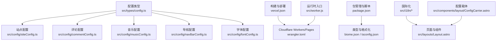
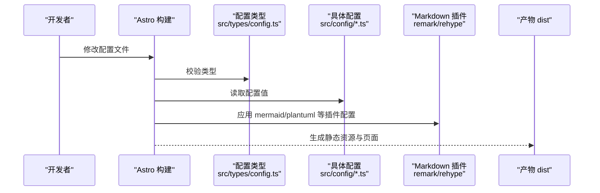
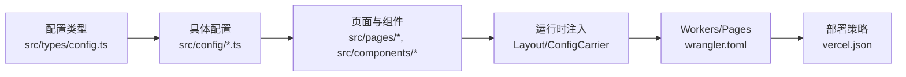

# 配置问题

<cite>
**本文引用的文件**
- [src/types/config.ts](file://src/types/config.ts)
- [vercel.json](file://vercel.json)
- [wrangler.toml](file://wrangler.toml)
- [package.json](file://package.json)
- [src/config/siteConfig.ts](file://src/config/siteConfig.ts)
- [src/config/commentConfig.ts](file://src/config/commentConfig.ts)
- [src/config/musicConfig.ts](file://src/config/musicConfig.ts)
- [src/config/navBarConfig.ts](file://src/config/navBarConfig.ts)
- [src/config/fontConfig.ts](file://src/config/fontConfig.ts)
- [src/i18n/languages/zh_CN.ts](file://src/i18n/languages/zh_CN.ts)
- [src/i18n/languages/en.ts](file://src/i18n/languages/en.ts)
- [src/i18n/translation.ts](file://src/i18n/translation.ts)
- [src/workers/ai-chat.js](file://src/workers/ai-chat.js)
- [src/workers/github-proxy.js](file://src/workers/github-proxy.js)
- [src/pages/config.astro](file://src/pages/config.astro)
- [src/components/edit/ConfigEditor.svelte](file://src/components/edit/ConfigEditor.svelte)
- [src/utils/setting-utils.ts](file://src/utils/setting-utils.ts)
- [src/layouts/Layout.astro](file://src/layouts/Layout.astro)
- [src/components/layout/ConfigCarrier.astro](file://src/components/layout/ConfigCarrier.astro)
- [src/plugins/remark-mermaid.js](file://src/plugins/remark-mermaid.js)
- [src/plugins/rehype-mermaid.mjs](file://src/plugins/rehype-mermaid.mjs)
- [src/plugins/remark-plantuml.js](file://src/plugins/remark-plantuml.js)
- [src/plugins/rehype-plantuml.mjs](file://src/plugins/rehype-plantuml.mjs)
- [src/components/analytics/UmamiAnalytics.astro](file://src/components/analytics/UmamiAnalytics.astro)
- [src/components/analytics/La51Analytics.astro](file://src/components/analytics/La51Analytics.astro)
- [src/components/analytics/GoogleAnalytics.astro](file://src/components/analytics/GoogleAnalytics.astro)
- [src/components/analytics/MicrosoftClarity.astro](file://src/components/analytics/MicrosoftClarity.astro)
- [src/components/comment/Giscus.astro](file://src/components/comment/Giscus.astro)
- [src/components/comment/Artalk.astro](file://src/components/comment/Artalk.astro)
- [src/components/comment/Waline.astro](file://src/components/comment/Waline.astro)
- [src/components/comment/Twikoo.astro](file://src/components/comment/Twikoo.astro)
- [src/components/comment/Disqus.astro](file://src/components/comment/Disqus.astro)
- [src/content.config.ts](file://src/content.config.ts)
- [src/env.d.ts](file://src/env.d.ts)
- [src/global.d.ts](file://src/global.d.ts)
- [src/worker.js](file://src/worker.js)
- [biome.json](file://biome.json)
- [tsconfig.json](file://tsconfig.json)
</cite>

## 目录
1. [引言](#引言)
2. [项目结构](#项目结构)
3. [核心组件](#核心组件)
4. [架构总览](#架构总览)
5. [详细组件分析](#详细组件分析)
6. [依赖分析](#依赖分析)
7. [性能考虑](#性能考虑)
8. [故障排查指南](#故障排查指南)
9. [结论](#结论)
10. [附录](#附录)

## 引言
本指南聚焦于本博客项目中的“配置问题”诊断与修复，覆盖站点配置错误、国际化设置问题、API密钥配置失败、环境变量未生效等常见场景。文档提供配置文件语法检查方法、默认值覆盖与优先级冲突的解决方案，说明如何验证配置更改是否正确生效（含热重载与重启后的状态检查），并给出生产环境与开发环境差异处理建议及配置备份与恢复的最佳实践。

## 项目结构
本项目采用 Astro + Svelte 的前端技术栈，配置主要分布在以下位置：
- 类型与配置：src/types/config.ts 定义了站点、导航、评论、分析、字体等配置类型；各功能模块在 src/config 下提供具体配置文件（如 siteConfig.ts、commentConfig.ts、musicConfig.ts 等）。
- 运行时与部署：vercel.json 用于 Vercel 构建与安全头配置；wrangler.toml 用于 Cloudflare Workers/Pages 的变量、命名空间与 AI 绑定。
- 开发与构建：package.json 定义脚本与依赖；biome.json、tsconfig.json 提供格式化与类型检查配置。
- 国际化：src/i18n 下的语言文件与翻译工具。
- 运行时注入：src/layouts/Layout.astro 与 src/components/layout/ConfigCarrier.astro 将配置注入到页面与组件。
- 分析与评论组件：src/components/analytics/* 与 src/components/comment/* 对应不同分析与评论系统的配置入口。

图表来源
- [src/types/config.ts:1-220](file://src/types/config.ts#L1-L220)
- [src/config/siteConfig.ts](file://src/config/siteConfig.ts)
- [src/config/commentConfig.ts](file://src/config/commentConfig.ts)
- [src/config/musicConfig.ts](file://src/config/musicConfig.ts)
- [src/config/navBarConfig.ts](file://src/config/navBarConfig.ts)
- [src/config/fontConfig.ts](file://src/config/fontConfig.ts)
- [vercel.json:1-40](file://vercel.json#L1-L40)
- [wrangler.toml:1-36](file://wrangler.toml#L1-L36)
- [package.json:1-112](file://package.json#L1-L112)
- [src/i18n/translation.ts](file://src/i18n/translation.ts)
- [src/layouts/Layout.astro](file://src/layouts/Layout.astro)
- [src/components/layout/ConfigCarrier.astro](file://src/components/layout/ConfigCarrier.astro)
- [src/worker.js](file://src/worker.js)

章节来源
- [src/types/config.ts:1-220](file://src/types/config.ts#L1-L220)
- [vercel.json:1-40](file://vercel.json#L1-L40)
- [wrangler.toml:1-36](file://wrangler.toml#L1-L36)
- [package.json:1-112](file://package.json#L1-L112)

## 核心组件
- 配置类型系统：src/types/config.ts 定义了站点、导航、评论、分析、字体、公告、侧边栏、看板娘、Live2D/Spine 模型、背景壁纸、广告、友链、音乐播放器等配置的 TypeScript 类型，确保配置文件的结构与字段合法。
- 站点配置：src/config/siteConfig.ts 提供站点元信息、语言、主题色、导航栏、页面开关、分页、统计分析、图片优化等配置。
- 评论系统：src/config/commentConfig.ts 定义评论系统类型与各平台（Twikoo、Waline、Giscus、Disqus、Artalk）的配置项。
- 分析与统计：src/components/analytics/* 与 wrangler.toml 中的变量绑定共同决定分析脚本的注入与运行。
- 国际化：src/i18n/languages/* 与 src/i18n/translation.ts 提供多语言支持与键值映射。
- 运行时注入：src/layouts/Layout.astro 与 src/components/layout/ConfigCarrier.astro 将配置注入到页面与组件树，便于在前端按需消费。

章节来源
- [src/types/config.ts:1-220](file://src/types/config.ts#L1-L220)
- [src/config/siteConfig.ts](file://src/config/siteConfig.ts)
- [src/config/commentConfig.ts](file://src/config/commentConfig.ts)
- [src/components/analytics/UmamiAnalytics.astro](file://src/components/analytics/UmamiAnalytics.astro)
- [src/i18n/languages/zh_CN.ts](file://src/i18n/languages/zh_CN.ts)
- [src/i18n/languages/en.ts](file://src/i18n/languages/en.ts)
- [src/i18n/translation.ts](file://src/i18n/translation.ts)
- [src/layouts/Layout.astro](file://src/layouts/Layout.astro)
- [src/components/layout/ConfigCarrier.astro](file://src/components/layout/ConfigCarrier.astro)

## 架构总览
配置在构建期与运行期的流转如下：
- 构建期：Astro 读取配置类型与具体配置文件，结合插件（如 mermaid、plantuml）进行内容与渲染配置的编译。
- 运行期：Layout 与 ConfigCarrier 将配置注入到页面，组件按需读取；Cloudflare Workers/Pages 通过 wrangler.toml 注入变量（如 Umami API、AI 绑定）；Vercel 通过 vercel.json 设置安全头与缓存策略。

图表来源
- [src/types/config.ts:1-220](file://src/types/config.ts#L1-L220)
- [src/config/siteConfig.ts](file://src/config/siteConfig.ts)
- [src/plugins/remark-mermaid.js](file://src/plugins/remark-mermaid.js)
- [src/plugins/rehype-mermaid.mjs](file://src/plugins/rehype-mermaid.mjs)
- [src/plugins/remark-plantuml.js](file://src/plugins/remark-plantuml.js)
- [src/plugins/rehype-plantuml.mjs](file://src/plugins/rehype-plantuml.mjs)

## 详细组件分析

### 站点配置（siteConfig）
- 关键点：站点元信息、语言、主题色、导航栏、页面开关、分页、统计分析、图片优化等。
- 常见问题：语言字段不在枚举内导致界面语言异常；导航项缺失或非法导致菜单不显示；统计 ID 缺失导致埋点无效。
- 诊断步骤：
  - 检查语言字段是否为受支持的枚举值。
  - 校验导航项的 id、type、parent、name/url 等字段是否齐全且合法。
  - 确认页面开关与实际路由一致，避免出现 404。
  - 若启用分析，确认对应 ID 已正确填写并在运行时注入。
- 验证方法：修改后执行构建命令，观察页面语言、导航与统计脚本是否按预期加载。

章节来源
- [src/types/config.ts:10-220](file://src/types/config.ts#L10-L220)
- [src/config/siteConfig.ts](file://src/config/siteConfig.ts)

### 评论系统配置（commentConfig）
- 关键点：type 字段决定启用的评论系统；各平台配置项（如 repo、serverURL、envId 等）必须完整。
- 常见问题：type 与平台配置不匹配；repoId、category 等参数缺失导致初始化失败；跨域或权限不足导致无法加载。
- 诊断步骤：
  - 确认 type 与平台配置对象一致。
  - 校验平台必需参数（如 Giscus 的 repo、repoId、categoryId 等）。
  - 检查服务端返回与网络请求状态。
- 验证方法：在文章页查看评论区是否正常加载；若使用在线编辑功能，需确保 GitHub App 的密钥与变量已在 Workers/Dashboard 正确配置。

章节来源
- [src/types/config.ts:303-356](file://src/types/config.ts#L303-L356)
- [src/config/commentConfig.ts](file://src/config/commentConfig.ts)
- [src/components/comment/Giscus.astro](file://src/components/comment/Giscus.astro)
- [src/components/comment/Artalk.astro](file://src/components/comment/Artalk.astro)
- [src/components/comment/Waline.astro](file://src/components/comment/Waline.astro)
- [src/components/comment/Twikoo.astro](file://src/components/comment/Twikoo.astro)
- [src/components/comment/Disqus.astro](file://src/components/comment/Disqus.astro)

### 分析与统计（Umami、La51、GA、Clarity）
- 关键点：wrangler.toml 中的变量（如 UMAMI_API_URL、UMAMI_WEBSITE_ID、UMAMI_TOKEN）与组件注入逻辑共同决定统计脚本的可用性。
- 常见问题：变量未在 Workers/Dashboard 设置导致运行时报错；Token 缺失导致隐私或鉴权失败；脚本未注入导致无数据。
- 诊断步骤：
  - 在 Workers/Dashboard 的 Variables 中核对敏感变量是否存在且值正确。
  - 在组件中确认注入逻辑是否生效（如 UmamiAnalytics.astro）。
  - 检查 vercel.json 的安全头与缓存策略是否影响第三方脚本加载。
- 验证方法：构建后在页面源码中查找统计脚本；使用浏览器开发者工具 Network 面板确认脚本请求成功。

章节来源
- [wrangler.toml:8-24](file://wrangler.toml#L8-L24)
- [src/components/analytics/UmamiAnalytics.astro](file://src/components/analytics/UmamiAnalytics.astro)
- [src/components/analytics/La51Analytics.astro](file://src/components/analytics/La51Analytics.astro)
- [src/components/analytics/GoogleAnalytics.astro](file://src/components/analytics/GoogleAnalytics.astro)
- [src/components/analytics/MicrosoftClarity.astro](file://src/components/analytics/MicrosoftClarity.astro)
- [vercel.json:6-37](file://vercel.json#L6-L37)

### 国际化（i18n）
- 关键点：语言文件位于 src/i18n/languages/*，翻译键值由 src/i18n/translation.ts 管理；页面与组件通过键值进行多语言渲染。
- 常见问题：语言文件缺失或键值不一致导致文案空白；语言切换逻辑未生效；键值拼写错误。
- 诊断步骤：
  - 校验语言文件中是否存在缺失的键值。
  - 确认 translation.ts 的映射关系与页面使用的键一致。
  - 检查语言切换流程是否正确更新当前语言。
- 验证方法：切换语言后观察页面文案是否随之变化；构建后在产物中确认语言资源打包完整。

章节来源
- [src/i18n/languages/zh_CN.ts](file://src/i18n/languages/zh_CN.ts)
- [src/i18n/languages/en.ts](file://src/i18n/languages/en.ts)
- [src/i18n/translation.ts](file://src/i18n/translation.ts)

### 配置编辑与热重载（编辑器与运行时）
- 关键点：src/components/edit/ConfigEditor.svelte 提供配置编辑界面；src/utils/setting-utils.ts 提供设置读写工具；src/pages/config.astro 提供配置页面入口。
- 常见问题：编辑器未保存或未触发热重载；运行时读取不到最新配置；页面未刷新。
- 诊断步骤：
  - 确认编辑器保存动作已触发。
  - 检查热重载机制（开发服务器）是否正常工作。
  - 在页面中手动刷新或强制刷新以应用最新配置。
- 验证方法：修改配置后立即在页面中看到变化；若为生产构建，需重新构建并部署以确保变更生效。

章节来源
- [src/components/edit/ConfigEditor.svelte](file://src/components/edit/ConfigEditor.svelte)
- [src/utils/setting-utils.ts](file://src/utils/setting-utils.ts)
- [src/pages/config.astro](file://src/pages/config.astro)

### 插件与渲染配置（Mermaid、PlantUML）
- 关键点：remark-mermaid 与 rehype-mermaid 用于代码块渲染；remark-plantuml 与 rehype-plantuml 用于 PlantUML 图表渲染。
- 常见问题：插件未启用或配置错误导致图表不显示；服务器地址不可达或主题未匹配。
- 诊断步骤：
  - 确认插件已安装并在 content.config.ts 中启用。
  - 校验渲染服务器地址与主题配置。
- 验证方法：在文章中插入 mermaid/plantuml 代码块，观察渲染结果。

章节来源
- [src/plugins/remark-mermaid.js](file://src/plugins/remark-mermaid.js)
- [src/plugins/rehype-mermaid.mjs](file://src/plugins/rehype-mermaid.mjs)
- [src/plugins/remark-plantuml.js](file://src/plugins/remark-plantuml.js)
- [src/plugins/rehype-plantuml.mjs](file://src/plugins/rehype-plantuml.mjs)
- [src/content.config.ts](file://src/content.config.ts)

## 依赖分析
- 配置类型与实现耦合：src/types/config.ts 作为配置的契约，被各具体配置文件与组件严格遵循。
- 运行时注入：Layout 与 ConfigCarrier 将配置注入到页面，组件通过 props 或上下文读取配置。
- 部署层绑定：wrangler.toml 通过 vars、kv_namespaces、vectorize、ai 等绑定将环境变量与服务暴露给运行时。
- 构建层策略：vercel.json 控制安全头与缓存策略，影响第三方脚本加载与静态资源缓存。

图表来源
- [src/types/config.ts:1-220](file://src/types/config.ts#L1-L220)
- [src/config/siteConfig.ts](file://src/config/siteConfig.ts)
- [src/layouts/Layout.astro](file://src/layouts/Layout.astro)
- [src/components/layout/ConfigCarrier.astro](file://src/components/layout/ConfigCarrier.astro)
- [wrangler.toml:1-36](file://wrangler.toml#L1-L36)
- [vercel.json:1-40](file://vercel.json#L1-L40)

章节来源
- [src/types/config.ts:1-220](file://src/types/config.ts#L1-L220)
- [wrangler.toml:1-36](file://wrangler.toml#L1-L36)
- [vercel.json:1-40](file://vercel.json#L1-L40)

## 性能考虑
- 图片优化：站点配置中的 imageOptimization 支持输出格式与质量控制，合理设置可降低带宽与提升加载速度。
- 缓存策略：vercel.json 中对静态资源设置了长期缓存与 immutable 策略，有助于减少重复请求。
- 字体与资源：字体配置与预加载选项会影响首屏渲染，建议结合 preload 与 fallback 策略优化体验。
- 分析脚本：统计脚本的注入与加载时机会影响页面性能，建议在必要时延迟加载或异步注入。

章节来源
- [src/types/config.ts:198-219](file://src/types/config.ts#L198-L219)
- [vercel.json:32-35](file://vercel.json#L32-L35)

## 故障排查指南

### 站点配置错误
- 症状：语言显示异常、导航菜单缺失、页面开关无效、统计无数据。
- 排查清单：
  - 检查语言字段是否在受支持枚举内。
  - 校验导航项 id、type、parent、name/url 是否齐全。
  - 确认页面开关与路由一致。
  - 若启用分析，检查对应 ID 是否正确填写并在运行时注入。
- 验证方法：构建后在页面中观察语言、导航与统计脚本是否按预期加载。

章节来源
- [src/types/config.ts:10-220](file://src/types/config.ts#L10-L220)
- [src/config/siteConfig.ts](file://src/config/siteConfig.ts)

### 国际化设置问题
- 症状：页面文案空白或显示键值而非翻译。
- 排查清单：
  - 确认语言文件中存在对应键值。
  - 检查 translation.ts 的映射关系。
  - 校验语言切换逻辑是否正确更新当前语言。
- 验证方法：切换语言后观察文案变化；构建后确认语言资源打包完整。

章节来源
- [src/i18n/languages/zh_CN.ts](file://src/i18n/languages/zh_CN.ts)
- [src/i18n/languages/en.ts](file://src/i18n/languages/en.ts)
- [src/i18n/translation.ts](file://src/i18n/translation.ts)

### API密钥配置失败
- 症状：评论系统无法加载、分析脚本报错、AI 功能不可用。
- 排查清单：
  - 在 Workers/Dashboard 的 Variables 中核对敏感变量（如 UMAMI_TOKEN、AI_API_KEY、GH_APP_ID、GH_PRIVATE_KEY 等）是否存在且值正确。
  - 确认组件注入逻辑（如 UmamiAnalytics.astro）是否生效。
  - 检查网络请求与跨域策略。
- 验证方法：在页面源码中查找统计脚本；Network 面板确认脚本请求成功；评论区加载状态。

章节来源
- [wrangler.toml:14-24](file://wrangler.toml#L14-L24)
- [src/components/analytics/UmamiAnalytics.astro](file://src/components/analytics/UmamiAnalytics.astro)
- [src/components/comment/Giscus.astro](file://src/components/comment/Giscus.astro)

### 环境变量未生效
- 症状：构建或运行时报变量未定义错误。
- 排查清单：
  - 在 wrangler.toml 的 [vars] 区域核对变量名与值。
  - 确认变量在 Workers/Dashboard 的 Secrets 中设置（如 UMAMI_TOKEN、AI_API_KEY）。
  - 检查 src/worker.js 或相关运行时入口是否正确读取变量。
- 验证方法：在运行时打印变量或通过调试接口查看；重新部署以确保变量生效。

章节来源
- [wrangler.toml:8-24](file://wrangler.toml#L8-L24)
- [src/worker.js](file://src/worker.js)

### 配置文件语法检查方法
- 使用类型检查：package.json 中提供 type-check 脚本，可对配置类型进行校验。
- 使用格式化与检查：biome.json 与 tsconfig.json 提供格式化与类型检查规则，建议在提交前执行格式化与检查。
- 使用构建脚本：执行构建命令，Astro 会在构建过程中校验配置类型与插件配置。

章节来源
- [package.json:12-18](file://package.json#L12-L18)
- [biome.json](file://biome.json)
- [tsconfig.json](file://tsconfig.json)

### 默认值覆盖与优先级冲突
- 优先级建议：
  - 运行时变量（如 wrangler.toml 的 vars 与 Secrets）优先于本地配置文件。
  - 本地配置文件优先于插件默认配置。
  - 页面级配置优先于全局配置。
- 冲突处理：
  - 若运行时变量缺失，回退到本地配置文件的默认值。
  - 若插件未启用，忽略其配置项。
  - 若页面未显式覆盖，使用全局配置。

章节来源
- [wrangler.toml:8-24](file://wrangler.toml#L8-L24)
- [src/config/siteConfig.ts](file://src/config/siteConfig.ts)

### 验证配置更改是否正确生效
- 热重载验证：在开发模式下修改配置后，观察页面是否即时更新；若未更新，尝试刷新页面或重启开发服务器。
- 重启后的状态检查：生产构建后，检查页面源码中的配置注入与第三方脚本加载情况；使用浏览器开发者工具 Network 面板确认请求成功。
- 部署后验证：在 Vercel/Workers/Pages 控制台查看部署日志与变量状态，确保变量已生效。

章节来源
- [src/components/edit/ConfigEditor.svelte](file://src/components/edit/ConfigEditor.svelte)
- [src/utils/setting-utils.ts](file://src/utils/setting-utils.ts)
- [vercel.json:6-37](file://vercel.json#L6-L37)

### 生产环境与开发环境差异处理
- 变量差异：生产环境使用 Workers/Dashboard 的 Secrets 与变量，开发环境使用本地 .env 或注释中的示例变量。
- 安全头与缓存：vercel.json 的安全头与缓存策略适用于生产环境，开发环境可适当放宽。
- 分析与评论：生产环境需确保分析 ID 与评论平台配置正确；开发环境可使用测试 ID 或禁用分析。

章节来源
- [wrangler.toml:14-24](file://wrangler.toml#L14-L24)
- [vercel.json:6-37](file://vercel.json#L6-L37)

### 配置备份与恢复最佳实践
- 备份策略：
  - 版本化管理：将配置文件纳入 Git，记录每次变更。
  - 环境隔离：区分开发、预发布、生产环境的配置文件与变量。
  - 导出变量：定期导出 Workers/Dashboard 的变量与 Secrets，形成备份清单。
- 恢复流程：
  - 从版本历史恢复配置文件。
  - 在 Workers/Dashboard 重新设置变量与 Secrets。
  - 重新构建与部署，验证配置生效。

章节来源
- [package.json:5-18](file://package.json#L5-L18)
- [wrangler.toml:14-24](file://wrangler.toml#L14-L24)

## 结论
本指南提供了针对站点配置、国际化、API密钥与环境变量的系统化诊断方法，并给出了默认值覆盖与优先级冲突的解决方案。通过类型检查、热重载验证与生产/开发差异处理，可有效降低配置错误带来的风险。建议在日常维护中坚持版本化管理与定期备份，确保配置变更可追溯、可恢复。

## 附录
- 常用命令与用途：
  - 开发：pnpm dev
  - 类型检查：pnpm type-check
  - 构建：pnpm build
  - 预览：pnpm preview
  - 格式化：pnpm format
  - 代码检查：pnpm lint
- 关键配置文件路径参考：
  - 站点配置：src/config/siteConfig.ts
  - 评论配置：src/config/commentConfig.ts
  - 分析组件：src/components/analytics/*
  - 国际化：src/i18n/*
  - 运行时注入：src/layouts/Layout.astro、src/components/layout/ConfigCarrier.astro
  - 部署配置：vercel.json、wrangler.toml
  - 插件配置：src/content.config.ts、src/plugins/*