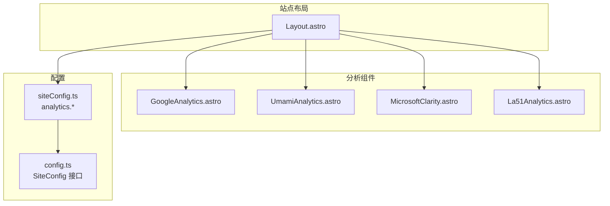
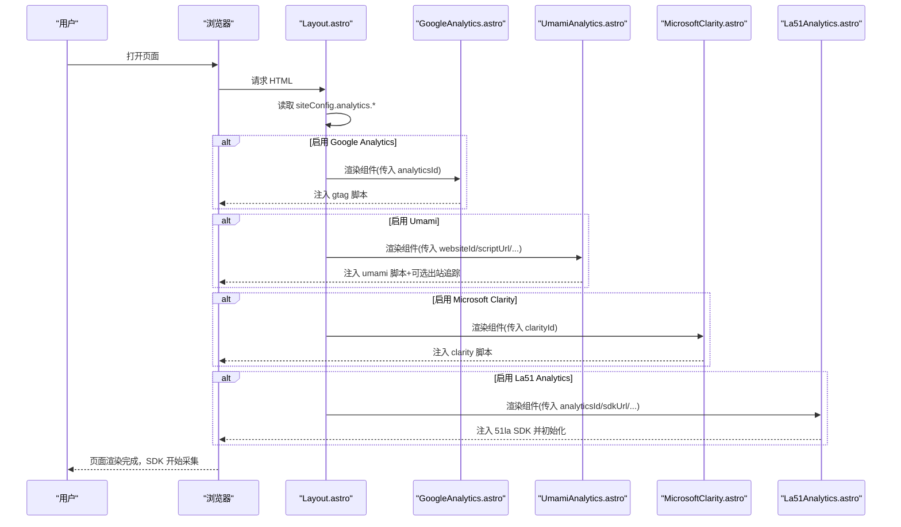
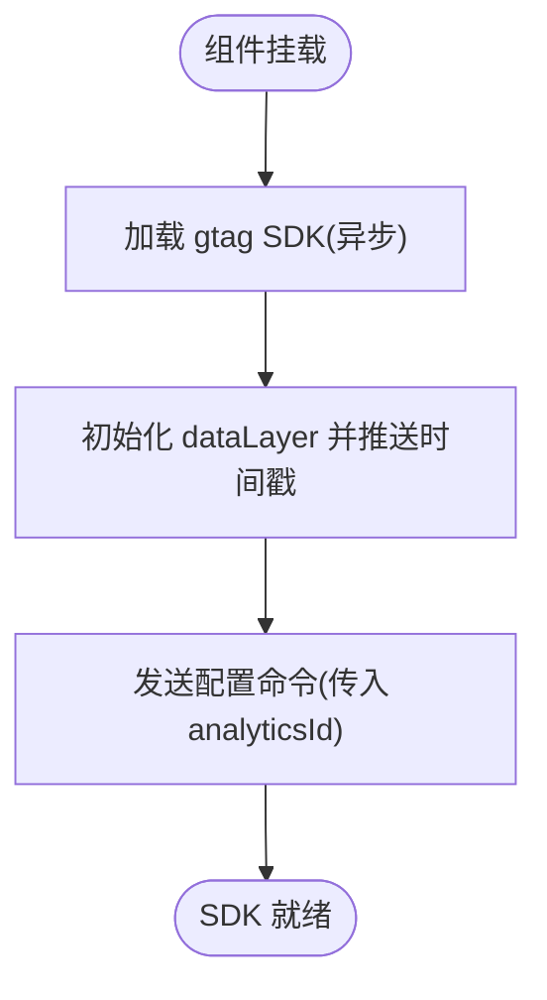
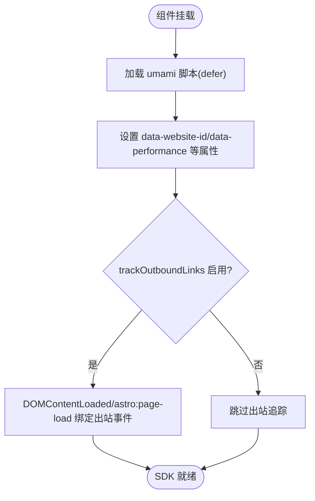
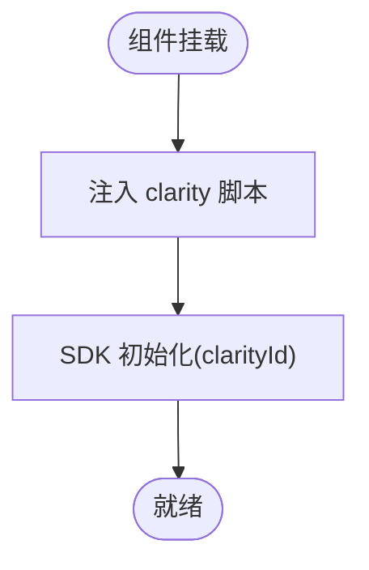
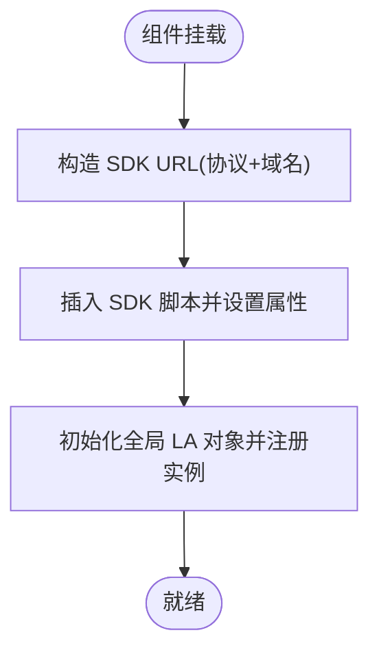
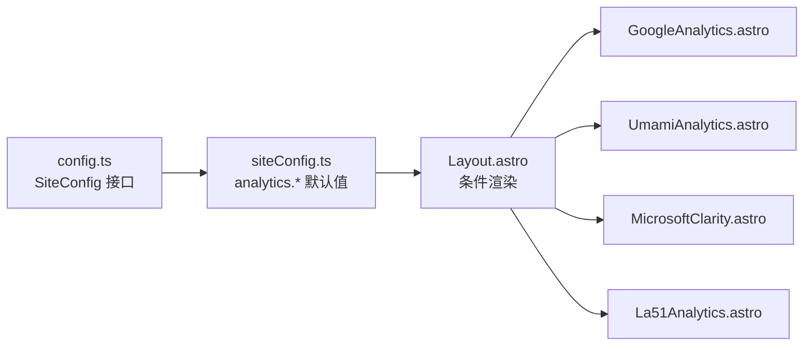

# 分析工具集成

<cite>
**本文引用的文件**
- [GoogleAnalytics.astro](file://src/components/analytics/GoogleAnalytics.astro)
- [UmamiAnalytics.astro](file://src/components/analytics/UmamiAnalytics.astro)
- [MicrosoftClarity.astro](file://src/components/analytics/MicrosoftClarity.astro)
- [La51Analytics.astro](file://src/components/analytics/La51Analytics.astro)
- [Layout.astro](file://src/layouts/Layout.astro)
- [siteConfig.ts](file://src/config/siteConfig.ts)
- [config.ts](file://src/types/config.ts)
- [package.json](file://package.json)
</cite>

## 目录
1. [简介](#简介)
2. [项目结构](#项目结构)
3. [核心组件](#核心组件)
4. [架构总览](#架构总览)
5. [详细组件分析](#详细组件分析)
6. [依赖关系分析](#依赖关系分析)
7. [性能考量](#性能考量)
8. [故障排查指南](#故障排查指南)
9. [结论](#结论)
10. [附录](#附录)

## 简介
本文件面向“分析工具集成”的技术文档，聚焦于本项目中集成的四类第三方分析服务：Google Analytics、Umami、Microsoft Clarity、La51 Analytics。文档将从系统架构、组件关系、数据流、处理逻辑、集成要点与最佳实践等维度展开，帮助开发者理解各工具的初始化流程、配置参数、数据收集机制与兼容性策略，并提供可操作的配置示例与排障建议。

## 项目结构
分析工具以 Astro 组件形式提供，统一在站点布局中按需注入。配置集中于站点配置文件，通过布尔开关与参数传递给对应组件，最终在页面头部以脚本形式注入第三方 SDK 或埋点代码。

图表来源
- [Layout.astro](file://src/layouts/Layout.astro)
- [GoogleAnalytics.astro](file://src/components/analytics/GoogleAnalytics.astro)
- [UmamiAnalytics.astro](file://src/components/analytics/UmamiAnalytics.astro)
- [MicrosoftClarity.astro](file://src/components/analytics/MicrosoftClarity.astro)
- [La51Analytics.astro](file://src/components/analytics/La51Analytics.astro)
- [siteConfig.ts](file://src/config/siteConfig.ts)
- [config.ts](file://src/types/config.ts)

章节来源
- [Layout.astro](file://src/layouts/Layout.astro)
- [siteConfig.ts](file://src/config/siteConfig.ts)
- [config.ts](file://src/types/config.ts)

## 核心组件
本节概述四个分析组件的职责与共同特征：
- 统一采用 Astro 组件封装，通过 props 接收配置参数
- 在页面头部以脚本形式注入第三方 SDK 或初始化代码
- 使用 Astro 的内联脚本能力与属性透传，结合站点配置实现按需启用
- 通过 data-swup-ignore-script 属性避免与 SPA 导航库产生冲突

章节来源
- [GoogleAnalytics.astro](file://src/components/analytics/GoogleAnalytics.astro)
- [UmamiAnalytics.astro](file://src/components/analytics/UmamiAnalytics.astro)
- [MicrosoftClarity.astro](file://src/components/analytics/MicrosoftClarity.astro)
- [La51Analytics.astro](file://src/components/analytics/La51Analytics.astro)

## 架构总览
下图展示分析工具在站点生命周期中的注入与执行路径：站点布局根据配置决定是否渲染各分析组件；组件在页面 head 中注入脚本；第三方 SDK 初始化并开始采集数据。

图表来源
- [Layout.astro](file://src/layouts/Layout.astro)
- [GoogleAnalytics.astro](file://src/components/analytics/GoogleAnalytics.astro)
- [UmamiAnalytics.astro](file://src/components/analytics/UmamiAnalytics.astro)
- [MicrosoftClarity.astro](file://src/components/analytics/MicrosoftClarity.astro)
- [La51Analytics.astro](file://src/components/analytics/La51Analytics.astro)

## 详细组件分析

### Google Analytics 组件
- 初始化流程
  - 通过异步脚本加载官方 gtag SDK，并传入 analyticsId
  - 初始化 dataLayer，推送初始化时间与配置命令
- 关键参数
  - analyticsId: Google Analytics 4 的测量 ID
- 数据收集机制
  - 通过 gtag API 记录页面浏览、事件等
- 兼容性与注意事项
  - 使用 is:inline 与 data-swup-ignore-script 避免与 SPA 导航冲突
  - 依赖外部域名资源，需确保网络可达

图表来源
- [GoogleAnalytics.astro](file://src/components/analytics/GoogleAnalytics.astro)

章节来源
- [GoogleAnalytics.astro](file://src/components/analytics/GoogleAnalytics.astro)

### Umami 组件
- 初始化流程
  - 通过 defer 脚本加载自定义或官方 umami 脚本
  - 通过 data-* 属性透传 websiteId、脚本地址、采样率、隐私遮罩等级、最大录制时长、排除选择器等
  - 可选启用出站链接追踪，动态为外部链接添加事件属性
- 关键参数
  - websiteId: 站点 ID
  - scriptUrl: 自定义脚本地址（支持自建）
  - trackOutboundLinks: 是否追踪出站链接
  - collectWebVitals: 是否收集 Web Vitals 指标
  - relpays: 会话回放配置（启用、采样率、遮罩级别、最大时长、排除选择器）
- 数据收集机制
  - SDK 自动采集页面浏览、事件、性能指标
  - 出站链接追踪通过 DOMContentLoaded 与 Astro 页面加载钩子动态绑定
- 兼容性与注意事项
  - 使用 defer 降低阻塞风险
  - relpays 选项涉及隐私与性能权衡，需谨慎配置

图表来源
- [UmamiAnalytics.astro](file://src/components/analytics/UmamiAnalytics.astro)

章节来源
- [UmamiAnalytics.astro](file://src/components/analytics/UmamiAnalytics.astro)

### Microsoft Clarity 组件
- 初始化流程
  - 注入官方 clarity 脚本，传入 clarityId
- 关键参数
  - clarityId: Clarity 项目 ID
- 数据收集机制
  - SDK 采集会话重放、热力图等数据
- 兼容性与注意事项
  - 使用 is:inline 与 data-swup-ignore-script 避免导航冲突

图表来源
- [MicrosoftClarity.astro](file://src/components/analytics/MicrosoftClarity.astro)

章节来源
- [MicrosoftClarity.astro](file://src/components/analytics/MicrosoftClarity.astro)

### La51 Analytics 组件
- 初始化流程
  - 动态注入 51la SDK，支持自定义 SDK 地址
  - 通过全局对象初始化 SDK，传入 analyticsId、ck、autoTrack、hashMode、screenRecord
- 关键参数
  - analyticsId: 51la 统计 ID
  - sdkUrl: SDK 地址（可选，用于规避 DNS 污染）
  - ck: 多 ID 数据隔离标识
  - autoTrack: 是否开启事件分析
  - hashMode: 单页路由模式（当前项目使用 History API，通常为 false）
  - screenRecord: 是否开启录屏
- 数据收集机制
  - SDK 自动采集 PV/UV、事件、录屏等
- 兼容性与注意事项
  - 支持自定义 SDK 地址，提升国内可用性
  - 录屏与事件分析可能带来性能与隐私影响

图表来源
- [La51Analytics.astro](file://src/components/analytics/La51Analytics.astro)

章节来源
- [La51Analytics.astro](file://src/components/analytics/La51Analytics.astro)

## 依赖关系分析
- 组件依赖
  - 四个分析组件均为纯前端注入，不引入额外运行时依赖
- 配置依赖
  - Layout.astro 依赖 siteConfig.analytics.* 以决定是否渲染组件
  - siteConfig.ts 提供默认空值，便于在未配置时安全禁用
- 类型约束
  - config.ts 的 SiteConfig 接口定义了 analytics 字段的可选结构，保证类型安全

图表来源
- [config.ts](file://src/types/config.ts)
- [siteConfig.ts](file://src/config/siteConfig.ts)
- [Layout.astro](file://src/layouts/Layout.astro)

章节来源
- [config.ts](file://src/types/config.ts)
- [siteConfig.ts](file://src/config/siteConfig.ts)
- [Layout.astro](file://src/layouts/Layout.astro)

## 性能考量
- 脚本加载策略
  - Umami 使用 defer，降低对首屏渲染的影响
  - Google Analytics 使用 async，避免阻塞解析
- 采样与隐私
  - Umami 的 relpays 支持采样率与遮罩级别，可在隐私与洞察之间平衡
  - La51 的 screenRecord 与 autoTrack 可能带来额外开销，建议按需启用
- 网络与可用性
  - Umami 支持自定义脚本地址，La51 支持自定义 SDK 地址，有助于规避网络问题
- 导航兼容
  - 统一使用 data-swup-ignore-script，避免与 SPA 导航库产生副作用

## 故障排查指南
- 常见问题定位
  - 无数据上报：确认 siteConfig.analytics.* 是否填写有效 ID，组件是否被渲染
  - 出站追踪无效：检查 trackOutboundLinks 是否启用，以及 DOM 加载时机
  - 录屏/隐私遮罩异常：核对 relpays 配置项（采样率、遮罩级别、最大时长、排除选择器）
  - 国内访问缓慢：尝试为 Umami/51la 设置自定义脚本地址
- 建议步骤
  - 在浏览器开发者工具 Network 面板确认第三方脚本加载成功
  - 在 Console 面板观察是否有 SDK 初始化错误
  - 临时关闭非关键功能（如录屏、会话回放）验证性能影响
- 降级策略
  - 若某分析服务不可用，保持其他服务正常运行
  - 通过 siteConfig.analytics.* 置空相应字段，实现完全禁用

章节来源
- [UmamiAnalytics.astro](file://src/components/analytics/UmamiAnalytics.astro)
- [La51Analytics.astro](file://src/components/analytics/La51Analytics.astro)
- [Layout.astro](file://src/layouts/Layout.astro)

## 结论
本项目通过轻量的 Astro 组件与集中式配置，实现了对 Google Analytics、Umami、Microsoft Clarity、La51 Analytics 的灵活集成。组件以脚本注入的方式与第三方 SDK 解耦，配合配置开关与参数透传，既满足功能需求，又兼顾性能与隐私。建议在生产环境中优先启用必要的基础采集（如页面浏览），再按需开启录屏与会话回放等高开销功能，并通过自定义脚本地址提升可用性。

## 附录

### 配置示例与最佳实践
- Google Analytics
  - 在 siteConfig.analytics.googleAnalyticsId 中填入测量 ID
  - 建议：保持默认启用，关注合规与隐私声明
- Umami
  - 在 siteConfig.analytics.umamiAnalytics 中配置 websiteId、scriptUrl、trackOutboundLinks、collectWebVitals
  - relpays 建议默认关闭，若启用请设置合理采样率与遮罩级别
  - 建议：优先使用自建脚本地址以提升稳定性
- Microsoft Clarity
  - 在 siteConfig.analytics.microsoftClarityId 中填入项目 ID
  - 建议：关注隐私政策，避免敏感信息采集
- La51 Analytics
  - 在 siteConfig.analytics.la51Analytics 中配置 Id、sdkUrl、ck、autoTrack、hashMode、screenRecord
  - 建议：国内部署时设置 sdkUrl，避免 DNS 污染导致加载失败

章节来源
- [siteConfig.ts](file://src/config/siteConfig.ts)
- [config.ts](file://src/types/config.ts)